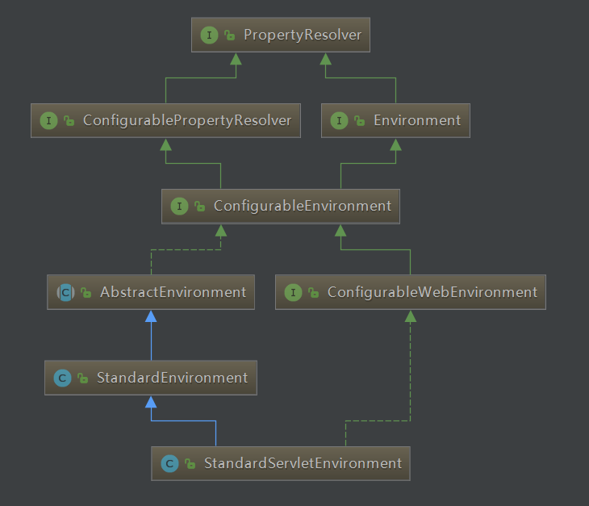
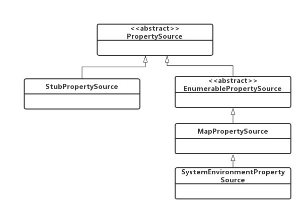
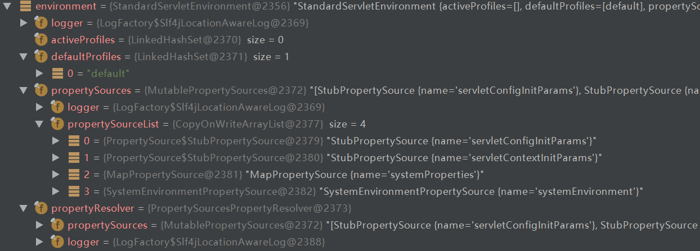
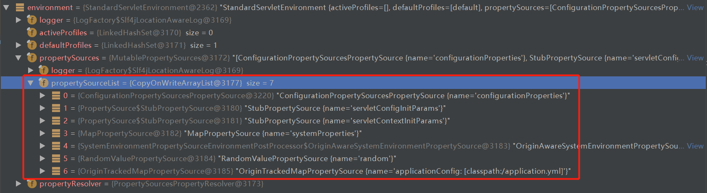

## 前言

此系列是针对springboot的启动，旨在于和大家一起来看看springboot启动的过程中到底做了一些什么事。如果大家对springboot的源码有所研究，可以挑些自己感兴趣或者对自己有帮助的看；但是如果大家没有研究过springboot的源码，不知道springboot在启动过程中做了些什么，那么我建议大家从头开始一篇一篇按顺序读该系列，不至于从中途插入，看的有些懵懂。当然，文中讲的不对的地方也欢迎大家指出，有待改善的地方也希望大家不吝赐教。老规矩：一周至少一更，中途会不定期的更新一些其他的博客，可能是springboot的源码，也可能是其他的源码解析，也有可能是其他的。

路漫漫其修远兮，吾将上下而求索！

github：[https://github.com/youzhibing](https://github.com/youzhibing)

码云(gitee)：[https://gitee.com/youzhibing](https://gitee.com/youzhibing)

## 前情回顾

大家还记得[上篇博文](https://www.cnblogs.com/youzhibing/p/9603119.html)讲了什么吗，或者说大家知道上篇博文讲了什么吗。这里帮大家做个简单回顾，主要是两个方法

1、getApplicationListeners

过滤出于与ApplicationStartingEvent匹配的监听器，过滤出的结果是：LoggingApplicationListener、BackgroundPreinitializer、DelegatingApplicationListener、LiquibaseServiceLocatorApplicationListener、EnableEncryptablePropertiesBeanFactoryPostProcessor五种类型的实例

2、invokeListener

调用getApplicationListeners过滤出的五个实例的onApplicationEvent方法，5个onApplicationEvent都做了啥，大体如下

LoggingApplicationListener：检测正在使用的日志系统，默认是logback，支持3种，优先级从高到低：logback > log4j
> javalog。此时日志系统还没有初始化

BackgroundPreinitializer：另起一个后台线程触发那些耗时的初始化，包括验证器、消息转换器等等，具体是哪些初始化见下代码，有兴趣的朋友可去跟下

    
    
    private void performPreinitialization() {
        try {
            Thread thread = new Thread(new Runnable() {
    
                @Override
                public void run() {
                    runSafely(new ConversionServiceInitializer());
                    runSafely(new ValidationInitializer());
                    runSafely(new MessageConverterInitializer());
                    runSafely(new MBeanFactoryInitializer());
                    runSafely(new JacksonInitializer());
                    runSafely(new CharsetInitializer());
                    preinitializationComplete.countDown();
                }
    
                public void runSafely(Runnable runnable) {
                    try {
                        runnable.run();
                    }
                    catch (Throwable ex) {
                        // Ignore
                    }
                }
    
            }, "background-preinit");
            thread.start();
        }
        catch (Exception ex) {
            // This will fail on GAE where creating threads is prohibited. We can safely
            // continue but startup will be slightly slower as the initialization will now
            // happen on the main thread.
            preinitializationComplete.countDown();
        }
    }

View Code

DelegatingApplicationListener：此时什么也没做

LiquibaseServiceLocatorApplicationListener：此时什么也没做

EnableEncryptablePropertiesBeanFactoryPostProcessor：此时仅仅打印了一句日志，其他什么也没做

简单点来说，就是检测正在使用的日志系统、另起一个后台线程执行耗时的初始化

## prepareEnvironment

讲prepareEnvironment之前，我们先来看看我们的战绩，我们对run方法完成了多少源码解读

    
    
    /**
     * Run the Spring application, creating and refreshing a new
     * {@link ApplicationContext}.
     * @param args the application arguments (usually passed from a Java main method)
     * @return a running {@link ApplicationContext}
     */
    public ConfigurableApplicationContext run(String... args) {
        // 秒表，用于记录启动时间；记录每个任务的时间，最后会输出每个任务的总费时
        StopWatch stopWatch = new StopWatch();
        stopWatch.start();
        // spring应用上下文，也就是我们所说的spring根容器
        ConfigurableApplicationContext context = null;
        // 自定义SpringApplication启动错误的回调接口
        Collection<SpringBootExceptionReporter> exceptionReporters = new ArrayList<>();
        // 设置jdk系统属性java.awt.headless，默认情况为true即开启；更多java.awt.headless信息大家可以去查阅资料，这不是本文重点
        configureHeadlessProperty();
        // 获取启动时监听器(EventPublishingRunListener实例)
        SpringApplicationRunListeners listeners = getRunListeners(args)
        // 触发启动事件，启动监听器会被调用，一共5个监听器被调用
        listeners.starting(); 
        try {
            // 参数封装，也就是在命令行下启动应用带的参数，如--server.port=9000
            ApplicationArguments applicationArguments = new DefaultApplicationArguments(
                    args);
            // 准备环境，这是本文的重点
            ConfigurableEnvironment environment = prepareEnvironment(listeners,
                    applicationArguments);
            configureIgnoreBeanInfo(environment);
            Banner printedBanner = printBanner(environment);
            context = createApplicationContext();
            exceptionReporters = getSpringFactoriesInstances(
                    SpringBootExceptionReporter.class,
                    new Class[] { ConfigurableApplicationContext.class }, context);
            prepareContext(context, environment, listeners, applicationArguments,
                    printedBanner);
            refreshContext(context);
            afterRefresh(context, applicationArguments);
            stopWatch.stop();
            if (this.logStartupInfo) {
                new StartupInfoLogger(this.mainApplicationClass)
                        .logStarted(getApplicationLog(), stopWatch);
            }
            listeners.started(context);
            callRunners(context, applicationArguments);
        }
        catch (Throwable ex) {
            handleRunFailure(context, ex, exceptionReporters, listeners);
            throw new IllegalStateException(ex);
        }
    
        try {
            listeners.running(context);
        }
        catch (Throwable ex) {
            handleRunFailure(context, ex, exceptionReporters, null);
            throw new IllegalStateException(ex);
        }
        return context;
    }

View Code

如果光从run方法的源代码比例来看，我们已经完成了将近一半的源码解析了，可真是这样的吗？我们先别急着否定，就当我们快完成一半的解析了（笑而不语）。既然我们都快完成了一半了，那么我们加把劲，今天来完成“这一半”。

prepareEnvironment按字面意思就是准备环境，那到底准备什么环境呢？我们一起来慢慢看，其源代码如下

    
    
    // 准备环境
    private ConfigurableEnvironment prepareEnvironment(
            SpringApplicationRunListeners listeners,
            ApplicationArguments applicationArguments) {
        // Create and configure the environment 创建和配置环境
    
        // 获取或创建环境
        ConfigurableEnvironment environment = getOrCreateEnvironment();
        // 配置环境：配置PropertySources和activeProfiles
        configureEnvironment(environment, applicationArguments.getSourceArgs());
        // listeners环境准备(就是广播ApplicationEnvironmentPreparedEvent事件)。还记得这个listeners怎么来的吗？
        listeners.environmentPrepared(environment);
        // 将环境绑定到SpringApplication
        bindToSpringApplication(environment);
        // 如果是非web环境，将环境转换成StandardEnvironment
        if (this.webApplicationType == WebApplicationType.NONE) {
            environment = new EnvironmentConverter(getClassLoader())
                    .convertToStandardEnvironmentIfNecessary(environment);
        }
        // 配置PropertySources对它自己的递归依赖
        ConfigurationPropertySources.attach(environment);
        return environment;
    }

View Code

内容不多，我们就一行一行的来跟源代码

###  getOrCreateEnvironment

从字面上看，这个方法的作用就是获取或创建环境，应该就是存在就直接返回，不存在则创建一个并返回。

    
    
    // 获取或创建Environment，很显然我们这里是创建StandardServletEnvironment
    private ConfigurableEnvironment getOrCreateEnvironment() {
        // 存在则直接返回
        if (this.environment != null) {
            return this.environment;
        }
        // 根据webApplicationType创建对应的Environment
        // webApplicationType的值还记得在哪获取到的吗？不知道的请去看我的springboot源码一
        if (this.webApplicationType == WebApplicationType.SERVLET) {
            return new StandardServletEnvironment();    // 标准的Servlet环境，也就是我们说的web环境
        }
        return new StandardEnvironment();                // 标准环境，非web环境
    }

View Code

还记得this.webApplicationType的值是什么吗，不记得的[点这里](https://www.cnblogs.com/youzhibing/p/9550343.html)寻找答案，在我的案例中其值就是WebApplicationType.SERVLET，那么很显然创建一个StandardServletEnvironment对象返回。

StandardServletEnvironment类图

StandardServletEnvironment继承自StandardEnvironment，也就是web环境是特殊的非web环境，有点类似正方形是特殊的长方形一样。AbstractEnvironment的构造方法调用了customizePropertySources方法，也就说StandardServletEnvironment在实例化的时候，他的customizePropertySources会被调用，customizePropertySources源代码如下

    
    
    @Override
    protected void customizePropertySources(MutablePropertySources propertySources) {
        propertySources.addLast(new StubPropertySource(SERVLET_CONFIG_PROPERTY_SOURCE_NAME));
        propertySources.addLast(new StubPropertySource(SERVLET_CONTEXT_PROPERTY_SOURCE_NAME));
        if (JndiLocatorDelegate.isDefaultJndiEnvironmentAvailable()) {
            propertySources.addLast(new JndiPropertySource(JNDI_PROPERTY_SOURCE_NAME));
        }
        super.customizePropertySources(propertySources);
    }

View Code

从上图中可以看出StandardServletEnvironment的customizePropertySources方法只是往propertySources中添加了两个名字叫servletConfigInitParams、servletContextInitParams的StubPropertySource对象，没更多的操作；而StandardEnvironment的customizePropertySources方法则往propertySources中添加了两个包含java系统属性和操作系统环境变量的两个对象：MapPropertySource和SystemEnvironmentPropertySource。

总结下，getOrCreateEnvironment方法创建并返回了一个环境：StandardServletEnvironment，该环境目前包含的内容如下

###  configureEnvironment

    
    
    protected void configureEnvironment(ConfigurableEnvironment environment,
        String[] args) {
        // 配置PropertySources
        configurePropertySources(environment, args);
        // 配置Profiles
        configureProfiles(environment, args);
    }

View Code

从源码看，将配置任务按顺序委托给configurePropertySources和configureProfiles，那么我们来看看这两个方法

configurePropertySources

    
    
    protected void configurePropertySources(ConfigurableEnvironment environment,
            String[] args) {
        MutablePropertySources sources = environment.getPropertySources();
        // 此时defaultProperties还是null，可能后续过程会初始化，具体详情请期待后续的博文
        if (this.defaultProperties != null && !this.defaultProperties.isEmpty()) {
            // 存在的话将其放到最后位置
            sources.addLast(
                    new MapPropertySource("defaultProperties", this.defaultProperties));
        }
        // 存在命令行参数，则解析它并封装进SimpleCommandLinePropertySource对象，同时将此对象放到sources的第一位置（优先级最高）
        if (this.addCommandLineProperties && args.length > 0) {
            String name = CommandLinePropertySource.COMMAND_LINE_PROPERTY_SOURCE_NAME;
            if (sources.contains(name)) {
                PropertySource<?> source = sources.get(name);
                CompositePropertySource composite = new CompositePropertySource(name);
                composite.addPropertySource(new SimpleCommandLinePropertySource(
                        "springApplicationCommandLineArgs", args));
                composite.addPropertySource(source);
                sources.replace(name, composite);
            }
            else {
                // 将其放到第一位置
                sources.addFirst(new SimpleCommandLinePropertySource(args));
            }
        }
    }

View Code

注释说明是增加、移除或者重排序应用环境中的PropertySource。就目前而言，如果有命令行参数则新增封装命令行参数的PropertySource，并将它放到sources的第一位置。

configureProfiles

    
    
    protected void configureProfiles(ConfigurableEnvironment environment, String[] args) {
        // 保证environment的activeProfiles属性被初始化了。从PropertySources中查找spring.profiles.active属性
        // 存在则将其值添加activeProfiles集合中。我们可以通过命令行参数指定该参数，但我们没有指定
        environment.getActiveProfiles(); // ensure they are initialized
        // But these ones should go first (last wins in a property key clash)
        // 如果存在其他的Profiles，则将这些Profiles放到第一的位置。此时没有，后面有没有后面再说
        Set<String> profiles = new LinkedHashSet<>(this.additionalProfiles);
        profiles.addAll(Arrays.asList(environment.getActiveProfiles()));
        environment.setActiveProfiles(StringUtils.toStringArray(profiles));
    }

View Code

配置应用环境中的哪些配置文件处于激活状态(或默认激活)。可以通过spring.profiles.active属性在配置文件处理期间激活其他配置文件。说的简单点就是设置哪些Profiles是激活的。

这3个方法都是protected，也就说鼓励被重写。重写configureEnvironment可以完全控制自定义环境，或者重写configurePropertySources或configureProfiles，进行更细粒度控制。

###  listeners.environmentPrepared(environment)

    
    
    public void environmentPrepared(ConfigurableEnvironment environment) {
        for (SpringApplicationRunListener listener : this.listeners) {
            listener.environmentPrepared(environment);
        }
    }

View Code

这个代码有没有很熟悉？，不清楚的[点这里](https://www.cnblogs.com/youzhibing/p/9603119.html)，查看其中的listeners.starting()。上次广播的是ApplicationStartingEvent事件，而这次广播的是ApplicationEnvironmentPreparedEvent事件。这里就不和大家一起跟源代码了，大家自行去跟哦。我在这总结下：

过滤出的与ApplicationEnvironmentPreparedEvent相匹配的监听器列表如下，他们的onApplicationEvent会被调用，大致做了以下事情：

ConfigFileApplicationListener  
1、加载EnvironmentPostProcessor列表，仍然是从META-
INF/spring.factories中加载（在SpringApplication实例化的时候已经加载了，这次是从缓存中读取），然后实例化；  
2、将自己也加入EnvironmentPostProcessor列表；ConfigFileApplicationListener实现了EnvironmentPostProcessor接口，可以看它的类图。  
3、对EnvironmentPostProcessor列表进行排序；排序之后，EnvironmentPostProcessor列表图如下：  
4、遍历EnvironmentPostProcessor列表，调用每个EnvironmentPostProcessor的postProcessEnvironment方法

SystemEnvironmentPropertySourceEnvironmentPostProcessor

将propertySourceList中名为systemEnvironment的SystemEnvironmentPropertySource对象替换成OriginAwareSystemEnvironmentPropertySource对象，source未变，还是SystemEnvironmentPropertySource对象的source；OriginAwareSystemEnvironmentPropertySource是SystemEnvironmentPropertySourceEnvironmentPostProcessor的静态内部类，且继承自SystemEnvironmentPropertySource。具体这么替换出于什么目的，便于原点查找？暂时还未知。

SpringApplicationJsonEnvironmentPostProcessor

spring.application.json(或SPRING_APPLICATION_JSON)是设置在系统属性或系统环境中；

如果spring.application.json(或SPRING_APPLICATION_JSON)有配置，那么给environment的propertySourceList增加JsonPropertySource，并将JsonPropertySource放到名叫systemProperties的PropertySource前；目前没有配置，那么此环境后处理器相当于什么也没做。

CloudFoundryVcapEnvironmentPostProcessor

云平台是否激活，激活了则给environment的propertySourceList增加名为vcap的PropertiesPropertySource对象，并将此对象放到命令行参数PropertySource（名叫commandLineArgs）后。很显然，我们没有激活云平台，那么此环境后处理器相当于什么也没做。

ConfigFileApplicationListener

添加名叫random的RandomValuePropertySource到名叫systemEnvironment的PropertySource后；

并初始化Profiles；初始化PropertiesPropertySourceLoader和YamlPropertySourceLoader这两个加载器从file:./config/,file:./,classpath:/config/,classpath:/路径下加载配置文件，PropertiesPropertySourceLoader加载配置文件application.xml和application.properties，YamlPropertySourceLoader加载配置文件application.yml和application.yaml。目前我们之后classpath:/路径下有个application.yml配置文件，将其属性配置封装进了一个名叫applicationConfig:[classpath:/application.yml]的OriginTrackedMapPropertySource中，并将此对象放到了propertySourceList的最后。

AnsiOutputApplicationListener

设置ansi输出，将AnsiOutput的属性enabled设置成ALWAYS，即允许ANSI-colored输出

LoggingApplicationListener

初始化日志系统  
ClasspathLoggingApplicationListener：没开启调试，所以什么也没做  
BackgroundPreinitializer：此时什么也没做  
DelegatingApplicationListener：此时什么也没做，因为环境中没有配置context.listener.classes属性  
FileEncodingApplicationListener：此时什么也没做，环境中没有spring.mandatory-file-encoding属性

EnableEncryptablePropertiesBeanFactoryPostProcessor：此时什么也没有做

environmentPrepared方法会触发所有监听了ApplicationEnvironmentPreparedEvent事件的监听器，这些监听器目前主要新增了两个PropertySource：RandomValuePropertySource和OriginTrackedMapPropertySource，这个OriginTrackedMapPropertySource一般就是我们应用的配置文件application.yml（application.properties）。

###  bindToSpringApplication(environment)

    
    
    /**
     * Bind the environment to the {@link SpringApplication}.
     * @param environment the environment to bind
     */
    protected void bindToSpringApplication(ConfigurableEnvironment environment) {
        try {
            Binder.get(environment).bind("spring.main", Bindable.ofInstance(this));
        }
        catch (Exception ex) {
            throw new IllegalStateException("Cannot bind to SpringApplication", ex);
        }
    }

View Code

代码比较简单，应该就是将environment绑定到SpringApplication，可我跟进去发现没有将environment绑定到SpringApplication，执行完bindToSpringApplication方法后，SpringApplication的属性environment仍是null，这我就有点懵圈了，那这个方法到底有什么用，有知道的朋友吗？

###  ConfigurationPropertySources.attach(environment)

    
    
    public static void attach(Environment environment) {
        // 判断environment是否是ConfigurableEnvironment的实例
        Assert.isInstanceOf(ConfigurableEnvironment.class, environment);
        // 从environment获取PropertySources
        MutablePropertySources sources = ((ConfigurableEnvironment) environment)
                .getPropertySources();
        PropertySource<?> attached = sources.get(ATTACHED_PROPERTY_SOURCE_NAME);
        if (attached != null && attached.getSource() != sources) {
            sources.remove(ATTACHED_PROPERTY_SOURCE_NAME);
            attached = null;
        }
        if (attached == null) {
            // 将sources封装成ConfigurationPropertySourcesPropertySource对象，并把这个对象放到sources的第一位置
            sources.addFirst(new ConfigurationPropertySourcesPropertySource(
                    ATTACHED_PROPERTY_SOURCE_NAME,
                    new SpringConfigurationPropertySources(sources)));
        }
    }

View Code

将sources封装成了一个名叫configurationProperties的ConfigurationPropertySourcesPropertySource对象，并把这个对象放到了sources的第一个位置。SpringConfigurationPropertySources是一个将MutablePropertySources转换成ConfigurationPropertySources的适配器。这就相当于sources的第一个元素是它自己，形成了一个自己对自己的递归依赖，这么做的目的是什么，暂时还不得而知，也许后面会有所体现，这里先当做一个疑问留着。

prepareEnvironment执行完后，此时environment中的内容如下：（重点看下propertySourceList）

## 总结

1、profile

直译的意思总感觉不对(其作用就是指定激活的配置文件，可以区分环境来加载不同的配置)，所以文中没有对其进行翻译，直接采用的原单词。有更好理解的小伙伴可以在评论区提供翻译。

2、资源文件

加载外部化配置的资源到environment，Spring
Boot设计了一个非常特别的PropertySource顺序，以允许对属性值进行合理的覆盖。具体有哪些外部化配置，以及他们的优先级情况可以参考《Spring
Boot Reference Guide》的第24章节

3、prepareEnvironment方法到底做了什么

加载外部化配置资源到environment，包括命令行参数、servletConfigInitParams、servletContextInitParams、systemProperties、sytemEnvironment、random、application.yml(.yaml/.xml/.properties)等；

初始化日志系统。

## 参考

[Spring Boot Reference Guide](https://docs.spring.io/spring-
boot/docs/2.0.3.RELEASE/reference/htmlsingle/)

