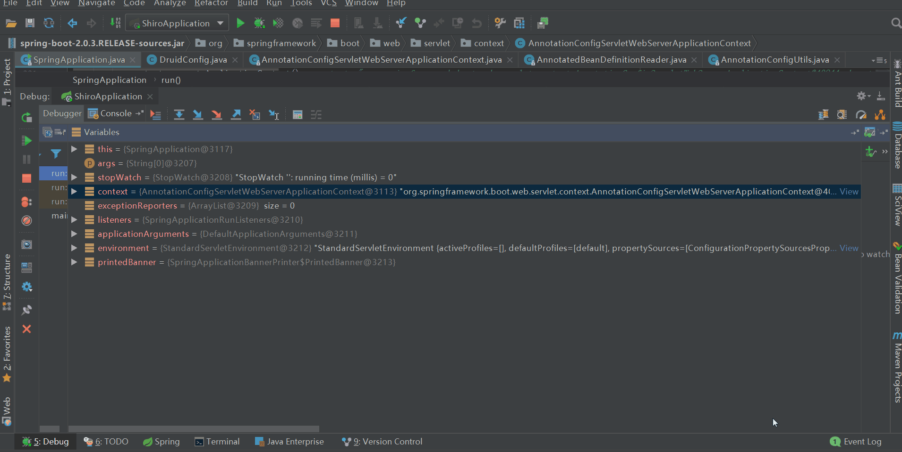
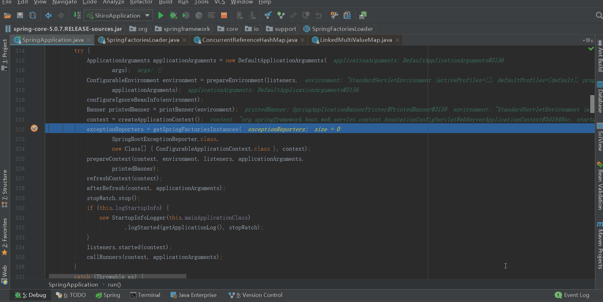
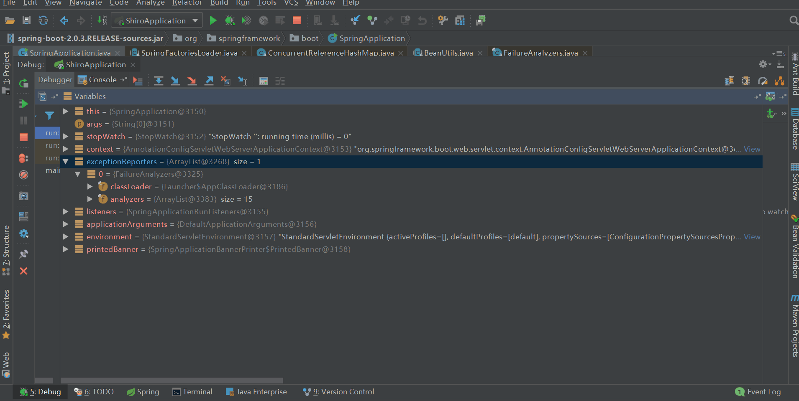
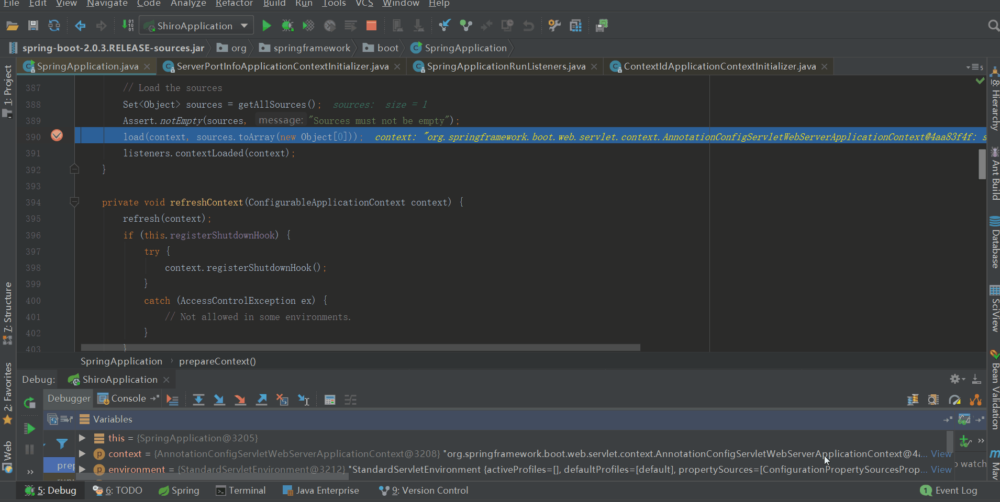
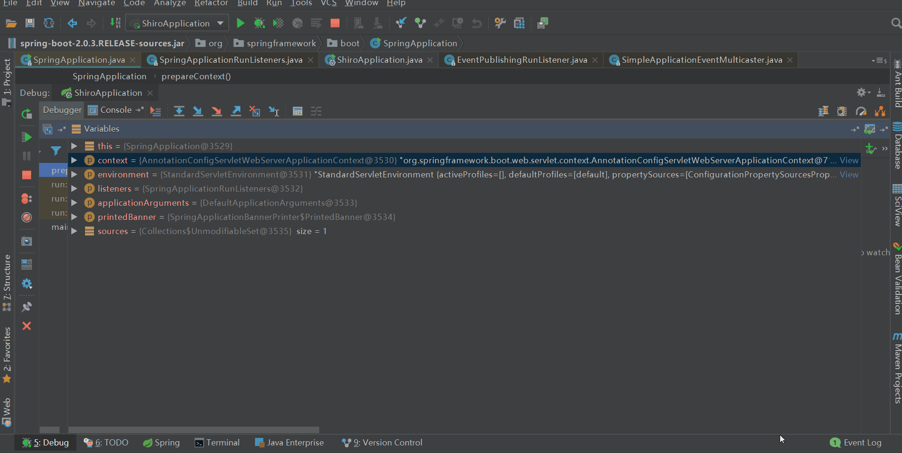

## 前言

此系列是针对springboot的启动，旨在于和大家一起来看看springboot启动的过程中到底做了一些什么事。如果大家对springboot的源码有所研究，可以挑些自己感兴趣或者对自己有帮助的看；但是如果大家没有研究过springboot的源码，不知道springboot在启动过程中做了些什么，那么我建议大家从头开始一篇一篇按顺序读该系列，不至于从中途插入，看的有些懵懂。当然，文中讲的不对的地方也欢迎大家指出，有待改善的地方也希望大家不吝赐教。老规矩：一周至少一更，中途会不定期的更新一些其他的博客，可能是springboot的源码，也可能是其他的源码解析，也有可能是其他的。

路漫漫其修远兮，吾将上下而求索！

github：[https://github.com/youzhibing](https://github.com/youzhibing)

码云(gitee)：[https://gitee.com/youzhibing](https://gitee.com/youzhibing)

## 前情回顾

大家还记得[上篇博文](https://www.cnblogs.com/youzhibing/p/9686969.html)讲了什么吗，或者说大家知道上篇博文讲了什么吗。这里帮大家做个简单回顾：

创建web应用上下文，对其部分属性：reader、scanner、beanFactory进行了实例化；reader中实例化了属性conditionEvaluator；scanner中添加了两个AnnotationTypeFilter：一个针对@Component，一个针对@ManagedBean；beanFactory中注册了8个注解配置处理器的Bean。应用上下文类型实际上是AnnotationConfigServletWebServerApplicationContext，beanFactory的类型是DefaultListableBeanFactory，这两个类型的类图大家重点看下，既是上篇博文的重点，也是接下来系列博客的基点。创建上下文的过程其实还创建了environment，本文中会涉及到environment，大家请留意。

通过createApplicationContext方法之后，context的包含的主要内容如下：

## prepareContext

先欣赏下我们的战绩，看看我们对run方法完成了多少的源码解读

    
    
    /**
     * Run the Spring application, creating and refreshing a new
     * {@link ApplicationContext}.
     * @param args the application arguments (usually passed from a Java main method)
     * @return a running {@link ApplicationContext}
     */
    public ConfigurableApplicationContext run(String... args) {
        // 秒表，用于记录启动时间；记录每个任务的时间，最后会输出每个任务的总费时
        StopWatch stopWatch = new StopWatch();
        stopWatch.start();
        // spring应用上下文，也就是我们所说的spring根容器
        ConfigurableApplicationContext context = null;
        // 自定义SpringApplication启动错误的回调接口
        Collection<SpringBootExceptionReporter> exceptionReporters = new ArrayList<>();
        // 设置jdk系统属性java.awt.headless，默认情况为true即开启
        configureHeadlessProperty();
        // 获取启动时监听器(EventPublishingRunListener实例)
        SpringApplicationRunListeners listeners = getRunListeners(args)
        // 触发ApplicationStartingEvent事件，启动监听器会被调用，一共5个监听器被调用，但只有两个监听器在此时做了事
        listeners.starting(); 
        try {
            // 参数封装，也就是在命令行下启动应用带的参数，如--server.port=9000
            ApplicationArguments applicationArguments = new DefaultApplicationArguments(
                    args);
            // 准备环境：1、加载外部化配置的资源到environment；2、触发ApplicationEnvironmentPreparedEvent事件
            ConfigurableEnvironment environment = prepareEnvironment(listeners,
                    applicationArguments);
            // 配置spring.beaninfo.ignore，并添加到名叫systemProperties的PropertySource中；默认为true即开启
            configureIgnoreBeanInfo(environment);
            // 打印banner图
            Banner printedBanner = printBanner(environment);
            // 创建应用上下文，并实例化了其三个属性：reader、scanner和beanFactory
            context = createApplicationContext();
            // 获取异常报道器，即加载spring.factories中的SpringBootExceptionReporter实现类
            exceptionReporters = getSpringFactoriesInstances(
                    SpringBootExceptionReporter.class,
                    new Class[] { ConfigurableApplicationContext.class }, context);
            // 准备上下文，本文重点
            prepareContext(context, environment, listeners, applicationArguments,
                    printedBanner);
            refreshContext(context);
            afterRefresh(context, applicationArguments);
            stopWatch.stop();
            if (this.logStartupInfo) {
                new StartupInfoLogger(this.mainApplicationClass)
                        .logStarted(getApplicationLog(), stopWatch);
            }
            listeners.started(context);
            callRunners(context, applicationArguments);
        }
        catch (Throwable ex) {
            handleRunFailure(context, ex, exceptionReporters, listeners);
            throw new IllegalStateException(ex);
        }
    
        try {
            listeners.running(context);
        }
        catch (Throwable ex) {
            handleRunFailure(context, ex, exceptionReporters, null);
            throw new IllegalStateException(ex);
        }
        return context;
    }

View Code

###  前菜

exceptionReporters =
getSpringFactoriesInstances(SpringBootExceptionReporter.class,new Class[] {
ConfigurableApplicationContext.class }, context);

getSpringFactoriesInstances这个方法在[之前](https://www.cnblogs.com/youzhibing/p/9550343.html)已经讲过，就是加载META-
INF/spring.factories中指定类型的bean集合。如下图

SpringBootExceptionReporter是一个回调接口，用于支持对SpringApplication启动错误的自定义报告。

先根据SpringBootExceptionReporter获取FailureAnalyzers的全限定类名，实例化FailureAnalyzers的时候，再次调用SpringFactoriesLoader.loadFactoryNames方法获取类型为FailureAnalyzer的名称列表，然后再根据名称列表实例化bean列表。

bean列表创建好之后，设置bean列表中满足条件的bean的beanFactory和environment，同时也将部分bean应用到context的environment和beanFactory中，代码如下

    
    
    private void prepareFailureAnalyzers(List<FailureAnalyzer> analyzers,
            ConfigurableApplicationContext context) {
        for (FailureAnalyzer analyzer : analyzers) {
            prepareAnalyzer(context, analyzer);
        }
    }
    
    private void prepareAnalyzer(ConfigurableApplicationContext context,
            FailureAnalyzer analyzer) {
        if (analyzer instanceof BeanFactoryAware) {
            ((BeanFactoryAware) analyzer).setBeanFactory(context.getBeanFactory());
        }
        if (analyzer instanceof EnvironmentAware) {
            ((EnvironmentAware) analyzer).setEnvironment(context.getEnvironment());
        }
    }

View Code

其中NoSuchBeanDefinitionFailureAnalyer bean的setBeanFactory方法

    
    
    @Override
    public void setBeanFactory(BeanFactory beanFactory) throws BeansException {
        Assert.isInstanceOf(ConfigurableListableBeanFactory.class, beanFactory);
        this.beanFactory = (ConfigurableListableBeanFactory) beanFactory;
        this.metadataReaderFactory = new CachingMetadataReaderFactory(
                this.beanFactory.getBeanClassLoader());
        // Get early as won"t be accessible once context has failed to start
        this.report = ConditionEvaluationReport.get(this.beanFactory);        // 往beanFactory中注册autoConfigurationReport
    }

View Code

往beanFactory中注册一个名叫autoConfigurationReport的单例bean（类型是ConditionEvaluationReport），这个bean用于后面自动配置条件评估的详情报告与日志记录。

exceptionReporters 获取成功后，我们来看看beanFactory的变化

###  正餐

prepareContext内容不多，源代码如下

    
    
    private void prepareContext(ConfigurableApplicationContext context,
            ConfigurableEnvironment environment, SpringApplicationRunListeners listeners,
            ApplicationArguments applicationArguments, Banner printedBanner) {
        // 设置上下文的environment
        context.setEnvironment(environment);
        // 应用上下文后处理
        postProcessApplicationContext(context);
        // 在context refresh之前，对其应用ApplicationContextInitializer
        applyInitializers(context);
        // 上下文准备（目前是空实现，可用于拓展）
        listeners.contextPrepared(context);
        // 打印启动日志和启动应用的Profile
        if (this.logStartupInfo) {
            logStartupInfo(context.getParent() == null);
            logStartupProfileInfo(context);
        }
    
        // Add boot specific singleton beans
        context.getBeanFactory().registerSingleton("springApplicationArguments",
                applicationArguments);                                // 向beanFactory注册单例bean：命令行参数bean
        if (printedBanner != null) {
            // 向beanFactory注册单例bean：banner bean
            context.getBeanFactory().registerSingleton("springBootBanner", printedBanner);
        }
    
        // Load the sources
        Set<Object> sources = getAllSources();                        // 获取全部资源，其实就一个：SpringApplication的primarySources属性
        Assert.notEmpty(sources, "Sources must not be empty");        // 断言资源是否为空
        // 将bean加载到应用上下文中
        load(context, sources.toArray(new Object[0]));
        // 向上下文中添加ApplicationListener，并广播ApplicationPreparedEvent事件
        listeners.contextLoaded(context);
    }

View Code

我们逐个方法来看

####  context.setEnvironment(environment)

    
    
    /**
     * {@inheritDoc}
     * 

     * Delegates given environment to underlying {@link AnnotatedBeanDefinitionReader} and
     * {@link ClassPathBeanDefinitionScanner} members.
     */
    @Override
    public void setEnvironment(ConfigurableEnvironment environment) {
        super.setEnvironment(environment);            // 设置context的environment
        this.reader.setEnvironment(environment);    // 实例化context的reader属性的conditionEvaluator属性
        this.scanner.setEnvironment(environment);    // 设置context的scanner属性的environment属性
    }

View Code

将context中相关的environment全部替换成SpringApplication中创建的environment。还记得[这篇](https://www.cnblogs.com/youzhibing/p/9686969.html)中的疑问吗，引申下就是：之前我们的应用中有两个environment，一个在context中，一个在SpringApplication中。经过此方法后，就只会存在SpringApplication中的environment了，而context中的原environment会被回收。

####  postProcessApplicationContext(context);

    
    
    /**
     * Apply any relevant post processing the {@link ApplicationContext}. Subclasses can
     * apply additional processing as required.
     * @param context the application context
     */
    protected void postProcessApplicationContext(ConfigurableApplicationContext context) {
        if (this.beanNameGenerator != null) {
            context.getBeanFactory().registerSingleton(
                    AnnotationConfigUtils.CONFIGURATION_BEAN_NAME_GENERATOR,
                    this.beanNameGenerator);
        }
        if (this.resourceLoader != null) {
            if (context instanceof GenericApplicationContext) {
                ((GenericApplicationContext) context)
                        .setResourceLoader(this.resourceLoader);
            }
            if (context instanceof DefaultResourceLoader) {
                ((DefaultResourceLoader) context)
                        .setClassLoader(this.resourceLoader.getClassLoader());
            }
        }
    }

View Code

上下文后处理。SpringApplication子类可以根据需要应用其他处理。

由于当前SpringApplication实例的属性：beanNameGenerator和resourceLoader都为null，所以此方法目前相当于什么也没做。此方法可能是我们定制SpringApplication所用。

####  applyInitializers(context);

    
    
    /**
     * Apply any {@link ApplicationContextInitializer}s to the context before it is
     * refreshed.
     * @param context the configured ApplicationContext (not refreshed yet)
     * @see ConfigurableApplicationContext#refresh()
     */
    @SuppressWarnings({ "rawtypes", "unchecked" })
    protected void applyInitializers(ConfigurableApplicationContext context) {
        for (ApplicationContextInitializer initializer : getInitializers()) {
            // 解析当前initializer实现的ApplicationContextInitializer的泛型参数
            Class<?> requiredType = GenericTypeResolver.resolveTypeArgument(
                    initializer.getClass(), ApplicationContextInitializer.class);
            // 断言context是否是requiredType的实例
            Assert.isInstanceOf(requiredType, context, "Unable to call initializer.");
            // 向context应用初始化器
            initializer.initialize(context);
        }
    }

View Code

在context
refresh之前应用ApplicationContextInitializer到context中。还记得SpringApplication的属性initializers吗，不记得的可以点[这里](https://www.cnblogs.com/youzhibing/p/9550343.html)。

一共6个initializer，他们的initialize方法都被调用，源代码就不跟了，上图中已经进行了展示，我们总结下

**DelegatingApplicationContextInitializer**

environment没有context.initializer.classes配置项，所以相当于没有做任何事。

如果配置了context.initializer.classes，获取其值（逗号分隔的initializer列表字符串），转换成class列表，根据classes列表进行实例化获取initializer实例列表，再对每个initializer实例调用initialize方法。

DelegatingApplicationContextInitializer相当于context.initializer.classes的代理，最终还是会执行到被代理的initializer的initialize方法。  
**ContextIdApplicationContextInitializer**

设置application id：从environment中获取spring.application.name配置项的值，并把设置成application
id，若没有配置spring.application.name，则取默认值application；

将application id封装成ContextId对象，注册到beanFactory中。

**ConfigurationWarningsApplicationContextInitializer**

向上下文注册了一个BeanFactoryPostProcessor：ConfigurationWarningsPostProcessor实例；

实例化ConfigurationWarningsPostProcessor的时候，也实例化了它的属性Check[]
checks，check中只有一个类型是ComponentScanPackageCheck的实例。  
**ServerPortInfoApplicationContextInitializer**

向上下文注册了一个ApplicationListener：ServerPortInfoApplicationContextInitializer对象自己；

ServerPortInfoApplicationContextInitializer实现了ApplicationListener
<WebServerInitializedEvent>，所以他本身就是一个ApplicationListener。  
**SharedMetadataReaderFactoryContextInitializer**

向context注册了一个BeanFactoryPostProcessor：CachingMetadataReaderFactoryPostProcessor实例。  
**ConditionEvaluationReportLoggingListener**

将上下文赋值给自己的属性applicationContext；

向上下文注册了一个ApplicationListener：ConditionEvaluationReportListener实例；

从beanFactory中获取名为autoConfigurationReport的bean赋值给自己的属性report。

####  listeners.contextPrepared(context);

还记得SpringApplicationRunListeners中listeners属性吗，没错，里面就一个EventPublishingRunListener对象。

调用EventPublishingRunListener的contextPrepared，发现其是空实现。

也就是相当于啥事也没做。

####  load(context, sources.toArray(new Object[0]));

创建了一个BeanDefinitionLoader对象；BeanDefinitionLoader作为AnnotatedBeanDefinitionReader，XmlBeanDefinitionReader和ClassPathBeanDefinitionScanner的门面，从底层源加载bean定义，包括XML和JavaConfig；

能被加载的source类型包括：Class、Resource、Package和CharSequence四种，每种类型的加载方式也不一样，Class用AnnotatedBeanDefinitionReader处理、Resource用XmlBeanDefinitionReader处理、Package用ClassPathBeanDefinitionScanner，而CharSequence则比较特殊了，它按Class、Resource、Package的顺序处理，哪种处理成功就按哪种处理（CharSequence方式貌似很少用，反正我还没用过）；

而目前我们的source只有一个：class
com.lee.shiro.ShiroApplication，是class类型；先判断ShiroApplication是否有被component注解修饰，很显然是（SpringBootApplication注解中包含component注解），那么AnnotatedBeanDefinitionReader来处理：将com.lee.shiro.ShiroApplication封装成一个名叫ShiroApplication的BeanDefinition对象，并将其注册到了beanFactory的BeanDefinitionMap中。

####  listeners.contextLoaded(context);

#### 

还记得SpringApplication的属性listeners吗，不记得的可以点[
这里](https://www.cnblogs.com/youzhibing/p/9550343.html)。将这些ApplicationListener注册到了上下文中，具体包括ConfigFileApplicationListener,AnsiOutputApplicationListener,LoggingApplicationListener,ClasspathLoggingApplicationListener,BackgroundPreinitializer,DelegatingApplicationListener,ParentContextCloserApplicationListener(实现了ApplicationContextAware接口；将上下文赋值给了属性context，相当于有了上下文的引用),ClearCachesApplicationListener,FileEncodingApplicationListener,LiquibaseServiceLocatorApplicationListener,EnableEncryptablePropertiesBeanFactoryPostProcessor。

广播ApplicationPreparedEvent事件，并触发对应的事件。过滤出匹配事件的监听器可以查看[这里](https://www.cnblogs.com/youzhibing/p/9603119.html)，一共过滤出5个监听器，他们的onApplicationEvent方法会被调用，具体做了如下事情：

**ConfigFileApplicationListener**

向context注册了一个BeanFactoryPostProcessor：PropertySourceOrderingPostProcessor实例；该实例后面会对我们的property
sources进行重排序，另外该实例拥有上下文的引用。

**LoggingApplicationListener**

向beanFactory中注册了一个名叫springBootLoggingSystem的单例bean，也就是我们的日志系统bean。

**BackgroundPreinitializer**

目前什么也没做

**DelegatingApplicationListener**

目前什么也没做

**EnableEncryptablePropertiesBeanFactoryPostProcessor**

仅仅打印了一句debug日志，相当于什么也没做

###  甜点

一开始还以为本文内容不会多，但分析分析着，发现内容不少。不管我们是吃撑了还是没吃饱，都来点甜点收尾。

一般一个单例对象注册到beanFactory中，beanFactory会有2个属性都添加此单例对象信息：singletonObjects、registeredSingletons

Map <String, Object> singletonObjects = new ConcurrentHashMap<>()，key是bean
name，value是单例对象

Set<String> registeredSingletons = new LinkedHashSet<>()，存放的是bean name

一般一个bean定义注册到beanFactory中是，beanFactory也会有2个属相会添加此bean定义信息：beanDefinitionMap、beanDefinitionNames

List<String> beanDefinitionNames = new ArrayList<>()，beanDefinition的名称列表  
Map<String, BeanDefinition> beanDefinitionMap = new
ConcurrentHashMap<>()，key是beanDefinition的名称，value是beanDefinition对象

另外beanFactory中Set<String> manualSingletonNames = new
LinkedHashSet<>，按注册顺序存放手动注册的单例的名称。

load方法，我会放到另一篇博文中重点分析；load负责加载bean定义资源，应该是挺重要的，而本文却讲的比较粗糙，我们一起期待吧。

有时候，不是对手有多强大，只是我们不敢去尝试；勇敢踏出第一步，你会发现自己比想象中更优秀！诚如海因斯第一次跑进人类10s大关时所说：上帝啊，原来那扇门是虚掩着的！

## 总结

1、上文中的load

就是加载bean定义资源，支持4种方式：Class、Resource、Package和CharSequence。

Class：注解形式的Bean定义；AnnotatedBeanDefinitionReader负责处理。

Resource：一般而言指的是xml
bean配置文件，也就是我们在spring中常用的xml配置。xml的加载大家可以去阅读《Spring源码深度解析》。说的简单点就是：将xml的bean定义封装成BeanDefinition并注册到beanFactory的BeanDefinitionMap中；XmlBeanDefinitionReader负责处理。

Package：以扫包的方式扫描bean定义； ClassPathBeanDefinitionScanner负责处理。

CharSequence：以先后顺序进行匹配Class、Resource或Package进行加载，谁匹配上了就用谁的处理方式处理。

当然还支持Groovy形式的Bean定义，有兴趣的朋友可以自行去跟下源代码。

springboot鼓励用java类实现java bean定义，所以springboot应用中，我们一般只需要关注Class方式、Package方式即可。

2、prepareContext到底做了什么

1、将context中的environment替换成SpringApplication中创建的environment  
2、将SpringApplication中的initializers应用到context中  
设置application id，并将application id封装成ContextId对象，注册到beanFactory中  
向context的beanFactoryPostProcessors中注册了一个ConfigurationWarningsPostProcessor实例  
向context的applicationListeners中注册了一个ServerPortInfoApplicationContextInitializer实例  
向context的beanFactoryPostProcessors中注册了一个CachingMetadataReaderFactoryPostProcessor实例  
向context的applicationListeners中注册了一个ConditionEvaluationReportListener实例

3、加载两个单例bean到beanFactory中

向beanFactory中注册了一个名叫springApplicationArguments的单例bean，该bean封装了我们的命令行参数；  
向beanFactory中注册了一个名叫springBootBanner的单例bean。

4、加载bean定义资源  
资源文件只有SpringApplication的primarySources集合，里面就一个资源类：com.lee.shiro.ShiroApplication；  
将该资源封装成了名叫ShiroApplication的BeanDefinition对象，并将其注册到了beanFactory的BeanDefinitionMap中。  
5、将SpringApplication中的listeners注册到context中，并广播ApplicationPreparedEvent事件  
总共11个ApplicationListener注册到了context的applicationListeners中；  
ApplicationPreparedEvent事件的监听器一共做了两件事  
向context的beanFactoryPostProcessors中注册了一个PropertySourceOrderingPostProcessor实例  
向beanFactory中注册了一个名叫springBootLoggingSystem的单例bean，也就是我们的日志系统bean

context中主要是三个属性增加了内容：beanFactory、beanFactoryPostProcessors和applicationListeners，到目前为止，context的内容如下

## 参考

《Spring源码深度解析》

[Spring Boot Reference Guide](https://docs.spring.io/spring-
boot/docs/2.0.3.RELEASE/reference/htmlsingle/)

Spring boot 源码

