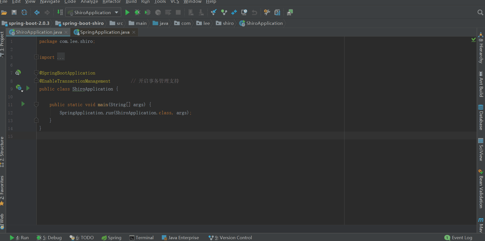
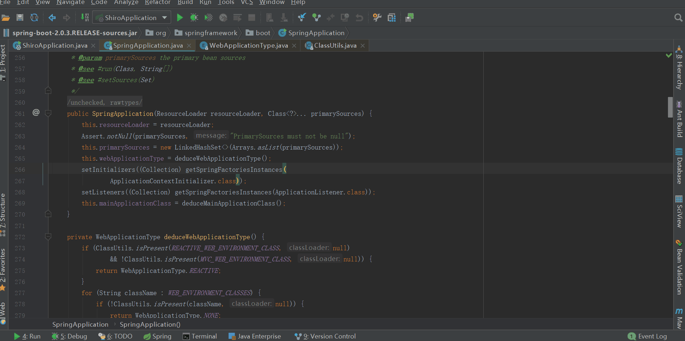
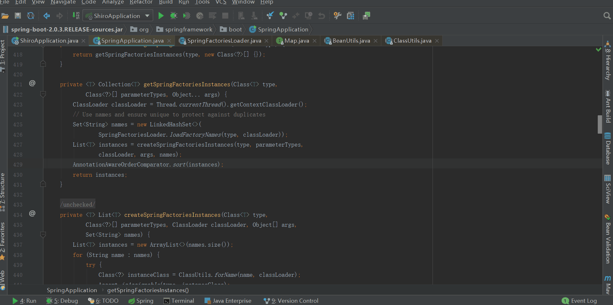
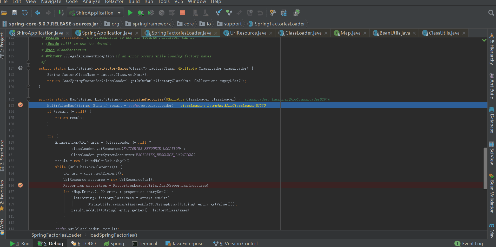
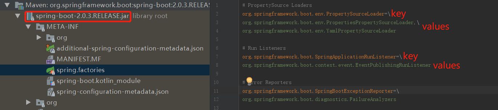
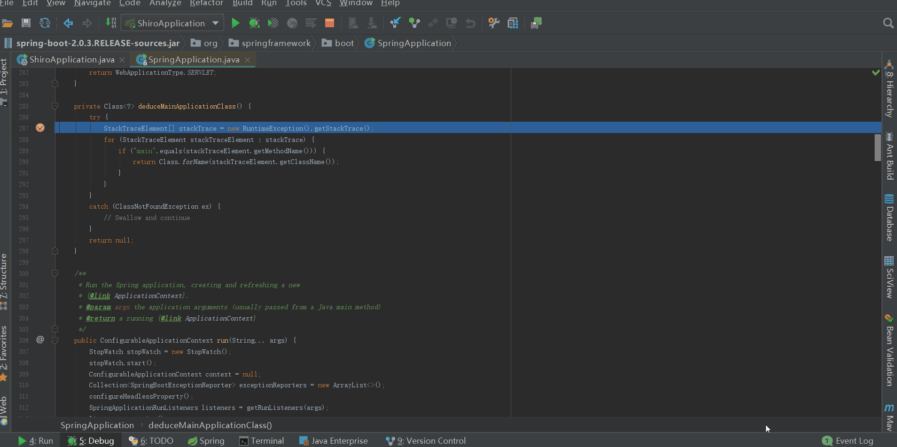
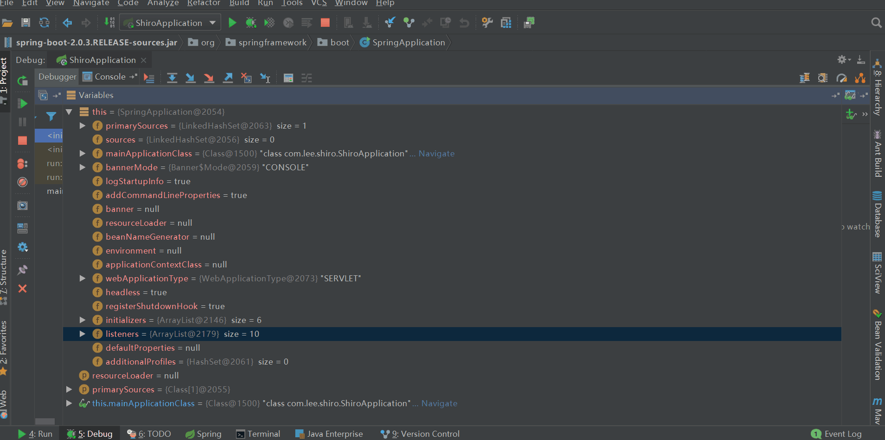

## 前言

上篇：spring-boot-2.0.3不一样系列之shiro - 搭建篇，实现了spring-
boot与shiro的整合，效果大家也看到了，工程确实集成了shiro的认证与授权功能。如果大家能正确搭建起来，并达到了认证和授权的效果，那说明我们会用了，说明我们知其然了；很好，能满足工作中的基本要求了。

但是这样就够了吗？很显然还是不够的，知其然而不知其所以然是一道瓶颈，如果我们能跨过这道瓶颈，后面的路会越来越坦荡。就拿上篇博客来讲，我们仅仅只是在ShiroConfig类中加入了几个bean配置，怎么就让spring-
boot集成了shiro，shiro又是如何做到认证和授权的，等等一些列问题，如果我们去细想的话，真的有很多疑点需要我们去探索。

既然我们要去探索，势必就要读源码了。源码确实不好读，在我们工作当中，当我们读同事（或者前同事）写的代码的时候，总有那么一句话：草泥马，这是哪个sb写的，萦绕在我们的心头，甚至有时候会发现，这他么是我自己写的啊，哎，我操！有时候读自己写的代码都头疼，更别说看别人写的了。

说了那么多，我们切入到正题，接下来会有一系列的文章来解析springboot的启动过程，而今天我们只看SpringApplication类的构造方法。

## SpringApplication类

入口还是那个熟悉的入口：main函数

###  SpringApplication类注释

    
    
    /**
     * Class that can be used to bootstrap and launch a Spring application from a Java main
     * method. By default class will perform the following steps to bootstrap your
     * application:
     *
     * <ul>
     * <li>Create an appropriate {@link ApplicationContext} instance (depending on your
     * classpath)</li>
     * <li>Register a {@link CommandLinePropertySource} to expose command line arguments as
     * Spring properties</li>
     * <li>Refresh the application context, loading all singleton beans</li>
     * <li>Trigger any {@link CommandLineRunner} beans</li>
     * </ul>
     *
     * In most circumstances the static {@link #run(Class, String[])} method can be called
     * directly from your {@literal main} method to bootstrap your application:
     *
     * <pre class="code">
     * &#064;Configuration
     * &#064;EnableAutoConfiguration
     * public class MyApplication  {
     *
     *   // ... Bean definitions
     *
     *   public static void main(String[] args) throws Exception {
     *     SpringApplication.run(MyApplication.class, args);
     *   }
     * }
     * </pre>
     *
     * 

     * For more advanced configuration a {@link SpringApplication} instance can be created and
     * customized before being run:
     *
     * <pre class="code">
     * public static void main(String[] args) throws Exception {
     *   SpringApplication application = new SpringApplication(MyApplication.class);
     *   // ... customize application settings here
     *   application.run(args)
     * }
     * </pre>
     *
     * {@link SpringApplication}s can read beans from a variety of different sources. It is
     * generally recommended that a single {@code @Configuration} class is used to bootstrap
     * your application, however, you may also set {@link #getSources() sources} from:
     * <ul>
     * <li>The fully qualified class name to be loaded by
     * {@link AnnotatedBeanDefinitionReader}</li>
     * <li>The location of an XML resource to be loaded by {@link XmlBeanDefinitionReader}, or
     * a groovy script to be loaded by {@link GroovyBeanDefinitionReader}</li>
     * <li>The name of a package to be scanned by {@link ClassPathBeanDefinitionScanner}</li>
     * </ul>
     *
     * Configuration properties are also bound to the {@link SpringApplication}. This makes it
     * possible to set {@link SpringApplication} properties dynamically, like additional
     * sources ("spring.main.sources" - a CSV list) the flag to indicate a web environment
     * ("spring.main.web-application-type=none") or the flag to switch off the banner
     * ("spring.main.banner-mode=off").
     */

View Code

说的内容大概意思如下：

SpringApplication用于从java main方法引导和启动Spring应用程序，默认情况下，将执行以下步骤来引导我们的应用程序：

1、创建一个恰当的ApplicationContext实例（取决于类路径）

2、注册CommandLinePropertySource，将命令行参数公开为Spring属性

3、刷新应用程序上下文，加载所有单例bean

4、触发全部CommandLineRunner bean

大多数情况下，像SpringApplication.run(ShiroApplication.class,
args);这样启动我们的应用，也可以在运行之前创建和自定义SpringApplication实例，具体可以参考注释中示例。

SpringApplication可以从各种不同的源读取bean。
通常建议使用单个@Configuration类来引导，但是我们也可以通过以下方式来设置资源：

1、通过AnnotatedBeanDefinitionReader加载完全限定类名

2、通过XmlBeanDefinitionReader加载XML资源位置，或者是通过GroovyBeanDefinitionReader加载groovy脚本位置

3、通过ClassPathBeanDefinitionScanner扫描包名称

也就是说SpringApplication还是做了不少事的，具体实现后续会慢慢讲来，今天的主角只是SpringApplication构造方法。

###  SpringApplication构造方法

源代码如下

    
    
    /**
         * Create a new {@link SpringApplication} instance. The application context will load
         * beans from the specified primary sources (see {@link SpringApplication class-level}
         * documentation for details. The instance can be customized before calling
         * {@link #run(String...)}.
         * @param resourceLoader the resource loader to use
         * @param primarySources the primary bean sources
         * @see #run(Class, String[])
         * @see #setSources(Set)
         */
        @SuppressWarnings({ "unchecked", "rawtypes" })
        public SpringApplication(ResourceLoader resourceLoader, Class<?>... primarySources) {
            this.resourceLoader = resourceLoader;
            Assert.notNull(primarySources, "PrimarySources must not be null");
            this.primarySources = new LinkedHashSet<>(Arrays.asList(primarySources));
            this.webApplicationType = deduceWebApplicationType();
            setInitializers((Collection) getSpringFactoriesInstances(
                    ApplicationContextInitializer.class));
            setListeners((Collection) getSpringFactoriesInstances(ApplicationListener.class));
            this.mainApplicationClass = deduceMainApplicationClass();
        }

从注释上来看，就是说创建一个ShiroApplication实例，应用上下文从特定的资源文件中加载bean。可以在调用run之前自定义实例。

从源码上来看，主要是deduceWebApplicationType()；getSpringFactoriesInstances(xxx.class)；deduceMainApplicationClass()；这三个方法，我们一个一个来看。

####  deduceWebApplicationType

推断web应用类型

    
    
    private WebApplicationType deduceWebApplicationType() {
        if (ClassUtils.isPresent(REACTIVE_WEB_ENVIRONMENT_CLASS, null)
                && !ClassUtils.isPresent(MVC_WEB_ENVIRONMENT_CLASS, null)) {
            return WebApplicationType.REACTIVE;
        }
        for (String className : WEB_ENVIRONMENT_CLASSES) {
            if (!ClassUtils.isPresent(className, null)) {
                return WebApplicationType.NONE;
            }
        }
        return WebApplicationType.SERVLET;
    }
    
    // 判断给定的类是否能够加载，就是说类路径下是否存在给定的类
    public static boolean isPresent(String className, @Nullable ClassLoader classLoader) {
        try {
            forName(className, classLoader);
            return true;
        }
        catch (Throwable ex) {
            // Class or one of its dependencies is not present...
            return false;
        }
    }

如果org.springframework.web.reactive.DispatcherHandler能够被加载且org.springframework.web.servlet.DispatcherServlet不能够被加载，那么断定web应用类型是REACTIVE；如果javax.servlet.Servlet和org.springframework.web.context.ConfigurableWebApplicationContext任意一个不能被加载，那么断定web应用类型是NONE；如果不能断定是REACTIVE和NONE，那么就是SERVLET类型；具体这三种类型代表什么含义，大家可以查看WebApplicationType中的说明。

####  getSpringFactoriesInstances

从字面意思看就是获取spring工厂实例，至于从哪获取哪些工厂实例，我们往下看。

getSpringFactoriesInstances源码

    
    
    private <T> Collection<T> getSpringFactoriesInstances(Class<T> type,
            Class<?>[] parameterTypes, Object... args) {
        ClassLoader classLoader = Thread.currentThread().getContextClassLoader();
        // Use names and ensure unique to protect against duplicates
        Set<String> names = new LinkedHashSet<>(
                SpringFactoriesLoader.loadFactoryNames(type, classLoader));            // 获取指定类型的工厂名字
        List<T> instances = createSpringFactoriesInstances(type, parameterTypes,    // 根据名字、类型创建工厂实例
                classLoader, args, names);
        AnnotationAwareOrderComparator.sort(instances);
        return instances;
    }

View Code

从源码我们看出主要做了三件事：

1、loadFactoryNames，加载指定类型的工厂名称

loadSpringFactories

loadSpringFactories源码

    
    
    private static Map<String, List<String>> loadSpringFactories(@Nullable ClassLoader classLoader) {
        MultiValueMap<String, String> result = cache.get(classLoader);
        if (result != null) {
            return result;
        }
    
        try {
            Enumeration<URL> urls = (classLoader != null ?
                    classLoader.getResources(FACTORIES_RESOURCE_LOCATION) :
                    ClassLoader.getSystemResources(FACTORIES_RESOURCE_LOCATION));    // classLoader.getResources(FACTORIES_RESOURCE_LOCATION)获取类路径下全部的META-INF/spring.factories的URL
            result = new LinkedMultiValueMap<>();
            while (urls.hasMoreElements()) {                                        // 遍历全部的URL，逐个读取META-INF/spring.factories中的属性
                URL url = urls.nextElement();
                UrlResource resource = new UrlResource(url);
                Properties properties = PropertiesLoaderUtils.loadProperties(resource);
                for (Map.Entry<?, ?> entry : properties.entrySet()) {
                    List<String> factoryClassNames = Arrays.asList(
                            StringUtils.commaDelimitedListToStringArray((String) entry.getValue()));
                    result.addAll((String) entry.getKey(), factoryClassNames);        // 属性全部放入MultiValueMap<String, String> result中，注意result的类型
                }
            }
            cache.put(classLoader, result);                                            // 结果放入缓存，方便下次查找
            return result;
        }
        catch (IOException ex) {
            throw new IllegalArgumentException("Unable to load factories from location [" +
                    FACTORIES_RESOURCE_LOCATION + "]", ex);
        }
    }

View Code

loadSpringFactories做了以下这些事

a、 查找类路径下全部的META-INF/spring.factories的URL

b、
根据url加载全部的spring.factories中的属性，spring.factories内容如下

c、 将所有spring.factories中的值缓存到SpringFactoriesLoader的cache中：

private static final Map<ClassLoader, MultiValueMap<String, String>> cache =
new ConcurrentReferenceHashMap<>()；方便下次调用。

加载完所有的工厂名称之后，然后从中获取指定工厂类型的工厂名称列表，也就是getOrDefault(factoryClassName,
Collections.emptyList())做的事。

2、createSpringFactoriesInstances，创建指定类型的工厂实例

根据上面获取的指定类型的工厂名称列表来实例化工厂bean，我们可以简单的认为通过反射来实例化，但是具体的实现也没那么简单，感兴趣的小伙伴可以自己去跟。

3、对工厂实例进行排序，然后返回排序后的实例列表

排序规则：@Order从小到大排序，没有order则按没排序之前的顺序。

####
deduceMainApplicationClass

从当前堆栈跟踪列表中获取main方法所在的类名

###  构造方法总结

1、 构造自身实例

2、 推测web应用类型，并赋值到属性webApplicationType

3、 设置属性List<ApplicationContextInitializer<?>>
initializers和List<ApplicationListener<?>> listeners

中途读取了类路径下所有META-INF/spring.factories的属性，并缓存到了SpringFactoriesLoader的cache缓存中

4、 推断主类，并赋值到属性mainApplicationClass

构造方法完成之后，实例的属性值如下

## 感想

本来是想着springboot启动源码解析只用两篇来说明的，之后讲shiro的源码；可我写着写着发现好多实例莫名奇妙的就被实例化了，很多细节没有读到，所以决定细抠，将springboot的启动过程拆分成多篇来讲解，真真正正的明白springboot在启动的过程都做了些什么。

补充一句：有时候，不是对手有多强大，只是我们不敢去尝试；勇敢踏出第一步，你会发现自己比想象中更优秀！诚如海因斯第一次跑进人类10s大关时所说：上帝啊，原来那扇门是虚掩着的！

## 参考

[spring boot 2.0 源码分析（一）](https://www.cnblogs.com/lizongshen/p/9127999.html)

springboot源码

