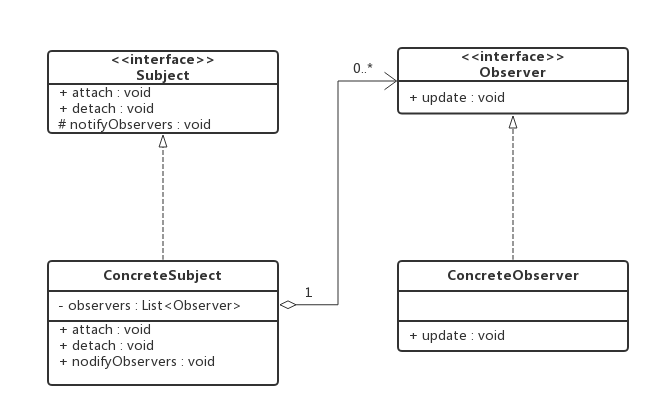
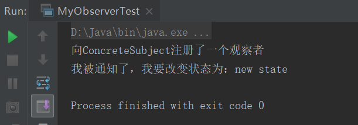
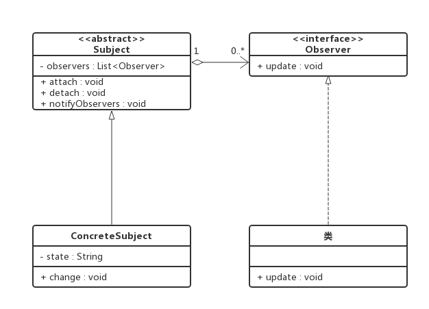
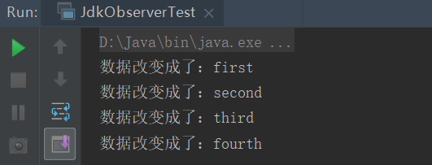
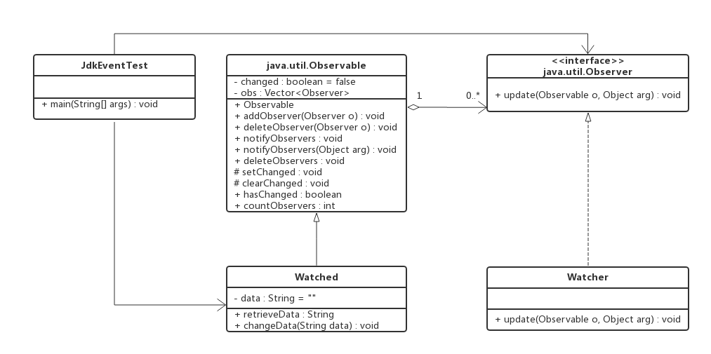

## 前言

本来打算这篇继续和大家一起讨论springboot启动源码的，可觉得再讲源码估计大家都没有看下去的勇气了，那么今天，我们不讲springboot的启动源码，我们先来看看一个有趣的内容，具体是什么，大家应该已经知道了，没错就是标题中的
– spring-boot事件。

可能有小伙伴觉得奇怪了，好好的源码系列不讲了，怎么突然讲一个无关紧要的内容呢？那么真的是无关紧要的内容吗？关于这个疑问后面会有解答。目前大家就权当放松了，以一种轻松的心态和我一起往下看。

## 观察者模式

说好的不是讲springboot的事件机制吗，怎么又讲什么观察者模式呢？心里会说：“楼主，你还好吗，你今天是不是被门夹了？”。楼主：“被门夹？不存在的，一般只有我夹门......”

还是那就话，大家放松心态慢慢看，心中的疑问先放在心里或者用笔记录下来，后面会慢慢解开的。

概念其实很简单，两个主体，一个观察者，一个被观察者，当被观察者发生变化时，观察者会有相应的动作。举几个例子，和我们日常生活息息相关的红绿灯，灯就相当于被观察者，行人就相当于观察者，当灯发生变化时，行人会有相应的动作：红灯停，绿灯行，黄灯亮了等一等。再比如我们现在玩的公众号，当我们订阅了某个公众号之后，公众号每发表一篇文章，就会向订阅了它的用户发送这篇文章，我们就可以浏览这篇文章了；当我们取消订阅了，它就不会再向我们推送这篇文章了；只要这个公众号一直在运行，就会一直有人订阅它或者取消订阅。这两个主体有个统一的称呼：被观察者成为主题（Subject），观察者仍是称为观察者（Observer）。

观察者模式还有很多其他的称谓，如发布-订阅(Publish/Subscribe)模式、模型-
视图(Model/View)模式、源-监听器(Source/Listener)模式或从属者(Dependents)模式。观察者模式定义了一种一对多的依赖关系，让多个观察者对象同时监听某一个主题对象。这个主题对象在状态上发生变化时，会通知所有观察者对象，使它们能够自动更新自己。

理论上的东西讲的再多也只是停留在理论，下面我们来实现下，到底观察者模式是个什么神奇的东西。

###  类图

所涉及到的角色如下：

抽象主题（Subject）：提供接口，可以增加和剔除观察者对象。一般用抽象类或者接口实现。  
抽象观察者（Observer）：提供接口，在得到主题的通知时更新自己。一般用抽象类或者接口实现。  
具体主题（ConcreteSubject）：将有关状态存入具体观察者，在具体主题的内部状态发生变化时，给所有注册过的观察者发出通知。一般是具体子类实现。  
具体观察者（ConcreteObserver）：存储与主题的状态自恰的状态。具体观察者角色实现抽象观察者角色所要求的更新接口，以便使本身的状态与主题的状态
像协调。如果需要，具体观察者角色可以保持一个指向具体主题对象的引用

在上述类图中，ConcreteSubject中有一个存储Observer的列表，这意味着ConcreteSubject并不需要知道引用了哪些ConcreteObserver，只要实现（继承）了Observer的对象都可以存到该列表中。在需要的时候调用Observer的update方法。

###  一般实现

Subject：

    
    
    package com.lee.myobserver;
    
    
    /**
     * 抽象主题
     * 提供具体主题需要实现的接口
     */
    public interface Subject {
    
        /**
         * 注册观察者
         * @param observer
         */
        void attach(Observer observer);
    
        /**
         *  移除观察者
         *  @param observer
         */
        void detach(Observer observer);
    
        /**
         * 通知所有注册的观察者
         */
        void notifyObservers();
    }

View Code

Observer：

    
    
    package com.lee.myobserver;
    
    /**
     * 抽象观察者
     * 提供具体观察者需要实现的接口
     */
    public interface Observer {
    
        /**
         *
         */
        void update(String state);
    }

View Code

ConcreteSubject：

    
    
    package com.lee.myobserver.impl;
    
    import com.lee.myobserver.Observer;
    import com.lee.myobserver.Subject;
    
    import java.util.ArrayList;
    import java.util.List;
    
    /**
     * 具体主题
     */
    public class ConcreteSubject implements Subject {
    
        private List<Observer> observerList = new ArrayList<>();
        private String state;
    
        @Override
        public void attach(Observer observer) {
            this.observerList.add(observer);
            System.out.println("向ConcreteSubject注册了一个观察者");
        }
    
        @Override
        public void detach(Observer observer) {
            this.observerList.remove(observer);
            System.out.println("从ConcreteSubject移除了一个观察者");
        }
    
        @Override
        public void notifyObservers() {
            this.observerList.forEach(observer -> observer.update(this.state));
        }
    
        public void changeState(String state) {
            this.state = state;
            this.notifyObservers();
        }
    }

View Code

ConcreteObserver：

    
    
    package com.lee.myobserver.impl;
    
    import com.lee.myobserver.Observer;
    
    /**
     * 具体观察者
     */
    public class ConcreteObserver implements Observer {
    
        @Override
        public void update(String state) {
            System.out.println("我被通知了，我要改变状态为：" + state);
        }
    }

View Code

MyObserverTest：

    
    
    package com.lee.test;
    
    import com.lee.myobserver.Observer;
    import com.lee.myobserver.impl.ConcreteObserver;
    import com.lee.myobserver.impl.ConcreteSubject;
    
    public class MyObserverTest {
    
        public static void main(String[] args) {
            ConcreteSubject subject = new ConcreteSubject();
            Observer observer = new ConcreteObserver();
            subject.attach(observer);
            subject.changeState("new state");
        }
    }

View Code

完整代码可以从[spring-boot-test](https://gitee.com/youzhibing/spring-
boot-2.0.3/tree/master/spring-boot-test)获取，在com.lee.myobserver下

运行结果如下：

以上实现中，我们发现ConcreteSubject必须维护一个Observer列表，这会让人产生疑问：难道每个ConcreteSubject中的List<Observer>会有不同吗？很明显，不会，因为List保存的类型是接口类型，那么我们是不是可以把这个维护列表放到Subject中去了？还有我们发现attach、detach、notifyObservers在各个ConcreteSubject的实现都是一样的，那么我们是不是可以共用起来呢？答案是肯定的！那么我们怎么处理了，只需要将Subject改成抽象类即可，类图如下，具体实现就交给大家自己了，有了这个类图，相信大家都可以轻松的完成代码的实现。

###  jdk实现

在Java语言的java.util包下，提供了一个Observable类以及一个Observer接口，构成Java语言对观察者模式的支持。

Observable：

    
    
    package java.util;
    
    /**
     * 抽象主题，用普通类实现
     */
    public class Observable {
        private boolean changed = false;
        private Vector<Observer> obs;
    
        
        /**
         * 构建一个含有0个观察者的主题
         */
        public Observable() {
            obs = new Vector<>();
        }
    
        /**
         * 注册某个观察者到obs中
         */
        public synchronized void addObserver(Observer o) {
            if (o == null)
                throw new NullPointerException();
            if (!obs.contains(o)) {
                obs.addElement(o);
            }
        }
    
        /**
         * 从obs中移除某个观察者
         */
        public synchronized void deleteObserver(Observer o) {
            obs.removeElement(o);
        }
    
        /**
         * 相当于notifyObservers(null)，具体看下面那个
         */
        public void notifyObservers() {
            notifyObservers(null);
        }
    
        /**
         * 如果本对象有变化，则通知所有注册了的观察者，调用他们的update方法
         */
        public void notifyObservers(Object arg) {
            /*
             * a temporary array buffer, used as a snapshot of the state of
             * current Observers.
             */
            Object[] arrLocal;
    
            synchronized (this) {
                if (!changed)
                    return;
                arrLocal = obs.toArray();
                clearChanged();
            }
    
            for (int i = arrLocal.length-1; i>=0; i--)
                ((Observer)arrLocal[i]).update(this, arg);
        }
    
        /**
         * 清空obs
         */
        public synchronized void deleteObservers() {
            obs.removeAllElements();
        }
    
        /**
         * 将changed设置成true，标明本对象发生了变化
         */
        protected synchronized void setChanged() {
            changed = true;
        }
    
        /**
         * 将changed重置成false
         */
        protected synchronized void clearChanged() {
            changed = false;
        }
    
        /**
         * 检测本对象是否发生了变化
         */
        public synchronized boolean hasChanged() {
            return changed;
        }
    
        /**
         * 返回注册的观察者数量
         */
        public synchronized int countObservers() {
            return obs.size();
        }
    }

View Code

Observer：

    
    
    package java.util;
    
    /**
     * 抽象观察者，接口实现
     */
    public interface Observer {
        /**
         * 当被观察者对象发生改变时，此方法被调用
         */
        void update(Observable o, Object arg);
    }

View Code

Watched：

    
    
    package com.lee.jdkobserver;
    
    import java.util.Observable;
    
    /**
     * 具体主题
     */
    public class Watched extends Observable {
        private String data = "";
    
        public void changeData(String data) {
            if (this.data.equals(data)) {
                return;
            }
            this.data = data;
            setChanged();
            notifyObservers(this.data);
        }
    }

View Code

Watcher：

    
    
    package com.lee.jdkobserver;
    
    import java.util.Observable;
    import java.util.Observer;
    
    /**
     * 具体观察者，实现jdk中的Observer
     */
    public class Watcher implements Observer {
    
        @Override
        public void update(Observable o, Object arg) {
            System.out.println("数据改变成了：" + arg);
        }
    }

View Code

JdkObserverTest：

    
    
    package com.lee.test;
    
    import com.lee.jdkobserver.Watched;
    import com.lee.jdkobserver.Watcher;
    
    import java.util.Observer;
    
    public class JdkObserverTest {
    
        public static void main(String[] args) {
            Watched watched = new Watched();
            Observer observer = new Watcher();
            watched.addObserver(observer);
            watched.changeData("first");
            watched.changeData("second");
            watched.changeData("third");
            watched.changeData("fourth");
        }
    }

View Code

完整代码可以从[spring-boot-test](https://gitee.com/youzhibing/spring-
boot-2.0.3/tree/master/spring-boot-test)获取，在com.lee.jdkobserver下

运行结果如下

类图如下

## jdk事件

JDK 1.0及更早版本的事件模型基于职责链模式，但是这种模型不适用于复杂的系统，因此在JDK
1.1及以后的各个版本中，事件处理模型采用基于观察者模式的委派事件模型(DelegationEvent Model,
DEM)，即一个Java组件所引发的事件并不由引发事件的对象自己来负责处理，而是委派给独立的事件处理对象负责。这并不是说事件模型是基于Observer和Observable的，事件模型与Observer和Observable没有任何关系，Observer和Observable只是观察者模式的一种实现而已。

java中的事件机制的参与者有3种角色

Event Eource：事件源，发起事件的主体。

Event Object：事件状态对象，传递的信息载体，就好比Watcher的update方法的参数，可以是事件源本身，一般作为参数存在于listerner
的方法之中。

Event Listener：事件监听器，当它监听到event object产生的时候，它就调用相应的方法，进行处理。

其实还有个东西比较重要：事件环境，在这个环境中，可以添加事件监听器，可以产生事件，可以触发事件监听器。

限于篇幅，具体案例实现就不讲了，大家可以去[spring-boot-test](https://gitee.com/youzhibing/spring-
boot-2.0.3/tree/master/spring-boot-
test)获取，在com.lee.jdkevent下，里面注释写的很详细了，大家可以好好看看。

## spring事件机制

springboot没有自己的事件机制，用的就是spring的事件机制，这里希望大家别以为和标题不一致。springboot和spring的关系大家可以去捋一捋，这里可以明确的告诉大家，不是对立关系！

spring的事件机制也是从java的事件机制拓展而来，具体往下看

ApplicationEvent：Spring中所有的事件父接口，继承自java的EventObject

    
    
    /*
     * Copyright 2002-2015 the original author or authors.
     *
     * Licensed under the Apache License, Version 2.0 (the "License");
     * you may not use this file except in compliance with the License.
     * You may obtain a copy of the License at
     *
     *      http://www.apache.org/licenses/LICENSE-2.0
     *
     * Unless required by applicable law or agreed to in writing, software
     * distributed under the License is distributed on an "AS IS" BASIS,
     * WITHOUT WARRANTIES OR CONDITIONS OF ANY KIND, either express or implied.
     * See the License for the specific language governing permissions and
     * limitations under the License.
     */
    
    package org.springframework.context;
    
    import java.util.EventObject;
    
    /**
     * Class to be extended by all application events. Abstract as it
     * doesn"t make sense for generic events to be published directly.
     *
     * @author Rod Johnson
     * @author Juergen Hoeller
     */
    public abstract class ApplicationEvent extends EventObject {
    
        /** use serialVersionUID from Spring 1.2 for interoperability */
        private static final long serialVersionUID = 7099057708183571937L;
    
        /** System time when the event happened */
        private final long timestamp;
    
    
        /**
         * Create a new ApplicationEvent.
         * @param source the object on which the event initially occurred (never {@code null})
         */
        public ApplicationEvent(Object source) {
            super(source);
            this.timestamp = System.currentTimeMillis();
        }
    
    
        /**
         * Return the system time in milliseconds when the event happened.
         */
        public final long getTimestamp() {
            return this.timestamp;
        }
    
    }

View Code

ApplicationListener：spring中所有的事件监听器父接口，继承自java的EventListener

    
    
    /*
     * Copyright 2002-2016 the original author or authors.
     *
     * Licensed under the Apache License, Version 2.0 (the "License");
     * you may not use this file except in compliance with the License.
     * You may obtain a copy of the License at
     *
     *      http://www.apache.org/licenses/LICENSE-2.0
     *
     * Unless required by applicable law or agreed to in writing, software
     * distributed under the License is distributed on an "AS IS" BASIS,
     * WITHOUT WARRANTIES OR CONDITIONS OF ANY KIND, either express or implied.
     * See the License for the specific language governing permissions and
     * limitations under the License.
     */
    
    package org.springframework.context;
    
    import java.util.EventListener;
    
    /**
     * Interface to be implemented by application event listeners.
     * Based on the standard {@code java.util.EventListener} interface
     * for the Observer design pattern.
     *
     * 
As of Spring 3.0, an ApplicationListener can generically declare the event type
     * that it is interested in. When registered with a Spring ApplicationContext, events
     * will be filtered accordingly, with the listener getting invoked for matching event
     * objects only.
     *
     * @author Rod Johnson
     * @author Juergen Hoeller
     * @param <E> the specific ApplicationEvent subclass to listen to
     * @see org.springframework.context.event.ApplicationEventMulticaster
     */
    @FunctionalInterface
    public interface ApplicationListener<E extends ApplicationEvent> extends EventListener {
    
        /**
         * Handle an application event.
         * @param event the event to respond to
         */
        void onApplicationEvent(E event);
    
    }

View Code

###  具体案例

MessageEvent：

    
    
    package com.lee.springevent.event;
    
    import org.springframework.context.ApplicationEvent;
    
    /**
     * 短信事件，事件信息的载体
     * 可以从中获取事件源信息，本例中source不代表事件源
     */
    public class MessageEvent extends ApplicationEvent {
    
        public MessageEvent(Object source) {
            super(source);
        }
    }

View Code

MessageListener：

    
    
    package com.lee.springevent.listener;
    
    import com.lee.springevent.event.MessageEvent;
    import org.springframework.context.ApplicationEvent;
    import org.springframework.context.ApplicationListener;
    
    public class MessageListener implements ApplicationListener{
    
        @Override
        public void onApplicationEvent(ApplicationEvent event) {
            if(event instanceof MessageEvent) {
                String phoneNumber = (String)event.getSource();
                System.out.println("我已收到通知：即将向"+phoneNumber+"发短信了...");
            }
        }
    }

View Code

MessageService：

    
    
    package com.lee.springevent.service;
    
    import com.lee.springevent.event.MessageEvent;
    import org.springframework.beans.BeansException;
    import org.springframework.context.ApplicationContext;
    import org.springframework.context.ApplicationContextAware;
    
    /**
     * ApplicationContextAware，能够获取spring的上下文环境
     *
     * MessageService相当于之前说的事件环境
     */
    public class MessageService implements ApplicationContextAware {
    
        private ApplicationContext ctx;
    
        @Override
        public void setApplicationContext(ApplicationContext applicationContext) throws BeansException {
            this.ctx = applicationContext;
        }
    
        public void sendMessage(String phoneNumber)
        {
            MessageEvent evt = new MessageEvent(phoneNumber);
    
            // 发布事件
            ctx.publishEvent(evt);
        }
    }

View Code

spring-event.xml：

    
    
    <?xml version="1.0" encoding="UTF-8"?>
    <beans xmlns="http://www.springframework.org/schema/beans"
           xmlns:xsi="http://www.w3.org/2001/XMLSchema-instance"
           xsi:schemaLocation="http://www.springframework.org/schema/beans http://www.springframework.org/schema/beans/spring-beans.xsd">
        <bean id="messageService" class="com.lee.springevent.service.MessageService" />
        <bean id="messageListener" class="com.lee.springevent.listener.MessageServiceListener" />
    
    </beans>

View Code

SpringEventTest：

    
    
    package com.lee.test;
    
    import com.lee.springevent.service.MessageService;
    import org.springframework.context.ApplicationContext;
    import org.springframework.context.support.ClassPathXmlApplicationContext;
    
    public class SpringEventTest {
    
        public static void main(String[] args) {
            ApplicationContext applicationContext = new ClassPathXmlApplicationContext("spring-event.xml");
            MessageService messageService = (MessageService) applicationContext.getBean("messageService");
            messageService.sendMessage("1574480311");
        }
    }

View Code

执行SpringEventTest中的main方法就可以看到结果了。

更多详情请从[spring-boot-test](https://gitee.com/youzhibing/spring-
boot-2.0.3/tree/master/spring-boot-
test)获取，在com.lee.springevent下，大家可以根据注释好好消化下。实在是不懂得话，可以放一下，下篇博文我会和大家一起着重研究下spring的事件源码，后续的博文中也都会有提到。

## 总结

###  为什么讲与springboot启动源码无关的内容

关于前言中的疑问：为什么讲一篇与spring启动源码无关的内容，有两个考虑，第一，确实是让大家放松下心态，读源码确实挺累的；第二，主要目的，就是为springboot启动源码篇二做准备，下篇博客会涉及到spring的事件机制

###  观察者模式优点与缺点

上面长篇大论，似乎也没讨论其优点与缺点；其实通过实现大家应该才能体会到其优点与缺点，我总结下，有什么不对的大家可以在评论区补充

优点：

(1)
主题与观察者建立一个抽象的耦合而不是紧密的耦合，降低了耦合度；主题只需要维护一个抽象观察者的集合，无需了解具体观察者，使得可以有各种各样不同的观察者实现。

(2) 支持广播通信，主题会向所有已注册的观察者对象发送通知，简化了一对多系统设计的难度。

(3) 符合“开闭原则”，增加新的具体观察者无须修改原有代码，可拓展性高。

缺点：

(1) 如果主题有很多直接或者间接观察者，那么全部通知到会很耗时。

(2) 主题与观察者之间如果存在循环依赖，可能导致系统崩溃。

###  观察者模式应用场景

抽象的来讲：对一个对象状态的更新，需要其他对象同步更新，而且其他对象的数量动态可变；对象仅需要将自己的更新通知给其他对象而不需要知道其他对象的细节。大家可以根据以上两点作为基本准则，某个场景是否满足观察者模式。

具体应用场景就有很多了，比如文中的事件机制、公众号订阅，tomcat源码中也有很多地方用到了（有兴趣的兄弟可以去找找）。

###  事件机制

jdk事件实现是基于观察者模式，而spring事件又是在jdk事件的基础上进行了拓展。

主要有四个角色

事件源：触发事件的主体，比如jdk事件案例中的UserService、spring事件案例中的MessageService、SpringBoot中的SpringApplication。

事件：事件本身，指的是EventObject中的source，具体可以是任何数据（包括事件源），用来传递数据，比如jdk事件案例中MessageEvent、spring事件案例中的MessageEvent。

事件监听器：当事件发生时，负责对事件的处理，比如jdk事件案例中MessageListener、spring事件案例中的MessageListener。

事件环境：整个事件所处的上下文，对整个事件提供支持，类似web上下文；比如jdk事件案例中的UserService、spring事件案例中的ApplicationContext

## 参考

《Head First 设计模式》

《java与模式》

