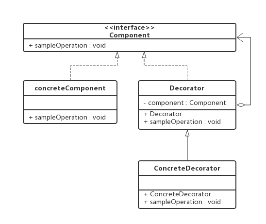
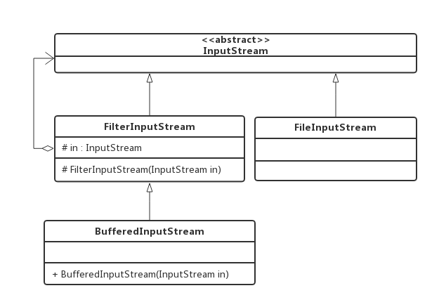
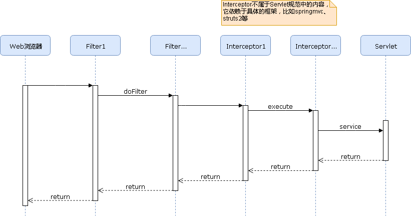
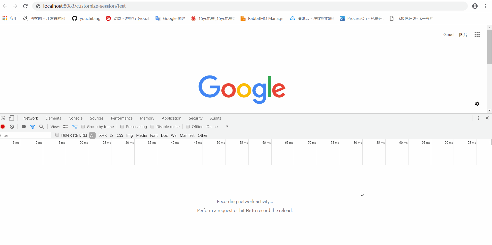
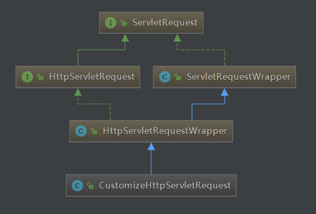

## 前言

还记得当初写[spring-
session实现分布式集群session的共享](https://www.cnblogs.com/youzhibing/p/7348337.html)的时候，里面有说到利用filter和HttpServletRequestWrapper可以定制自己的getSession方法，实现对session的控制，从而将session存放到统一的位置进行存储，达到session共享的目的。但是具体是如何实现的没有提及，今天我们就自己实现一个简单的session共享。

路漫漫其修远兮，吾将上下而求索！

github：[https://github.com/youzhibing](https://github.com/youzhibing)

码云(gitee)：[https://gitee.com/youzhibing](https://gitee.com/youzhibing)

## 装饰模式

进入正题之前我们先来看看另外一个内容，放松下心情。尽管目前房价依旧很高，但还是阻止不了大家对新房的渴望和买房的热情。如果大家买的是毛坯房，无疑还有一项艰巨的任务要面对，那就是装修。对新房进行装修并没有改变房屋用于居住的本质，但它可以让房子变得更漂亮、更温馨、更实用、更能满足居家的需求。在软件设计中，我们也有一种类似新房装修的技术可以对已有对象（新房）的功能进行扩展（装修），以获得更加符合用户需求的对象，使得对象具有更加强大的功能。这种技术对应于一种被称之为装饰模式的设计模式。

装饰者模式又名包装模式，以对客户端透明的方式拓展对象的功能，能够让我们在不修改底层代码的情况下，给我们的对象赋予新的职责。是继承关系的一个替代方案。

###  装饰模式类图

装饰模式中的角色：

抽象构件(Component)角色：给出一个抽象接口，以规范准备接收附加责任的对象。  
具体构件(ConcreteComponent)角色：定义一个将要接收附加责任的类。  
装饰(Decorator)角色：持有一个构件(Component)对象的实例，并定义一个与抽象构件接口一致的接口。  
具体装饰(ConcreteDecorator)角色：负责给构件对象“贴上”附加的责任

###  源代码实现

Component.java

    
    
    public interface Component {
    
        void sampleOperation();
    }

View Code

ConcreteComponent.java

    
    
    public class ConcreteComponent implements Component {
    
        @Override
        public void sampleOperation() {
            // 写具体业务代码
            System.out.println("我是ConcreteComponent");
        }
    }

View Code

Decorator.java

    
    
    public class Decorator implements Component {
    
        private Component component;
    
        public Decorator(Component component) {
            this.component = component;
        }
    
        @Override
        public void sampleOperation() {
    
            // 委派给具体的构建
            component.sampleOperation();
        }
    }

View Code

ConcreteDecorator.java

    
    
    public class ConcreteDecorator extends Decorator{
    
        public ConcreteDecorator(Component component) {
            super(component);
        }
    
        @Override
        public void sampleOperation() {
            // 写相关的业务代码
            System.out.println("调用component方法之前业务处理");
    
            super.sampleOperation();
    
            // 写相关的业务代码
            System.out.println("调用component方法之后业务处理");
        }
    }

View Code

更多详情在[spring-boot-test](https://gitee.com/youzhibing/spring-
boot-2.0.3/tree/master/spring-boot-test)下的com.lee.decorator包下

###  jdk中的案例

装饰模式在Java语言中的最著名的应用莫过于Java I/O标准库的设计了。由于Java
I/O库需要很多性能的各种组合，如果这些性能都是用继承的方法实现的，那么每一种组合都需要一个类，这样就会造成大量性能重复的类出现。而如果采用装饰模式，那么类的数目就会大大减少，性能的重复也可以减至最少，因此装饰模式是Java
I/O库的基本模式。

由于Java I/O的对象众多，这里只画出InputStream的一部分

我们来捋一捋这个类图在装饰模式中角色的对应

抽象构件(Component)角色：InputStream，这是一个抽象类，为各种子类型提供统一的接口  
具体构件(ConcreteComponent)角色：FileInputStream，实现了抽象构件角色所规定的接口  
装饰(Decorator)角色：FilterInputStream，它实现了InputStream所规定的接口  
具体装饰(ConcreteDecorator)角色：BufferedInputStream

## 自定义session管理

我们先来看看一个请求的发起到响应的时序图

Interceptor依赖具体的框架（当然我们也可以自己实现），不是Servlet的内容，暂且先将其抛开，那么相当于请求先经过Filter链，再到Servlet，然后servlet处理完之后，再经过Filter链返回给浏览器。

此时我们要对session的获取进行定制，我们能怎么处理？两种选择，一是从Servlet入手，二是从Filter入手。那我们想一想，从Servlet入手可行吗？可行，只是可行性非常低，因为我们需要定制的东西就太多了，容器的那套Servlet规范实现我们都需要自己来实现了。如果从Filter入手，我们可以继续沿用容器的那套实现，并从中插入我们的定制内容，那么改动的内容就很少了。具体如何实现，我们一起往下看

###  定制session管理

####  servlet容器的session创建

在实现我们自己的session管理之前，我们先来看看session在servlet容器中的创建。

客户端第一次请求request.getSession()时，也就是说客户端的请求中服务端第一次调用request.getSession()时，服务器会创建了Session对象并保存在servlet容器的session集合中，同时生成一个Session
id，并通过响应头的Set-Cookie命令，向客户端发送要求设置cookie的响应(cookie中设置Session
id信息)，客户端收到响应后，在客户端设置了一个JSESSIONID=XXXXXXX的cookie信息；接下来客户端每次向服务器发送请求时，请求头都会带上该cookie信息（包含Session
id），那么之后的每次请求都能从servlet容器的session集合中找到客户端对应的session了，这样也就相当于保持了用户与服务器的交互状态。

注意：  
第一次请求request.getSession()时，请求头没带session id的信息，响应头中包括设置session
id的cookie设置命令；之后客户端的请求(不管服务端时候调用request.getSession())，请求头都有session
id信息，而响应头再也不会有设置session id的cookie设置命令  
session以及session id是在第一次调用request.getSession()时创建的（session过期另说，不是本文内容）

不同容器的session id名称可能不一样，JSESSIONID是tomcat中session id的默认名

####  自定义session的创建与获取

不依赖任何框架，就用Filter +
HttpServletRequestWrapper实现我们自己的简单session管理。自定义Filter的作用是在请求到达Servlet之前，我们将HttpServletRequest封装成我们自己的HttpServletRequestWrapper实现类：CustomizeSessionHttpServletRequest，那么到达Servlet的HttpServletRequest对象实际上是CustomizeSessionHttpServletRequest；我们重写CustomizeSessionHttpServletRequest的getSession方法，使其从我们自己的session容器中获取，从而实现session的自定义管理。为了实现同一会话的效果，在创建session的时候，需要往response中添加cookie，保存session
id，下次请求的时候，浏览器会将cookie信息传过来，我们去cookie中获取session id，根据session
id取session容器获取session，这样就能保证同一会话效果了。

具体代码这里就不贴了，大家去查看[customize-session](https://gitee.com/youzhibing/spring-
boot-2.0.3/tree/master/customize-session)，效果如下

先访问http://localhost:8083/customize-
session/test，此时是没有产生session的，http://localhost:8083/customize-
session/请求的是index.jsp，jsp请求了内置对象session，此时产生session，并让浏览器设置缓存，那么之后的每次请求都会带上包含session
id的缓存。

####  关键部分类图

ServletRequestWrapper中有成员变量ServletRequest request；

####  装饰模式角色对应

不是严格意义上的装饰模式

抽象构件(Component)角色：ServletRequest  
具体构件(ConcreteComponent)角色：无  
装饰(Decorator)角色：ServletRequestWrapper  
具体装饰(ConcreteDecorator)角色：CustomizeHttpServletRequest

## 总结

1、装饰模式

文中装饰模式讲的不是很细，大家如果有什么不懂的地方可以去我参考的两本的两本书中寻找更详细的信息。

jdk源码中，I/O标准库大量用到了装饰模式和适配器模式，有兴趣的小伙伴可以去详细的看看。

2、自定义session管理

Filter拦截请求，将HttpServletRequest封装成我们自己的CustomizeSessionHttpServletRequest，进而插入我们的session创建与获取逻辑，因为session的获取方式往往是：request.getSession();

往response中添加cookie，需要在response提交之前，否则添加无效；

另外我们自定义了HttpSession：CustomizeSession，目的是为了更好地控制session

3、不足

首先强调一点：方向与思路是没错的！

目前只是实现了session的创建与获取，实现的还比较一般，提升空间比较大；session管理还包括：session过期、session刷新等；另外session的存储在本文中写死了，没有对外提交接口实现多方式存储，好的方式应该是对外提供接口并提供默认实现。

4、目的

写本文的目的只是让大家对自定义session的管理有个简单的认知，如果直接从shiro的session管理，或者spring-
session的session管理入口，我们可能不知道如何去阅读，毕竟这两者是个成熟的体系，涉及的内容很多，我们可能会望而却步了；但不管怎样，实现方式都是一样的，只是shiro、spring-
session在此基础上进行各种内容丰富，使得体系愈发成熟。

为我的[另外一篇博文](https://www.cnblogs.com/youzhibing/p/9749427.html)做准备

## 参考

《Head First 设计模式》

《Java与模式》

