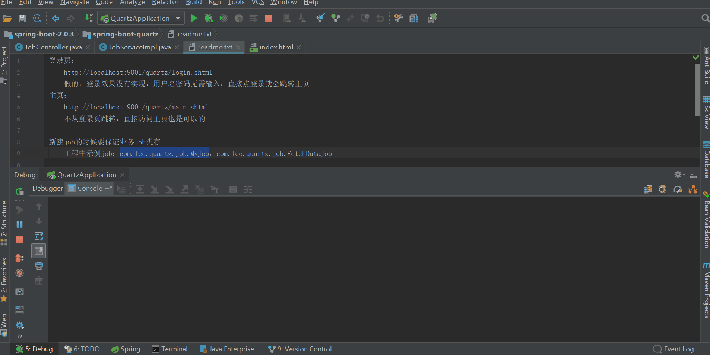
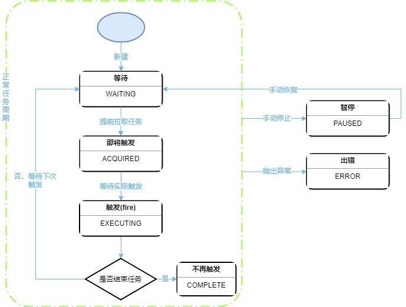

## 前言

开心一刻

晚上回家，爸妈正在吵架，见我回来就都不说话了，看见我妈坐在那里瞪着我爸，我就问老爸“你干什么了惹我妈生这么大气?”
我爸说“没有什么啊，倒是你，这么大了还没有媳妇，要是你有媳妇给我们生一个孙子玩，我们致于吵架吗？”我一听就感觉要坏，老爸你这是来了一招调虎离山啊，实力坑儿子啊，果然我妈改瞪我了，然后完全不理我爸，直接指着我开骂了……

路漫漫其修远兮，吾将上下而求索！

github：[https://github.com/youzhibing](https://github.com/youzhibing)

码云(gitee)：[https://gitee.com/youzhibing](https://gitee.com/youzhibing)

## java定时任务调度的实现方式

Timer

这个相信大家都有用过，我也用过，但用的不多；

特点是：简单易用，但由于所有任务都是由同一个线程来调度，因此所有任务都是串行执行的，同一时间只能有一个任务在执行，前一个任务的延迟或异常都将会影响到之后的任务；能实现简单的定时任务，稍微复杂点（或要求高一些）的定时任务却不好实现。  
ScheduledExecutor

这个我相信大家也都用过，而且用的比Timer多；正是鉴于Timer的缺陷，Java 5推出了基于线程池设计的ScheduledExecutor；

特点：每一个被调度的任务都会由线程池中一个线程去执行，因此任务是并发执行的，相互之间不会受到干扰。需要注意的是，只有当任务的执行时间到来时，ScheduedExecutor
才会真正启动一个线程，其余时间 ScheduledExecutor 都是在轮询任务的状态。

虽然用ScheduledExecutor和Calendar能够实现复杂任务调度，但实现起来还是比较麻烦，对开发还是不够友善。

Spring Scheduler

spring对任务调度的实现支持，可以指定任务的执行时间，但对任务队列和线程池的管控较弱；一般集成于项目中，小任务很方便。  
JCronTab

JCronTab则是一款完全按照crontab语法编写的java任务调度工具。

特点：

可指定任务的执行时间；

提供完全按照Unix的UNIX-POSIX crontab的格式来规定时间；

支持多种任务调度的持久化方法，包括普通文件、数据库以及 XML 文件进行持久化；

JCronTab内置了发邮件功能，可以将任务执行结果方便地发送给需要被通知的人；

设计和部署是高性能并可扩展。

Quartz

本文主角，请往下看  
当然还有XXL-JOB、Elastic-Job、Saturn等等

## quartz相关概念

Scheduler：调度器，进行任务调度；quartz的大脑  
Job：业务job，亦可称业务组件；定时任务的具体执行业务需要实现此接口，调度器会调用此接口的execute方法完成我们的定时业务  
JobDetail：用来定义业务Job的实例，我们可以称之为quartz job，很多时候我们谈到的job指的是JobDetail  
Trigger：触发器，用来定义一个指定的Job何时被执行  
JobBuilder：Job构建器，用来定义或创建JobDetail的实例；JobDetail限定了只能是Job的实例  
TriggerBuilder：触发器构建器，用来定义或创建触发器的实例

具体为什么要分这么细，大家可以去查阅下相关资料，你会发现很多东西

## 工程实现

pom.xml

    
    
    <?xml version="1.0" encoding="UTF-8"?>
    <project xmlns="http://maven.apache.org/POM/4.0.0"
             xmlns:xsi="http://www.w3.org/2001/XMLSchema-instance"
             xsi:schemaLocation="http://maven.apache.org/POM/4.0.0 http://maven.apache.org/xsd/maven-4.0.0.xsd">
        <modelVersion>4.0.0</modelVersion>
    
        <groupId>com.lee</groupId>
        <artifactId>spring-boot-quartz</artifactId>
        <version>1.0-SNAPSHOT</version>
    
        <properties>
            <java.version>1.8</java.version>
            <maven.compiler.source>1.8</maven.compiler.source>
            <maven.compiler.target>1.8</maven.compiler.target>
            <druid.version>1.1.10</druid.version>
            <pagehelper.version>1.2.5</pagehelper.version>
            <druid.version>1.1.10</druid.version>
        </properties>
    
        <parent>
            <groupId>org.springframework.boot</groupId>
            <artifactId>spring-boot-starter-parent</artifactId>
            <version>2.0.3.RELEASE</version>
        </parent>
    
        <dependencies>
            <dependency>
                <groupId>org.springframework.boot</groupId>
                <artifactId>spring-boot-starter-web</artifactId>
            </dependency>
            <dependency>
                <groupId>org.springframework.boot</groupId>
                <artifactId>spring-boot-starter-thymeleaf</artifactId>
            </dependency>
    
            <dependency>
                <groupId>org.springframework.boot</groupId>
                <artifactId>spring-boot-starter-quartz</artifactId>
            </dependency>
    
            <dependency>
                <groupId>com.alibaba</groupId>
                <artifactId>druid-spring-boot-starter</artifactId>
                <version>${druid.version}</version>
            </dependency>
            <dependency>
                <groupId>mysql</groupId>
                <artifactId>mysql-connector-java</artifactId>
            </dependency>
            <dependency>
                <groupId>com.github.pagehelper</groupId>
                <artifactId>pagehelper-spring-boot-starter</artifactId>
                <version>${pagehelper.version}</version>
            </dependency>
    
            <!-- 日志 -->
            <dependency>
                <groupId>org.springframework.boot</groupId>
                <artifactId>spring-boot-starter-logging</artifactId>
                <exclusions>            <!-- 排除spring-boot-starter-logging中的全部依赖 -->
                    <exclusion>
                        <groupId>*</groupId>
                        <artifactId>*</artifactId>
                    </exclusion>
                </exclusions>
                <scope>test</scope>     <!-- 打包的时候不打spring-boot-starter-logging.jar -->
            </dependency>
            <dependency>
                <groupId>ch.qos.logback</groupId>
                <artifactId>logback-classic</artifactId>
            </dependency>
    
            <dependency>
                <groupId>org.projectlombok</groupId>
                <artifactId>lombok</artifactId>
                <optional>true</optional>
            </dependency>
        </dependencies>
    
        <build>
            <finalName>spring-boot-quartz</finalName>
            <plugins>
                <!-- 打包项目 mvn clean package -->
                <plugin>
                    <groupId>org.springframework.boot</groupId>
                    <artifactId>spring-boot-maven-plugin</artifactId>
                </plugin>
            </plugins>
        </build>
    </project>

View Code

application.xml

    
    
    server:
      port: 9001
      servlet:
        context-path: /quartz
    spring:
      thymeleaf:
        mode: HTML
        cache: false
      #连接池配置
      datasource:
        type: com.alibaba.druid.pool.DruidDataSource
        druid:
          driver-class-name: com.mysql.jdbc.Driver
          url: jdbc:mysql://localhost:3306/spring-boot-quartz?useSSL=false&useUnicode=true
          username: root
          password: 123456
          initial-size: 1                     #连接池初始大小
          max-active: 20                      #连接池中最大的活跃连接数
          min-idle: 1                         #连接池中最小的活跃连接数
          max-wait: 60000                     #配置获取连接等待超时的时间
          pool-prepared-statements: true    #打开PSCache，并且指定每个连接上PSCache的大小
          max-pool-prepared-statement-per-connection-size: 20
          validation-query: SELECT 1 FROM DUAL
          validation-query-timeout: 30000
          test-on-borrow: false             #是否在获得连接后检测其可用性
          test-on-return: false             #是否在连接放回连接池后检测其可用性
          test-while-idle: true             #是否在连接空闲一段时间后检测其可用性
      quartz:
        #相关属性配置
        properties:
          org:
            quartz:
              scheduler:
                instanceName: quartzScheduler
                instanceId: AUTO
              jobStore:
                class: org.quartz.impl.jdbcjobstore.JobStoreTX
                driverDelegateClass: org.quartz.impl.jdbcjobstore.StdJDBCDelegate
                tablePrefix: QRTZ_
                isClustered: false
                clusterCheckinInterval: 10000
                useProperties: false
              threadPool:
                class: org.quartz.simpl.SimpleThreadPool
                threadCount: 10
                threadPriority: 5
                threadsInheritContextClassLoaderOfInitializingThread: true
        #数据库方式
        job-store-type: JDBC
        #初始化表结构
        jdbc:
          initialize-schema: NEVER
    #mybatis配置
    mybatis:
      type-aliases-package: com.lee.quartz.entity
      mapper-locations: classpath:mybatis/mapper/*.xml
    #分页配置, pageHelper是物理分页插件
    pagehelper:
      #4.0.0以后版本可以不设置该参数，该示例中是5.1.4
      helper-dialect: mysql
      #启用合理化，如果pageNum<1会查询第一页，如果pageNum>pages会查询最后一页
      reasonable: true
    logging:
      level:
        com.lee.quartz.mapper: debug

View Code

这样，quartz就配置好了，应用里面直接用即可

JobController.java

    
    
    package com.lee.quartz.web;
    
    
    import com.github.pagehelper.PageInfo;
    import com.lee.quartz.common.Result;
    import com.lee.quartz.entity.QuartzJob;
    import com.lee.quartz.service.IJobService;
    import org.slf4j.Logger;
    import org.slf4j.LoggerFactory;
    import org.springframework.beans.factory.annotation.Autowired;
    import org.springframework.web.bind.annotation.PostMapping;
    import org.springframework.web.bind.annotation.RequestMapping;
    import org.springframework.web.bind.annotation.RestController;
    
    @RestController
    @RequestMapping("/job")
    public class JobController {
        private final static Logger LOGGER = LoggerFactory.getLogger(JobController.class);
    
        @Autowired
        private IJobService jobService;
        
        @SuppressWarnings({ "unchecked", "rawtypes" })
        @PostMapping("/add")
        public Result save(QuartzJob quartz){
            LOGGER.info("新增任务");
            Result result = jobService.saveJob(quartz);
            return result;
        }
        @PostMapping("/list")
        public PageInfo list(String jobName,Integer pageNo,Integer pageSize){
            LOGGER.info("任务列表");
            PageInfo pageInfo = jobService.listQuartzJob(jobName, pageNo, pageSize);
            return pageInfo;
        }
    
        @PostMapping("/trigger")
        public  Result trigger(String jobName, String jobGroup) {
            LOGGER.info("触发任务");
            Result result = jobService.triggerJob(jobName, jobGroup);
            return result;
        }
    
        @PostMapping("/pause")
        public  Result pause(String jobName, String jobGroup) {
            LOGGER.info("停止任务");
            Result result = jobService.pauseJob(jobName, jobGroup);
            return result;
        }
    
        @PostMapping("/resume")
        public  Result resume(String jobName, String jobGroup) {
            LOGGER.info("恢复任务");
            Result result = jobService.resumeJob(jobName, jobGroup);
            return result;
        }
    
        @PostMapping("/remove")
        public  Result remove(String jobName, String jobGroup) {
            LOGGER.info("移除任务");
            Result result = jobService.removeJob(jobName, jobGroup);
            return result;
        }
    }

View Code

JobServiceImpl.java

    
    
    package com.lee.quartz.service.impl;
    
    import com.github.pagehelper.PageHelper;
    import com.github.pagehelper.PageInfo;
    import com.lee.quartz.common.Result;
    import com.lee.quartz.entity.QuartzJob;
    import com.lee.quartz.mapper.JobMapper;
    import com.lee.quartz.service.IJobService;
    import org.quartz.*;
    import org.springframework.beans.factory.annotation.Autowired;
    import org.springframework.stereotype.Service;
    
    import java.util.List;
    
    @Service
    public class JobServiceImpl implements IJobService {
    
        @Autowired
        private Scheduler scheduler;
    
        @Autowired
        private JobMapper jobMapper;
    
        @Override
        public PageInfo listQuartzJob(String jobName, Integer pageNum, Integer pageSize) {
            PageHelper.startPage(pageNum, pageSize);
            List<QuartzJob> jobList = jobMapper.listJob(jobName);
            PageInfo pageInfo = new PageInfo(jobList);
            return pageInfo;
        }
    
        @Override
        public Result saveJob(QuartzJob quartz){
            try {
                //如果是修改  展示旧的 任务
                if(quartz.getOldJobGroup() != null && !"".equals(quartz.getOldJobGroup())){
                    JobKey key = new JobKey(quartz.getOldJobName(),quartz.getOldJobGroup());
                    scheduler.deleteJob(key);
                }
    
                //构建job信息
                Class cls = Class.forName(quartz.getJobClassName()) ;
                cls.newInstance();
                JobDetail job = JobBuilder.newJob(cls).withIdentity(quartz.getJobName(),
                        quartz.getJobGroup())
                        .withDescription(quartz.getDescription()).build();
                // 触发时间点
                CronScheduleBuilder cronScheduleBuilder = CronScheduleBuilder.cronSchedule(quartz.getCronExpression().trim());
                Trigger trigger = TriggerBuilder.newTrigger().withIdentity("trigger"+quartz.getJobName(), quartz.getJobGroup())
                        .startNow().withSchedule(cronScheduleBuilder).build();
                //交由Scheduler安排触发
                scheduler.scheduleJob(job, trigger);
            } catch (Exception e) {
                e.printStackTrace();
                return Result.error();
            }
            return Result.ok();
        }
    
        @Override
        public Result triggerJob(String jobName, String jobGroup) {
            JobKey key = new JobKey(jobName,jobGroup);
            try {
                scheduler.triggerJob(key);
            } catch (SchedulerException e) {
                e.printStackTrace();
                return Result.error();
            }
            return Result.ok();
        }
    
        @Override
        public Result pauseJob(String jobName, String jobGroup) {
            JobKey key = new JobKey(jobName,jobGroup);
            try {
                scheduler.pauseJob(key);
            } catch (SchedulerException e) {
                e.printStackTrace();
                return Result.error();
            }
            return Result.ok();
        }
    
        @Override
        public Result resumeJob(String jobName, String jobGroup) {
            JobKey key = new JobKey(jobName,jobGroup);
            try {
                scheduler.resumeJob(key);
            } catch (SchedulerException e) {
                e.printStackTrace();
                return Result.error();
            }
            return Result.ok();
        }
    
        @Override
        public Result removeJob(String jobName, String jobGroup) {
            try {
                TriggerKey triggerKey = TriggerKey.triggerKey(jobName, jobGroup);
                // 停止触发器
                scheduler.pauseTrigger(triggerKey);
                // 移除触发器
                scheduler.unscheduleJob(triggerKey);
                // 删除任务
                scheduler.deleteJob(JobKey.jobKey(jobName, jobGroup));
                System.out.println("removeJob:"+JobKey.jobKey(jobName));
            } catch (Exception e) {
                e.printStackTrace();
                return Result.error();
            }
            return Result.ok();
        }
    }

View Code

主要就是以上文件，详情请查看[spring-boot-quartz](https://gitee.com/youzhibing/spring-
boot-2.0.3/tree/master/spring-boot-quartz)

工程里面数据源用的druid，springboot默认也会将该数据源应用到quartz，如果想给quartz单独配置数据源，可配合@QuartzDataSource来实现（更多quarz数据源问题，请查看[spring-
boot-2.0.3之quartz集成，数据源问题，源码探究](https://www.cnblogs.com/youzhibing/p/10056696.html)）

最终效果如下

## trigger状态

org.quartz.impl.jdbcjobstore.Constants中存放了一些列的常量，源代码如下

    
    
    /* 
     * All content copyright Terracotta, Inc., unless otherwise indicated. All rights reserved.
     * 
     * Licensed under the Apache License, Version 2.0 (the "License"); you may not 
     * use this file except in compliance with the License. You may obtain a copy 
     * of the License at 
     * 
     *   http://www.apache.org/licenses/LICENSE-2.0 
     *   
     * Unless required by applicable law or agreed to in writing, software 
     * distributed under the License is distributed on an "AS IS" BASIS, WITHOUT 
     * WARRANTIES OR CONDITIONS OF ANY KIND, either express or implied. See the 
     * License for the specific language governing permissions and limitations 
     * under the License.
     * 
     */
    
    package org.quartz.impl.jdbcjobstore;
    
    /**
     * 

     * This interface can be implemented by any <code>{@link
     * org.quartz.impl.jdbcjobstore.DriverDelegate}</code>
     * class that needs to use the constants contained herein.
     * 

     * 
     * @author <a href="mailto:jeff@binaryfeed.org">Jeffrey Wescott</a>
     * @author James House
     */
    public interface Constants {
    
        /*
         * ~~~~~~~~~~~~~~~~~~~~~~~~~~~~~~~~~~~~~~~~~~~~~~~~~~~~~~~~~~~~~~~~~~~~~~~~~
         * 
         * Constants.
         * 
         * ~~~~~~~~~~~~~~~~~~~~~~~~~~~~~~~~~~~~~~~~~~~~~~~~~~~~~~~~~~~~~~~~~~~~~~~~~
         */
    
        // Table names
        String TABLE_JOB_DETAILS = "JOB_DETAILS";
    
        String TABLE_TRIGGERS = "TRIGGERS";
    
        String TABLE_SIMPLE_TRIGGERS = "SIMPLE_TRIGGERS";
    
        String TABLE_CRON_TRIGGERS = "CRON_TRIGGERS";
    
        String TABLE_BLOB_TRIGGERS = "BLOB_TRIGGERS";
    
        String TABLE_FIRED_TRIGGERS = "FIRED_TRIGGERS";
    
        String TABLE_CALENDARS = "CALENDARS";
    
        String TABLE_PAUSED_TRIGGERS = "PAUSED_TRIGGER_GRPS";
    
        String TABLE_LOCKS = "LOCKS";
    
        String TABLE_SCHEDULER_STATE = "SCHEDULER_STATE";
    
        // TABLE_JOB_DETAILS columns names
        
        String COL_SCHEDULER_NAME = "SCHED_NAME";
        
        String COL_JOB_NAME = "JOB_NAME";
    
        String COL_JOB_GROUP = "JOB_GROUP";
    
        String COL_IS_DURABLE = "IS_DURABLE";
    
        String COL_IS_VOLATILE = "IS_VOLATILE";
    
        String COL_IS_NONCONCURRENT = "IS_NONCONCURRENT";
    
        String COL_IS_UPDATE_DATA = "IS_UPDATE_DATA";
    
        String COL_REQUESTS_RECOVERY = "REQUESTS_RECOVERY";
    
        String COL_JOB_DATAMAP = "JOB_DATA";
    
        String COL_JOB_CLASS = "JOB_CLASS_NAME";
    
        String COL_DESCRIPTION = "DESCRIPTION";
    
        // TABLE_TRIGGERS columns names
        String COL_TRIGGER_NAME = "TRIGGER_NAME";
    
        String COL_TRIGGER_GROUP = "TRIGGER_GROUP";
    
        String COL_NEXT_FIRE_TIME = "NEXT_FIRE_TIME";
    
        String COL_PREV_FIRE_TIME = "PREV_FIRE_TIME";
    
        String COL_TRIGGER_STATE = "TRIGGER_STATE";
    
        String COL_TRIGGER_TYPE = "TRIGGER_TYPE";
    
        String COL_START_TIME = "START_TIME";
    
        String COL_END_TIME = "END_TIME";
    
        String COL_PRIORITY = "PRIORITY";
    
        String COL_MISFIRE_INSTRUCTION = "MISFIRE_INSTR";
    
        String ALIAS_COL_NEXT_FIRE_TIME = "ALIAS_NXT_FR_TM";
    
        // TABLE_SIMPLE_TRIGGERS columns names
        String COL_REPEAT_COUNT = "REPEAT_COUNT";
    
        String COL_REPEAT_INTERVAL = "REPEAT_INTERVAL";
    
        String COL_TIMES_TRIGGERED = "TIMES_TRIGGERED";
    
        // TABLE_CRON_TRIGGERS columns names
        String COL_CRON_EXPRESSION = "CRON_EXPRESSION";
    
        // TABLE_BLOB_TRIGGERS columns names
        String COL_BLOB = "BLOB_DATA";
    
        String COL_TIME_ZONE_ID = "TIME_ZONE_ID";
    
        // TABLE_FIRED_TRIGGERS columns names
        String COL_INSTANCE_NAME = "INSTANCE_NAME";
    
        String COL_FIRED_TIME = "FIRED_TIME";
    
        String COL_SCHED_TIME = "SCHED_TIME";
        
        String COL_ENTRY_ID = "ENTRY_ID";
    
        String COL_ENTRY_STATE = "STATE";
    
        // TABLE_CALENDARS columns names
        String COL_CALENDAR_NAME = "CALENDAR_NAME";
    
        String COL_CALENDAR = "CALENDAR";
    
        // TABLE_LOCKS columns names
        String COL_LOCK_NAME = "LOCK_NAME";
    
        // TABLE_LOCKS columns names
        String COL_LAST_CHECKIN_TIME = "LAST_CHECKIN_TIME";
    
        String COL_CHECKIN_INTERVAL = "CHECKIN_INTERVAL";
    
        // MISC CONSTANTS
        String DEFAULT_TABLE_PREFIX = "QRTZ_";
    
        // STATES
        String STATE_WAITING = "WAITING";
    
        String STATE_ACQUIRED = "ACQUIRED";
    
        String STATE_EXECUTING = "EXECUTING";
    
        String STATE_COMPLETE = "COMPLETE";
    
        String STATE_BLOCKED = "BLOCKED";
    
        String STATE_ERROR = "ERROR";
    
        String STATE_PAUSED = "PAUSED";
    
        String STATE_PAUSED_BLOCKED = "PAUSED_BLOCKED";
    
        String STATE_DELETED = "DELETED";
    
        /**
         * @deprecated Whether a trigger has misfired is no longer a state, but 
         * rather now identified dynamically by whether the trigger"s next fire 
         * time is more than the misfire threshold time in the past.
         */
        String STATE_MISFIRED = "MISFIRED";
    
        String ALL_GROUPS_PAUSED = "_$_ALL_GROUPS_PAUSED_$_";
    
        // TRIGGER TYPES
        /** Simple Trigger type. */
        String TTYPE_SIMPLE = "SIMPLE";
    
        /** Cron Trigger type. */
        String TTYPE_CRON = "CRON";
    
        /** Calendar Interval Trigger type. */
        String TTYPE_CAL_INT = "CAL_INT";
    
        /** Daily Time Interval Trigger type. */
        String TTYPE_DAILY_TIME_INT = "DAILY_I";
    
        /** A general blob Trigger type. */
        String TTYPE_BLOB = "BLOB";
    }
    
    // EOF

View Code

里面有quartz的表名、各个表包含的列名、trigger状态、trigger类型等内容

状态包括

WAITING：等待中  
ACQUIRED：将触发，此时还未到trigger真正的触发时刻  
EXECUTING：触发，亦可理解成执行中，trigger真正的触发时刻  
COMPLETE：完成，不再触发  
BLOCKED：受阻，不允许并发执行job时会出现（@DisallowConcurrentExecution）  
ERROR：出错  
PAUSED：暂停中  
PAUSED_BLOCKED：暂停受阻，不允许并发执行job时会出现（@DisallowConcurrentExecution）  
DELETED：已删除  
MISFIRED：触发失败，已弃用，由另外的替代方式

状态变化流程图如下所示

trigger的初始状态是WAITING，处于WAITING状态的trigger等待被触发。调度线程会不停地扫triggers表，根据NEXT_FIRE_TIME提前拉取即将触发的trigger，如果这个trigger被该调度线程拉取到，它的状态就会变为ACQUIRED。因为是提前拉取trigger，并未到达trigger真正的触发时刻，所以调度线程会等到真正触发的时刻，再将trigger状态由ACQUIRED改为EXECUTING。如果这个trigger不再执行，就将状态改为COMPLETE,否则为WAITING，开始新的周期。如果这个周期中的任何环节抛出异常，trigger的状态会变成ERROR。如果手动暂停这个trigger，状态会变成PAUSED。

## 总结

Quartz作为一个开源的作业调度框架，提供了巨大的灵活性而不牺牲简单性。我们能够用它来为执行一个作业而创建简单的或复杂的调度。它有很多特征，如：数据库、集群、插件、JavaMail支持，EJB作业预构建，支持cron-
like表达式等等；

springboot集成quartz非常简单，最简单的情况下只需要引入依赖我们就可以享受quartz提供的功能，springboot默认会帮我们配置好quartz；当然我们也可以自定义配置来实现quartz的定制；

## 参考

[几种任务调度的Java实现方法与比较](https://www.ibm.com/developerworks/cn/java/j-lo-
taskschedule/index.html)

[小柒2012 / spring-boot-quartz](https://gitee.com/52itstyle/spring-boot-quartz)

[boot-features-quartz](https://docs.spring.io/spring-
boot/docs/2.0.3.RELEASE/reference/htmlsingle/#boot-features-quartz)

[作业调度系统—Quartz](https://xuzongbao.gitbooks.io/quartz/content/)

[记一次Quartz重复调度(任务重复执行)的问题排查](https://segmentfault.com/a/1190000015492260)

[Quartz FAQ](http://www.quartz-scheduler.org/documentation/faq.html)

