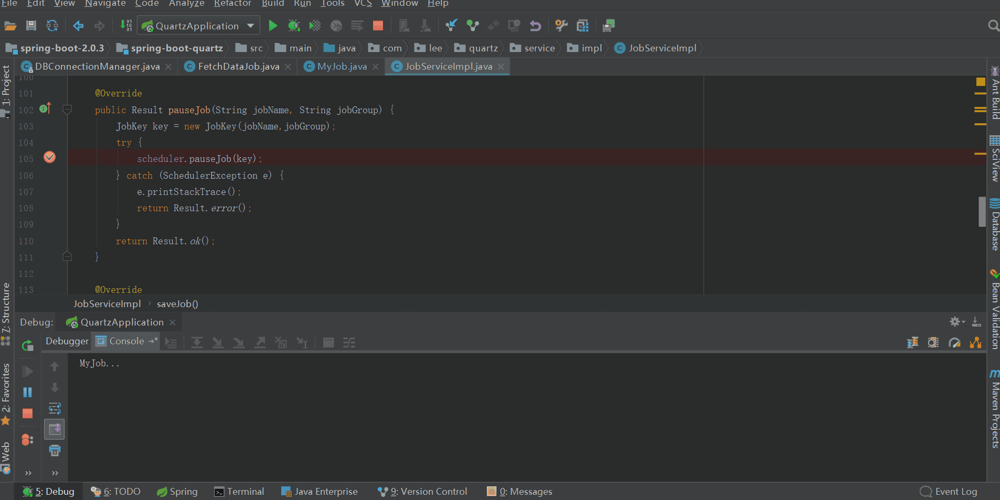
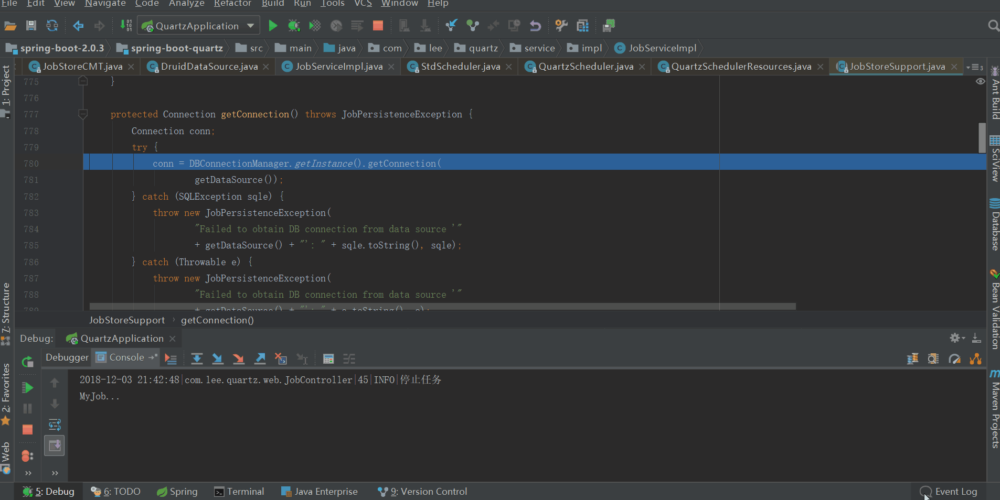
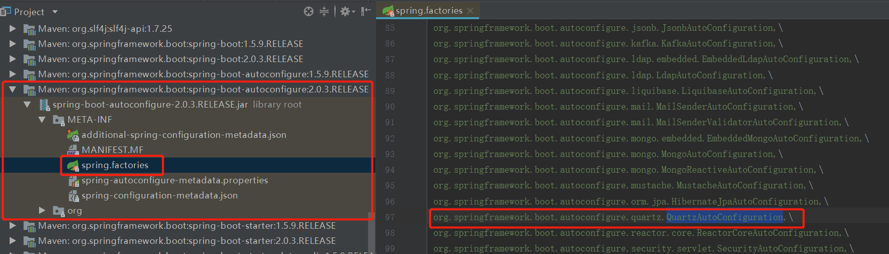

## 前言

开心一刻

着火了，他报警说：119吗，我家发生火灾了。  
119问：在哪里？  
他说：在我家。  
119问：具体点。  
他说：在我家的厨房里。  
119问：我说你现在的位置。  
他说：我趴在桌子底下。  
119：我们怎样才能到你家？  
他说：你们不是有消防车吗？  
119说：烧死你个傻B算了。

路漫漫其修远兮，吾将上下而求索！  
github：[https://github.com/youzhibing](https://github.com/youzhibing)  
码云(gitee)：[https://gitee.com/youzhibing](https://gitee.com/youzhibing)

## 前情回顾

[上篇博客](https://www.cnblogs.com/youzhibing/p/10024558.html)中，讲到了springboot与quartz的集成，非常简单，pow.xml中引入spring-
boot-starter-quartz依赖即可，工程中就可以通过

    
    
    @Override
    private Scheduler scheduler;

自动注入quartz调度器，然后我们就可以通过调度器对quartz组件：Trigger、JobDetail进行添加与删除等操作，实现对任务的调度。

结果也如我们预期一样，每隔10s我们的MyJob的executeinternal方法就被调用，打印一条信息：MyJob...

似乎一切都是那么顺利，感觉集成quartz就是这么简单！

测试工程：[spring-boot-quartz](https://gitee.com/youzhibing/spring-
boot-2.0.3/tree/master/spring-boot-quartz)

## 数据源问题

###  产生背景

如果定时任务不服务于业务，那将毫无意义；我们不能让定时任务只是空跑(或者打印一句：MyJob...)，如果是，那么相信我，把这个定时任务删了吧，不要有任何留恋！

既然是服务于我们的业务，那么很大程度上就会操作数据库；我的业务需求就是凌晨某个时间点进行一次数据统计，既要从数据库查数据，也要将统计后的数据插入到数据库。那么问题来了，业务job中如何操作数据库？

业务job示例

    
    
    package com.lee.quartz.job;
    
    import org.quartz.JobExecutionContext;
    import org.quartz.JobExecutionException;
    import org.springframework.scheduling.quartz.QuartzJobBean;
    
    public class MyJob extends QuartzJobBean {
    
        private static final Logger LOGGER = LoggerFactory.getLogger(MyJob.class);
    
        @Override
        protected void executeInternal(JobExecutionContext context) throws JobExecutionException {
            // TODO 如何进行数据库的操作
            System.out.println("MyJob...")
        }
    }

可以从4个方面来考虑（业务job中如何操作数据库）：

1、既然是springboot与quartz的集成，那么我们能不能用spring的注入功能，将我们的mapper（集成了mybatis）注入到业务job中了？

2、利用JobDetail的jobDataMap，将我们的mapper传到业务job中

3、quartz不是有它自己的11张表吗，那它肯定有对数据库进行操作，我们参考quartz是如何操作数据库的

4、实在是不行，我们自己创建数据库连接总行了吧

我们来逐个分析下以上4种方案

方案4，个人不推荐，个人比较推荐连接池的方式来管理数据库连接，但个人实现数据库连接池已经是个不小的挑战了，没必要；不到万不得已不采用此方案。

方案1，这个听起来好像很不错，连接交由spring的数据源管理，我们只需要用其中的连接操作数据库即可。但看上面的MyJob，spring管理的bean能注入进来吗，显然不能，因为MyJob实例不受spring管理；有小伙伴可能会认为这很简单，MyJob实例让spring管理起来不就OK
了！ ok，问题又来了，spring管理的MyJob实例能用到quartz中吗，不能！ quartz如何获取MyJob实例？
我们把MyJob的类全路径：com.lee.quartz.job.MyJob传给了quartz，那么很显然quartz会根据这个类全路径，然后通过反射来实例化MyJob（这也是为什么业务Job一定要有无参构造方法的原因），也就是quartz会重新创建MyJob实例，与spring管理MyJob实例没有任何关系。显然通过spring注入的方式是行不通的。

方案2，我们知道可以通过JobDetail进行参数的传递，但有要求：传递的参数必须能序列化（实现Serializable）；我没测试此方案，不过我想实现起来会有点麻烦。

方案3，这个好像可行，我们可以看看quartz是如何进行数据库操作的，我们把quartz的那套拿过来用是不是就行了呢？

说了这么多，方案总结下：

1、如何利用quartz的数据源（或者数据库连接）进行数据库操作

2、引申下，能不能将quart的数据源设置成我们应用的数据源，让quartz与应用共用一个数据源，方便统一管理？

###  源码探究

1、quartz自身是如何操作数据库的

我们通过暂停任务来跟下源代码，如下图所示

发现获取connection的方式如下所示：

    
    
    conn = DBConnectionManager.getInstance().getConnection(getDataSource());

很明显，DBConnectionManager是单例的，通过DBConnectionManager从数据源中获取数据库连接（conn），既然都拿到conn了，那操作数据库也就简单了。注意：getDataSource()获取的是数据源的名称，不是数据源！

接下来我们再看看数据源是什么数据源，druid？还是quartz自己的数据源？

数据源还是用的我们应用的数据源（druid数据源），springboot自动将我们应用的数据源配置给了quartz。

至此，该问题也就清晰了，总结下：springboot会自动将我们的应用数据源（druid数据源）配置给quartz，quartz操作数据库的时候从数据源中获取数据库连接，然后通过数据库连接对数据库进行操作。

2、springboot是如何设置quartz数据源的

凡是涉及到springboot自动配置的，去找spring-boot-
autoconfigure-2.0.3.RELEASE.jar中spring.factories就对了，如下所示

关于spring.factories文件内容的读取，大家查阅[此篇博文](https://www.cnblogs.com/youzhibing/p/9550343.html)；关于springboot的自动配置，我的springboot启动源码系列篇中还没有讲到。大家姑且先这样认为：

当在类路径下能找到Scheduler.class,
SchedulerFactoryBean.class,PlatformTransactionManager.class时（只要pom.xml有spring-
boot-starter-
quartz依赖，这些类就能在类路径下找到），QuartzAutoConfiguration就会被springboot当成配置类进行自动配置。

将quartz的配置属性设置给SchedulerFactoryBean；将数据源设置给SchedulerFactoryBean：如果有@QuartzDataSource修饰的数据源，则将@QuartzDataSource修饰的数据源设置给SchedulerFactoryBean，否则将应用的数据源（druid数据源）设置给SchedulerFactoryBean，显然我们的应用中没有@QuartzDataSource修饰的数据源，那么SchedulerFactoryBean中的数据源就是应用的数据源；将事务管理器设置给SchedulerFactoryBean。

SchedulerFactoryBean，Scheduler的工程bean，负责创建和配置quartz
Scheduler；它实现了FactoryBean、InitializingBean，FactoryBean的getObject方法实现的很简单，如下

    
    
    @Override
    @Nullable
    public Scheduler getObject() {
        return this.scheduler;
    }

就是返回scheduler实例，注册到spring容器中，那么scheduler是在哪里实例化的呢，就是在afterPropertiesSet中完成的，关于FactoryBean、InitializingBean本文不做过多的讲解，不了解的可以先去查阅下资料（注意：InitializingBean的afterPropertiesSet()先于FactoryBean的getObject()执行）。接下来我们仔细看看SchedulerFactoryBean实现InitializingBean的afterPropertiesSet方法

    
    
    @Override
    public void afterPropertiesSet() throws Exception {
        if (this.dataSource == null && this.nonTransactionalDataSource != null) {
            this.dataSource = this.nonTransactionalDataSource;
        }
    
        if (this.applicationContext != null && this.resourceLoader == null) {
            this.resourceLoader = this.applicationContext;
        }
    
        // Initialize the Scheduler instance... 初始化Scheduler实例
        this.scheduler = prepareScheduler(prepareSchedulerFactory());
        try {
            registerListeners();                // 注册Scheduler相关监听器，一般没有
            registerJobsAndTriggers();            // 注册jobs和triggers， 一般没有
        }
        catch (Exception ex) {
            try {
                this.scheduler.shutdown(true);
            }
            catch (Exception ex2) {
                logger.debug("Scheduler shutdown exception after registration failure", ex2);
            }
            throw ex;
        }
    }

View Code

我们来重点跟下：this.scheduler = prepareScheduler(prepareSchedulerFactory());

可以看到我们通过org.quartz.jobStore.dataSource设置的dsName（quartzDs）最后会被替换成springTxDataSource.加scheduler实例名（我们的应用中是：springTxDataSource.quartzScheduler），这也就是为什么我们通过DBConnectionManager.getInstance().getConnection("quartzDs")报以下错误的原因

    
    
    java.sql.SQLException: There is no DataSource named "quartzDs"
        at org.quartz.utils.DBConnectionManager.getConnection(DBConnectionManager.java:104)
        at com.lee.quartz.job.FetchDataJob.executeInternal(FetchDataJob.java:24)
        at org.springframework.scheduling.quartz.QuartzJobBean.execute(QuartzJobBean.java:75)
        at org.quartz.core.JobRunShell.run(JobRunShell.java:202)
        at org.quartz.simpl.SimpleThreadPool$WorkerThread.run(SimpleThreadPool.java:573)

View Code

LocalDataSourceJobStore的initialize内容如下

    
    
    @Override
        public void initialize(ClassLoadHelper loadHelper, SchedulerSignaler signaler) throws SchedulerConfigException {
            // Absolutely needs thread-bound DataSource to initialize.
            this.dataSource = SchedulerFactoryBean.getConfigTimeDataSource();
            if (this.dataSource == null) {
                throw new SchedulerConfigException("No local DataSource found for configuration - " +
                        ""dataSource" property must be set on SchedulerFactoryBean");
            }
    
            // Configure transactional connection settings for Quartz.
            setDataSource(TX_DATA_SOURCE_PREFIX + getInstanceName());
            setDontSetAutoCommitFalse(true);
    
            // Register transactional ConnectionProvider for Quartz.
            DBConnectionManager.getInstance().addConnectionProvider(
                    TX_DATA_SOURCE_PREFIX + getInstanceName(),
                    new ConnectionProvider() {
                        @Override
                        public Connection getConnection() throws SQLException {
                            // Return a transactional Connection, if any.
                            return DataSourceUtils.doGetConnection(dataSource);
                        }
                        @Override
                        public void shutdown() {
                            // Do nothing - a Spring-managed DataSource has its own lifecycle.
                        }
                        /* Quartz 2.2 initialize method */
                        public void initialize() {
                            // Do nothing - a Spring-managed DataSource has its own lifecycle.
                        }
                    }
            );
    
            // Non-transactional DataSource is optional: fall back to default
            // DataSource if not explicitly specified.
            DataSource nonTxDataSource = SchedulerFactoryBean.getConfigTimeNonTransactionalDataSource();
            final DataSource nonTxDataSourceToUse = (nonTxDataSource != null ? nonTxDataSource : this.dataSource);
    
            // Configure non-transactional connection settings for Quartz.
            setNonManagedTXDataSource(NON_TX_DATA_SOURCE_PREFIX + getInstanceName());
    
            // Register non-transactional ConnectionProvider for Quartz.
            DBConnectionManager.getInstance().addConnectionProvider(
                    NON_TX_DATA_SOURCE_PREFIX + getInstanceName(),
                    new ConnectionProvider() {
                        @Override
                        public Connection getConnection() throws SQLException {
                            // Always return a non-transactional Connection.
                            return nonTxDataSourceToUse.getConnection();
                        }
                        @Override
                        public void shutdown() {
                            // Do nothing - a Spring-managed DataSource has its own lifecycle.
                        }
                        /* Quartz 2.2 initialize method */
                        public void initialize() {
                            // Do nothing - a Spring-managed DataSource has its own lifecycle.
                        }
                    }
            );
    
            // No, if HSQL is the platform, we really don"t want to use locks...
            try {
                String productName = JdbcUtils.extractDatabaseMetaData(this.dataSource, "getDatabaseProductName");
                productName = JdbcUtils.commonDatabaseName(productName);
                if (productName != null && productName.toLowerCase().contains("hsql")) {
                    setUseDBLocks(false);
                    setLockHandler(new SimpleSemaphore());
                }
            }
            catch (MetaDataAccessException ex) {
                logWarnIfNonZero(1, "Could not detect database type. Assuming locks can be taken.");
            }
    
            super.initialize(loadHelper, signaler);
    
        }

View Code

注册两个ConnectionProvider给quartz：一个dsName叫springTxDataSource.quartzScheduler，有事务；一个dsName叫springNonTxDataSource.quartzScheduler，没事务；所以我们通过DBConnectionManager获取connection时，通过指定dsName就能获取支持事务或不支持事务的connection。

另外，SchedulerFactoryBean实现了SmartLifecycle，会在ApplicationContext
refresh的时候启动Schedule，ApplicationContext shutdown的时候停止Schedule。

## 总结

1、springboot集成quartz，应用启动过程中会自动调用schedule的start方法来启动调度器，也就相当于启动了quartz，原因是SchedulerFactoryBean实现了SmartLifecycle接口；

2、springboot会自动将我们应用的数据源配置给quartz，在我们示例应用中数据源是druid数据源，应用和quartz都是用的此数据源；

3、通过org.quartz.jobStore.dataSource设置的数据源名会被覆盖掉，当我们通过quartz的DBConnectionManager获取connection时，默认情况dbName给springTxDataSource.quartzScheduler或者springNonTxDataSource.quartzScheduler，一个支持事务，一个不支持事务；至于怎样自定义dsName，我还没去尝试，有兴趣的小伙伴可以自己试试；

4、springboot集成quartz，只是将quartz的一些通用配置给配置好了，如果我们对quartz十分熟悉，那么就很好理解，但如果对quartz不熟悉（楼主对quartz就不熟悉），那么很多时候出了问题就无从下手了，所以建议大家先熟悉quartz；

