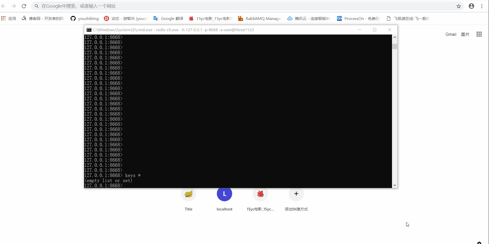
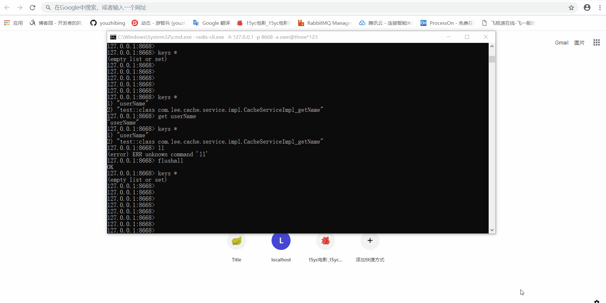

## 前言

开心一刻

小白问小明：“你前面有一个5米深的坑，里面没有水，如果你跳进去后该怎样出来了？”小明：“躺着出来呗，还能怎么出来？”小白：“为什么躺着出来？”小明：“5米深的坑，还没有水，跳下去不死就很幸运了，残是肯定会残的，不躺着出来，那能怎么出来？”小白：“假设没死也没残呢？”小明：“你当我超人了？
那也简单，把脑子里的水放出来就可以漂出来了。”小白：“你脑子里有这么多水吗？”小明：“我脑子里没那么多水我跳下去干嘛？”

路漫漫其修远兮，吾将上下而求索！

github：[https://github.com/youzhibing](https://github.com/youzhibing)

码云(gitee)：[https://gitee.com/youzhibing](https://gitee.com/youzhibing)

springboot
1.x到2.x变动的内容还是挺多的，而2.x之间也存在细微的差别，本文不讲这些差别（具体差别我也不知道，汗......），只讲1.5.9与2.0.3的redis缓存配置的区别

## springboot1.5.9缓存配置

###  工程实现

1.x系列配置应该都差不多，下面我们看看1.5.9中，springboot集成redis的缓存实现

pom.xml

    
    
    <?xml version="1.0" encoding="UTF-8"?>
    <project xmlns="http://maven.apache.org/POM/4.0.0"
             xmlns:xsi="http://www.w3.org/2001/XMLSchema-instance"
             xsi:schemaLocation="http://maven.apache.org/POM/4.0.0 http://maven.apache.org/xsd/maven-4.0.0.xsd">
        <modelVersion>4.0.0</modelVersion>
    
        <groupId>com.lee</groupId>
        <artifactId>spring-boot159.cache</artifactId>
        <version>1.0-SNAPSHOT</version>
    
        <properties>
            <java.version>1.8</java.version>
        </properties>
    
        <parent>
            <groupId>org.springframework.boot</groupId>
            <artifactId>spring-boot-starter-parent</artifactId>
            <version>1.5.9.RELEASE</version>
        </parent>
    
        <dependencies>
    
            <dependency>
                <groupId>org.springframework.boot</groupId>
                <artifactId>spring-boot-starter-web</artifactId>
            </dependency>
    
            <dependency>
                <groupId>org.springframework.boot</groupId>
                <artifactId>spring-boot-starter-data-redis</artifactId>
            </dependency>
    
        </dependencies>
    </project>

View Code

application.yml

    
    
    server:
      port: 8888
    spring:
      #redis配置
      redis:
        database: 0
        host: 127.0.0.1
        port: 6379
        password: 
        # 连接超时时间（毫秒）
        timeout: 2000
        pool:
          # 连接池最大连接数（使用负值表示没有限制）
          max-active: 8
          # 连接池最大阻塞等待时间（使用负值表示没有限制）
          max-wait: -1
          # 连接池中的最大空闲连接
          max-idle: 8
          # 连接池中的最小空闲连接
          min-idle: 0
      cache:
        type: redis
    cache:
      expire-time: 180

View Code

RedisCacheConfig.java

    
    
    package com.lee.cache.config;
    
    import com.fasterxml.jackson.annotation.JsonAutoDetect;
    import com.fasterxml.jackson.annotation.PropertyAccessor;
    import com.fasterxml.jackson.databind.ObjectMapper;
    import org.springframework.beans.factory.annotation.Value;
    import org.springframework.cache.CacheManager;
    import org.springframework.cache.annotation.CachingConfigurerSupport;
    import org.springframework.cache.annotation.EnableCaching;
    import org.springframework.cache.interceptor.KeyGenerator;
    import org.springframework.context.annotation.Bean;
    import org.springframework.context.annotation.Configuration;
    import org.springframework.data.redis.cache.RedisCacheManager;
    import org.springframework.data.redis.connection.RedisConnectionFactory;
    import org.springframework.data.redis.core.RedisTemplate;
    import org.springframework.data.redis.core.StringRedisTemplate;
    import org.springframework.data.redis.serializer.Jackson2JsonRedisSerializer;
    
    /**
     *  必须继承CachingConfigurerSupport，不然此类中生成的Bean不会生效（没有替换掉默认生成的，只是一个普通的bean）
     *  springboot默认生成的缓存管理器和redisTemplate支持的类型很有限，根本不满足我们的需求，会抛出如下异常：
     *      org.springframework.cache.interceptor.SimpleKey cannot be cast to java.lang.String
     */
    @Configuration
    @EnableCaching
    public class RedisCacheConfig extends CachingConfigurerSupport {
    
        @Value("${cache.expire-time:180}")
        private int expireTime;
    
        // 配置key生成器，作用于缓存管理器管理的所有缓存
        // 如果缓存注解（@Cacheable、@CacheEvict等）中指定key属性，那么会覆盖此key生成器
        @Bean
        public KeyGenerator keyGenerator() {
            return (target, method, params) -> {
                StringBuilder sb = new StringBuilder();
                sb.append(target.getClass().getName());
                sb.append(method.getName());
                for (Object obj : params) {
                    sb.append(obj.toString());
                }
                return sb.toString();
            };
        }
    
        // 缓存管理器管理的缓存都需要有对应的缓存空间，否则抛异常：No cache could be resolved for "Builder...
        @Bean
        public CacheManager cacheManager(RedisTemplate redisTemplate) {
            RedisCacheManager rcm = new RedisCacheManager(redisTemplate);
            rcm.setDefaultExpiration(expireTime);               //设置缓存管理器管理的缓存的过期时间, 单位：秒
            return rcm;
        }
    
        @Bean
        public RedisTemplate<String, String> redisTemplate(RedisConnectionFactory factory) {
            StringRedisTemplate template = new StringRedisTemplate(factory);
            Jackson2JsonRedisSerializer jackson2JsonRedisSerializer = new Jackson2JsonRedisSerializer(Object.class);
            ObjectMapper om = new ObjectMapper();
            om.setVisibility(PropertyAccessor.ALL, JsonAutoDetect.Visibility.ANY);
            om.enableDefaultTyping(ObjectMapper.DefaultTyping.NON_FINAL);
            jackson2JsonRedisSerializer.setObjectMapper(om);
            template.setValueSerializer(jackson2JsonRedisSerializer);
            template.afterPropertiesSet();
            return template;
        }
    }

View Code

CacheServiceImpl.java

    
    
    package com.lee.cache.service.impl;
    
    import com.lee.cache.model.User;
    import com.lee.cache.service.ICacheService;
    import org.springframework.beans.factory.annotation.Autowired;
    import org.springframework.cache.annotation.Cacheable;
    import org.springframework.data.redis.core.RedisTemplate;
    import org.springframework.stereotype.Service;
    import org.springframework.util.StringUtils;
    
    import java.util.ArrayList;
    import java.util.List;
    
    /**
     * 若未配置@CacheConfig(cacheNames = "hello"), 则@Cacheable一定要配置value，相当于指定缓存空间
     * 否则会抛异常：No cache could be resolved for "Builder...
     *
     * 若@CacheConfig(cacheNames = "hello") 与 @Cacheable(value = "123")都配置了， 则@Cacheable(value = "123")生效
     *
     * 当然@CacheConfig还有一些其他的配置项，Cacheable也有一些其他的配置项
     */
    @Service
    public class CacheServiceImpl implements ICacheService {
    
        @Autowired
        private RedisTemplate<String, String> redisTemplate;
    
        @Override
        @Cacheable(value = "test")                                                    // key用的自定义的KeyGenerator
        public String getName() {
            System.out.println("getName, no cache now...");
            return "brucelee";
        }
    
        @Override
        @Cacheable(value = "user", key = "methodName + "_" + #p0", unless = "#result.size() <= 0")      // key会覆盖掉KeyGenerator
        public List<User> listUser(int pageNum, int pageSize) {
            System.out.println("listUser no cache now...");
            List<User> users = new ArrayList<>();
            users.add(new User("zhengsan", 22));
            users.add(new User("lisi", 20));
            System.out.println("===========");
            return users;
        }
    
        /**
         * 缓存不是缓存管理器管理，那么不受缓存管理器的约束
         * 缓存管理器中的配置不适用与此
         * 这里相当于我们平时直接通过redis-cli操作redis
         * @return
         */
        @Override
        public String getUserName() {
    
            String userName = redisTemplate.opsForValue().get("userName");
            if (!StringUtils.isEmpty(userName)) {
                return userName;
            }
    
            System.out.println("getUserName, no cache now...");
            redisTemplate.opsForValue().set("userName", "userName");
            return "userName";
        }
    
    }

View Code

上述只讲了几个主要的文件，更多详情请点[springboot159-cache](https://gitee.com/youzhibing/spring-
boot-2.0.3/tree/master/springboot159-cache)

###  redis 怎样保存cache

大家一定要把工程仔细看一遍，不然下面出现的一些名称会让我们感觉不知从哪来的；

工程中的缓存分两种：缓存管理器管理的缓存（也就是一些列注解实现的缓存）、redisTemplate操作的缓存

缓存管理器管理的缓存

会在redis中增加2条数据，一个是类型为 zset 的 缓存名~keys , 里面存放了该缓存所有的key，
另一个是对应的key，值为序列化后的json；缓存名~keys可以理解成缓存空间，与我们平时所说的具体的缓存是不一样的。另外对缓存管理器的一些设置（全局过期时间等）都会反映到缓存管理器管理的所有缓存上；上图中的http://localhost:8888/getName和http://localhost:8888/listUser?pageNum=1&pageSize=3对应的是缓存管理器管理的缓存。

redisTemplate操作的缓存

会在redis中增加1条记录，key - value键值对，与我们通过redis-
cli操作缓存一样；上图中的http://localhost:8888/getUserName对应的是redisTemplate操作的缓存。

## spring2.0.3缓存配置

###  工程实现

pom.xml

    
    
    <?xml version="1.0" encoding="UTF-8"?>
    <project xmlns="http://maven.apache.org/POM/4.0.0"
             xmlns:xsi="http://www.w3.org/2001/XMLSchema-instance"
             xsi:schemaLocation="http://maven.apache.org/POM/4.0.0 http://maven.apache.org/xsd/maven-4.0.0.xsd">
        <modelVersion>4.0.0</modelVersion>
    
        <groupId>com.lee</groupId>
        <artifactId>spring-boot-cache</artifactId>
        <version>1.0-SNAPSHOT</version>
    
        <parent>
            <groupId>org.springframework.boot</groupId>
            <artifactId>spring-boot-starter-parent</artifactId>
            <version>2.0.3.RELEASE</version>
        </parent>
    
        <dependencies>
    
            <dependency>
                <groupId>org.springframework.boot</groupId>
                <artifactId>spring-boot-starter-web</artifactId>
            </dependency>
    
            <dependency>
                <groupId>org.springframework.boot</groupId>
                <artifactId>spring-boot-starter-data-redis</artifactId>
            </dependency>
            <dependency>
                <groupId>org.apache.commons</groupId>
                <artifactId>commons-pool2</artifactId>
            </dependency>
            <dependency>
                <groupId>org.apache.commons</groupId>
                <artifactId>commons-lang3</artifactId>
            </dependency>
    
        </dependencies>
    </project>

View Code

application.yml

    
    
    server:
      port: 8889
    spring:
      #redis配置
      redis:
        database: 0
        host: 127.0.0.1
        port: 6379
        password:
        lettuce:
          pool:
            # 接池最大连接数（使用负值表示没有限制）
            max-active: 8
            # 连接池最大阻塞等待时间（使用负值表示没有限制）
            max-wait: -1ms
            # 连接池中的最小空闲连接
            max-idle: 8
            # 连接池中的最大空闲连接
            min-idle: 0
        # 连接超时时间
        timeout: 2000ms
      cache:
        type: redis
    cache:
      test:
        expire-time: 180
        name: test
      default:
        expire-time: 200

View Code

缓存定制：RedisCacheManagerConfig.java

    
    
    package com.lee.cache.config;
    
    import org.springframework.beans.factory.annotation.Value;
    import org.springframework.cache.CacheManager;
    import org.springframework.context.annotation.Bean;
    import org.springframework.context.annotation.Configuration;
    import org.springframework.data.redis.cache.RedisCacheConfiguration;
    import org.springframework.data.redis.cache.RedisCacheManager;
    import org.springframework.data.redis.connection.RedisConnectionFactory;
    import org.springframework.data.redis.serializer.GenericJackson2JsonRedisSerializer;
    import org.springframework.data.redis.serializer.RedisSerializationContext;
    import org.springframework.data.redis.serializer.StringRedisSerializer;
    
    import java.time.Duration;
    import java.util.HashMap;
    import java.util.HashSet;
    import java.util.Map;
    import java.util.Set;
    
    /**
     * 进行缓存管理的定制
     * 可以不配置，采用springboot默认的也行
     */
    @Configuration
    public class RedisCacheManagerConfig {
    
        @Value("${cache.default.expire-time:1800}")
        private int defaultExpireTime;
        @Value("${cache.test.expire-time:180}")
        private int testExpireTime;
        @Value("${cache.test.name:test}")
        private String testCacheName;
    
    
        //缓存管理器
        @Bean
        public CacheManager cacheManager(RedisConnectionFactory lettuceConnectionFactory) {
            RedisCacheConfiguration defaultCacheConfig = RedisCacheConfiguration.defaultCacheConfig();
            // 设置缓存管理器管理的缓存的默认过期时间
            defaultCacheConfig = defaultCacheConfig.entryTtl(Duration.ofSeconds(defaultExpireTime))
                    // 设置 key为string序列化
                    .serializeKeysWith(RedisSerializationContext.SerializationPair.fromSerializer(new StringRedisSerializer()))
                    // 设置value为json序列化
                    .serializeValuesWith(RedisSerializationContext.SerializationPair.fromSerializer(new GenericJackson2JsonRedisSerializer()))
                    // 不缓存空值
                    .disableCachingNullValues();
    
            Set<String> cacheNames = new HashSet<>();
            cacheNames.add(testCacheName);
    
            // 对每个缓存空间应用不同的配置
            Map<String, RedisCacheConfiguration> configMap = new HashMap<>();
            configMap.put(testCacheName, defaultCacheConfig.entryTtl(Duration.ofSeconds(testExpireTime)));
    
            RedisCacheManager cacheManager = RedisCacheManager.builder(lettuceConnectionFactory)
                    .cacheDefaults(defaultCacheConfig)
                    .initialCacheNames(cacheNames)
                    .withInitialCacheConfigurations(configMap)
                    .build();
            return cacheManager;
        }
    }

View Code

此类可不用配置，就用spring-boot自动配置的缓存管理器也行，只是在缓存的可阅读性上会差一些。有兴趣的朋友可以删除此类试试。

CacheServiceImpl.java

    
    
    package com.lee.cache.service.impl;
    
    import com.lee.cache.model.User;
    import com.lee.cache.service.ICacheService;
    import org.apache.commons.lang3.StringUtils;
    import org.springframework.beans.factory.annotation.Autowired;
    import org.springframework.cache.annotation.CacheConfig;
    import org.springframework.cache.annotation.Cacheable;
    import org.springframework.data.redis.core.RedisTemplate;
    import org.springframework.stereotype.Service;
    
    import java.util.ArrayList;
    import java.util.List;
    
    /**
     * 若未配置@CacheConfig(cacheNames = "hello"), 则@Cacheable一定要配置value
     * 若@CacheConfig(cacheNames = "hello") 与 @Cacheable(value = "123")都配置了， 则@Cacheable(value = "123") 生效
     *
     * 当然@CacheConfig还有一些其他的配置项，Cacheable也有一些其他的配置项
     */
    @Service
    public class CacheServiceImpl implements ICacheService {
    
        @Autowired
        private RedisTemplate<String, String> redisTemplate;
    
        @Override
        @Cacheable(value = "test", key = "targetClass + "_" + methodName")
        public String getName() {
            System.out.println("getName, no cache now...");
            return "brucelee";
        }
    
        @Override
        @Cacheable(value = "user", key = "targetClass + ":" + methodName + "_" + #p0", unless = "#result.size() <= 0")
        public List<User> listUser(int pageNum, int pageSize) {
            System.out.println("listUser no cache now...");
            List<User> users = new ArrayList<>();
            users.add(new User("zhengsan", 22));
            users.add(new User("lisi", 20));
            return users;
        }
    
        /**
         * 缓存不是缓存管理器管理，那么不受缓存管理器的约束
         * 缓存管理器中的配置不适用与此
         * 这里相当于我们平时直接通过redis-cli操作redis
         * @return
         */
        @Override
        public String getUserName() {
    
            String userName = redisTemplate.opsForValue().get("userName");
            if (StringUtils.isNotEmpty(userName)) {
                return userName;
            }
    
            System.out.println("getUserName, no cache now...");
            redisTemplate.opsForValue().set("userName", "userName");
            return "userName";
        }
    
    }

View Code

更多详情请点[spring-boot-cache](https://gitee.com/youzhibing/spring-
boot-2.0.3/tree/master/spring-boot-cache)

###  redis 怎样保存cache

我们来看图说话，看看缓存在redis中是如何保存的

工程中的缓存分两种：缓存管理器管理的缓存（也就是一些列注解实现的缓存）、redisTemplate操作的缓存

缓存管理器管理的缓存

会在redis中增加1条数据，key是以缓存空间开头的字符串（缓存空间名::缓存key），值为序列化后的json；上图中的http://localhost:8889/getName和http://localhost:8889/listUser?pageNum=1&pageSize=3对应的是缓存管理器管理的缓存。

redisTemplate操作的缓存

会在redis中增加1条记录，key - value键值对，与我们通过redis-
cli操作缓存一样；上图中的http://localhost:8889/getUserName对应的是redisTemplate操作的缓存。

## 总结

1、有时候我们引入spring-boot-starter-cache这个starter只是为了快速添加缓存依赖，目的是引入spring-context-
support；如果我们的应用中中已经有了spring-context-support，那么我们无需再引入spring-boot-starter-
cache，例如我们的应用中依赖了spring-boot-starter-web，而spring-boot-starter-web中又有spring-
context-support依赖，所以我们无需再引入spring-boot-starter-cache。

2、[Supported Cache Providers](https://docs.spring.io/spring-
boot/docs/2.0.3.RELEASE/reference/htmlsingle/#_supported_cache_providers)，讲了支持的缓存类型以及默认情况下的缓存加载方式，可以通读下。

3、只要我们引入了redis依赖，并将redis的连接信息配置正确，springboot（2.0.3）根据我们的配置会给我们生成默认的缓存管理器和redisTemplate；我们也可以自定义我们自己的缓存管理器来替换掉默认的，只要我们自定义了缓存管理器和redisTemplate，那么springboot的默认生成的会替换成我们自定义的。

4、缓存管理器对缓存的操作也是通过redisTemplate实现的，只是进行了统一的管理，并且能够减少我么的代码量，我们可以将更多的精力放到业务处理上。

5、redis-cli -h 127.0.0.1 -p 6379 -a 123456与redis-cli -a
123456两种方式访问到的数据完全不一致，好像操作不同的库一样！ 这个需要注意，有空我回头看看这两者到底有啥区别，有知道的朋友可以留个言。

最后缅怀一下：金庸走了，再无江湖；IG捧杯了，再无LOL！感谢IG成就了我的完美谢幕，让我的青春少了一份遗憾，谢谢！

## 参考

[spring boot(三)：Spring
Boot中Redis的使用](https://www.cnblogs.com/ityouknow/p/5748830.html)

[Caching](https://docs.spring.io/spring-
boot/docs/2.0.3.RELEASE/reference/htmlsingle/#boot-features-caching)

