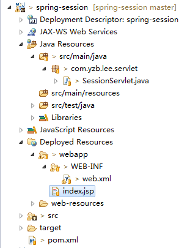
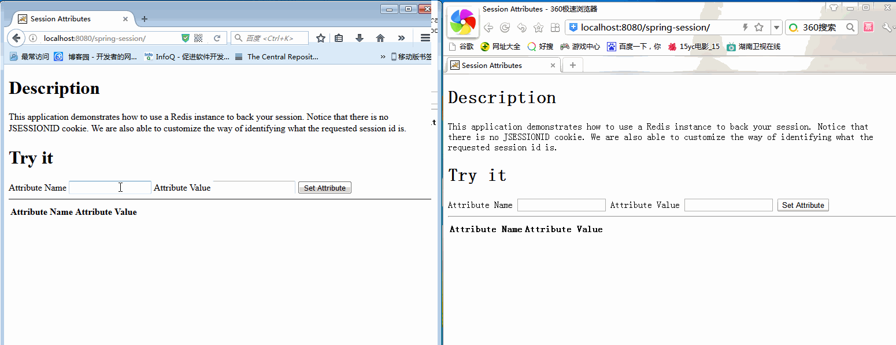
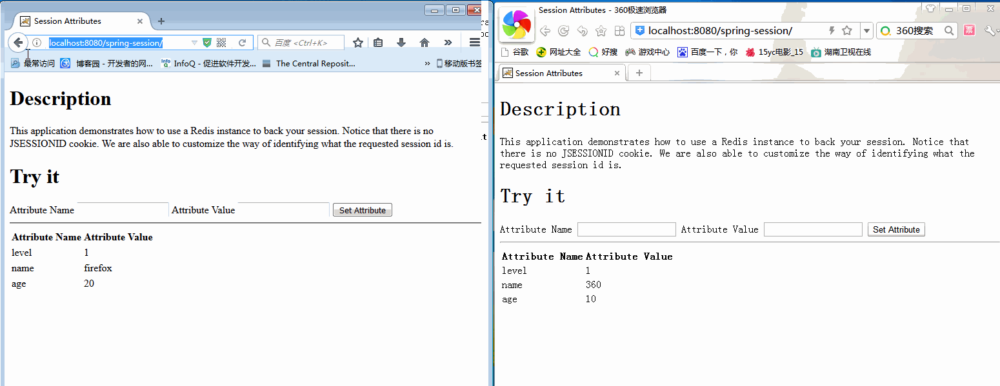
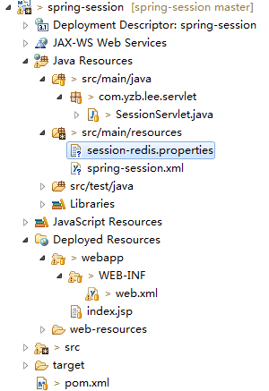
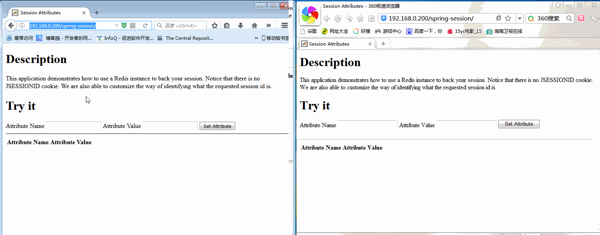
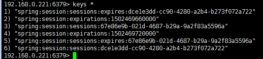
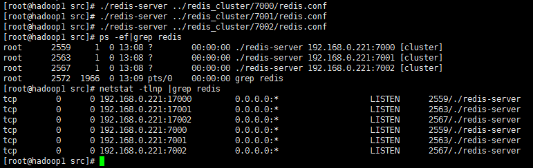
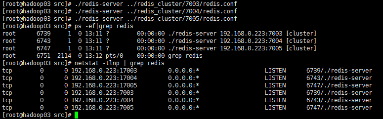
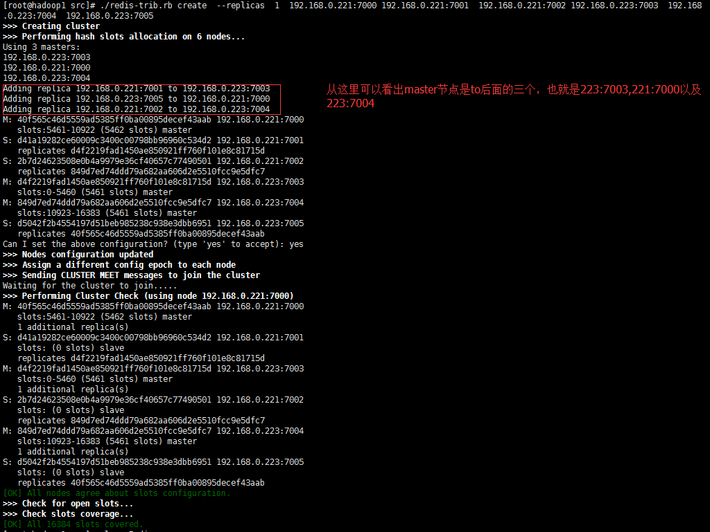

## 前言

HttpSession是通过Servlet容器创建和管理的，像Tomcat/Jetty都是保存在内存中的。但是我们把应用搭建成分布式的集群，然后利用LVS或Nginx做负载均衡，那么来自同一用户的Http请求将有可能被分发到多个不同的应用中。那问题来了，如何保证不同的应用能够共享同一份session数据呢？最简单的想法,就是把session数据保存到内存以外的一个统一的地方，例如Memcached/Redis等数据库中。那问题又来了，如何替换掉Servlet容器创建和管理的HttpSession的实现呢？

1、利用Servlet容器提供的插件功能，自定义HttpSession的创建和管理策略，并通过配置的方式替换掉默认的策略。
_这方面其实早就有开源项目了，例如memcached-session-manager(可以参考_[ 负载均衡+session共享(memcached-
session-
manager实现](http://www.cnblogs.com/youzhibing/p/5094460.html))，以及tomcat-redis-
session-manager。不过这种方式有个缺点，就是需要耦合Tomcat/Jetty等Servlet容器的代码。

2、设计一个Filter，利用HttpServletRequestWrapper，实现自己的
getSession()方法，接管创建和管理Session数据的工作。spring-session就是通过这样的思路实现的。

参考 [spring-session之一 初探 spring-
session](http://feitianbenyue.iteye.com/blog/2326408)

本博客不涉及session解释，关于session大家自行去查资料；关于spring-
session的相关概念大家可以去spring官网查阅（http://projects.spring.io/spring-session/）。

## 单机应用

我们先来看下单机应用，应用很简单，就是在session中设置变量，然后获取这些设置的变量进行展示 ，具体代码如下

pom.xml:

    
    
    <project xmlns="http://maven.apache.org/POM/4.0.0" xmlns:xsi="http://www.w3.org/2001/XMLSchema-instance"
        xsi:schemaLocation="http://maven.apache.org/POM/4.0.0 http://maven.apache.org/maven-v4_0_0.xsd">
        <modelVersion>4.0.0</modelVersion>
        <groupId>com.yzb.lee</groupId>
        <artifactId>spring-session</artifactId>
        <packaging>war</packaging>
        <version>0.0.1-SNAPSHOT</version>
        <name>spring-session Maven Webapp</name>
        <url>http://maven.apache.org</url>
    
        <properties>
            <maven.compiler.source>1.8</maven.compiler.source>
            <maven.compiler.target>1.8</maven.compiler.target>
        </properties>
    
        <dependencies>
            <dependency>
                <groupId>javax.servlet</groupId>
                <artifactId>jstl</artifactId>
                <version>1.2</version>
            </dependency>
            
            <dependency>
                <groupId>junit</groupId>
                <artifactId>junit</artifactId>
                <version>3.8.1</version>
                <scope>test</scope>
            </dependency>
        </dependencies>
        <build>
            <finalName>spring-session</finalName>
        </build>
    </project>

View Code

web.xml

    
    
    <?xml version="1.0" encoding="UTF-8"?>
    <web-app>
        <display-name>Archetype Created Web Application</display-name>
    
        <servlet>
            <servlet-name>session</servlet-name>
            <servlet-class>com.yzb.lee.servlet.SessionServlet</servlet-class>
        </servlet>
        <servlet-mapping>
            <servlet-name>session</servlet-name>
            <url-pattern>/session</url-pattern>
        </servlet-mapping>
    
        <welcome-file-list>
            <welcome-file>index.jsp</welcome-file>
        </welcome-file-list>
    </web-app>

View Code

SessionServlet.java

    
    
    package com.yzb.lee.servlet;
    
    import java.io.IOException;
    
    import javax.servlet.ServletException;
    import javax.servlet.http.HttpServlet;
    import javax.servlet.http.HttpServletRequest;
    import javax.servlet.http.HttpServletResponse;
    
    public class SessionServlet extends HttpServlet {
    
        private static final long serialVersionUID = 1L;
    
        @Override
        protected void doPost(HttpServletRequest req, HttpServletResponse resp)
                throws ServletException, IOException {
            String attributeName = req.getParameter("attributeName");
            String attributeValue = req.getParameter("attributeValue");
            req.getSession().setAttribute(attributeName, attributeValue);
            
            resp.sendRedirect(req.getContextPath() + "/");
        }
    }

View Code

index.jsp

    
    
    <%@ taglib prefix="c" uri="http://java.sun.com/jsp/jstl/core" %>
    <%@ page isELIgnored="false" %>
    <!DOCTYPE html>
    <html lang="en">
    <head>
        <title>Session Attributes</title>
    </head>
    <body>
        

            <h1>Description</h1>
            
This application demonstrates how to use a Redis instance to back your session. Notice that there is no JSESSIONID cookie. We are also able to customize the way of identifying what the requested session id is.

    
            <h1>Try it</h1>
    
            <form class="form-inline" role="form" action="./session" method="post">
                <label for="attributeName">Attribute Name</label>
                <input id="attributeName" type="text" name="attributeName"/>
                <label for="attributeValue">Attribute Value</label>
                <input id="attributeValue" type="text" name="attributeValue"/>
                <input type="submit" value="Set Attribute"/>
            </form>
    
            

    
            <table class="table table-striped">
                <thead>
                <tr>
                    <th>Attribute Name</th>
                    <th>Attribute Value</th>
                </tr>
                </thead>
                <tbody>
                <c:forEach items="${sessionScope}" var="attr">
                    <tr>
                        <td><c:out value="${attr.key}"/></td>
                        <td><c:out value="${attr.value}"/></td>
                    </tr>
                </c:forEach>
                </tbody>
            </table>
        

    </body>
    </html>

View Code

整个项目结构非常简单，如下如

本地运行起来，效果如下

火狐浏览器与360浏览器代表不同的用户，各自都能获取各自session中的设置的全部变量，很正常，没毛病。

## 分布式集群应用

单机应用中，session肯定没问题，就存在本地的servlet容器中，那么在分布式集群中会像单机一样正常吗？我们接着往下看

搭建高可用的、实现负载均衡的分布式集群环境可参考[nginx实现请求的负载均衡 +
keepalived实现nginx的高可用](http://www.cnblogs.com/youzhibing/p/7327342.html)，没搭建的需要先把分布式环境搭建起来

###  没设置ession共享

应用不变，代码与单机中的完全一致，将代码部署到分布式集群中去

全部运行起来，效果如下

结果是：无论给session设置多少个值，session中的值都获取不到（离我的预期还是有差距，具体什么差距请看我的问题）

###  spring-session实现session共享

应用有所变化，代码与之前有所不同，具体区别如下（SessionServlet与index.jsp不变）

pom.xml

    
    
    <project xmlns="http://maven.apache.org/POM/4.0.0" xmlns:xsi="http://www.w3.org/2001/XMLSchema-instance"
        xsi:schemaLocation="http://maven.apache.org/POM/4.0.0 http://maven.apache.org/maven-v4_0_0.xsd">
        <modelVersion>4.0.0</modelVersion>
        <groupId>com.yzb.lee</groupId>
        <artifactId>spring-session</artifactId>
        <packaging>war</packaging>
        <version>0.0.1-SNAPSHOT</version>
        <name>spring-session Maven Webapp</name>
        <url>http://maven.apache.org</url>
    
        <properties>
            <maven.compiler.source>1.7</maven.compiler.source>
            <maven.compiler.target>1.7</maven.compiler.target>
        </properties>
    
        <dependencies>
    
            <dependency>
                    <groupId>org.springframework.session</groupId>
                    <artifactId>spring-session-data-redis</artifactId>
                    <version>1.3.1.RELEASE</version>
                    <type>pom</type>
            </dependency>
            <dependency>
                    <groupId>biz.paluch.redis</groupId>
                    <artifactId>lettuce</artifactId>
                    <version>3.5.0.Final</version>
            </dependency>
            <dependency>
                    <groupId>org.springframework</groupId>
                    <artifactId>spring-web</artifactId>
                    <version>4.3.4.RELEASE</version>
            </dependency>
    
            <dependency>
                <groupId>javax.servlet</groupId>
                <artifactId>jstl</artifactId>
                <version>1.2</version>
            </dependency>
            
            <dependency>
                <groupId>junit</groupId>
                <artifactId>junit</artifactId>
                <version>3.8.1</version>
                <scope>test</scope>
            </dependency>
        </dependencies>
        <build>
            <finalName>spring-session</finalName>
        </build>
    </project>

View Code

web.xml

    
    
    <?xml version="1.0" encoding="UTF-8"?>
    <web-app>
        <display-name>Archetype Created Web Application</display-name>
    
        <!-- spring-session config -->
        <context-param>
            <param-name>contextConfigLocation</param-name>
            <param-value>classpath*:spring-session.xml</param-value>
        </context-param>
    
        <!-- 这个filter 要放在第一个 -->
        <filter>
            <filter-name>springSessionRepositoryFilter</filter-name>
            <filter-class>org.springframework.web.filter.DelegatingFilterProxy</filter-class>
        </filter>
        <filter-mapping>
            <filter-name>springSessionRepositoryFilter</filter-name>
            <url-pattern>/*</url-pattern>
            <dispatcher>REQUEST</dispatcher>
            <dispatcher>ERROR</dispatcher>
        </filter-mapping>
        <listener>
            <listener-class>org.springframework.web.context.ContextLoaderListener</listener-class>
        </listener>
    
        <servlet>
            <servlet-name>session</servlet-name>
            <servlet-class>com.yzb.lee.servlet.SessionServlet</servlet-class>
        </servlet>
        <servlet-mapping>
            <servlet-name>session</servlet-name>
            <url-pattern>/session</url-pattern>
        </servlet-mapping>
    
        <welcome-file-list>
            <welcome-file>index.jsp</welcome-file>
        </welcome-file-list>
    </web-app>

View Code

spring-session.xml

    
    
    <?xml version="1.0" encoding="UTF-8"?>
    <beans xmlns="http://www.springframework.org/schema/beans"
        xmlns:xsi="http://www.w3.org/2001/XMLSchema-instance" xmlns:context="http://www.springframework.org/schema/context"
        xmlns:p="http://www.springframework.org/schema/p"
        xsi:schemaLocation="http://www.springframework.org/schema/beans http://www.springframework.org/schema/beans/spring-beans.xsd
            http://www.springframework.org/schema/context http://www.springframework.org/schema/context/spring-context.xsd">
    
        <context:annotation-config />
    
        <!-- 加载properties文件 -->
        <bean id="configProperties"
            class="org.springframework.beans.factory.config.PropertyPlaceholderConfigurer">
            <property name="locations">
                <list>
                    <value>classpath:session-redis.properties</value>
                </list>
            </property>
        </bean>
    
        <!-- RedisHttpSessionConfiguration -->
        <bean
            class="org.springframework.session.data.redis.config.annotation.web.http.RedisHttpSessionConfiguration">
            <property name="maxInactiveIntervalInSeconds" value="${redis.session.timeout}" />    <!-- session过期时间,单位是秒 -->
        </bean>
    
        <!--LettuceConnectionFactory -->
        <bean
            class="org.springframework.data.redis.connection.lettuce.LettuceConnectionFactory"
            p:host-name="${redis.host}" p:port="${redis.port}" p:password="${redis.pass}" />
    </beans>

View Code

session-redis.properties

    
    
    redis.host=192.168.0.221
    redis.pass=myredis
    redis.port=6379
    redis.session.timeout=600

整个项目结构如下如

将代码部署到分布式集群中去，重新运行起来，效果如下

效果与单机应用的效果一样，这也就说明了session共享实现了，我们来看下redis中是否有session数据，如下图，redis中是存有session信息的

###  session集群

前面是用的一台redis服务器：192.168.0.221做的session服务器，只有一台的话一旦出现单点故障，那么整个session服务就没了，影响太大。为了避免出现单点故障问题，需要搭建一个session集群。搭建集群的时候，登录认证就不要打开了(requirepass注释不要打开，具体原因后续会有说明)

redis集群环境

192.168.0.221：3个节点（7000,7001,7002）

192.168.0.223：3个节点（7003,7004,7005）

redis集群搭建的过程具体可参考[Redis集群搭建与简单使用](http://www.cnblogs.com/wuxl360/p/5920330.html)

redis各个节点搭建成功之后，启动情况如下

192.168.0.221

192.168.0.223

# ./redis-trib.rb create --replicas 1 192.168.0.221:7000 192.168.0.221:7001
192.168.0.221:7002 192.168.0.223:7003 192.168.0.223:7004 192.168.0.223:7005

随便在哪一台（192.168.0.221、192.168.0.223中任意一台）执行如上命令即可，若出现下图信息，则表示集群搭建成功

redis集群已经搭建好，接下来就是将redis集群应用到我们的工程中，代码是在spring-
sesson实现session共享的基础上进行的，有差别的文件就只有spring-session.xml和session-redis.properties

spring-session.xml

    
    
    <?xml version="1.0" encoding="UTF-8"?>
    <beans xmlns="http://www.springframework.org/schema/beans"
        xmlns:xsi="http://www.w3.org/2001/XMLSchema-instance" xmlns:context="http://www.springframework.org/schema/context"
        xmlns:p="http://www.springframework.org/schema/p"
        xsi:schemaLocation="http://www.springframework.org/schema/beans http://www.springframework.org/schema/beans/spring-beans.xsd
            http://www.springframework.org/schema/context http://www.springframework.org/schema/context/spring-context.xsd">
    
        <context:annotation-config />
    
        <!-- 加载properties文件 -->
        <bean id="configProperties"
            class="org.springframework.beans.factory.config.PropertyPlaceholderConfigurer">
            <property name="locations">
                <list>
                    <value>classpath:session-redis.properties</value>
                </list>
            </property>
        </bean>
    
        <!-- RedisHttpSessionConfiguration -->
        <bean
            class="org.springframework.session.data.redis.config.annotation.web.http.RedisHttpSessionConfiguration">
            <property name="maxInactiveIntervalInSeconds" value="${redis.session.timeout}" />    <!-- session过期时间,单位是秒 -->
        </bean>
        
        <!--JedisConnectionFactory -->
        <bean class="org.springframework.data.redis.connection.jedis.JedisConnectionFactory">
            <constructor-arg>
                <!--redisCluster配置-->  
                <bean class="org.springframework.data.redis.connection.RedisClusterConfiguration">  
                    <constructor-arg>
                        <list>
                            <value>${redis.master1}</value>
                            <value>${redis.master2}</value>
                            <value>${redis.master3}</value>
                        </list>
                    </constructor-arg>  
                </bean>
            </constructor-arg>
        </bean>
        
        <!--LettuceConnectionFactory -->
        <!-- 单节点redis -->
        <!-- <bean
            class="org.springframework.data.redis.connection.lettuce.LettuceConnectionFactory"
            p:host-name="${redis.host}" p:port="${redis.port}" p:password="${redis.pass}" /> -->
    </beans>

View Code

session-redis.properties

    
    
    #redis.host=192.168.0.221
    #redis.pass=myredis
    #redis.port=6379
    redis.master1=192.168.0.221:7000
    redis.master2=192.168.0.223:7003
    redis.master3=192.168.0.223:7004
    redis.session.timeout=600

View Code

据我亲测，效果与单节点redis的效果是一样的，我就不放效果图了，但是大家最好还是去亲测一下。

工程地址：[spring-session](https://github.com/youzhibing/spring-session)

## 注意点

1、单机应用中，HttpSession是通过Servlet容器创建和管理的，servlet容器一旦停止服务，那么session也随之消失；但如果session被保存到redis中，只要redis服务没停且session在有效期间内，那么servlet容器停止服务了，session还是存在的，这有什么好处了，好处就是servlet容器出现闪停闪修复的情况，用户就不用重新登录了。

2、spring中的ContextLoaderListener与DispatcherServlet不知道大家了解不，严格的来讲这两者负责加载的bean是有区别的，也最好设置成加载不同的bean，不然可能会发生一些你意想不到的情况。不知道区别的可以去阅读[浅谈ContextLoaderListener及其上下文与DispatcherServlet的区别](http://www.cnblogs.com/weknow619/p/6341395.html)。

_3、测试的时候可以从底往高进行测试，也就是说先测试tomcat，再测试nginx，最后测试VIP。_

_4、redis中可以手动删除session，不一定非要等到session过期。_

_5、分布式测试的时候，最好在index.jsp加一些标记（例如ip，就写死成index.jsp所在服务器的ip），用来区分不同的服务器，那样测试起来更加明显。_

_6、spring-
session官网提供的例子中，用注解的方式进行配置的，可我压根就没看到web.xml中有spring的配置，但实际上spring容器启动了，并且实例化了需要的bean，应用也能跑起来，这让我很是费解，spring容器是什么时候初始化的？
这其实是servlet3.0的新特性，servlet3.0开始支持无web.xml的注解配置方式，而AbstractHttpSessionApplicationInitializer（_
AbstractHttpSessionApplicationInitializer _implements
WebApplicationInitializer_ _
_）就是接入点（就如在web.xml中配置spring一样），更多的详细信息需要大家去查阅资料了。__

__7、设置redis集群的时候，若设置了密码登录（将redis.conf中requirepass打开并设置了自己的密码），那么执行# ./redis-
trib.rb create --replicas 1 192.168.0.221:7000 192.168.0.221:7001
192.168.0.221:7002 192.168.0.223:7003 192.168.0.223:7004
192.168.0.223:7005的时候会提示 [ERR] Sorry, can"t connect to node
192.168.0.221:7000，那么需要将/usr/lib/ruby/gems/1.8/gems/redis-3.3.0/lib/redis/client.rb中的password改成自己的密码即可，当然了，redis的所有实例的密码要一致，或者说全部的redis.conf中密码设置的值要一样，修改
_ _/usr/lib/ruby/gems/1.8/gems/redis-3.3.0/lib/redis/client.rb__ 如下__

    
    
    vim /usr/lib/ruby/gems/1.8/gems/redis-3.3.0/lib/redis/client.rb
    将client.rb中的password改成自己设置的redis密码
    class Redis
      class Client
    
        DEFAULTS = {
          :url => lambda { ENV["REDIS_URL"] },
          :scheme => "redis",
          :host => "127.0.0.1",
          :port => 6379,
          :path => nil,
          :timeout => 5.0,
          :password => "myredis",    #改成自己的密码
          :db => 0,
          :driver => nil,
          :id => nil,
          :tcp_keepalive => 0,
          :reconnect_attempts => 1,
          :inherit_socket => false
        }

之前说过，利用redis集群来存储session的时候，登录认证不要打开，因为jedis好像还不支持redis的集群密码设置。

## 问题

1、分布式集群的没设置session共享的情况中，为什么设置进去的值一个都获取不到，按我的理解应该是每次返回回来的数据应该是某个tomcat上的session中的数据，当设置的值多了后，每次都应该有值返回，而测试得到的结果却是无论你设置多少值，没有任何值返回回来，这里没搞清楚原因。

2、jedis这么设置集群密码，目前还不知道，知道的请留个言；
或者知道lettuce怎么设置redis集群和集群密码的也可以留个言；再或者有其他方式的也可以留个言； 在此表示感谢了！

## 参考

[_spring-session之一 初探 spring-
session_](http://feitianbenyue.iteye.com/blog/2326408)

_[利用spring
session解决共享Session问题](http://blog.csdn.net/patrickyoung6625/article/details/45694157)_

[_【Spring】浅谈ContextLoaderListener及其上下文与DispatcherServlet的区别_](http://www.cnblogs.com/weknow619/p/6341395.html)

_[Spring Session](http://projects.spring.io/spring-session/)_

_[探 Spring 3.1之无web.xml式
基于代码配置的servlet3.0应用](http://blog.csdn.net/palmtale/article/details/8283521)_

__[_Redis cluster tutorial_](https://redis.io/topics/cluster-tutorial)

[_Redis Cluster_](http://docs.spring.io/spring-data/data-
redis/docs/current/reference/html/#cluster)

_[Redis集群搭建与简单使用](http://www.cnblogs.com/wuxl360/p/5920330.html)_

