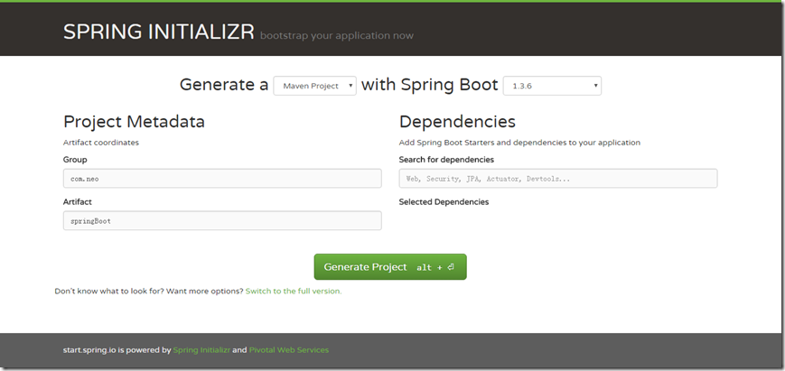
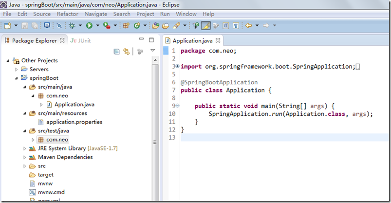

**构建微服务：Spring boot 入门篇**

# **什么是** spring boot

Spring
Boot是由Pivotal团队提供的全新框架，其设计目的是用来简化新Spring应用的初始搭建以及开发过程。该框架使用了特定的方式来进行配置，从而使开发人员不再需要定义样板化的配置。用我的话来理解，就是spring
boot其实不是什么新的框架，它默认配置了很多框架的使用方式，就像maven整合了所有的jar包，spring
boot整合了所有的框架（不知道这样比喻是否合适）。

# **使用** spring boot **有什么好处**

其实就是简单、快速、方便！平时如果我们需要搭建一个spring web项目的时候需要怎么做呢？

1）配置web.xml，加载spring和spring mvc

2）配置数据库连接、配置spring事务

3）配置加载配置文件的读取，开启注解

4）配置日志文件

...

配置完成之后部署tomcat 调试

...

现在非常流行微服务，如果我这个项目仅仅只是需要发送一个邮件，如果我的项目仅仅是生产一个积分；我都需要这样折腾一遍!

但是如果使用spring boot呢？

很简单，我仅仅只需要非常少的几个配置就可以迅速方便的搭建起来一套web项目或者是构建一个微服务！

使用sping boot到底有多爽，用下面这幅图来表达

# **快速入门**

说了那么多，手痒痒的很，马上来一发试试!

**maven 构建项目**

1、访问http://start.spring.io/

2、选择构建工具Maven Project、Spring Boot版本1.3.6以及一些工程基本信息，点击“[Switch to the full
version.](http://start.spring.io/)”java版本选择1.7，可参考下图所示：

3、点击Generate Project下载项目压缩包

4、解压后，使用eclipse，Import -> Existing Maven Projects -> Next ->选择解压后的文件夹->
Finsh，OK done!

**项目结构介绍**

如上图所示，Spring Boot的基础结构共三个文件:

l src/main/java 程序开发以及主程序入口

l src/main/resources 配置文件

l src/test/java 测试程序

另外，spingboot建议的目录结果如下：

root package结构：com.example.myproject

    
    
    com
      +- example
        +- myproject
          +- Application.java
          |
          +- domain
          |  +- Customer.java
          |  +- CustomerRepository.java
          |
          +- service
          |  +- CustomerService.java
          |
          +- controller
          |  +- CustomerController.java
          |

1、Application.java 建议放到跟目录下面,主要用于做一些框架配置

2、domain目录主要用于实体（Entity）与数据访问层（Repository）

3、service 层主要是业务类代码

4、controller 负责页面访问控制

采用默认配置可以省去很多配置，当然也可以根据自己的喜欢来进行更改

最后，启动Application main方法，至此一个java项目搭建好了！

**引入 web模块**

1、pom.xml中添加支持web的模块：

    
    
    <dependency>
            <groupId>org.springframework.boot</groupId>
            <artifactId>spring-boot-starter-web</artifactId>
     </dependency>

pom.xml文件中默认有两个模块：

spring-boot-starter：核心模块，包括自动配置支持、日志和YAML；

spring-boot-starter-test：测试模块，包括JUnit、Hamcrest、Mockito。

2、编写controller内容

    
    
    @RestController
    public class HelloWorldController {
        @RequestMapping("/hello")
        public String index() {
            return "Hello World";
        }
    }

@RestController的意思就是controller里面的方法都以json格式输出，不用再写什么jackjson配置的了！

3、启动主程序，打开浏览器访问http://localhost:8080/hello，就可以看到效果了，有木有很简单！

**如何做单元测试**

打开的src/test/下的测试入口，编写简单的http请求来测试；使用mockmvc进行，利用MockMvcResultHandlers.print()打印出执行结果。

@RunWith(SpringRunner.class)  
@SpringBootTest

    
    
    public class HelloWorldControlerTests {
        private MockMvc mvc;
        @Before
        public void setUp() throws Exception {
            mvc = MockMvcBuilders.standaloneSetup(new HelloWorldController()).build();
        }
        @Test
        public void getHello() throws Exception {
        mvc.perform(MockMvcRequestBuilders.get("/hello").accept(MediaType.APPLICATION_JSON))
                    .andExpect(MockMvcResultMatchers.status().isOk())
                    .andDo(MockMvcResultHandlers.print())
                    .andReturn();
        }
    }

**开发环境的调试**

热启动在正常开发项目中已经很常见了吧，虽然平时开发web项目过程中，改动项目启重启总是报错；但springBoot对调试支持很好，修改之后可以实时生效，需要添加以下的配置：

<dependencies>

<dependency>

<groupId>org.springframework.boot</groupId>

<artifactId>spring-boot-devtools</artifactId>

<optional>true</optional>

</dependency>

</dependencies>

<build>

<plugins>

<plugin>

<groupId>org.springframework.boot</groupId>

<artifactId>spring-boot-maven-plugin</artifactId>

<configuration>

<fork>true</fork>

</configuration>

</plugin>

</plugins>

</build>

该模块在完整的打包环境下运行的时候会被禁用。如果你使用java -jar启动应用或者用一个特定的classloader启动，它会认为这是一个“生产环境”。

# **总结**

使用spring
boot可以非常方便、快速搭建项目，使我们不用关心框架之间的兼容性，适用版本等各种问题，我们想使用任何东西，仅仅添加一个配置就可以，所以使用sping
boot非常适合构建微服务。

**[示例代码-github](https://github.com/ityouknow/spring-boot-examples)**

**[示例代码-码云](https://gitee.com/ityouknow/spring-boot-examples)**

**[Spring Boot 中文索引](https://github.com/ityouknow/awesome-spring-boot) **

欢迎关注公众号纯洁的微笑，了解最新文章

**[最全的Spring Boot 2.0
课程](https://gitbook.cn/m/mazi/comp/column?columnId=5b86228ce15aa17d68b5b55a&sceneId=d38dc800ab5e11e8b2dcb7c25abec89c)**

**文章目录：**

  * [Spring Boot 2.0(一)：【重磅】Spring Boot 2.0权威发布](http://www.ityouknow.com/springboot/2018/03/01/spring-boot-2.0.html)
  * [Spring Boot 2.0(二)：Spring Boot 2.0尝鲜-动态 Banner](http://www.ityouknow.com/springboot/2018/03/03/spring-boot-banner.html)
  * [Spring Boot 2.0(三)：Spring Boot 开源软件都有哪些？](http://www.ityouknow.com/springboot/2018/03/05/spring-boot-open-source.html)
  * [Spring Boot 2.0(四)：使用 Docker 部署 Spring Boot](http://www.ityouknow.com/springboot/2018/03/19/spring-boot-docker.html)
  * [Spring Boot 2.0(五)：Docker Compose + Spring Boot + Nginx + Mysql 实践](http://www.ityouknow.com/springboot/2018/03/28/dockercompose-springboot-mysql-nginx.html)
  * [Spring Boot 2.0(六)：使用 Docker 部署 Spring Boot 开源软件云收藏](http://www.ityouknow.com/springboot/2018/04/02/docker-favorites.html)
  * [Spring Boot 2.0(七)：Spring Boot 如何解决项目启动时初始化资源](http://www.ityouknow.com/springboot/2018/05/03/spring-boot-commandLineRunner.html)
  * [Spring Boot 2.0(八)：Spring Boot 集成 Memcached](http://www.ityouknow.com/springboot/2018/09/01/spring-boot-memcached.html)

Spring Boot 1.0参考文章

  * [springboot(一)：入门篇](http://www.ityouknow.com/springboot/2016/01/06/spring-boot-quick-start.html)
  * [springboot(二)：web综合开发](http://www.ityouknow.com/springboot/2016/02/03/spring-boot-web.html)
  * [springboot(三)：Spring boot中Redis的使用](http://www.ityouknow.com/springboot/2016/03/06/spring-boot-redis.html)
  * [springboot(四)：thymeleaf使用详解](http://www.ityouknow.com/springboot/2016/05/01/spring-boot-thymeleaf.html)
  * [springboot(五)：spring data jpa的使用](http://www.ityouknow.com/springboot/2016/08/20/spring-boo-jpa.html)
  * [springboot(六)：如何优雅的使用mybatis](http://www.ityouknow.com/springboot/2016/11/06/spring-boo-mybatis.html)
  * [springboot(七)：springboot+mybatis多数据源最简解决方案](http://www.ityouknow.com/springboot/2016/11/25/spring-boot-multi-mybatis.html)
  * [springboot(八)：RabbitMQ详解](http://www.ityouknow.com/springboot/2016/11/30/spring-boot-rabbitMQ.html)
  * [springboot(九)：定时任务](http://www.ityouknow.com/springboot/2016/12/02/spring-boot-scheduler.html)
  * [springboot(十)：邮件服务](http://www.ityouknow.com/springboot/2017/05/06/springboot-mail.html)
  * [springboot(十一)：Spring boot中mongodb的使用](http://www.ityouknow.com/springboot/2017/05/08/springboot-mongodb.html)
  * [springboot(十二)：springboot如何测试打包部署](http://www.ityouknow.com/springboot/2017/05/09/springboot-deploy.html)
  * [springboot(十三)：springboot小技巧](http://www.ityouknow.com/springboot/2017/06/22/springboot-tips.html)
  * [springboot(十四)：springboot整合shiro-登录认证和权限管理](http://www.ityouknow.com/springboot/2017/06/26/springboot-shiro.html)
  * [springboot(十五)：springboot+jpa+thymeleaf增删改查示例](http://www.ityouknow.com/springboot/2017/09/23/spring-boot-jpa-thymeleaf-curd.html)
  * [springboot(十六)：使用Jenkins部署Spring Boot](http://www.ityouknow.com/springboot/2017/11/11/springboot-jenkins.html)
  * [springboot(十七)：使用Spring Boot上传文件](http://www.ityouknow.com/springboot/2018/01/12/spring-boot-upload-file.html)
  * [springboot(十八)：使用Spring Boot集成FastDFS](http://www.ityouknow.com/springboot/2018/01/16/spring-boot-fastdfs.html)
  * [springboot(十九)：使用Spring Boot Actuator监控应用](http://www.ityouknow.com/springboot/2018/02/06/spring-boot-actuator.html)
  * [springboot(二十)：使用spring-boot-admin对spring-boot服务进行监控](http://www.ityouknow.com/springboot/2018/02/11/spring-boot-admin.html)

