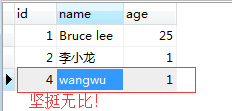

## 前言

项目框架主要是spring，持久层框架没有用mybtis，用的是spring 的jdbc；

业务需求：给应用添加领域(一个领域包含多个应用，一个应用可能属于多个领域，一般而言一个应用只属于一个领域)，要求是给应用添加领域的时候，先将该应用已有的领域都删除，之后再将选中的领域添加到数据库；

为了减少准备工作，我利用了以前的代码和数据建模，那么就成了：添加person的时候先删除已存在name为新添加person的name的person，再添加新person，说直白点就是：添加name为zhangsan的person，那么先删除数据库中name为zhangsan的所有person信息，然后再将新的zhangsan的person信息添加到数据库中；

环境搭建过程我就不写了，完整代码会以附件形式上传；

注意：druid连接池一般而言，jdbc设置成自动提交，不设置的话，默认也是自动提交(有兴趣的朋友可以去看下druid连接池的源码)

路漫漫其修远兮，吾将上下而求索！

github：[https://github.com/youzhibing](https://github.com/youzhibing)

码云(gitee)：[https://gitee.com/youzhibing](https://gitee.com/youzhibing)

## jdbcTemplate自动提交

先来验证下，当前jdbcTempalte是否是自动提交的，如何验证了，我可以在jdbcTemplate执行完之后抛出一个异常，代码如下

    
    
    public int deleteOnePerson(String name) {
            int count = jdbcTemplate.update(DELETE_ONE_PERSON, new Object[]{name});        // jdbcTemplate执行完成
            count = count / 0;                                                            // 抛出RuntimeException
            return count;
        }

没有配置事务

    
    
    <?xml version="1.0" encoding="UTF-8"?>
    <beans xmlns="http://www.springframework.org/schema/beans"
        xmlns:xsi="http://www.w3.org/2001/XMLSchema-instance" xmlns:context="http://www.springframework.org/schema/context"
        xmlns:aop="http://www.springframework.org/schema/aop" xmlns:tx="http://www.springframework.org/schema/tx"
        xsi:schemaLocation="http://www.springframework.org/schema/beans 
         http://www.springframework.org/schema/beans/spring-beans.xsd
         http://www.springframework.org/schema/context
         http://www.springframework.org/schema/context/spring-context.xsd
         http://www.springframework.org/schema/aop
         http://www.springframework.org/schema/aop/spring-aop.xsd
         http://www.springframework.org/schema/tx 
         http://www.springframework.org/schema/tx/spring-tx.xsd">
         
        <context:component-scan base-package="com.lee.you.jdbc" />
    
        <bean id="propertyConfigurer" class="org.springframework.beans.factory.config.PropertyPlaceholderConfigurer">
            <property name="location">
                       <value>mysqldb.properties</value>
            </property>
        </bean>
    
        <!-- 配置数据源 -->
        <bean id="dataSource" class="com.alibaba.druid.pool.DruidDataSource">
            <!-- 基本属性 url、user、password -->  
            <property name="driverClassName" value="${jdbc.driverClassName}" />  
            <property name="url" value="${jdbc.url}" />  
            <property name="username" value="${jdbc.username}" />  
            <property name="password" value="${jdbc.password}" />  
            <property name="initialSize" value="${jdbc.initialSize}" />  
            <property name="minIdle" value="${jdbc.minIdle}" />   
            <property name="maxActive" value="${jdbc.maxActive}" />  
            <property name="maxWait" value="${jdbc.maxWait}" />
            <!-- 超过时间限制是否回收 -->
            <property name="removeAbandoned" value="${jdbc.removeAbandoned}" />
            <!-- 超过时间限制多长； -->
            <property name="removeAbandonedTimeout" value="${jdbc.removeAbandonedTimeout}" />
            <!-- 配置间隔多久才进行一次检测，检测需要关闭的空闲连接，单位是毫秒 -->
            <property name="timeBetweenEvictionRunsMillis" value="${jdbc.timeBetweenEvictionRunsMillis}" />
            <!-- 配置一个连接在池中最小生存的时间，单位是毫秒 -->
            <property name="minEvictableIdleTimeMillis" value="${jdbc.minEvictableIdleTimeMillis}" />
            <!-- 用来检测连接是否有效的sql，要求是一个查询语句-->
            <property name="validationQuery" value="${jdbc.validationQuery}" />
            <!-- 申请连接的时候检测 -->
            <property name="testWhileIdle" value="${jdbc.testWhileIdle}" />
            <!-- 申请连接时执行validationQuery检测连接是否有效，配置为true会降低性能 -->
            <property name="testOnBorrow" value="${jdbc.testOnBorrow}" />
            <!-- 归还连接时执行validationQuery检测连接是否有效，配置为true会降低性能  -->
            <property name="testOnReturn" value="${jdbc.testOnReturn}" />
            
            <property name="defaultAutoCommit" value="${jdbc.defaultAutoCommit}" />
        </bean>
    
         <bean id="jdbcTemplate" class="org.springframework.jdbc.core.JdbcTemplate">
            <property name="dataSource" ref="dataSource" />
        </bean>
    </beans>

View Code

那么如果直接像如下方式来处理先删后加是不行的，如果删成功添加失败，那么数据库的数据却只是删了而没有添加成功

    
    
    public int insertOnePerson(String name, int age) {
            int result = 0;
            int count = jdbcTemplate.update(DELETE_ONE_PERSON, new Object[]{name});
            if(count >= 0)                                                                    // =0的情况是数据库之前不存在该name的person信息
            {
                result = jdbcTemplate.update(INSERT_ONE_PERSON, new Object[]{name,age});
            }
            return result    ;
        }

##  手动提交事务

为了保证事务一致性，第一时间想到了jdbcTemplate是否有事务相关设置，然而并没有发现，但是发现了jdbcTemplate.getDataSource().getConnection()，于是飞快的写了如下代码：

###  手动提交1

    
    
    public int insertOnePerson(String name, int age) {
            int result = 0;
            try {
                jdbcTemplate.getDataSource().getConnection().setAutoCommit(false);
                int count = jdbcTemplate.update(DELETE_ONE_PERSON, new Object[]{name});
                if(count >= 0)                                                                    // =0的情况是数据库之前不存在该name的person信息
                {
                    result = jdbcTemplate.update(INSERT_ONE_PERSON, new Object[]{name,"1ac"});
                }
                jdbcTemplate.getDataSource().getConnection().commit();
            } catch (SQLException e) {
                e.printStackTrace();
                try {
                    jdbcTemplate.getDataSource().getConnection().rollback();
                } catch (SQLException e1) {
                    e1.printStackTrace();
                }
            } finally {
                try {
                    jdbcTemplate.getDataSource().getConnection().setAutoCommit(true);
                } catch (SQLException e) {
                    e.printStackTrace();
                }
            }
            return result    ;
        }

本以为实现事务一致性，可执行结果如下：

发现没有实现事务一致性，这是为什么？？？？？？？ 这里先留个悬念，大家好好思考下；当时我也没去仔细研究，因为完成任务才是第一要紧事，紧接着写出了如下代码：

###  手动提交2

    
    
    public int insertOnePerson(String name, int age) {
            int result = 0;
            Connection conn = null;
            PreparedStatement pstmt = null;
            try {
                conn = jdbcTemplate.getDataSource().getConnection();
                if(conn != null)
                {
                    conn.setAutoCommit(false);
                    pstmt = conn.prepareStatement(DELETE_ONE_PERSON);
                    pstmt.setString(1, name);
                    int count = pstmt.executeUpdate();
                    pstmt.close();
                    if(count >= 0)
                    {
                        pstmt = conn.prepareStatement(INSERT_ONE_PERSON);
                        pstmt.setString(1, name);
                        pstmt.setString(2, "1adh");                                        // 引发异常
                        result = pstmt.executeUpdate();
                    }
                    conn.commit();
                }
            } catch (SQLException e) {
                e.printStackTrace();
                try {
                    conn.rollback();
                } catch (SQLException e1) {
                    System.out.println("rollback failed..");
                    e1.printStackTrace();
                }
            } finally {
                try{
                    conn.setAutoCommit(true);
                    if(pstmt != null){
                        pstmt.close();
                    }
                    if(conn != null){
                        conn.close();
                    }
                }catch(SQLException e){
                    
                }
            }
            return result    ;
        }

诡异的事情来了，居然和上面的情况一样：删除成功，添加失败！ 我的天老爷，这是怎么回事？？？？

瞬间懵逼了，怎么回事？代码怎么改都不行！！！

## mysql引擎

查看数据库引擎，发现引擎是MyISAM！ 瞬间爆炸！！！！

将引擎改成InnoDB后，手动提交2的代码是能够保证事务一致性的，那么手动提交1的代码是不是也能保证事务一致性了？
此处再留一个悬念，希望各位观众老爷们好好思考下。

## 事务自动管理

任务虽然完成了，可是无论是手动提交2，还是手动提交1(姑且认为能保证事务一致性)，代码的try
catch简直让人无法接受；映像中，spring有事务管理，那么就来看看事务交给spring如何实现

配置事务管理器：

    
    
    <?xml version="1.0" encoding="UTF-8"?>
    <beans xmlns="http://www.springframework.org/schema/beans"
        xmlns:xsi="http://www.w3.org/2001/XMLSchema-instance" xmlns:context="http://www.springframework.org/schema/context"
        xmlns:aop="http://www.springframework.org/schema/aop" xmlns:tx="http://www.springframework.org/schema/tx"
        xsi:schemaLocation="http://www.springframework.org/schema/beans 
         http://www.springframework.org/schema/beans/spring-beans.xsd
         http://www.springframework.org/schema/context
         http://www.springframework.org/schema/context/spring-context.xsd
         http://www.springframework.org/schema/aop
         http://www.springframework.org/schema/aop/spring-aop.xsd
         http://www.springframework.org/schema/tx 
         http://www.springframework.org/schema/tx/spring-tx.xsd">
         
        <context:component-scan base-package="com.lee.you.jdbc" />
    
        <bean id="propertyConfigurer" class="org.springframework.beans.factory.config.PropertyPlaceholderConfigurer">
            <property name="location">
                       <value>mysqldb.properties</value>
            </property>
        </bean>
    
        <!-- 配置数据源 -->
        <bean id="dataSource" class="com.alibaba.druid.pool.DruidDataSource">
            <!-- 基本属性 url、user、password -->  
            <property name="driverClassName" value="${jdbc.driverClassName}" />  
            <property name="url" value="${jdbc.url}" />  
            <property name="username" value="${jdbc.username}" />  
            <property name="password" value="${jdbc.password}" />  
            <property name="initialSize" value="${jdbc.initialSize}" />  
            <property name="minIdle" value="${jdbc.minIdle}" />   
            <property name="maxActive" value="${jdbc.maxActive}" />  
            <property name="maxWait" value="${jdbc.maxWait}" />
            <!-- 超过时间限制是否回收 -->
            <property name="removeAbandoned" value="${jdbc.removeAbandoned}" />
            <!-- 超过时间限制多长； -->
            <property name="removeAbandonedTimeout" value="${jdbc.removeAbandonedTimeout}" />
            <!-- 配置间隔多久才进行一次检测，检测需要关闭的空闲连接，单位是毫秒 -->
            <property name="timeBetweenEvictionRunsMillis" value="${jdbc.timeBetweenEvictionRunsMillis}" />
            <!-- 配置一个连接在池中最小生存的时间，单位是毫秒 -->
            <property name="minEvictableIdleTimeMillis" value="${jdbc.minEvictableIdleTimeMillis}" />
            <!-- 用来检测连接是否有效的sql，要求是一个查询语句-->
            <property name="validationQuery" value="${jdbc.validationQuery}" />
            <!-- 申请连接的时候检测 -->
            <property name="testWhileIdle" value="${jdbc.testWhileIdle}" />
            <!-- 申请连接时执行validationQuery检测连接是否有效，配置为true会降低性能 -->
            <property name="testOnBorrow" value="${jdbc.testOnBorrow}" />
            <!-- 归还连接时执行validationQuery检测连接是否有效，配置为true会降低性能  -->
            <property name="testOnReturn" value="${jdbc.testOnReturn}" />
            
            <property name="defaultAutoCommit" value="${jdbc.defaultAutoCommit}" />
        </bean>
    
         <bean id="jdbcTemplate" class="org.springframework.jdbc.core.JdbcTemplate">
            <property name="dataSource" ref="dataSource" />
        </bean>
    
        <!-- 事务管理器 -->
        <bean id="transactionManager"
            class="org.springframework.jdbc.datasource.DataSourceTransactionManager">
            <property name="dataSource" ref="dataSource" />
        </bean>
        
        <tx:annotation-driven transaction-manager="transactionManager" />
    </beans>

View Code

配置事务

    
    
    @Transactional
        public int insertOnePerson(String name, int age) {
            int result = 0;
            int count = jdbcTemplate.update(DELETE_ONE_PERSON, new Object[]{name});
            if(count >= 0)                                                                    
            {
                result = jdbcTemplate.update(INSERT_ONE_PERSON, new Object[]{name,"l123a"});
            }
            return result    ;
        }

执行结果如下：

这代码清爽多了，要的就是这种感觉！！ 就是这个feel倍儿爽，爽爽爽爽！

## 后话及悬念解答

搭建这个工程的用到了lombok，不知道的可以去百度下，我这里就想提醒下，这玩意和一般的jar有区别，他需要安装，不然编译不通过! 喜欢搞事的jar；

另外druid连接池对mysql驱动是有版本要求的，mysql驱动5.1.10是会在连接池初始化的时候报错的，具体是从哪个版本开始不报错我就没去逐个试了，知道的朋友可以留个言，本工程中用的是5.1.25版本；

    
    
    警告: Cannot resolve com.mysq.jdbc.Connection.ping method.  Will use "SELECT 1" instead.
    java.lang.NullPointerException
        at com.alibaba.druid.pool.vendor.MySqlValidConnectionChecker.<init>(MySqlValidConnectionChecker.java:50)
        at com.alibaba.druid.pool.DruidDataSource.initValidConnectionChecker(DruidDataSource.java:892)
        at com.alibaba.druid.pool.DruidDataSource.init(DruidDataSource.java:608)
        at com.alibaba.druid.pool.DruidDataSource.getConnection(DruidDataSource.java:934)
        at com.alibaba.druid.pool.DruidDataSource.getConnection(DruidDataSource.java:930)
        at com.alibaba.druid.pool.DruidDataSource.getConnection(DruidDataSource.java:102)
        at org.springframework.jdbc.datasource.DataSourceUtils.doGetConnection(DataSourceUtils.java:111)
        at org.springframework.jdbc.datasource.DataSourceUtils.getConnection(DataSourceUtils.java:77)
        at org.springframework.jdbc.core.JdbcTemplate.execute(JdbcTemplate.java:386)
        at org.springframework.jdbc.core.JdbcTemplate.query(JdbcTemplate.java:466)
        at org.springframework.jdbc.core.JdbcTemplate.query(JdbcTemplate.java:471)
        at com.lee.you.jdbc.dao.impl.DaoImpl.queryAllPerson(DaoImpl.java:31)
        at com.lee.you.jdbc.JdbcTemplateTest.main(JdbcTemplateTest.java:17)

View Code

悬念解答：

还记得是哪两个悬念吗？ 1、手动提交1不能保证事务一致性是不是mysql引擎引起的；
2、如果mysql引擎是支持事务的InnoDB，手动提交1能不能保证事务一致性；

关于悬念1，这个很明了，如果mysql引擎不支持事务，那么代码无论怎么写，事务一致性都是空谈；

悬念2的话，是能肯定的回答：不能保证事务一致性的！
因为jdbcTemplate.getDataSource().getConnection()获取的connection与每次jdbcTemplate.update用到的connection都是从连接池中获取的，不能保证是一个connection，那怎么保证事务一致性;
感兴趣的朋友可以去阅读源码，里面各种黄金、各种美女哦！

那么问题又来了，既然jdbcTemplate每次执行一个操作的时候都是从连接池中获取connection，那么spring事务管理是怎么实现事务一致性的呢？更多精彩内容，请关注我的下篇博客

本文[附件](http://files.cnblogs.com/files/youzhibing/jdbc.rar)

