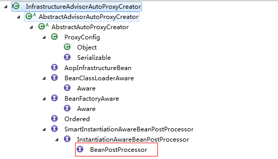
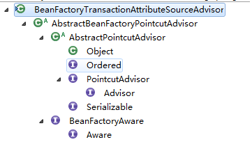

前言

在 **[spring jdbcTemplate
事务，各种诡异，包你醍醐灌顶！](http://www.cnblogs.com/youzhibing/p/6127250.html)**
最后遗留了一个问题：spring是怎么样保证事务一致性的？
当然，spring事务内容挺多的，如果都要讲的话要花很长时间，而本片博客的主旨是解决上一篇博客遗留的问题，那么我们把问题细化下来，
就是spring如何保证一个事务中的jdbc connection是同一个？

没有事务

如若没有事务，这个很好理解，可以理解成spring只是对我们一般的jdbc操作进行了一些封装，减少了我们的代码量

1、一般写法

代码中的Connection的获取有很多种方式，不一定是代码中jdbcTemplate的方式，大家看的时候可以假设成其他的方式

    
    
    public int insertOnePerson(String name, int age) {
            int result = 0;
            Connection conn = null;
            PreparedStatement pstmt = null;
            try {
                conn = jdbcTemplate.getDataSource().getConnection();
                if(conn != null)
                {
                    conn.setAutoCommit(false);
                    pstmt = conn.prepareStatement(DELETE_ONE_PERSON);
                    pstmt.setString(1, name);
                    int count = pstmt.executeUpdate();
                    pstmt.close();
                    if(count >= 0)
                    {
                        pstmt = conn.prepareStatement(INSERT_ONE_PERSON);
                        pstmt.setString(1, name);
                        pstmt.setString(2, "1adh");                                        // 引发异常
                        result = pstmt.executeUpdate();
                    }
                    conn.commit();
                }
            } catch (SQLException e) {
                e.printStackTrace();
                try {
                    conn.rollback();
                } catch (SQLException e1) {
                    System.out.println("rollback failed..");
                    e1.printStackTrace();
                }
            } finally {
                try{
                    conn.setAutoCommit(true);
                    if(pstmt != null){
                        pstmt.close();
                    }
                    if(conn != null){
                        conn.close();
                    }
                }catch(SQLException e){
                    
                }
            }
            return result    ;
        }

View Code

2、spring jdbc的写法

    
    
    public int insertOnePerson(String name, int age) {
            int result = 0;
            int count = jdbcTemplate.update(DELETE_ONE_PERSON, new Object[]{name});
            if(count >= 0)                                                                    
            {
                result = jdbcTemplate.update(INSERT_ONE_PERSON, new Object[]{name,"l123a"});
            }
            return result    ;
        }

View Code

两者对比，就会发现我们用spring jdbc的代码量减少了很多，流程如下

不考虑事务，一次数据库操作就对应一个Connection，前后不同的操作对应的不同Connection，那么每次对数据库的请求是互不影响的。那么spring真的是这么实现的吗？
暂且先留个悬念。

存在事务

如若有需要用事务的需求，那么我们会怎么实现了？

1、jdbc 事务

这个是最基本的，也是最容易想到的；关闭Connection的自动提交(con.setAutoCommit( **false**
);)，用同一个Connection执行不同的数据库请求，最后提交(con.commit();)，有异常则进行回滚(con.rollback();),最后释放资源(如果有连接池，那么con设置成自动提交即可(con.setAutoCommit(
**true** );));

2、spring 事务

这种方式可能能想到，但是很多人都不理解，追根究底就是不了解spring事务的源码

spring事务源码解析

一、事务自定义标签的解析

spring-tx-
xx.jar中的包org.springframework.transaction.config下的init方法中有这么一句：registerBeanDefinitionParser("annotation-
driven", new AnnotationDrivenBeanDefinitionParser());
那么我们就从AnnotationDrivenBeanDefinitionParser的parse方法开始（为什么是从这个方法开始，后续会回答）

    
    
    /**
         * Parses the {@code <tx:annotation-driven/>} tag. Will
         * {@link AopNamespaceUtils#registerAutoProxyCreatorIfNecessary register an AutoProxyCreator}
         * with the container as necessary.
         */
        public BeanDefinition parse(Element element, ParserContext parserContext) {
            String mode = element.getAttribute("mode");
            if ("aspectj".equals(mode)) {
                // mode="aspectj"
                registerTransactionAspect(element, parserContext);
            }
            else {
                // mode="proxy"
                AopAutoProxyConfigurer.configureAutoProxyCreator(element, parserContext);
            }
            return null;
        }

View Code

1、跟进AopAutoProxyConfigurer.configureAutoProxyCreator(element,
parserContext);这个方法注册了代理类以及支撑起整个事务功能的三个bean：BeanFactoryTransactionAttributeSourceAdvisor、AnnotationTransactionAttributeSource、TransactionInterceptor，其中AnnotationTransactionAttributeSource和TransactionInterceptor被注册到了BeanFactoryTransactionAttributeSourceAdvisor中

    
    
    public static void configureAutoProxyCreator(Element element, ParserContext parserContext) {
                AopNamespaceUtils.registerAutoProxyCreatorIfNecessary(parserContext, element);
    
                String txAdvisorBeanName = TransactionManagementConfigUtils.TRANSACTION_ADVISOR_BEAN_NAME;
                if (!parserContext.getRegistry().containsBeanDefinition(txAdvisorBeanName)) {
                    Object eleSource = parserContext.extractSource(element);
    
                    // Create the TransactionAttributeSource definition.
                    RootBeanDefinition sourceDef = new RootBeanDefinition(
                            "org.springframework.transaction.annotation.AnnotationTransactionAttributeSource");
                    sourceDef.setSource(eleSource);
                    sourceDef.setRole(BeanDefinition.ROLE_INFRASTRUCTURE);
                    String sourceName = parserContext.getReaderContext().registerWithGeneratedName(sourceDef);
    
                    // Create the TransactionInterceptor definition.
                    RootBeanDefinition interceptorDef = new RootBeanDefinition(TransactionInterceptor.class);
                    interceptorDef.setSource(eleSource);
                    interceptorDef.setRole(BeanDefinition.ROLE_INFRASTRUCTURE);
                    registerTransactionManager(element, interceptorDef);
                    interceptorDef.getPropertyValues().add("transactionAttributeSource", new RuntimeBeanReference(sourceName));
                    String interceptorName = parserContext.getReaderContext().registerWithGeneratedName(interceptorDef);
    
                    // Create the TransactionAttributeSourceAdvisor definition.
                    RootBeanDefinition advisorDef = new RootBeanDefinition(BeanFactoryTransactionAttributeSourceAdvisor.class);
                    advisorDef.setSource(eleSource);
                    advisorDef.setRole(BeanDefinition.ROLE_INFRASTRUCTURE);
                    advisorDef.getPropertyValues().add("transactionAttributeSource", new RuntimeBeanReference(sourceName));
                    advisorDef.getPropertyValues().add("adviceBeanName", interceptorName);
                    if (element.hasAttribute("order")) {
                        advisorDef.getPropertyValues().add("order", element.getAttribute("order"));
                    }
                    parserContext.getRegistry().registerBeanDefinition(txAdvisorBeanName, advisorDef);
    
                    CompositeComponentDefinition compositeDef = new CompositeComponentDefinition(element.getTagName(), eleSource);
                    compositeDef.addNestedComponent(new BeanComponentDefinition(sourceDef, sourceName));
                    compositeDef.addNestedComponent(new BeanComponentDefinition(interceptorDef, interceptorName));
                    compositeDef.addNestedComponent(new BeanComponentDefinition(advisorDef, txAdvisorBeanName));
                    parserContext.registerComponent(compositeDef);
                }
            }

View Code

我们先看代理类的注册，跟进AopNamespaceUtils.registerAutoProxyCreatorIfNecessary(parserContext,
element);接着跟进BeanDefinition beanDefinition =
AopConfigUtils.registerAutoProxyCreatorIfNecessary(parserContext.getRegistry(),
parserContext.extractSource(sourceElement));发现registerOrEscalateApcAsRequired(InfrastructureAdvisorAutoProxyCreator.class,
registry,
source)，我们先来看看InfrastructureAdvisorAutoProxyCreator类的层次结构图，发现它间接实现了BeanPostProcessor接口，那么spring在实例化bean的时候，都会保证调用其postProcessAfterInitialization方法(spring为什么一定会调用这个方法，后续会回答)

______

InfrastructureAdvisorAutoProxyCreator类的层次结构图

2、跟进postProcessAfterInitialization方法（在类AbstractAutoProxyCreator中，注意看继承关系），对指定的、我们定义的bean进行封装，封装的工作委托给了调用了wrapIfNecessary(bean,
beanName, cacheKey)方法

    
    
    /**
         * Create a proxy with the configured interceptors if the bean is
         * identified as one to proxy by the subclass.
         * @see #getAdvicesAndAdvisorsForBean
         */
        public Object postProcessAfterInitialization(Object bean, String beanName) throws BeansException {
            if (bean != null) {
                Object cacheKey = getCacheKey(bean.getClass(), beanName);
                if (!this.earlyProxyReferences.containsKey(cacheKey)) {
                    return wrapIfNecessary(bean, beanName, cacheKey);
                }
            }
            return bean;
        }

View Code

3、跟进wrapIfNecessary方法，发现主要做了两件事：(1)找出指定bean对应的增强器、(2)根据找出的增强器创建代理

    
    
    /**
         * Wrap the given bean if necessary, i.e. if it is eligible for being proxied.
         * @param bean the raw bean instance
         * @param beanName the name of the bean
         * @param cacheKey the cache key for metadata access
         * @return a proxy wrapping the bean, or the raw bean instance as-is
         */
        protected Object wrapIfNecessary(Object bean, String beanName, Object cacheKey) {
            if (beanName != null && this.targetSourcedBeans.containsKey(beanName)) {
                return bean;
            }
            if (Boolean.FALSE.equals(this.advisedBeans.get(cacheKey))) {
                return bean;
            }
            if (isInfrastructureClass(bean.getClass()) || shouldSkip(bean.getClass(), beanName)) {
                this.advisedBeans.put(cacheKey, Boolean.FALSE);
                return bean;
            }
    
            // Create proxy if we have advice.
            Object[] specificInterceptors = getAdvicesAndAdvisorsForBean(bean.getClass(), beanName, null);
            if (specificInterceptors != DO_NOT_PROXY) {
                this.advisedBeans.put(cacheKey, Boolean.TRUE);
                Object proxy = createProxy(bean.getClass(), beanName, specificInterceptors, new SingletonTargetSource(bean));
                this.proxyTypes.put(cacheKey, proxy.getClass());
                return proxy;
            }
    
            this.advisedBeans.put(cacheKey, Boolean.FALSE);
            return bean;
        }

View Code

____ (1)____找出指定bean对应的增强器

________ 跟进getAdvicesAndAdvisorsForBean(bean.getClass(), beanName,
null)(当前正处于AbstractAutoProxyCreator中，而AbstractAdvisorAutoProxyCreator是AbstractAutoProxyCreator的子类、是InfrastructureAdvisorAutoProxyCreator的父类，而我们的起点类是InfrastructureAdvisorAutoProxyCreator，所以跟进到AbstractAdvisorAutoProxyCreator中去)

    
    
    @Override
        protected Object[] getAdvicesAndAdvisorsForBean(Class beanClass, String beanName, TargetSource targetSource) {
            List advisors = findEligibleAdvisors(beanClass, beanName);
            if (advisors.isEmpty()) {
                return DO_NOT_PROXY;
            }
            return advisors.toArray();
        }

View Code

跟进findEligibleAdvisors(beanClass, beanName)方法，它主要做了两件事：(a)获取所有增强器、(b)增强器是否匹配

    
    
    /**
         * Find all eligible Advisors for auto-proxying this class.
         * @param beanClass the clazz to find advisors for
         * @param beanName the name of the currently proxied bean
         * @return the empty List, not {@code null},
         * if there are no pointcuts or interceptors
         * @see #findCandidateAdvisors
         * @see #sortAdvisors
         * @see #extendAdvisors
         */
        protected List<Advisor> findEligibleAdvisors(Class beanClass, String beanName) {
            List<Advisor> candidateAdvisors = findCandidateAdvisors();
            List<Advisor> eligibleAdvisors = findAdvisorsThatCanApply(candidateAdvisors, beanClass, beanName);
            extendAdvisors(eligibleAdvisors);
            if (!eligibleAdvisors.isEmpty()) {
                eligibleAdvisors = sortAdvisors(eligibleAdvisors);
            }
            return eligibleAdvisors;
        }

View Code

(a)获取所有增强器,

跟进findCandidateAdvisors()，接着跟进this.advisorRetrievalHelper.findAdvisorBeans()，其中有这么一句advisorNames
= BeanFactoryUtils.beanNamesForTypeIncludingAncestors(this.beanFactory,
Advisor.class, true, false);
那么BeanFactoryUtils.beanNamesForTypeIncludingAncestors的作用是什么了，作用就是获取beanFactory容器中的全部的Advisor.class类的名字，而当我们知道了增强器在容器中的beanName时，获取增强器就不是问题了，
BeanFoctory中提供了方法：<T> T getBean(String name, Class<T> requiredType) throws
BeansException;

不知道大家是否还记得BeanFactoryTransactionAttributeSourceAdvisor，看名字就知道他是一个Advisor，那么他也理所当然的被提取出来，并随着其他增强器一起在后续的步骤中被织入到代理中

    
    
    /**
         * Find all eligible Advisor beans in the current bean factory,
         * ignoring FactoryBeans and excluding beans that are currently in creation.
         * @return the list of {@link org.springframework.aop.Advisor} beans
         * @see #isEligibleBean
         */
        public List<Advisor> findAdvisorBeans() {
            // Determine list of advisor bean names, if not cached already.
            String[] advisorNames = null;
            synchronized (this) {
                advisorNames = this.cachedAdvisorBeanNames;
                if (advisorNames == null) {
                    // Do not initialize FactoryBeans here: We need to leave all regular beans
                    // uninitialized to let the auto-proxy creator apply to them!
                    advisorNames = BeanFactoryUtils.beanNamesForTypeIncludingAncestors(
                            this.beanFactory, Advisor.class, true, false);
                    this.cachedAdvisorBeanNames = advisorNames;
                }
            }
            if (advisorNames.length == 0) {
                return new LinkedList<Advisor>();
            }
    
            List<Advisor> advisors = new LinkedList<Advisor>();
            for (String name : advisorNames) {
                if (isEligibleBean(name)) {
                    if (this.beanFactory.isCurrentlyInCreation(name)) {
                        if (logger.isDebugEnabled()) {
                            logger.debug("Skipping currently created advisor "" + name + """);
                        }
                    }
                    else {
                        try {
                            advisors.add(this.beanFactory.getBean(name, Advisor.class));
                        }
                        catch (BeanCreationException ex) {
                            Throwable rootCause = ex.getMostSpecificCause();
                            if (rootCause instanceof BeanCurrentlyInCreationException) {
                                BeanCreationException bce = (BeanCreationException) rootCause;
                                if (this.beanFactory.isCurrentlyInCreation(bce.getBeanName())) {
                                    if (logger.isDebugEnabled()) {
                                        logger.debug("Skipping advisor "" + name +
                                                "" with dependency on currently created bean: " + ex.getMessage());
                                    }
                                    // Ignore: indicates a reference back to the bean we"re trying to advise.
                                    // We want to find advisors other than the currently created bean itself.
                                    continue;
                                }
                            }
                            throw ex;
                        }
                    }
                }
            }
            return advisors;
        }

View Code

_BeanFactoryTransactionAttributeSourceAdvisor类的层次结构图_

(b)增强器是否匹配

当找出所有的增强器后，接下来的任务就是看这些增强器是否与对应的class匹配了，当然不止class，class内部的方法如果匹配也可以通过；我们回到步骤4，跟进findAdvisorsThatCanApply(candidateAdvisors,
beanClass,
beanName);我们接着跟进AopUtils.findAdvisorsThatCanApply(candidateAdvisors,
beanClass); 首先处理引介增强，引介是一种特殊的增强，它为类添加一些属性和方法，我们可以不用管；然后对于普通bean的处理，这是我们需要关注的

public static List <Advisor> findAdvisorsThatCanApply(List<Advisor>
candidateAdvisors, Class<?> clazz)

    
    
    /**
         * Determine the sublist of the {@code candidateAdvisors} list
         * that is applicable to the given class.
         * @param candidateAdvisors the Advisors to evaluate
         * @param clazz the target class
         * @return sublist of Advisors that can apply to an object of the given class
         * (may be the incoming List as-is)
         */
        public static List<Advisor> findAdvisorsThatCanApply(List<Advisor> candidateAdvisors, Class<?> clazz) {
            if (candidateAdvisors.isEmpty()) {
                return candidateAdvisors;
            }
            List<Advisor> eligibleAdvisors = new LinkedList<Advisor>();
            // 处理引介增强
            for (Advisor candidate : candidateAdvisors) {
                if (candidate instanceof IntroductionAdvisor && canApply(candidate, clazz)) {
                    eligibleAdvisors.add(candidate);
                }
            }
            boolean hasIntroductions = !eligibleAdvisors.isEmpty();
            for (Advisor candidate : candidateAdvisors) {
                // 引介增强已经处理
                if (candidate instanceof IntroductionAdvisor) {
                    // already processed
                    continue;
                }
                // 普通bean的处理
                if (canApply(candidate, clazz, hasIntroductions)) {
                    eligibleAdvisors.add(candidate);
                }
            }
            return eligibleAdvisors;
        }

View Code

(b).1、跟进canApply(candidate, clazz,
hasIntroductions)，由于我们只关注我们自己的加了事务的类，那么clazz就代表这个类(这里具体到类的话，就是我上篇博客附件中的类DaoImpl)，candidate就代表BeanFactoryTransactionAttributeSourceAdvisor(只关注我们需要关注的，简化难度)；根据BeanFactoryTransactionAttributeSourceAdvisor类的层次结构图，我们知道，BeanFactoryTransactionAttributeSourceAdvisor间接实现了PointcutAdvisor，那么在canApply方法中的第二个if判断时就会通过，会将BeanFactoryTransactionAttributeSourceAdvisor中的getPoint()方法的返回值作为参数继续调用canApply方法，那么getPoint()方法返回的是什么了，我们跟进去看看。

public static boolean canApply(Advisor advisor, Class<?> targetClass, boolean
hasIntroductions)

    
    
    /**
         * Can the given advisor apply at all on the given class?
         * 
This is an important test as it can be used to optimize out a advisor for a class.
         * This version also takes into account introductions (for IntroductionAwareMethodMatchers).
         * @param advisor the advisor to check
         * @param targetClass class we"re testing
         * @param hasIntroductions whether or not the advisor chain for this bean includes
         * any introductions
         * @return whether the pointcut can apply on any method
         */
        public static boolean canApply(Advisor advisor, Class<?> targetClass, boolean hasIntroductions) {
            if (advisor instanceof IntroductionAdvisor) {
                return ((IntroductionAdvisor) advisor).getClassFilter().matches(targetClass);
            }
            else if (advisor instanceof PointcutAdvisor) {
                PointcutAdvisor pca = (PointcutAdvisor) advisor;
                return canApply(pca.getPointcut(), targetClass, hasIntroductions);
            }
            else {
                // It doesn"t have a pointcut so we assume it applies.
                return true;
            }
        }

View Code

(b).2、跟进BeanFactoryTransactionAttributeSourceAdvisor的getPoint()方法，发现返回的是TransactionAttributeSourcePointcut类型的实例，对于transactionAttributeSource属性大家还有印象吗，在自定义标签的时候注入进来的(步骤1)，是AnnotationTransactionAttributeSource的实例

    
    
    private TransactionAttributeSource transactionAttributeSource;
    
        private final TransactionAttributeSourcePointcut pointcut = new TransactionAttributeSourcePointcut() {
            @Override
            protected TransactionAttributeSource getTransactionAttributeSource() {
                return transactionAttributeSource;
            }
        };
    
    public Pointcut getPointcut() {
            return this.pointcut;
        }

我们回到步骤(b).1的canApply方法，继续跟进第二个if中的canApply方法，此时此方法的参数Pointcut pc表示的 _ _ _ _ _
_ _ _ _ _ _ _ _ _ _ _ _ _ _ _ _ _ _
_TransactionAttributeSourcePointcut。________________________
此方法先获取MethodMatcher:MethodMatcher methodMatcher =
pc.getMethodMatcher(),通过代码跟进就发现，pc.getMethodMatcher()返回的就是自身(TransactionAttributeSourcePointcut父类StaticMethodMatcherPointcut中的getMethodMatcher())，也就是pc自己；接着进行引介的处理，我们不需要关注他；接着获取目标类(这里具体到类的话，就是我上篇博客附件中的类DaoImpl)的全部接口(Set<Class>
classes = new
LinkedHashSet<Class>(ClassUtils.getAllInterfacesForClassAsSet(targetClass)))以及目标类(classes.add(targetClass);)，都放进set集合classes中；然后对classes进行遍历，遍历过程中又对类中的方法进行遍历，一旦匹配成功，就任务当前目标类适用于当前增强器(就是说DaoImpl适用于BeanFactoryTransactionAttributeSourceAdvisor)。

public static boolean canApply(Pointcut pc, Class<?> targetClass, boolean
hasIntroductions)

    
    
    public static boolean canApply(Pointcut pc, Class<?> targetClass, boolean hasIntroductions) {
            Assert.notNull(pc, "Pointcut must not be null");
            if (!pc.getClassFilter().matches(targetClass)) {
                return false;
            }
    
            MethodMatcher methodMatcher = pc.getMethodMatcher();
            IntroductionAwareMethodMatcher introductionAwareMethodMatcher = null;
            if (methodMatcher instanceof IntroductionAwareMethodMatcher) {
                introductionAwareMethodMatcher = (IntroductionAwareMethodMatcher) methodMatcher;
            }
    
            Set<Class> classes = new LinkedHashSet<Class>(ClassUtils.getAllInterfacesForClassAsSet(targetClass));
            classes.add(targetClass);
            for (Class<?> clazz : classes) {
                Method[] methods = clazz.getMethods();
                for (Method method : methods) {
                    if ((introductionAwareMethodMatcher != null &&
                            introductionAwareMethodMatcher.matches(method, targetClass, hasIntroductions)) ||
                            methodMatcher.matches(method, targetClass)) {
                        return true;
                    }
                }
            }
    
            return false;
        }

View Code

我们都知道事务的配置不仅仅局限于在方法上设置，类、接口上事务的配置可以延伸到类中的每个方法，那么，如果针对每个方法进行检测，在类本身上配置的事务属性岂不是检测不到了吗？带着疑问我们继续跟进matches方法

________________________________________________(b).3、________________________________________________
methodMatcher.matches(method,
targetClass)用到的是TransactionAttributeSourcePointcut类的matches方法

    
    
    public boolean matches(Method method, Class targetClass) {
            TransactionAttributeSource tas = getTransactionAttributeSource();　　　　　　　　　　　　// 此时的tas表示AnnotationTransactionAttributeSource类型，在步骤6
            return (tas == null || tas.getTransactionAttribute(method, targetClass) != null);　　 // getTransactionAttribute方法在AnnotationTransactionAttributeSource的父类AbstractFallbackTransactionAttributeSource中
    
    
    }
    
    
    　跟进getTransactionAttribute，里面有个方法computeTransactionAttribute(method, targetClass)值得我们关注  
    　public TransactionAttribute getTransactionAttribute(Method method, Class<?> targetClass)

    
    
    /**
         * Determine the transaction attribute for this method invocation.
         * 
Defaults to the class"s transaction attribute if no method attribute is found.
         * @param method the method for the current invocation (never {@code null})
         * @param targetClass the target class for this invocation (may be {@code null})
         * @return TransactionAttribute for this method, or {@code null} if the method
         * is not transactional
         */
        public TransactionAttribute getTransactionAttribute(Method method, Class<?> targetClass) {
            // First, see if we have a cached value.
            Object cacheKey = getCacheKey(method, targetClass);
            Object cached = this.attributeCache.get(cacheKey);
            if (cached != null) {
                // Value will either be canonical value indicating there is no transaction attribute,
                // or an actual transaction attribute.
                if (cached == NULL_TRANSACTION_ATTRIBUTE) {
                    return null;
                }
                else {
                    return (TransactionAttribute) cached;
                }
            }
            else {
                // We need to work it out.
                TransactionAttribute txAtt = computeTransactionAttribute(method, targetClass);
                // Put it in the cache.
                if (txAtt == null) {
                    this.attributeCache.put(cacheKey, NULL_TRANSACTION_ATTRIBUTE);
                }
                else {
                    if (logger.isDebugEnabled()) {
                        Class<?> classToLog = (targetClass != null ? targetClass : method.getDeclaringClass());
                        logger.debug("Adding transactional method "" + classToLog.getSimpleName() + "." +
                                method.getName() + "" with attribute: " + txAtt);
                    }
                    this.attributeCache.put(cacheKey, txAtt);
                }
                return txAtt;
            }
        }

View Code

跟进computeTransactionAttribute，提取事务标签，内容已经很明了，如果方法中存在事务属性，则使用方法上的属性，否则使用方法所在的类上的属性，如果方法所在的类的属性上还是没有搜寻到对应的事务属性，那么再搜寻接口中的方法，再没有的话，最后尝试搜寻接口的类上面的声明

_private TransactionAttribute computeTransactionAttribute(Method method, Class
<?> targetClass)_

    
    
    /**
         * Same signature as {@link #getTransactionAttribute}, but doesn"t cache the result.
         * {@link #getTransactionAttribute} is effectively a caching decorator for this method.
         * @see #getTransactionAttribute
         */
        private TransactionAttribute computeTransactionAttribute(Method method, Class<?> targetClass) {
            // Don"t allow no-public methods as required.
            if (allowPublicMethodsOnly() && !Modifier.isPublic(method.getModifiers())) {
                return null;
            }
    
            // Ignore CGLIB subclasses - introspect the actual user class.
            Class<?> userClass = ClassUtils.getUserClass(targetClass);
            // The method may be on an interface, but we need attributes from the target class.
            // If the target class is null, the method will be unchanged.
            Method specificMethod = ClassUtils.getMostSpecificMethod(method, userClass);
            // If we are dealing with method with generic parameters, find the original method.
            specificMethod = BridgeMethodResolver.findBridgedMethod(specificMethod);
    
            // First try is the method in the target class.
            TransactionAttribute txAtt = findTransactionAttribute(specificMethod);
            if (txAtt != null) {
                return txAtt;
            }
    
            // Second try is the transaction attribute on the target class.
            txAtt = findTransactionAttribute(specificMethod.getDeclaringClass());
            if (txAtt != null) {
                return txAtt;
            }
    
            if (specificMethod != method) {
                // Fallback is to look at the original method.
                txAtt = findTransactionAttribute(method);
                if (txAtt != null) {
                    return txAtt;
                }
                // Last fallback is the class of the original method.
                return findTransactionAttribute(method.getDeclaringClass());
            }
            return null;
        }

View Code

具体的搜寻事务属性的任务委托给了findTransactionAttribute方法，跟进进去，来到determineTransactionAttribute方法，继续进去parseTransactionAnnotation方法(SpringTransactionAnnotationParser类的方法)，进行事务注解解析

    
    
    public TransactionAttribute parseTransactionAnnotation(AnnotatedElement ae) {
            Transactional ann = AnnotationUtils.getAnnotation(ae, Transactional.class);　　　　　　　　// 获取Transactional注解
            if (ann != null) {
                return parseTransactionAnnotation(ann);　　　　　　　　　　　　　　　　　　　　　　　　　　// 获取到了Transactional注解了，则进行注解属性的解析
            }
            else {
                return null;
            }
        }

注解属性的解析就不跟进去了，大家有兴趣的可以自己去跟；

至此，我们完成了事务标签的解析。再回顾下，我们现在的任务是找出某个增强器是否适合于对应的类
，而是否匹配的关键则在于是否从指定的类或类的方法中找到对应的事务属性，现在，我们以DaoImpl为例，已经在他的方法上找到了事务属性，所以，他是与事务增强器匹配的，也就是说他会被事务功能修饰。

___(2)___ 根据找出的增强器创建代理

______ 这里我就不跟了，大家自己去跟下

二、事务增强方法

事务增强器BeanFactoryTransactionAttributeSourceAdvisor作为Advisor的实现类，自然要遵从Advisor的处理方式（处理方式是什么，后面会有解答），当代理被调用时会调用这个类的增强方法，也就是此bean的Advise，又因为在解析事务标签时我们把TransactionInterceptor类型的bean注入到了BeanTransactionAttributeSourceAdvisor中，所以，在调用事务增强器增强的代理类时会首先执行TransactionInterceptor进行增强，同时，也就是在TransactionInterceptor类中的invoke方法中完成整个事务的逻辑（可以去看下aop源码实现，这里就不做阐述了，篇幅已经很大了）

从TransactionInterceptor（步骤1有此类的出现）的invoke方法开始，跟进到invokeWithinTransaction方法，包括声明式事务处理以及编程式事务处理，我们这里只看声明式事务，包括事务创建，执行被增强方法(DaoImpl加了事务的方法)、异常回滚、提交事务。

protected Object invokeWithinTransaction(Method method, Class targetClass,
final InvocationCallback invocation) throws Throwable

    
    
    /**
         * General delegate for around-advice-based subclasses, delegating to several other template
         * methods on this class. Able to handle {@link CallbackPreferringPlatformTransactionManager}
         * as well as regular {@link PlatformTransactionManager} implementations.
         * @param method the Method being invoked
         * @param targetClass the target class that we"re invoking the method on
         * @param invocation the callback to use for proceeding with the target invocation
         * @return the return value of the method, if any
         * @throws Throwable propagated from the target invocation
         */
        protected Object invokeWithinTransaction(Method method, Class targetClass, final InvocationCallback invocation)
                throws Throwable {
    
            // If the transaction attribute is null, the method is non-transactional.
            final TransactionAttribute txAttr = getTransactionAttributeSource().getTransactionAttribute(method, targetClass);
            final PlatformTransactionManager tm = determineTransactionManager(txAttr);
            final String joinpointIdentification = methodIdentification(method, targetClass);
    
            if (txAttr == null || !(tm instanceof CallbackPreferringPlatformTransactionManager)) {
                // Standard transaction demarcation with getTransaction and commit/rollback calls.
                TransactionInfo txInfo = createTransactionIfNecessary(tm, txAttr, joinpointIdentification);
                Object retVal = null;
                try {
                    // This is an around advice: Invoke the next interceptor in the chain.
                    // This will normally result in a target object being invoked.
                    retVal = invocation.proceedWithInvocation();
                }
                catch (Throwable ex) {
                    // target invocation exception
                    completeTransactionAfterThrowing(txInfo, ex);
                    throw ex;
                }
                finally {
                    cleanupTransactionInfo(txInfo);
                }
                commitTransactionAfterReturning(txInfo);
                return retVal;
            }
    
            else {
                // It"s a CallbackPreferringPlatformTransactionManager: pass a TransactionCallback in.
                try {
                    Object result = ((CallbackPreferringPlatformTransactionManager) tm).execute(txAttr,
                            new TransactionCallback<Object>() {
                                public Object doInTransaction(TransactionStatus status) {
                                    TransactionInfo txInfo = prepareTransactionInfo(tm, txAttr, joinpointIdentification, status);
                                    try {
                                        return invocation.proceedWithInvocation();
                                    }
                                    catch (Throwable ex) {
                                        if (txAttr.rollbackOn(ex)) {
                                            // A RuntimeException: will lead to a rollback.
                                            if (ex instanceof RuntimeException) {
                                                throw (RuntimeException) ex;
                                            }
                                            else {
                                                throw new ThrowableHolderException(ex);
                                            }
                                        }
                                        else {
                                            // A normal return value: will lead to a commit.
                                            return new ThrowableHolder(ex);
                                        }
                                    }
                                    finally {
                                        cleanupTransactionInfo(txInfo);
                                    }
                                }
                            });
    
                    // Check result: It might indicate a Throwable to rethrow.
                    if (result instanceof ThrowableHolder) {
                        throw ((ThrowableHolder) result).getThrowable();
                    }
                    else {
                        return result;
                    }
                }
                catch (ThrowableHolderException ex) {
                    throw ex.getCause();
                }
            }
        }

View Code

1、事务创建

跟进createTransactionIfNecessary，接着跟进status = tm.getTransaction(txAttr);
可以看里面相应的注释来了解这个方法做了什么

    
    
    /**
         * This implementation handles propagation behavior. Delegates to
         * {@code doGetTransaction}, {@code isExistingTransaction}
         * and {@code doBegin}.
         * @see #doGetTransaction
         * @see #isExistingTransaction
         * @see #doBegin
         */
        public final TransactionStatus getTransaction(TransactionDefinition definition) throws TransactionException {
            Object transaction = doGetTransaction();    //获取事务实例
    
            // Cache debug flag to avoid repeated checks.
            boolean debugEnabled = logger.isDebugEnabled();
    
            if (definition == null) {
                // Use defaults if no transaction definition given.
                definition = new DefaultTransactionDefinition();
            }
    
            if (isExistingTransaction(transaction)) {                                                                // 内嵌事务处理，先不关注
                // Existing transaction found -> check propagation behavior to find out how to behave.
                return handleExistingTransaction(definition, transaction, debugEnabled);
            }
    
            // Check definition settings for new transaction.
            if (definition.getTimeout() < TransactionDefinition.TIMEOUT_DEFAULT) {                                    // 超时设置
                throw new InvalidTimeoutException("Invalid transaction timeout", definition.getTimeout());
            }
    
            // No existing transaction found -> check propagation behavior to find out how to proceed.
            if (definition.getPropagationBehavior() == TransactionDefinition.PROPAGATION_MANDATORY) {
                throw new IllegalTransactionStateException(
                        "No existing transaction found for transaction marked with propagation "mandatory"");
            }
            else if (definition.getPropagationBehavior() == TransactionDefinition.PROPAGATION_REQUIRED ||
                    definition.getPropagationBehavior() == TransactionDefinition.PROPAGATION_REQUIRES_NEW ||
                definition.getPropagationBehavior() == TransactionDefinition.PROPAGATION_NESTED) {
                SuspendedResourcesHolder suspendedResources = suspend(null);
                if (debugEnabled) {
                    logger.debug("Creating new transaction with name [" + definition.getName() + "]: " + definition);
                }
                try {
                    boolean newSynchronization = (getTransactionSynchronization() != SYNCHRONIZATION_NEVER);
                    DefaultTransactionStatus status = newTransactionStatus(
                            definition, transaction, true, newSynchronization, debugEnabled, suspendedResources);
                    // 构建transaction，包括ConnectionHolder、隔离级别、timeout，如果是新连接，绑定到当前线程     这是我们需要关注的点
                    doBegin(transaction, definition);                                                        
                    prepareSynchronization(status, definition);
                    return status;
                }
                catch (RuntimeException ex) {
                    resume(null, suspendedResources);
                    throw ex;
                }
                catch (Error err) {
                    resume(null, suspendedResources);
                    throw err;
                }
            }
            else {
                // Create "empty" transaction: no actual transaction, but potentially synchronization.
                boolean newSynchronization = (getTransactionSynchronization() == SYNCHRONIZATION_ALWAYS);
                return prepareTransactionStatus(definition, null, true, newSynchronization, debugEnabled, null);
            }
        }

View Code

那么我们把目光聚集在我们需要关注的点：doBegin方法上(DataSourceTransactionManager类中)

    
    
    /**
         * This implementation sets the isolation level but ignores the timeout.
         */
        @Override
        protected void doBegin(Object transaction, TransactionDefinition definition) {
            DataSourceTransactionObject txObject = (DataSourceTransactionObject) transaction;
            Connection con = null;
    
            try {
                // 尝试获取连接
                if (txObject.getConnectionHolder() == null ||                                                
                        txObject.getConnectionHolder().isSynchronizedWithTransaction()) {
                    Connection newCon = this.dataSource.getConnection();
                    if (logger.isDebugEnabled()) {
                        logger.debug("Acquired Connection [" + newCon + "] for JDBC transaction");
                    }
                    txObject.setConnectionHolder(new ConnectionHolder(newCon), true);
                }
    
                txObject.getConnectionHolder().setSynchronizedWithTransaction(true);
                con = txObject.getConnectionHolder().getConnection();
    
                // 设置隔离级别
                Integer previousIsolationLevel = DataSourceUtils.prepareConnectionForTransaction(con, definition);
                txObject.setPreviousIsolationLevel(previousIsolationLevel);
    
                // Switch to manual commit if necessary. This is very expensive in some JDBC drivers,
                // so we don"t want to do it unnecessarily (for example if we"ve explicitly
                // configured the connection pool to set it already).
                // 更改自动提交设置，有spring控制提交
                if (con.getAutoCommit()) {
                    txObject.setMustRestoreAutoCommit(true);
                    if (logger.isDebugEnabled()) {
                        logger.debug("Switching JDBC Connection [" + con + "] to manual commit");
                    }
                    con.setAutoCommit(false);
                }
                
                // 设置当前线程是否存在事务的依据
                txObject.getConnectionHolder().setTransactionActive(true);
    
                int timeout = determineTimeout(definition);
                if (timeout != TransactionDefinition.TIMEOUT_DEFAULT) {
                    txObject.getConnectionHolder().setTimeoutInSeconds(timeout);
                }
    
                // Bind the session holder to the thread.
                if (txObject.isNewConnectionHolder()) {
                    // 将当前获取到的连接绑定到当前线程
                    TransactionSynchronizationManager.bindResource(getDataSource(), txObject.getConnectionHolder());
                }
            }
    
            catch (Throwable ex) {
                if (txObject.isNewConnectionHolder()) {
                    DataSourceUtils.releaseConnection(con, this.dataSource);
                    txObject.setConnectionHolder(null, false);
                }
                throw new CannotCreateTransactionException("Could not open JDBC Connection for transaction", ex);
            }
        }

View Code

从doBegin方法中，我们其实已经找到了最初问题（spring如何保证一个事务中的jdbc
connection是同一个）的答案，就是将连接绑定到线程，那么同一个线程中用到的就是同一个connection;到了这里不知道大家有没有这样一个疑问：一个业务处理中需要对数据库进行多次操作，每次数据库操作都重新从连接池获取connection，那么将connection绑定到线程有什么用，还是不能保证多次获取的connection是同一个connection？
我自己也有过这样的疑问，可是我们仔细回顾一下这个疑问，connection绑定到线程了，那么每次获取connection还是从连接池吗？
不知道大家有没有这么考虑过；如果大家还没想明白，我们就来跟下jdbc操作中connection的获取是怎么样的

jdbc操作中connection的获取

我就不具体的一步一步的去跟进了，我们来看一下关键代码，JdbcTemplate类中有个execute方法，他是执行数据库操作的核心，这里我们也只关注数据库连接的获取，其他的大家自己去阅读就好了

public <T> T execute(PreparedStatementCreator psc,
PreparedStatementCallback<T> action) throws DataAccessException

    
    
    public <T> T execute(PreparedStatementCreator psc, PreparedStatementCallback<T> action)
                throws DataAccessException {
    
            Assert.notNull(psc, "PreparedStatementCreator must not be null");
            Assert.notNull(action, "Callback object must not be null");
            if (logger.isDebugEnabled()) {
                String sql = getSql(psc);
                logger.debug("Executing prepared SQL statement" + (sql != null ? " [" + sql + "]" : ""));
            }
    
            Connection con = DataSourceUtils.getConnection(getDataSource());
            PreparedStatement ps = null;
            try {
                Connection conToUse = con;
                if (this.nativeJdbcExtractor != null &&
                        this.nativeJdbcExtractor.isNativeConnectionNecessaryForNativePreparedStatements()) {
                    conToUse = this.nativeJdbcExtractor.getNativeConnection(con);
                }
                ps = psc.createPreparedStatement(conToUse);
                applyStatementSettings(ps);
                PreparedStatement psToUse = ps;
                if (this.nativeJdbcExtractor != null) {
                    psToUse = this.nativeJdbcExtractor.getNativePreparedStatement(ps);
                }
                T result = action.doInPreparedStatement(psToUse);
                handleWarnings(ps);
                return result;
            }
            catch (SQLException ex) {
                // Release Connection early, to avoid potential connection pool deadlock
                // in the case when the exception translator hasn"t been initialized yet.
                if (psc instanceof ParameterDisposer) {
                    ((ParameterDisposer) psc).cleanupParameters();
                }
                String sql = getSql(psc);
                psc = null;
                JdbcUtils.closeStatement(ps);
                ps = null;
                DataSourceUtils.releaseConnection(con, getDataSource());
                con = null;
                throw getExceptionTranslator().translate("PreparedStatementCallback", sql, ex);
            }
            finally {
                if (psc instanceof ParameterDisposer) {
                    ((ParameterDisposer) psc).cleanupParameters();
                }
                JdbcUtils.closeStatement(ps);
                DataSourceUtils.releaseConnection(con, getDataSource());
            }
        }

View Code

我们跟进execute方法中的Connection con =
DataSourceUtils.getConnection(getDataSource());
去看看到底连接是怎么获取的，跟进发现connection获取的操作交给了 doGetConnection(dataSource)，继续跟进

public static Connection doGetConnection(DataSource dataSource) throws
SQLException

    
    
    /**
         * Actually obtain a JDBC Connection from the given DataSource.
         * Same as {@link #getConnection}, but throwing the original SQLException.
         * 
Is aware of a corresponding Connection bound to the current thread, for example
         * when using {@link DataSourceTransactionManager}. Will bind a Connection to the thread
         * if transaction synchronization is active (e.g. if in a JTA transaction).
         * 
Directly accessed by {@link TransactionAwareDataSourceProxy}.
         * @param dataSource the DataSource to obtain Connections from
         * @return a JDBC Connection from the given DataSource
         * @throws SQLException if thrown by JDBC methods
         * @see #doReleaseConnection
         */
        public static Connection doGetConnection(DataSource dataSource) throws SQLException {
            Assert.notNull(dataSource, "No DataSource specified");
      
    　　　　// 当前线程若存在connection，那么直接返回线程中的connection
            ConnectionHolder conHolder = (ConnectionHolder) TransactionSynchronizationManager.getResource(dataSource);
            if (conHolder != null && (conHolder.hasConnection() || conHolder.isSynchronizedWithTransaction())) {
                conHolder.requested();
                if (!conHolder.hasConnection()) {
                    logger.debug("Fetching resumed JDBC Connection from DataSource");
                    conHolder.setConnection(dataSource.getConnection());
                }
                return conHolder.getConnection();
            }
            // Else we either got no holder or an empty thread-bound holder here.
    
            logger.debug("Fetching JDBC Connection from DataSource");  
    　　　　 // 从连接池中获取connection
            Connection con = dataSource.getConnection();
    
            if (TransactionSynchronizationManager.isSynchronizationActive()) {
                logger.debug("Registering transaction synchronization for JDBC Connection");
                // Use same Connection for further JDBC actions within the transaction.
                // Thread-bound object will get removed by synchronization at transaction completion.
                ConnectionHolder holderToUse = conHolder;
                if (holderToUse == null) {
                    holderToUse = new ConnectionHolder(con);
                }
                else {
                    holderToUse.setConnection(con);
                }
                holderToUse.requested();
                TransactionSynchronizationManager.registerSynchronization(
                        new ConnectionSynchronization(holderToUse, dataSource));
                holderToUse.setSynchronizedWithTransaction(true);
                if (holderToUse != conHolder) {
                    TransactionSynchronizationManager.bindResource(dataSource, holderToUse);
                }
            }
    
            return con;
        }

我们发现，如果当前线程存在connection，说明当前业务需要事务，那么就将当前线程中的connection返回回去，否则就从连接池中获取connection并返回回去；到这里，相信大家就明白了。

总结

篇幅不小，一不小心可能就跟丢了，我这里再总结一下，回顾下事务源码实现的整个流程

1、事务标签的解析，注册事务相关的类到容器中，代理类以及事务功能的三个bean：BeanFactoryTransactionAttributeSourceAdvisor、AnnotationTransactionAttributeSource、TransactionInterceptor

2、找出指定bean对应的增强器，具体一点，就是找到DaoImpl的增强器BeanFactoryTransactionAttributeSourceAdvisor，也就是说BeanFactoryTransactionAttributeSourceAdvisor适用于DaoImpl

3、创建代理，将增强方法与目标方法集合，实现增强效果，实际上就是将TransactionInterceptor与DaoImpl结合，对DaoImpl的目标方法(@Transactional标注的，当然不止这一种方式)进行around增强，这里有一个很重要的操作：将connection绑定到当前线程

4、jdbc操作，先判断当前线程是否有connection，有则直接返回，那么就保证了目标方法中的所有数据库操作用的是同一个connection，否则则会每次数据库操作都从连接池中获取connection

一旦事务创建成功，那么我们获取的是目标bean的代理，而不是目标bean对应的类生成的bean，代理在目标bean的基础上进行了around增强；

事务也是aop实现的一种具体表现，如果大家对aop有所理解的话，那么事务应该很好理解，如果大家对aop没有了解，那么我建议大家现在就去了解(最好将aop的源码读一遍)，再回过头来看这篇博客，那么就很好理解了；

可能有人会有这样的疑问：你说了这么多，也就只是保证所有数据库操作用的是同一个connection，这可不能算事务完成了，事务的内容可不止这些，包括各种事务的提交、回滚等等；事务的提交、回滚等，
_spring_ 管理起来了，无需我们管理，这也是spring事务带给我们的便利；另外，本博客旨在说明spring一个事务中的jdbc
connection是同一个，至于其他的就需要大家自己去阅读源码了 _  
_

后话及疑问解答

博客中提到了3个问题：1、有事务与没事务，connection的获取方式是一样的吗，2、事务自定义标签解析，为什么是从AnnotationDrivenBeanDefinitionParser的parse方法开始，3、spring在实例化bean的时候，为什么会调用postProcessAfterInitialization方法

关于问题1：其实这个问题应该是这样的：有事务与没事务，jdbc操作中connection获取的方式是一样的吗，我想这个大家应该已经有答案了，两种情形共用的是一套相同的获取connection的代码，就是上文中提到的doGetConnection方法，那么获取方式肯定相同啦

关于问题2：spring配置文件中，有一个配置<tx:annotation-driven
/>，此配置是事务的开关；大家可以打断点去跟下标签的解析，包括默认标签、自定义标签，找到如下方法，跟进 _parseCustomElement_
方法就能找到答案了

    
    
    /**
     * Parse the elements at the root level in the document:
     * "import", "alias", "bean".
     * @param root the DOM root element of the document
     */
    protected void parseBeanDefinitions(Element root, BeanDefinitionParserDelegate delegate) {
        if (delegate.isDefaultNamespace(root)) {
            NodeList nl = root.getChildNodes();
            for (int i = 0; i < nl.getLength(); i++) {
                Node node = nl.item(i);
                if (node instanceof Element) {
                    Element ele = (Element) node;
                    if (delegate.isDefaultNamespace(ele)) {
                        parseDefaultElement(ele, delegate);                // 默认标签解析
                    }
                    else {
                        delegate.parseCustomElement(ele);                // 自定义标签解析
                    }
                }
            }
        }
        else {
            delegate.parseCustomElement(root);
        }
    }

关于问题3，这个也得需要大家去跟源代码，当你找到如下源代码的时候，你就会找到答案了

    
    
    public Object applyBeanPostProcessorsAfterInitialization(Object existingBean, String beanName)
                throws BeansException {
    
            Object result = existingBean;
            for (BeanPostProcessor beanProcessor : getBeanPostProcessors()) {
                result = beanProcessor.postProcessAfterInitialization(result, beanName);
                if (result == null) {
                    return result;
                }
            }
            return result;
        }

本博客篇幅不小，没读过spring源码的人肯定是看不懂的，所以需要大家去看spring的源代码；建议大家看源代码的时候最后配合断点调试，来跟踪代码，如果直接跟源代码的话，很容易跟丢；另外，如果大家觉得看全英文的比较吃力，那么就配合着中文书籍来看，<<spring源码深度解析>>这本书个人觉得，只要你能耐心看的话，是一本不错的书！

参考：

<<spring源码深度解析>>

[主题：Spring源代码解析(六）：Spring声明式事务处理](http://www.iteye.com/topic/88189)

[Java程序员从笨鸟到菜鸟之（七十四）细谈Spring（六）spring之AOP基本概念和配置详解](http://blog.csdn.net/csh624366188/article/details/7651702)

