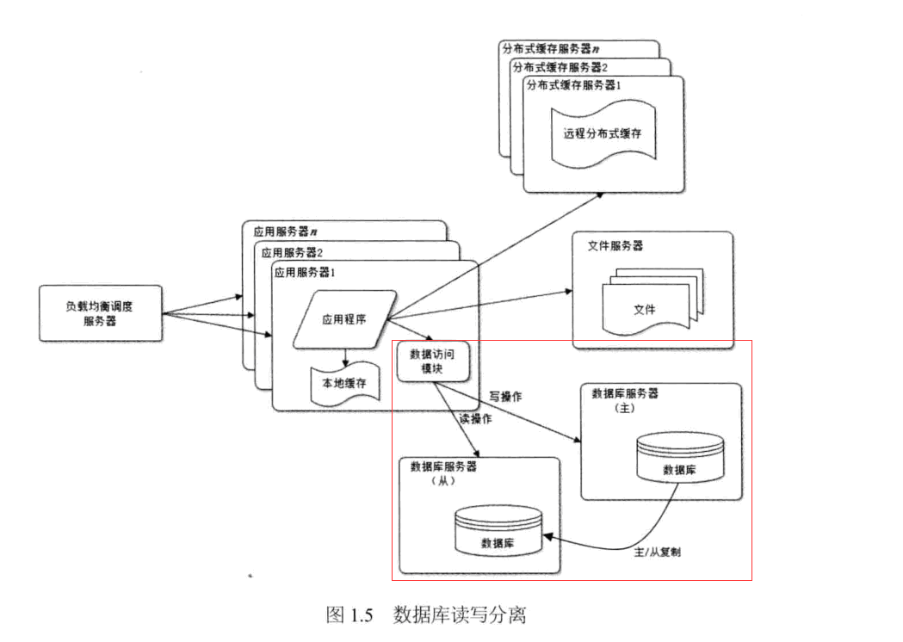

## 前言

在网站的用户达到一定规模后,数据库因为负载压力过高而成为网站的瓶颈。幸运的是目前大部分的主流数据库都提供主从热备功能，通过配置两台数据库主从关系，可以将一台数据库的数据更新同步到另一台服务器上。网站利用数据库的这一功能，实现数据库读写分离，从而改善数据库负载压力。如下图所示：

应用服务器在写数据的时候，访问主数据库，主数据库通过主从复制机制将数据更新同步到从数据库，这样当应用服务器读数据的时候，就可以通过从数据库获得数据。为了便于应用程序访问读写分离后的数据库，通常在应用服务器使用专门的数据库访问模块，使数据库读写分离对应用透明。

摘自《大型网站技术架构_核心原理与案例分析》

而本博客就是来实现“专门的数据库访问模块”，使数据库读写分离对应用透明。另外，mysql数据库的主从复制可以参考我的[mysql5.7.18的安装与主从复制](http://www.cnblogs.com/youzhibing/p/7293888.html)。注意，数据库实现了主从复制，才能做数据库的读写分离，所以，没有实现数据库主从复制的记得先去实现数据库的主从复制

## 配置读写数据源(主从数据库)

###  mysqldb.properties

    
    
    #主数据库数据源
    jdbc.driverClassName=com.mysql.jdbc.Driver
    jdbc.url=jdbc:mysql://192.168.0.4:3306/mybatis?useUnicode=true&characterEncoding=utf-8&useSSL=false
    jdbc.username=root
    jdbc.password=123456
    jdbc.initialSize=1
    jdbc.minIdle=1
    jdbc.maxActive=20
    jdbc.maxWait=60000
    jdbc.removeAbandoned=true
    jdbc.removeAbandonedTimeout=180
    jdbc.timeBetweenEvictionRunsMillis=60000
    jdbc.minEvictableIdleTimeMillis=300000
    jdbc.validationQuery=SELECT 1
    jdbc.testWhileIdle=true
    jdbc.testOnBorrow=false
    jdbc.testOnReturn=false
    
    #从数据库数据源
    slave.jdbc.driverClassName=com.mysql.jdbc.Driver
    slave.jdbc.url=jdbc:mysql://192.168.0.221:3306/mybatis?useUnicode=true&characterEncoding=utf-8&useSSL=false
    slave.jdbc.username=root
    slave.jdbc.password=123456
    slave.jdbc.initialSize=1
    slave.jdbc.minIdle=1
    slave.jdbc.maxActive=20
    slave.jdbc.maxWait=60000
    slave.jdbc.removeAbandoned=true
    slave.jdbc.removeAbandonedTimeout=180
    slave.jdbc.timeBetweenEvictionRunsMillis=60000
    slave.jdbc.minEvictableIdleTimeMillis=300000
    slave.jdbc.validationQuery=SELECT 1
    slave.jdbc.testWhileIdle=true
    slave.jdbc.testOnBorrow=false
    slave.jdbc.testOnReturn=false

主、从数据库的地址记得改成自己的，账号和密码也需要改成自己的；其他配置项，大家可以酌情自行设置

###  mybatis-spring.xml

    
    
    <?xml version="1.0" encoding="UTF-8"?>
    <beans xmlns="http://www.springframework.org/schema/beans"
        xmlns:xsi="http://www.w3.org/2001/XMLSchema-instance" xmlns:context="http://www.springframework.org/schema/context"
        xmlns:aop="http://www.springframework.org/schema/aop" xmlns:tx="http://www.springframework.org/schema/tx"
        xsi:schemaLocation="http://www.springframework.org/schema/beans 
         http://www.springframework.org/schema/beans/spring-beans.xsd
         http://www.springframework.org/schema/context
         http://www.springframework.org/schema/context/spring-context.xsd
         http://www.springframework.org/schema/aop
         http://www.springframework.org/schema/aop/spring-aop.xsd
         http://www.springframework.org/schema/tx 
         http://www.springframework.org/schema/tx/spring-tx.xsd">
    
        <!-- master数据源 -->
        <bean id="masterDataSource" class="com.alibaba.druid.pool.DruidDataSource">
            <!-- 基本属性 url、user、password -->  
            <property name="driverClassName" value="${jdbc.driverClassName}" />  
            <property name="url" value="${jdbc.url}" />  
            <property name="username" value="${jdbc.username}" />  
            <property name="password" value="${jdbc.password}" />  
            <property name="initialSize" value="${jdbc.initialSize}" />  
            <property name="minIdle" value="${jdbc.minIdle}" />   
            <property name="maxActive" value="${jdbc.maxActive}" />  
            <property name="maxWait" value="${jdbc.maxWait}" />
            <!-- 超过时间限制是否回收 -->
            <property name="removeAbandoned" value="${jdbc.removeAbandoned}" />
            <!-- 超过时间限制多长； -->
            <property name="removeAbandonedTimeout" value="${jdbc.removeAbandonedTimeout}" />
            <!-- 配置间隔多久才进行一次检测，检测需要关闭的空闲连接，单位是毫秒 -->
            <property name="timeBetweenEvictionRunsMillis" value="${jdbc.timeBetweenEvictionRunsMillis}" />
            <!-- 配置一个连接在池中最小生存的时间，单位是毫秒 -->
            <property name="minEvictableIdleTimeMillis" value="${jdbc.minEvictableIdleTimeMillis}" />
            <!-- 用来检测连接是否有效的sql，要求是一个查询语句-->
            <property name="validationQuery" value="${jdbc.validationQuery}" />
            <!-- 申请连接的时候检测 -->
            <property name="testWhileIdle" value="${jdbc.testWhileIdle}" />
            <!-- 申请连接时执行validationQuery检测连接是否有效，配置为true会降低性能 -->
            <property name="testOnBorrow" value="${jdbc.testOnBorrow}" />
            <!-- 归还连接时执行validationQuery检测连接是否有效，配置为true会降低性能  -->
            <property name="testOnReturn" value="${jdbc.testOnReturn}" />
        </bean>
    
        <!-- slave数据源 -->
        <bean id="slaveDataSource" class="com.alibaba.druid.pool.DruidDataSource">
            <property name="driverClassName" value="${slave.jdbc.driverClassName}" />  
            <property name="url" value="${slave.jdbc.url}" />  
            <property name="username" value="${slave.jdbc.username}" />  
            <property name="password" value="${slave.jdbc.password}" />  
            <property name="initialSize" value="${slave.jdbc.initialSize}" />  
            <property name="minIdle" value="${slave.jdbc.minIdle}" />   
            <property name="maxActive" value="${slave.jdbc.maxActive}" />  
            <property name="maxWait" value="${slave.jdbc.maxWait}" />
            <property name="removeAbandoned" value="${slave.jdbc.removeAbandoned}" />
            <property name="removeAbandonedTimeout" value="${slave.jdbc.removeAbandonedTimeout}" />
            <property name="timeBetweenEvictionRunsMillis" value="${slave.jdbc.timeBetweenEvictionRunsMillis}" />
            <property name="minEvictableIdleTimeMillis" value="${slave.jdbc.minEvictableIdleTimeMillis}" />
            <property name="validationQuery" value="${slave.jdbc.validationQuery}" />
            <property name="testWhileIdle" value="${slave.jdbc.testWhileIdle}" />
            <property name="testOnBorrow" value="${slave.jdbc.testOnBorrow}" />
            <property name="testOnReturn" value="${slave.jdbc.testOnReturn}" />
        </bean>
        
        <!-- 动态数据源，根据service接口上的注解来决定取哪个数据源 -->
        <bean id="dataSource" class="com.yzb.util.DynamicDataSource">  
            <property name="targetDataSources">      
              <map key-type="java.lang.String">      
                  <!-- write or slave -->    
                 <entry key="slave" value-ref="slaveDataSource"/>      
                 <!-- read or master   -->  
                 <entry key="master" value-ref="masterDataSource"/>      
              </map>               
            </property>   
            <property name="defaultTargetDataSource" ref="masterDataSource"/>      
          
        </bean>
        
        <!-- Mybatis文件 -->
        <bean id="sqlSessionFactory" class="org.mybatis.spring.SqlSessionFactoryBean">
            <property name="configLocation" value="classpath:mybatis-config.xml" /> 
            <property name="dataSource" ref="dataSource" />
            <!-- 映射文件路径 -->
            <property name="mapperLocations" value="classpath*:dbmappers/*.xml" />
        </bean>
    
        <bean class="org.mybatis.spring.mapper.MapperScannerConfigurer">
            <property name="basePackage" value="com.yzb.dao" />
            <property name="sqlSessionFactoryBeanName" value="sqlSessionFactory" />
        </bean>
    
        <!-- 事务管理器 -->
        <bean id="transactionManager"
            class="org.springframework.jdbc.datasource.DataSourceTransactionManager">
            <property name="dataSource" ref="dataSource" />
        </bean>
        <!-- 声明式开启 -->
        <tx:annotation-driven transaction-manager="transactionManager" proxy-target-class="true" order="1"/>
        
        <!-- 为业务逻辑层的方法解析@DataSource注解  为当前线程的HandleDataSource注入数据源 -->    
        <bean id="dataSourceAspect" class="com.yzb.util.DataSourceAspect" />    
        <aop:config proxy-target-class="true">    
            <aop:aspect id="dataSourceAspect" ref="dataSourceAspect" order="2">    
                <aop:pointcut id="tx" expression="execution(* com.yzb.service.impl..*.*(..)) "/>    
                <aop:before pointcut-ref="tx" method="before" />                
            </aop:aspect>    
        </aop:config>
    </beans>

## AOP实现数据源的动态切换

### DataSource.java

    
    
    package com.yzb.util;
    
    import java.lang.annotation.ElementType;
    import java.lang.annotation.Retention;
    import java.lang.annotation.RetentionPolicy;
    import java.lang.annotation.Target;
    
    /**  
     * RUNTIME  
     * 编译器将把注释记录在类文件中，在运行时 VM 将保留注释，因此可以反射性地读取。  
     *  
     */  
    @Retention(RetentionPolicy.RUNTIME)  
    @Target(ElementType.METHOD) 
    public @interface DataSource
    {
        String value();
    }

### DataSourceAspect.java

    
    
    package com.yzb.util;
    
    import java.lang.reflect.Method;
    
    import org.aspectj.lang.JoinPoint;
    import org.aspectj.lang.reflect.MethodSignature;
    
    public class DataSourceAspect
    {
        /**
         * 在dao层方法获取datasource对象之前，在切面中指定当前线程数据源
         */
        public void before(JoinPoint point)
        {
    
            Object target = point.getTarget();
            String method = point.getSignature().getName();
            Class<?>[] classz = target.getClass().getInterfaces();                        // 获取目标类的接口， 所以@DataSource需要写在接口上
            Class<?>[] parameterTypes = ((MethodSignature) point.getSignature())
                    .getMethod().getParameterTypes();
            try
            {
                Method m = classz[0].getMethod(method, parameterTypes);
                if (m != null && m.isAnnotationPresent(DataSource.class))
                {
                    DataSource data = m.getAnnotation(DataSource.class);
                    System.out.println("用户选择数据库库类型：" + data.value());
                    HandleDataSource.putDataSource(data.value());                        // 数据源放到当前线程中
                }
    
            } catch (Exception e)
            {
                e.printStackTrace();
            }
        }
        }

### DynamicDataSource.java

    
    
    package com.yzb.util;
    
    import org.springframework.jdbc.datasource.lookup.AbstractRoutingDataSource;
    
    public class DynamicDataSource extends AbstractRoutingDataSource
    {
    
        /**
         * 获取与数据源相关的key 此key是Map<String,DataSource> resolvedDataSources 中与数据源绑定的key值
         * 在通过determineTargetDataSource获取目标数据源时使用
         */
        @Override
        protected Object determineCurrentLookupKey()
        {
            return HandleDataSource.getDataSource();
        }
    
    }

### HandleDataSource.java

    
    
    package com.yzb.util;
    
    public class HandleDataSource
    {
        public static final ThreadLocal<String> holder = new ThreadLocal<String>();
    
        /**
         * 绑定当前线程数据源
         * 
         * @param key
         */
        public static void putDataSource(String datasource)
        {
            holder.set(datasource);
        }
    
        /**
         * 获取当前线程的数据源
         * 
         * @return
         */
        public static String getDataSource()
        {
            return holder.get();
        }
    }

### service接口上应用@DataSource实现数据源的指定

    
    
    package com.yzb.service;
    
    import java.util.List;
    
    import com.yzb.model.Person;
    import com.yzb.util.DataSource;
    
    public interface IPersonService {
    
        /**
         * 加载全部的person
         * @return
         */
        List<Person> listAllPerson();
        
        /**
         * 查询某个人的信息
         * @param personId
         * @return
         */
        @DataSource("slave")            // 指定使用从数据源
        Person getPerson(int personId);
        
        boolean updatePerson(Person person);
    }

## 注意点

测试的时候，怎么样知道读取的是从数据库了？ 我们可以修改从数据库中查询到的那条记录的某个字段的值，以区分主、从数据库；

事务需要注意，尽量保证在一个数据源上进行事务；

当某个service上有多个aop时，需要注意aop织入的顺序问题，利用order关键字控制好织入顺序；

项目完整工程[github地址](https://github.com/youzhibing/maven-ssm-
web)：https://github.com/youzhibing/maven-ssm-
web，工程中实现了redis缓存，不去访问：http://localhost:8080/maven-ssm-
web/personController/showPerson是没有问题的,当然你可以redis服务搭建起来并集成进来；

测试url：http://localhost:8080/maven-ssm-web/personController/person?personId=1

## 参考

《大型网站技术架构_核心原理与案例分析》

[Spring+MyBatis实现数据库读写分离方案](http://www.jianshu.com/p/2222257f96d3)

