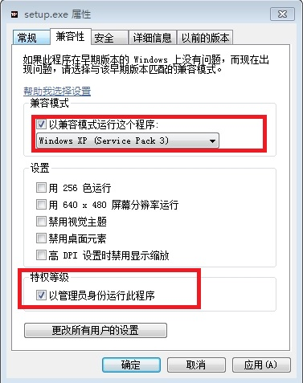

##win7下安装 oracle 10g：permission denied

##
##　　昨天换了win7系统，在装数据库oracle 10g，开始安装的时候蛮好的，但是在创建数据库过程中始终出现这个错误：:ora-12546 tnspermissiondenied。退出来在database configuration assistant在配置数据库也是这个错误。这个问题一直困扰着我，不过我安装多少遍都是这个错误。没办法在网上查找资料，终于找到了解决方案，记在这里帮助犯了同样错误的同仁们：
     在win7系统下安装Oracle ,有以下几点需要注意：

##
##  　　1.需用administrator 用户下安装。
    2.因为oracle 10g暂时没有与win7兼容的版本，我们可以通过对安装软件中某些文件的修改达到安装的目地。
      a)打开“\Oracle 10G \stage\prereq\db”路径，找到refhost.xml文件，打开，向其中添加如下代码并保存。
      <OPERATING_SYSTEM>
             <VERSION VALUE="6.1"/>
       </OPERATING_SYSTEM>
      b)打开“\Oracle 10G \install”路径，找到oraparam.ini文件，打开，向其中添加如下代码并保存。
       [Windows-6.1-required]
           #Minimum display colours for OUI to run
           MIN_DISPLAY_COLORS=256
            #Minimum CPU speed required for OUI
            #CPU=300
        [Windows-6.1-optional]
3.右击step.exe文件属性，做如下修改：
 

##
##

##
##
4.双击step.exe安装oracle 10g，直到安装程序结束。
5.根据以上几步的安装，oracle很可能无法正常使用，最起码在我安装结束后，我的sqlplus无法正常使用，这种情况就涉及到权限的问题。具体可通过以下措施解决：
a)打开你已经安装好的oracle程序的路径“\oracle\product\10.2.0\db_1\BIN”，点击sqlplus.exe应用程序，右击—属性，选择兼容性，点击“以兼容模式运行这个程序”单选框，选择“window xp(service pack3)”，继续点击“以管理员身份运行此程序”单选框，最后点击应用-确定。
b)如此sqlplus就可以正常使用了

##
##
