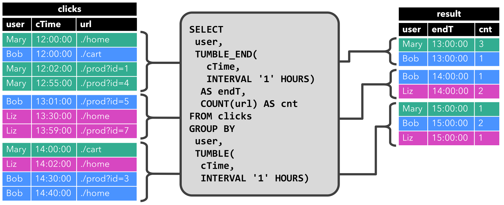

# 流概念

## Data Streams上的关系查询

`关系型SQL`与`stream processing`对比如下。  
  
<table>  
<tr>  
<th>

SQL

</th>  
<th>

Stream Processing

</th> </tr>  
<tr>  
<td>

有限元组

</td>  
<td>

无限元组

</td> </tr>  
<tr>  
<td>

完整数据集上的查询

</td>  
<td>

无法基于所有数据查询

</td> </tr>  
<tr>  
<td>

查询会结束

</td>  
<td>

查询不会结束

</td> </tr> </table>

**Materialized View** 被定义为一条SQL查询，其会缓存查询结果。但当所查询的表(基表)被修改时，缓存的结果将过期。  
**Eager View Maintenance** 会更新 **Materialized View** ，当基表被更新时，会立刻更新
**Materialized View** 中缓存的结果。

**Eager View Maintenance** 和 **SQL Query** 在`streams`上的关系如下。

  * 数据库表是`INSERT、UPDATE、DELETE`等`DML`语句流的结果，被流称为 **changelog stream** 。
  * **Materialized View** 被定义为一条SQL查询。为更新`View`，查询需要不断处理 **changelog stream** 。
  * **Materialized View** 是`streaming SQL`查询结果。

## 动态表 & 连续查询

动态表是Flink流上`Table Api & SQL`的核心概念，其随时间动态变化；

  * 查询动态表会产生一个连续查询；
  * 连续查询永不停止，其会产生一个动态表；
  * 当所查询的动态表发生变化时，查询会更新结果动态表。

> **连续查询的结果等同在输入表的快照上以批处理模式执行相同查询的结果。**

流、动态表、连续查询的关系如下图所示。

  * `stream`会被转化为动态表。
  * 在动态表上进行连续查询，产生新的动态表。
  * 动态表会被转化为`stream`。

> 动态表是一个逻辑概念。 在查询执行期间动态表不一定（完全）`materialized`。

为理解动态表和连续查询的概念，假设点击事件流有如下模式。

> [  
>  user: VARCHAR, // the name of the user  
>  cTime: TIMESTAMP, // the time when the URL was accessed  
>  url: VARCHAR // the URL that was accessed by the user  
>  ]

### 流上定义表

为在流上使用关系查询，流需要被转化为表。流的每个记录被解释为结果表(动态表)上的`INSERT`修改，我们从一个只有`INSERT`的`changelog`流中构建表。如下图所示，点击事件流被转化为表，表会随着点击事件记录的插入而不断增长。

### 连续查询

连续查询作用于动态表并又会产生动态表；连续查询不会终止并会根据其输入表(动态表)上的更新来更新其结果表(动态表)。  
下面显示在点击事件流上定义的`clicks`表上显示两个查询示例。

首先是`GROUP-BY COUNT`聚合查询示例。

当查询开始时，`clicks`表为空；当第一行插入到`clicks`表中时，查询开始计算结果表(动态表)，如[Mary,
./home]插入后，结果表包含一行结果[Mary, 1]；当插入第二行[Bob, ./cart]时，查询会更新结果表并插入新记录[Bob,
1]。第三行[Mary, ./prod=id=1]插入时，查询会更新结果表中的[Mary, 1]记录，将其更新为[Mary, 2]。最后一行[Liz,
1]插入`clicks`表后，也会更新到结果表(插入新记录)。

第二个查询与第一个查询类似，除了用户属性之外，还在小时滚动窗口上对`clicks`表进行分组，然后对URL进行计数(基于时间的计算，如窗口基于特殊的时间属性)。

每个小时查询会计算结果并更新结果表。在`cTime`在`12:00:00 -
12:59:59`之间，`clicks`表存在四条记录，对应的查询计算出两条结果；下个时间窗口(13:00:00 -
13:59:59)，`clicks`表中存在三条记录，对应的查询计算出两条结果添加值结果表中；当记录插入至`clicks`表中后，结果表也会被动态更新。

#### 更新和附加查询

上述两个查询虽然有些类似(均计算统计聚合分组)，但两者也有显著不同：第一个查询会更新结果表的结果，如定义在结果表上的`changelog`流包含`INSERT`和`UPDATE`；第二个查询仅仅往结果表中添加记录，如定义在结果表上的`changelog`流只包含`INSERT`。一个查询是否生成仅
**插入表** (`INSERT`)或 **更新表** (`UPDATE`)有一些含义:生成更新表的查询必须要维护更多状态，将仅 **插入表**
转化为流与将 **更新表** 转化为流不同。

#### 查询限制

很多查询可以等同在流上的连续查询，一些查询由于需维护状态的大小或计算更新代价大导致查询计算代价太大。

  * 状态大小：无界限流上的连续查询经常会运行数周或数月。因此，连续查询处理的数据总量可以很大，需要以前结果(结果表)的连续查询需要维护所有行以便进行更新。例如，第一个查询示例中需要保存每个`user`的`url`的`count`以便可以增加`count`，使得当输入表(左侧表)接收一行新数据时会产生新的结果(右侧表)。若只跟踪注册用户，那么维护`cnt`大小代价不会太大(注册用户量不太大)。但若非注册用户也分配唯一的用户名，则随着时间的增加，维护`cnt`大小代价将增大，最终导致查询失败。

> SELECT user, COUNT(url)  
>  FROM clicks  
>  GROUP BY user;

  * 计算更新：即使只添加或更新单行记录，一些查询需要重新计算和更新大部分结果行，通常这样的查询不适合作为连续查询。如下查询示例中，会根据最后一次点击的时间为每个用户计算`RANK`。一旦`clicks`表收到新行，用户的`lastAction`被更新并且应该计算新的`RANK`。然而由于不存在两行相同`RANK`，所以所有较低`RANK`的行也需要被更新。

> SELECT user, RANK() OVER (ORDER BY lastLogin)  
>  FROM (  
>  SELECT user, MAX(cTime) AS lastAction FROM clicks GROUP BY user  
>  );

### 表到流的转化

动态表可像传统表一样被`INSERT、UPDATE、DELETE`修改。可能只有一行的表被持续更新；或者是没有`UPDATE、DELETE`更改的
**只插入表** 。当将动态表转化为流或将其写入外部系统，这些更改(修改)需要被编码，`Flink`的`Table API &
SQL`支持三种方式编码动态表上的更改(修改)。

  * Append-only流：仅使用`INSERT更改`进行修改的动态表可通过发出插入的行来转化为流。
  * Retract流：`Retract流`包含两种类型消息(`add消息和retract消息`)，通过将动态表的`INSERT更改`作为`add消息`、将`DELETE更改`作为`retract消息`、将`UPDATE更改`分解为旧记录的`retract消息`和新记录的`add消息`。下图展示了从动态表转化为`retract流`。

  * Upsert流：`Upsert流`包含两种类型消息(`upset消息和delete消息`)，动态表转化为`upsert流`需要有主键(可复合)，具有主键的动态表通过将`INSERT、UPDATE更改`编码为`upset消息`，将`DELETE更改`编码为`delete消息`。`upset流`与`retract流`主要区别是`UPDATE更改`使用单一消息(主键)进行编码，因此效率更高。下图展示了将`动态表`转化为`upset流`。

## 时间属性

  * **Processing time(处理时间)** ：表示事件被处理的系统时间。
  * **Event time(事件时间)** ：表示事件发生时的时间。
  * **Ingestion time(摄入时间)** ：表示事件进入流处理系统的时间(在内部其与`Event time`类型)。

上述时间可以在代码中指明时间特性。

    
    
    final StreamExecutionEnvironment env = StreamExecutionEnvironment.getExecutionEnvironment();
    
    env.setStreamTimeCharacteristic(TimeCharacteristic.ProcessingTime); // default
    
    // alternatively:
    // env.setStreamTimeCharacteristic(TimeCharacteristic.IngestionTime);
    // env.setStreamTimeCharacteristic(TimeCharacteristic.EventTime);
    

`Table API &
SQL`中基于时间的操作（如窗口）需要设置时间概念和及其来源信息。因此，`tables`可以提供`逻辑时间属性`来指示时间并在`table`程序中访问相应时间戳。时间属性可以是`表模式`的一部分(从`DataStream`中创建表时被定义)，或在使用`TableSource`时被预定义，一旦时间属性被定义，那么其可以作为一个字段被引用或进行基于时间的操作。只要时间属性没有被修改，只是从查询的一部分转发到另一部分，那么它仍然是一个有效的时间属性。时间属性与常规时间戳相同，可被访问并计算。如果在计算中使用时间属性，那么其将被具象化为常规时间戳，常规时间戳不兼容`Flink`的时间和水位系统，因此不能再用于基于时间的操作。

### 处理时间

`processing time`允许 **表程序** 基于本地机器的时间输出结果，它不需要提取时间戳和生成水位，有多种方式定义`processing
time`属性。

#### 流转化为表过程

`processing
time`属性在模式定义时使用`.proctime`属性定义，时间属性只能通过额外的逻辑字段扩展物理模式，因此，其可被定义在模式定义的末尾，具体如下。

    
    
    DataStream<Tuple2<String, String>> stream = ...;
    
    // declare an additional logical field as a processing time attribute
    Table table = tEnv.fromDataStream(stream, "Username, Data, UserActionTime.proctime");
    
    WindowedTable windowedTable = table.window(Tumble.over("10.minutes").on("UserActionTime").as("userActionWindow"));
    

#### 使用TableSource

`processing
time`属性可通过实现`DefinedProctimeAttribute`接口定义，逻辑时间属性被附加到由`TableSource`的返回类型定义的物理模式上。

    
    
    // define a table source with a processing attribute
    public class UserActionSource implements StreamTableSource<Row>, DefinedProctimeAttribute {
    
        @Override
        public TypeInformation<Row> getReturnType() {
            String[] names = new String[] {"Username" , "Data"};
            TypeInformation[] types = new TypeInformation[] {Types.STRING(), Types.STRING()};
            return Types.ROW(names, types);
        }
    
        @Override
        public DataStream<Row> getDataStream(StreamExecutionEnvironment execEnv) {
            // create stream 
            DataStream<Row> stream = ...;
            return stream;
        }
    
        @Override
        public String getProctimeAttribute() {
            // field with this name will be appended as a third field 
            return "UserActionTime";
        }
    }
    
    // register table source
    tEnv.registerTableSource("UserActions", new UserActionSource());
    
    WindowedTable windowedTable = tEnv
        .scan("UserActions")
        .window(Tumble.over("10.minutes").on("UserActionTime").as("userActionWindow"));
    

### 事件时间

`Event time`允许 **表程序**
根据每条记录中包含的时间输出结果，这样即使在无序事件或晚到事件情况下保持一致结果，当从持久化存储中读取记录时还保证可重放结果。此外，`event
time`允许批和流环境中的 **表程序**
使用统一的语法，流环境中的时间属性可以是批环境中的记录的字段。为处理乱序事件，并区分流中准时和晚到事件，`Flink`需要从事件中提取时间戳信息，并在时间戳上进行处理(水位)。`event
time`属性可被定义在 **流到表的转化中** 或者使用 **TableSource** 。`Table API &
SQL`假设在上述两种情况下，都在`DataStream API`中生成时间戳和水位。

#### 流转化为表的过程中

`event
time`属性在模式定义时通过`.rowtime`属性定义；时间戳和水位必须在转换的DataStream中已被分配；将`DataStream`转化为`Table`时有如下两种定义时间属性的方式。

  * 通过附加逻辑字段扩展物理表模式。
  * 用逻辑字段替换物理字段(如提取时间戳后不再需要)。

    
    
    // Option 1:
    
    // extract timestamp and assign watermarks based on knowledge of the stream
    DataStream<Tuple2<String, String>> stream = inputStream.assignTimestampsAndWatermarks(...);
    
    // declare an additional logical field as an event time attribute
    Table table = tEnv.fromDataStream(stream, "Username, Data, UserActionTime.rowtime");
    
    
    // Option 2:
    
    // extract timestamp from first field, and assign watermarks based on knowledge of the stream
    DataStream<Tuple3<Long, String, String>> stream = inputStream.assignTimestampsAndWatermarks(...);
    
    // the first field has been used for timestamp extraction, and is no longer necessary
    // replace first field with a logical event time attribute
    Table table = tEnv.fromDataStream(stream, "UserActionTime.rowtime, Username, Data");
    
    // Usage:
    
    WindowedTable windowedTable = table.window(Tumble.over("10.minutes").on("UserActionTime").as("userActionWindow"));
    

#### 使用TableSource

`event
time`属性可通过实现`DefinedRowtimeAttribute`接口定义，逻辑时间属性被附加到由`TableSource`的返回类型定义的物理模式上。时间戳和水位一定要在`getDataStream`方法返回的流中被分配。

    
    
    // define a table source with a rowtime attribute
    public class UserActionSource implements StreamTableSource<Row>, DefinedRowtimeAttribute {
    
        @Override
        public TypeInformation<Row> getReturnType() {
            String[] names = new String[] {"Username" , "Data"};
            TypeInformation[] types = new TypeInformation[] {Types.STRING(), Types.STRING()};
            return Types.ROW(names, types);
        }
    
        @Override
        public DataStream<Row> getDataStream(StreamExecutionEnvironment execEnv) {
            // create stream 
            // ...
            // extract timestamp and assign watermarks based on knowledge of the stream
            DataStream<Row> stream = inputStream.assignTimestampsAndWatermarks(...);
            return stream;
        }
    
        @Override
        public String getRowtimeAttribute() {
            // field with this name will be appended as a third field 
            return "UserActionTime";
        }
    }
    
    // register the table source
    tEnv.registerTableSource("UserActions", new UserActionSource());
    
    WindowedTable windowedTable = tEnv
        .scan("UserActions")
        .window(Tumble.over("10.minutes").on("UserActionTime").as("userActionWindow"));
    

## 查询配置

不管输入是有界批量输入还是无界流输入，`Table API &
SQL`查询都有相同的语义。在很多情况下，流上的连续查询与离线计算具有相同准确的结果。然而，在实际情况下连续查询必须要限制其所维护状态的大小以避免使用完存储空间，并能够在长时间处理无限流数据。因此，连续查询可能只能根据输入数据的特征和查询本身提供近似准确的结果。

`Flink Table API &
SQL`接口提供参数调整连续查询的准确性和资源消耗。参数通过`QueryConfig`对象定义，`QueryConfig`对象可通过`TableEnvironment`获取并在翻译表时被传回。

    
    
    StreamExecutionEnvironment env = StreamExecutionEnvironment.getExecutionEnvironment();
    StreamTableEnvironment tableEnv = TableEnvironment.getTableEnvironment(env);
    
    // obtain query configuration from TableEnvironment
    StreamQueryConfig qConfig = tableEnv.queryConfig();
    // set query parameters
    qConfig.withIdleStateRetentionTime(Time.hours(12));
    
    // define query
    Table result = ...
    
    // create TableSink
    TableSink<Row> sink = ...
    
    // emit result Table via a TableSink
    result.writeToSink(sink, qConfig);
    
    // convert result Table into a DataStream<Row>
    DataStream<Row> stream = tableEnv.toAppendStream(result, Row.class, qConfig);
    

下面描述了`QueryConfig`的参数如何影响查询的准确性和资源消耗的。

### 空闲状态保留时间

很多查询在一个或多个关键属性上聚合或连接记录(如典型的聚合查询)，当在流上执行该查询时，连续查询需要维护记录或保持每个键的部分结果。若涉及到流的关键域(活动键值随时间会变化)，随着不同键被观察，连续查询会积累越来越多的状态。然而，在一段时间后键将变得不活动时，它们的对应状态将变得过期和无效。如下查询示例中计算每个`session`的`clicks`数量。

> SELECT sessionId, COUNT(*) FROM clicks GROUP BY sessionId;

`sessionId`被作为分组键，连续查询会为每个`sessionId`维护`clicks`数量。`sessionId`属性随着时间推移而变化，`sessionId`值仅在`session`结束前处于活动状态(保持一段时间)。然而，由于不清楚`sessionId`属性，连续查询期望每个`sessionId`值在任何时间都有效，即会维护所有`sessionId`的值。这样会导致随着时间的推移，所维护的`sessionId`越来越多。

**空闲状态保留时间**
参数定义键的状态不被更新，在删除之前保留多长时间。在上述查询中，`sessionId`的计数在指定的配置时间内未被更新时将被移除。当键会移除后再次被添加，那么键将会被当成新的键(如上述示例中又会开始计0)。有两个参数配置
**空闲状态保留时间** ， **最小空闲状态保留时间** 和 **最大空闲状态保留时间** 。

    
    
    StreamQueryConfig qConfig = ...
    
    // set idle state retention time: min = 12 hour, max = 16 hours
    qConfig.withIdleStateRetentionTime(Time.hours(12), Time.hours(16));
    // set idle state retention time. min = max = 12 hours
    qConfig.withIdleStateRetentionTime(Time.hours(12);
    

配置不同的最小和最大空闲状态保留时间的效率更高，因为它减少了查询内部簿记何时删除状态的次数。

## 参考链接

<https://ci.apache.org/projects/flink/flink-docs-
release-1.3/dev/table/streaming.html>

