##【GIT】Github上传本地代码详解

##
##本教程结合Github服务端和客户端完成本地代码上传至Github，下面进行详细讲解：

##
##1.创建Github账号，这一个步骤应该不用太多解释，直接上官网进行注册登录即可https://github.com/

##
##2.新建一个repository。如图，注册登录之后可以找到如下页面，新建一个repository。
 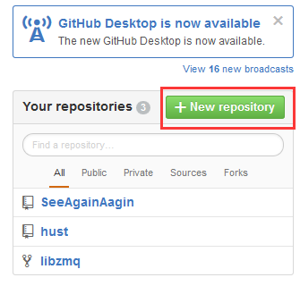
新建之后会出现如下页面
 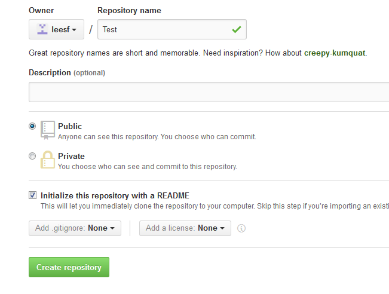
这里我新建了一个名为Test的repository,其中可以添加描述信息、确定repository的访问权限，同时为了更易于coder理解你的代码，可以勾选生成README(现在不生成，后期也可以生成，这都不是问题)
此时，repository就已经建立好了，可以看到如下页面，表示已经建立好了Test的仓库
 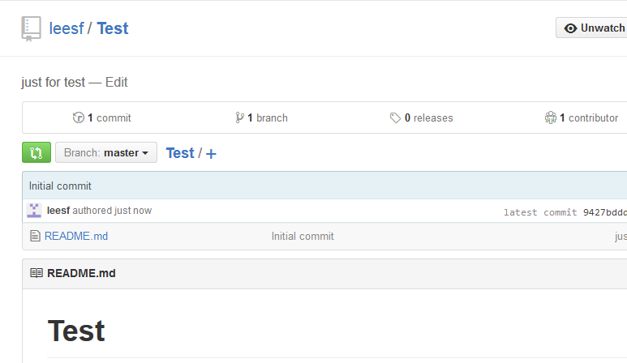
为了上传本地代码，需要下载一个对应平台的Github客户端，我使用的windows，所以下载windows版本，可以根据自己的情况酌情选择，下载地址为：https://desktop.github.com/
下载完成后进行安装，安装过程不用解释，等待即可。安装完成后应该会有Github客户端和GitShell两个应用程序，这个基本上没有问题。
下面开始重头戏，上传本地代码到Github
3.生成密钥
打开Git Shell 输入如下命令：ssh-keygen -C "your@email.address" -t rsa （例如：ssh-keygen -C "leesf456@gmail.com" -t rsa）
连续三个回车(Enter)即可生成属于你的密钥，并且在用户目录(我的目录为C:\Users\LEESF)中会生成如下.ssh的文件夹：
 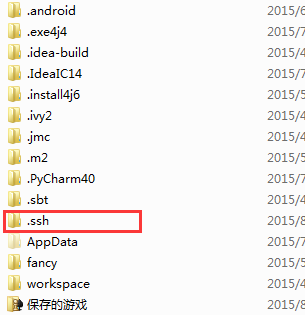
.ssh文件夹中的目录结构如下：
 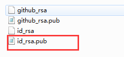
打开id_rsa.pub可以查看生成的密钥
将密钥复制到Github中，打开Github个人设置，如图
 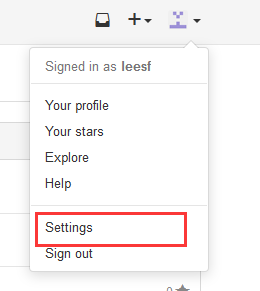
点击Settings之后，如图：
 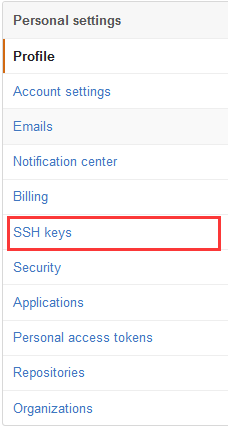
点击SSH Keys之后 如图：
 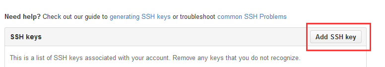
点击Add SSH key之后如图：
 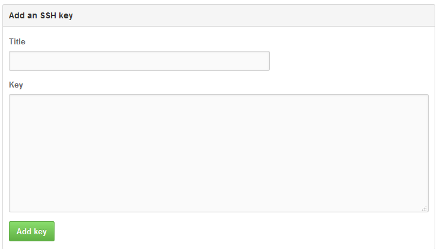
其中title可以看心情随便填写，Key复制黏贴id_rsa.pub中的密钥，然后点击Add key即可
完成密钥填写后，可以在Shell中进行测试，输入如下命令：ssh -T git@github.com


##
##正确结果会显示：
	Warning:Permanently added "github.com,207.97.227.239" (RSA) to the list of known hosts.
　　Hi LEESF! You"ve successfully authenticated, but GitHub does not provide shell access.

##
##Warning 不用理会

##
##4.clone刚才新建名为Test的repository 到本地，输入命令：

##
##git clone https://github.com/leesf/Test.git

##
##之后会在本地生成一个如下的目录结构：

##
## 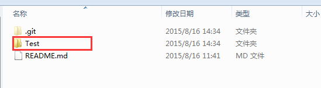

##
##

##
##5.把想要上传的代码文件夹复制到GitHub下(与.git处于同一目录下） 如把GitHubTest文件夹(里面包含了Test.java文件)复制到此目录中，如图：

##
## 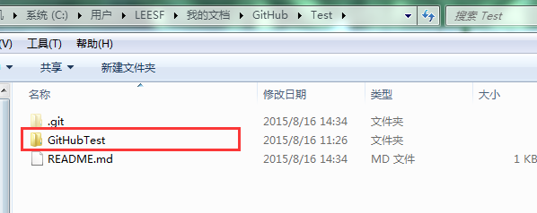

##
##

##
##6.开始上传文件

##
##在Shell中依次输入如下命令：
	git initgit add Test/GitHubTest
git commit -m "GitHubTest"
git remote add origin https://github.com/leesf/Test.git
git push origin master

##
##如果执行git remote add origin https://github.com/leesf/Test.git 出现错误：

	　　fatal: remote origin already exists


##
##则执行以下语句：

	　　git remote rm origin


##
##再次执行git remote add origin https://github.com/leesf/Test.git即可。

##
##在执行git push origin master时，报错：

	　　error:failed to push som refs to.......


##
##则执行以下语句：

	　　git pull origin master


##
##先把远程服务器github上面的文件拉先来，再push 上去
	这样整个上传过程就完成了，现在可以在GitHub上查看自己上传的源代码了。

其中参考链接：http://www.cnblogs.com/ruofengzhishang/p/3842587.html
