**目标：**

1.解决的问题是如何通过Git命令窗口将本地工程提交至GitHub。

2.方便园友的同时也方便自己以后解决此类问题。

**步骤：**

1.首先登陆GitHub网站[https://github.com/](http://www.github.com)

2.新建Repository

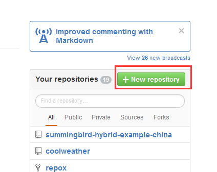

3.新建TicketBrushSystem的Repository，其中红框的几处可以根据实际情况自行填写。

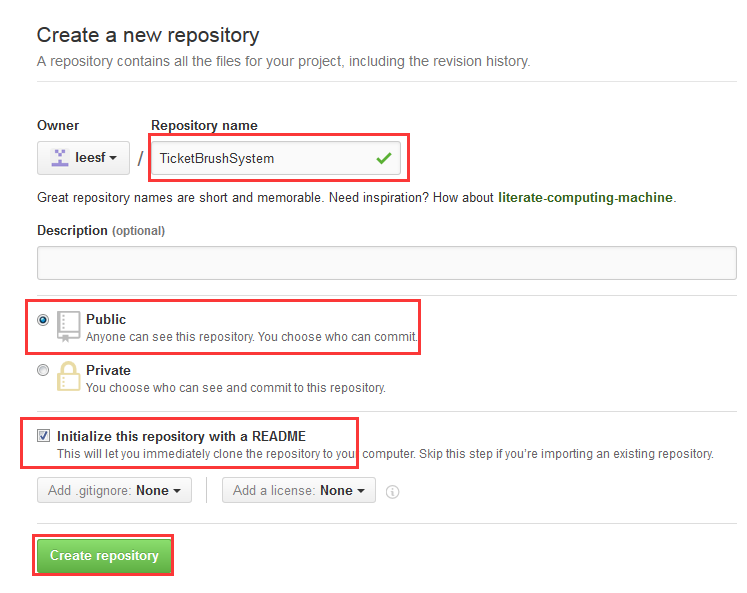

4.将TicketBrushSystem克隆到本地

4.1.使用Git Bash将工作目录切换到本地的工程文件目录，如，笔者的项目工程位于
F:\\\01_Code\\\01_Eclipse\\\TicketBrushSystem下

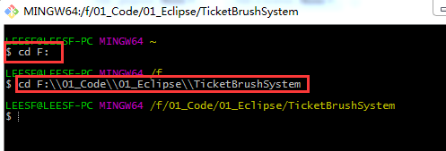

4.2.使用git clone
命令将GitHub的Repository克隆到本地。首先复制GitHub上新建的Repository的路径，如笔者的TicketBrushSystem路径如下图所示，为https://github.com/leesf/TicketBrushSystem.git

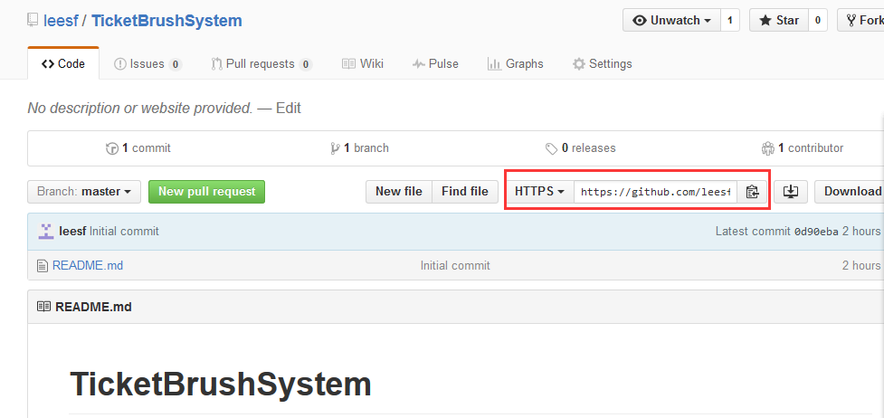

4.3.使用命令git clone
https://github.com/leesf/TicketBrushSystem.git将TicketBrushSystem克隆到本地

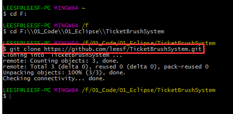 4.4.克隆完成后，使用ls
-al命令查看当前目录结构

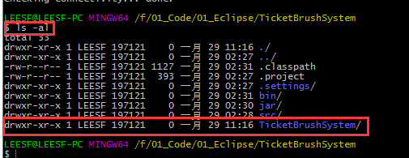
可以发现在目录相比之前的目录，多了./、../和TicketBrushSystem目录，其中./表示当前目录，../表示上一级目录TicketBrushSystem表示我们从GitHub下克隆的目录，进入
TicketBrushSystem目录查看文件。

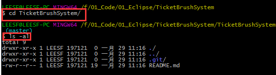
4.5.将TicketBrushSystem目录下的文件移动到上一级目录并删除TicketBrushSystem目录。可以通过mv命令完成，如mv
./.git/ ./README.md ../ 表示把当前目录下的.git文件和README.md文件移动到上一层目录下，之后使用ls
-al命令查看该目录发现确实被移动了。如下图所示  
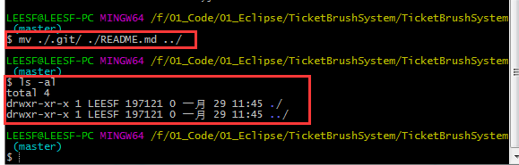 切换到上一级目录，使用ls
-al查看目录文件，发现TicketBrushSystem目录下的.git和README.md文件已经移动当前目录了。 如下图所示

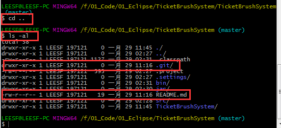 使用rm
命令将TicketBrushSystem目录删除，如 rm -rf ./TicketBrushSystem
表示递归并且不给出提示的删除TicketBrushSystem目录文件， 即删除 TicketBrushSystem目录下的所有文件，如下图所示

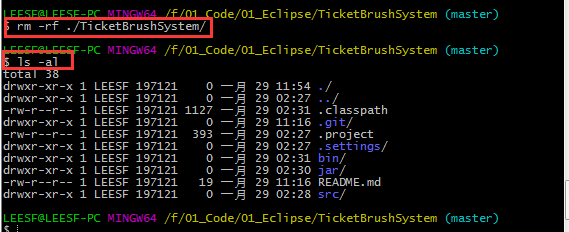
5.将代码提交至远程GitHub

5.1.使用git add . 命令将所有文件添加到版本控制中，如下图所示

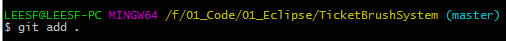

5.2.使用git commit -m "First Commit" 命令执行本地提交操作，如下图所示

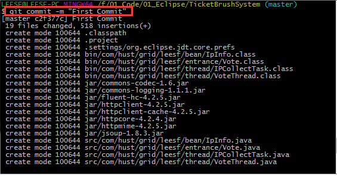 5.3.使用git push
origin master命令将提交的内容同步只远程版本库GitHub，如下图所示

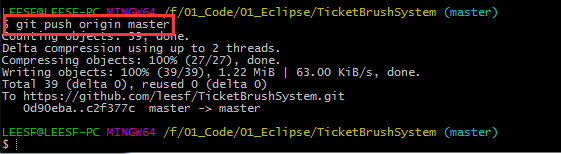
在同步时需要输入用户名和密码，只需要输入我们的github用户名和密码即可完成整个同步过程。

5.4.刷新我们的GitHub主页，即可显示我们同步的文件，如下图所示

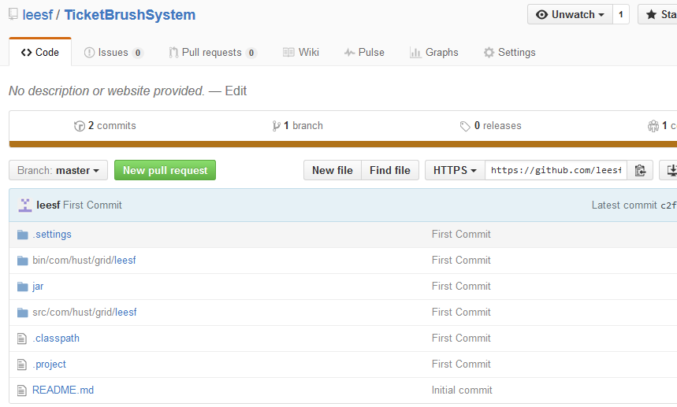
以上五步就基本上完成了将本地工程提交至远程GitHub的过程。但是，显然这样还不是太好，因为其他人并不知道这个项目有什么作用，所以，这时候需要编辑README.md文件，
供其他用户了解此项目的作用和意义。

6.编辑README.md文件

README.md后缀名为.md，
md是markdown的缩写，markdown是一种编辑博客的语言。需要使用标签来进行排版，如果仅仅只是编辑文本，就会出现很不雅观的效果。关于
GitHub的README.md文件的编写也可以出一个教程系列，想要深入了解的园友们可以去查阅资料，我在文章的最后也给出了一个学习链接。现在我们只完成最简单的README的编写。

6.1.编辑README.md文件，如下图所示

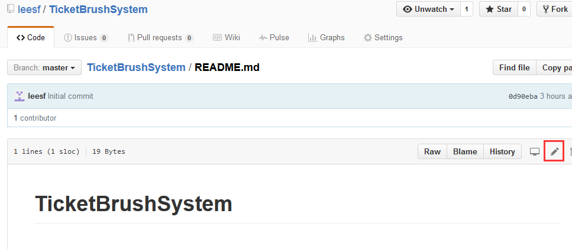 6.2.编辑内容如下图所示

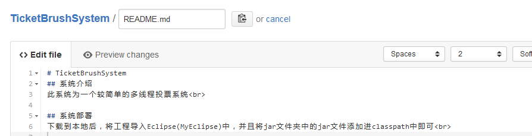 6.3.提交后如下图所示

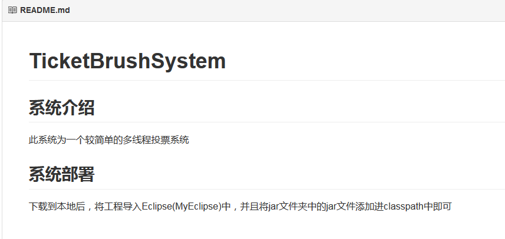

综合以上六步就完整的完成了整个工程的提交。

**总结：**

好记性不如烂笔头，记录的好处是方便他人，同时也方便了自己。 希望此笔记会对有需求的园友有所帮助，也谢谢各位园友的观看。

参考链接：

README.md教程：<http://blog.csdn.net/kaitiren/article/details/38513715>

