**一、前言**

在锁框架中，AbstractQueuedSynchronizer抽象类可以毫不夸张的说，占据着核心地位，它提供了一个基于FIFO队列，可以用于构建锁或者其他相关同步装置的基础框架。所以很有必要好好分析。

**二、AbstractQueuedSynchronizer数据结构**

分析类，首先就要分析底层采用了何种数据结构，抓住核心点进行分析，经过分析可知，AbstractQueuedSynchronizer类的数据结构如下

说明：AbstractQueuedSynchronizer类底层的数据结构是使用双向链表，是队列的一种实现，故也可看成是队列，其中Sync
queue，即同步队列，是双向链表，包括head结点和tail结点，head结点主要用作后续的调度。 而Condition
queue不是必须的，其是一个单向链表，只有当使用Condition时，才会存在此单向链表。并且可能会有多个Condition queue。

**三、AbstractQueuedSynchronizer源码分析**

3.1 类的继承关系

    
    
     public abstract class AbstractQueuedSynchronizer
        extends AbstractOwnableSynchronizer
        implements java.io.Serializable

说明：从类继承关系可知，AbstractQueuedSynchronizer继承自AbstractOwnableSynchronizer抽象类，并且实现了Serializable接口，可以进行序列化。而AbstractOwnableSynchronizer抽象类的源码如下

    
    
    public abstract class AbstractOwnableSynchronizer
        implements java.io.Serializable {
        
        // 版本序列号
        private static final long serialVersionUID = 3737899427754241961L;
        // 构造函数
        protected AbstractOwnableSynchronizer() { }
        // 独占模式下的线程
        private transient Thread exclusiveOwnerThread;
        
        // 设置独占线程 
        protected final void setExclusiveOwnerThread(Thread thread) {
            exclusiveOwnerThread = thread;
        }
        
        // 获取独占线程 
        protected final Thread getExclusiveOwnerThread() {
            return exclusiveOwnerThread;
        }
    }

View Code

说明：AbstractOwnableSynchronizer抽象类中，可以设置独占资源线程和获取独占资源线程。分别为setExclusiveOwnerThread与getExclusiveOwnerThread方法，这两个方法会被子类调用。

3.2 类的内部类

AbstractQueuedSynchronizer类有两个内部类，分别为Node类与ConditionObject类。下面分别做介绍。

1\. Node类

    
    
    static final class Node {
            // 模式，分为共享与独占
            // 共享模式
            static final Node SHARED = new Node();
            // 独占模式
            static final Node EXCLUSIVE = null;        
            // 结点状态
            // CANCELLED，值为1，表示当前的线程被取消
            // SIGNAL，值为-1，表示当前节点的后继节点包含的线程需要运行，也就是unpark
            // CONDITION，值为-2，表示当前节点在等待condition，也就是在condition队列中
            // PROPAGATE，值为-3，表示当前场景下后续的acquireShared能够得以执行
            // 值为0，表示当前节点在sync队列中，等待着获取锁
            static final int CANCELLED =  1;
            static final int SIGNAL    = -1;
            static final int CONDITION = -2;
            static final int PROPAGATE = -3;        
    
            // 结点状态
            volatile int waitStatus;        
            // 前驱结点
            volatile Node prev;    
            // 后继结点
            volatile Node next;        
            // 结点所对应的线程
            volatile Thread thread;        
            // 下一个等待者
            Node nextWaiter;
            
            // 结点是否在共享模式下等待
            final boolean isShared() {
                return nextWaiter == SHARED;
            }
            
            // 获取前驱结点，若前驱结点为空，抛出异常
            final Node predecessor() throws NullPointerException {
                // 保存前驱结点
                Node p = prev; 
                if (p == null) // 前驱结点为空，抛出异常
                    throw new NullPointerException();
                else // 前驱结点不为空，返回
                    return p;
            }
            
            // 无参构造函数
            Node() {    // Used to establish initial head or SHARED marker
            }
            
            // 构造函数
             Node(Thread thread, Node mode) {    // Used by addWaiter
                this.nextWaiter = mode;
                this.thread = thread;
            }
            
            // 构造函数
            Node(Thread thread, int waitStatus) { // Used by Condition
                this.waitStatus = waitStatus;
                this.thread = thread;
            }
        }

View Code

说明：每个线程被阻塞的线程都会被封装成一个Node结点，放入队列。每个节点包含了一个Thread类型的引用，并且每个节点都存在一个状态，具体状态如下。

① CANCELLED，值为1，表示当前的线程被取消。

② SIGNAL，值为-1，表示当前节点的后继节点包含的线程需要运行，需要进行unpark操作。

③ CONDITION，值为-2，表示当前节点在等待condition，也就是在condition queue中。

④ PROPAGATE，值为-3，表示当前场景下后续的acquireShared能够得以执行。

⑤ 值为0，表示当前节点在sync queue中，等待着获取锁。

2\. ConditionObject类

    
    
    // 内部类
        public class ConditionObject implements Condition, java.io.Serializable {
            // 版本号
            private static final long serialVersionUID = 1173984872572414699L;
            /** First node of condition queue. */
            // condition队列的头结点
            private transient Node firstWaiter;
            /** Last node of condition queue. */
            // condition队列的尾结点
            private transient Node lastWaiter;
    
            /**
             * Creates a new {@code ConditionObject} instance.
             */
            // 构造函数
            public ConditionObject() { }
    
            // Internal methods
    
            /**
             * Adds a new waiter to wait queue.
             * @return its new wait node
             */
            // 添加新的waiter到wait队列
            private Node addConditionWaiter() {
                // 保存尾结点
                Node t = lastWaiter;
                // If lastWaiter is cancelled, clean out.
                if (t != null && t.waitStatus != Node.CONDITION) { // 尾结点不为空，并且尾结点的状态不为CONDITION
                    // 清除状态为CONDITION的结点
                    unlinkCancelledWaiters(); 
                    // 将最后一个结点重新赋值给t
                    t = lastWaiter;
                }
                // 新建一个结点
                Node node = new Node(Thread.currentThread(), Node.CONDITION);
                if (t == null) // 尾结点为空
                    // 设置condition队列的头结点
                    firstWaiter = node;
                else // 尾结点不为空
                    // 设置为节点的nextWaiter域为node结点
                    t.nextWaiter = node;
                // 更新condition队列的尾结点
                lastWaiter = node;
                return node;
            }
    
            /**
             * Removes and transfers nodes until hit non-cancelled one or
             * null. Split out from signal in part to encourage compilers
             * to inline the case of no waiters.
             * @param first (non-null) the first node on condition queue
             */
            private void doSignal(Node first) {
                // 循环
                do {
                    if ( (firstWaiter = first.nextWaiter) == null) // 该节点的nextWaiter为空
                        // 设置尾结点为空
                        lastWaiter = null;
                    // 设置first结点的nextWaiter域
                    first.nextWaiter = null;
                } while (!transferForSignal(first) &&
                         (first = firstWaiter) != null); // 将结点从condition队列转移到sync队列失败并且condition队列中的头结点不为空，一直循环
            }
    
            /**
             * Removes and transfers all nodes.
             * @param first (non-null) the first node on condition queue
             */
            private void doSignalAll(Node first) {
                // condition队列的头结点尾结点都设置为空
                lastWaiter = firstWaiter = null;
                // 循环
                do {
                    // 获取first结点的nextWaiter域结点
                    Node next = first.nextWaiter;
                    // 设置first结点的nextWaiter域为空
                    first.nextWaiter = null;
                    // 将first结点从condition队列转移到sync队列
                    transferForSignal(first);
                    // 重新设置first
                    first = next;
                } while (first != null);
            }
    
            /**
             * Unlinks cancelled waiter nodes from condition queue.
             * Called only while holding lock. This is called when
             * cancellation occurred during condition wait, and upon
             * insertion of a new waiter when lastWaiter is seen to have
             * been cancelled. This method is needed to avoid garbage
             * retention in the absence of signals. So even though it may
             * require a full traversal, it comes into play only when
             * timeouts or cancellations occur in the absence of
             * signals. It traverses all nodes rather than stopping at a
             * particular target to unlink all pointers to garbage nodes
             * without requiring many re-traversals during cancellation
             * storms.
             */
            // 从condition队列中清除状态为CANCEL的结点
            private void unlinkCancelledWaiters() {
                // 保存condition队列头结点
                Node t = firstWaiter;
                Node trail = null;
                while (t != null) { // t不为空
                    // 下一个结点
                    Node next = t.nextWaiter;
                    if (t.waitStatus != Node.CONDITION) { // t结点的状态不为CONDTION状态
                        // 设置t节点的额nextWaiter域为空
                        t.nextWaiter = null;
                        if (trail == null) // trail为空
                            // 重新设置condition队列的头结点
                            firstWaiter = next;
                        else // trail不为空
                            // 设置trail结点的nextWaiter域为next结点
                            trail.nextWaiter = next;
                        if (next == null) // next结点为空
                            // 设置condition队列的尾结点
                            lastWaiter = trail;
                    }
                    else // t结点的状态为CONDTION状态
                        // 设置trail结点
                        trail = t;
                    // 设置t结点
                    t = next;
                }
            }
    
            // public methods
    
            /**
             * Moves the longest-waiting thread, if one exists, from the
             * wait queue for this condition to the wait queue for the
             * owning lock.
             *
             * @throws IllegalMonitorStateException if {@link #isHeldExclusively}
             *         returns {@code false}
             */
            // 唤醒一个等待线程。如果所有的线程都在等待此条件，则选择其中的一个唤醒。在从 await 返回之前，该线程必须重新获取锁。
            public final void signal() {
                if (!isHeldExclusively()) // 不被当前线程独占，抛出异常
                    throw new IllegalMonitorStateException();
                // 保存condition队列头结点
                Node first = firstWaiter;
                if (first != null) // 头结点不为空
                    // 唤醒一个等待线程
                    doSignal(first);
            }
    
            /**
             * Moves all threads from the wait queue for this condition to
             * the wait queue for the owning lock.
             *
             * @throws IllegalMonitorStateException if {@link #isHeldExclusively}
             *         returns {@code false}
             */
            // 唤醒所有等待线程。如果所有的线程都在等待此条件，则唤醒所有线程。在从 await 返回之前，每个线程都必须重新获取锁。
            public final void signalAll() {
                if (!isHeldExclusively()) // 不被当前线程独占，抛出异常
                    throw new IllegalMonitorStateException();
                // 保存condition队列头结点
                Node first = firstWaiter;
                if (first != null) // 头结点不为空
                    // 唤醒所有等待线程
                    doSignalAll(first);
            }
    
            /**
             * Implements uninterruptible condition wait.
             * <ol>
             * <li> Save lock state returned by {@link #getState}.
             * <li> Invoke {@link #release} with saved state as argument,
             *      throwing IllegalMonitorStateException if it fails.
             * <li> Block until signalled.
             * <li> Reacquire by invoking specialized version of
             *      {@link #acquire} with saved state as argument.
             * </ol>
             */
            // 等待，当前线程在接到信号之前一直处于等待状态，不响应中断
            public final void awaitUninterruptibly() {
                // 添加一个结点到等待队列
                Node node = addConditionWaiter();
                // 获取释放的状态
                int savedState = fullyRelease(node);
                boolean interrupted = false;
                while (!isOnSyncQueue(node)) { // 
                    // 阻塞当前线程
                    LockSupport.park(this);
                    if (Thread.interrupted()) // 当前线程被中断
                        // 设置interrupted状态
                        interrupted = true; 
                }
                if (acquireQueued(node, savedState) || interrupted) // 
                    selfInterrupt();
            }
    
            /*
             * For interruptible waits, we need to track whether to throw
             * InterruptedException, if interrupted while blocked on
             * condition, versus reinterrupt current thread, if
             * interrupted while blocked waiting to re-acquire.
             */
    
            /** Mode meaning to reinterrupt on exit from wait */
            private static final int REINTERRUPT =  1;
            /** Mode meaning to throw InterruptedException on exit from wait */
            private static final int THROW_IE    = -1;
    
            /**
             * Checks for interrupt, returning THROW_IE if interrupted
             * before signalled, REINTERRUPT if after signalled, or
             * 0 if not interrupted.
             */
            private int checkInterruptWhileWaiting(Node node) {
                return Thread.interrupted() ?
                    (transferAfterCancelledWait(node) ? THROW_IE : REINTERRUPT) :
                    0; 
            }
    
            /**
             * Throws InterruptedException, reinterrupts current thread, or
             * does nothing, depending on mode.
             */
            private void reportInterruptAfterWait(int interruptMode)
                throws InterruptedException {
                if (interruptMode == THROW_IE)
                    throw new InterruptedException();
                else if (interruptMode == REINTERRUPT)
                    selfInterrupt();
            }
    
            /**
             * Implements interruptible condition wait.
             * <ol>
             * <li> If current thread is interrupted, throw InterruptedException.
             * <li> Save lock state returned by {@link #getState}.
             * <li> Invoke {@link #release} with saved state as argument,
             *      throwing IllegalMonitorStateException if it fails.
             * <li> Block until signalled or interrupted.
             * <li> Reacquire by invoking specialized version of
             *      {@link #acquire} with saved state as argument.
             * <li> If interrupted while blocked in step 4, throw InterruptedException.
             * </ol>
             */
            // // 等待，当前线程在接到信号或被中断之前一直处于等待状态
            public final void await() throws InterruptedException {
                if (Thread.interrupted()) // 当前线程被中断，抛出异常
                    throw new InterruptedException();
                // 在wait队列上添加一个结点
                Node node = addConditionWaiter();
                // 
                int savedState = fullyRelease(node);
                int interruptMode = 0;
                while (!isOnSyncQueue(node)) {
                    // 阻塞当前线程
                    LockSupport.park(this);
                    if ((interruptMode = checkInterruptWhileWaiting(node)) != 0) // 检查结点等待时的中断类型
                        break;
                }
                if (acquireQueued(node, savedState) && interruptMode != THROW_IE)
                    interruptMode = REINTERRUPT;
                if (node.nextWaiter != null) // clean up if cancelled
                    unlinkCancelledWaiters();
                if (interruptMode != 0)
                    reportInterruptAfterWait(interruptMode);
            }
    
            /**
             * Implements timed condition wait.
             * <ol>
             * <li> If current thread is interrupted, throw InterruptedException.
             * <li> Save lock state returned by {@link #getState}.
             * <li> Invoke {@link #release} with saved state as argument,
             *      throwing IllegalMonitorStateException if it fails.
             * <li> Block until signalled, interrupted, or timed out.
             * <li> Reacquire by invoking specialized version of
             *      {@link #acquire} with saved state as argument.
             * <li> If interrupted while blocked in step 4, throw InterruptedException.
             * </ol>
             */
            // 等待，当前线程在接到信号、被中断或到达指定等待时间之前一直处于等待状态 
            public final long awaitNanos(long nanosTimeout)
                    throws InterruptedException {
                if (Thread.interrupted())
                    throw new InterruptedException();
                Node node = addConditionWaiter();
                int savedState = fullyRelease(node);
                final long deadline = System.nanoTime() + nanosTimeout;
                int interruptMode = 0;
                while (!isOnSyncQueue(node)) {
                    if (nanosTimeout <= 0L) {
                        transferAfterCancelledWait(node);
                        break;
                    }
                    if (nanosTimeout >= spinForTimeoutThreshold)
                        LockSupport.parkNanos(this, nanosTimeout);
                    if ((interruptMode = checkInterruptWhileWaiting(node)) != 0)
                        break;
                    nanosTimeout = deadline - System.nanoTime();
                }
                if (acquireQueued(node, savedState) && interruptMode != THROW_IE)
                    interruptMode = REINTERRUPT;
                if (node.nextWaiter != null)
                    unlinkCancelledWaiters();
                if (interruptMode != 0)
                    reportInterruptAfterWait(interruptMode);
                return deadline - System.nanoTime();
            }
    
            /**
             * Implements absolute timed condition wait.
             * <ol>
             * <li> If current thread is interrupted, throw InterruptedException.
             * <li> Save lock state returned by {@link #getState}.
             * <li> Invoke {@link #release} with saved state as argument,
             *      throwing IllegalMonitorStateException if it fails.
             * <li> Block until signalled, interrupted, or timed out.
             * <li> Reacquire by invoking specialized version of
             *      {@link #acquire} with saved state as argument.
             * <li> If interrupted while blocked in step 4, throw InterruptedException.
             * <li> If timed out while blocked in step 4, return false, else true.
             * </ol>
             */
            // 等待，当前线程在接到信号、被中断或到达指定最后期限之前一直处于等待状态
            public final boolean awaitUntil(Date deadline)
                    throws InterruptedException {
                long abstime = deadline.getTime();
                if (Thread.interrupted())
                    throw new InterruptedException();
                Node node = addConditionWaiter();
                int savedState = fullyRelease(node);
                boolean timedout = false;
                int interruptMode = 0;
                while (!isOnSyncQueue(node)) {
                    if (System.currentTimeMillis() > abstime) {
                        timedout = transferAfterCancelledWait(node);
                        break;
                    }
                    LockSupport.parkUntil(this, abstime);
                    if ((interruptMode = checkInterruptWhileWaiting(node)) != 0)
                        break;
                }
                if (acquireQueued(node, savedState) && interruptMode != THROW_IE)
                    interruptMode = REINTERRUPT;
                if (node.nextWaiter != null)
                    unlinkCancelledWaiters();
                if (interruptMode != 0)
                    reportInterruptAfterWait(interruptMode);
                return !timedout;
            }
    
            /**
             * Implements timed condition wait.
             * <ol>
             * <li> If current thread is interrupted, throw InterruptedException.
             * <li> Save lock state returned by {@link #getState}.
             * <li> Invoke {@link #release} with saved state as argument,
             *      throwing IllegalMonitorStateException if it fails.
             * <li> Block until signalled, interrupted, or timed out.
             * <li> Reacquire by invoking specialized version of
             *      {@link #acquire} with saved state as argument.
             * <li> If interrupted while blocked in step 4, throw InterruptedException.
             * <li> If timed out while blocked in step 4, return false, else true.
             * </ol>
             */
            // 等待，当前线程在接到信号、被中断或到达指定等待时间之前一直处于等待状态。此方法在行为上等效于：awaitNanos(unit.toNanos(time)) > 0
            public final boolean await(long time, TimeUnit unit)
                    throws InterruptedException {
                long nanosTimeout = unit.toNanos(time);
                if (Thread.interrupted())
                    throw new InterruptedException();
                Node node = addConditionWaiter();
                int savedState = fullyRelease(node);
                final long deadline = System.nanoTime() + nanosTimeout;
                boolean timedout = false;
                int interruptMode = 0;
                while (!isOnSyncQueue(node)) {
                    if (nanosTimeout <= 0L) {
                        timedout = transferAfterCancelledWait(node);
                        break;
                    }
                    if (nanosTimeout >= spinForTimeoutThreshold)
                        LockSupport.parkNanos(this, nanosTimeout);
                    if ((interruptMode = checkInterruptWhileWaiting(node)) != 0)
                        break;
                    nanosTimeout = deadline - System.nanoTime();
                }
                if (acquireQueued(node, savedState) && interruptMode != THROW_IE)
                    interruptMode = REINTERRUPT;
                if (node.nextWaiter != null)
                    unlinkCancelledWaiters();
                if (interruptMode != 0)
                    reportInterruptAfterWait(interruptMode);
                return !timedout;
            }
    
            //  support for instrumentation
    
            /**
             * Returns true if this condition was created by the given
             * synchronization object.
             *
             * @return {@code true} if owned
             */
            final boolean isOwnedBy(AbstractQueuedSynchronizer sync) {
                return sync == AbstractQueuedSynchronizer.this;
            }
    
            /**
             * Queries whether any threads are waiting on this condition.
             * Implements {@link AbstractQueuedSynchronizer#hasWaiters(ConditionObject)}.
             *
             * @return {@code true} if there are any waiting threads
             * @throws IllegalMonitorStateException if {@link #isHeldExclusively}
             *         returns {@code false}
             */
            //  查询是否有正在等待此条件的任何线程
            protected final boolean hasWaiters() {
                if (!isHeldExclusively())
                    throw new IllegalMonitorStateException();
                for (Node w = firstWaiter; w != null; w = w.nextWaiter) {
                    if (w.waitStatus == Node.CONDITION)
                        return true;
                }
                return false;
            }
    
            /**
             * Returns an estimate of the number of threads waiting on
             * this condition.
             * Implements {@link AbstractQueuedSynchronizer#getWaitQueueLength(ConditionObject)}.
             *
             * @return the estimated number of waiting threads
             * @throws IllegalMonitorStateException if {@link #isHeldExclusively}
             *         returns {@code false}
             */
            // 返回正在等待此条件的线程数估计值
            protected final int getWaitQueueLength() {
                if (!isHeldExclusively())
                    throw new IllegalMonitorStateException();
                int n = 0;
                for (Node w = firstWaiter; w != null; w = w.nextWaiter) {
                    if (w.waitStatus == Node.CONDITION)
                        ++n;
                }
                return n;
            }
    
            /**
             * Returns a collection containing those threads that may be
             * waiting on this Condition.
             * Implements {@link AbstractQueuedSynchronizer#getWaitingThreads(ConditionObject)}.
             *
             * @return the collection of threads
             * @throws IllegalMonitorStateException if {@link #isHeldExclusively}
             *         returns {@code false}
             */
            // 返回包含那些可能正在等待此条件的线程集合
            protected final Collection<Thread> getWaitingThreads() {
                if (!isHeldExclusively())
                    throw new IllegalMonitorStateException();
                ArrayList<Thread> list = new ArrayList<Thread>();
                for (Node w = firstWaiter; w != null; w = w.nextWaiter) {
                    if (w.waitStatus == Node.CONDITION) {
                        Thread t = w.thread;
                        if (t != null)
                            list.add(t);
                    }
                }
                return list;
            }
        }

View Code

说明：此类实现了Condition接口，Condition接口定义了条件操作规范，具体如下

    
    
    public interface Condition {
    
        // 等待，当前线程在接到信号或被中断之前一直处于等待状态
        void await() throws InterruptedException;
        
        // 等待，当前线程在接到信号之前一直处于等待状态，不响应中断
        void awaitUninterruptibly();
        
        //等待，当前线程在接到信号、被中断或到达指定等待时间之前一直处于等待状态 
        long awaitNanos(long nanosTimeout) throws InterruptedException;
        
        // 等待，当前线程在接到信号、被中断或到达指定等待时间之前一直处于等待状态。此方法在行为上等效于：awaitNanos(unit.toNanos(time)) > 0
        boolean await(long time, TimeUnit unit) throws InterruptedException;
        
        // 等待，当前线程在接到信号、被中断或到达指定最后期限之前一直处于等待状态
        boolean awaitUntil(Date deadline) throws InterruptedException;
        
        // 唤醒一个等待线程。如果所有的线程都在等待此条件，则选择其中的一个唤醒。在从 await 返回之前，该线程必须重新获取锁。
        void signal();
        
        // 唤醒所有等待线程。如果所有的线程都在等待此条件，则唤醒所有线程。在从 await 返回之前，每个线程都必须重新获取锁。
        void signalAll();
    }

View Code

说明：Condition接口中定义了await、signal函数，用来等待条件、释放条件。之后会详细分析CondtionObject的源码。

3.3 类的属性

    
    
    public abstract class AbstractQueuedSynchronizer
        extends AbstractOwnableSynchronizer
        implements java.io.Serializable {    
        // 版本号
        private static final long serialVersionUID = 7373984972572414691L;    
        // 头结点
        private transient volatile Node head;    
        // 尾结点
        private transient volatile Node tail;    
        // 状态
        private volatile int state;    
        // 自旋时间
        static final long spinForTimeoutThreshold = 1000L;
        
        // Unsafe类实例
        private static final Unsafe unsafe = Unsafe.getUnsafe();
        // state内存偏移地址
        private static final long stateOffset;
        // head内存偏移地址
        private static final long headOffset;
        // state内存偏移地址
        private static final long tailOffset;
        // tail内存偏移地址
        private static final long waitStatusOffset;
        // next内存偏移地址
        private static final long nextOffset;
        // 静态初始化块
        static {
            try {
                stateOffset = unsafe.objectFieldOffset
                    (AbstractQueuedSynchronizer.class.getDeclaredField("state"));
                headOffset = unsafe.objectFieldOffset
                    (AbstractQueuedSynchronizer.class.getDeclaredField("head"));
                tailOffset = unsafe.objectFieldOffset
                    (AbstractQueuedSynchronizer.class.getDeclaredField("tail"));
                waitStatusOffset = unsafe.objectFieldOffset
                    (Node.class.getDeclaredField("waitStatus"));
                nextOffset = unsafe.objectFieldOffset
                    (Node.class.getDeclaredField("next"));
    
            } catch (Exception ex) { throw new Error(ex); }
        }
    }

View Code

说明：属性中包含了头结点head，尾结点tail，状态state、自旋时间spinForTimeoutThreshold，还有AbstractQueuedSynchronizer抽象的属性在内存中的偏移地址，通过该偏移地址，可以获取和设置该属性的值，同时还包括一个静态初始化块，用于加载内存偏移地址。

3.4 类的构造函数

    
    
    protected AbstractQueuedSynchronizer() { }    

说明：此类构造函数为从抽象构造函数，供子类调用。

3.5 类的核心函数

1\. acquire函数

该函数以独占模式获取(资源)，忽略中断，即线程在aquire过程中，中断此线程是无效的。源码如下

    
    
    public final void acquire(int arg) {
        if (!tryAcquire(arg) &&
            acquireQueued(addWaiter(Node.EXCLUSIVE), arg))
             　　selfInterrupt();
    }

由上述源码可以知道，当一个线程调用acquire时，调用方法流程如下。

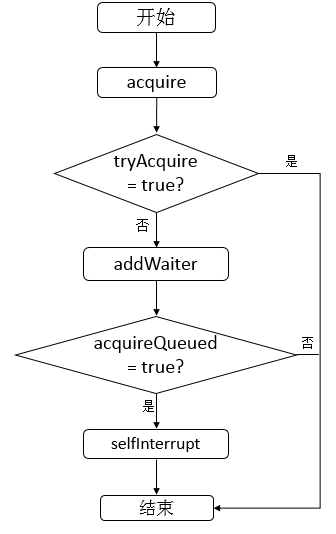

说明：

①
首先调用tryAcquire函数，调用此方法的线程会试图在独占模式下获取对象状态。此方法应该查询是否允许它在独占模式下获取对象状态，如果允许，则获取它。在AbstractQueuedSynchronizer源码中默认会抛出一个异常，即需要子类去重写此函数完成自己的逻辑。之后会进行分析。

② 若tryAcquire失败，则调用addWaiter函数，addWaiter函数完成的功能是将调用此方法的线程封装成为一个结点并放入Sync
queue。

③ 调用acquireQueued函数，此函数完成的功能是Sync queue中的结点不断尝试获取资源，若成功，则返回true，否则，返回false。

由于tryAcquire默认实现是抛出异常，所以此时，不进行分析，之后会结合一个例子进行分析。

首先分析addWaiter函数

    
    
    // 添加等待者
        private Node addWaiter(Node mode) {
            // 新生成一个结点，默认为独占模式
            Node node = new Node(Thread.currentThread(), mode);
            // Try the fast path of enq; backup to full enq on failure
            // 保存尾结点
            Node pred = tail;
            if (pred != null) { // 尾结点不为空，即已经被初始化
                // 将node结点的prev域连接到尾结点
                node.prev = pred; 
                if (compareAndSetTail(pred, node)) { // 比较pred是否为尾结点，是则将尾结点设置为node 
                    // 设置尾结点的next域为node
                    pred.next = node;
                    return node; // 返回新生成的结点
                }
            }
            enq(node); // 尾结点为空(即还没有被初始化过)，或者是compareAndSetTail操作失败，则入队列
            return node;
        }

说明：addWaiter函数使用快速添加的方式往sync queue尾部添加结点，如果sync
queue队列还没有初始化，则会使用enq插入队列中，enq方法源码如下

    
    
    // 入队列
        private Node enq(final Node node) {
            for (;;) { // 无限循环，确保结点能够成功入队列
                // 保存尾结点
                Node t = tail;
                if (t == null) { // 尾结点为空，即还没被初始化
                    if (compareAndSetHead(new Node())) // 头结点为空，并设置头结点为新生成的结点
                        tail = head; // 头结点与尾结点都指向同一个新生结点
                } else { // 尾结点不为空，即已经被初始化过
                    // 将node结点的prev域连接到尾结点
                    node.prev = t; 
                    if (compareAndSetTail(t, node)) { // 比较结点t是否为尾结点，若是则将尾结点设置为node
                        // 设置尾结点的next域为node
                        t.next = node; 
                        return t; // 返回尾结点
                    }
                }
            }
        }

说明：enq函数会使用无限循环来确保节点的成功插入。

现在，分析acquireQueue函数。其源码如下

    
    
    // sync队列中的结点在独占且忽略中断的模式下获取(资源)
        final boolean acquireQueued(final Node node, int arg) {
            // 标志
            boolean failed = true;
            try {
                // 中断标志
                boolean interrupted = false;
                for (;;) { // 无限循环
                    // 获取node节点的前驱结点
                    final Node p = node.predecessor(); 
                    if (p == head && tryAcquire(arg)) { // 前驱为头结点并且成功获得锁
                        setHead(node); // 设置头结点
                        p.next = null; // help GC
                        failed = false; // 设置标志
                        return interrupted; 
                    }
                    if (shouldParkAfterFailedAcquire(p, node) &&
                        parkAndCheckInterrupt())
                        interrupted = true;
                }
            } finally {
                if (failed)
                    cancelAcquire(node);
            }
        }

说明：首先获取当前节点的前驱节点，如果前驱节点是头结点并且能够获取(资源)，代表该当前节点能够占有锁，设置头结点为当前节点，返回。否则，调用shouldParkAfterFailedAcquire和parkAndCheckInterrupt函数，首先，我们看shouldParkAfterFailedAcquire函数，代码如下

    
    
    // 当获取(资源)失败后，检查并且更新结点状态
        private static boolean shouldParkAfterFailedAcquire(Node pred, Node node) {
            // 获取前驱结点的状态
            int ws = pred.waitStatus;
            if (ws == Node.SIGNAL) // 状态为SIGNAL，为-1
                /*
                 * This node has already set status asking a release
                 * to signal it, so it can safely park.
                 */
                // 可以进行park操作
                return true; 
            if (ws > 0) { // 表示状态为CANCELLED，为1
                /*
                 * Predecessor was cancelled. Skip over predecessors and
                 * indicate retry.
                 */
                do {
                    node.prev = pred = pred.prev;
                } while (pred.waitStatus > 0); // 找到pred结点前面最近的一个状态不为CANCELLED的结点
                // 赋值pred结点的next域
                pred.next = node; 
            } else { // 为PROPAGATE -3 或者是0 表示无状态,(为CONDITION -2时，表示此节点在condition queue中) 
                /*
                 * waitStatus must be 0 or PROPAGATE.  Indicate that we
                 * need a signal, but don"t park yet.  Caller will need to
                 * retry to make sure it cannot acquire before parking.
                 */
                // 比较并设置前驱结点的状态为SIGNAL
                compareAndSetWaitStatus(pred, ws, Node.SIGNAL); 
            }
            // 不能进行park操作
            return false;
        }

说明：只有当该节点的前驱结点的状态为SIGNAL时，才可以对该结点所封装的线程进行park操作。否则，将不能进行park操作。再看parkAndCheckInterrupt函数，源码如下

    
    
    // 进行park操作并且返回该线程是否被中断
        private final boolean parkAndCheckInterrupt() {
            // 在许可可用之前禁用当前线程，并且设置了blocker
            LockSupport.park(this);
            return Thread.interrupted(); // 当前线程是否已被中断，并清除中断标记位
        }

说明：parkAndCheckInterrupt函数里的逻辑是首先执行park操作，即禁用当前线程，然后返回该线程是否已经被中断。再看final块中的cancelAcquire函数，其源码如下

    
    
    // 取消继续获取(资源)
        private void cancelAcquire(Node node) {
            // Ignore if node doesn"t exist
            // node为空，返回
            if (node == null)
                return;
            // 设置node结点的thread为空
            node.thread = null;
    
            // Skip cancelled predecessors
            // 保存node的前驱结点
            Node pred = node.prev;
            while (pred.waitStatus > 0) // 找到node前驱结点中第一个状态小于0的结点，即不为CANCELLED状态的结点
                node.prev = pred = pred.prev;
    
            // predNext is the apparent node to unsplice. CASes below will
            // fail if not, in which case, we lost race vs another cancel
            // or signal, so no further action is necessary.
            // 获取pred结点的下一个结点
            Node predNext = pred.next;
    
            // Can use unconditional write instead of CAS here.
            // After this atomic step, other Nodes can skip past us.
            // Before, we are free of interference from other threads.
            // 设置node结点的状态为CANCELLED
            node.waitStatus = Node.CANCELLED;
    
            // If we are the tail, remove ourselves.
            if (node == tail && compareAndSetTail(node, pred)) { // node结点为尾结点，则设置尾结点为pred结点
                // 比较并设置pred结点的next节点为null
                compareAndSetNext(pred, predNext, null); 
            } else { // node结点不为尾结点，或者比较设置不成功
                // If successor needs signal, try to set pred"s next-link
                // so it will get one. Otherwise wake it up to propagate.
                int ws;
                if (pred != head &&
                    ((ws = pred.waitStatus) == Node.SIGNAL ||
                     (ws <= 0 && compareAndSetWaitStatus(pred, ws, Node.SIGNAL))) &&
                    pred.thread != null) { // （pred结点不为头结点，并且pred结点的状态为SIGNAL）或者 
                                        // pred结点状态小于等于0，并且比较并设置等待状态为SIGNAL成功，并且pred结点所封装的线程不为空
                    // 保存结点的后继
                    Node next = node.next;
                    if (next != null && next.waitStatus <= 0) // 后继不为空并且后继的状态小于等于0
                        compareAndSetNext(pred, predNext, next); // 比较并设置pred.next = next;
                } else {
                    unparkSuccessor(node); // 释放node的前一个结点
                }
    
                node.next = node; // help GC
            }
        }

说明：该函数完成的功能就是取消当前线程对资源的获取，即设置该结点的状态为CANCELLED，接着我们再看unparkSuccessor函数，源码如下

    
    
    // 释放后继结点
        private void unparkSuccessor(Node node) {
            /*
             * If status is negative (i.e., possibly needing signal) try
             * to clear in anticipation of signalling.  It is OK if this
             * fails or if status is changed by waiting thread.
             */
            // 获取node结点的等待状态
            int ws = node.waitStatus;
            if (ws < 0) // 状态值小于0，为SIGNAL -1 或 CONDITION -2 或 PROPAGATE -3
                // 比较并且设置结点等待状态，设置为0
                compareAndSetWaitStatus(node, ws, 0);
    
            /*
             * Thread to unpark is held in successor, which is normally
             * just the next node.  But if cancelled or apparently null,
             * traverse backwards from tail to find the actual
             * non-cancelled successor.
             */
            // 获取node节点的下一个结点
            Node s = node.next;
            if (s == null || s.waitStatus > 0) { // 下一个结点为空或者下一个节点的等待状态大于0，即为CANCELLED
                // s赋值为空
                s = null; 
                // 从尾结点开始从后往前开始遍历
                for (Node t = tail; t != null && t != node; t = t.prev)
                    if (t.waitStatus <= 0) // 找到等待状态小于等于0的结点，找到最前的状态小于等于0的结点
                        // 保存结点
                        s = t;
            }
            if (s != null) // 该结点不为为空，释放许可
                LockSupport.unpark(s.thread);
        }

说明：该函数的作用就是为了释放node节点的后继结点。

对于cancelAcquire与unparkSuccessor函数，如下示意图可以清晰的表示。

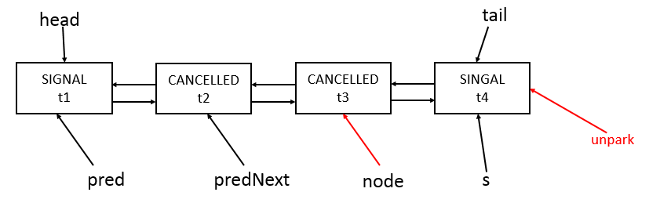

说明：其中node为参数，在执行完cancelAcquire函数后的效果就是unpark了s结点所包含的t4线程。

现在，再来看acquireQueued函数的整个的逻辑。逻辑如下

① 判断结点的前驱是否为head并且是否成功获取(资源)。

② 若步骤①均满足，则设置结点为head，之后会判断是否finally模块，然后返回。

③
若步骤①不满足，则判断是否需要park当前线程，是否需要park当前线程的逻辑是判断结点的前驱结点的状态是否为SIGNAL，若是，则park当前结点，否则，不进行park操作。

④ 若park了当前线程，之后某个线程对本线程unpark后，并且本线程也获得机会运行。那么，将会继续进行步骤①的判断。

2\. release

以独占模式释放对象，其源码如下

    
    
    public final boolean release(int arg) {
            if (tryRelease(arg)) { // 释放成功
                // 保存头结点
                Node h = head; 
                if (h != null && h.waitStatus != 0) // 头结点不为空并且头结点状态不为0
                    unparkSuccessor(h); //释放头结点的后继结点
                return true;
            }
            return false;
        }

说明：其中，tryRelease的默认实现是抛出异常，需要具体的子类实现，如果tryRelease成功，那么如果头结点不为空并且头结点的状态不为0，则释放头结点的后继结点，unparkSuccessor函数已经分析过，不再累赘。

对于其他函数我们也可以分析，与前面分析的函数大同小异，所以，不再累赘。

**四、示例分析**

1\. 示例一

借助下面示例来分析AbstractQueuedSyncrhonizer内部的工作机制。示例源码如下

    
    
     package com.hust.grid.leesf.abstractqueuedsynchronizer;
    
    import java.util.concurrent.locks.Lock;
    import java.util.concurrent.locks.ReentrantLock;
    
    class MyThread extends Thread {
        private Lock lock;
        public MyThread(String name, Lock lock) {
            super(name);
            this.lock = lock;
        }
        
        public void run () {
            lock.lock();
            try {
                System.out.println(Thread.currentThread() + " running");
            } finally {
                lock.unlock();
            }
        }
    }
    public class AbstractQueuedSynchonizerDemo {
        public static void main(String[] args) {
            Lock lock = new ReentrantLock();
            
            MyThread t1 = new MyThread("t1", lock);
            MyThread t2 = new MyThread("t2", lock);
            t1.start();
            t2.start();    
        }
    }

运行结果（可能的一种）：

    
    
    Thread[t1,5,main] running  
    Thread[t2,5,main] running

结果分析：从示例可知，线程t1与t2共用了一把锁，即同一个lock。可能会存在如下一种时序。

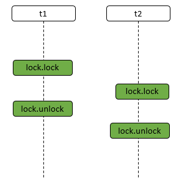

说明：首先线程t1先执行lock.lock操作，然后t2执行lock.lock操作，然后t1执行lock.unlock操作，最后t2执行lock.unlock操作。基于这样的时序，分析AbstractQueuedSynchronizer内部的工作机制。

① t1线程调用lock.lock函数，其函数调用顺序如下，只给出了主要的函数调用。

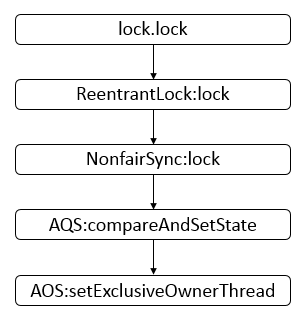

说明：其中，前面的部分表示哪个类，后面是具体的类中的哪个方法，AQS表示AbstractQueuedSynchronizer类，AOS表示AbstractOwnableSynchronizer类。

② t2线程调用lock.lock函数，其函数调用顺序如下，只给出了主要的函数调用。

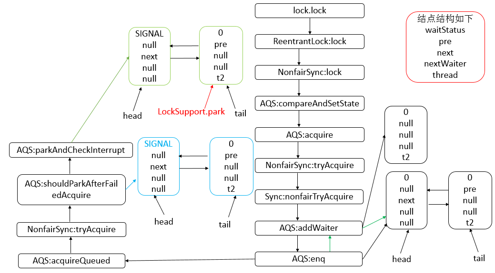
说明：经过一系列的函数调用，最后达到的状态是禁用t2线程，因为调用了LockSupport.lock。

③ t1线程调用lock.unlock，其函数调用顺序如下，只给出了主要的函数调用。

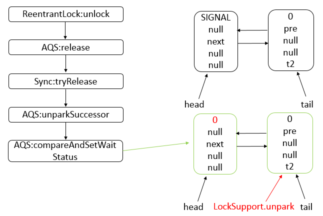

说明：t1线程中调用lock.unlock后，经过一系列的调用，最终的状态是释放了许可，因为调用了LockSupport.unpark。这时，t2线程就可以继续运行了。此时，会继续恢复t2线程运行环境，继续执行LockSupport.park后面的语句，即进一步调用如下。

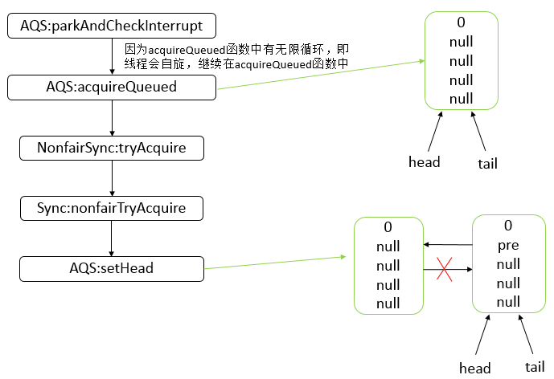

说明：在上一步调用了LockSupport.unpark后，t2线程恢复运行，则运行parkAndCheckInterrupt，之后，继续运行acquireQueued函数，最后达到的状态是头结点head与尾结点tail均指向了t2线程所在的结点，并且之前的头结点已经从sync队列中断开了。

④ t2线程调用lock.unlock，其函数调用顺序如下，只给出了主要的函数调用。

说明：t2线程执行lock.unlock后，最终达到的状态还是与之前的状态一样。

2\. 示例二

下面我们结合Condition实现生产者与消费者，来进一步分析AbstractQueuedSynchronizer的内部工作机制。

Depot（仓库）类

    
    
    package com.hust.grid.leesf.reentrantLock;
    
    import java.util.concurrent.locks.Condition;
    import java.util.concurrent.locks.Lock;
    import java.util.concurrent.locks.ReentrantLock;
    
    public class Depot {
        private int size;
        private int capacity;
        private Lock lock;
        private Condition fullCondition;
        private Condition emptyCondition;
        
        public Depot(int capacity) {
            this.capacity = capacity;    
            lock = new ReentrantLock();
            fullCondition = lock.newCondition();
            emptyCondition = lock.newCondition();
        }
        
        public void produce(int no) {
            lock.lock();
            int left = no;
            try {
                while (left > 0) {
                    while (size >= capacity)  {
                        System.out.println(Thread.currentThread() + " before await");
                        fullCondition.await();
                        System.out.println(Thread.currentThread() + " after await");
                    }
                    int inc = (left + size) > capacity ? (capacity - size) : left;
                    left -= inc;
                    size += inc;
                    System.out.println("produce = " + inc + ", size = " + size);
                    emptyCondition.signal();
                }
            } catch (InterruptedException e) {
                e.printStackTrace();
            } finally {
                lock.unlock();
            }
        }
        
        public void consume(int no) {
            lock.lock();
            int left = no;
            try {            
                while (left > 0) {
                    while (size <= 0) {
                        System.out.println(Thread.currentThread() + " before await");
                        emptyCondition.await();
                        System.out.println(Thread.currentThread() + " after await");
                    }
                    int dec = (size - left) > 0 ? left : size;
                    left -= dec;
                    size -= dec;
                    System.out.println("consume = " + dec + ", size = " + size);
                    fullCondition.signal();
                }
            } catch (InterruptedException e) {
                e.printStackTrace();
            } finally {
                lock.unlock();
            }
        }
    }

测试类

    
    
    package com.hust.grid.leesf.reentrantLock;
    
    
    class Consumer {
        private Depot depot;
        public Consumer(Depot depot) {
            this.depot = depot;
        }
        
        public void consume(int no) {
            new Thread(new Runnable() {
                @Override
                public void run() {
                    depot.consume(no);
                }
            }, no + " consume thread").start();
        }
    }
    
    class Producer {
        private Depot depot;
        public Producer(Depot depot) {
            this.depot = depot;
        }
        
        public void produce(int no) {
            new Thread(new Runnable() {
                
                @Override
                public void run() {
                    depot.produce(no);
                }
            }, no + " produce thread").start();
        }
    }
    
    public class ReentrantLockDemo {
        public static void main(String[] args) throws InterruptedException {
            Depot depot = new Depot(500);
            new Producer(depot).produce(500);
            new Producer(depot).produce(200);
            new Consumer(depot).consume(500);
            new Consumer(depot).consume(200);
        }
    }

运行结果（可能的一种）：

    
    
    produce = 500, size = 500
    Thread[200 produce thread,5,main] before await
    consume = 500, size = 0
    Thread[200 consume thread,5,main] before await
    Thread[200 produce thread,5,main] after await
    produce = 200, size = 200
    Thread[200 consume thread,5,main] after await
    consume = 200, size = 0

说明：根据结果，我们猜测一种可能的时序如下

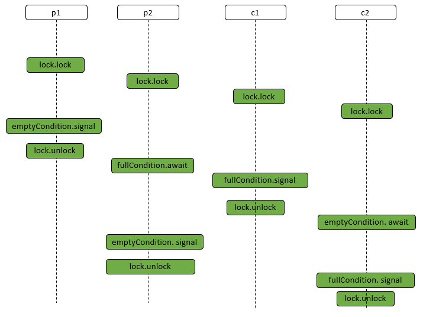

说明：p1代表produce 500的那个线程，p2代表produce 200的那个线程，c1代表consume 500的那个线程，c2代表consume
200的那个线程。

1\. p1线程调用lock.lock，获得锁，继续运行，函数调用顺序在前面已经给出。

2\. p2线程调用lock.lock，由前面的分析可得到如下的最终状态。

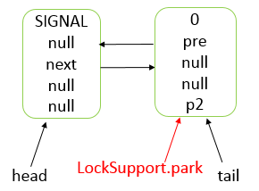

说明：p2线程调用lock.lock后，会禁止p2线程的继续运行，因为执行了LockSupport.park操作。

3\. c1线程调用lock.lock，由前面的分析得到如下的最终状态。

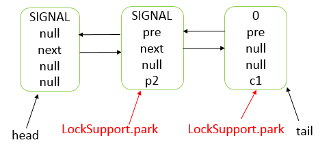

说明：最终c1线程会在sync queue队列的尾部，并且其结点的前驱结点（包含p2的结点）的waitStatus变为了SIGNAL。

4\. c2线程调用lock.lock，由前面的分析得到如下的最终状态。

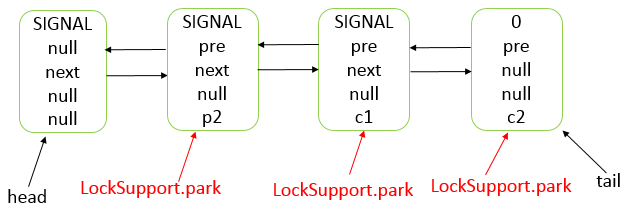

说明：最终c1线程会在sync queue队列的尾部，并且其结点的前驱结点（包含c1的结点）的waitStatus变为了SIGNAL。

5\. p1线程执行emptyCondition.signal，其函数调用顺序如下，只给出了主要的函数调用。

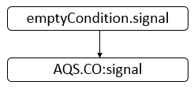

说明：AQS.CO表示AbstractQueuedSynchronizer.ConditionObject类。此时调用signal方法不会产生任何其他效果。

6\. p1线程执行lock.unlock，根据前面的分析可知，最终的状态如下。

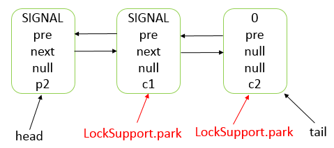

说明：此时，p2线程所在的结点为头结点，并且其他两个线程（c1、c2）依旧被禁止，所以，此时p2线程继续运行，执行用户逻辑。

7\. p2线程执行fullCondition.await，其函数调用顺序如下，只给出了主要的函数调用。

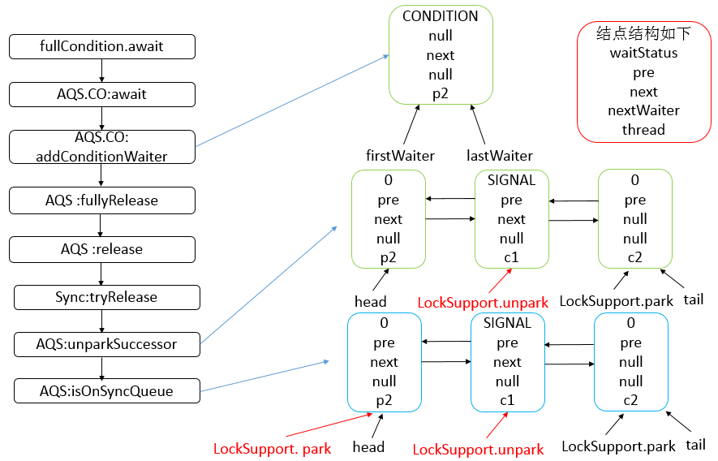

说明：最终到达的状态是新生成了一个结点，包含了p2线程，此结点在condition queue中；并且sync
queue中p2线程被禁止了，因为在执行了LockSupport.park操作。从函数一些调用可知，在await操作中线程会释放锁资源，供其他线程获取。同时，head结点后继结点的包含的线程的许可被释放了，故其可以继续运行。由于此时，只有c1线程可以运行，故运行c1。

8\.
继续运行c1线程，c1线程由于之前被park了，所以此时恢复，继续之前的步骤，即还是执行前面提到的acquireQueued函数，之后，c1判断自己的前驱结点为head，并且可以获取锁资源，最终到达的状态如下。

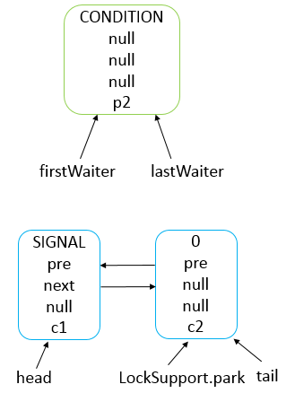

说明：其中，head设置为包含c1线程的结点，c1继续运行。

9\. c1线程执行fullCondtion.signal，其函数调用顺序如下，只给出了主要的函数调用。

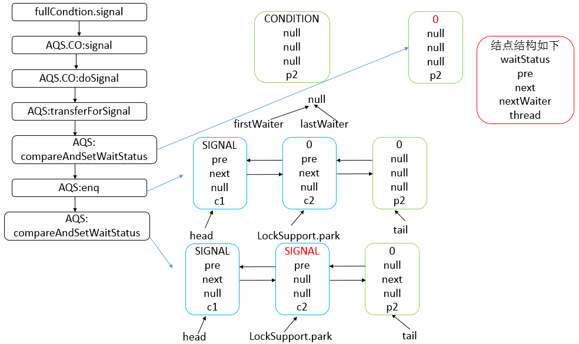

说明：signal函数达到的最终结果是将包含p2线程的结点从condition queue中转移到sync queue中，之后condition
queue为null，之前的尾结点的状态变为SIGNAL。

10\. c1线程执行lock.unlock操作，根据之前的分析，经历的状态变化如下。

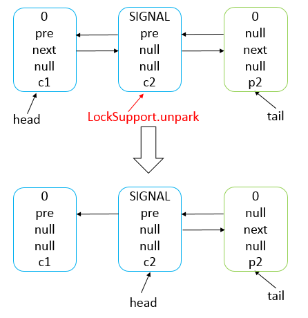

说明：最终c2线程会获取锁资源，继续运行用户逻辑。

11\. c2线程执行emptyCondition.await，由前面的第七步分析，可知最终的状态如下。

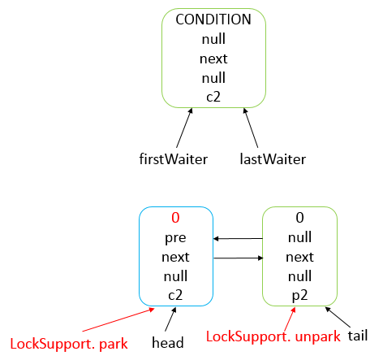

说明：await操作将会生成一个结点放入condition queue中与之前的一个condition
queue是不相同的，并且unpark头结点后面的结点，即包含线程p2的结点。

12\.
p2线程被unpark，故可以继续运行，经过CPU调度后，p2继续运行，之后p2线程在AQS:await函数中被park，继续AQS.CO:await函数的运行，其函数调用顺序如下，只给出了主要的函数调用。

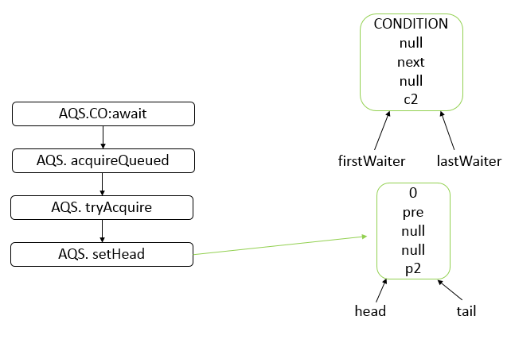

13\. p2继续运行，执行emptyCondition.signal，根据第九步分析可知，最终到达的状态如下。

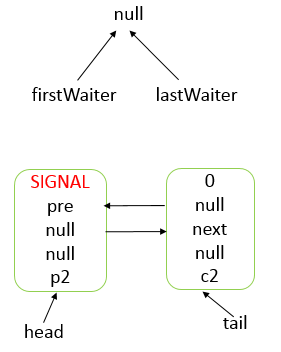

说明：最终，将condition queue中的结点转移到sync queue中，并添加至尾部，condition
queue会为空，并且将head的状态设置为SIGNAL。

14\. p2线程执行lock.unlock操作，根据前面的分析可知，最后的到达的状态如下。

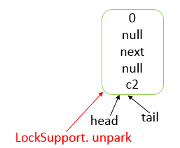

说明：unlock操作会释放c2线程的许可，并且将头结点设置为c2线程所在的结点。

15\. c2线程继续运行，执行fullCondition. signal，由于此时fullCondition的condition
queue已经不存在任何结点了，故其不会产生作用。

16\.
c2执行lock.unlock，由于c2是sync队列中最后一个结点，故其不会再调用unparkSuccessor了，直接返回true。即整个流程就完成了。

**五、总结**

对于AbstractQueuedSynchronizer的分析，最核心的就是sync queue的分析。

① 每一个结点都是由前一个结点唤醒

② 当结点发现前驱结点是head并且尝试获取成功，则会轮到该线程运行。

③ condition queue中的结点向sync queue中转移是通过signal操作完成的。

④ 当结点的状态为SIGNAL时，表示后面的结点需要运行。

当然，此次分析没有涉及到中断操作，如果涉及到中断操作，又会复杂得多，以后遇到这种情况，我们再进行详细分析，AbstractQueuedSynchronizer类的设计令人叹为观止，以后有机会还会进行分析。也谢谢各位园友的观看~

最后给出两篇参考链接

http://ifeve.com/introduce-abstractqueuedsynchronizer/

http://blog.csdn.net/chen77716/article/details/6641477

