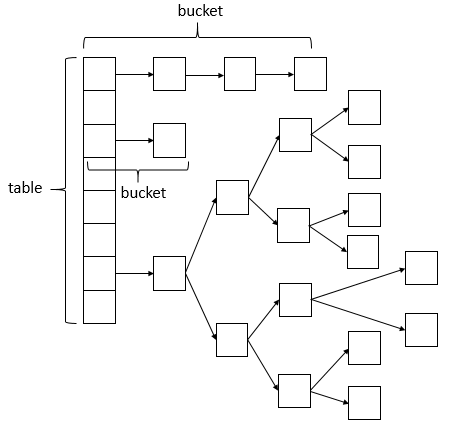
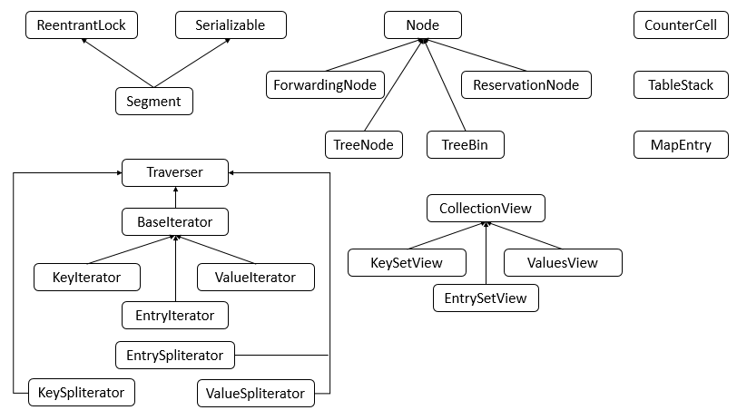
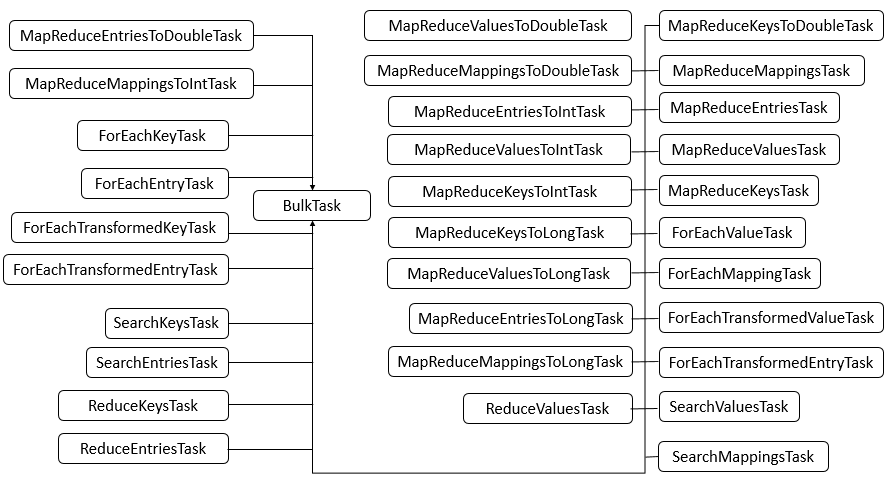

**一、前言**

最近几天忙着做点别的东西，今天终于有时间分析源码了，看源码感觉很爽，并且发现ConcurrentHashMap在JDK1.8版本与之前的版本在并发控制上存在很大的差别，很有必要进行认真的分析，下面进行源码分析。

**二、ConcurrentHashMap数据结构**

之前已经提及过，ConcurrentHashMap相比HashMap而言，是多线程安全的，其底层数据与HashMap的数据结构相同，数据结构如下

说明：ConcurrentHashMap的数据结构（数组+链表+红黑树），桶中的结构可能是链表，也可能是红黑树，红黑树是为了提高查找效率。

**三、ConcurrentHashMap源码分析**

3.1 类的继承关系

    
    
    public class ConcurrentHashMap<K,V> extends AbstractMap<K,V>
        implements ConcurrentMap<K,V>, Serializable {}

说明：ConcurrentHashMap继承了AbstractMap抽象类，该抽象类定义了一些基本操作，同时，也实现了ConcurrentMap接口，ConcurrentMap接口也定义了一系列操作，实现了Serializable接口表示ConcurrentHashMap可以被序列化。

3.2 类的内部类

ConcurrentHashMap包含了很多内部类，其中主要的内部类框架图如下图所示

说明：可以看到，ConcurrentHashMap的内部类非常的庞大，第二个图是在JDK1.8下增加的类，下面对其中主要的内部类进行分析和讲解。

1\. Node类

Node类主要用于存储具体键值对，其子类有ForwardingNode、ReservationNode、TreeNode和TreeBin四个子类。四个子类具体的代码在之后的具体例子中进行分析讲解。

2\. Traverser类

Traverser类主要用于遍历操作，其子类有BaseIterator、KeySpliterator、ValueSpliterator、EntrySpliterator四个类，BaseIterator用于遍历操作。KeySplitertor、ValueSpliterator、EntrySpliterator则用于键、值、键值对的划分。

3\. CollectionView类

CollectionView抽象类主要定义了视图操作，其子类KeySetView、ValueSetView、EntrySetView分别表示键视图、值视图、键值对视图。对视图均可以进行操作。

4\. Segment类

Segment类在JDK1.8中与之前的版本的JDK作用存在很大的差别，JDK1.8下，其在普通的ConcurrentHashMap操作中已经没有失效，其在序列化与反序列化的时候会发挥作用。

5\. CounterCell

CounterCell类主要用于对baseCount的计数。

3.3 类的属性

    
    
    public class ConcurrentHashMap<K,V> extends AbstractMap<K,V>
        implements ConcurrentMap<K,V>, Serializable {
        private static final long serialVersionUID = 7249069246763182397L;
        // 表的最大容量
        private static final int MAXIMUM_CAPACITY = 1 << 30;
        // 默认表的大小
        private static final int DEFAULT_CAPACITY = 16;
        // 最大数组大小
        static final int MAX_ARRAY_SIZE = Integer.MAX_VALUE - 8;
        // 默认并发数
        private static final int DEFAULT_CONCURRENCY_LEVEL = 16;
        // 装载因子
        private static final float LOAD_FACTOR = 0.75f;
        // 转化为红黑树的阈值
        static final int TREEIFY_THRESHOLD = 8;
        // 由红黑树转化为链表的阈值
        static final int UNTREEIFY_THRESHOLD = 6;
        // 转化为红黑树的表的最小容量
        static final int MIN_TREEIFY_CAPACITY = 64;
        // 每次进行转移的最小值
        private static final int MIN_TRANSFER_STRIDE = 16;
        // 生成sizeCtl所使用的bit位数
        private static int RESIZE_STAMP_BITS = 16;
        // 进行扩容所允许的最大线程数
        private static final int MAX_RESIZERS = (1 << (32 - RESIZE_STAMP_BITS)) - 1;
        // 记录sizeCtl中的大小所需要进行的偏移位数
        private static final int RESIZE_STAMP_SHIFT = 32 - RESIZE_STAMP_BITS;    
        // 一系列的标识
        static final int MOVED     = -1; // hash for forwarding nodes
        static final int TREEBIN   = -2; // hash for roots of trees
        static final int RESERVED  = -3; // hash for transient reservations
        static final int HASH_BITS = 0x7fffffff; // usable bits of normal node hash
        // 
        /** Number of CPUS, to place bounds on some sizings */
        // 获取可用的CPU个数
        static final int NCPU = Runtime.getRuntime().availableProcessors();
        // 
        /** For serialization compatibility. */
        // 进行序列化的属性
        private static final ObjectStreamField[] serialPersistentFields = {
            new ObjectStreamField("segments", Segment[].class),
            new ObjectStreamField("segmentMask", Integer.TYPE),
            new ObjectStreamField("segmentShift", Integer.TYPE)
        };
        
        // 表
        transient volatile Node<K,V>[] table;
        // 下一个表
        private transient volatile Node<K,V>[] nextTable;
        //
        /**
         * Base counter value, used mainly when there is no contention,
         * but also as a fallback during table initialization
         * races. Updated via CAS.
         */
        // 基本计数
        private transient volatile long baseCount;
        //
        /**
         * Table initialization and resizing control.  When negative, the
         * table is being initialized or resized: -1 for initialization,
         * else -(1 + the number of active resizing threads).  Otherwise,
         * when table is null, holds the initial table size to use upon
         * creation, or 0 for default. After initialization, holds the
         * next element count value upon which to resize the table.
         */
        // 对表初始化和扩容控制
        private transient volatile int sizeCtl;
        
        /**
         * The next table index (plus one) to split while resizing.
         */
        // 扩容下另一个表的索引
        private transient volatile int transferIndex;
    
        /**
         * Spinlock (locked via CAS) used when resizing and/or creating CounterCells.
         */
        // 旋转锁
        private transient volatile int cellsBusy;
    
        /**
         * Table of counter cells. When non-null, size is a power of 2.
         */
        // counterCell表
        private transient volatile CounterCell[] counterCells;
    
        // views
        // 视图
        private transient KeySetView<K,V> keySet;
        private transient ValuesView<K,V> values;
        private transient EntrySetView<K,V> entrySet;
        
        // Unsafe mechanics
        private static final sun.misc.Unsafe U;
        private static final long SIZECTL;
        private static final long TRANSFERINDEX;
        private static final long BASECOUNT;
        private static final long CELLSBUSY;
        private static final long CELLVALUE;
        private static final long ABASE;
        private static final int ASHIFT;
    
        static {
            try {
                U = sun.misc.Unsafe.getUnsafe();
                Class<?> k = ConcurrentHashMap.class;
                SIZECTL = U.objectFieldOffset
                    (k.getDeclaredField("sizeCtl"));
                TRANSFERINDEX = U.objectFieldOffset
                    (k.getDeclaredField("transferIndex"));
                BASECOUNT = U.objectFieldOffset
                    (k.getDeclaredField("baseCount"));
                CELLSBUSY = U.objectFieldOffset
                    (k.getDeclaredField("cellsBusy"));
                Class<?> ck = CounterCell.class;
                CELLVALUE = U.objectFieldOffset
                    (ck.getDeclaredField("value"));
                Class<?> ak = Node[].class;
                ABASE = U.arrayBaseOffset(ak);
                int scale = U.arrayIndexScale(ak);
                if ((scale & (scale - 1)) != 0)
                    throw new Error("data type scale not a power of two");
                ASHIFT = 31 - Integer.numberOfLeadingZeros(scale);
            } catch (Exception e) {
                throw new Error(e);
            }
        }
    }

View Code

说明：ConcurrentHashMap的属性很多，其中不少属性在HashMap中就已经介绍过，而对于ConcurrentHashMap而言，添加了Unsafe实例，主要用于反射获取对象相应的字段。

3.4 类的构造函数

1\. ConcurrentHashMap()型构造函数

    
    
    public ConcurrentHashMap() {
        }

View Code

说明：该构造函数用于创建一个带有默认初始容量 (16)、加载因子 (0.75) 和 concurrencyLevel (16) 的新的空映射。

2\. ConcurrentHashMap(int)型构造函数

    
    
        public ConcurrentHashMap(int initialCapacity) {
            if (initialCapacity < 0) // 初始容量小于0，抛出异常
                throw new IllegalArgumentException();
            int cap = ((initialCapacity >= (MAXIMUM_CAPACITY >>> 1)) ?
                       MAXIMUM_CAPACITY :
                       tableSizeFor(initialCapacity + (initialCapacity >>> 1) + 1)); // 找到最接近该容量的2的幂次方数
            // 初始化
            this.sizeCtl = cap;
        }

View Code

说明：该构造函数用于创建一个带有指定初始容量、默认加载因子 (0.75) 和 concurrencyLevel (16) 的新的空映射。

3\. ConcurrentHashMap(Map<? extends K, ? extends V>)型构造函数

    
    
        public ConcurrentHashMap(Map<? extends K, ? extends V> m) {
            this.sizeCtl = DEFAULT_CAPACITY;
            // 将集合m的元素全部放入
            putAll(m);
        }

View Code

说明：该构造函数用于构造一个与给定映射具有相同映射关系的新映射。

4\. ConcurrentHashMap(int, float)型构造函数

    
    
        public ConcurrentHashMap(int initialCapacity, float loadFactor) {
            this(initialCapacity, loadFactor, 1);
        }

View Code

说明：该构造函数用于创建一个带有指定初始容量、加载因子和默认 concurrencyLevel (1) 的新的空映射。

5\. ConcurrentHashMap(int, float, int)型构造函数

    
    
        public ConcurrentHashMap(int initialCapacity,
                                 float loadFactor, int concurrencyLevel) {
            if (!(loadFactor > 0.0f) || initialCapacity < 0 || concurrencyLevel <= 0) // 合法性判断
                throw new IllegalArgumentException();
            if (initialCapacity < concurrencyLevel)   // Use at least as many bins
                initialCapacity = concurrencyLevel;   // as estimated threads
            long size = (long)(1.0 + (long)initialCapacity / loadFactor);
            int cap = (size >= (long)MAXIMUM_CAPACITY) ?
                MAXIMUM_CAPACITY : tableSizeFor((int)size);
            this.sizeCtl = cap;
        }

View Code

说明：该构造函数用于创建一个带有指定初始容量、加载因子和并发级别的新的空映射。

对于构造函数而言，会根据输入的initialCapacity的大小来确定一个最小的且大于等于initialCapacity大小的2的n次幂，如initialCapacity为15，则sizeCtl为16，若initialCapacity为16，则sizeCtl为16。若initialCapacity大小超过了允许的最大值，则sizeCtl为最大值。值得注意的是，构造函数中的concurrencyLevel参数已经在JDK1.8中的意义发生了很大的变化，其并不代表所允许的并发数，其只是用来确定sizeCtl大小，在JDK1.8中的并发控制都是针对具体的桶而言，即有多少个桶就可以允许多少个并发数。

3.5 核心函数分析

1\. putVal函数

    
    
        final V putVal(K key, V value, boolean onlyIfAbsent) {
            if (key == null || value == null) throw new NullPointerException(); // 键或值为空，抛出异常
            // 键的hash值经过计算获得hash值
            int hash = spread(key.hashCode());
            int binCount = 0;
            for (Node<K,V>[] tab = table;;) { // 无限循环
                Node<K,V> f; int n, i, fh;
                if (tab == null || (n = tab.length) == 0) // 表为空或者表的长度为0
                    // 初始化表
                    tab = initTable();
                else if ((f = tabAt(tab, i = (n - 1) & hash)) == null) { // 表不为空并且表的长度大于0，并且该桶不为空
                    if (casTabAt(tab, i, null,
                                 new Node<K,V>(hash, key, value, null))) // 比较并且交换值，如tab的第i项为空则用新生成的node替换
                        break;                   // no lock when adding to empty bin
                }
                else if ((fh = f.hash) == MOVED) // 该结点的hash值为MOVED
                    // 进行结点的转移（在扩容的过程中）
                    tab = helpTransfer(tab, f);
                else {
                    V oldVal = null;
                    synchronized (f) { // 加锁同步
                        if (tabAt(tab, i) == f) { // 找到table表下标为i的节点
                            if (fh >= 0) { // 该table表中该结点的hash值大于0
                                // binCount赋值为1
                                binCount = 1;
                                for (Node<K,V> e = f;; ++binCount) { // 无限循环
                                    K ek;
                                    if (e.hash == hash &&
                                        ((ek = e.key) == key ||
                                         (ek != null && key.equals(ek)))) { // 结点的hash值相等并且key也相等
                                        // 保存该结点的val值
                                        oldVal = e.val;
                                        if (!onlyIfAbsent) // 进行判断
                                            // 将指定的value保存至结点，即进行了结点值的更新
                                            e.val = value;
                                        break;
                                    }
                                    // 保存当前结点
                                    Node<K,V> pred = e;
                                    if ((e = e.next) == null) { // 当前结点的下一个结点为空，即为最后一个结点
                                        // 新生一个结点并且赋值给next域
                                        pred.next = new Node<K,V>(hash, key,
                                                                  value, null);
                                        // 退出循环
                                        break;
                                    }
                                }
                            }
                            else if (f instanceof TreeBin) { // 结点为红黑树结点类型
                                Node<K,V> p;
                                // binCount赋值为2
                                binCount = 2;
                                if ((p = ((TreeBin<K,V>)f).putTreeVal(hash, key,
                                                               value)) != null) { // 将hash、key、value放入红黑树
                                    // 保存结点的val
                                    oldVal = p.val;
                                    if (!onlyIfAbsent) // 判断
                                        // 赋值结点value值
                                        p.val = value;
                                }
                            }
                        }
                    }
                    if (binCount != 0) { // binCount不为0
                        if (binCount >= TREEIFY_THRESHOLD) // 如果binCount大于等于转化为红黑树的阈值
                            // 进行转化
                            treeifyBin(tab, i);
                        if (oldVal != null) // 旧值不为空
                            // 返回旧值
                            return oldVal;
                        break;
                    }
                }
            }
            // 增加binCount的数量
            addCount(1L, binCount);
            return null;
        }

View Code

说明：put函数底层调用了putVal进行数据的插入，对于putVal函数的流程大体如下。

① 判断存储的key、value是否为空，若为空，则抛出异常，否则，进入步骤②

② 计算key的hash值，随后进入无限循环，该无限循环可以确保成功插入数据，若table表为空或者长度为0，则初始化table表，否则，进入步骤③

③
根据key的hash值取出table表中的结点元素，若取出的结点为空（该桶为空），则使用CAS将key、value、hash值生成的结点放入桶中。否则，进入步骤④

④ 若该结点的的hash值为MOVED，则对该桶中的结点进行转移，否则，进入步骤⑤

⑤
对桶中的第一个结点（即table表中的结点）进行加锁，对该桶进行遍历，桶中的结点的hash值与key值与给定的hash值和key值相等，则根据标识选择是否进行更新操作（用给定的value值替换该结点的value值），若遍历完桶仍没有找到hash值与key值和指定的hash值与key值相等的结点，则直接新生一个结点并赋值为之前最后一个结点的下一个结点。进入步骤⑥

⑥ 若binCount值达到红黑树转化的阈值，则将桶中的结构转化为红黑树存储，最后，增加binCount的值。

在putVal函数中会涉及到如下几个函数：initTable、tabAt、casTabAt、helpTransfer、putTreeVal、treeifyBin、addCount函数。下面对其中涉及到的函数进行分析。

其中 initTable函数源码如下

    
    
        private final Node<K,V>[] initTable() {
            Node<K,V>[] tab; int sc;
            while ((tab = table) == null || tab.length == 0) { // 无限循环
                if ((sc = sizeCtl) < 0) // sizeCtl小于0，则进行线程让步等待
                    Thread.yield(); // lost initialization race; just spin
                else if (U.compareAndSwapInt(this, SIZECTL, sc, -1)) { // 比较sizeCtl的值与sc是否相等，相等则用-1替换
                    try {
                        if ((tab = table) == null || tab.length == 0) { // table表为空或者大小为0
                            // sc的值是否大于0，若是，则n为sc，否则，n为默认初始容量
                            int n = (sc > 0) ? sc : DEFAULT_CAPACITY;
                            @SuppressWarnings("unchecked")
                            // 新生结点数组
                            Node<K,V>[] nt = (Node<K,V>[])new Node<?,?>[n];
                            // 赋值给table
                            table = tab = nt;
                            // sc为n * 3/4
                            sc = n - (n >>> 2);
                        }
                    } finally {
                        // 设置sizeCtl的值
                        sizeCtl = sc;
                    }
                    break;
                }
            }
            // 返回table表
            return tab;
        }

View Code

说明：对于table的大小，会根据sizeCtl的值进行设置，如果没有设置szieCtl的值，那么默认生成的table大小为16，否则，会根据sizeCtl的大小设置table大小。

tabAt函数源码如下

    
    
    static final <K,V> Node<K,V> tabAt(Node<K,V>[] tab, int i) {
            return (Node<K,V>)U.getObjectVolatile(tab, ((long)i << ASHIFT) + ABASE);
        }

View Code

说明：此函数返回table数组中下标为i的结点，可以看到是通过Unsafe对象通过反射获取的，getObjectVolatile的第二项参数为下标为i的偏移地址。

casTabAt函数源码如下

    
    
        static final <K,V> boolean casTabAt(Node<K,V>[] tab, int i,
                                            Node<K,V> c, Node<K,V> v) {
            return U.compareAndSwapObject(tab, ((long)i << ASHIFT) + ABASE, c, v);
        }

View Code

说明：此函数用于比较table数组下标为i的结点是否为c，若为c，则用v交换操作。否则，不进行交换操作。

helpTransfer函数源码如下

    
    
        final Node<K,V>[] helpTransfer(Node<K,V>[] tab, Node<K,V> f) {
            Node<K,V>[] nextTab; int sc;
            if (tab != null && (f instanceof ForwardingNode) &&
                (nextTab = ((ForwardingNode<K,V>)f).nextTable) != null) { // table表不为空并且结点类型使ForwardingNode类型，并且结点的nextTable不为空
                int rs = resizeStamp(tab.length);
                while (nextTab == nextTable && table == tab &&
                       (sc = sizeCtl) < 0) { // 条件判断
                    if ((sc >>> RESIZE_STAMP_SHIFT) != rs || sc == rs + 1 ||
                        sc == rs + MAX_RESIZERS || transferIndex <= 0) // 
                        break;
                    if (U.compareAndSwapInt(this, SIZECTL, sc, sc + 1)) { // 比较并交换
                        // 将table的结点转移到nextTab中
                        transfer(tab, nextTab);
                        break;
                    }
                }
                return nextTab;
            }
            return table;
        }

View Code

说明：此函数用于在扩容时将table表中的结点转移到nextTable中。

putTreeVal函数源码如下

    
    
            final TreeNode<K,V> putTreeVal(int h, K k, V v) {
                Class<?> kc = null;
                boolean searched = false;
                for (TreeNode<K,V> p = root;;) {
                    int dir, ph; K pk;
                    if (p == null) {
                        first = root = new TreeNode<K,V>(h, k, v, null, null);
                        break;
                    }
                    else if ((ph = p.hash) > h)
                        dir = -1;
                    else if (ph < h)
                        dir = 1;
                    else if ((pk = p.key) == k || (pk != null && k.equals(pk)))
                        return p;
                    else if ((kc == null &&
                              (kc = comparableClassFor(k)) == null) ||
                             (dir = compareComparables(kc, k, pk)) == 0) {
                        if (!searched) {
                            TreeNode<K,V> q, ch;
                            searched = true;
                            if (((ch = p.left) != null &&
                                 (q = ch.findTreeNode(h, k, kc)) != null) ||
                                ((ch = p.right) != null &&
                                 (q = ch.findTreeNode(h, k, kc)) != null))
                                return q;
                        }
                        dir = tieBreakOrder(k, pk);
                    }
    
                    TreeNode<K,V> xp = p;
                    if ((p = (dir <= 0) ? p.left : p.right) == null) {
                        TreeNode<K,V> x, f = first;
                        first = x = new TreeNode<K,V>(h, k, v, f, xp);
                        if (f != null)
                            f.prev = x;
                        if (dir <= 0)
                            xp.left = x;
                        else
                            xp.right = x;
                        if (!xp.red)
                            x.red = true;
                        else {
                            lockRoot();
                            try {
                                root = balanceInsertion(root, x);
                            } finally {
                                unlockRoot();
                            }
                        }
                        break;
                    }
                }
                assert checkInvariants(root);
                return null;
            }

View Code

说明：此函数用于将指定的hash、key、value值添加到红黑树中，若已经添加了，则返回null，否则返回该结点。

treeifyBin函数源码如下

    
    
        private final void treeifyBin(Node<K,V>[] tab, int index) {
            Node<K,V> b; int n, sc;
            if (tab != null) { // 表不为空
                if ((n = tab.length) < MIN_TREEIFY_CAPACITY) // table表的长度小于最小的长度
                    // 进行扩容，调整某个桶中结点数量过多的问题（由于某个桶中结点数量超出了阈值，则触发treeifyBin）
                    tryPresize(n << 1);
                else if ((b = tabAt(tab, index)) != null && b.hash >= 0) { // 桶中存在结点并且结点的hash值大于等于0
                    synchronized (b) { // 对桶中第一个结点进行加锁
                        if (tabAt(tab, index) == b) { // 第一个结点没有变化
                            TreeNode<K,V> hd = null, tl = null;
                            for (Node<K,V> e = b; e != null; e = e.next) { // 遍历桶中所有结点
                                // 新生一个TreeNode结点
                                TreeNode<K,V> p =
                                    new TreeNode<K,V>(e.hash, e.key, e.val,
                                                      null, null);
                                if ((p.prev = tl) == null) // 该结点前驱为空
                                    // 设置p为头结点
                                    hd = p;
                                else
                                    // 尾节点的next域赋值为p
                                    tl.next = p;
                                // 尾节点赋值为p
                                tl = p;
                            }
                            // 设置table表中下标为index的值为hd
                            setTabAt(tab, index, new TreeBin<K,V>(hd));
                        }
                    }
                }
            }
        }

View Code

说明：此函数用于将桶中的数据结构转化为红黑树，其中，值得注意的是，当table的长度未达到阈值时，会进行一次扩容操作，该操作会使得触发treeifyBin操作的某个桶中的所有元素进行一次重新分配，这样可以避免某个桶中的结点数量太大。

addCount函数源码如下

    
    
        private final void addCount(long x, int check) {
            CounterCell[] as; long b, s;
            if ((as = counterCells) != null ||
                !U.compareAndSwapLong(this, BASECOUNT, b = baseCount, s = b + x)) { // counterCells不为空或者比较交换失败
                CounterCell a; long v; int m;
                // 无竞争标识
                boolean uncontended = true;
                if (as == null || (m = as.length - 1) < 0 ||
                    (a = as[ThreadLocalRandom.getProbe() & m]) == null ||
                    !(uncontended =
                      U.compareAndSwapLong(a, CELLVALUE, v = a.value, v + x))) { // 
                    fullAddCount(x, uncontended);
                    return;
                }
                if (check <= 1)
                    return;
                s = sumCount();
            }
            if (check >= 0) {
                Node<K,V>[] tab, nt; int n, sc;
                while (s >= (long)(sc = sizeCtl) && (tab = table) != null &&
                       (n = tab.length) < MAXIMUM_CAPACITY) {
                    int rs = resizeStamp(n);
                    if (sc < 0) {
                        if ((sc >>> RESIZE_STAMP_SHIFT) != rs || sc == rs + 1 ||
                            sc == rs + MAX_RESIZERS || (nt = nextTable) == null ||
                            transferIndex <= 0)
                            break;
                        if (U.compareAndSwapInt(this, SIZECTL, sc, sc + 1))
                            transfer(tab, nt);
                    }
                    else if (U.compareAndSwapInt(this, SIZECTL, sc,
                                                 (rs << RESIZE_STAMP_SHIFT) + 2))
                        transfer(tab, null);
                    s = sumCount();
                }
            }
        }

View Code

说明：此函数主要完成binCount的值加1的操作。

2\. get函数

    
    
        public V get(Object key) {
            Node<K,V>[] tab; Node<K,V> e, p; int n, eh; K ek;
            // 计算key的hash值
            int h = spread(key.hashCode()); 
            if ((tab = table) != null && (n = tab.length) > 0 &&
                (e = tabAt(tab, (n - 1) & h)) != null) { // 表不为空并且表的长度大于0并且key所在的桶不为空
                if ((eh = e.hash) == h) { // 表中的元素的hash值与key的hash值相等
                    if ((ek = e.key) == key || (ek != null && key.equals(ek))) // 键相等
                        // 返回值
                        return e.val;
                }
                else if (eh < 0) // 结点hash值小于0
                    // 在桶（链表/红黑树）中查找
                    return (p = e.find(h, key)) != null ? p.val : null;
                while ((e = e.next) != null) { // 对于结点hash值大于0的情况
                    if (e.hash == h &&
                        ((ek = e.key) == key || (ek != null && key.equals(ek))))
                        return e.val;
                }
            }
            return null;
        }

View Code

说明：get函数根据key的hash值来计算在哪个桶中，再遍历桶，查找元素，若找到则返回该结点，否则，返回null。

3\. replaceNode函数

    
    
        final V replaceNode(Object key, V value, Object cv) {
            // 计算key的hash值
            int hash = spread(key.hashCode());
            for (Node<K,V>[] tab = table;;) { // 无限循环
                Node<K,V> f; int n, i, fh;
                if (tab == null || (n = tab.length) == 0 ||
                    (f = tabAt(tab, i = (n - 1) & hash)) == null) // table表为空或者表长度为0或者key所对应的桶为空
                    // 跳出循环
                    break;
                else if ((fh = f.hash) == MOVED) // 桶中第一个结点的hash值为MOVED
                    // 转移
                    tab = helpTransfer(tab, f);
                else {
                    V oldVal = null;
                    boolean validated = false;
                    synchronized (f) { // 加锁同步
                        if (tabAt(tab, i) == f) { // 桶中的第一个结点没有发生变化
                            if (fh >= 0) { // 结点hash值大于0
                                validated = true;
                                for (Node<K,V> e = f, pred = null;;) { // 无限循环
                                    K ek;
                                    if (e.hash == hash &&
                                        ((ek = e.key) == key ||
                                         (ek != null && key.equals(ek)))) { // 结点的hash值与指定的hash值相等，并且key也相等
                                        V ev = e.val;
                                        if (cv == null || cv == ev ||
                                            (ev != null && cv.equals(ev))) { // cv为空或者与结点value相等或者不为空并且相等
                                            // 保存该结点的val值
                                            oldVal = ev;
                                            if (value != null) // value为null
                                                // 设置结点value值
                                                e.val = value;
                                            else if (pred != null) // 前驱不为空
                                                // 前驱的后继为e的后继，即删除了e结点
                                                pred.next = e.next;
                                            else
                                                // 设置table表中下标为index的值为e.next
                                                setTabAt(tab, i, e.next);
                                        }
                                        break;
                                    }
                                    pred = e;
                                    if ((e = e.next) == null)
                                        break;
                                }
                            }
                            else if (f instanceof TreeBin) { // 为红黑树结点类型
                                validated = true;
                                // 类型转化
                                TreeBin<K,V> t = (TreeBin<K,V>)f;
                                TreeNode<K,V> r, p;
                                if ((r = t.root) != null &&
                                    (p = r.findTreeNode(hash, key, null)) != null) { // 根节点不为空并且存在与指定hash和key相等的结点
                                    // 保存p结点的value
                                    V pv = p.val;
                                    if (cv == null || cv == pv ||
                                        (pv != null && cv.equals(pv))) { // cv为空或者与结点value相等或者不为空并且相等
                                        oldVal = pv;
                                        if (value != null) 
                                            p.val = value;
                                        else if (t.removeTreeNode(p)) // 移除p结点
                                            setTabAt(tab, i, untreeify(t.first));
                                    }
                                }
                            }
                        }
                    }
                    if (validated) {
                        if (oldVal != null) {
                            if (value == null)
                                // baseCount值减一
                                addCount(-1L, -1);
                            return oldVal;
                        }
                        break;
                    }
                }
            }
            return null;
        }

View Code

说明：此函数对remove函数提供支持，remove函数底层是调用的replaceNode函数实现结点的删除。

**四、示例**

下面一个示例展示了多线程下HashMap、Hashtable、ConcurrentHashMap的性能差异。源码如下

    
    
     package com.hust.grid.leesf.collections;
    
    import java.util.HashMap;
    import java.util.Map;
    import java.util.concurrent.ConcurrentHashMap;
    import java.util.concurrent.CountDownLatch;
    import java.util.Collections;
    import java.util.Hashtable;
    
    class PutThread extends Thread {
        private Map<String, Integer> map;
        private CountDownLatch countDownLatch;
        private String key = this.getId() + "";
    
        PutThread(Map<String, Integer> map, CountDownLatch countDownLatch) {
            this.map = map;
            this.countDownLatch = countDownLatch;
        }
    
        public void run() {
            for (int i = 1; i <= ConcurrentHashMapDemo.NUMBER; i++) {
                map.put(key, i);
            }
            countDownLatch.countDown();
        }
    }
    
    class GetThread extends Thread {
        private Map<String, Integer> map;
        private CountDownLatch countDownLatch;
        private String key = this.getId() + "";
    
        GetThread(Map<String, Integer> map, CountDownLatch countDownLatch) {
            this.map = map;
            this.countDownLatch = countDownLatch;
        }
    
        public void run() {
            for (int i = 1; i <= ConcurrentHashMapDemo.NUMBER; i++) {
                map.get(key);
            }
            countDownLatch.countDown();
        }
    }
    
    public class ConcurrentHashMapDemo {
        static final int THREADNUMBER = 50;
        static final int NUMBER = 5000;
    
        public static void main(String[] args) throws Exception {
            Map<String, Integer> hashmapSync = Collections
                    .synchronizedMap(new HashMap<String, Integer>());
            Map<String, Integer> concurrentHashMap = new ConcurrentHashMap<String, Integer>();
            Map<String, Integer> hashtable = new Hashtable<String, Integer>();
            long totalA = 0L;
            long totalB = 0L;
            long totalC = 0L;
            for (int i = 0; i <= 100; i++) {
                totalA += put(hashmapSync);
                totalB += put(concurrentHashMap);
                totalC += put(hashtable);
            }
            System.out.println("put time HashMapSync = " + totalA + "ms.");
            System.out.println("put time ConcurrentHashMap = " + totalB + "ms.");
            System.out.println("put time Hashtable = " + totalC + "ms.");
            totalA = 0;
            totalB = 0;
            totalC = 0;
            for (int i = 0; i <= 10; i++) {
                totalA += get(hashmapSync);
                totalB += get(concurrentHashMap);
                totalC += get(hashtable);
            }
            System.out.println("get time HashMapSync=" + totalA + "ms.");
            System.out.println("get time ConcurrentHashMap=" + totalB + "ms.");
            System.out.println("get time Hashtable=" + totalC + "ms.");
        }
    
        public static long put(Map<String, Integer> map) throws Exception {
            long start = System.currentTimeMillis();
            CountDownLatch countDownLatch = new CountDownLatch(THREADNUMBER);
            for (int i = 0; i < THREADNUMBER; i++) {
                new PutThread(map, countDownLatch).start();
            }
            countDownLatch.await();
            return System.currentTimeMillis() - start;
        }
    
        public static long get(Map<String, Integer> map) throws Exception {
            long start = System.currentTimeMillis();
            CountDownLatch countDownLatch = new CountDownLatch(THREADNUMBER);
            for (int i = 0; i < THREADNUMBER; i++) {
                new GetThread(map, countDownLatch).start();
            }
            countDownLatch.await();
            return System.currentTimeMillis() - start;
        }
    }

View Code

运行结果（某一次）：

    
    
    put time HashMapSync = 5489ms.
    put time ConcurrentHashMap = 1433ms.
    put time Hashtable = 5331ms.
    get time HashMapSync=491ms.
    get time ConcurrentHashMap=101ms.
    get time Hashtable=462ms.

说明：程序中对HashMap进行了封装，将其封装为线程安全的集合，而ConcurrentHashMap是线程安全的，Hashtable也是线程安全的，但是，其并发效率并不搞，可以看到，ConcurrentHashMap的性能相比HashMap的线程安全同步集合和Hashtable而言，性能都要高出不少。原因是经过Collections封装的线程安全的HashMap和Hashtable都是对整个结构加锁，而ConcurrentHashMap是对每一个桶单独进行锁操作，不同的桶之间的操作不会相互影响，可以并发执行。因此，其速度会快很多。

**五、总结**

JDK1.8的ConcurrentHashMap相比之前版本的ConcurrentHashMap有很了大的改进与不同，只有通过分析源码才能领略代码的魅力，当然，此次的分析仅仅涉及到了主要的函数，对于其他的函数，读者可以自行分析，谢谢各位园友的观看~

下面一篇文章写得非常好，推荐一读

<http://www.cnblogs.com/huaizuo/archive/2016/04/20/5413069.html>

