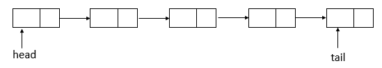
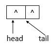
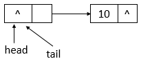
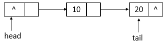
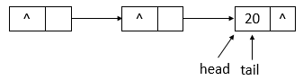
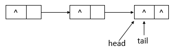

**一、前言**

接着前面的分析，接下来分析ConcurrentLinkedQueue，ConcurerntLinkedQueue一个基于链接节点的无界线程安全队列。此队列按照
FIFO（先进先出）原则对元素进行排序。队列的头部是队列中时间最长的元素。队列的 _尾部_
是队列中时间最短的元素。新的元素插入到队列的尾部，队列获取操作从队列头部获得元素。当多个线程共享访问一个公共 collection
时，ConcurrentLinkedQueue是一个恰当的选择。此队列不允许使用null元素。

**二、ConcurrentLinkedQueue数据结构**

通过源码分析可知，ConcurrentLinkedQueue的数据结构与LinkedBlockingQueue的数据结构相同，都是使用的链表结构。ConcurrentLinkedQueue的数据结构如下

说明：ConcurrentLinkedQueue采用的链表结构，并且包含有一个头结点和一个尾结点。

**三、ConcurrentLinkedQueue源码分析**

3.1 类的继承关系

    
    
     public class ConcurrentLinkedQueue<E> extends AbstractQueue<E>
            implements Queue<E>, java.io.Serializable {}

说明：ConcurrentLinkedQueue继承了抽象类AbstractQueue，AbstractQueue定义了对队列的基本操作；同时实现了Queue接口，Queue定义了对队列的基本操作，同时，还实现了Serializable接口，表示可以被序列化。

3.2 类的内部类

    
    
        private static class Node<E> {
            // 元素
            volatile E item;
            // next域
            volatile Node<E> next;
    
            /**
             * Constructs a new node.  Uses relaxed write because item can
             * only be seen after publication via casNext.
             */
            // 构造函数
            Node(E item) {
                // 设置item的值
                UNSAFE.putObject(this, itemOffset, item);
            }
            // 比较并替换item值
            boolean casItem(E cmp, E val) {
                return UNSAFE.compareAndSwapObject(this, itemOffset, cmp, val);
            }
            
            void lazySetNext(Node<E> val) {
                // 设置next域的值，并不会保证修改对其他线程立即可见
                UNSAFE.putOrderedObject(this, nextOffset, val);
            }
            // 比较并替换next域的值
            boolean casNext(Node<E> cmp, Node<E> val) {
                return UNSAFE.compareAndSwapObject(this, nextOffset, cmp, val);
            }
    
            // Unsafe mechanics
            // 反射机制
            private static final sun.misc.Unsafe UNSAFE;
            // item域的偏移量
            private static final long itemOffset;
            // next域的偏移量
            private static final long nextOffset;
    
            static {
                try {
                    UNSAFE = sun.misc.Unsafe.getUnsafe();
                    Class<?> k = Node.class;
                    itemOffset = UNSAFE.objectFieldOffset
                        (k.getDeclaredField("item"));
                    nextOffset = UNSAFE.objectFieldOffset
                        (k.getDeclaredField("next"));
                } catch (Exception e) {
                    throw new Error(e);
                }
            }
        }

View Code

说明：Node类表示链表结点，用于存放元素，包含item域和next域，item域表示元素，next域表示下一个结点，其利用反射机制和CAS机制来更新item域和next域，保证原子性。

3.3 类的属性

    
    
    public class ConcurrentLinkedQueue<E> extends AbstractQueue<E>
            implements Queue<E>, java.io.Serializable {
        // 版本序列号        
        private static final long serialVersionUID = 196745693267521676L;
        // 反射机制
        private static final sun.misc.Unsafe UNSAFE;
        // head域的偏移量
        private static final long headOffset;
        // tail域的偏移量
        private static final long tailOffset;
        static {
            try {
                UNSAFE = sun.misc.Unsafe.getUnsafe();
                Class<?> k = ConcurrentLinkedQueue.class;
                headOffset = UNSAFE.objectFieldOffset
                    (k.getDeclaredField("head"));
                tailOffset = UNSAFE.objectFieldOffset
                    (k.getDeclaredField("tail"));
            } catch (Exception e) {
                throw new Error(e);
            }
        }
        
        // 头结点
        private transient volatile Node<E> head;
        // 尾结点
        private transient volatile Node<E> tail;
    }

View Code

说明：属性中包含了head域和tail域，表示链表的头结点和尾结点，同时，ConcurrentLinkedQueue也使用了反射机制和CAS机制来更新头结点和尾结点，保证原子性。

3.4 类的构造函数

1\. ConcurrentLinkedQueue()型构造函数

    
    
        public ConcurrentLinkedQueue() {
            // 初始化头结点与尾结点
            head = tail = new Node<E>(null);
        }

View Code

说明：该构造函数用于创建一个最初为空的
ConcurrentLinkedQueue，头结点与尾结点指向同一个结点，该结点的item域为null，next域也为null。

2\. ConcurrentLinkedQueue(Collection<? extends E>)型构造函数

    
    
        public ConcurrentLinkedQueue(Collection<? extends E> c) {
            Node<E> h = null, t = null;
            for (E e : c) { // 遍历c集合
                // 保证元素不为空
                checkNotNull(e);
                // 新生一个结点
                Node<E> newNode = new Node<E>(e);
                if (h == null) // 头结点为null
                    // 赋值头结点与尾结点
                    h = t = newNode;
                else {
                    // 直接头结点的next域
                    t.lazySetNext(newNode);
                    // 重新赋值头结点
                    t = newNode;
                }
            }
            if (h == null) // 头结点为null
                // 新生头结点与尾结点
                h = t = new Node<E>(null);
            // 赋值头结点
            head = h;
            // 赋值尾结点
            tail = t;
        }

View Code

说明：该构造函数用于创建一个最初包含给定 collection 元素的 ConcurrentLinkedQueue，按照此 collection
迭代器的遍历顺序来添加元素。

3.5 核心函数分析

1\. offer函数

    
    
        public boolean offer(E e) {
            // 元素不为null
            checkNotNull(e);
            // 新生一个结点
            final Node<E> newNode = new Node<E>(e);
    
            for (Node<E> t = tail, p = t;;) { // 无限循环
                // q为p结点的下一个结点
                Node<E> q = p.next;
                if (q == null) { // q结点为null
                    // p is last node
                    if (p.casNext(null, newNode)) { // 比较并进行替换p结点的next域
                        // Successful CAS is the linearization point
                        // for e to become an element of this queue,
                        // and for newNode to become "live".
                        if (p != t) // p不等于t结点，不一致    // hop two nodes at a time
                            // 比较并替换尾结点
                            casTail(t, newNode);  // Failure is OK.
                        // 返回
                        return true;
                    }
                    // Lost CAS race to another thread; re-read next
                }
                else if (p == q) // p结点等于q结点
                    // We have fallen off list.  If tail is unchanged, it
                    // will also be off-list, in which case we need to
                    // jump to head, from which all live nodes are always
                    // reachable.  Else the new tail is a better bet.
                    // 原来的尾结点与现在的尾结点是否相等，若相等，则p赋值为head，否则，赋值为现在的尾结点
                    p = (t != (t = tail)) ? t : head;
                else
                    // Check for tail updates after two hops.
                    // 重新赋值p结点
                    p = (p != t && t != (t = tail)) ? t : q;
            }
        }

View Code

说明：offer函数用于将指定元素插入此队列的尾部。下面模拟offer函数的操作，队列状态的变化（假设单线程添加元素，连续添加10、20两个元素）。

 ①
若ConcurrentLinkedQueue的初始状态如上图所示，即队列为空。单线程添加元素，此时，添加元素10，则状态如下所示

 ②
如上图所示，添加元素10后，tail没有变化，还是指向之前的结点，继续添加元素20，则状态如下所示

③ 如上图所示，添加元素20后，tail指向了最新添加的结点。

2\. poll函数

    
    
        public E poll() {
            restartFromHead:
            for (;;) { // 无限循环
                for (Node<E> h = head, p = h, q;;) { // 保存头结点
                    // item项
                    E item = p.item;
        
                    if (item != null && p.casItem(item, null)) { // item不为null并且比较并替换item成功
                        // Successful CAS is the linearization point
                        // for item to be removed from this queue.
                        if (p != h) // p不等于h    // hop two nodes at a time
                            // 更新头结点
                            updateHead(h, ((q = p.next) != null) ? q : p); 
                        // 返回item
                        return item;
                    }
                    else if ((q = p.next) == null) { // q结点为null
                        // 更新头结点
                        updateHead(h, p);
                        return null;
                    }
                    else if (p == q) // p等于q
                        // 继续循环
                        continue restartFromHead;
                    else
                        // p赋值为q
                        p = q;
                }
            }
        }

View Code

说明：此函数用于获取并移除此队列的头，如果此队列为空，则返回null。下面模拟poll函数的操作，队列状态的变化（假设单线程操作，状态为之前offer10、20后的状态，poll两次）。

① 队列初始状态如上图所示，在poll操作后，队列的状态如下图所示

② 如上图可知，poll操作后，head改变了，并且head所指向的结点的item变为了null。再进行一次poll操作，队列的状态如下图所示。

③ 如上图可知，poll操作后，head结点没有变化，只是指示的结点的item域变成了null。

3\. remove函数

    
    
        public boolean remove(Object o) {
            // 元素为null，返回
            if (o == null) return false;
            Node<E> pred = null;
            for (Node<E> p = first(); p != null; p = succ(p)) { // 获取第一个存活的结点
                // 第一个存活结点的item值
                E item = p.item;
                if (item != null &&
                    o.equals(item) &&
                    p.casItem(item, null)) { // 找到item相等的结点，并且将该结点的item设置为null
                    // p的后继结点
                    Node<E> next = succ(p);
                    if (pred != null && next != null) // pred不为null并且next不为null
                        // 比较并替换next域
                        pred.casNext(p, next);
                    return true;
                }
                // pred赋值为p
                pred = p;
            }
            return false;
        }

View Code

说明：此函数用于从队列中移除指定元素的单个实例（如果存在）。其中，会调用到first函数和succ函数，first函数的源码如下

    
    
        Node<E> first() {
            restartFromHead:
            for (;;) { // 无限循环，确保成功
                for (Node<E> h = head, p = h, q;;) {
                    // p结点的item域是否为null
                    boolean hasItem = (p.item != null);
                    if (hasItem || (q = p.next) == null) { // item不为null或者next域为null
                        // 更新头结点
                        updateHead(h, p);
                        // 返回结点
                        return hasItem ? p : null;
                    }
                    else if (p == q) // p等于q
                        // 继续从头结点开始
                        continue restartFromHead;
                    else
                        // p赋值为q
                        p = q;
                }
            }
        }

View Code

说明：first函数用于找到链表中第一个存活的结点。succ函数源码如下

    
    
        final Node<E> succ(Node<E> p) {
            // p结点的next域
            Node<E> next = p.next;
            // 如果next域为自身，则返回头结点，否则，返回next
            return (p == next) ? head : next;
        }

View Code

说明：succ用于获取结点的下一个结点。如果结点的next域指向自身，则返回head头结点，否则，返回next结点。下面模拟remove函数的操作，队列状态的变化（假设单线程操作，状态为之前offer10、20后的状态，执行remove(10)、remove(20)操作）。

① 如上图所示，为ConcurrentLinkedQueue的初始状态，remove(10)后的状态如下图所示

②
如上图所示，当执行remove(10)后，head指向了head结点之前指向的结点的下一个结点，并且head结点的item域置为null。继续执行remove(20)，状态如下图所示

③ 如上图所示，执行remove(20)后，head与tail指向同一个结点，item域为null。

4\. size函数

    
    
        public int size() {
            // 计数
            int count = 0;
            for (Node<E> p = first(); p != null; p = succ(p)) // 从第一个存活的结点开始往后遍历
                if (p.item != null) // 结点的item域不为null
                    // Collection.size() spec says to max out
                    if (++count == Integer.MAX_VALUE) // 增加计数，若达到最大值，则跳出循环
                        break;
            // 返回大小
            return count;
        }

View Code

说明：此函数用于返回ConcurrenLinkedQueue的大小，从第一个存活的结点（first）开始，往后遍历链表，当结点的item域不为null时，增加计数，之后返回大小。

**五、示例**

下面通过一个示例来了解ConcurrentLinkedQueue的使用

    
    
     package com.hust.grid.leesf.collections;
    
    import java.util.concurrent.ConcurrentLinkedQueue;
    
    class PutThread extends Thread {
        private ConcurrentLinkedQueue<Integer> clq;
        public PutThread(ConcurrentLinkedQueue<Integer> clq) {
            this.clq = clq;
        }
        
        public void run() {
            for (int i = 0; i < 10; i++) {
                try {
                    System.out.println("add " + i);
                    clq.add(i);
                    Thread.sleep(100);
                } catch (InterruptedException e) {
                    e.printStackTrace();
                }
            }
        }
    }
    
    class GetThread extends Thread {
        private ConcurrentLinkedQueue<Integer> clq;
        public GetThread(ConcurrentLinkedQueue<Integer> clq) {
            this.clq = clq;
        }
        
        public void run() {
            for (int i = 0; i < 10; i++) {
                try {
                    System.out.println("poll " + clq.poll());
                    Thread.sleep(100);
                } catch (InterruptedException e) {
                    e.printStackTrace();
                }
            }
        }
    }
    
    public class ConcurrentLinkedQueueDemo {
        public static void main(String[] args) {
            ConcurrentLinkedQueue<Integer> clq = new ConcurrentLinkedQueue<Integer>();
            PutThread p1 = new PutThread(clq);
            GetThread g1 = new GetThread(clq);
            
            p1.start();
            g1.start();
            
        }
    }

View Code

运行结果（某一次）：

    
    
    add 0
    poll null
    add 1
    poll 0
    add 2
    poll 1
    add 3
    poll 2
    add 4
    poll 3
    add 5
    poll 4
    poll 5
    add 6
    add 7
    poll 6
    poll 7
    add 8
    add 9
    poll 8

View Code

说明：GetThread线程不会因为ConcurrentLinkedQueue队列为空而等待，而是直接返回null，所以当实现队列不空时，等待时，则需要用户自己实现等待逻辑。

**六、总结**

ConcurrentLinkedQueue的源码也相对简单，其实对于并发集合而言，分析源码时首先理解单线程情况，然后再考虑在多线程并发时的情况，这样会使得分析源码容易得多，ConcurrentLinkedQueue和LinkedBlockingQueue的区别还是很明显的（前者在取元素时，若队列为空，则返回null；后者会进行等待）。谢谢各位园友的观看~

