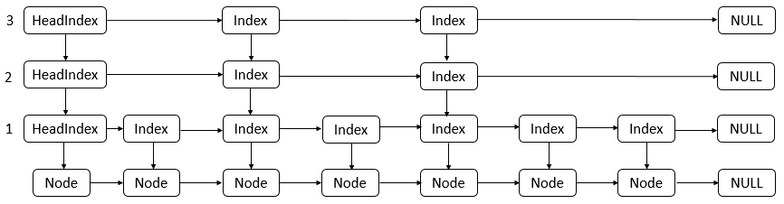
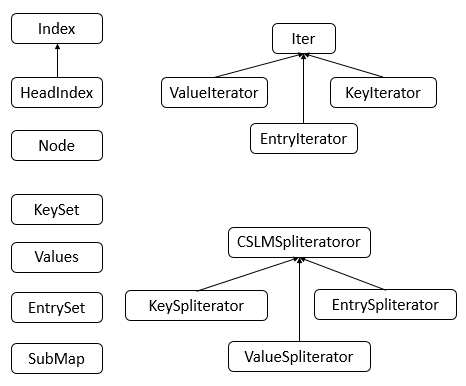
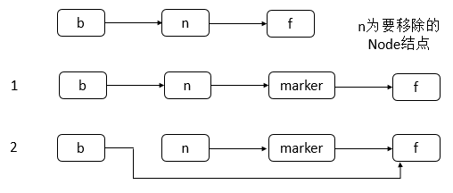

**一、前言**

最近在做项目的同时也在修复之前项目的一些Bug，所以忙得没有时间看源代码，今天都完成得差不多了，所以又开始源码分析之路，也着笔记录下ConcurrentSkipListMap的源码的分析过程。

**二、ConcurrentSkipListMap数据结构**

抓住了数据结构，对于理解整个ConcurrentSkipListMap有很重要的作用，其实，通过源码可知其数据结构如下。

说明：可以看到ConcurrentSkipListMap的数据结构使用的是跳表，每一个HeadIndex、Index结点都会包含一个对Node的引用，同一垂直方向上的Index、HeadIndex结点都包含了最底层的Node结点的引用。并且层级越高，该层级的结点（HeadIndex和Index）数越少。Node结点之间使用单链表结构。

**三、ConcurrentSkipListMap源码分析**

3.1 类的继承关系

    
    
    public class ConcurrentSkipListMap<K,V> extends AbstractMap<K,V>
        implements ConcurrentNavigableMap<K,V>, Cloneable, Serializable {}

说明：ConcurrentSkipListMap继承了AbstractMap抽象类，实现了ConcurrentNavigableMap接口，该接口定义了获取某一部分集合的操作。实现了Cloneable接口，表示允许克隆。实现了Serializable接口，表示可被序列化。

3.2 类的内部类

ConcurrentSkipListMap包含了很多内部类，内部类的框架图如下：

说明：其中，最为重要的类包括Index、HeadIndex、Node三个类。下面对这三个类进行逐一讲解，其他的类，读者有兴趣可以自行分析。

① Index类

1\. 类的属性

    
    
        static class Index<K,V> {
            final Node<K,V> node;
            final Index<K,V> down;
            volatile Index<K,V> right;
            
            // Unsafe mechanics
            private static final sun.misc.Unsafe UNSAFE;
            private static final long rightOffset;
            static {
                try {
                    UNSAFE = sun.misc.Unsafe.getUnsafe();
                    Class<?> k = Index.class;
                    rightOffset = UNSAFE.objectFieldOffset
                        (k.getDeclaredField("right"));
                } catch (Exception e) {
                    throw new Error(e);
                }
            }
        }

说明：可以看到，Index结点包括一个Node结点的引用，都是包含down域和right域，即对应数据结构中的Index结点。并且借助了反射来原子性的修改right域。

2\. 类的构造函数

    
    
     /**
             * Creates index node with given values.
             */
            Index(Node<K,V> node, Index<K,V> down, Index<K,V> right) {
                this.node = node;
                this.down = down;
                this.right = right;
            }

View Code

说明：构造Index结点，确定Node引用，down域和right域。

3\. 核心函数分析

3.1 link函数

    
    
            final boolean link(Index<K,V> succ, Index<K,V> newSucc) {
                // 获取Index结点的Node结点
                Node<K,V> n = node;
                // 将newSucc结点的right域设置为succ
                newSucc.right = succ;
                // 结点的值不为空并且比较并交换当前Index结点的right域（将当前Index(this)结点的right域设置为newSucc）
                return n.value != null && casRight(succ, newSucc);
            }

View Code

说明：link方法用于在当前Index结点的后面插入一个Index结点，形成其right结点。并且插入的Index结点的right域为当前结点的right域。

3.2 unlink函数

    
    
            final boolean unlink(Index<K,V> succ) {
                // 当前Index结点的Node结点的值不为空并且将当前Index结点的right设置为succ的right结点
                return node.value != null && casRight(succ, succ.right);
            }

View Code

说明：unlink方法与link方法作用相反，其删除当前Index结点的right结点，即将当前Index结点的right指向当前Index结点的right.right域。

② HeadIndex类

    
    
        // 头结点索引类
        static final class HeadIndex<K,V> extends Index<K,V> {
            // 层级
            final int level;
            // 构造函数
            HeadIndex(Node<K,V> node, Index<K,V> down, Index<K,V> right, int level) {
                // 构造Index类
                super(node, down, right);
                this.level = level;
            }
        }

说明：根据HeadIndex类可知其继承自Index类，并且在Index类的基础上添加了level域，表示当前的层级。

③ Node类

1\. 类的属性

    
    
        static final class Node<K,V> {
            // 键
            final K key;
            // 值
            volatile Object value;
            // 下一个结点
            volatile Node<K,V> next;
            
            // UNSAFE mechanics
    
            private static final sun.misc.Unsafe UNSAFE;
            // value域的偏移地址
            private static final long valueOffset;
            // next域的偏移地址
            private static final long nextOffset;
    
            static {
                try {
                    UNSAFE = sun.misc.Unsafe.getUnsafe();
                    Class<?> k = Node.class;
                    valueOffset = UNSAFE.objectFieldOffset
                        (k.getDeclaredField("value"));
                    nextOffset = UNSAFE.objectFieldOffset
                        (k.getDeclaredField("next"));
                } catch (Exception e) {
                    throw new Error(e);
                }
            }
        }

View Code

说明：Node类包含了key、value、next域，其是用来实际存放元素的结点，并且是使用单链表结构。同时，也使用了反射来原子性的修改value与和next域。

2\. 类的构造函数

    
    
            Node(K key, Object value, Node<K,V> next) {
                this.key = key;
                this.value = value;
                this.next = next;
            }
    
            /**
             * Creates a new marker node. A marker is distinguished by
             * having its value field point to itself.  Marker nodes also
             * have null keys, a fact that is exploited in a few places,
             * but this doesn"t distinguish markers from the base-level
             * header node (head.node), which also has a null key.
             */
            // 用于建立标记结点，值为本身
            Node(Node<K,V> next) {
                this.key = null;
                this.value = this;
                this.next = next;
            }

View Code

说明：Node类包含了两种构造函数，分别表示正常的结点和marker标记结点，marker标记结点在删除结点时被使用。

3\. 类的核心函数

3.1 helpDelete函数

    
    
            void helpDelete(Node<K,V> b, Node<K,V> f) {
                /*
                 * Rechecking links and then doing only one of the
                 * help-out stages per call tends to minimize CAS
                 * interference among helping threads.
                 */
                if (f == next && this == b.next) { // f为当前结点的后继并且b为当前结点的前驱
                    if (f == null || f.value != f) // f为空或者f的value不为本身，即没有被标记    not already marked
                        // 当前结点后添加一个marker结点，并且当前结点的后继为marker，marker结点的后继为f
                        casNext(f, new Node<K,V>(f)); 
                    else // f不为空并且f的值为本身
                        // 设置b的next域为f的next域
                        b.casNext(this, f.next);
                }
            }

View Code

说明：删除结点，在结点后面添加一个marker结点或者将结点和其后的marker结点从其前驱中断开。

3.3 类的属性

    
    
    public class ConcurrentSkipListMap<K,V> extends AbstractMap<K,V>
        implements ConcurrentNavigableMap<K,V>, Cloneable, Serializable {
        // 版本序列号    
        private static final long serialVersionUID = -8627078645895051609L;
        // 基础层的头结点
        private static final Object BASE_HEADER = new Object();
        // 最顶层头结点的索引
        private transient volatile HeadIndex<K,V> head;
        // 比较器
        final Comparator<? super K> comparator;
        // 键集合
        private transient KeySet<K> keySet;
        // entry集合
        private transient EntrySet<K,V> entrySet;
        // 值集合
        private transient Values<V> values;
        // 降序键集合
        private transient ConcurrentNavigableMap<K,V> descendingMap;
        
        // Unsafe mechanics
        private static final sun.misc.Unsafe UNSAFE;
        // head域的偏移量
        private static final long headOffset;
        // Thread类的threadLocalRandomSecondarySeed的偏移量
        private static final long SECONDARY;
        static {
            try {
                UNSAFE = sun.misc.Unsafe.getUnsafe();
                Class<?> k = ConcurrentSkipListMap.class;
                headOffset = UNSAFE.objectFieldOffset
                    (k.getDeclaredField("head"));
                Class<?> tk = Thread.class;
                SECONDARY = UNSAFE.objectFieldOffset
                    (tk.getDeclaredField("threadLocalRandomSecondarySeed"));
    
            } catch (Exception e) {
                throw new Error(e);
            }
        }
    }

View Code

说明：ConcurrentSkipListMap包含了head属性，表示跳表的头结点，并且包含了一个比较器，值得注意的是，对于ConcurrentSkipListMap的使用，键必须能够进行比较，如传递了比较器或者键本身就能够进行比较。同时，也使用了反射来保证原子性的更新head域。

3.4 类的构造函数

1\. ConcurrentSkipListMap()型构造函数

    
    
        // 构造一个新的空映射，该映射按照键的自然顺序进行排序
        public ConcurrentSkipListMap() {
            // 比较器为空，那么键必须能够比较（实现了Comparable接口）
            this.comparator = null;
            // 初始化相关的域
            initialize();
        }

View Code

说明：构造一个新的空映射，该映射按照键的自然顺序进行排序，即键K必须实现了Comparable接口，否则，会报错。

2\. ConcurrentSkipListMap(Comparator<? super K>)型构造函数

    
    
        // 构造一个新的空映射，该映射按照指定的比较器进行排序
        public ConcurrentSkipListMap(Comparator<? super K> comparator) {
            // 初始化比较器
            this.comparator = comparator;
            // 初始化相关的域
            initialize();
        }

View Code

说明：构造一个新的空映射，该映射按照指定的比较器进行排序

3\. ConcurrentSkipListMap(Map<? extends K, ? extends V>)型构造函数

    
    
        // 构造一个新映射，该映射所包含的映射关系与给定映射包含的映射关系相同，并按照键的自然顺序进行排序
        public ConcurrentSkipListMap(Map<? extends K, ? extends V> m) {
            // 比较器Wie空
            this.comparator = null;
            // 初始化相关的域
            initialize();
            // 将m的所有元素添加至跳表
            putAll(m);
        }

View Code

说明：构造一个新映射，该映射所包含的映射关系与给定映射包含的映射关系相同，并按照键的自然顺序进行排序。

4\. ConcurrentSkipListMap(SortedMap<K, ? extends V>)型构造函数

    
    
        // 构造一个新映射，该映射所包含的映射关系与指定的有序映射包含的映射关系相同，使用的顺序也相同
        public ConcurrentSkipListMap(SortedMap<K, ? extends V> m) {
            // 获取m的比较器
            this.comparator = m.comparator();
            // 初始化相关的域
            initialize();
            // 根据m的元素来构建跳表
            buildFromSorted(m);
        }

View Code

说明：构造一个新映射，该映射所包含的映射关系与指定的有序映射包含的映射关系相同，使用的顺序也相同。

3.5 核心函数分析

1\. doPut函数

    
    
        // 插入一个结点
        private V doPut(K key, V value, boolean onlyIfAbsent) {
            Node<K,V> z;             // added node
            if (key == null) // 键为空，抛出空异常
                throw new NullPointerException();
            // 比较器
            Comparator<? super K> cmp = comparator;
            outer: for (;;) { // 无限循环
                for (Node<K,V> b = findPredecessor(key, cmp), n = b.next;;) { // 找到先驱结点，n为当前结点
                    if (n != null) { // next域不为空
                        Object v; int c;
                        // f为当前结点的后继节点
                        Node<K,V> f = n.next;
                        if (n != b.next)  // 不一致，重试            // inconsistent read
                            break;
                        if ((v = n.value) == null) { // n结点已经被删除  // n is deleted
                            // 进行删除
                            n.helpDelete(b, f);
                            break;
                        }
                        if (b.value == null || v == n) // b结点已经被删除        b is deleted
                            break;
                        if ((c = cpr(cmp, key, n.key)) > 0) { // key大于结点的key
                            // b往后移动
                            b = n;
                            // n往后移动
                            n = f;
                            continue;
                        }
                        if (c == 0) { // 键相等
                            if (onlyIfAbsent || n.casValue(v, value)) { // 比较并交换值
                                @SuppressWarnings("unchecked") V vv = (V)v;
                                return vv;
                            }
                            // 重试
                            break; // restart if lost race to replace value
                        }
                        // else c < 0; fall through
                    }
                    // 新生一个结点
                    z = new Node<K,V>(key, value, n);
                    if (!b.casNext(n, z)) // 比较并交换next域
                        break;         // restart if lost race to append to b
                    // 成功，则跳出循环
                    break outer;
                }
            }
            // 随机生成种子
            int rnd = ThreadLocalRandom.nextSecondarySeed();
            if ((rnd & 0x80000001) == 0) { // test highest and lowest bits
                int level = 1, max;
                while (((rnd >>>= 1) & 1) != 0) // 判断从右到左有多少个连续的1
                    ++level;
                Index<K,V> idx = null;
                // 保存头结点
                HeadIndex<K,V> h = head;
                if (level <= (max = h.level)) { // 小于跳表的层级
                    for (int i = 1; i <= level; ++i) // 为结点生成对应的Index结点
                        // 从下至上依次赋值，并且赋值了Index结点的down域
                        idx = new Index<K,V>(z, idx, null);
                }
                else { // try to grow by one level
                    level = max + 1; // hold in array and later pick the one to use
                    // 生成Index结点的数组，其中，idxs[0]不作使用
                    @SuppressWarnings("unchecked")Index<K,V>[] idxs =
                        (Index<K,V>[])new Index<?,?>[level+1]; 
                    for (int i = 1; i <= level; ++i) // 从下到上生成Index结点，并赋值down域
                        idxs[i] = idx = new Index<K,V>(z, idx, null);
                    for (;;) { // 无限循环
                        // 保存头结点
                        h = head;
                        // 保存跳表之前的层级
                        int oldLevel = h.level;
                        if (level <= oldLevel) // lost race to add level
                            break;
                        // 保存头结点
                        HeadIndex<K,V> newh = h;
                        // 保存头结点对应的Node结点
                        Node<K,V> oldbase = h.node;
                        for (int j = oldLevel+1; j <= level; ++j) // 为每一层生成一个头结点
                            newh = new HeadIndex<K,V>(oldbase, newh, idxs[j], j);
                        if (casHead(h, newh)) { // 比较并替换头结点
                            // h赋值为最高层的头结点
                            h = newh;
                            // idx赋值为之前层级的头结点，并将level赋值为之前的层级
                            idx = idxs[level = oldLevel];
                            break;
                        }
                    }
                }
                // find insertion points and splice in
                // 插入Index结点
                splice: for (int insertionLevel = level;;) { 
                    // 保存新跳表的层级
                    int j = h.level;
                    for (Index<K,V> q = h, r = q.right, t = idx;;) { 
                        if (q == null || t == null) // 头结点或者idx结点为空
                            // 跳出外层循环
                            break splice;
                        if (r != null) { // right结点不为空
                            // 保存r对应的Node结点
                            Node<K,V> n = r.node;
                            // compare before deletion check avoids needing recheck
                            // 比较key与结点的key值
                            int c = cpr(cmp, key, n.key);
                            if (n.value == null) { // 结点的值为空，表示需要删除
                                if (!q.unlink(r)) // 删除q的Index结点
                                    break;
                                // r为q的right结点
                                r = q.right;
                                continue;
                            }
                            if (c > 0) { // key大于结点的key
                                // 向右寻找
                                q = r;
                                r = r.right;
                                continue;
                            }
                        }
    
                        if (j == insertionLevel) {
                            if (!q.link(r, t)) // r结点插入q与t之间
                                break; // restart
                            if (t.node.value == null) { // t结点的值为空，需要删除
                                // 利用findNode函数的副作用
                                findNode(key);
                                break splice;
                            }
                            if (--insertionLevel == 0) // 到达最底层，跳出循环
                                break splice;
                        }
    
                        if (--j >= insertionLevel && j < level) 
                            t = t.down;
                        q = q.down;
                        r = q.right;
                    }
                }
            }
            return null;
        }

View Code

说明：doPut提供对put函数的支持，doPut的大体流程如下：

① 根据给定的key从跳表的左上方往右或者往下查找到Node链表的前驱Node结点，这个查找过程会删除一些已经标记为删除的结点。

②
找到前驱结点后，开始往后插入查找插入的位置（因为找到前驱结点后，可能有另外一个线程在此前驱结点后插入了一个结点，所以步骤①得到的前驱现在可能不是要插入的结点的前驱，所以需要往后查找）。

③ 随机生成一个种子，判断是否需要增加层级，并且在各层级中插入对应的Index结点。

其中，会调用到findPredecessor函数，findPredecessor函数源码如下

    
    
        private Node<K,V> findPredecessor(Object key, Comparator<? super K> cmp) {
            if (key == null) // 键为空，抛出空异常
                throw new NullPointerException(); // don"t postpone errors
            for (;;) { // 无限循环
                for (Index<K,V> q = head, r = q.right, d;;) { // 
                    if (r != null) { // 右Index结点不为空
                        // n为当前Node结点
                        Node<K,V> n = r.node;
                        // 为当前key
                        K k = n.key;
                        if (n.value == null) { // 当前Node结点的value为空，表示需要删除
                            if (!q.unlink(r)) // unlink r Index结点
                                break;           // restart
                            // r为rightIndex结点
                            r = q.right;         // reread r
                            continue;
                        }
                        if (cpr(cmp, key, k) > 0) { // 比较key与当前Node结点的k，若大于0
                            // 向右移动
                            q = r;
                            r = r.right;
                            continue;
                        }
                    }
                    if ((d = q.down) == null) // q的down域为空，直接返回q对应的Node结点
                        return q.node;
                    // 向下移动
                    q = d;
                    // d的right结点
                    r = d.right;
                }
            }
        }

View Code

说明：findPredecessor函数的主要流程如下。

从头结点（head）开始，先比较key与当前结点的key的大小，若key大于当前Index结点的key并且当前Index结点的right不为空，则向右移动，继续查找；若当前Index结点的right为空，则向下移动，继续查找；若key小于等于当前Index结点的key，则向下移动，继续查找。直至找到前驱结点。

2\. doRemove函数

    
    
        // 移除一个结点
        final V doRemove(Object key, Object value) {
            if (key == null)
                throw new NullPointerException();
            // 保存比较器
            Comparator<? super K> cmp = comparator;
            outer: for (;;) { // 无限循环
                for (Node<K,V> b = findPredecessor(key, cmp), n = b.next;;) { // 根据key找到前驱结点，n为当前Index结点
                    Object v; int c;
                    if (n == null) // n不为空
                        break outer;
                    // f为当前结点的next结点
                    Node<K,V> f = n.next; 
                    if (n != b.next)  // 不一致，重试                  // inconsistent read
                        break;
                    if ((v = n.value) == null) {  // 当前结点的value为空，需要删除      // n is deleted
                        // 删除n结点
                        n.helpDelete(b, f);
                        break;
                    }
                    if (b.value == null || v == n)      // b is deleted
                        break;
                    if ((c = cpr(cmp, key, n.key)) < 0) // key小于当前结点的key
                        // 跳出外层循环
                        break outer;
                    if (c > 0) { // key大于当前结点的key
                        // 向后移动
                        b = n;
                        n = f;
                        continue;
                    }
                    if (value != null && !value.equals(v))
                        break outer;
                    if (!n.casValue(v, null)) // 当前结点的value设置为null
                        break;
                    if (!n.appendMarker(f) || !b.casNext(n, f)) // 在n结点后添加一个marker结点，并且将b的next域更新为f
                        findNode(key);                  // retry via findNode
                    else { // 添加节点并且更新均成功
                        // 利用findNode函数的副作用，删除n结点对应的Index结点
                        findPredecessor(key, cmp);      // clean index
                        if (head.right == null) // 头结点的right为null
                            // 需要减少层级
                            tryReduceLevel();
                    }
                    @SuppressWarnings("unchecked") V vv = (V)v;
                    return vv;
                }
            }
            return null;
        }

View Code

说明：doRemove函数的处理流程如下。

① 根据key值找到前驱结点，查找的过程会删除一个标记为删除的结点。

② 从前驱结点往后查找该结点。

③ 在该结点后面添加一个marker结点，若添加成功，则将该结点的前驱的后继设置为该结点之前的后继。

④ 头结点的next域是否为空，若为空，则减少层级。

下面的示意图给出了remove操作一种可能的情况（仅仅涉及Node结点的链表层的操作）

说明：可以看到remove操作是分为两步进行的，首先是在要删除结点的后面添加一个marker结点，然后修改删除结点的前驱结点的next域。注意，这里仅仅只给出了Node结点的链表层的操作，并没有涉及到Index结点，关于Index结点的情况，之后会给出一个示例。其中会调用到tryReduceLevel函数，tryReduceLevel源码如下

    
    
        // 减少跳表层级
        private void tryReduceLevel() {
            // 保存头结点
            HeadIndex<K,V> h = head;
            HeadIndex<K,V> d;
            HeadIndex<K,V> e;
            if (h.level > 3 &&
                (d = (HeadIndex<K,V>)h.down) != null &&
                (e = (HeadIndex<K,V>)d.down) != null &&
                e.right == null &&
                d.right == null &&
                h.right == null &&
                casHead(h, d) && // try to set
                h.right != null) // recheck
                casHead(d, h);   // try to backout
        }

View Code

说明：如果最高的前三个HeadIndex不为空，并且其right域都为null，那么就将level减少1层，并将head设置为之前head的下一层，设置完成后，还有检测之前的head的right域是否为null，如果为null，则减少层级成功，否则再次将head设置为h。  
3\. doGet函数

    
    
        private V doGet(Object key) {
            if (key == null)
                throw new NullPointerException();
            Comparator<? super K> cmp = comparator;
            outer: for (;;) {
                for (Node<K,V> b = findPredecessor(key, cmp), n = b.next;;) { // 根据key找到前驱结点，n为当前结点
                    Object v; int c;
                    if (n == null) // 当前Index结点为null，跳出外层循环
                        break outer;
                    // f为当前结点的next结点
                    Node<K,V> f = n.next;
                    if (n != b.next)    // 不一致，重试                // inconsistent read
                        break;
                    if ((v = n.value) == null) {    // n is deleted
                        n.helpDelete(b, f);
                        break;
                    }
                    if (b.value == null || v == n)  // b is deleted
                        break;
                    if ((c = cpr(cmp, key, n.key)) == 0) { // 找到key值相等的结点
                        @SuppressWarnings("unchecked") V vv = (V)v;
                        // 返回value
                        return vv;
                    }
                    if (c < 0) // 小于当前结点
                        // 则表示没有找到，跳出外层循环
                        break outer;
                    // 继续向后移动
                    b = n;
                    n = f;
                }
            }
            return null;
        }

View Code

说明：doGet函数流程比较简单，首先根据key找到前驱结点，然后从前驱结点开始往后查找，找到与key相等的结点，则返回该结点，否则，返回null。在这个过程中会删除一些已经标记为删除状态的结点。

4\. size函数

    
    
        public int size() {
            long count = 0;
            for (Node<K,V> n = findFirst(); n != null; n = n.next) { // 找到第一个结点
                if (n.getValidValue() != null) // n结点没有被标记删除
                    // 计数器加1
                    ++count;
            }
            return (count >= Integer.MAX_VALUE) ? Integer.MAX_VALUE : (int) count;
        }

View Code

说明：size函数的流程如下，首先利用findFirst函数找到第一个value不为null的结点。然后开始往后遍历，调用Node结点的getValidValue函数判断结点的value是否有效，有效则计数器加1。其中findFirst源码如下

    
    
        final Node<K,V> findFirst() {
            for (Node<K,V> b, n;;) {
                if ((n = (b = head.node).next) == null) // 头结点的下一个结点为当前结点，为null
                    // 返回null
                    return null;
                if (n.value != null) // 当前结点不为null
                    // 则返回该结点
                    return n;
                // 表示当前结点的value为null,则进行删除
                n.helpDelete(b, n.next);
            }
        }

View Code

说明：findFirst函数的功能是找到第一个value不为null的结点。getValidValue源码如下

    
    
            V getValidValue() {
                Object v = value;
                if (v == this || v == BASE_HEADER) // value为自身或者为BASE_HEADER
                    return null;
                @SuppressWarnings("unchecked") V vv = (V)v;
                return vv;
            }

View Code

说明：若结点的value为自身或者是BASE_HEADER，则返回null，否则返回结点的value。

**四、示例**

下面通过一个简单的示例，来深入了解ConcurrentSkipListMap的内部结构。

    
    
     package com.hust.grid.leesf.collections;
    
    import java.util.concurrent.ConcurrentSkipListMap;
    
    public class ConcurrentSkipListMapDemo {
        public static void main(String[] args) {
            ConcurrentSkipListMap<String, Integer> cslm = new ConcurrentSkipListMap<String, Integer>();
            cslm.put("leesf", 24);
            cslm.put("dyd", 24);
            
            for (String key :cslm.keySet()) {
                System.out.print("[" + key + "," + cslm.get(key) + "] ");
            }
            System.out.println();
            cslm.remove("leesf");
            for (String key :cslm.keySet()) {
                System.out.print("[" + key + "," + cslm.get(key) + "] ");
            }
        }
    }

View Code

运行结果：

    
    
    [dyd,24] [leesf,24] 
    
    
    [dyd,24]

说明：上面的一个示例非常简单，下面借这个示例，来分析ConcurrentSkipListMap的内部结构。

① 当新生一个ConcurrentSkipListMap时，有如下结构。

![](data:image/png;base64,iVBORw0KGgoAAAANSUhEUgAAAswAAAEXCAIAAAA2ooU8AAAgAElEQVR4Ae2dX+gdWbXnzdigYD84IuiE0ISkQUVk2osEjUnU0HbyoNAOEZJcxfYlkIzgXAidl/aOXPOSNuKDmob0gwE1CdhzFRRMokQn6YkS5bYDPviQjqENPf0gkgcFwZbMp/O1l7t3/Tl16lSdU1Xnex7Ob++111577U+dX+1Ve++q2nD37t3X+WMCJmACJmACJmACXRP4T10btD0TMAETMAETMAETeIWAgwz/DkzABEzABEzABHoh4CCjF6w2agImYAImYAIm4CDDvwETMAETMAETMIFeCDjI6AWrjZqACZiACZiACTjI8G/ABEzABEzABEygFwIOMnrBaqMmYAImYAImYAIOMvwbMAETMAETMAET6IWAg4xesNqoCZiACZiACZiAgwz/BkzABEzABEzABHoh4CCjF6w2agImYAImYAIm4CDDvwETMAETMAETMIFeCDjI6AWrjZqACZiACZiACTjI8G/ABEzABEzABEygFwIOMnrBaqMmYAImYAImYAIOMvwbMAETMAETWCWBDRs2rLL51bW9Dh2/b3V43bIJmIAJmIAJNCIwczy+e/duI0OjUppArzdM8sCM6ldkZ03ABExgjQjMHDjFYnpj03p23Msla/S/7a6agAmYwMoJED1kH1zKJGRb+3n+/PmGw3nrJtpVLO1jqbCd/WHWcpAxzONir0zABExgrAQ0zN+8eVMdePbZZxn1EY61Pw38PnLkyIMPPpgpquN8Z/K1ynpPxlodbnfWBNaRwL/8+9517HaDPn/1v11ooLWQCqHGzp07Dx8+vH///jBUnGnIJIvMZEQry0zs2rXrqaeeIp7YsWNHtHvt2rWtW7emkqybaGaS0XU8OluVcJBRRcZyEzCB6RDobzQlghmv8SUc4EceeWTPnj2nTp1K28qGUgbaTJIqZ8NwWlRM19gpKncoIYQ6cOAAUUUaUpw+fZrup61k7tV0fBS9TrtWlfZySRUZy03ABEzABBYiwCLC888/f+HCQvMlDMzFD24VhUgyd7Vwo5Ua5lQYufXZu/fvk1usceBk1MoWekLeJMFsDVFFaNIcfT948GBI5kpU9a5KPpfxZSo7yFgmbbdlAiZgAutC4JlnnmEFgYE27fCro/xr/qLwmvyrmbRiizSLF8wunDt3jmkGhnxWLkhrkMaa4oxDhw7hZBi/cuUK8y5btmwJSfME8QSdjR0YdD9dK3m1T6/5i/HX5F/NNG90+JoOMoZ/jOyhCZiACYyPwLFjxxhlswE7uxCnV0j0nRVJnnabITjNRrpUrr0gijDQZMgneoh9IU888cTFixfR2bdvH6URGRBwPPbYY2F5roQWSlgxUS1mNYhgwkLWO+QNO17aO6pXyaPFgSQcZAzkQNgNEzABE5gUAS7r+aSLEVn3GCZjoE2HzDSdVSnNYqRYhfjmxIkTEVVcvnyZqAI1fdiLKlPEQAQfZ8+eJatVlahS2la9MFZMtFayffv2Un18WLzjpb0ubW61QgcZq+Xv1k3ABExgsgSuXr3K3IAG76yTDLSpJIbMGIDTUtJVcqlF9ajFHAZTKWnTRACopR/NsjB1oRUT1krQCQtqNPMzLS2mY8UkWytJNTOD+CNJaQdLhWEt6oZkgAkHGQM8KHbJBEzABKZAgBUEhm02RnBln/andOzUkMl3qql0qX6mlo24TEgwkxFNE09cunQpq6Lstm3bSBCOEGpwJ2qpTkMh/WUGhRWTbK0kqpd2pKrjpcphSoms11npELIOMoZwFOyDCawvAU7unEyzQWh9cUyu59y8yrgbd3JyrPlkkQQS9VtDZmQlLOo3hPT444+zFKKmjx49ytrNk08+qbpswogbTLRiQjhCUbZWkvnZpF32YTCDQlva7RFV6EWxI0ikUOx4UTlMjSvhIGNcx8vemsBQCHCO5jwYZ23cIlBAkk5QD8XXBn5ksQ6DUFd9ARSfzIWsuay0eVZ+4mpapfTpk6nCktNMIcTmDEZTPqkDOJ9K7pW/soLAR2ppKZKQp0ZKNRFy96yaJpIgwfB/z/AGlkjSG2u12TNbK1FbWevFRjOJ9mFU7XhNlfEkNZ51PC2SJ2ndNJ1ppkVDSDvIGMJRsA8mMD4CN27cwGnO2uNzfZbHREvFh1TOqlRZvnv3bt3IkGoscqtkauf27dvKptFeqrCSNPMBjHza8YADJMhmz+OSY9lAG96izyeyaQJ5VS2pqfWogr6alhuv2L17V7/e0Nm0aRPp4jMt0AydhglWTIr2i3WruvCKc2WNIqyqUjQ+KImDjEEdDjtjAmMioCu/QQ1vneArfUhla8uaNr9+/XpqgeV/go9UskiaAzHGaO/eeDr3KA6o0mF4EYDcXcLcg+5BXcROw7rtOt55rxt6u6Cag4wFAbq6Caw1AfbWMbxV7ajg2is+qY4WC1SU4UuLVhK+dPKQyrRTXECzM+DMmTMh1FMZsjX7KG2RYMMBtWpuFm1hc62qEPOlz7RYq7733VkHGX0Ttn0TmDIB9tbRvZMnT2ad1P4MQhBdtJHgSlFxBkMsm+z07EVucdSGO1UnwiDL2rlqEb4sOc4ofUhl1rUWWZb80xUTrpsJO2I1oYXBYhUIM1KmkVxRx5IqAvze9EuuUrC8NQEHGa3RuaIJmMArBEqHNz0nIE7cJAgyFItoiNU2fiaoiTaCI5f7WIvRl3T6MohQ6y9BWFPcsrd4c7pJMlZMiAa003Bxy2GhKtoLBSdMYCUEHGSsBLsbNYHpEEgDiOgVD1iMuxYlJKvrbL4jjAh9JbjcZ5iPFRbSmULfWSZR+HS+7pCumGitRGFHt90hXPNkRrdIU2v8LNOs0w0JOMhoCMpqJmAClQSOHz/O8BZX6pV6DQq0jKLlEr6zuwAaGFhUpeYhlYuYjhWTPtZK5BiTQ0zDdB4hLdLrdasb8XFVYt2A0F8HGWt40N1lE+iYgIa3dG8j1+7ZAxbJ6n4Kiqq2DjBGcm9nx87NaY4VnNKHVM5pJlfX8hBxWB9rJdEY0V66+SPkTsxLoBglYKFUmFqO4LgqkSqvSdpBxpocaHfTBPolQITB8BZtZA9YZP8myxDaN8CTm9HUqoE2gUYtzYioCCG1+ETp0hLZQyq7alexC9YUcHRlNrWDZbaUpgciLR1mmsPN4F0Vd67K52KUgCelwlV5OJZ2HWSM5UjZTxMYNAEmABjecFHPNWK6gqgiNliQ4AStDjAQsqOTp10xtLCIgFp0jCKWS1RE6a1btxSXhMLSEulDKrtqVO/FEKWubBbt8BJzhA8++GCxyBIRIKDRnEQa2RDOIjSi7gkUQzNLTMAETGBKBP7H/9rTX3dsfEG2bIJhYCPWXNBO8+pqkUaZW4paBL5IIkti5nCbKq8wjeesM67QgfqmPZMx84dkBRMwARMwgakRIMKovxknGzvpf1ESUDQ10vA7aq1DwkHGOhxl99EETMAElkRAz2xNG2PtRve8zHyca1ZX2VjUmFk9bXRmmjeVdHgzThZ/KIsPVXIt2cTCDdFJbEWiViqPt+uRiFUwKQAECWuRzAMpvkE+s+NLVnCQsWTgbs4ETMAEpkxAjwBh/FMnGfYYAhnRkbA7WIMuCxYMjemwOpMI1Tt/Gqxuxim6UTohgYdV8pnOVykQ5WidSLuUpAYx5HEvN0LFGexHRllboQna2NzDHibu8U6XS9gLVdXWquQOMlZF3u2agAmYwAQJMM4x/sWtyNy1y5DJvmBGxHi7Oll6Hq+QbUKhj6fB4hK+EWpkDmTTD5Qi0XdWJHlanUAkzUa6VE6wpbBAL7JRuMPTchVAqC47eXVbMprEEwRnxFtISt9qG80NJ+EgYzjHwp6YgAmYwBQIcNMQ2x3UE4KDePeY7uDQfMC8/WRYZXyNuQTS81oo1det18XJjFCmxYgw0kAhTYdyTQIjM6so6uJpuXQWZX242SrM6um6zOgQbQxw0iL8TBMOMlIaTpuACZiACSxKgBkCTGjkZrzUZToRBpGBVgeKEwBNmowVBKrzyZ4GqyG5iZ1UR7deV71KBpupMo1KwjfptEjpKrlKo3qxYiZJb3uhFp8IKQCIMnd3Z1UGm71vsJ7ZMRMwARPoisC//PverkwV7YzXeLEvXUkYJnmAOpfmzPxrgOQCHWEMlvM2xLoGSzAKX+atW6/PegSzBbiXqSliUFQRRYz3VZFElTzqkqipHmogyp6WG0VsxdD6DpMZbHPRqlOUDjTxSozkjwmYgAmYgAl0R4DdBgyHRBVM7MsqaSRKE3kwImpmQk+t0AyHLtNVRXLUVIQyaYSygI7UUpdRSLNVaVkOU6jhG3WjepaWnSglmyoUSyWRWqQjITvqafigrICkEKiFDriUoK6qIAmYIhP2h5ZodEiG5rT9MQETMAETGDgBRkEGRYUIclUShAo4ikEGahoy0UGZATW1EEWykHUfYSapysqsRmvpaFyPYTutKLOlxhGWyqkueVUpCmoxfFBWQKL0Fev3OMgf3IOb0tKPMCvAqnRQ3+ULS+qbv03ABEzABExgnQlouYRhe14ITVZP5rU5Rn0HGWM8avbZBEzABEzABEZAwHeXjOAg2UUTMAETMAETGCMBBxljPGr22QRMwARMwARGQMBBxggOkl00ARMwARMwgTEScJAxxqNmn03ABEzABExgBAQcZIzgINlFEzABEzABExgjAQcZYzxq9tkETMAETMAERkDAQcYIDpJdNAETMAETMIExEnCQMcajZp9NwARMwARMYAQEHGSM4CDZRRMwARMwARMYIwEHGWM8avbZBEzABKZGQA/wnlqvOu3PGBH5Ve+d/gRszARMwARMoDcCM0fZFi8Z6c3Z1RgeGiK/u2Q1vwO3agImYALrTGDmWCg46xw0TAORl0vW+d/cfTcBEzCB1RAovo4cP0qFq/EvafXIkSMPPvhgIlhSspRGqXBJDrVqxkFGK2yuZAImYAImUEHg2Wef5So8uxBf/lAtH3Am3Dx//jzCmzdvhmSFCTkjJ4uurtCxbpt2kNEtT1szARMwgXUncPv2bSF48skna1ik4ytpNIuSmur1RRFJHD9+vF5zVaUvvPACTcfMxLlz53bu3EkolvpTBFKUpPoDTDvIGOBBsUsmYAImMHoChw8fPnbsWE03YnxVAs2iJKpng2t9Nmrhw8WLF9PJjCgaWmL//v3EGU899VTqbRFIURIdqWeSlUatvhMOMvombPsmYAImsI4Ejh49SrezS/PWILLBVVmsVcnV0K5du/bs2fPYY4+VtstsRzr0pjq4raK9e/emctJRhEIaEGRqLbLEGVu3bj179myLulSpQlElb9fKvLUcZMxLzPomYAImYAKNCJw4cYJL81i5iDrp0B5pSiOdJqJWu8QTTzzx/PPPswEiq058wIjO5IHGYOY8aFQ6rPLgNrUo2r17N+moS4Rx6dIlVbl69SoLHN3GGewwFa6UQKRxI9JpItwbYOK+Afpkl0zABEygQwLX/vktHVqbkqnt3/ljr915/PHHWTE5efLkqVOn0oYYpNMs4yUSfafy0nSVWpV8x44dTGYQajBPkBpkwgB5CPGQYILwAp9Pnz5NeLRlyxb0yd66dYvAQnXRIbZQWpaxQyK1vEiaRhVkLBPRIg7PrOsgYyYiK5iACYyeQH+jKRHMeI0v4bgyVXDgwAEtnZQ2F8FBFmeEvLRWUZhVTxUIIJi0yCYziBsOHTqUqhFzEE8gYQ7jgQceSIuU1qQFsxdpEVMgaXbBdHHWB4OBIutjyBs2mlVvWGtBNS+XLAjQ1U3ABEzABCoJaJ9B1c4Mhsm0pkZBJFXDZ5VcRqJ6apM00wOEAsQ6mbxdVssotKVPOkmDe3zamVWtGzdusECTWsgM0qgkfJNONZWukqs0qhcr9iRxkNETWJs1ARMwARN4hQA3kXKLR/EavXQ41CjYYvgU66pBVFMpZ86ckRrf7H64fPlyZEngJBtFSTDtoftL01LSGzdu5Pv69euZvKsscy1EMPv27QuDy0QUjXabcJDRLU9bMwETMAETeA0BJjNYiWAIDyljZ3H4RCIFBQqRlbCoH9aaJJjMYJtF6gO7NMjGGgpzLcQW2qLxyCOPxM232gSqJoozItx7km78LI2NmriHDp4w1xJ7QehvsctIZK0PRA39nFfNQca8xKxvAiZgAiYwHwFGdCrEw7kZI/mkJrIBVQqvDLPJsJrpp9k0nVmOIrZwKk2sQILdmmzhZFxXK2zRYKlCCqyAEBVJzi4NtpWEEYp0H4pKuTk23fWJsKr1sBAJbfuQHb7xhGmMcFIEQplEZrwPRGlzXaXnINJVk7ZjAiZgAsskMOq9mSPdVdr8+DJ2otx8bA7L2aAb8uklRo3IMxnT+0G6RyYwXAKcLusfNT1c1+1ZPwSKl+wN22kRlzS0PDS1USNykDG0n5P9MYFxEGDqu+qWgXF0IPGSZXWiHz6J7JUHO8b0fipvkZbx+O6WG2v5YZlEVz636KarmECRgIOMIhNLTMAE1otAwxd6tYOiuyriyZJclfJAJ6KBdtaKtbL3bKFQfBJ2sZYlJrAcAg4ylsPZrZiACQydABv64p6CXn3VPH+38xnhcNX9oqHghAksk4CDjGXSdlsmME0CTNEzac8FtObts10XMZkftwsGhSiKSX6G3vQqn3RmLep2nuj2hV717umlHvU6Lh0UgfRnOSjHBu6Mg4yBHyC7ZwLjIMANeNzOxzU6twUyHxAPDyB64G5A7VzTfYzRH87ajLUq4skEijP0/ERd5fPNowvipr6o2F9CY3/xsVGdt6jbF/toiAPBlIzu0uzcbRusJ8BPuv5TX32SpQ4yJnlY3SkTWDYBhmc9yIjHBhAZXLt2DQ8INbj1P567HM8hoIhZjTSAYBYBTYUmbF9g1wIKfKePaFxClxTQ8EKvvtvatGlTt03E2Aa9AN5tE2tlLXhGgu5HOhIZE0XMNd+Z/jpkHWSsw1F2H01g2QT0oiltqCy9qr5y5QpRRZysCTjCRT0gUlfk6ZOOQqHXhEKcPuYYUrdjq2kqXCStga3DN3Qs4kxWlwUvDnQmHHi2GCjgcKlwmR3RbVB9/zi77ZGDjG552poJmEBTArGMEufuCCk057GSkykhDhFPT7syAw23hNBKafgVOi0SmsNY2i6WFh4Opwq/rohxlVjJ7y2AyJ/pHTsHGXGInTABE+iYgBYFSs/dmzdvTl8kkTbMeZZJDvZ2pK+WSBX6Ti/hBg22rWTvGe+qU0xmnD59uitrE7bz4osv0jt+ZjEJlE6nUZSFIKWSzvmUvmK+SSuKUWIvVJMqy9FxkLEczm7FBNaRgGYmYotD3EICC+1+iAkDTpEqJcEAzJoFdVc1+a/1mqoYaPEDyejFeNbThtaDBw8SohVv5Fnc7Wlb0L1FKbeYYFOC7hclwSSLSOqzUStNMK2FfW1sSuVjTzvIGPsRtP8mMGgCDHh69hSnXXZxskQS7nJKjSIGXS2REHago1NteqdJ1FpOInuh1yKNak2ELSYx8LBJNt0Du4jxYl2CM2AuecNs0Q3tw6DLaWQptSiiNKJMEukzxKiVZklLkypcrFMqmGlMUPRhmZIs/lAWB6rkFNEpUPAdHEhEj1JK6mw6IygJ3xKirGmYnTt3IiS7zL7PaKsUgYUmYAImMBkC/+fgf+6vLzZeZMtEFAOPViKUJis1ZqcijYQ0EhJSIyQlzTdyPqqirKxJnlpWFWnO9Y0RrMkUFQltGadlQa00/K5pFAs1pQq44y5uNNGHAwn5pq6lZCQPs6ALn1NKNY0uv8gzGQ1/SFYzARMwARNoRIB5FMY/LZYxKcU4GtWYu4qwAyFpJFyOa+7q+vXrCPnWAKwdBhLKmqqEZSnz3fqjS3+u/plwiumlbCTGOBJ9Z0WSp61jKs1GulRON0tXzbgDnOhBc2Aiox0ksqZ4grSWxtIZjmhuOAkHGcM5FvbEBEzABKZAgNGajb3Fniho2LZtWxQprRGUEZcbmynie/fu3YQpetoKWdJRJUvo1S2ZsHlWMxmKdUp3TRIcRISRBgppuklzGClWURhRrL59+3YiCUUPWkDZuHFjUU2SNP6o0lmh3EHGCuG7aRMwARMwgb8T4Imxly5dIsM3o+yuXbsuX76sLOmGmBjIi2P5zLrMFhDicFdRppmZikABeXEOg7pVcpmN6lkrVVkmMzDIbh4ioapwpKrucOQOMoZzLOyJCZiACUyBABsz9TS2rDO6HNfyh4rSpRBmNbh8ZzqBbxZEyHKDj7JaMsisdZslxKG5dOmhNGJQoNAiwpC3DeOMs2fPMnmDsj6xVNRtl5djzUHGcji7FRMwARNYFwIsdminBR1mtj/ebcvlOGMnl+YBgnTs2KBU0wl8o0CWS3lmF5SNKvUJRuV6hapSxTG63ZrwohhhIFFdmrhX/pq9F0X9qoaayFlsihuv1FYa/ZRa0FRH50+SLW1rLqGDjLlwWdkETMAETGAGATYzEkxotp9NoHFPBNW4LZkiDZx8E2GkOx+JTphO4FsN8LwysswxzGgvKV5ksMcxhnaMaf4gsZqvg0hBvZBaFtxQlFZP05lmWhRpVougp1b4FsworUoAU3dKx32wVZrLlJcvLC3TA7dlAiZgAr0SuPbPb9n+nT/21ISN9wR2IGYVLjSJDDKHFwl3WG8iwIrwi6CB6KGFD5lLK8k6yFgJdjdqAutI4M6dOyzVP/TQQ0vuPHHAklscS3P9xV5jITBMPwky+Fy4cEHuZdlh+lzllYOMKjKWm4AJdEbgpZdeYi6XmfOnn3563759ndm1IROYKIF0wYVdKRFwjK67943OYztsAiYwIgK/+c1vvvKVr3z7299++eWXcfv973//iJy3qyawKgIjXRwp4vJMRpGJJSZgAp0R+OxnPxvv0eClrL///e87M21DJmACgyfgu0sGf4jsoAmMmcA3v/nNeMiBpzHGfCTtuwm0IeAgow011zEBE2hI4Fe/+tVPfvKTr33ta29+85s/+MEPNqxlNRMwgWkQ8HLJNI6je2ECQyTAfs/3vve9RBhs9uR9FmzLeOc73zlER+2TCZhAPwQcZPTD1VZNYO0JEFLwisuHH374S1/60trDMAATWFMCDjLW9MC72ybQNwG2fP7hD3/4wQ9+0HdDtm8CJjBYAr6FdbCHxo6ZwIgJfP3rX//FL37xy1/+csR9sOsmYAILE/BMxsIIbcAETOC1BNjpyVOQf/7zn/OkwteWOGcCJrBeBHx3yXodb/fWBPomwIPDP/3pT3/rW99yhNE3ats3geETcJAx/GNkD01gNAT+9Kc/feITn/j85z+/d+/e0ThtR03ABHoj4OWS3tDasAmsH4FPfvKTb3zjG5nGWL+uu8cmYAIlBLzxswSKRSZgAi0IHD9+nLWSn/70py3quooJmMAkCTjImORhdadMYNkEfvjDH37jG9/gdpL7779/2W27PRMwgaES8HLJUI+M/TKB8RD47W9/+4EPfIBHYuzYsWM8XttTEzCB3gl442fviN2ACUybwJ07dz7+8Y9/+ctfdoQx7QPt3plACwKeyWgBzVVMwAT+ToBnhxNhbN68+amnnjIUEzABE8gIeCYjA+KsCZjAHAS+8IUv/OUvf+EVaHPUsaoJmMDaEPDGz7U51O6oCXRN4Nv3Pmz2vO8+n0m6hmt7JjAJAl4umcRhdCdMYOkEfvWrX7FQ8qMf/eihhx5aeuNucN0JbNjgwWvGb2AgiHz9MeM4NSnmWDZRs063BO7evdutQVubi8B3vvMdNnuOIsLwf+hcR7Yr5ZX/h8487iv3sCvUre0sAZGDwdZH5x8VOU79/Vht/B+gk1SvWJJ2nJwCgV5/LTZe+hPpFgvWSlvJhP2dh7OGBpgdLCJv/Bzgr8UumYAJmIAJ/IMA0UP2oSyTkP1HhdWljhw5spJXA5bSKBUumY2DjCUDd3MmYAImYAL/IPDss89yFZ5diC9/qJYPOBOenT9/HuHNmzdDssKEnJGTRVdX6NjMph1kzERkBRMwARMwgb4I3L59W6affPLJmjbS8ZU0mkVJTfX6oogkeP9OveaqSl944QWajpmJc+fO7dy5k1As9acIpChJ9ZeTdpCxHM5uxQRMwARMoJLA4cOHjx07VlmcjK8aaNGMETckUT0bXOuzUQsfLl68mE5mRNHQEvv37yfO4Al4qbdFIEVJdKSeSVYatVokHGS0gOYqJmACJmACXRI4evQo5rJL89YNZINrRCFVcjW0a9euPXv2PPbYY6XtMtuRDr2pDm6raO/evamcdBShkAYEmVqLLHHG1q1bz54926IuVapQVMnbtUItBxmt0bmiCawXAZ1kWRtu3W1Osp2fals744pDI3DixAkuzWPlItxLh/ZIUxrpNBG12iWeeOKJ559/vvgj56fLiM7kgcZg5jxoVE2wyoPb1KJo9+7d6fP1iTAuXbqkKlevXmWBo9s4gx2mwpUSiHRPiOYF6yBjXmLD1dcYUAylO/G4V+N4iNv8bxTPL504vz5GOOlk14KcAeNs2CGHiYUL6k4GCpJd3SYQ530lsmO04HHJtgR25XN4JftL+N98/PHHafTkyZPRtBLZtTVCJPrOiiRPq2fHNIqq5Lzkj8kMQo3QVIIJA+RMHih76tQpEtpEcvr0acKjLVu2IKELxB/S4ZuA48yZM8rKcuuJh7CZJtQokoyDJEW51FILpKtQVMmz6jOzDjJmIhqNAv+c/Bv0tKbYn3GFL7g9GtB2dHIEGu49bNdvDc9xEcyJnrGnqzM4LmVbApH0dKXRrvtz1dI+g5qABm6KJPhOGabpJi1m1dMqBBDFyQwmJJilSNU42d66dQsJyg888EBapLQmLZi9wDd9Oj/LlYKirb4RFTtbI1koyOCn3G1IHo72dPkV9ieZ4MxFAM5Pv48N0v0Zf+SRR4j9OblM8qC4UyMiwO+wfu9hV33RGNDTyZN/fwaz0uGnK//7s6N9BlVkGD7TpiNQiCTomOAAAB+sSURBVGE1LSVdJZdaVM9qMT3AL+HAgQOZvF1Wyyi0pY+mQGQK9/i0M6taN27cyEKfzCCNSsI36WJbVXJpRvVixeaShYKM5s1MSZOLnk9/+tO8uGFQnSIsY8mQGTnijM5PMb0a5/8k/ccbFNXpOaPwnTMLn3ThOZ1yRyc6zlglZb6vX78e8jQhnVQzXXiOlQgsxISBqpc2ilqMMUubqJc/3e49TBEV09p/UJRbUhUk8cMoDpMaBYtyMJbqZ3irBlH9EmKlg1osQl2+fDmtzmmWjaJIOPFqMiktJb1x40a+q/5rMuUWWf47iGD27dsXdUu73BOiaHR2Ag9af7hoJuJrXb2mIv+BuF6jsMKi3/3ud8LKiP7d7373r3/9a6+uNjSOGtCEhR99w+MyBOPyWTMZWdRfc5Qbel5jYZJFxUOf/iulaVDDUHP4fPO/LCBsT0POt7Kk47dEmo+qpGoyRZEOX7EV/TJDTcazI051qUkunRAueLCwU28hnJHz6ggdh2d9RUpnGlfHxS2sRYshKU3MNE6tFDhZqsQhK7UZwibGUW7oaphVoqHxUvv8Gqke8EnzycyGBPm98tcc4rRUFaUW6UhIs3iMRJVS/Rj0g4+DmP42SEdzqhWep0W0SL/0w85aj2xNIjvKOigIVQUHwodiAp175QshqvGtvug1rdarFktB1vDXXKxbL8mA1it3W0oMwYe3V//0pz/9wQ9+8M17n/957/O5z32Ou5seffRRHTB9b968mUS3PqTWmhjXDy5qNT8prNx4C59VpYnnYXx9EpzdIFP8iAClcZZEwj9vxBYpIqpLLftdpSdinXN1xpQ8zp5pln/kOOHSRFqLpuMUSVGqSREf3Evrph7Om6ZH9VXSfxmUdVpr6MBM4ym3cEMoKApJaWKmcWrpbImmPukhLrUZQvQjXZNI4dSoZUUNjVOraF9w+A1kNsnKbKlxhKXy+lpqovQYZQbllYTZLxNXJec3Q3fSUiQq4js7NEiKHaySiFKYIlH145HZUuOqXtpETa1S/ebCDt7CyuSqFjKhmc57s2Mj9rmAI/bBMhfKAr96y2FjPkDpsMMROnTokIStv1966aW//OUvf/rTn/7whz+8/PLLmqeV8M9//jNCLGvbTqqJUEHDW9/61vvvv/+Nb3zj29/+doSbNm16/etf/453vEPC73//+3Ls4Ycf/upXv/qe97xH2VV9s5DJJ1rPsiFvl8isZdl2Nl2rPwLZv2H8W7Gcwb8hK83pYnOcHEMtdYxJYP4ZU0nztP7j+BerutmBkwOfdA9EtMVpROn0tN686QU1OZuDSBPmC5qqqZ6tHNVoNizipI8mZ1ecT88GDauvUK14SmFQUHdKvSpdFECzpgpFVbXUBMNTsXomqfHqwoULqaspf37MfNLSSGf2Q16aKFIqVZOwqrM1LVJUVaumoSZFiwYZhAu6HOEUxnmBNSrx1fZmdYmlI4oUZ/A/wCguOec1dt6GDqcbxRzop+fBYjd+du/zt7/9LQ0d7tz7RDxBcECIQExAuICFCB3e9KY3ve1tb3v3u9+N8DOf+QzfWTxRbK4o4TyOfcKL8e7iLnbKknUgkIb10V9FGHElwLkminpNMJynp+No68UXX1S685E4mqhJ4BIbmzhTxXVRjXLrIgVwnTfBeMY5mQOq20FbuzfYihovWrjXumKLtlZbpXVPW1es7++iQQbDrX7N/LdwVXTlyhX+RQk4uEbhnKW29U/7zDPPoJnGdNu3b0cBZeqyxQZTmtVAn//A9BKntA9veMMbPvShD1FUGk+UVulK+PTTT7Noct99i9Lryh/bMYGZBDSeXbt2LeYOowo72vjvKw543JgX/8WhPFeC4J57/0qrcOGh00WxlEVJ/EG+qoty9h7SdEzzFD1cXML5LVvmWNymLICOJzdMNcjoipLtLI1Ax3eXEDHguvbTchLhkkif9FTF1b+ETGNEP7nFQJMNIalJfPjDH/7iF7/I1QYnIz4YRPK+970PC82N1NifWcSGXkcYMylZYWgEGNUY2/RPim9crDNrSILwIkKBdHJu27ZtlHJZrI7wH61E828uJPjfVyu0m/7LM5BzzR33odCKGuKbKlyN6IIEJ5s315Um1zlEGFwpdWUws8MJEJg9xQEHDx4M5lm7zprA8gl0HGSkHWDuJf3oP4pTGPGE5CtZcE09dHoIBFiz55yrBTIFphqThuDbxHzgf5A4I6J/InJGU/qo4VyhPwFHBBOk+SclLlERQ1cUNSTDrIm2OGhY5R8/KtI0RfGoInZv4B6BCM0hlxqJNBCJuktIcA1DK1UbSuZyQFNE/MKFkW+OAqfBuYw0V4Y5hym9/bJ53VJNdqQhj58N/kdoWKpvoQmkBEruPE6L69NEDPz/6AyFpq6B2ALDT5BzR+nqLz9QThw6tUmNMxdGMlNczXCuSU9J9Z6stpRO9eeqjZce3F6xlLZo4XgJ9PprsfHSH0avWEpbHJRwzbufHoteZjIIpZlsZCEjWuKCQJO0hMMsxEqezp3qvTLS4UKWCCPqOmECJmACJmACEyNAIFL/mUZ/ewkyQMN8hqbBBZG5O80ZsvTL/KeE6b4nZkrZr6QZOZS9kjKNn5d7YQImYAKTJ1CMFehyqTBFoW0DNd+p8njTPc7zjxfKvJ7zY/JySRHaeLEU+2LJqAmM96e4hp6Pa6286v+i1wNX1WgmTzckZEXLzPY1k7HMPrgtEzABEzABE+iPAEv5xA3pR4v7/bVYb1n+6Iases2eSuVAk036DjJ6OgQ2awImYAImMBECekAc6/ha3dDiftq3NP4gTVFRkup3ki59xXwTywoRlnOXkIOMJkfEOiZgAiZgAibwdwJ66nx6HZ9trUCvKAl8WfxRn41aaYI9jtjXfZqpfIBpBxkDPCh2yQRMwATWiADT/hpoiw8miSIU4slsJPTEBDGiVpolLU2qcLEetyCkMcFq4Wbxh7K4VCWniE6Bgu/gQCJ6lFJCziddzZEkhChzjwU29ZQasv3SKO2VhXMR6PcI2XoFgbmOkZXXmUDFL8jifgk0/Mnp2WtaiYjnsKmuni4fdnAXCVmp8Ywl0nyrG1JTVtYkTy2rShhsnsAI1mSKWjyjgXFa1dVKw++aFrFQU6qH3HNLZuigDwey8k1dS8lIHma1xKPqKaUwOFdCFuRAfUXPZDT8bdSp1SMulsZRLxZZ0pxA3SFxmQkkBJr/qKzZIYHkCNQlsxdXpY824HkHGjVVnzQSrtG1TKD3V/CtAVg7DCSMF/RQRem0Sp03tWXxgFpWK+KZrRkxDCDRd1YkedoCswtpNtKlcrqpB2eHmhK8kIiIRw+JUDfjFYMoKBogoefNpzMcmZ2esg4yegJrsyZgAiZgArMJVL24SkGDXqAjK0prBGXE1XMd+eZZjlymM9aiRlbzH6UN8+rNUnlDoWYyFOuU7pokOIgIIw0U0nSTtjBSrKIwolhdbwhS9KAFlI0bNxbVJEnjjyqdbuUOMrrlaWsmYAImYAK9E+CJ0nqrH9+Msrt27eJlwrRKlnTD5hnIi2P5zLrMFhDi8Ia/TDMzFYEC8uIcBnWr5DIb1bNWqrJ6lCWvyCESqgpHquqGHJf4RLaThIOMTjDaiAmYgAmYQBsCbMzk9XjFmroc1/KHStOlEGY1WAhgOoFvFkTI8tZcZbVkUDTYoYQQh+bSpQfG5mIkoUChKMeTUv3Mw4ZxxtmzZ7VVBX0+sVSUWVtV1kHGqsi7XRMwARMwgddVvbiKy3HGTr2fWZhIx44NSjWdwDelZLmUZ3ZB2YZYGZIbamZqimNOnjyJ/JVr/0KEgURVaOJe+WumB4r6mf25sps3b46XdaitNPopNaWpjtu3b2elrYFkdtKsg4yUhtMmYAImYAJLJVDz4ipe8U2coYGTbyKMdOcj0QnTCXzL3UOHDpFNX8w5sxuLDPY4xtBOEwzM2dicmZWCeiGXivpVrmaapWqsFsWtLujjGNlSzVQITII2vIr7YCnNPE/1s7TCFFlQ16puhS2Z4clsOds5geYHsvOmbdAETMAETKAnApzbsdwkMsgcWGRQYL2JACvCL4IGxv4WPmQudZX1TEZXJG3HBEzABExgrQkwtLcb3dvVCtba9KrsE088MdeaURjpKeGZjJ7A1pldJGits+syEzABEzCB9SOgGRT1mwjjwoULw2Fw33BcsScmYAImYAImYALzElhwImTe5ubS93LJXLisbAImYAImYAIm0JSAg4ympKxnAiZgAiawHALp/P9yWnQrPRHwcklPYG3WBEzABEygRwIzA5EhLyL0yGVgph1kDOyA2B0TMAETWDMCpeFCUZgFDVl2zZiNprteLhnNobKjJmACJjBJAoQL2YduZhKyi/SdkCV96tQiplSXp2pis/Q1aYsbn5IFBxlTOpruiwmYgAmYwAgIEJ0Qo/BJfT1y5AhP1kolc6X37t0rm/pexJTaxZ/UINm5/JGyg4wW0FzFBEzABEygSwLpYEYa00VJl+2t2la8N6TqadwtHLxx4wbPFI8ZIIIMGC4y18JsDU/dkEFeRMdj1Ft46yCjxaF0FRMwARMwgS4JxNCoBKaLkmgviz/qs1FrgAligmPHjvXkGI/kIkSY62UuNZ7wshK8PX36dI1OaZGDjFIsFpqACZiACQyUQBZ/VMUlIc+6oe0UCk1YYlApiXQ5QMsZmgZgM0fEMS0u5bPW0+zRo0fJpu2mpYunecQ4MxCLTGYs7oODjMUZ2oIJmIAJmEBLAjF+pwlspdlIt2wjqUaEwUtKz507FyGI4gy9cT4Ur127htqOHTv0vjGGaukz8dBtnMHbUFmGwKtousPExo0bsRZLM4tYJlLBz+PHj89rxEHGvMSsbwImYAIm0BkBDd7xjV3S+g5hJLJWCT4yibJVckqfeeYZFhH2798vTa71eUE8Y/y+ffuQxEU/rxzj1aZIzpw5QxygN5uTJd1iyUBtlX7r7aknT54sLV1QGG63tgMcRXg7d+4k0gpuzQ06yGjOypomYAImYAI9EmA8iwgjDRTSdJPmMVJVheghBk50GDtlkPGY4OPs2bNkiTnQUdhBgtkLNPXpYwsF0yo9TWYsPkESGz+Z12m3rOMgo8kv1jomYAImYAL9EmAUTxuIQAG5Io+0lHSVXGpRPatFNr0FAzU+uuJnj+SlS5dQuH79OoNrTAPE2oqUuYmjaBOJopDSonoh0wNVQ3hrm2rxxRdfJLFt27ZwoLVBZnSIt2KmJwzOTDjImInICiZgAiZgAv0SKI0YGNRL5bhSJU+9VPVUQprQQZFEJifLYK9tkgyocVMGw/+VK1eKyt1K2OvAEL74xEPmFWbTaCkrnSvL9hRQaKZnrooOMubCZWUTMAETMIEuCejamoAgNYpQWQUKkZWwSYSRWkvT3NBBJBGbN7k0jxtMUGOSgy2fjPdx9c84zVpGXMFTMeqmZklnXchK67PEN0QDtJupLWKTfmHw1KlTqc1FDLJJpcWyjoOMlH+/6Tt37nz0ox/9yEc+QjN883nppZf6bdLWTcAETGDYBBj2spEviyGkgJCPulLUr+pipokaMxkEGbHNghkLnicR1Q8ePEhRevXP8M9yCVs35MCtW7e0VTOqRAKFYnNROjPBFlR0ssd0zmWTugQB8pNvrOFPLPrIgbkMZj5rkwo7ZzN5fXYhKPWmXVok8NnPfpaJOMkfffTR733ve0UdS0zABExgPQnE0Dhv9xcZO+dty/pzEXCQMReuRZXZMfSud73r5ZdfxtBzzz330EMPLWrR9U3ABEzABExgqAS8XLLUI8N01sc+9jGaZBrDEcZS0bsxEzABEzCBpRPwTMaykf/6179+73vf62mMZXN3eyZgAiZgAksn4CCjA+R//Nd/msvKuf/7xwP/9S1zVRmp8lv+7T9G6rndNgETMAETWJzAfYubsAUIzDWa/vd5kBHBzGV8Htuv69v4XM5Y2QRMYJ0JFDdvFiVFPkWdoqRYa2mSUmdKheESpZFOE4vcupLaydL1zmTKLbIOMlpAcxUTMAETMAETmINA87G8GExU1a0KRzK3igYzhV6zDjJ6xWvjJmACJmACbQhUjaxtbK2oTiddqDFSjB5qlFfE4HW+u2RV5N2uCZiACZhAHQGGzPRTp9pPGa1XPd+zRYNYy2oVJUWFLJKYWSWzkGWpnn1QyCRks1qLZB1kLELPdU3ABEzABLonwDjH4Jp+FmyDxwe0e4lo63bVBarHmE13Ii05ktQ+pfFJ5WGE0qxKqlZfKs0UqdLIS4Wp5UXSXi5ZhJ7rmoAJmIAJLESAoTHqR7pmKA3lISfUEX2nfalKqy9RSkXVRZ4mQiH6HqWSZFmExSqyOZc8mmuRcJDRApqrmIAJmIAJdEMgRjsGyEhjOst209iyrERH0lG/NB2amWuSB4RIZGpkazTTFtOKVKkxmGounvZyyeIMbcEETMAETKBjAhoIOzZ6zxxLJ+fPn+clpQy0fLJdFxLyjU7WehRhQUUswSAMNdKpNbKKAKRAWh+yryZfs1witaxW1E0bkrDb79J2F2/CQcbiDOewcPPmTQ5k+mbhOSqvVHW8nq8Umxs3ARNYKgGNlDPH4wMHDvD+VUb6q1ev8trVeJM70QOvYFUEoNeihvfYPHHihIoeeeQRxRl6kbp2e/C9devWeEerPInqkZBvMz1EQTqRCAutEzIVBqsSIW/dUFrRQUZKo/f0yZMn+QVfvHgxftO9N9lRA+P1vCMANmMCJrBsAozoNMmYV9UwRejUKFRVJFzgHe6U7tixg8jg2rVrpDkt8xZ4xQ1keZ9lVGdWIw0gjh49iqZO47wInheso8B3vGRbLvGtT9ghq05VuZ0qhGYkKA1TLRLYyT5hJJOTjaIFE96TsSDA+arzKyRwps7x48cvXLgwX+WVao/X85Vic+MmYAILEYhBt8YKI2ITtRoLt27dovT27dt8b9mypah55coVoorSMZ5ghdiCqZHDhw8TsqhuqUuZk6U6xab7k8if9LuPtjyT0QfVcpus1REL8ytkFo7JDBYgyvWGJx2v58NjaY9MwAQqCTDg8Yli0nNdUoe+xu+w00killEwrk+EFJrzyE7p6GTtzpSE/yT0wcKryVewYIFsZrZdFjupPx1azvxxkJEB6THLyt+hQ4doQBN0LED02FinpsfreacYbMwETKB7AjGIMs7pQxsSkq1pLx0m6zVrjKRFmzZtIpvFClLYvHkzV4apcqS5BmOSgylqFKr2ioZyTSLrTqBQIjpIAs0aOzOLqtjK8oLGi607yCgy6UWiH1/sCWK5hAWI0l9zL80vYHS8ni/QaVc1ARNYEgENnzGIqlWymWSmN+kgjTLV5x0vNTMRl39xCwnWdOqOx3lx6lYpCa7B2JZBXZZLWDSRnxrI5VLDjjRUU9fUyrzf8oqGqtpSkdTmNV6l7yCjikzHctbt0uOqbOniX8cNL2xuvJ4v3HUbMAETWAaB9NyYtceAh0SjdVqUSbJsqjlXmjkJLv+wxoedFiyRRHWcjCIWvrVEQtiBDidJ1NI7TdSjrF8yyzfKkVY2WolElTwUskS0pURpdYpUmtXNsg3VslpVWW/8rCJjuQmYgAmYwIoJMOAxXmZDYybJsuFxWje9VSRNo5xmufBL28q256dFaqVGIVPOsuFkVQL9qn5VVUnlC1ZPTS2Y9kzGggBd3QRMwARMoEcCxeE5k2TZ1JWaolRtmOkmztfo1BSl/W2ollaZK+0gYy5cVjYBEzABEzABE2hKwEFGU1LWMwETMAETMAETmIuAg4y5cFnZBEzABEzABEygKQEHGU1JWc8ETMAETMAETGAuAg4y5sJlZRMwARMwARMwgaYEHGQ0JWU9EzABEzABEzCBuQg4yJgLl5VNwARMwARMwASaEnCQ0ZSU9UzABEzABEzABOYi4CBjLlxWNgETMAETMAETaEogf1xr03rWSwj88V//KcmtOHnif/+/Yx/6Lyt24tXm3/Jv//Fq0n9NwARMwATWjoCDjKkd8kUedz81Fu6PCZiACZjASgl4uWSl+N24CZiACZiACUyXgIOM6R5b98wETMAETMAEVkrAQcZK8btxEzABEzABE5guAQcZ0z227pkJmIAJmIAJrJSAg4yV4nfjJmACJmACJjBdAg4ypnts3TMTMAETMAETWCkBBxkrxe/GTcAETMAETGC6BBxkTPfYumcmYAImYAImsFICDjJWit+Nm4AJmIAJmMB0CTjImO6xdc9MwARMwARMYKUEHGSsFL8bNwETMAETMIHpEnCQMd1j656ZgAmYgAmYwEoJOMhYKX43bgImYAImYALTJeAgY7rH1j0zARMwARMwgZUScJCxUvxu3ARMwARMwASmS8BBxnSPrXtmAiZgAiZgAisl4CBjpfjduAmYgAmYgAlMl4CDjOkeW/fMBEzABEzABFZKwEHGSvG7cRMwARMwAROYLgEHGdM9tu6ZCZiACZiACayUgIOMleJ34yZgAiZgAiYwXQIOMqZ7bN0zEzABEzABE1gpAQcZK8Xvxk3ABEzABExgugQcZEz32LpnJmACJmACJrBSAvettHU33hmBO3fufPKTn3z55Zex+JGPfITvc+fOvf3tb++sARsyARMwARMwgTkJeCZjTmBDVX/zm9+8adOmn/3sZzjIN1lHGEM9VvbLBEzABNaFwIa7d++uS1+n3s8bN268613v0mTGc88999BDD029x+6fCZiACZjAoAl4JmPQh2cu5x588MFPfepTVHn44YcdYcyFzsomYAImYAJ9EPBMRh9UV2ZTkxk//vGPP/zhD6/MCTdsAiZgAiZgAvcIOMjo4IewYcOGDqzYRC0Br+vV4nGhCZiACQyRgO8u6eaoeAjshmOFFYdxFWAsNgETMIFBE/CejEEfHjtnAiZgAiZgAuMl4CBjvMfOnpuACZiACZjAoAk4yBj04bFzJmACJmACJjBeAg4yxnvs7LkJmIAJmIAJDJqAg4xBHx47ZwImYAImYALjJeAgY7zHzp6bgAmYgAmYwKAJOMgY9OGxcyZgAiZgAiYwXgIOMpZx7J588kme9BCfI0eOZK3evHlTpZn82WefLdZKhSotGszs8MTxTEcuSW2mQarTEGqpWQyGb0qkpVU2o6dRF0la0WkTMAETMIHJEHCQsYxDeevWra1bt/LALj7PP//8U089xRifNvzMM8/s2bMHyfnz50POOL1z507e2K6KDMYa5m/fvo0OdiTn+9SpU1GrRaLeII3SFu6dPXs2NY4/CMOHw4cPEzeE/1U2X3zxRYxcvXpVFakFmdSs0yZgAiZgApMh4CBj2Ydyy5YtjKyXL19OGz59+vRjjz3GmH3lypWQX7t2jfT+/fsluXDhwo4dO6J0aQliCxzevXv3pUuXahol0EHtwIEDNTrFoqNHjyKM0KSoYIkJmIAJmMB4CTjIWMGxyxYINFWwbds24gwmOcKhBx54gLRmL0K4/AQu7dq1a9++fcxn1DvjiGH5R8ctmoAJmMCQCTjIWPbRIcK4ePEi8UQ0zIwFcxjMcBBnIIzLes1hsGKSbaeIiktIKKrAE9xjXSNbMckcQAfJCy+8kMlrsnQNszFbU6PpIhMwARMwgdERcJCxpEPGNIC2OmoLQjqsslbCYgR+MEgTbZw5cyZ8YuMCaxDMJVA3CzWwE3snQ78mISNR5dixY5lyqUGiClyS5qFDh9KJlqy6supdFJXapJTISZ7QZV5PH/pOmIAJmIAJTImAg4wlHU2G22yPpBZNtFbCYoT8INpgniNdT2GvQ4Qa6XbRdONnkz4QrIQDJE6cOJHVKjVIVBGTLtu3b6dKTLRk1ZXFSCovtYmCNn6ypxX79UswqTWnTcAETMAExkXAQcYKjpduBuGOEtrWAkRc8WuCQUWpZ9pWyZxHKuw7rXiCvZyadWD6gRbTiZbMAcVGikWyotIs0zlMkxw/fry01EITMAETMIGxE3CQseIjyKU8kwrpHAPjbnbvyapcJJ7AmdQ3XGWipcqfkydPEi3NdQsM0yTZzE2VcctNwARMwARGR8BBxgoOmXZXsESiqYJYK5ErMe7u3bs31iZYUyAcWeZFf3GDKu7J1fAqZUen8LBmniNVjrT2phCdhMQJEzABEzCByRBwkLGMQ7l582Z2J8SmSwZjpgfY88hTMbj0100Z4YfuMWHFhAdjpEsV7GDQkLxp0yaUY4UFs4QjUb1FotTg9evXMSVnwiau0q4iCdJMQkSneIoGnYppjFKbYSdNaGdrKnHaBEzABExgGgQ2MDBMoycr7AUDrTH2yt+Ee8Vr4yZgAibQEwHPZPQE1mZNwARMwARMYN0JOMiYyC+ALRGxcpEmeLfZRHrobpiACZiACYyNgOf5OzhinszvAGKtCROuxeNCEzABExgoAc9kDPTA2C0TMAETMAETGDsBBxljP4L23wRMwARMwAQGSsBBxkAPjN0yARMwARMwgbETuG/sHRiI/2waGIgndsMETMAETMAEBkLAGz8HciDshgmYgAmYgAlMjYCXS6Z2RN0fEzABEzABExgIAQcZAzkQdsMETMAETMAEpkbAQcbUjqj7YwImYAImYAIDIeAgYyAHwm6YgAmYgAmYwNQIOMiY2hF1f0zABEzABExgIAQcZAzkQNgNEzABEzABE5gaAQcZUzui7o8JmIAJmIAJDISAg4yBHAi7YQImYAImYAJTI+AgY2pH1P0xARMwARMwgYEQcJAxkANhN0zABEzABExgagQcZEztiLo/JmACJmACJjAQAg4yBnIg7IYJmIAJmIAJTI2Ag4ypHVH3xwRMwARMwAQGQsBBxkAOhN0wARMwARMwgakR+P+F0XMaxIKS0gAAAABJRU5ErkJggg==)

② 当put("leesf", 24)后，可能有如下结构

![](data:image/png;base64,iVBORw0KGgoAAAANSUhEUgAAAYMAAAC0CAIAAAD5DtfkAAATA0lEQVR4Ae2dT2gcx57Ho40hgeTgDYGItyLIkkzw5hD5QbzPRlKeTRLp4IPY2Kx0inIRSBBYg7AONi/LQyFICJKTBMohOkVa4l1yCEHyISskxQQTVs5lc1hJEcYv+BBeDEnABwXt97my5XbPdKm7p7tmuuczh1F1/fnVrz7V/e1fVc+MWg4ODh7jBQEIQKCuBP6urr3TOQQgAIG/EUCJOA8gAIH6E0CJ6j8HeAABCKBEnAMQgED9CaBE9Z8DPIAABFAizgEIQKD+BFCi+s8BHkAAAigR5wAEIFB/Akfq7wIeNCSBY8eONaRfBXZqY2Ojra2twAPI03WUKE+6Rba9t7f33XffFXkEjeV7b2/v/v5+Y/nUSN6gRI00Gw3mS3t7e4N5VGB3jhzhWnNNH/tELjqUQQACfgigRH440wsEIOAigBK56FAGAQj4IYAS+eFMLxCAgIsASuSiQxkEIOCHAErkhzO9QAACLgIokYsOZRCAgB8CfMbBD2d6aVIC+jTjnTt3NHibOPrg1aQ4oofdwu9YR8Np6pKWFs6NDE4ACdCJEye2t7etra2tre7ubntIwhBgdcaZAIEcCeij1VeuXLEdDA4OIkOWRjDBfS9Ig/RDAsRED1nUlgqGRQREUSyJiaLIkA+BbAjYsIiAyAGUmMgBp6mLiIkynH4TFn3yyScszaKookRRZKrn6/qsXkBungQa8LnKX//0+0Qj/t8f7h9/9slETQpa+Zk//3cKz3mKnxhafldFrmFIUuOLi4sjIyMx6SQ1HtOsqdaw6p/okvunJGOWzCUynsT2Y3kbT+SMrcw+kUVB4hEC8WXokWYcQCAVAZQoFTYaQQACmRJAiTLFiTEIQCAVAZQoFTYaQQACmRJAiTLFiTEIQCAVAZQoFTYaQQACmRJAiTLFiTEIQCAVAZQoFbZ6N9rd3dWnbAYGBurtSJr+5bac1xDSNKZNBQHB7OrqqsjOJiNX40EX4yqRzp7x8fFgy6zSMzMzGm1W1prEzuzsbH9//+rq6ubmZoGGbARUbhfI5wZ3VZePzoSdnZ3l5eXMXc3VeMjbuEoUasZhfQnMz89fvXpVp+DU1FR9PUnU++uvvz42Nra0tJSoFZUdBBYWFvQZVFHV+eColq4oV+Mhl1CiEJBHDvVre8PDw1999dUjufU+0J2qs7Ozp6dHJ5/iiwItc/SDYXNzc/XmV57+FQcpGhoaGpqYmFAi2wA5V+OVc4ASVTJ5mKOvUGs+Tp8+/fLLL+t7WPfv339YVr/U5OTk6Oio+pcYSZK0UqufL/RcTwK6FSkakgcdHR2ZB8i5Gq+klkyJzJ6OtnVCe0ZmD1L5egVv0apmMvUeFGxrJ7+dtsqhVubsPXh9/fXXa2trn332mbRGr3978Hr77bffeuutS5cumVaqo8Pjx49XGvGcY7YDLl++bPrV6kwrtSBzz/7QXb0I6IJSHKRoyDhgAuTgVVaLY7kar+pYgu/i64yfnp7WN9F13utW3NfXp7BQRs0THPMNdV0nKhIgibRkqL293eRLenp7e20d3dU3NjZ0S1d9LX+qehY/8+7du4pWfv755x9++EFRjPkBc5P5yy+/KFOmpDl6D9bUodzT+7PPPvv0008/+eSTra2tOmxra3v88cdfeOEFk/npp58qU68LFy689957dRcjMTfYjVehQ5PJezMQ0OVjLigz2NBhjQRC1kKHNRqv2jyBEikONLdiEwqur6/rMpAqaatC0mOsK0fafO3aNdUM7gicOXNGFVRZbRV3yJTGphzVv337toSpqnPKVLSi16+//hrUl3sPXlZ0pCDSEQmHNEVNrL489dRTzz333IsvvqjMN998U+8h0VHOoS+5Km16//33X3311UMrUwECEEhHIIEShTowK4KbN28qX3FQqNQcKlyqfGSrbctz585VrR+V+cQTT7zyyisqrSo6Ua0yyf/www/1o5/6AdBMrGEEAhCoSiCbCywYJdpuJEMSHVOkZadWZ7YofuKPD17x62deU4uyzG1iEAIQCBFItmMdaqxDrVz0XnWfTNFQ1U+7aJfa7NpUWiOn3AQ09Xp2YXYGFUcrbTbgyz1qRheHQK1KpO0ePT4M/r6fzjazcNOppr0k40QwINLSzD7u0Yno2CSKMwDqFIiAiZEVJtuXNgoL5D+u5kegViWSZysrK+ZeZx7Ya0Na29LKv379uhTHZOqhmx2DNrO1DWxuiaqsh2i2iAQEINCcBPjfHsnmXcKq+3myNrFrY7wqqlyxVO0xTmbev0tf3F/UT+d5BjFRnGmjDgQgAAEHAZTIAYciCEDAEwGUyBNouoEABBwEUCIHHIogAAFPBHLcf/U0Ar/daPfUb4f09jcC+T0lSM036X+jTt1R4Rqm27FGifKd6MZ87pPvmLEeTcD80kN0efOWoET5zj1KlC/folnnfIiaMfaJosiQDwEI+COAEvljTU8QgEAUAZQoigz5EICAPwIokT/W9AQBCEQRQImiyJAPAQj4I4AS+WNNTxCAQBQBlCiKDPkQgIA/AiiRP9b0BAEIRBFAiaLIkA8BCPgjgBL5Y01PEIBAFAGUKIoM+RCAgD8CKJE/1vQEAQhEEUCJosiQDwEI+COAEvljTU8QgEAUAZQoigz5EICAPwIokT/W9AQBCEQRQImiyJAPAQj4I4AS+WNNTxCAQBQBlCiKDPkQgIA/AiiRP9b0BAEIRBFAiaLIkA8BCPgjgBL5Y01PEIBAFAGUKIoM+RCAgD8CR/x11Uw93bt37+LFi/v7+xr02bNn9b60tNTa2tpMDBgrBBIQICZKACt+1aNHj7a1ta2tramJ3nWIDMWnV76aujO99tpr5p6kd73u3r1bvmHWMiKUqBZ6rrZXrlw5cuS3kPOdd95xVaWs7AS4Mx06wyjRoYhSVujq6jp//rwaDw4Odnd3p7RCs7IQ4M7knkmUyM2nplITChEQ1QSxLI25M7lnsuXg4MBdg9JaCCwuLo6MjNRigbalIXDr1q2TJ09ubW0RI1fOKUpUycSVc+k/B1zFTVz2/j+vNNXo050J//Nff/nHs/9QblApzwTFRLziE/jX/+iPXzlpTYwnJVbH+kxWVfipsbBPVO77E6ODQDEIoETFmCe8hEC5CaBE5Z5fRgeBYhBAiYoxT3gJgXITQInKPb+MDgLFIIASFWOe8BIC5SaAEuU1v7u7uy0tLQMDfP4oL8LNaXd8fFznlXnNzMxUQjAV9F5ZlCJHHenT4SkaJm2CEiUlFrf+7Oxsf3//6urq5uZm3DbUg4CTwPLysu5w5oM8+p2ZyclJ5QRb6GSbn5/XiRfMTJ2W0snUzs5OqJfUBh0NUSIHnJqKdEJcvXpVEzk1NVWTIRo3BgH9skfdHRkaGlpZ+e2z7Ep3dnaur68HvdJXi6RQwZxa0gsLCzI4NjamM7kWO3HaokRxKCWuo5uJzpKenh5NocIi3ccSm6BBgxE4ffr0pUuXDv1dIU19zChYC6hnnnmmllGG1k1msSaFqsWmbas4SNGQrE1MTCgRc1C2edIESpSUWKz6CptHR0dVVWIkSdJKLVYzKjUwgfv373/wwQfHjh2Lo0fffPONZEJC8/nnnwfTuicpU7uHZhl16tSp1COWKd3k+vr6jAUd6qzTN65TGww11E1U0ZAyOzo6PIT2KFGIfwaHZlF9+fJlY0urM63Uyh0WffXv2/+/i1rav3t7e5pQo0fHjx///tsfHeeKNEJxxI8//vjll18G0z/99JOijLm5Od2idHnbpZbDVFSRub3ZCEiHEg6ZjaqfKF9CKf8VDZlWJrTPNSxCiRJNUKzKOjm0p2irmkPdWGxO+RJ/+Jeuqt+HLFNme3u7Jk6/w6mtE/2yx+9O/L17HvUbIBr+u+++q2o2/dJLL+nyrv3Blu52ur1tbGwYH0yEJYFzuxS/VIom5+1Jaw6zkrmqbqBEVbGQCYEwAaNB33777UcffRTaoAlXfewxxTtvvPGG4kPz+MmmzQZiZf1EOdKd4eHh6elpKw03btyQBRuOKgqTTumwQJH4bz+0nAgElSHQhAQUgMT5twh2Vb69vW0pBdO2QrqlmcSlt7dXMmTtqBelg4fah1I4k2GIZAeSX4KYKD+2WC4VgTgy5GHAegCi/aCg7njo1EMXKJEHyHQBgWwImOf0ZuVl12K5biRn43cMK6zOYkCiCgQag8CDRdhvz2QdHqVb9zkMeigiJvIAmS4gAIFDCKBEhwCiGAIQ8EAAJfIAmS4gAIFDCKBEhwCiGAIQ8EAAJfIAmS4gAIFDCKBEhwCiGAIQ8EAAJfIAmS4gAIFDCPDfqA8BFCpO9z+IQ0ayOtQ34PXV06ys1Wgn5f8grrHX+jVvqDOhfhiq9JzuTECJqqAsSpY+ZasvTBfFW/yEgIMAqzMHHIogAAFPBFAiT6DpBgIQcBBAiRxwKIIABDwRQIk8gaYbCEDAQQAlcsChCAIQ8EQAJfIEmm4gAAEHAZTIAYciCEDAEwGUyBNouoEABBwEUCIHHIogAAFPBFAiT6DpBgIQcBBAiRxwKIIABDwRQIk8gaYbCEDAQQAlcsChCAIQ8EQAJfIEmm4gAAEHAZTIAYciCEDAEwGUyBNouoEABBwEUCIHHIogAAFPBFAiT6DpBgIQcBBAiRxwKIIABDwRQIk8gaYbCEDAQQAlcsChCAIQ8EQAJfIEmm4gAAEHAZTIAYciCEDAEwGUyBNouoEABBwEjjjKKGpMAvfu3bt48eL+/r7cO3v2rN6XlpZaW1sb01u8gkAcAsREcSg1Vp2jR4+2tbWtra3JLb3rEBlqrBnCm+QE+HfGyZk1QIvt7e0TJ06YsGhra6u7u7sBnMIFCKQnQEyUnl0dW3Z1dZ0/f14ODA4OIkN1nAi6zooAMVFWJH3buXXr1smTJwmIfHOnv3wIoETJuLa0tCRrQO3kBA4ODpI3okWxCfDsLPH8cZ0kRpakAVqfhFZ56rJPVJ65ZCQQKC4BlKi4c4fnECgPAZSoPHPJSCBQXAIoUXHnDs8hUB4CKFF55pKRQKC4BFCi4s4dnkOgPARQoozncmZmRs+h7Wt8fDzUwe7urikN5W9ubla2Cmaa0kqDITv6+HWojnHJVDvUoJqrI1ULmpVB65tJBEujbNqR2rbKCTYkDQFLACWyKLJJ7O3tdXZ26jNHeu3s7MzPz0sIgqavXbvW39+vnOXlZZuvi7m3t1dfqTcNdcUaLbhz547qyI7J1/vc3JxtlSLhNqhO1Zfc+/jjj4PG5Y8yrQ9jY2MSF+t/lM3vv/9eRjY2NkxDtRKZoFnSELAEUCKLIvtER0eHLr8vvvgiaHphYWFkZEQX9vr6us2/ceOG0kNDQyZnZWWlp6fHlnpLSIDk8Llz565fv+7oVGqoasPDw446lUUTExPKtPpVWYGcZiaAEuU7+6H1iAk6Tp06JTFSuGT7fv7555U2cZDN9J+QS319fRcuXFBk5HYGWfE/O+XuESXKcX4lQ6urqxId24diH0VDipUkRsq0AYKJhrRAC23x2IYeEkZ65Inc0zIqtEALOaA6yrl9+3Yo33GoocmsjfscNSlqQgIoUfaTroDC7NGabZHgtaelmdY+6lJXsiRpcXHRdq/NFC15FJWobUiPZMdu+tr6joQxYptMTk6GKlc1KOmRS6bm6OhoMGQLNTeHZnS2qKpNlUpejScasn5WydYnAYEgAZQoSCObtK7J0OauWaOZpZnWPqYbSZIipuDyTfsvVo+C+9zBHes4LkrRrANKTE9Ph1pVNSjpseHbmTNn1MSGbKHm5lBGgvlVbaqC2bHWZrzsu1d8QWukm40ASpTvjJtHXXpepm7MesfGDiZUMUVBJ8x+sKKnYGbeaSM62oQ28YsCGfUYDNlCDhgBNYIVKqp6qMBQAdfU1FTVUjIhgBL5OwcUFCg8CUYrujhDT9b8efNoTxIdORP0Ta4qZHu01sOj2dlZSWqiB3wKuEIx4ENzpJqeAEqU7ylgdny0IjNBh12amV7txTkwMGCXQlrCSLN8hg+VO+tyz7hqvQpi0qDkoSNiCla2abNfJgmzOSQgYAmgRBZFNon29nbtmNjdYl2xCjS0WatPDymIMI+cbE/mCZoWaPoAUXBlpF0Vc93qf3iosl3Qyaw0yzZPkahq8ObNmzJlnLE25ar6NXKjtMIZOyh92kiDsgFRVZvWTjBhtuSDOaQhYAjw67HJzgRdjboIk7WhdhICEE5Cqzx1iYnKM5eMBALFJYASFW/utE1jF0rBhL68WrzB4DEEHhBgrZHsRGDtkIxX8toQTs6sDC2Iicowi4wBAkUngBIVfQbxHwJlIIASlWEWGQMEik4AJSr6DOI/BMpA4EgZBuF3DNpS9dshvUGg/AR4dlb+OWaEEGh8AqzOGn+O8BAC5SeAEpV/jhkhBBqfAErU+HOEhxAoPwGUqPxzzAgh0PgEUKLGnyM8hED5CaBE5Z9jRgiBxieAEjX+HOEhBMpPACUq/xwzQgg0PgGUqPHnCA8hUH4C/wfO7tgxhAg1kwAAAABJRU5ErkJggg==)

说明：在插入一个Node结点的同时，也插入一个Index结点，并且head结点的right域指向该Index结点，该Index的Node域指向插入的Node结点。

③ 当put("dyd", 24)后，可能有如下结构

![](data:image/png;base64,iVBORw0KGgoAAAANSUhEUgAAAjIAAACoCAIAAAB1zJMCAAAX10lEQVR4Ae2dX2hVV77Hm1uhQstFrNAMEyQmkeJ0oDrU3lGMvZG2yq0PtlVGqdD0JUNkXoLBDKjtZSrUBEFfrhbbolxKzVBpfSgl8cFmEuttpYx2KJfKJDaIt9cH67X/wId0vN/Jsqt7dk5O1tln7XX23udzHpK1117rt37rs/ZZ3/Vbe59zGm7fvn0XLwhAAAIQgEA2CPxTNtzACwhAAAIQgMDfCSBLXAcQgAAEIJAhAvMy5AuuZJLAkiVLMulXjp0aGxtramrKcQdwHQJpEkCW0qRbCNuTk5NffPFFIbqSiU60t7dPTU1lwhWcgEAmCSBLmRyWjDnV3NycMY9y7M68ebzpcjx8uB6AAPeWAkCmCQhAAAIQcCWALLmSohwEIAABCAQggCwFgEwTEIAABCDgSgBZciVFOQhAAAIQCEAAWQoAmSYgAAEIQMCVALLkSopyEIAABCAQgACyFAAyTUAAAhCAgCsBPkLhSopyEKiGgD5Ce/XqVVmwiQXTr2psUhcChSTQwDeIF3JcPXaqoYGLxANOqdGyZcvGx8etrQsXLixfvtwekoAABAwBNvG4EiAQgoC+3GH37t22pU2bNqFJlgYJCEQJsBCO0iBdggDRUgkoibKiAROhUiKEVKoLAkRLdTHMdDILBGzARKiUheHAh8wSIFrK7NBkxTGiJY8jYQKmt99+mx08j1QxVTACyFLCAdVknbAm1aogkMEndG68+KuKOvTX67eWLppfUZWcFl74hz/n1HPcri0BHhBPzj+9KTLVAKVS48ePH+/s7HTEVKlxR7OmWGaXAhXNv/9SSZ+leRUZr8T2XWkbr8iZWhWudFVRKz/Dt5vehTdnX5ClORHVewF3Tap3UvQ/nwTSm3/TFv5UPa/hYPLIQw3h0zQEIAABCMQJIEtxIhxDAAIQgEANCSBLNYRP0xCAAAQgECeALMWJcAwBCEAAAjUkgCzVED5NQwACEIBAnACyFCfCMQQgAAEI1JAAslRD+B6avnz5sj7Ns2HDBg+2gpuQ23JeXQjecjEbFMy2trZi9q3ovUr1jZyq8TRGpmJZ0lSyY8eONFwZGBjI7Ocl0+ivF5sHDhxYv3798PDw2bNnvRgMY8S8T+R2mObqoRW9fXQlTExMDA4O1kN/C9bHVN/IqRpPYyD4OG0aVMPZPHLkyNjYmNrbt2/f0NBQuIara+nJJ5/s7u5eu3bttm3bqrNE7TsEjh49qmugpaVlz549W7duhUu+CKT6Rk7VeBqcK46W0nAi+zb1u6KaQD/66KNMuaoFcmtr65o1azQTKfLI0W6Yfg3v8OHDmYKZa2cUISlOkhr19vYqka/QOST5ixcvHjp06NatWyEbnbOtVN/IqRqfs2vJCiBLTtz0xc96569atWrlypX6jriMXNZ9fX1dXV3qgJRJ+qRQ3akzFCocAa1LFH2qW4qWtJWnsKlwXfTToZs3b/b09CxZsiRT4pTqGzlV435GZYaVhJt4UmD1Vtb0Zogue3Xnyd4w0KpNbxLTom5HKZA0aW06aRo1aWtHs6qZYU1+4L+Tk5Nq8fr1699Nv5TQocn86quvlKer2bj0ySefvPDCC3v37jWHNfxrbiHs2rXL+KCZSPGcFsuWeQ19o+mQBBQb6b2moTeNSqLa29uVad9lIZ2xbfX/6X91r9gemoR+caqpqSmWOdvhgunXbGdj+TIr47HMmYfXrl1Tpv5KnPr7+zWJ/WbqbzOLhcxJ9Y2cqvH0KM09kDPblsBoRPX92do1kpzoDoHZyzbPg5nv1RYOnTLKJE1qbm42+dIhvWdsGV0WRqVUvvrbDLraFMdIRaQrim+08ybnTeb3338fFZtoSZWRe/q7aNGi++67b/78+Y2NjTrUhX733Xc/+OCDJvPUqVPK1Gvz5s2vvPLK0qVLzWGt/oq5wW4ciB3WyivaDU9A8mPeUKbp2GF4f0yLfY/9TMoUa11vT731YpmzHZpl4mxnY/lmERnLnHl46dKlrN2Cjb1zY4czu1BRTsxa7LAiUyELJ5ElRUhmkW52DEZHR9VbSZTiJOmQ8V45WrWdPHlSJaPh1OrVq1VAhVVXu2EyZdZ0Kn/lyhUTgZXs/8j064cffoiKjYIYvawCSU4kKlIRCYyMWLG59957H3jggYceekiZzz//vP7GFKhki7FMuSqhOnjw4OOPPx47xSEEIOBCQG9P8650Kexe0sWaKaNZZP/+/XqMfufOnfpqfPlz48X/dK9OyTAEkshSzDNzp/38+fPKV4QUO2sOo5t7toDue69bt84euiTuueeexx57TCVLKpCLhcRlXnvtNf3WtctGQeImqAgBCKRKQOvRY8eObd++nTdyqpyrNO5BlqIeRDcTbL40SQpkTmnLW5t49pR74l+nX+7lvZfU3p13mxiEAARCEvjl9Ctki7SVgIC3J/HMncyST6Zqc6/ko0EKpR13hBN0jCpZJqCh10enzd1ERdhKm3uzWfYZ3yAAgTAEvMmSbhHpydToL5lq6jH7e5p3dP/J9CcaKmkHT09PmDKalcrcWArDglaCETDRswJo+9LNxWCt0xAEIJBlAt5kSZ3UIy5mFazFr156osE8rHz69GnJj8nUI3wWh56G0HMEZrGswubbCuxZEhCAAAQgUIcEKr63FHu8svyhASpx0qLYwrUftVGOHtKLPqcXLWbLk4AABCAAgfoh4DNaqh9q9BQCEIAABFIigCylBBazEIAABCCQhACylIQadSAAAQhAICUCyFJKYDELAQhAAAJJCFT8yEOSRgpaR88WptczjKfH1rvlGy/+yrtNazC/xm0XSECgIgINPPxWEa/EhSUzoE5Mr3gV/336Vbx+5a5Hlaq+vn9W30Kbu24mcHjhH/6coJaXKsyVXjDObQRZmptRPZXgesjpaDNwAQaOe0sBINMEBCAAAQi4EkCWXElRDgIQgAAEAhBAlgJApgkIQAACEHAlgCy5kqIcBCAAAQgEIIAsBYBMExCAAAQg4EoAWXIlRTkIQAACEAhAAFkKAJkmIAABCEDAlQCy5EqKchCAAAQgEIAAshQAMk1AAAIQgIArAWTJlRTlIAABCEAgAAFkKQBkmoAABCAAAVcCyJIrKcpBAAIQgEAAAshSAMg0AQEIQAACrgSQJVdSlIMABCAAgQAEkKUAkGkCAhCAAARcCSBLrqQoBwEIQAACAQggSwEg0wQEIAABCLgSQJZcSVEOAhCAAAQCEECWAkCmCQhAAAIQcCWALLmSohwEIAABCAQggCwFgEwTEIAABCDgSgBZciVFOQhAAAIQCEAAWQoAmSYgAAEIQMCVwDzXgpRLRODmzZtbtmyZmppS7Y6ODv09ceJEY2NjImNUggAEIFB8AkRL6Y7xggULmpqaRkZG1Iz+6hBNSpd4tq1rmfLEE0+YBYr+6nXt2rVsu4x3fyfAwIW8DpCl1Gnv3r173rw7UelLL72Uens0kGECLFMyPDjlXGPgytHxfa7h9u3bvm1iL07g6aefPnXq1KZNm9599934OY7rjMD4+PiyZcvMvu6FCxeWL19eZwDy2l0GLtjIES2FQG2CJEKlEKwz30ZbW9vGjRvlppYpaFLmh+snBxm4n1iknCJaShnwj+aPHz/e2dn54xH/65rAxYsXV6xYQaiUu4uAgQszZMhSQs4972xIWLPo1Q4+M1T0Lv5D/5JdCf/9wf/8ouPn/2CocAeFvBJYXwa4TnlAPDnk9N51munyazw50NzWTDJYzzj1livBCVMVhSpeVfzzXT3vDFbRYG6qJrmqPXUOWfIEEjMQgEA+CaQ3/7KqSHZF8MhDMm7UggAEIACBVAggS6lgxSgEIAABCCQjgCwl40YtCEAAAhBIhQCylApWjEIAAhCAQDICyFIybtSCAAQgAIFUCCBLqWCNGr18+XJDQ8OGDXzOKUqFdLUEduzYoevKvAYGBmaaMwX0d+YpciCQZQLIUuqjc+DAgfXr1w8PD589ezb1xmigPggMDg5quaMvtNRLP5XS19ennGjXdbEdOXJEF140k3R2CGid+uOioiE2dsZJU6DkgqPSXuRuZYwsVTrEFZfX7LBnzx5NEPv27au4MhWyR0C/cVBzp7Zu3To0dOfbNJRubW0dHR2NeqVvupJcRXNIZ4eAxKalpcWsKvr7+7dt2xZbs0qo9M2wGlYvPuduZYwseRn3WY3o+tO1tWbNGimTAiYtW2YtyomcEFi1alVPT09Fv5OkSWe2Za+X3V19i2gUnmlLchXNJC0C+lK7Q4cO3bp1q7Y0du3adfjwYeOD0kqcO3cu6pKESt9yFM2pJp27lTGyVM1wz11XuytdXV0qJ2WSPmnZMncdSmSbgCY1TW1LlixxEScte7VXo5Lqk7nN8/777yvz008/Xbhw4cqVK6vvq9Y6WvGsXbvWmNKhrjqPk1r1HmbHgiJdjYXGbk5xcl8uaE1Q5QogFhXpOtHmimYML9zyuDLmy4e8DH1pI2bL2KyGVEKbeFoE9fb2Kn4vXSH/uR/9cbzh2Yb892PuHhhxev311//t978oU1p7a9evX//4448/++wzKYc06b333nv55ZffeOONDz74QL9c/Nxzz5Wp7nLKrHXszKjD7u5uX5OaiwMly5S8EvR7mOpyyfIzM/XLe3rNzC+ZI7P2xzZLFjCZJsbVX4mTds+k31M/+1uZ8noLSyS0gDh9+vS333777LPP3rhx480331SVp556ShaUmJiYMEvPMnbKnFIkLQurV682ZcxNQeWUqVLRKfXR+GlXxjZQq8hOyMLIUoq0NVPYyULNxA5TbLh2pn/9m7b/+uN47doP0bLW2pOTk5oEt2/frp8e/o+//G7OVr/55huV0c+l7927V4n777/fVPn666/nrFu+gOZNbdGMjY2ZYmZS002L8rUCnC15JUjL3Tc/Jeffffedo6saEZeSly5dsvfkXMor6Py/6dfnn3+uhYVRiw8//HDx4sWvvvrq5s2bNZRnzpyxS08Xm7EyWq2afX6Tr0OpiK+Va05XxshS7CLhEAJzEJAg6YECCdKdOzp/KVf+4YcfXrRo0SOPPLJlyxajRma3Tavjjo4OzUdWospZmeWcREjxt2YxGxuZWxTaNozWkG5pPvU100UtV5qeP39+c3OzYy33ko4GVWxkZGT//v0auJ07d2oQ5U/PO+V+h0XQpI5mjCRLujWlATXNCb4WGVVGHtph0wasjY2kInrSoSLhLN/32FI4dli+bg3PIks1hE/TuSSg0KSxsdHR9d9Ov6KFFTPpUEKi7aBofqVp3UNqb2+XJkWX6kpHD3WDRBNrlVNnpY5lubyWCMeOHVOY67Ljp45oDbF06VLFSxp03e/RJp4kRMwVIUlOlKimsxIh7bDpgUm7YtCWr+xHVxUqoFcWwt9qelppXWSpUmKUr3cC7po0k5SkqJrwKGpQkZbuIUVFKHqWdEkCv5x+lTwVyzQhSyy8UChjikWxJwtuTKQrTVITtmktIKJrCEV1umsVbcuWLHaCJ/GKPb70LlsEzF5/9T6ZR8C1O2c/kqmEZrrqLWMhAAEb6UY1KUC7eWkCWcrLSOEnBH4ioBW0+TBm9K+9w2TLaSEfXX3bfBK1JWAentTuXHRVIa2qrVfZaZ1NvOyMBZ5AAAJ1QWB6r+7Ox2nLdNjuGZYpU8hTREuFHFY6BQEIQCCvBJClvI4cfkMAAhAoJAFkqZDDSqcgAAEI5JUAspTXkcNvCEAAAoUkgCwVcljpFAQgAIG8EkCW8jpy+A0BCECgkAR4QDz5sPa8k+LvoFdkXN/WrG/GdO9JRcbdzdZtyVR55td43V4PdLxKAg319m1LVfLKZnV9KI9xzObQ4FXGCaSq+hnve3n3Dj5T7ktsy9et8izTWZUAM1EdWcrEMOAEBCDggwD3lnxQxAYEIAABCHgigCx5AokZCEAAAhDwQQBZ8kERGxCAAAQg4IkAsuQJJGYgAAEIQMAHAWTJB0VsQAACEICAJwLIkieQmIEABCAAAR8EkCUfFLEBAQhAAAKeCCBLnkBiBgIQgAAEfBBAlnxQxAYEIAABCHgigCx5AokZCEAAAhDwQQBZ8kERGxCAAAQg4IkAsuQJJGYgAAEIQMAHAWTJB0VsQAACEICAJwLIkieQmIEABCAAAR8EkCUfFLEBAQhAAAKeCCBLnkBiBgIQgAAEfBBAlnxQxAYEIAABCHgigCx5AokZCEAAAhDwQQBZ8kERGxCAAAQg4IkAsuQJJGYgAAEIQMAHAWTJB0VsQAACEICAJwLIkieQmIEABCAAAR8EkCUfFLEBAQhAAAKeCMzzZAczNSBw8+bNLVu2TE1Nqe2Ojg79PXHiRGNjYw1coUkIQAACnggQLXkCWQszCxYsaGpqGhkZUeP6q0M0qRbjQJsQgIBPAg23b9/2aQ9bYQmMj48vW7bMBEwXLlxYvnx52PZpDQIQgIBnAkRLnoEGNtfW1rZx40Y1umnTJjQpMHyagwAE0iBAtJQG1aA2L168uGLFCkKloNBpDAIQSI0AspQQbUNDQ8KaVHMmwA6zMyoKQqA4BHgSL/lYMmkmZ+dQE+F3gEQRCBSQAPeWCjiodAkCEIBAfgkgS/kdOzyHAAQgUEACyFIBB5UuQQACEMgvAWQpv2OH5xCAAAQKSABZKuCg0iUIQAAC+SWALOV37PAcAhCAQAEJIEtpDerAwIAecbavHTt2xFq6fPmyORvLP3v27Mxa0UxzdqbBmB19AUSsjHHJFJvToKqrIRWLmpVB65tJRM/OZtP21NZVTrQiaQhAAAKWALJkUXhOTE5Otra26rNNek1MTBw5ckSqEG3j5MmT69evV87g4KDN18ze3t6uLwI3FTV9G2G4evWqysiOydffw4cP21oJEuUNqlG1JffeeuutqHH5o0zrQ3d3t5TG+j+bzS+//FJGxsbGTEXVEpmoWdIQgAAELAFkyaJIMdHS0qK5+MyZM9E2jh492tnZqVl+dHTU5p87d07prVu3mpyhoaE1a9bYs8ESUiM5vG7dutOnT5dpVNKoYtu2bStTZuap3t5eZVoxm1mAHAhAoJ4JIEuBRj+2bWXCkUcffVTKpEDKOrF48WKlTYRkM8Mn5NLatWs3b96smKm8M2hM+NGhRQgUmwCyFGJ8pUnDw8NSINuYoiLFSYqipEzKtKGDiZO0jxe7LWQrBkgYHZInck+7bbF9vJgDKqOcK1euxPLLHKprMmsjwjIlOQUBCNQhAWQpxUFXqGFu8ptbKdGJWDt42iJT25rWpU/Hjx+3fugGjHbGFK+obkycZMc+NWDLl0kYI7ZKX19frHBJg9IhuWRKdnV1RYO5WHVzaHpnT5W0qbPSWuOJuqyfibLlSUAAAhCIEkCWojQ8pzVBx54OMFt5ZgdPW2SmPemTYqnoLp/u2Vhxij4oEX3kwcVXyZt1QIn+/v5YrZIGpUM2sFu9erWq2GAuVt0cykg0v6RNFTCPPOhpDtkvvzEYtUYaAhCoNwLIUqARNw/O6ek7tWe2xWxUYYIYcyrqjXmgQHFVNDPttFEgPcVgIhuFOGoxGszFHDBqatQrdqrkoUJGhWL79u0reZZMCEAAAshSDa4BhQsKXKJxjGbq2HN6NXBrukkpkJyJ+iZXFczN5s+BAwekrxU9LqhQLBYdzmacfAhAoA4JIEuBBt3cJdLGnQlH7A6ead7O1Bs2bLA7ZtrpkoCFDCxmPpoh94yr1qsoL3VKHpaJpaKFbdrcY5Oe2RwSEIAABCwBZMmi8Jxobm7WXRb7uIGmb4UgutuvTykpvDAPsNkmzfN42sfTB5WiG2i6E2Mm8aamJhW2+34yKwGz1RMkSho8f/68TBlnrE25qnaN9iitQMd2Sp9qUqdsqFTSprUTTZhnOqI5pCEAAQgYAvxoesIrQVOzZuSElanmQADCDpAoAoECEiBaKuCg0iUIQAAC+SWALOV37O7SrR27nxZN6FtWc9wrXIcABOqbADtRCcefLaaE4JyrQdgZFQUhUCgCREuFGk46AwEIQCDvBJClvI8g/kMAAhAoFAFkqVDDSWcgAAEI5J0AspT3EcR/CEAAAoUiMK9QvQnbGd2TD9sgrUEAAhAoPgGexCv+GNNDCEAAAjkiwCZejgYLVyEAAQgUnwCyVPwxpocQgAAEckQAWcrRYOEqBCAAgeIT+H9yAFEHTV8W8gAAAABJRU5ErkJggg==)

说明：插入的("dyd", 24)，新生成的结点在leesf结点之前，并且也生成了一个Index结点指向它，此时跳表的层级还是为1。

④ 同样，当put("dyd", 24)后，也可能有如下结构

![](data:image/png;base64,iVBORw0KGgoAAAANSUhEUgAAAhMAAAD4CAIAAADZ3fMbAAAfM0lEQVR4Ae2db4wW1b3H2Ss3JdEYYuktTTZkF9ao0UTa1F5LWBAjsom8oAopqybiTUMLuY3diuxNoG7/kOhuSPAVNFTD9kZlGw3SxBggXqQs9VLbVJo0KSbLujHclheUi0pzebF277d72OM4uzvPzPOc88ycmc/zYvfMmTO/8zuf3zzne86ZeWZaJiYm5vCBAAQgAAEIpCbwT6lLUhACEIAABCDwDwIoB+cBBCAAAQhkI4ByZONFaQhAAAIQQDk4ByAAAQhAIBsBlCMbL0pDAAIQgADKwTkAAQhAAALZCKAc2XhRGgIQgAAEUA7OAQhAAAIQyEYA5cjGi9IQgAAEIIBycA5AAAIQgEA2AihHNl6UhgAEIAABlINzAAIQgAAEshFAObLxojQEIAABCKAcnAMQgAAEIJCNAMqRjRelIQABCEAA5eAcgAAEIACBbARQjmy8KA0BCEAAAnNBAAFDoL29HRRuCQwPD7e2trq1iTUIFIEAylGEKBTCh7Gxsffff78QrpTCic7OzvHx8VI0hUZAIE4A5YgTqfJ2W1tblZvvtu1z5/LlcksUawUiwHWOAgUDVyAAAQgEQQDlCCJMOAkBCECgQARQjgIFA1cgAAEIBEEA5QgiTDgJAQhAoEAEUI4CBQNXIAABCARBAOUIIkw4CQEIQKBABFCOAgUDVyAAAQgEQYBbzoMIE04GQ0C//jt//rzctYn5k59gGoCjEEhBoGViYiJFMYqUn0BLCyeDgyhLMG677baRkRFr69133126dKndJAGBEhBgtaoEQaQJBSKgn47v2LHDOrRu3Tpkw9IgURoCDDNLE8pGG8Kco1GCU8dHpx1MOKao8L9UBJhzlCqcNKYIBOy0gwlHEcKBDz4IMOfwQTVIm8w5HIbNTDteeeUVlqocUsVUcQigHMWJRc6eoBxuA3D27Nlbb73VrU2sQaAgBLgrtyCByN+NAwcO5O9E4T249PRXUvr4L3PmXEpZtBTFbvrx70vRDhqRigDKkQqTxuOpygVe6PHHHy9UC4p5y7i/LlKyFK7xQp05OOObAMqRlrC/XszrMlHQxtPGhnIQgEBzCXBvVXN5UxsEIACB8AmgHOHHkBZAAAIQaC4BlKO5vKkNAhCAQPgEUI7wY0gLIAABCDSXAMrRXN7UBgEIQCB8AihH+DGkBRCAAASaSwDlaC7vStY2MDCgm4PNZ+vWrZVkEFijFayOjo7AnMbdJhJIUo6uri5P33PTlTSxmVSVG4FTp07t379fv4bRZ3h4eN++fYp+bt5QcQoCCtCaNWvOnTs3NDSUojhFqkggSTmqyIM2uyawfPly+5ojpdUlHT9+3HUl2HNJQEq/adOmLVu27Ny506VdbJWIAMpxLZh6A2h3d/fp06dLFNwiNmXx4sVFdAufpghonqHZxsaNG7dt26aEpoxTe/gPgU8JoBzXWOix2PrOfP3rX7/rrrsGBwevXr36KSRS7ghoteree+91Zw9LjglonqHZhoxK4zVB3LVrl+MKMFcKArWVw17ejF3z0FWQqaueLaOjo5aGitn86IDF2snlytvY5Od3v/vdiRMnXn/9dWmDPj+c/Hz3u9/Vk/56enpME1RGmzfffLOekm0bRcIJAXOFY/369U6sNW5k1apV9lxNmej/1V8ar7ewFvSF1TxDsw3joVTk6NGj0W9xYT3HsSYTqPHEQ40Q+/v7dW1T2rBkyZIVK1ZoGisXJRv6q3z91VBdu3TCaZAi2WhrazP56iY6Ozttmd7eXl0g1Uq3ymtdqL52XrhwQbOBK1euXLx4UbMELTHJjsn829/+pkxtSiNspimpTXmlvwsWLLjhhhvmzZu3cOFCbba2tl533XW33HKLyTx8+LAy9VHX9swzz+SicMaBUv5VB6Rz4ODBg4VasHrrrbfuueee9MDTP2U9vc3ilNTX03xhjUuxzeL4iSe5E6ihHJq3bt++XV6aqevJkyelHFIRjUQkFcZ75Whs8uqrr6rk3r17bZOWLVumtArrWA3wZUononJU/oMPPlAnYkuahGYD+nzyySdRPbg8+bEioR5f/b46emmAjrJ6cP3113/xi1+8/fbblfnYY4/pb0wkTBXJf+WhtGTPnj333Xdfckn2ZiWg00DDCBE2I4+sh1MeAhAoFIEayhHzVd9/5bzzzjv6q3lGbK/Z1HREuhLbpbtrUq5uf+5zn1u5cqUOn1EkYmbdbv7sZz/Ti6P1Emm3ZrEmAjpbJBvRgQVYIACBcAnU30tGZ7W2/ZINiYTZpdUJDTPtrpoJLRpkWjeoaTBrgeKsv2f1vODlte6na63IRsHDhHsQSE+g9hXy6ba0pKPMGa+babYx480Y6jvM5Yfp1sgpNwFzl6dOjOglaGWWu9W0DgLlJlCPcuhyhYaQ+q2QRSNhMAtZWpTQtRCTH51waKlKF9tNGfUa0y9yWFMkSkZAFzY0B419uNpRsijTnKoRqEc5xOjIkSNSCzuK1AVwc8PMsWPHpBAmXzdlWZq6eK5lbumKdqmwbrKyu0hAAAIQgEBYBJKuc0geoo1J3jQlpR8aXdqjzH1ZZlPL3NGV7mgxW54EBCAAAQgUn0Cdc47iNwwPIQABCEDAEwGUwxNYzEIAAhAoLQGUo7ShpWEQgAAEPBFAOTyBxSwEIACB0hJIukJe2kaH2TDzfMYwfS+V114fXZXGuJ662LvyS3UwTWO8DrMcUkECLdzjlCbqupk4TTHKuCXg++TUs3L7+vryfXJBHcR0NvomU4dXHFIpAsw5UoU70xdVkwMZNX9TWU9XiP4iHSdKQQAC3glwncM7YiqAAAQgUDICKEfJAkpzIAABCHgngHJ4R0wFEIAABEpGAOUoWUBpDgQgAAHvBFAO74ipAAIQgEDJCKAcJQsozYEABCDgnQDK4R0xFUAAAhAoGQGUo2QBpTkQgAAEvBNAObwjpgIIQAACJSOAcpQsoDQHAhCAgHcCKId3xFQAAQhAoGQEeG5VyQLaaHPa29sbNRHO8RcuXOju7p43b55Xl4eHh1tbW71WgXEINJkAytFk4EWvbmxs7P333y+6l478k2w88cQTd999tyN7M5jp7OwcHx+fYQdZEAiZQBWVQ/3F6dOn/UXt8uXL6o/82fdtua2tzXcVBbGv2cbChQu9tnfu3Cp+xQoSX9zwR6CKp7XWKJ555hmvI8358+f7ixmWIQABCORLoIrKIeK+R5r5BpXaIQABCHglwL1VXvFiHAIQgEAJCaAcJQwqTYIABCDglQDK4RUvxiEAAQiUkADKUcKg0iQIQAACXgmgHF7xYhwCEIBACQlU9N6qEkaSJhWJgH79d/78eXlkE7pRm3u1ixQifGmIAHOOhvBxMARmI7B69Wo9ykX6oZ+RK6Ef589WknwIBEcA5Sh6yPSLdPVBq1atkqP6q49+yVh0pyvvn346vmPHDoth3bp1S5cutZv1JTgT6uPGUT4IoBw+qLq0qSUOPS/vxIkTMqq/2tTPGF1WgC0/BB599NGOjg5ju6+vr/FKOBMaZ4gFVwRQDlckPdrR6NU+/shJH+TRV0xPEbDTDicTDmOVM2GKLv9zJoBy5ByANNVr6KoBrEred999jS96pKmRMk4ImGmHQ7HXmbB27Vr55lCNnLQUI1UjwL1VqSLe0tKSqpznQm+++WYTPGlCFSk5TUxMpCzZtGKXnv5KprpeXP3Piw7926VDmQ5KKvy9L/zf4TlzvveFs1k9STLqYt9NP/69CzPYCIMAypE2Tv56MfXUaYw///zz3/rWt9K6O1UupfGp4nMGBwc3bdpkN5MTWY0nW4vtLY6AxRzL1EX+a+zgxE2JQU3jK+fMObBscGXqGNkK0xi3hbMmiiZjs/kfip+z+e8vv+aJF6sa5YgBKe5mHbJRR2PSy0YdxjnECQFi1AjGrF1k+rp8a7NXz9M305TkOkdWYpSHAAQgUHUCKEfVzwDaDwEIQCArAZQjKzHKQwACEKg6AZSj6mcA7YcABCCQlQDKkZUY5SEAAQhUnQDKUfUzgPZDAAIQyEoA5chKLM/yo6Oj+pVDV1dXnk7UW7fclvNqQr0GOO4zBATTPhfrMzvYKDwBr19kr8YtWpTDogggsXv37jVr1hw9evTUqVMBuDvlojmV5fZUBv8bJTAwMKAz4dy5c0NDQ43a4vimE/D6RfZq3KLil4AWRQCJffv2DQ8Py9Fdu3YdOXIkAI8nXbz//vu3bNmyYsWK7u7uUHwuuJ/79+/XObB48eKdO3du3Lix4N7iXoyA1y+yV+O2Icw5LIqiJzTMXLJkyfLly9VZaPwe0LLPyMjI3r17i843HP80z9BsQ4Kxbds2JcKagDYT85kzZ5577rmrV682s9KadXn9Ins1Hm0ayhGlUeh0b2/v5s2b5aLEQxKiOWmh3cU5bwQ0dNAcTuY159CalSYf3qoK27DehdXT06MXMhZKP7x+kb0aj54NrFZFaRQ3bZazt2/fblxUZ6GVHw051XcU12k880BAMwzNMxR6Y1sqorfVKlPjCQ+1pTXZ/6u/DEx7nrTeUKKXkqU0ofdW6ZOysMzaN9YkHGLenqm/0o/+/n71qt8c/3tC+Sbs8vpF9mo8BgfliAEp6KaWJvSxzsU2bT6J0hOQQkSfrBzbzKv5vSu/JPGI1a5lovRvPr548eKVK1diFmbbTPlS9/fee69olwNj39zY5mztTZkfsxbbTGkkZTGUIyUoikEAAtkIzJs3r62tLeUx6UumNKhievvys88+q3uXn3zyST1gWP5cevo/0x9OyQQCKEcCHHZBAAIBE1iwYMGBAwf0ZsY0S1sBtzMP11GOPKhTJwQg4J/AHZMf//VUsQburapi1JvcZi0X6AfP5sccuitMaXMpr8luUB0EIOCKAHMOVySxMysB/Z5j1n3sgAAEAiTAnCPAoOEyBCAAgVwJoBy54qdyCEAAAgESQDkCDBouQwACEMiVAMqRK34qhwAEIBAgAZQjwKDhMgQgAIFcCaAcueKncghAAAIBEuCu3LRB068Q0hbNXg7j2ZnldsSlp7/ir+5wjftjguUCEkA5UgUl+oy5NAdICbIeksYsZXIncNOPf1+HDz+c/NRxIIc4J5BJm/UYRz3MMb0PmYynN2tKejWe1RmUIysxykMgM4Ef/ehH0o7Mh3GAawJZhV+Pjp/+DGDXTgVpj+scQYYNpyEAAQjkSADlyBE+VUMAAhAIkgDKEWTYcBoCEIBAjgRQjhzhUzUEIACBIAmgHEGGDachAAEI5EgA5cgRPlVDAAIQCJIAyhFk2HAaAhCAQI4EUI4c4VM1BCAAgSAJoBxBhg2nIQABCORIAOXIET5VQwACEAiSAMoRZNhwGgIQgECOBFCOHOFTNQQgAIEgCaAcQYYNpyEAAQjkSADlyBE+VUMAAhAIkgDKEWTYcBoCEIBAjgRQjhzhUzUEIACBIAmgHEGGDachAAEI5EgA5cgRPlVDAAIQCJIAyhFk2HAaAhCAQI4EUI4c4VM1BCAAgSAJoBxBhg2nIQABCORIAOXIET5VQwACEAiSAMoRZNhwGgIQgECOBObmWHf5qr58+fKGDRvGx8fVtFWrVunvwYMHFy5cWL6W0iIIQKDKBJhzuIz+/PnzW1tbT5w4IaP6q01kwyXf0GxpJLF69WozhtBffS5cuBBaI6roL4GrGXWUoyaibAV27Ngxd+61mVxfX1+2gyldLgKMJAKNJ4GrGTiUoyaibAU6OjrWrl2rY9atW7d06dJsB1O6dAQYSQQaUgKXHDiUI5lPPXvNVIMJRz3sSncMI4lAQ0rgkgOHciTzqWevphoHDhxgwlEPuzIew0gi0KgSuITAcW9VApxPd/Uc6vp0I03qxjk9h4bSFAy9zJ4Hj4TehEz+Zz4TJq3f/+93/Hz0P34+mqmqwAqX70xgCJhwCqIcCXA+s8vfF0OdUbjGP8OoGhv1BOvBVGg4E1JhaqBQZuFnCDgLbZRjFjBkQwACZSRQj/Cn41Ap4ec6R7qTglIQgAAEIDBFAOWYIsF/CEAAAhBIRwDlSMeJUhCAAAQgMEUA5ZgiwX8IQAACEEhHAOVIx4lSEIAABCAwRQDlmCLh6P/o6GhLS0tXV8bffziqHTNlJbB161adV+YzMDAwvZmmgP5O30UOBJwTQDkcI929e/eaNWuOHj166tQpx6YxV1UCQ0NDGpFMTH703P7e3l7lRGHoZNu3b59OvGgm6eIQ0FBySvdbYrEzTpoCM44JsraiOYNXlCNrXGqU1xd4586d+g7v2rWrRlF2h0BAD9zO3c2NGzceOXLtt/pKL1my5OTJk1GvNm3aJEWJ5pAuDgHpweLFi43w9/f3d3d3x4aV0pKRkRGF1YnPzRm8ohxOgnXNiE4RhX/58uUSD007JP4urWOr6QTOnz/f1tb2+OOPZ3qvhvqF2QaPTpYx9TC+KAlTlxQlmklaBM6cOfPcc89dvXo1Xxrbt2/fu3ev8UFpJd5+++2oS9KSwcHBaE4j6eYMXlGORmIUP1bLCJs3b1auxEMSIvGPl2A7KAJ6veOHH36ob7Ve2JVGPzR41KJET0+PWmkuObzxxhvK/MMf/nDTTTfdddddjbdewxENSlasWGFMaVNnncN+p3EPi2NB80XFor29vaZ+pFd0yXaDIh2bW+g80RKFegwn3Jo2eOXpI07i9Q8jZvnSjCm0qdUqDSW2bdumiaqzOgpm6PQvRloeaimYU9ncMS9wrHnMJ598ot75pZde6uq5fc7sD6HSItLFixd/85vf/PGPf1TnLtl4/fXXf/KTn7zwwgtvvfWW5OeRRx6pWVdyATMcsZ2XNrds2eKq30muOmHvjGeCXnGmJiccFd2llynpE81JSMusfX9aQjEzU9Rf6YeWiSSx41/6e0J5fYXVj0vjjx079vHHHz/00EOXLl168cUXdcgDDzwgC0qcO3fOjA4T7CTs0nxUFpYtW2bKmAtUykk4JNMutdH4aQevdrqTyU7NwihHTURpC+jLbL/POia2mdZKUOXu/mbHf/9iJCiXP+OsLh4kL0NJBp566ilzzI033qi3/fxP+399xsRMGx999JGy9R7ZH/zgB0p8/vOfN6U0fZmpeIY8dW1aixgeHjbHmH5HC+gZTPgpOuOZoGWiZLxRX4T6ypUr0ZyE9NjYWMJeu+u9996z14dsZkJCg4P/nfycPXtW2m869F//+teLFi366U9/un79eoXy+PHjdnSYYGq2XRpQmgVtU0Cb6uhdDS6bOXhFOWYLMfnlJ1BzjUI9lJTDaMb3v/99jXN7Dh1P4HLnnXcuWLDgq1/96oYNG4xgmGUljTH1EnJ1GVZFEozMtks6oVmsOho7wzDL5Vofix4iaVGX56ozilrOmp43b56uEqU8Kn3JlAZVTBPKZ599VutLTz75pG4ikD89h5JeCiBoEjATIymHLpMooKY6wdc4oMHxu5aStNJoZxjq6HVhPJO2Jbc9NlqNbSYfm3Uv1zmyEqN8hQjccMMNWiL/61//qmFmmuWRb3/725oB/Pa3v7XDUs08xEt9vdY9lF93N6HrGZ2dnZINa1lmlTZ37Ji/Wi7XypXSRZCNIpwlUnG9Y+1Pf/rTd77zHclGTZck8zfffLOUWDohmFqtUlrdvUYYgt+gtkkntJSkW+BsdLS2KRVRFeajtAooXdPPIhRgzlGEKOBDQQmo63niiSfqdk5q0cgkI1qv5itShahsRPeSnpHAHZOfGXfFMo2ixwbpmhCYYlHs9Wm/mS9KNlSFrVozmOgkRnMjXUGJ1mVLFjDBnKOAQcGlkhAw686NN8bcd6tlqKnh6T/+qzNq3DIWmkDAzhejstGEer1WgXJ4xYtxCDggEFuVMmtT9mqHrUDD4egY1uaTyJeAuR3OrERZ7Zec5OtVg7WzWtUgQA6HAAQgkERgclHq2i8BE8rZxbGEMsXZxZyjOLHAEwhAAAJhEEA5wogTXkIAAhAoDgGUozixwBMIQAACYRBAOcKIE15CAAIQKA4BlKM4scATCEAAAmEQQDnCiBNeQgACECgOAe7KTRuLnkMeXxCbybieS6oHzKX1e86cTMbTm61sSa88wzVe2fOhmg1v0a+KqtZyPXuur6/vnnvuCbTh+jFRBaMWaLBwu1AEvApzoVqa1Zk9DyY9C3K6NeYc05mQAwEIlJNA1v6xnBRctIrrHC4oYgMCEIBAlQigHFWKNm2FAAQg4IIAyuGCIjYgAAEIVIkAylGlaNNWCEAAAi4IoBwuKGIDAhCAQJUIoBxVijZthQAEIOCCAMrhgiI2IAABCFSJAMpRpWjTVghAAAIuCKAcLihiAwIQgECVCKAcVYo2bYUABCDgggDK4YIiNiAAAQhUiQDKUaVo01YIQAACLgigHC4oYgMCEIBAlQigHFWKNm2FAAQg4IIAyuGCIjYgAAEIVIkAylGlaNNWCEAAAi4IoBwuKGIDAhCAQJUIoBxVijZthQAEIOCCAMrhgiI2IAABCFSJAMpRpWjTVghAAAIuCKAcLihiAwIQgECVCKAcVYo2bYUABCDgggDK4YIiNiAAAQhUicDcKjU27LZevnx5w4YN4+PjasaqVav09+DBgwsXLgy7VXgPAQgESIA5RzBBmz9/fmtr64kTJ+Sx/moT2QgmeDgKgXIRQDlCiueOHTvmzr02Tezr6wvJdXyFAARKRADlCCmYHR0da9eulcfr1q1bunRpSK7jKwQgUCICKEdgwTRTDSYcgYUNdyFQLgJcIU8Vz5aWllTlmlXoy1/+crOqal49ExMTzauMmiAAgQYIoBxp4dGvpSVVV7miaXNdjeAgCFSFAKtVVYk07YQABCDgigDK4YokdiAAAQhUhQDKUZVI004IQAACrgigHK5IYgcCEIBAVQigHFWJNO2EAAQg4IoAyuGKJHYgAAEIVIUAyuEm0gMDA7qv1H62bt0aszs6Omr2xvJPnTo1/ahoptk73WDMjn5eHitjXDLFahrU4apIxaJmZdD6ZhLRvbPZtC21xyoneiBpCEAgdAIoh5sIjo2NLVmyRL/50OfcuXP79u1Txx01/eqrr65Zs0Y5Q0NDNl+db2dnpx55aw5UD2v67vPnz6uM7Jh8/d27d689qo5EskFVqrrk3ssvvxw1Ln+UaX3YsmWLxMD6P5vNP//5zzIyPDxsDtRRIhM1SxoCEAidAMrhPoKLFy9Wd3n8+PGo6f3792/atEkd8cmTJ23+22+/rfTGjRtNzpEjR5YvX273Ni0hwZDD995777FjxxIqlXqpWHd3d0KZ6bu2bdumTKs30wuQAwEIBEcA5ZghZHoTxpkzZ2bYkTortj5jBvVf+9rXJB6ajlgzixYtUtrMM2xm8xNyacWKFevXr9fMI9kZZKD50aFGCBSQAMoxQ1CkHHow1De+8Y369EOycfToUYmENa25hWYbmotIPJRpB+BmtqEFq9glCntgExJGKuSJ3NOyUmzBKuaAyijngw8+iOUnbKppMmvnVQkl2QUBCIRCoKLKIUnQy5Fm+5w+fVrxO3z4cCb90IDdXBM2y/rRvlJLVVoLkk31vJKQwcFBe37oYoCWgDTq17Ex/ZAde5HZlk9IGCP2kN7e3ljhGQ1KKuSSKbl58+bolCh2uNk0rbO7ZrSpvZJD44maPDIyYsuTgAAESkCgik881Jstfjn5mS1+V69etbukH7r6bTcTEupDbRdp7kqSlqjfNEtVWgsyx0pC1KdrXmLG78rU9QN9dIh67ba2tu3bt5uS5vCEGmO7pECyYzN1iT4mHjMaVKW6RG+OWrZsmRKaEkVlzxo0CRmJ5sxoUwV0hVzXbGRK10UefvjhXK7fRP0kDQEIOCRQReXYs2dPMkFJRXt7u8pIY/QmDL1GScPn5ENie9WDq0fW/VSSAbP+Exuqm13Ro0ynr9mJVY7oXk9ps26mzl0fW4WmRLMph7l+YwTGlk9IyI6s7dq1Sxf/E4qxCwIQCItARVeragZJmvHaa6+9++67ko2ahZMLSEL6+/vtva1KaHUodudVsgV/e9Wty5mob3JVF2lmq3H37t2SwEwTCF3vkcHYLQOz2ScfAhAIggDKMUOYtGTUoGaYKxZaoTKDertUZSqznWlXV5cpoHwtakljNDyfwSE/WdOv5Kse46r1KlqzWU+LXqSJ7p0tbaYvkpzZCpAPAQgERwDlcBMyiY1W/O3VaWmABvK6kqFfb2iQbi9pmMrMHVZasNIajpaJzFHmJ4Gmn21tbVVJHWgNSmMacXRGg++8845sGmescbmqeo08KK3pgvVBv/ZQo+yEY0ab1k40YW4BiOaQhgAEgibQor4g6AY0x3n1noDyihrCXvFiHAJuCTDncMsTaxCAAATKTwDlCCbG5k5fu3ZkE3pYYTBtwFEIQKAUBFiESRVG1lJSYWqgEIQbgMehEGg2AeYczSZOfRCAAARCJ4ByhB5B/IcABCDQbAIoR7OJUx8EIACB0AmgHKFHEP8hAAEINJtAFZ9bVR9jXcKt70COggAEIFAyAtxbVbKA0hwIQAAC3gmwWuUdMRVAAAIQKBkBlKNkAaU5EIAABLwTQDm8I6YCCEAAAiUjgHKULKA0BwIQgIB3AiiHd8RUAAEIQKBkBFCOkgWU5kAAAhDwTgDl8I6YCiAAAQiUjADKUbKA0hwIQAAC3gmgHN4RUwEEIACBkhFAOUoWUJoDAQhAwDuB/wfHMpazZSqLLgAAAABJRU5ErkJggg==)

说明：在插入("dyd"， 24)后，层级加1，此时会生成两个Index结点，并且两个Index结点均指向新生成的Node结点。

⑤ 在remove("dyd")之后，存在如下结构

![](data:image/png;base64,iVBORw0KGgoAAAANSUhEUgAAAqQAAACxCAIAAACdoDj/AAAa5UlEQVR4Ae2db4wVxZqHHZ2NqHwginHiTrwjDDFcTcAbcVfCv2FF2JUPxIUI0cQhMSyw6wcUQQUFrqwIIcHEBAzGgIlhMCE3mhAXMIEJEFaJueDGGEyGARHNmCALBBM+jLI/Kant2+dMT/fp6nO6q5/z4Ux1ddVbbz3V3b96q/tMN129evUGPhCAAAQgAAEI+EvgRn+7Rs8gAAEIQAACEPiNAGLPcQABCEAAAhDwnABi7/kA0z0IQAACEIAAYs8xAAEIQAACEPCcAGLv+QDTPQhAAAIQgABizzEAAQhAAAIQ8JxAs+f9o3u1Eujo6Ki1KvUgAAEI5IhAS0tLV1dXjhxqhCtN/M6+EdgL0GZTU9OBAwcK4CguQgACEBiYQF9f38svv3zq1KmBi5RiD5F9KYa5tk5OmTKltorUggAEIJATAqdPn86JJ411g3v2jeVP6xCAAAQgAIHMCSD2mSOmAQhAAAIQgEBjCSD2jeVP6xCAAAQgAIHMCSD2mSOmAQhAAAIQgEBjCSD2jeVP6xCAAAQgAIHMCSD2mSOmAQhAAAIQgEBjCSD2jeVP6xCAAAQgAIHMCSD2mSOmAQhAAAIQgEBjCSD2jeVP6xCAAAQgAIHMCSD2mSOmAQhAAAIQgEBjCSD2jeVP6xCAAAQgAIHMCfC/8TNHTAMQgAAEIFB/AidOnNi5c+fFixcvXLiwevXq5ubml156Sd/19yQPLfLWuzyMQh590FvveCNiHgcGnyAAgXgErly5cu+99+qtd6Z4Z2fntm3b4lX1sBTL+B4OKl2CAAQgAIEhQ4YsX77ccFBAv2LFijIzIXpLNvqKd5NVoLQLAjlcYzj/2p9c9MxDG7f/+a8e9oouFZOADe5LHtZr9Ep69yLNcZud8GS6cl5o42nGK7u62amaZhLFNZ4dcCxDICkBE9y/+OKLJQ/rxQ2xT3rwUB4CEIAABApDYOHChT/++GN7e3thPM7GUcQ+G65YhQAEIACBbAgkvYn24t/dcP61vdn4ki+rESuCiH2+hgpvIAABCEBgUAIRqjZo3egCvt5E42n86HFnLwQgAAEIQKDwBBD7wg8hHYAABCAAAQhEE0Dso/mwFwIQgAAEIFB4Aoh94YeQDkAAAhCAAASiCSD20Xxyure3t1e/m58xY0ZO/Yt0S27LeXUhshQ74xIQzOx+VpSp8bg9pBwEIJCaQFyx1wV68eLFqZurYmDDhg26oFTZQdbABDZu3Dh9+vS9e/cePnx44FK522PmKHI7d54V1iGdPjoSTp48qRd+OO9Epsade4tBCEAggkBcsY8wwa76E9iyZcvKlSt1lV+7dm39W6+5xccee2zRokVdXV01W6BiiMDWrVv1f0BFVcdDaFf6zUyNp3cPCxBoLAHFWopUMwqDnRtH7KOOlrNnz86bN++zzz6LKlT3fYq3Ro4cOWHCBF3fFSUXaD28p6dn8+bNdQfmbYOK5hXTz507d+nSpUq4XebJ1Li3Q0LHykRAsZYiLoVeWVyEnRtH7KOOzf7+fl3yHnnkkXHjxm3fvl3vVIgqXa99eo/TggUL1Jr0XqqvJf16tUw7+SKg2Z5ievk0YsQI58s8mRrPF0e8gUByAhJ4xVqKXrK4CGdhPJnYm/vrlQsX5pEr5esTnONofcNk6jsYdlg72T1YFGfsTl/7fPHFF93d3bt375ac67P62ue5556bP3/+kiVLjB2V0eaoUaPimM20jLk1u2zZMtOKZn8ZzSsz7QXG0xPQCaVoXjG9MWWWeYJnWZomMjWexjHqQiAnBMyDU5pnm4uwW6+yMJ7g3+VKVNavX693vknONZeZNGmS1g/VQ/NMuHkXnKRIu3QNEgIpfVtbm8mXuk+cONGWUWx66NAhBaYqr3XylJj6+voUc1++fPncuXOKxbX2LoMm8+eff1amNiXrNtOU1Kbc0/fw4cOHDh2qlyO1tLRos7W19aabbrrvvvtM5kcffaRMfWbPnr1u3bqG672YG+zGq9CmyeS7DAR0+pgTynQ2tJmSQMhaaDOlcapDoOgEJIISRPP4kS7CUjFpnI3BUvYuI+MJxF4LhqYzZs3w4MGD6qTc0lKG1N10TzmKMHbt2qWSwbuz48ePVwEVVl1FzzKly4dyVP7MmTPS/oHoKObW55dffglK+IVrH6vrEmlJtbRZsi07VsJvu+22u+666/7771fmM888o++Qrg/UaDBfrkr+N23a9OijjwbzSUMAAhCAQDkJSOMU1kq/TPcVBkvFXIl9RsYTiH1oUKXcyjl69Ki+1e3QXrOpoL/yd1Z6Smvq1KlVyw+UefPNN0+ePFl7q+r6QLWc5L/77ruzZs1qbq4dlBM3MAIBCEAAAjkhIF0PSntoM6WTIWuhzZqNu9Gw4HKidUVKL103u3QLUMv4dlf8xJRrn/jlnZfU6r1zmxiEAAQgAAEI1JNAsgf0Kj3TErcyqz4WpJheTy5UVtFDeeYOeuUucvwmoKHXo5rmKQ2tBiltnjf0u9f0DgIQgEDDCaQVe916129+9G89bE90QTcr/Lqa676+yQ+G9VrDtw+Q61ofccPe2iThBwGz0qPFHvuxN7386CC9gAAEIJBPAmnFXr3as2ePidjMr+z0/J2ewlP+vn37JOomU88v2P7rDoSeejOBnQrrsXy7iwQEIAABCEAAAs4JxL1nL0UPth29aUpK8hXA2VrSeJvWg/rBZ/WDxWwZEhCAAAQgAAEIOCHgILJ34gdGIAABCEAAAhDIiABinxFYzEIAAhCAAATyQgCxz8tI4AcEIAABCEAgIwKIfUZgMQsBCEAAAhDIC4G4D+jlxd8c+KHfF2TnBcazY+vc8vnX/uTcpjVYXOO2CyQgAIH8EEDsk41F0h8OSLyTVknmEKUbROD2P/+1hpbNOxVrqEgVCEAAAmkIsIyfhh51IZCMwJo1a5JVoDQEIAABFwSIO11QHNgGkf3AbMq4h+OhjKNOn10TyPQml2tn62ovYsURsc92JLi4Z8u3aNY5Hoo2YvjrAwFun2kUEftsD2Uu7tnyLZp1joeijRj++kCA806jyD17Hw5l+gABCEAAAhCIIIDYR8BhFwQgAAEIQMAHAoi9D6NIHyAAAQhAAAIRBBD7CDjsggAEIAABCPhAALH3YRTpAwQgAAEIQCCCAGIfAYddEIAABCAAAR8IIPY+jCJ9gAAEIAABCEQQQOwj4LALAhCAAAQg4AMBxN6HUaQPEIAABCAAgQgCiH0EHHZBAAIQgAAEfCCA2PswivQBAhCAAAQgEEEAsY+Awy4IQAACEICADwQQex9GkT5AAAIQgAAEIggg9hFw2AUBCEAAAhDwgQBi78Mo0gcIQAACEIBABAHEPgIOuyAAAQhAAAI+EEDsfRhF+gABCEAAAhCIIIDYR8BhFwQgAAEIQMAHAoi9D6NIHyAAAQhAAAIRBBD7CDjsggAEIAABCPhAoNmHTuSvDxcuXJgzZ05/f79c6+jo0HdXV1dLS0v+PMUjCEAAAhDwnwCRfSZjPGzYsNbW1u7ublnXtzZR+kxAF8SoJn/Tpk0z0z5969PX11cQ33ETAhDwgQBin9Uorlixorn594WTVatWZdUMdotAgMlfEUYJHyHgMwHEPqvRbW9vnzlzpqzPmjVr7NixWTWD3YIQYPJXkIHCTQj4SQCxz3BcTUBPWJ8h4uKYZvJXnLHCU08IcPssOJCIfZCG47QC+m3bthHWO8ZaWHNM/go7dDheSALcPgsOW9PVq1eD26SjCSz5y4zoAqXdu+mJPaXqe21HwtcHvv9jx9/7DapsR4Lfo1n03vX09IwePdr8MOrYsWNlDr346V3igzm7a5n0o7jGE3MsfoVaBuuJWN3mSIiFKUWh2uZqKRosTNVajuq6dy7R8P3Hh/9kHHy/96X3e+vua30bjBg+xL6+Q0FrEIBAPghEXBZTOshcLSXAONXjD58J7j/99NMpU6bEsezr8HHPPs7oUwYCEIAABApJQM/GbtmyJabSF7KH8ZxG7ONxohQEIAABCBSTwLPPPltMx116jdi7pIktCEAAAhCAQA4JIPY5HBRcggAEIAABCLgkgNi7pIktCEAAAhCAQA4JIPZZDUpvb29TU9OMGfwuPyvC5bS7ePFiHVfms2HDhkoIpoC+K3eRAwEIlJYAYp/V0G/cuHH69Ol79+49fPhwVm1gt2QEdu7cqUmk/hGWPnpp8vLly5UTZKCDTQ8e68ALZpKGAAScELg+zf7tr87ESpumgJNrvozImsNZO2JfOV5ucnTNXblypS67a9eudWMRK6UnMHfu3D17fv9PhUqPHDny4MGDQSqdnZ2aBARzSKckwBJdSoDeVNcyrU4uM9XWhV1nX6hrEmaH82wJh6xJR6rOKkJNx9lE7ONQSlxG66s6FCZMmCC9V3DvarQS+0GFhhLQ3LzqSruccnJ/Rz8gDvbPtKVJQDCTtAgcPXp03bp1V65cqYHGrl27Fi1axBJdDeg8q6J5tj25dGFX74IRvNIS5s2bNzvptSRDh5ysSUe0SOzEJmLvBGPYiNZXFyxYoFzpvcPRCjfDdl4JaHVdS3BLliyRg2Yh7pNPPlHml19+efvtt48bNy694+ZyMGnSJGNKmzrqtm/fnt6yfxYE55VXXrnzzjtrkHxRXbp0qfR+x44d/pEpSo+OHz/+1ltvDTpdiz+H1kTZKncNEO6+++5QLS2qrV+/PpRZ86a5CzxixAjF95pD1GwnWLE5uEHaCQFzG3XZsmXGmkZr3rx5ul5o5JzYz6GRzz7safrXphw6FnJJLyHUORnKzGJTq+vnzp37/PPPv/rqK+mxlH737t2vv/76e++9d+DAgdbW1qeeeiplu2a+by9Y2pQgaXKZ0mzK6lWPhObmZnU5pmW9qUyfmIVlVsYHLXzq1CmVuXz5siT/jTfe0Hf/iF8HraUCWizRUqrOXJ2/mrX7fRbHAdKoMnpZrabOUlPNvRYuXBjtxooVKzTKGjjF4roaa7atGfa+fftOnDjx+OOPG0k+efKkiceiTQ20V+s92mVPN7Oopmu+ppUDVYmfLyMSeHM/Tie45EP2raDEtxMqOfh5EqrA5qAENDz62GKhTZvvU+Ifn2z/7w97ct6j+fPn19nDS5cuqcVp06a9+uqrStxxxx3GgYsXL6b0RJcwXQ4OHTpk7JglRN1NTGk2ffWqR4ICsr6+vpjGNUmSKscsfPr0aZXU5VvX8ZhVZFwTo5lr/hinvKTFQJbeay6liq7WaeO03pAyq1evXrNmTajphk/XzPGjbyP59/3zsCv/cmXIkCEhP82mlF4JLYP/9NNPWuv632sfHSHffffdO++8M3v2bJ2J+/fvTyOfOjB0PNjW7XFic9IkNJPQzNKKiJnipPHWOIPYpxkU6kKgOoExY8YMHz78oYcemjNnjtF4s94+fvz4jo4OnclW+KvXj8yVtGuyr0uADSyOHDmiGrpxEKyn2YDClzysJ+mi3NbWFvQtIh2/pDXy/vvvq7MR//xccyMRU/lbbrnl+eefV4C+Zv//T8etncpEcP7kvcyb7kvs9QmhyHq6FmqucvObb76xj6ZW7g3lPPnkk2Z5Vfk6/jV9tKebzh3NvFMOpW4W6BS2RrRy4HZRTboelPbQZqiz8TcR+/isKAmBuAT+7donWFrxvTYlz+fPnw/mJ01riW/ixIlS+ojLgS5GusbZi1HSJvwrr1XcW2+99YUXXpDSx79H4B+HmnuU9XRtUMe6u7vffPNN3WjXIOpO3MufzBoorJcpKbGZ+Gqupkn2qFGjFNtrhUZ3VBXu69wZtLmIApJ2GdE02pbRDQJtarppc3SGmpsINicPCcQ+D6OAD54TkMDb2CJlV3UhUxgRVPqUBstQXVf877//Hpkv7lhrnUwP3Dz99NPRj2iY6P8/r31MZ4N3UYNrA8F0fCy6d165YKZX6FoLmovrDNXEwq662V0NT/A0fsOHAAf8J2AXFVN21TwHpMuNAhf70cpkSrPeV1cUiNIXepQfeOABBfTRSp91B3UWm3vzebg1VkNniexrgEYVCDSGQMy7d7VFLY3pEq1CoCAEzG/rtURv/VUQHwzrbX4+E4h9PscFryAAAQhAIEcE4ui6gv7gQ5058v6GG1jGz9Vw4AwEIAABCEDAPQHE3j1TLEIAAhCAAARyRQCxz9Vw4AwEIAABCEDAPQHE3j1TLEIAAhCAAARyRQCxz9Vw4AwEIAABCEDAPQHE3j1TLEIAAhCAAARyRYCf3iUejiV/mZG4TuwKiYzrDWN670hs2zckMh7fbGlLZsqzuMZLezzQcQjkmQBin2x0Nj2xJ1mFLEvrrbL5f9dclgAaaTtXR0IjQRS27ZxMpzRlF0Jm7UmPo/jD9+V/nfnDg8OHtdwav4n4xuPbtCUzNW5bqUwg9pVMyIEABDwnkJ+52ur/WS3Wq5/47ZtPTALxh0/v67v33+/9Q/8/bNq2LaZxX4txz97XkaVfEIAABMpOQC+w7+vr++CDD+L8/zu/YSH2fo8vvYMABCBQUgIK680Lbfv7+/UmvJJSuN5txP46Cf5CAAIQgIBHBExYbzpEcM89e48ObboCAQhAAALXCejVxqtWrfr444/b2trGjBlz9uzZ9vYEP1+6bsaTv4i9JwNJNyAAAQhAIEhg4cKF2vz2228nT57c2dkZ3FXCNMv4JRx0ugwBCEAAAuUigNiXa7zpLQQgAAEIlJAAYl/CQafLEIAABCBQLgKIfbnGm95CAAIQgEAJCSD2JRx0ugwBCEAAAuUigNiXa7zpLQQgAAEIlJAAYl/CQafLEIAABCBQLgKIfbnGm95CAAIQgEAJCSD2JRx0ugwBCEAAAuUi0HT16tVy9dij3jY1MXwJhnP+/Pm7d+8eOnRogjoULQIBvdbs119/vfHGQoYuekeLjslhw4YVgXQhfTx37tzbb7/Nf9BDLQp5+BqnEftEg6dz/vLly4mqULgQBL7++utLly4VwtWqTrZe+1TdRaYTAsOHD2eWj9g7OZYaYwSxbwx3WoUABCBQNAKFXPgqGmT8hQAEIAABCDSSAGLfSPq0DQEIQAACEKgDAcS+DpBpAgIQgAAEINBIAoh9I+nTNgQgAAEIQKAOBBD7OkCmCQhAAAIQgEAjCSD2jaRP2xCAAAQgAIE6EGiuQxs04ZbAhQsX5syZo//FIbMdHR367urqamlpcdsK1iAAAQhAwBsCRPbFG0r9sy39E47u7m65rm9tovTFG0U8hgAEIFBHAvxTnTrCdtdUT0/P6NGjTXB/7NixsWPHurONJQhAAAIQ8I0AkX0hR7S9vX3mzJlyfdasWSh9IYcQpyEAAQjUkQCRfR1hO23q+PHjDz74IGG9U6gYgwAEIOAnAcQ+2bjq39Enq0Dp5AR4E2NyZtSAAAQgEEWAp/Gj6FTdhxRVxeIqk+mUK5LYgQAEIGAJcM/eoiABAQhAAAIQ8JMAYu/nuNIrCEAAAhCAgCWA2FsUJCAAAQhAAAJ+EkDs/RxXegUBCEAAAhCwBBB7i4IEBCAAAQhAwE8CiL2f40qvIAABCEAAApYAYm9RuEls2LBBPx6zn8WLF4fs9vb2mr2h/MOHD1fWCmaavZUGQ3b0z/VCZYxLptigBlVdDalY0KwMWt9MIrh3IJu2p7aucoIVSUMAAhCAQH0IIPaOOZ8+fXrkyJH6Lb4+J0+e3LJli7Q22MauXbumT5+unJ07d9p86eXEiRP18jpTUaJo5Pbs2bMqIzsmX9+bN2+2tWpIRBtUo2pL7u3YsSNoXP4o0/qwaNEi6bf1fyCbP/zwg4wcOnTIVFQtkQmaJQ0BCEAAAvUhgNhnyHnEiBFSuP379wfb2Lp1a2dnp7Tz4MGDNv/IkSNKz5071+Ts2bNnwoQJdm/dEtJ4OTx16tR9+/ZFNKoJh4rNmzcvokzlrqVLlyrTThEqC5ADAQhAAAIZEUDsMwL7u9nQwrUJnR9++GHpvYJ+2/Y999yjtInmbWb9E3Jp0qRJs2fPVnwf7QzKXf/RoUUIQAACNRNA7GtGN3hFKf3evXul67aoInjF9Ir4pffKtGGuiem1kh+63W4r1iFh1F2eyD2tt4dW8kMOqIxyzpw5E8qP2FTXZNauXkSUZBcEIAABCLglgNi75fmbNYXF5pE0c4s6KG9aw9ciucpILKX627dv/63CtY9ubGttXLG16oYkX3bsM27Xi0f9NUZsleXLl4dKVzUodZdLpuSCBQuCCw+h6mbT9M7uqmpTezWDMZ6oyz09PbY8CQhAAAIQqBsBxN49asle6Fk2s5hv1vC1SG6alOor7g+u8+teuJX84GN9wQf04rirSYN1QIn169eHalU1KHW3ixDjx49XFbvwEKpuNmUkmF/VpgqYB/T07KHsR98aCFojDQEIQAACDgkg9g5hVjFlHp7XE/jaZxbGbQRsAm6zK1jTPP6mNYBgZtZpo+t65s5E4QrH1WJw4SHkgJmjmDlBaFfVTS1vaNlg7dq1VfeSCQEIQAACmRJA7DPF+zfGFdoqyA7G3NK/0LP6f1OhjhvSdTkT9E2uauFhIBc2btyoWUuinwxo2SC0kjGQcfIhAAEIQMAtAcTeLc+wNXP3XUv3JnS2a/imnNW/GTNm2DVzrXVrWlDPILjyQUK5Z1y1XgU7pk7Jw4i4P1jYps2zC5ol2BwSEIAABCBQHwKIvWPObW1tunttH46TKCpc1rNp+lW9QmHzELtt0jyTr5V8/bA+uISuO9xGGltbW1XYrvzLrKYFtnoNiaoGjx49KlPGGWtTrqpdo+hKKyi3ndKv8NUpG9ZXtWntBBPmCcRgDmkIQAACEKgDgSZdtevQjDdNSPAgluloQjhTvBiHAATKSYDIvpzjTq8hAAEIQKBEBBD74g22bpnbFfVgQu+wKV5n8BgCEIAABLInwKJ0MsYsMifjlbw0hJMzowYEIACBQQgQ2Q8CiN0QgAAEIACBohNA7Is+gvgPAQhAAAIQGIQAYj8IIHZDAAIQgAAEik4AsS/6COI/BCAAAQhAYBACzYPsZ3cFAT1BVpFHBgQgAAEIQCC/BHgaP79jg2cQgAAEIAABJwRYxneCESMQgAAEIACB/BJA7PM7NngGAQhAAAIQcEIAsXeCESMQgAAEIACB/BJA7PM7NngGAQhAAAIQcEIAsXeCESMQgAAEIACB/BJA7PM7NngGAQhAAAIQcEIAsXeCESMQgAAEIACB/BL4P4bU4CuBTuARAAAAAElFTkSuQmCC)

说明：在key为dyd的结点后面添加了一个marker结点（key为null，value为自身），并且Node结点对应的Index也将从Index链表中断开，最后会被GC。

**五、总结**

看源代码需要耐心，多思考，才能领略源码的魅力所在，也谢谢各位园友的观看~

参考链接：http://brokendreams.iteye.com/blog/2253955

