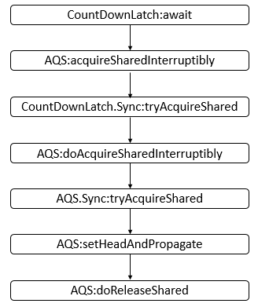
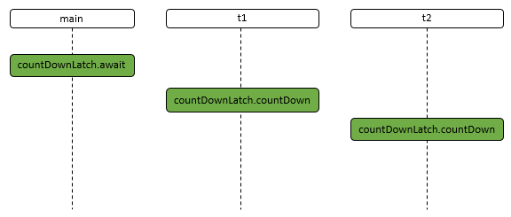
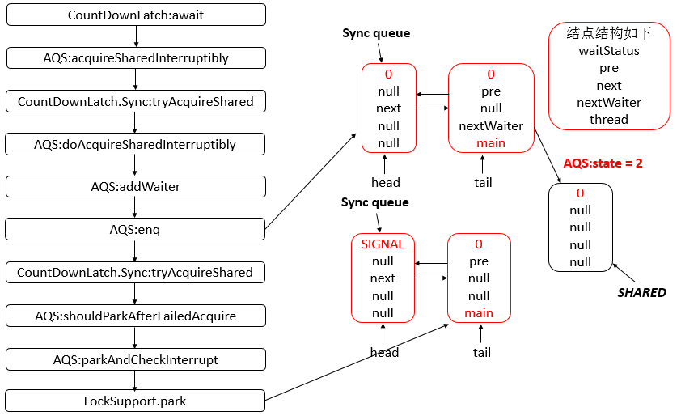
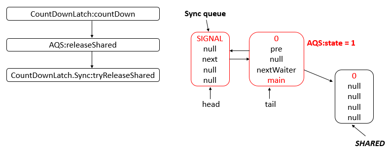
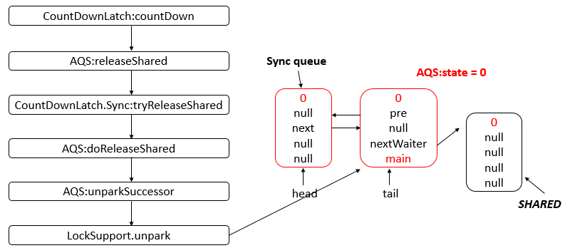
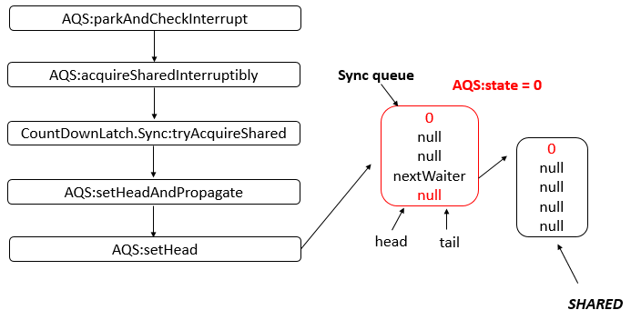

**一、前言**

分析完了CyclicBarrier后，下面分析CountDownLatch，CountDownLatch用于同步一个或多个任务，强制他们等待由其他任务执行的一组操作完成。CountDownLatch典型的用法是将一个程序分为n个互相独立的可解决任务，并创建值为n的CountDownLatch。当每一个任务完成时，都会在这个锁存器上调用countDown，等待问题被解决的任务调用这个锁存器的await，将他们自己拦住，直至锁存器计数结束。下面开始分析源码。

**二、CountDownLatch数据结构**

从源码可知，其底层是由[AQS](http://www.cnblogs.com/leesf456/p/5350186.html)提供支持，所以其数据结构可以参考AQS的数据结构，而AQS的数据结构核心就是两个虚拟队列：同步队列sync
queue 和条件队列condition
queue，不同的条件会有不同的条件队列。读者可以参考之前介绍的[AQS](http://www.cnblogs.com/leesf456/p/5350186.html)。

**三、CountDownLatch源码分析**

3.1 类的继承关系

    
    
    public class CountDownLatch {}

说明：可以看到CountDownLatch没有显示继承哪个父类或者实现哪个父接口，根据Java语言规定，可知其父类是Object。

3.2 类的内部类

CountDownLatch类存在一个内部类Sync，继承自AbstractQueuedSynchronizer，其源代码如下。

    
    
        private static final class Sync extends AbstractQueuedSynchronizer {
            // 版本号
            private static final long serialVersionUID = 4982264981922014374L;
            
            // 构造器
            Sync(int count) {
                setState(count);
            }
            
            // 返回当前计数
            int getCount() {
                return getState();
            }
    
            // 试图在共享模式下获取对象状态
            protected int tryAcquireShared(int acquires) {
                return (getState() == 0) ? 1 : -1;
            }
    
            // 试图设置状态来反映共享模式下的一个释放
            protected boolean tryReleaseShared(int releases) {
                // Decrement count; signal when transition to zero
                // 无限循环
                for (;;) {
                    // 获取状态
                    int c = getState();
                    if (c == 0) // 没有被线程占有
                        return false;
                    // 下一个状态
                    int nextc = c-1;
                    if (compareAndSetState(c, nextc)) // 比较并且设置成功
                        return nextc == 0;
                }
            }
        }

View Code

说明：对CountDownLatch方法的调用会转发到对Sync或AQS的方法的调用，所以，AQS对CountDownLatch提供支持。

3.3 类的属性

    
    
    public class CountDownLatch {
        // 同步队列
        private final Sync sync;
    }

说明：可以看到CountDownLatch类的内部只有一个Sync类型的属性，这个属性相当重要，后面会进行分析。

3.4 类的构造函数

1\. CountDownLatch(int) 型构造函数

    
    
        public CountDownLatch(int count) {
            if (count < 0) throw new IllegalArgumentException("count < 0");
            // 初始化状态数
            this.sync = new Sync(count);
        }

View Code

说明：该构造函数可以构造一个用给定计数初始化的CountDownLatch，并且构造函数内完成了sync的初始化，并设置了状态数。

3.5 核心函数分析

1\. await函数

此函数将会使当前线程在锁存器倒计数至零之前一直等待，除非线程被中断。其源码如下

    
    
        public void await() throws InterruptedException {
            // 转发到sync对象上
            sync.acquireSharedInterruptibly(1);
        }

View Code

说明：由源码可知，对CountDownLatch对象的await的调用会转发为对Sync的acquireSharedInterruptibly（从AQS继承的方法）方法的调用，acquireSharedInterruptibly源码如下

    
    
        public final void acquireSharedInterruptibly(int arg)
                throws InterruptedException {
            if (Thread.interrupted())
                throw new InterruptedException();
            if (tryAcquireShared(arg) < 0)
                doAcquireSharedInterruptibly(arg);
        }

View Code

说明：从源码中可知，acquireSharedInterruptibly又调用了CountDownLatch的内部类Sync的tryAcquireShared和AQS的doAcquireSharedInterruptibly函数。tryAcquireShared函数的源码如下

    
    
            protected int tryAcquireShared(int acquires) {
                return (getState() == 0) ? 1 : -1;
            }

View Code

说明：该函数只是简单的判断AQS的state是否为0，为0则返回1，不为0则返回-1。doAcquireSharedInterruptibly函数的源码如下

    
    
        private void doAcquireSharedInterruptibly(int arg)
            throws InterruptedException {
            // 添加节点至等待队列
            final Node node = addWaiter(Node.SHARED);
            boolean failed = true;
            try {
                for (;;) { // 无限循环
                    // 获取node的前驱节点
                    final Node p = node.predecessor();
                    if (p == head) { // 前驱节点为头结点
                        // 试图在共享模式下获取对象状态
                        int r = tryAcquireShared(arg);
                        if (r >= 0) { // 获取成功
                            // 设置头结点并进行繁殖
                            setHeadAndPropagate(node, r);
                            // 设置节点next域
                            p.next = null; // help GC
                            failed = false;
                            return;
                        }
                    }
                    if (shouldParkAfterFailedAcquire(p, node) &&
                        parkAndCheckInterrupt()) // 在获取失败后是否需要禁止线程并且进行中断检查
                        // 抛出异常
                        throw new InterruptedException();
                }
            } finally {
                if (failed)
                    cancelAcquire(node);
            }
        }

View Code

说明：在AQS的doAcquireSharedInterruptibly中可能会再次调用CountDownLatch的内部类Sync的tryAcquireShared方法和AQS的setHeadAndPropagate方法。setHeadAndPropagate方法源码如下。

    
    
        private void setHeadAndPropagate(Node node, int propagate) {
            // 获取头结点
            Node h = head; // Record old head for check below
            // 设置头结点
            setHead(node);
            /*
             * Try to signal next queued node if:
             *   Propagation was indicated by caller,
             *     or was recorded (as h.waitStatus either before
             *     or after setHead) by a previous operation
             *     (note: this uses sign-check of waitStatus because
             *      PROPAGATE status may transition to SIGNAL.)
             * and
             *   The next node is waiting in shared mode,
             *     or we don"t know, because it appears null
             *
             * The conservatism in both of these checks may cause
             * unnecessary wake-ups, but only when there are multiple
             * racing acquires/releases, so most need signals now or soon
             * anyway.
             */
            // 进行判断
            if (propagate > 0 || h == null || h.waitStatus < 0 ||
                (h = head) == null || h.waitStatus < 0) {
                // 获取节点的后继
                Node s = node.next;
                if (s == null || s.isShared()) // 后继为空或者为共享模式
                    // 以共享模式进行释放
                    doReleaseShared();
            }
        }

View Code

说明：该方法设置头结点并且释放头结点后面的满足条件的结点，该方法中可能会调用到AQS的doReleaseShared方法，其源码如下。

    
    
        private void doReleaseShared() {
            /*
             * Ensure that a release propagates, even if there are other
             * in-progress acquires/releases.  This proceeds in the usual
             * way of trying to unparkSuccessor of head if it needs
             * signal. But if it does not, status is set to PROPAGATE to
             * ensure that upon release, propagation continues.
             * Additionally, we must loop in case a new node is added
             * while we are doing this. Also, unlike other uses of
             * unparkSuccessor, we need to know if CAS to reset status
             * fails, if so rechecking.
             */
            // 无限循环
            for (;;) {
                // 保存头结点
                Node h = head;
                if (h != null && h != tail) { // 头结点不为空并且头结点不为尾结点
                    // 获取头结点的等待状态
                    int ws = h.waitStatus; 
                    if (ws == Node.SIGNAL) { // 状态为SIGNAL
                        if (!compareAndSetWaitStatus(h, Node.SIGNAL, 0)) // 不成功就继续
                            continue;            // loop to recheck cases
                        // 释放后继结点
                        unparkSuccessor(h);
                    }
                    else if (ws == 0 &&
                             !compareAndSetWaitStatus(h, 0, Node.PROPAGATE)) // 状态为0并且不成功，继续
                        continue;                // loop on failed CAS
                }
                if (h == head) // 若头结点改变，继续循环  
                    break;
            }
        }

View Code

说明：该方法在共享模式下释放，具体的流程再之后会通过一个示例给出。

所以，对CountDownLatch的await调用大致会有如下的调用链。

说明：上图给出了可能会调用到的主要方法，并非一定会调用到，之后，会通过一个示例给出详细的分析。

2\. countDown函数

此函数将递减锁存器的计数，如果计数到达零，则释放所有等待的线程

    
    
        public void countDown() {
            sync.releaseShared(1);
        }

View Code

说明：对countDown的调用转换为对Sync对象的releaseShared（从AQS继承而来）方法的调用。releaseShared源码如下

    
    
        public final boolean releaseShared(int arg) {
            if (tryReleaseShared(arg)) {
                doReleaseShared();
                return true;
            }
            return false;
        }

View Code

说明：此函数会以共享模式释放对象，并且在函数中会调用到CountDownLatch的tryReleaseShared函数，并且可能会调用AQS的doReleaseShared函数，其中，tryReleaseShared源码如下

    
    
            protected boolean tryReleaseShared(int releases) {
                // Decrement count; signal when transition to zero
                // 无限循环
                for (;;) {
                    // 获取状态
                    int c = getState();
                    if (c == 0) // 没有被线程占有
                        return false;
                    // 下一个状态
                    int nextc = c-1;
                    if (compareAndSetState(c, nextc)) // 比较并且设置成功
                        return nextc == 0;
                }
            }

View Code

说明：此函数会试图设置状态来反映共享模式下的一个释放。具体的流程在下面的示例中会进行分析。AQS的doReleaseShared的源码如下

    
    
        private void doReleaseShared() {
            /*
             * Ensure that a release propagates, even if there are other
             * in-progress acquires/releases.  This proceeds in the usual
             * way of trying to unparkSuccessor of head if it needs
             * signal. But if it does not, status is set to PROPAGATE to
             * ensure that upon release, propagation continues.
             * Additionally, we must loop in case a new node is added
             * while we are doing this. Also, unlike other uses of
             * unparkSuccessor, we need to know if CAS to reset status
             * fails, if so rechecking.
             */
            // 无限循环
            for (;;) {
                // 保存头结点
                Node h = head;
                if (h != null && h != tail) { // 头结点不为空并且头结点不为尾结点
                    // 获取头结点的等待状态
                    int ws = h.waitStatus; 
                    if (ws == Node.SIGNAL) { // 状态为SIGNAL
                        if (!compareAndSetWaitStatus(h, Node.SIGNAL, 0)) // 不成功就继续
                            continue;            // loop to recheck cases
                        // 释放后继结点
                        unparkSuccessor(h);
                    }
                    else if (ws == 0 &&
                             !compareAndSetWaitStatus(h, 0, Node.PROPAGATE)) // 状态为0并且不成功，继续
                        continue;                // loop on failed CAS
                }
                if (h == head) // 若头结点改变，继续循环  
                    break;
            }
        }

View Code

说明：此函数在共享模式下释放资源。

所以，对CountDownLatch的countDown调用大致会有如下的调用链。

说明：上图给出了可能会调用到的主要方法，并非一定会调用到，之后，会通过一个示例给出详细的分析。

**四、示例**

下面给出了一个使用CountDownLatch的示例。

    
    
     package com.hust.grid.leesf.cyclicbarrier;
    
    import java.util.concurrent.CountDownLatch;
    
    class MyThread extends Thread {
        private CountDownLatch countDownLatch;
        
        public MyThread(String name, CountDownLatch countDownLatch) {
            super(name);
            this.countDownLatch = countDownLatch;
        }
        
        public void run() {
            System.out.println(Thread.currentThread().getName() + " doing something");
            try {
                Thread.sleep(1000);
            } catch (InterruptedException e) {
                e.printStackTrace();
            }
            System.out.println(Thread.currentThread().getName() + " finish");
            countDownLatch.countDown();
        }
    }
    
    public class CountDownLatchDemo {
        public static void main(String[] args) {
            CountDownLatch countDownLatch = new CountDownLatch(2);
            MyThread t1 = new MyThread("t1", countDownLatch);
            MyThread t2 = new MyThread("t2", countDownLatch);
            t1.start();
            t2.start();
            System.out.println("Waiting for t1 thread and t2 thread to finish");
            try {
                countDownLatch.await();
            } catch (InterruptedException e) {
                e.printStackTrace();
            }            
            System.out.println(Thread.currentThread().getName() + " continue");        
        }
    }

运行结果（某一次）：

    
    
    Waiting for t1 thread and t2 thread to finish
    t1 doing something
    t2 doing something
    t1 finish
    t2 finish
    main continue

说明：本程序首先计数器初始化为2。根据结果，可能会存在如下的一种时序图。

说明：首先main线程会调用await操作，此时main线程会被阻塞，等待被唤醒，之后t1线程执行了countDown操作，最后，t2线程执行了countDown操作，此时main线程就被唤醒了，可以继续运行。下面，进行详细分析。

① main线程执行countDownLatch.await操作，主要调用的函数如下。

说明：在最后，main线程就被park了，即禁止运行了。此时Sync
queue（同步队列）中有两个节点，AQS的state为2，包含main线程的结点的nextWaiter指向SHARED结点。

② t1线程执行countDownLatch.countDown操作，主要调用的函数如下。

 说明：此时，Sync
queue队列里的结点个数未发生变化，但是此时，AQS的state已经变为1了。

③ t2线程执行countDownLatch.countDown操作，主要调用的函数如下。

说明：经过调用后，AQS的state为0，并且此时，main线程会被unpark，可以继续运行。当main线程获取cpu资源后，继续运行。

④
main线程获取cpu资源，继续运行，由于main线程是在parkAndCheckInterrupt函数中被禁止的，所以此时，继续在parkAndCheckInterrupt函数运行。

说明：main线程恢复，继续在parkAndCheckInterrupt函数中运行，之后又会回到最终达到的状态为AQS的state为0，并且head与tail指向同一个结点，该节点的额nextWaiter域还是指向SHARED结点。

**五、总结**

经过分析CountDownLatch的源码可知，其底层结构仍然是AQS，对其线程所封装的结点是采用共享模式，而ReentrantLock是采用独占模式。由于采用的共享模式，所以会导致后面的操作会有所差异，通过阅读源码就会很容易掌握CountDownLatch实现机制。谢谢各位园友的观看~

