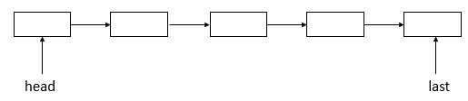

**一、前言**

分析完了ArrayBlockingQueue后，接着分析LinkedBlockingQueue，与ArrayBlockingQueue不相同，LinkedBlockingQueue底层采用的是链表结构，其源码也相对比较简单，下面进行正式的分析。

**二、LinkedBlockingQueue数据结构**

从LinkedBlockingQueue的命名就大致知道其数据结构采用的是链表结构，通过源码也可以验证我们的猜测，其数据结构如下。

说明：可以看到LinkedBlockingQueue采用的是单链表结构，包含了头结点和尾节点。

**三、LinkedBlockingQueue源码分析**

3.1 类的继承关系

    
    
    public class LinkedBlockingQueue<E> extends AbstractQueue<E>
            implements BlockingQueue<E>, java.io.Serializable {}

说明：LinkedBlockingQueue继承了AbstractQueue抽象类，AbstractQueue定义了对队列的基本操作；同时实现了BlockingQueue接口，BlockingQueue表示阻塞型的队列，其对队列的操作可能会抛出异常；同时也实现了Searializable接口，表示可以被序列化。

3.2 类的内部类

LinkedBlockingQueue内部有一个Node类，表示结点，用于存放元素，其源码如下。

    
    
        static class Node<E> {
        // 元素
            E item;
        // next域
        Node<E> next;
        // 构造函数
            Node(E x) { item = x; }
        }

说明：Node类非常简单，包含了两个域，分别用于存放元素和指示下一个结点。

3.3 类的属性

    
    
    public class LinkedBlockingQueue<E> extends AbstractQueue<E>
            implements BlockingQueue<E>, java.io.Serializable {
        // 版本序列号
        private static final long serialVersionUID = -6903933977591709194L;
        // 容量
        private final int capacity;
        // 元素的个数
        private final AtomicInteger count = new AtomicInteger();
        // 头结点
        transient Node<E> head;
        // 尾结点
        private transient Node<E> last;
        // 取元素锁
        private final ReentrantLock takeLock = new ReentrantLock();
        // 非空条件
        private final Condition notEmpty = takeLock.newCondition();
        // 存元素锁
        private final ReentrantLock putLock = new ReentrantLock();
        // 非满条件
        private final Condition notFull = putLock.newCondition();
    }

View Code

说明：可以看到LinkedBlockingQueue包含了读、写重入锁（与ArrayBlockingQueue不同，ArrayBlockingQueue只包含了一把重入锁），读写操作进行了分离，并且不同的锁有不同的Condition条件（与ArrayBlockingQueue不同，ArrayBlockingQueue是一把重入锁的两个条件）。

3.4 类的构造函数

1\. LinkedBlockingQueue()型构造函数

    
    
        public LinkedBlockingQueue() {
            this(Integer.MAX_VALUE);
        }

View Code

说明：该构造函数用于创建一个容量为 Integer.MAX_VALUE 的 LinkedBlockingQueue。

2\. LinkedBlockingQueue(int)型构造函数

    
    
        public LinkedBlockingQueue(int capacity) {
            // 初始化容量必须大于0
            if (capacity <= 0) throw new IllegalArgumentException();
            // 初始化容量
            this.capacity = capacity;
            // 初始化头结点和尾结点
            last = head = new Node<E>(null);
        }

View Code

说明：该构造函数用于创建一个具有给定（固定）容量的 LinkedBlockingQueue。

3\. LinkedBlockingQueue(Collection<? extends E>)型构造函数

    
    
        public LinkedBlockingQueue(Collection<? extends E> c) {
            // 调用重载构造函数
            this(Integer.MAX_VALUE);
            // 存锁
            final ReentrantLock putLock = this.putLock;
            // 获取锁
            putLock.lock(); // Never contended, but necessary for visibility
            try {
                int n = 0;
                for (E e : c) { // 遍历c集合
                    if (e == null) // 元素为null,抛出异常
                        throw new NullPointerException();
                    if (n == capacity) // 
                        throw new IllegalStateException("Queue full");
                    enqueue(new Node<E>(e));
                    ++n;
                }
                count.set(n);
            } finally {
                putLock.unlock();
            }
        }

View Code

说明：该构造函数用于创建一个容量是 Integer.MAX_VALUE 的 LinkedBlockingQueue，最初包含给定 collection
的元素，元素按该 collection 迭代器的遍历顺序添加。

3.5 核心函数分析

1\. put函数

    
    
        public void put(E e) throws InterruptedException {
            // 值不为空
            if (e == null) throw new NullPointerException();
            // Note: convention in all put/take/etc is to preset local var
            // holding count negative to indicate failure unless set.
            // 
            int c = -1;
            // 新生结点
            Node<E> node = new Node<E>(e);
            // 存元素锁
            final ReentrantLock putLock = this.putLock;
            // 元素个数
            final AtomicInteger count = this.count;
            // 如果当前线程未被中断，则获取锁
            putLock.lockInterruptibly();
            try {
                /*
                 * Note that count is used in wait guard even though it is
                 * not protected by lock. This works because count can
                 * only decrease at this point (all other puts are shut
                 * out by lock), and we (or some other waiting put) are
                 * signalled if it ever changes from capacity. Similarly
                 * for all other uses of count in other wait guards.
                 */
                while (count.get() == capacity) { // 元素个数到达指定容量
                    // 在notFull条件上进行等待
                    notFull.await();
                }
                // 入队列
                enqueue(node);
                // 更新元素个数，返回的是以前的元素个数
                c = count.getAndIncrement();
                if (c + 1 < capacity) // 元素个数是否小于容量
                    // 唤醒在notFull条件上等待的某个线程
                    notFull.signal();
            } finally {
                // 释放锁
                putLock.unlock();
            }
            if (c == 0) // 元素个数为0，表示已有take线程在notEmpty条件上进入了等待，则需要唤醒在notEmpty条件上等待的线程
                signalNotEmpty();
        }

View Code

说明：put函数用于存放元素，其流程如下。

① 判断元素是否为null，若是，则抛出异常，否则，进入步骤②

② 获取存元素锁，并上锁，如果当前线程被中断，则抛出异常，否则，进入步骤③

③ 判断当前队列中的元素个数是否已经达到指定容量，若是，则在notFull条件上进行等待，否则，进入步骤④

④ 将新生结点入队列，更新队列元素个数，若元素个数小于指定容量，则唤醒在notFull条件上等待的线程，表示可以继续存放元素。进入步骤⑤

⑤ 释放锁，判断结点入队列之前的元素个数是否为0，若是，则唤醒在notEmpty条件上等待的线程（表示队列中没有元素，取元素线程被阻塞了）。

put函数中会调用到enqueue函数和signalNotEmpty函数，enqueue函数源码如下

    
    
        private void enqueue(Node<E> node) {
            // assert putLock.isHeldByCurrentThread();
            // assert last.next == null;
            // 更新尾结点域
            last = last.next = node;
        }

View Code

说明：可以看到，enqueue函数只是更新了尾节点。signalNotEmpty函数源码如下

    
    
        private void signalNotEmpty() {
            // 取元素锁
            final ReentrantLock takeLock = this.takeLock;
            // 获取锁
            takeLock.lock();
            try {
                // 唤醒在notEmpty条件上等待的某个线程
                notEmpty.signal();
            } finally {
                // 释放锁
                takeLock.unlock();
            }
        }

View Code

说明：signalNotEmpty函数用于唤醒在notEmpty条件上等待的线程，其首先获取取元素锁，然后上锁，然后唤醒在notEmpty条件上等待的线程，最后释放取元素锁。

2\. offer函数

    
    
        public boolean offer(E e) {
            // 确保元素不为null
            if (e == null) throw new NullPointerException();
            // 获取计数器
            final AtomicInteger count = this.count;
            if (count.get() == capacity) // 元素个数到达指定容量
                // 返回
                return false;
            // 
            int c = -1;
            // 新生结点
            Node<E> node = new Node<E>(e);
            // 存元素锁
            final ReentrantLock putLock = this.putLock;
            // 获取锁
            putLock.lock();
            try {
                if (count.get() < capacity) { // 元素个数小于指定容量
                    // 入队列
                    enqueue(node);
                    // 更新元素个数，返回的是以前的元素个数
                    c = count.getAndIncrement();
                    if (c + 1 < capacity) // 元素个数是否小于容量
                        // 唤醒在notFull条件上等待的某个线程
                        notFull.signal();
                }
            } finally {
                // 释放锁
                putLock.unlock();
            }
            if (c == 0) // 元素个数为0，则唤醒在notEmpty条件上等待的某个线程
                signalNotEmpty();
            return c >= 0;
        }

View Code

说明：offer函数也用于存放元素，offer函数添加元素不会抛出异常（其他的域put函数类似）。

3\. take函数

    
    
        public E take() throws InterruptedException {
            E x;
            int c = -1;
            // 获取计数器
            final AtomicInteger count = this.count;
            // 获取取元素锁
            final ReentrantLock takeLock = this.takeLock;
            // 如果当前线程未被中断，则获取锁
            takeLock.lockInterruptibly();
            try {
                while (count.get() == 0) { // 元素个数为0
                    // 在notEmpty条件上等待
                    notEmpty.await();
                }
                // 出队列
                x = dequeue();
                // 更新元素个数，返回的是以前的元素个数
                c = count.getAndDecrement();
                if (c > 1) // 元素个数大于1，则唤醒在notEmpty上等待的某个线程
                    notEmpty.signal();
            } finally {
                // 释放锁
                takeLock.unlock();
            }
            if (c == capacity) // 元素个数到达指定容量
                // 唤醒在notFull条件上等待的某个线程
                signalNotFull();
            // 返回
            return x;
        }

View Code

说明：take函数用于获取一个元素，其与put函数相对应，其流程如下。

① 获取取元素锁，并上锁，如果当前线程被中断，则抛出异常，否则，进入步骤②

② 判断当前队列中的元素个数是否为0，若是，则在notEmpty条件上进行等待，否则，进入步骤③

③ 出队列，更新队列元素个数，若元素个数大于1，则唤醒在notEmpty条件上等待的线程，表示可以继续取元素。进入步骤④

④ 释放锁，判断结点出队列之前的元素个数是否为指定容量，若是，则唤醒在notFull条件上等待的线程（表示队列已满，存元素线程被阻塞了）。

take函数调用到了dequeue函数和signalNotFull函数，dequeue函数源码如下

    
    
        private E dequeue() {
            // assert takeLock.isHeldByCurrentThread();
            // assert head.item == null;
            // 头结点
            Node<E> h = head;
            // 第一个结点
            Node<E> first = h.next;
            // 头结点的next域为自身
            h.next = h; // help GC
            // 更新头结点
            head = first;
            // 返回头结点的元素
            E x = first.item;
            // 头结点的item域赋值为null
            first.item = null;
            // 返回结点元素
            return x;
        }

View Code

说明：dequeue函数的作用是将头结点更新为之前头结点的下一个结点，并且将更新后的头结点的item域设置为null。signalNotFull函数的源码如下

    
    
        private void signalNotFull() {
            // 存元素锁
            final ReentrantLock putLock = this.putLock;
            // 获取锁
            putLock.lock();
            try {
                // 唤醒在notFull条件上等待的某个线程
                notFull.signal();
            } finally {
                // 释放锁
                putLock.unlock();
            }
        }

View Code

说明：signalNotFull函数用于唤醒在notFull条件上等待的某个线程，其首先获取存元素锁，然后上锁，然后唤醒在notFull条件上等待的线程，最后释放存元素锁。

4\. poll函数

    
    
        public E poll() {
            // 获取计数器
            final AtomicInteger count = this.count;
            if (count.get() == 0) // 元素个数为0
                return null;
            // 
            E x = null;
            int c = -1;
            // 取元素锁
            final ReentrantLock takeLock = this.takeLock;
            // 获取锁
            takeLock.lock();
            try {
                if (count.get() > 0) { // 元素个数大于0
                    // 出队列
                    x = dequeue();
                    // 更新元素个数，返回的是以前的元素个数
                    c = count.getAndDecrement();
                    if (c > 1) // 元素个数大于1
                        // 唤醒在notEmpty条件上等待的某个线程
                        notEmpty.signal();
                }
            } finally {
                // 释放锁
                takeLock.unlock();
            }
            if (c == capacity) // 元素大小达到指定容量
                // 唤醒在notFull条件上等待的某个线程
                signalNotFull();
            // 返回元素
            return x;
        }

View Code

说明：poll函数也用于存放元素，poll函数添加元素不会抛出异常（其他的与take函数类似）。

5\. remove函数

    
    
        public boolean remove(Object o) {
            // 元素为null，返回false
            if (o == null) return false;
            // 获取存元素锁和取元素锁（不允许存或取元素）
            fullyLock();
            try {
                for (Node<E> trail = head, p = trail.next;
                     p != null;
                     trail = p, p = p.next) { // 遍历整个链表
                    if (o.equals(p.item)) { // 结点的值与指定值相等
                        // 断开结点
                        unlink(p, trail);
                        return true;
                    }
                }
                return false;
            } finally {
                fullyUnlock();
            }
        }

View Code

说明：remove函数的流程如下

① 获取读、写锁（防止此时继续出、入队列）。进入步骤②

② 遍历链表，寻找指定元素，若找到，则将该结点从链表中断开，有利于被GC，进入步骤③

③ 释放读、写锁（可以继续出、入队列）。步骤②中找到指定元素则返回true，否则，返回false。

其中，remove函数会调用unlink函数，其源码如下

    
    
        void unlink(Node<E> p, Node<E> trail) {
            // assert isFullyLocked();
            // p.next is not changed, to allow iterators that are
            // traversing p to maintain their weak-consistency guarantee.
            // 结点的item域赋值为null
            p.item = null;
            // 断开p结点
            trail.next = p.next;
            if (last == p) // 尾节点为p结点
                // 重新赋值尾节点
                last = trail;
            if (count.getAndDecrement() == capacity) // 更新元素个数，返回的是以前的元素个数，若结点个数到达指定容量
                // 唤醒在notFull条件上等待的某个线程
                notFull.signal();
        }

View Code

说明：unlink函数用于将指定结点从链表中断开，并且更新队列元素个数，并且判断若之前队列元素的个数达到了指定容量，则会唤醒在notFull条件上等待的某个线程。

**四、示例**

下面通过一个示例来了解LinkedBlockingQueue的使用。

    
    
     package com.hust.grid.leesf.collections;
    
    import java.util.concurrent.LinkedBlockingQueue;
    class PutThread extends Thread {
        private LinkedBlockingQueue<Integer> lbq;
        public PutThread(LinkedBlockingQueue<Integer> lbq) {
            this.lbq = lbq;
        }
        
        public void run() {
            for (int i = 0; i < 10; i++) {
                try {
                    System.out.println("put " + i);
                    lbq.put(i);
                    Thread.sleep(100);
                } catch (InterruptedException e) {
                    e.printStackTrace();
                }
            }
        }
    }
    
    class GetThread extends Thread {
        private LinkedBlockingQueue<Integer> lbq;
        public GetThread(LinkedBlockingQueue<Integer> lbq) {
            this.lbq = lbq;
        }
        
        public void run() {
            for (int i = 0; i < 10; i++) {
                try {
                    System.out.println("take " + lbq.take());
                    Thread.sleep(100);
                } catch (InterruptedException e) {
                    e.printStackTrace();
                }
            }
        }
    }
    public class LinkedBlockingQueueDemo {
        public static void main(String[] args) {
            LinkedBlockingQueue<Integer> lbq = new LinkedBlockingQueue<Integer>();
            
            PutThread p1 = new PutThread(lbq);
            GetThread g1 = new GetThread(lbq);
            
            p1.start();
            g1.start();
        }
    }

View Code

运行结果：

    
    
    put 0
    take 0
    put 1
    take 1
    put 2
    take 2
    put 3
    take 3
    put 4
    take 4
    put 5
    take 5
    put 6
    take 6
    put 7
    take 7
    put 8
    take 8
    put 9
    take 9

View Code

说明：示例中使用了两个线程，一个用于存元素，一个用于读元素，存和读各10次，每个线程存一个元素或者读一个元素后都会休眠100ms，可以看到结果是交替打
印，并且首先打印的肯定是put线程语句（因为若取线程先取元素，此时队列并没有元素，其会阻塞，等待存线程存入元素），并且最终程序可以正常结束。

① 若修改取元素线程，将存的元素的次数修改为15次（for循环的结束条件改为15即可），运行结果如下：

    
    
    put 0
    take 0
    put 1
    take 1
    put 2
    take 2
    put 3
    take 3
    put 4
    take 4
    put 5
    take 5
    put 6
    take 6
    put 7
    take 7
    put 8
    take 8
    put 9
    take 9

View Code

说明：运行结果与上面的运行结果相同，但是，此时程序无法正常结束，因为take方法被阻塞了，等待被唤醒。

**五、总结**

LinkedBlockingQueue的源码相对比较简单，其也是通过ReentrantLock和Condition条件来保证多线程的正确访问的，并且取元素（出队列）和存元素（入队列）是采用不同的锁，进行了读写分离，有利于提高并发度。LinkedBockingQueue的分析就到这里，欢迎交流，谢谢各位园友的观看~

