##【JUC】JDK1.8源码分析之ReentrantReadWriteLock（七）

##
##一、前言

##
##　　在分析了锁框架的其他类之后，下面进入锁框架中最后一个类ReentrantReadWriteLock的分析，它表示可重入读写锁，ReentrantReadWriteLock中包含了两种锁，读锁ReadLock和写锁WriteLock，可以通过这两种锁实现线程间的同步，下面开始进行分析。

##
##二、ReentrantReadWriteLock数据结构

##
##　　分析源码可以知道，ReentrantReadWriteLock底层是基于ReentrantLock和AbstractQueuedSynchronizer来实现的，所以，ReentrantReadWriteLock的数据结构也依托于AQS的数据结构，在前面对AQS的分析中已经指出了其数据结构，在这里不再累赘。

##
##三、ReentrantReadWriteLock源码分析

##
##　　3.1. 类的继承关系　　

	public class ReentrantReadWriteLock
        implements ReadWriteLock, java.io.Serializable {	}


##
##　　说明：可以看到，ReentrantReadWriteLock实现了ReadWriteLock接口，ReadWriteLock接口定义了获取读锁和写锁的规范，具体需要实现类去实现；同时其还实现了Serializable接口，表示可以进行序列化，在源代码中可以看到ReentrantReadWriteLock实现了自己的序列化逻辑。

##
##　　3.2. 类的内部类

##
##　　ReentrantReadWriteLock有五个内部类，五个内部类之间也是相互关联的。内部类的关系如下图所示。

##
## 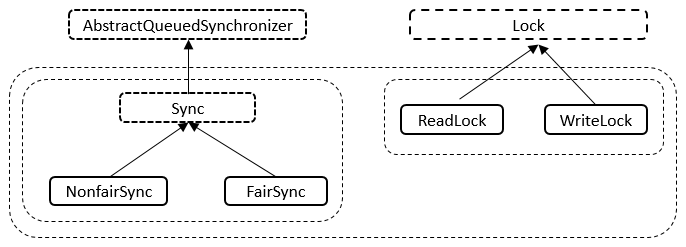

##
##　　说明：如上图所示，Sync继承自AQS、NonfairSync继承自Sync类、FairSync继承自Sync类；ReadLock实现了Lock接口、WriteLock也实现了Lock接口。

##
##　　① Sync类

##
##　　1. 类的继承关系　

	abstract static class Sync extends AbstractQueuedSynchronizer {	}


##
##　　说明：Sync抽象类继承自AQS抽象类，Sync类提供了对ReentrantReadWriteLock的支持。

##
##　　2. 类的内部类

##
##　　Sync类内部存在两个内部类，分别为HoldCounter和ThreadLocalHoldCounter，其中HoldCounter主要与读锁配套使用，其中，HoldCounter源码如下。
  

	        // 计数器
        static final class HoldCounter {
            // 计数
            int count = 0;
            // Use id, not reference, to avoid garbage retention
            // 获取当前线程的TID属性的值
            final long tid = getThreadId(Thread.currentThread());
        	}

View Code

##
##　　说明：HoldCounter主要有两个属性，count和tid，其中count表示某个读线程重入的次数，tid表示该线程的tid字段的值，该字段可以用来唯一标识一个线程。ThreadLocalHoldCounter的源码如下　　
  

	        // 本地线程计数器
        static final class ThreadLocalHoldCounter
            extends ThreadLocal<HoldCounter> {
            // 重写初始化方法，在没有进行set的情况下，获取的都是该HoldCounter值
            public HoldCounter initialValue() {
                return new HoldCounter();
            	}
        	}

View Code

##
##　　说明：ThreadLocalHoldCounter重写了ThreadLocal的initialValue方法，ThreadLocal类可以将线程与对象相关联。在没有进行set的情况下，get到的均是initialValue方法里面生成的那个HolderCounter对象。

##
##　　3. 类的属性　
  

	    abstract static class Sync extends AbstractQueuedSynchronizer {
        // 版本序列号
        private static final long serialVersionUID = 6317671515068378041L;        
        // 高16位为读锁，低16位为写锁
        static final int SHARED_SHIFT   = 16;
        // 读锁单位
        static final int SHARED_UNIT    = (1 << SHARED_SHIFT);
        // 读锁最大数量
        static final int MAX_COUNT      = (1 << SHARED_SHIFT) - 1;
        // 写锁最大数量
        static final int EXCLUSIVE_MASK = (1 << SHARED_SHIFT) - 1;
        // 本地线程计数器
        private transient ThreadLocalHoldCounter readHolds;
        // 缓存的计数器
        private transient HoldCounter cachedHoldCounter;
        // 第一个读线程
        private transient Thread firstReader = null;
        // 第一个读线程的计数
        private transient int firstReaderHoldCount;
    	}

View Code

##
##　　说明：该属性中包括了读锁、写锁线程的最大量。本地线程计数器等。

##
##　　4. 类的构造函数　　
  

	        // 构造函数
        Sync() {
            // 本地线程计数器
            readHolds = new ThreadLocalHoldCounter();
            // 设置AQS的状态
            setState(getState()); // ensures visibility of readHolds
        	}

View Code

##
##　　说明：在Sync的构造函数中设置了本地线程计数器和AQS的状态state。

##
##　　5. 核心函数分析

##
##　　对ReentrantReadWriteLock对象的操作绝大多数都转发至Sync对象进行处理。下面对Sync类中的重点函数进行分析

##
##　　I. sharedCount函数

##
##　　表示占有读锁的线程数量，源码如下　

	static int sharedCount(int c)    { return c >>> SHARED_SHIFT; 	}


##
##　　说明：直接将state右移16位，就可以得到读锁的线程数量，因为state的高16位表示读锁，对应的第十六位表示写锁数量。

##
##　　II. exclusiveCount函数

##
##　　表示占有写锁的线程数量，源码如下　　

	static int exclusiveCount(int c) { return c &amp; EXCLUSIVE_MASK; 	}


##
##　　说明：直接将状态state和（2^16 - 1）做与运算，其等效于将state模上2^16。写锁数量由state的低十六位表示。

##
##　　III. tryRelease函数　　
  

	        protected final boolean tryAcquire(int acquires) {
            /*
             * Walkthrough:
             * 1. If read count nonzero or write count nonzero
             *    and owner is a different thread, fail.
             * 2. If count would saturate, fail. (This can only
             *    happen if count is already nonzero.)
             * 3. Otherwise, this thread is eligible for lock if
             *    it is either a reentrant acquire or
             *    queue policy allows it. If so, update state
             *    and set owner.
             */
            // 获取当前线程
            Thread current = Thread.currentThread();
            // 获取状态
            int c = getState();
            // 写线程数量
            int w = exclusiveCount(c);
            if (c != 0) { // 状态不为0
                // (Note: if c != 0 and w == 0 then shared count != 0)
                if (w == 0 || current != getExclusiveOwnerThread()) // 写线程数量为0或者当前线程没有占有独占资源
                    return false;
                if (w + exclusiveCount(acquires) > MAX_COUNT) // 判断是否超过最高写线程数量
                    throw new Error("Maximum lock count exceeded");
                // Reentrant acquire
                // 设置AQS状态
                setState(c + acquires);
                return true;
            	}
            if (writerShouldBlock() ||
                !compareAndSetState(c, c + acquires)) // 写线程是否应该被阻塞
                return false;
            // 设置独占线程
            setExclusiveOwnerThread(current);
            return true;
        	}

View Code

##
##　　说明：此函数用于释放写锁资源，首先会判断该线程是否为独占线程，若不为独占线程，则抛出异常，否则，计算释放资源后的写锁的数量，若为0，表示成功释放，资源不将被占用，否则，表示资源还被占用。其函数流程图如下。

##
## 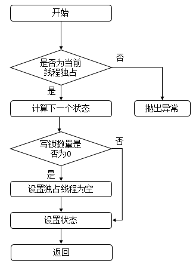

##
##　　IV. tryAcquire函数　　
  

	        protected final boolean tryAcquire(int acquires) {
            /*
             * Walkthrough:
             * 1. If read count nonzero or write count nonzero
             *    and owner is a different thread, fail.
             * 2. If count would saturate, fail. (This can only
             *    happen if count is already nonzero.)
             * 3. Otherwise, this thread is eligible for lock if
             *    it is either a reentrant acquire or
             *    queue policy allows it. If so, update state
             *    and set owner.
             */
            // 获取当前线程
            Thread current = Thread.currentThread();
            // 获取状态
            int c = getState();
            // 写线程数量
            int w = exclusiveCount(c);
            if (c != 0) { // 状态不为0
                // (Note: if c != 0 and w == 0 then shared count != 0)
                if (w == 0 || current != getExclusiveOwnerThread()) // 写线程数量为0或者当前线程没有占有独占资源
                    return false;
                if (w + exclusiveCount(acquires) > MAX_COUNT) // 判断是否超过最高写线程数量
                    throw new Error("Maximum lock count exceeded");
                // Reentrant acquire
                // 设置AQS状态
                setState(c + acquires);
                return true;
            	}
            if (writerShouldBlock() ||
                !compareAndSetState(c, c + acquires)) // 写线程是否应该被阻塞
                return false;
            // 设置独占线程
            setExclusiveOwnerThread(current);
            return true;
        	}

View Code

##
##　　说明：此函数用于获取写锁，首先会获取state，判断是否为0，若为0，表示此时没有读锁线程，再判断写线程是否应该被阻塞，而在非公平策略下总是不会被阻塞，在公平策略下会进行判断（判断同步队列中是否有等待时间更长的线程，若存在，则需要被阻塞，否则，无需阻塞），之后在设置状态state，然后返回true。若state不为0，则表示此时存在读锁或写锁线程，若写锁线程数量为0或者当前线程为独占锁线程，则返回false，表示不成功，否则，判断写锁线程的重入次数是否大于了最大值，若是，则抛出异常，否则，设置状态state，返回true，表示成功。其函数流程图如下

##
## 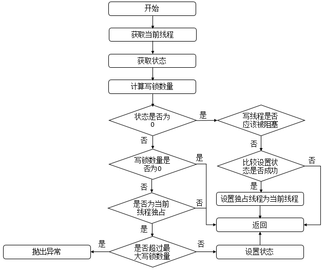　　V. tryReleaseShared函数　
  

	        protected final boolean tryReleaseShared(int unused) {
            // 获取当前线程
            Thread current = Thread.currentThread();
            if (firstReader == current) { // 当前线程为第一个读线程
                // assert firstReaderHoldCount > 0;
                if (firstReaderHoldCount == 1) // 读线程占用的资源数为1
                    firstReader = null;
                else // 减少占用的资源
                    firstReaderHoldCount--;
            	} else { // 当前线程不为第一个读线程
                // 获取缓存的计数器
                HoldCounter rh = cachedHoldCounter;
                if (rh == null || rh.tid != getThreadId(current)) // 计数器为空或者计数器的tid不为当前正在运行的线程的tid
                    // 获取当前线程对应的计数器
                    rh = readHolds.get();
                // 获取计数
                int count = rh.count;
                if (count <= 1) { // 计数小于等于1
                    // 移除
                    readHolds.remove();
                    if (count <= 0) // 计数小于等于0，抛出异常
                        throw unmatchedUnlockException();
                	}
                // 减少计数
                --rh.count;
            	}
            for (;;) { // 无限循环
                // 获取状态
                int c = getState();
                // 获取状态
                int nextc = c - SHARED_UNIT;
                if (compareAndSetState(c, nextc)) // 比较并进行设置
                    // Releasing the read lock has no effect on readers,
                    // but it may allow waiting writers to proceed if
                    // both read and write locks are now free.
                    return nextc == 0;
            	}
        	}

View Code

##
##　　说明：此函数表示读锁线程释放锁。首先判断当前线程是否为第一个读线程firstReader，若是，则判断第一个读线程占有的资源数firstReaderHoldCount是否为1，若是，则设置第一个读线程firstReader为空，否则，将第一个读线程占有的资源数firstReaderHoldCount减1；若当前线程不是第一个读线程，那么首先会获取缓存计数器（上一个读锁线程对应的计数器 ），若计数器为空或者tid不等于当前线程的tid值，则获取当前线程的计数器，如果计数器的计数count小于等于1，则移除当前线程对应的计数器，如果计数器的计数count小于等于0，则抛出异常，之后再减少计数即可。无论何种情况，都会进入无限循环，该循环可以确保成功设置状态state。其流程图如下

##
## 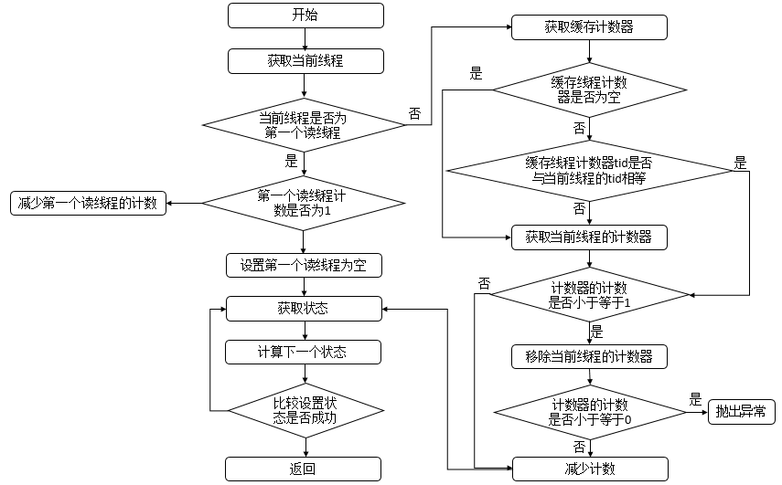　　VI. tryAcquireShared函数　
  

	        private IllegalMonitorStateException unmatchedUnlockException() {
            return new IllegalMonitorStateException(
                "attempt to unlock read lock, not locked by current thread");
        	}
        
        // 共享模式下获取资源
        protected final int tryAcquireShared(int unused) {
            /*
             * Walkthrough:
             * 1. If write lock held by another thread, fail.
             * 2. Otherwise, this thread is eligible for
             *    lock wrt state, so ask if it should block
             *    because of queue policy. If not, try
             *    to grant by CASing state and updating count.
             *    Note that step does not check for reentrant
             *    acquires, which is postponed to full version
             *    to avoid having to check hold count in
             *    the more typical non-reentrant case.
             * 3. If step 2 fails either because thread
             *    apparently not eligible or CAS fails or count
             *    saturated, chain to version with full retry loop.
             */
            // 获取当前线程
            Thread current = Thread.currentThread();
            // 获取状态
            int c = getState();
            if (exclusiveCount(c) != 0 &amp;&amp;
                getExclusiveOwnerThread() != current) // 写线程数不为0并且占有资源的不是当前线程
                return -1;
            // 读锁数量
            int r = sharedCount(c);
            if (!readerShouldBlock() &amp;&amp;
                r < MAX_COUNT &amp;&amp;
                compareAndSetState(c, c + SHARED_UNIT)) { // 读线程是否应该被阻塞、并且小于最大值、并且比较设置成功
                if (r == 0) { // 读锁数量为0
                    // 设置第一个读线程
                    firstReader = current;
                    // 读线程占用的资源数为1
                    firstReaderHoldCount = 1;
                	} else if (firstReader == current) { // 当前线程为第一个读线程
                    // 占用资源数加1
                    firstReaderHoldCount++;
                	} else { // 读锁数量不为0并且不为当前线程
                    // 获取计数器
                    HoldCounter rh = cachedHoldCounter;
                    if (rh == null || rh.tid != getThreadId(current)) // 计数器为空或者计数器的tid不为当前正在运行的线程的tid
                        // 获取当前线程对应的计数器
                        cachedHoldCounter = rh = readHolds.get();
                    else if (rh.count == 0) // 计数为0
                        // 设置
                        readHolds.set(rh);
                    rh.count++;
                	}
                return 1;
            	}
            return fullTryAcquireShared(current);
        	}

View Code

##
##　　说明：此函数表示读锁线程获取读锁。首先判断写锁是否为0并且当前线程不占有独占锁，直接返回；否则，判断读线程是否需要被阻塞并且读锁数量是否小于最大值并且比较设置状态成功，若当前没有读锁，则设置第一个读线程firstReader和firstReaderHoldCount；若当前线程线程为第一个读线程，则增加firstReaderHoldCount；否则，将设置当前线程对应的HoldCounter对象的值。流程图如下。

##
## 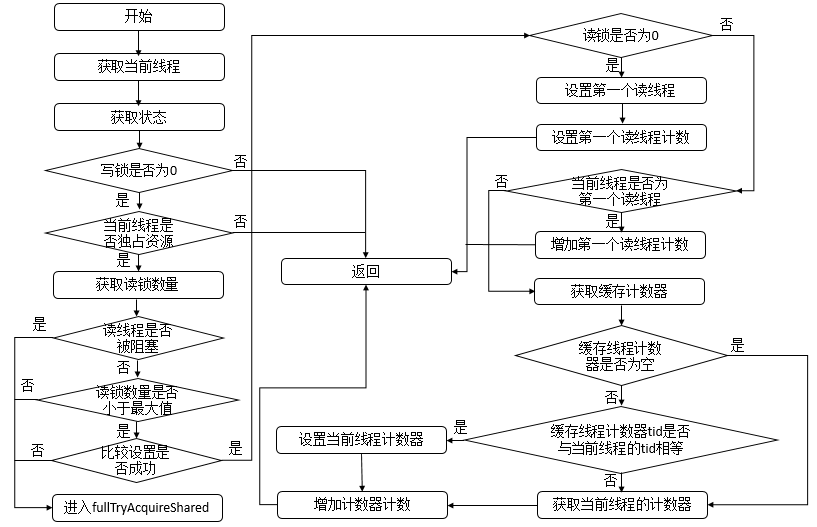　　VII.fullTryAcquireShared函数　
  

	        final int fullTryAcquireShared(Thread current) {
            /*
             * This code is in part redundant with that in
             * tryAcquireShared but is simpler overall by not
             * complicating tryAcquireShared with interactions between
             * retries and lazily reading hold counts.
             */
            HoldCounter rh = null;
            for (;;) { // 无限循环
                // 获取状态
                int c = getState();
                if (exclusiveCount(c) != 0) { // 写线程数量不为0
                    if (getExclusiveOwnerThread() != current) // 不为当前线程
                        return -1;
                    // else we hold the exclusive lock; blocking here
                    // would cause deadlock.
                	} else if (readerShouldBlock()) { // 写线程数量为0并且读线程被阻塞
                    // Make sure we"re not acquiring read lock reentrantly
                    if (firstReader == current) { // 当前线程为第一个读线程
                        // assert firstReaderHoldCount > 0;
                    	} else { // 当前线程不为第一个读线程
                        if (rh == null) { // 计数器不为空
                            // 
                            rh = cachedHoldCounter;
                            if (rh == null || rh.tid != getThreadId(current)) { // 计数器为空或者计数器的tid不为当前正在运行的线程的tid
                                rh = readHolds.get();
                                if (rh.count == 0)
                                    readHolds.remove();
                            	}
                        	}
                        if (rh.count == 0)
                            return -1;
                    	}
                	}
                if (sharedCount(c) == MAX_COUNT) // 读锁数量为最大值，抛出异常
                    throw new Error("Maximum lock count exceeded");
                if (compareAndSetState(c, c + SHARED_UNIT)) { // 比较并且设置成功
                    if (sharedCount(c) == 0) { // 读线程数量为0
                        // 设置第一个读线程
                        firstReader = current;
                        // 
                        firstReaderHoldCount = 1;
                    	} else if (firstReader == current) {
                        firstReaderHoldCount++;
                    	} else {
                        if (rh == null)
                            rh = cachedHoldCounter;
                        if (rh == null || rh.tid != getThreadId(current))
                            rh = readHolds.get();
                        else if (rh.count == 0)
                            readHolds.set(rh);
                        rh.count++;
                        cachedHoldCounter = rh; // cache for release
                    	}
                    return 1;
                	}
            	}
        	}

View Code

##
##　　说明：在tryAcquireShared函数中，如果下列三个条件不满足（读线程是否应该被阻塞、小于最大值、比较设置成功）则会进行fullTryAcquireShared函数中，它用来保证相关操作可以成功。其逻辑与tryAcquireShared逻辑类似，不再累赘。

##
##　　而其他内部类的操作基本上都是转化到了对Sync对象的操作，在此不再累赘。

##
##　　3.3. 类的属性　　
  

	public class ReentrantReadWriteLock
        implements ReadWriteLock, java.io.Serializable {
    // 版本序列号    
    private static final long serialVersionUID = -6992448646407690164L;    
    // 读锁
    private final ReentrantReadWriteLock.ReadLock readerLock;
    // 写锁
    private final ReentrantReadWriteLock.WriteLock writerLock;
    // 同步队列
    final Sync sync;
    
    private static final sun.misc.Unsafe UNSAFE;
    // 线程ID的偏移地址
    private static final long TID_OFFSET;
    static {
        try {
            UNSAFE = sun.misc.Unsafe.getUnsafe();
            Class<?> tk = Thread.class;
            // 获取线程的tid字段的内存地址
            TID_OFFSET = UNSAFE.objectFieldOffset
                (tk.getDeclaredField("tid"));
        	} catch (Exception e) {
            throw new Error(e);
        	}
    	}
	}

View Code

##
##　　说明：可以看到ReentrantReadWriteLock属性包括了一个ReentrantReadWriteLock.ReadLock对象，表示读锁；一个ReentrantReadWriteLock.WriteLock对象，表示写锁；一个Sync对象，表示同步队列。

##
##　　3.4. 类的构造函数

##
##　　1. ReentrantReadWriteLock()型构造函数　　
  

	    public ReentrantReadWriteLock() {
        this(false);
    	}

View Code

##
##　　说明：此构造函数会调用另外一个有参构造函数。

##
##　　2. ReentrantReadWriteLock(boolean)型构造函数　
  

	    public ReentrantReadWriteLock(boolean fair) {
        // 公平策略或者是非公平策略
        sync = fair ? new FairSync() : new NonfairSync();
        // 读锁
        readerLock = new ReadLock(this);
        // 写锁
        writerLock = new WriteLock(this);
    	}

View Code

##
##　　说明：可以指定设置公平策略或者非公平策略，并且该构造函数中生成了读锁与写锁两个对象。

##
##　　3.5 核心函数分析

##
##　　对ReentrantReadWriteLock的操作基本上都转化为了对Sync对象的操作，而Sync的函数已经分析过，不再累赘。

##
##四、示例

##
##　　下面给出了一个使用ReentrantReadWriteLock的示例，源代码如下。
  

	package com.hust.grid.leesf.reentrantreadwritelock;

import java.util.concurrent.locks.ReentrantReadWriteLock;

class ReadThread extends Thread {
    private ReentrantReadWriteLock rrwLock;
    
    public ReadThread(String name, ReentrantReadWriteLock rrwLock) {
        super(name);
        this.rrwLock = rrwLock;
    	}
    
    public void run() {
        System.out.println(Thread.currentThread().getName() + " trying to lock");
        try {
            rrwLock.readLock().lock();
            System.out.println(Thread.currentThread().getName() + " lock successfully");
            Thread.sleep(5000);        
        	} catch (InterruptedException e) {
            e.printStackTrace();
        	} finally {
            rrwLock.readLock().unlock();
            System.out.println(Thread.currentThread().getName() + " unlock successfully");
        	}
    	}
	}

class WriteThread extends Thread {
    private ReentrantReadWriteLock rrwLock;
    
    public WriteThread(String name, ReentrantReadWriteLock rrwLock) {
        super(name);
        this.rrwLock = rrwLock;
    	}
    
    public void run() {
        System.out.println(Thread.currentThread().getName() + " trying to lock");
        try {
            rrwLock.writeLock().lock();
            System.out.println(Thread.currentThread().getName() + " lock successfully");    
        	} finally {
            rrwLock.writeLock().unlock();
            System.out.println(Thread.currentThread().getName() + " unlock successfully");
        	}
    	}
	}

public class ReentrantReadWriteLockDemo {
    public static void main(String[] args) {
        ReentrantReadWriteLock rrwLock = new ReentrantReadWriteLock();
        ReadThread rt1 = new ReadThread("rt1", rrwLock);
        ReadThread rt2 = new ReadThread("rt2", rrwLock);
        WriteThread wt1 = new WriteThread("wt1", rrwLock);
        rt1.start();
        rt2.start();
        wt1.start();
    	} 
	}

View Code

##
##　　运行结果（某一次）：　　

	rt1 trying to lockrt2 trying to lockwt1 trying to lockrt1 lock successfullyrt2 lock successfullyrt1 unlock successfullyrt2 unlock successfullywt1 lock successfullywt1 unlock successfully


##
##　　说明：程序中生成了一个ReentrantReadWriteLock对象，并且设置了两个读线程，一个写线程。根据结果，可能存在如下的时序图。

##
## 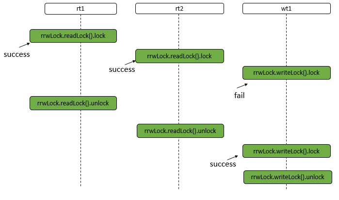　　① rt1线程执行rrwLock.readLock().lock操作，主要的函数调用如下。

##
## 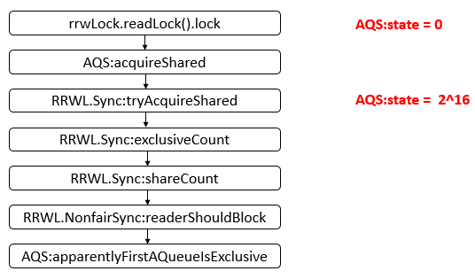　　说明：此时，AQS的状态state为2^16 次方，即表示此时读线程数量为1。

##
##　　② rt2线程执行rrwLock.readLock().lock操作，主要的函数调用如下。

##
## 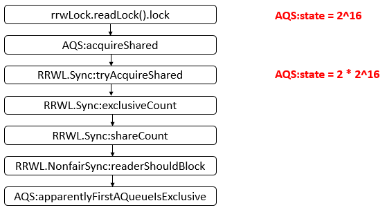　　说明：此时，AQS的状态state为2 * 2^16次方，即表示此时读线程数量为2。

##
##　　③ wt1线程执行rrwLock.writeLock().lock操作，主要的函数调用如下。

##
## 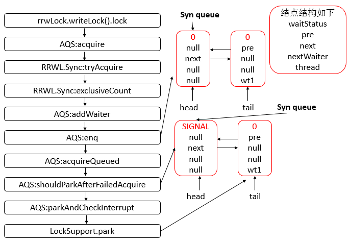

##
##　　说明：此时，在同步队列Sync queue中存在两个结点，并且wt1线程会被禁止运行。

##
##　　④ rt1线程执行rrwLock.readLock().unlock操作，主要的函数调用如下。

##
## 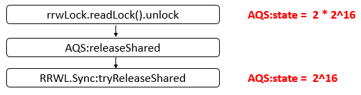　　说明：此时，AQS的state为2^16次方，表示还有一个读线程。

##
##　　⑤ rt2线程执行rrwLock.readLock().unlock操作，主要的函数调用如下。

##
## 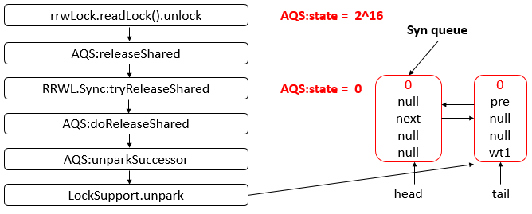　　说明：当rt2线程执行unlock操作后，AQS的state为0，并且wt1线程将会被unpark，其获得CPU资源就可以运行。

##
##　　⑥ wt1线程获得CPU资源，继续运行，需要恢复。由于之前acquireQueued函数中的parkAndCheckInterrupt函数中被禁止的，所以，恢复到parkAndCheckInterrupt函数中，主要的函数调用如下

##
## 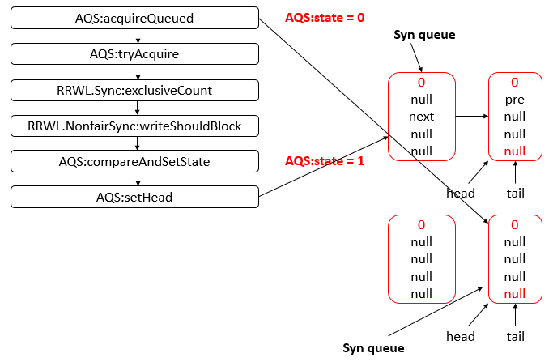

##
##　　说明：最后，sync queue队列中只有一个结点，并且头结点尾节点均指向它，AQS的state值为1，表示此时有一个写线程。

##
##　　⑦ wt1执行rrwLock.writeLock().unlock操作，主要的函数调用如下。

##
## 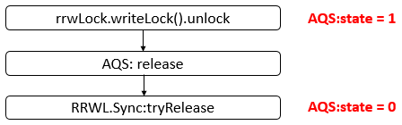

##
##　　说明：此时，AQS的state为0，表示没有任何读线程或者写线程了。并且Sync queue结构与上一个状态的结构相同，没有变化。

##
##五、总结

##
##　　经过分析ReentrantReadWriteLock的源码，可知其可以实现多个线程同时读，此时，写线程会被阻塞。并且，写线程获取写入锁后可以获取读取锁，然后释放写入锁，这样写入锁变成了读取锁。至此，并发框架中的锁框架就已经全部介绍完成了，通过分析源码，有了不少收获，谢谢各位园友的观看~