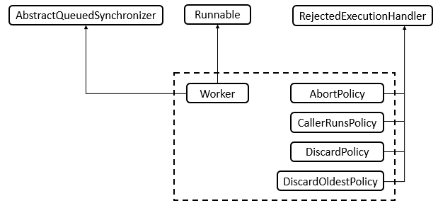
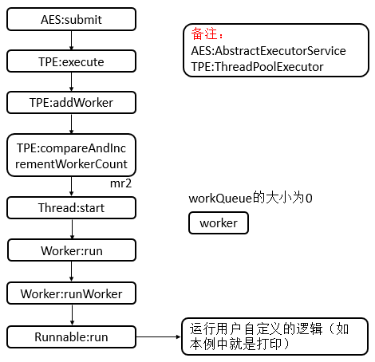
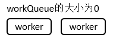
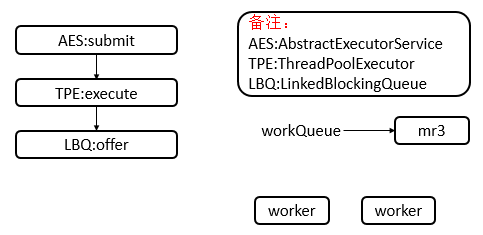
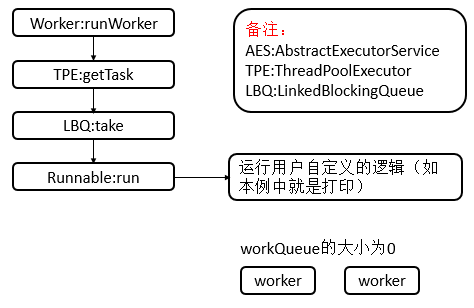
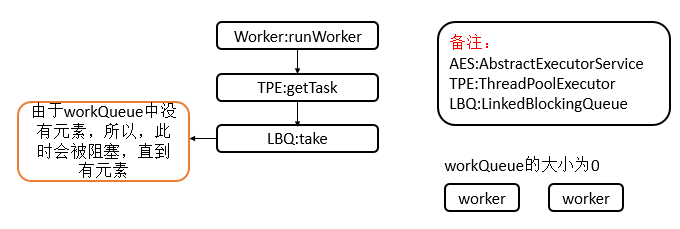
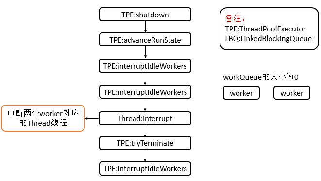
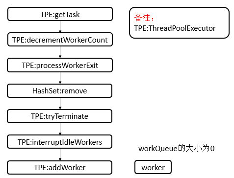
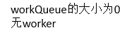
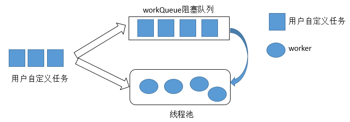

**一、前言**

JUC这部分还有线程池这一块没有分析，需要抓紧时间分析，下面开始ThreadPoolExecutor，其是线程池的基础，分析完了这个类会简化之后的分析，线程池可以解决两个不同问题：由于减少了每个任务调用的开销，它们通常可以在执行大量异步任务时提供增强的性能，并且还可以提供绑定和管理资源（包括执行任务集时使用的线程）的方法。下面开始分析。

**二、ThreadPoolExecutor数据结构**

在ThreadPoolExecutor的内部，主要由BlockingQueue和AbstractQueuedSynchronizer对其提供支持，BlockingQueue接口有多种数据结构的实现，如[LinkedBlockingQueue](http://www.cnblogs.com/leesf456/p/5539071.html)、[ArrayBlockingQueue](http://www.cnblogs.com/leesf456/p/5533770.html)等，而[AbstractQueuedSynchronizer](http://www.cnblogs.com/leesf456/p/5350186.html)在之前有过详细的分析，有兴趣的读者可以参考。

**三、ThreadPoolExecutor源码分析**

3.1 类的继承关系

    
    
    public class ThreadPoolExecutor extends AbstractExecutorService {}

说明：ThreadPoolExecutor继承自AbstractExecutorService，AbstractExecuetorService提供了ExecutorService执行方法的默认实现。

3.2 类的内部类

ThreadPoolExecutor的核心内部类为Worker，其对资源进行了复用，减少创建线程的开销，还有若干个策略类。内部类的类图如下

说明：可以看到Worker继承了AQS抽象类并且实现了Runnable接口，其是ThreadPoolExecutor的核心内部类。而对于AbortPolicy，用于被拒绝任务的处理程序，它将抛出
RejectedExecutionException``、CallerRunsPolicy，用于被拒绝任务的处理程序，它直接在 execute
方法的调用线程中运行被拒绝的任务；如果执行程序已关闭，则会丢弃该任务、DiscardPolicy，用于被拒绝任务的处理程序，默认情况下它将丢弃被拒绝的任务、DiscardOldestPolicy，用于被拒绝任务的处理程序，它放弃最旧的未处理请求，然后重试
`execute`；如果执行程序已关闭，则会丢弃该任务。这些都是拒绝任务提交时的所采用的不同策略。

① Worker类

1\. 类的继承关系

    
    
    private final class Worker 
        extends AbstractQueuedSynchronizer 
        implements Runnable {}

说明：Worker继承了AQS抽象类，其重写了AQS的一些方法，并且其也可作为一个Runnable对象，从而可以创建线程Thread。

2\. 类的属性

    
    
        private final class Worker
            extends AbstractQueuedSynchronizer
            implements Runnable
        {
            /**
             * This class will never be serialized, but we provide a
             * serialVersionUID to suppress a javac warning.
             */
            // 版本号
            private static final long serialVersionUID = 6138294804551838833L;
    
            /** Thread this worker is running in.  Null if factory fails. */
            // worker 所对应的线程
            final Thread thread;
            /** Initial task to run.  Possibly null. */
            // worker所对应的第一个任务
            Runnable firstTask;
            /** Per-thread task counter */
            // 已完成任务数量
            volatile long completedTasks;
        }

View Code

说明：Worker属性中比较重要的属性如下，Thread类型的thread属性，用来封装worker（因为worker为Runnable对象），表示一个线程；Runnable类型的firstTask，其表示该worker所包含的Runnable对象，即用户自定义的Runnable对象，完成用户自定义的逻辑的Runnable对象；volatile修饰的long类型的completedTasks，表示已完成的任务数量。

3\. 类的构造函数

    
    
            Worker(Runnable firstTask) {
                // 设置状态为-1
                setState(-1); // inhibit interrupts until runWorker
                // 初始化第一个任务
                this.firstTask = firstTask;
                // 根据当前worker，初始化线程
                this.thread = getThreadFactory().newThread(this);
            }

View Code

说明：用于构造一个worker对象，并设置AQS的state为-1，同时初始化了对应的域。

4\. 核心函数分析

    
    
    // 重写了Runnable的run方法
            public void run() {
                runWorker(this);
            }
    
            // Lock methods
            //
            // The value 0 represents the unlocked state.
            // The value 1 represents the locked state.
            // 是否被独占,0代表未被独占，1代表被独占
            protected boolean isHeldExclusively() {
                return getState() != 0;
            }
            // 尝试获取
            protected boolean tryAcquire(int unused) {
                if (compareAndSetState(0, 1)) { // 比较并设置状态成功
                    // 设置独占线程
                    setExclusiveOwnerThread(Thread.currentThread());
                    return true;
                }
                return false;
            }
            // 尝试释放
            protected boolean tryRelease(int unused) {
                // 设置独占线程为null
                setExclusiveOwnerThread(null);
                // 设置状态为0
                setState(0);
                return true;
            }
            // 获取锁
            public void lock()        { acquire(1); }
            // 尝试获取锁
            public boolean tryLock()  { return tryAcquire(1); }
            // 释放锁
            public void unlock()      { release(1); }
            // 是否被独占
            public boolean isLocked() { return isHeldExclusively(); }
            // 
            void interruptIfStarted() {
                Thread t;
                if (getState() >= 0 && (t = thread) != null && !t.isInterrupted()) { // AQS状态大于等于0并且worker对应的线程不为null并且该线程没有被中断
                    try {
                        // 中断线程
                        t.interrupt();
                    } catch (SecurityException ignore) {
                    }
                }
            }

View Code

说明：Worker的函数主要是重写了AQS的相应函数和重写了Runnable的run函数，重写的函数比较简单，具体的可以参见AQS的分析，这里不再累赘。

3.3 类的属性

    
    
    public class ThreadPoolExecutor extends AbstractExecutorService {
        // 线程池的控制状态（用来表示线程池的运行状态（整形的高3位）和运行的worker数量（低29位））
        private final AtomicInteger ctl = new AtomicInteger(ctlOf(RUNNING, 0));
        // 29位的偏移量
        private static final int COUNT_BITS = Integer.SIZE - 3;
        // 最大容量（2^29 - 1）
        private static final int CAPACITY   = (1 << COUNT_BITS) - 1;
    
        // runState is stored in the high-order bits
        // 线程运行状态，总共有5个状态，需要3位来表示（所以偏移量的29 = 32 - 3）
        private static final int RUNNING    = -1 << COUNT_BITS;
        private static final int SHUTDOWN   =  0 << COUNT_BITS;
        private static final int STOP       =  1 << COUNT_BITS;
        private static final int TIDYING    =  2 << COUNT_BITS;
        private static final int TERMINATED =  3 << COUNT_BITS;
        // 阻塞队列
        private final BlockingQueue<Runnable> workQueue;
        // 可重入锁
        private final ReentrantLock mainLock = new ReentrantLock();
        // 存放工作线程集合
        private final HashSet<Worker> workers = new HashSet<Worker>();
        // 终止条件
        private final Condition termination = mainLock.newCondition();
        // 最大线程池容量
        private int largestPoolSize;
        // 已完成任务数量
        private long completedTaskCount;
        // 线程工厂
        private volatile ThreadFactory threadFactory;
        // 拒绝执行处理器
        private volatile RejectedExecutionHandler handler;
        // 线程等待运行时间
        private volatile long keepAliveTime;
        // 是否运行核心线程超时
        private volatile boolean allowCoreThreadTimeOut;
        // 核心池的大小
        private volatile int corePoolSize;
        // 最大线程池大小
        private volatile int maximumPoolSize;
        // 默认拒绝执行处理器
        private static final RejectedExecutionHandler defaultHandler =
            new AbortPolicy();
        //
        private static final RuntimePermission shutdownPerm =
            new RuntimePermission("modifyThread");
    }    

View Code

说明：这里着重讲解一下AtomicInteger类型的ctl属性，ctl为线程池的控制状态，用来表示线程池的运行状态（整形的高3位）和运行的worker数量（低29位）），其中，线程池的运行状态有如下几种

    
    
        /**
        * RUNNING    :    接受新任务并且处理已经进入阻塞队列的任务
        * SHUTDOWN    ：    不接受新任务，但是处理已经进入阻塞队列的任务
        * STOP        :    不接受新任务，不处理已经进入阻塞队列的任务并且中断正在运行的任务
        * TIDYING    :    所有的任务都已经终止，workerCount为0， 线程转化为TIDYING状态并且调用terminated钩子函数
        * TERMINATED:    terminated钩子函数已经运行完成
        **/
        private static final int RUNNING    = -1 << COUNT_BITS;
        private static final int SHUTDOWN   =  0 << COUNT_BITS;
        private static final int STOP       =  1 << COUNT_BITS;
        private static final int TIDYING    =  2 << COUNT_BITS;
        private static final int TERMINATED =  3 << COUNT_BITS;

说明：由于有5种状态，最少需要3位表示，所以采用的AtomicInteger的高3位来表示，低29位用来表示worker的数量，即最多表示2^29 - 1。

3.4 类的构造函数

1\. ThreadPoolExecutor(int, int, long, TimeUnit, BlockingQueue<Runnable>)型构造函数

    
    
        public ThreadPoolExecutor(int corePoolSize,
                                  int maximumPoolSize,
                                  long keepAliveTime,
                                  TimeUnit unit,
                                  BlockingQueue<Runnable> workQueue) {
            this(corePoolSize, maximumPoolSize, keepAliveTime, unit, workQueue,
                 Executors.defaultThreadFactory(), defaultHandler);
        }

View Code

说明：该构造函数用给定的初始参数和默认的线程工厂及被拒绝的执行处理程序创建新的 ThreadPoolExecutor。

2\. ThreadPoolExecutor(int, int, long, TimeUnit, BlockingQueue<Runnable>,
ThreadFactory)型构造函数

    
    
        public ThreadPoolExecutor(int corePoolSize,
                                  int maximumPoolSize,
                                  long keepAliveTime,
                                  TimeUnit unit,
                                  BlockingQueue<Runnable> workQueue,
                                  ThreadFactory threadFactory) {
            this(corePoolSize, maximumPoolSize, keepAliveTime, unit, workQueue,
                 threadFactory, defaultHandler);
        }

View Code

说明：该构造函数用给定的初始参数和默认被拒绝的执行处理程序创建新的 ThreadPoolExecutor

3\. ThreadPoolExecutor(int, int, long, TimeUnit, BlockingQueue<Runnable>,
RejectedExecutionHandler)型构造函数

    
    
        public ThreadPoolExecutor(int corePoolSize,
                                  int maximumPoolSize,
                                  long keepAliveTime,
                                  TimeUnit unit,
                                  BlockingQueue<Runnable> workQueue,
                                  RejectedExecutionHandler handler) {
            this(corePoolSize, maximumPoolSize, keepAliveTime, unit, workQueue,
                 Executors.defaultThreadFactory(), handler);
        }

View Code

说明：该构造函数用给定的初始参数和默认的线程工厂创建新的 ThreadPoolExecutor

4\. ThreadPoolExecutor(int, int, long, TimeUnit, BlockingQueue<Runnable>,
ThreadFactory, RejectedExecutionHandler)型构造函数

    
    
        public ThreadPoolExecutor(int corePoolSize,
                                  int maximumPoolSize,
                                  long keepAliveTime,
                                  TimeUnit unit,
                                  BlockingQueue<Runnable> workQueue,
                                  ThreadFactory threadFactory,
                                  RejectedExecutionHandler handler) {
            if (corePoolSize < 0 ||                                                // 核心大小不能小于0
                maximumPoolSize <= 0 ||                                            // 线程池的初始最大容量不能小于0
                maximumPoolSize < corePoolSize ||                                // 初始最大容量不能小于核心大小
                keepAliveTime < 0)                                                // keepAliveTime不能小于0
                throw new IllegalArgumentException();                                
            if (workQueue == null || threadFactory == null || handler == null)
                throw new NullPointerException();
            // 初始化相应的域
            this.corePoolSize = corePoolSize;
            this.maximumPoolSize = maximumPoolSize;
            this.workQueue = workQueue;
            this.keepAliveTime = unit.toNanos(keepAliveTime);
            this.threadFactory = threadFactory;
            this.handler = handler;
        }

View Code

说明：该构造函数用给定的初始参数创建新的 ThreadPoolExecutor，其他的构造函数都会调用到此构造函数。``

3.5 核心函数分析

1\. execute函数

    
    
        public void execute(Runnable command) {
            if (command == null) // 命令为null，抛出异常
                throw new NullPointerException();
            /*
             * Proceed in 3 steps:
             *
             * 1. If fewer than corePoolSize threads are running, try to
             * start a new thread with the given command as its first
             * task.  The call to addWorker atomically checks runState and
             * workerCount, and so prevents false alarms that would add
             * threads when it shouldn"t, by returning false.
             *
             * 2. If a task can be successfully queued, then we still need
             * to double-check whether we should have added a thread
             * (because existing ones died since last checking) or that
             * the pool shut down since entry into this method. So we
             * recheck state and if necessary roll back the enqueuing if
             * stopped, or start a new thread if there are none.
             *
             * 3. If we cannot queue task, then we try to add a new
             * thread.  If it fails, we know we are shut down or saturated
             * and so reject the task.
             */
            /*
            * 进行下面三步
            *
            * 1. 如果运行的线程小于corePoolSize,则尝试使用用户定义的Runnalbe对象创建一个新的线程
            *     调用addWorker函数会原子性的检查runState和workCount，通过返回false来防止在不应
            *     该添加线程时添加了线程
            * 2. 如果一个任务能够成功入队列，在添加一个线城时仍需要进行双重检查（因为在前一次检查后
            *     该线程死亡了），或者当进入到此方法时，线程池已经shutdown了，所以需要再次检查状态，
            *    若有必要，当停止时还需要回滚入队列操作，或者当线程池没有线程时需要创建一个新线程
            * 3. 如果无法入队列，那么需要增加一个新线程，如果此操作失败，那么就意味着线程池已经shut
            *     down或者已经饱和了，所以拒绝任务
            */
            // 获取线程池控制状态
            int c = ctl.get();
            if (workerCountOf(c) < corePoolSize) { // worker数量小于corePoolSize
                if (addWorker(command, true)) // 添加worker
                    // 成功则返回
                    return;
                // 不成功则再次获取线程池控制状态
                c = ctl.get();
            }
            if (isRunning(c) && workQueue.offer(command)) { // 线程池处于RUNNING状态，将命令（用户自定义的Runnable对象）添加进workQueue队列
                // 再次检查，获取线程池控制状态
                int recheck = ctl.get();
                if (! isRunning(recheck) && remove(command)) // 线程池不处于RUNNING状态，将命令从workQueue队列中移除
                    // 拒绝执行命令
                    reject(command);
                else if (workerCountOf(recheck) == 0) // worker数量等于0
                    // 添加worker
                    addWorker(null, false);
            }
            else if (!addWorker(command, false)) // 添加worker失败
                // 拒绝执行命令
                reject(command);
        }

View Code

说明：当在客户端调用submit时，之后会间接调用到execute函数，其在将来某个时间执行给定任务，此方法中并不会直接运行给定的任务。此方法中主要会调用到addWorker函数，其中，addWorker函数源码如下

    
    
        private boolean addWorker(Runnable firstTask, boolean core) {
            retry:
            for (;;) { // 外层无限循环
                // 获取线程池控制状态
                int c = ctl.get();
                // 获取状态
                int rs = runStateOf(c);
    
                // Check if queue empty only if necessary.
                if (rs >= SHUTDOWN &&            // 状态大于等于SHUTDOWN，初始的ctl为RUNNING，小于SHUTDOWN
                    ! (rs == SHUTDOWN &&        // 状态为SHUTDOWN
                       firstTask == null &&        // 第一个任务为null
                       ! workQueue.isEmpty()))     // worker队列不为空
                    // 返回
                    return false;
    
                for (;;) {
                    // worker数量
                    int wc = workerCountOf(c);
                    if (wc >= CAPACITY ||                                // worker数量大于等于最大容量
                        wc >= (core ? corePoolSize : maximumPoolSize))    // worker数量大于等于核心线程池大小或者最大线程池大小
                        return false;
                    if (compareAndIncrementWorkerCount(c))                 // 比较并增加worker的数量
                        // 跳出外层循环
                        break retry;
                    // 获取线程池控制状态
                    c = ctl.get();  // Re-read ctl
                    if (runStateOf(c) != rs) // 此次的状态与上次获取的状态不相同
                        // 跳过剩余部分，继续循环
                        continue retry;
                    // else CAS failed due to workerCount change; retry inner loop
                }
            }
    
            // worker开始标识
            boolean workerStarted = false;
            // worker被添加标识
            boolean workerAdded = false;
            // 
            Worker w = null;
            try {
                // 初始化worker
                w = new Worker(firstTask);
                // 获取worker对应的线程
                final Thread t = w.thread;
                if (t != null) { // 线程不为null
                    // 线程池锁
                    final ReentrantLock mainLock = this.mainLock;
                    // 获取锁
                    mainLock.lock();
                    try {
                        // Recheck while holding lock.
                        // Back out on ThreadFactory failure or if
                        // shut down before lock acquired.
                        // 线程池的运行状态
                        int rs = runStateOf(ctl.get());
    
                        if (rs < SHUTDOWN ||                                    // 小于SHUTDOWN
                            (rs == SHUTDOWN && firstTask == null)) {            // 等于SHUTDOWN并且firstTask为null
                            if (t.isAlive()) // precheck that t is startable    // 线程刚添加进来，还未启动就存活
                                // 抛出线程状态异常
                                throw new IllegalThreadStateException();
                            // 将worker添加到worker集合
                            workers.add(w);
                            // 获取worker集合的大小
                            int s = workers.size();
                            if (s > largestPoolSize) // 队列大小大于largestPoolSize
                                // 重新设置largestPoolSize
                                largestPoolSize = s;
                            // 设置worker已被添加标识
                            workerAdded = true;
                        }
                    } finally {
                        // 释放锁
                        mainLock.unlock();
                    }
                    if (workerAdded) { // worker被添加
                        // 开始执行worker的run方法
                        t.start();
                        // 设置worker已开始标识
                        workerStarted = true;
                    }
                }
            } finally {
                if (! workerStarted) // worker没有开始
                    // 添加worker失败
                    addWorkerFailed(w);
            }
            return workerStarted;
        }

View Code

说明：此函数可能会完成如下几件任务

① 原子性的增加workerCount。

② 将用户给定的任务封装成为一个worker，并将此worker添加进workers集合中。

③ 启动worker对应的线程，并启动该线程，运行worker的run方法。

④ 回滚worker的创建动作，即将worker从workers集合中删除，并原子性的减少workerCount。

2\. runWorker函数

    
    
        final void runWorker(Worker w) {
            // 获取当前线程
            Thread wt = Thread.currentThread();
            // 获取w的firstTask
            Runnable task = w.firstTask;
            // 设置w的firstTask为null
            w.firstTask = null;
            // 释放锁（设置state为0，允许中断）
            w.unlock(); // allow interrupts
            boolean completedAbruptly = true;
            try {
                while (task != null || (task = getTask()) != null) { // 任务不为null或者阻塞队列还存在任务
                    // 获取锁
                    w.lock();
                    // If pool is stopping, ensure thread is interrupted;
                    // if not, ensure thread is not interrupted.  This
                    // requires a recheck in second case to deal with
                    // shutdownNow race while clearing interrupt
                    if ((runStateAtLeast(ctl.get(), STOP) ||    // 线程池的运行状态至少应该高于STOP
                         (Thread.interrupted() &&                // 线程被中断
                          runStateAtLeast(ctl.get(), STOP))) &&    // 再次检查，线程池的运行状态至少应该高于STOP
                        !wt.isInterrupted())                    // wt线程（当前线程）没有被中断
                        wt.interrupt();                            // 中断wt线程（当前线程）
                    try {
                        // 在执行之前调用钩子函数
                        beforeExecute(wt, task);
                        Throwable thrown = null;
                        try {
                            // 运行给定的任务
                            task.run();
                        } catch (RuntimeException x) {
                            thrown = x; throw x;
                        } catch (Error x) {
                            thrown = x; throw x;
                        } catch (Throwable x) {
                            thrown = x; throw new Error(x);
                        } finally {
                            // 执行完后调用钩子函数
                            afterExecute(task, thrown);
                        }
                    } finally {
                        task = null;
                        // 增加给worker完成的任务数量
                        w.completedTasks++;
                        // 释放锁
                        w.unlock();
                    }
                }
                completedAbruptly = false;
            } finally {
                // 处理完成后，调用钩子函数
                processWorkerExit(w, completedAbruptly);
            }
        }

View Code

说明：此函数中会实际执行给定任务（即调用用户重写的run方法），并且当给定任务完成后，会继续从阻塞队列中取任务，直到阻塞队列为空（即任务全部完成）。在执行给定任务时，会调用钩子函数，利用钩子函数可以完成用户自定义的一些逻辑。在runWorker中会调用到getTask函数和processWorkerExit钩子函数，其中，getTask函数源码如下

    
    
        private Runnable getTask() {
            boolean timedOut = false; // Did the last poll() time out?
    
            for (;;) { // 无限循环，确保操作成功
                // 获取线程池控制状态
                int c = ctl.get();
                // 运行的状态
                int rs = runStateOf(c);
    
                // Check if queue empty only if necessary.
                if (rs >= SHUTDOWN && (rs >= STOP || workQueue.isEmpty())) { // 大于等于SHUTDOWN（表示调用了shutDown）并且（大于等于STOP（调用了shutDownNow）或者worker阻塞队列为空）
                    // 减少worker的数量
                    decrementWorkerCount();
                    // 返回null，不执行任务
                    return null;
                }
                // 获取worker数量
                int wc = workerCountOf(c);
    
                // Are workers subject to culling?
                boolean timed = allowCoreThreadTimeOut || wc > corePoolSize; // 是否允许coreThread超时或者workerCount大于核心大小
    
                if ((wc > maximumPoolSize || (timed && timedOut))     // worker数量大于maximumPoolSize
                    && (wc > 1 || workQueue.isEmpty())) {            // workerCount大于1或者worker阻塞队列为空（在阻塞队列不为空时，需要保证至少有一个wc）
                    if (compareAndDecrementWorkerCount(c))            // 比较并减少workerCount
                        // 返回null，不执行任务，该worker会退出
                        return null;
                    // 跳过剩余部分，继续循环
                    continue;
                }
    
                try {
                    Runnable r = timed ?
                        workQueue.poll(keepAliveTime, TimeUnit.NANOSECONDS) :    // 等待指定时间
                        workQueue.take();                                        // 一直等待，直到有元素
                    if (r != null)
                        return r;
                    // 等待指定时间后，没有获取元素，则超时
                    timedOut = true;
                } catch (InterruptedException retry) {
                    // 抛出了被中断异常，重试，没有超时
                    timedOut = false;
                }
            }
        }

View Code

说明：此函数用于从workerQueue阻塞队列中获取Runnable对象，由于是阻塞队列，所以支持有限时间等待（poll）和无限时间等待（take）。在该函数中还会响应shutDown和、shutDownNow函数的操作，若检测到线程池处于SHUTDOWN或STOP状态，则会返回null，而不再返回阻塞队列中的Runnalbe对象。

processWorkerExit函数是在worker退出时调用到的钩子函数，而引起worker退出的主要因素如下

① 阻塞队列已经为空，即没有任务可以运行了。

② 调用了shutDown或shutDownNow函数

processWorkerExit的源码如下

    
    
        private void processWorkerExit(Worker w, boolean completedAbruptly) {
            if (completedAbruptly) // 如果被中断，则需要减少workCount    // If abrupt, then workerCount wasn"t adjusted
                decrementWorkerCount();
            // 获取可重入锁
            final ReentrantLock mainLock = this.mainLock;
            // 获取锁
            mainLock.lock();
            try {
                // 将worker完成的任务添加到总的完成任务中
                completedTaskCount += w.completedTasks;
                // 从workers集合中移除该worker
                workers.remove(w);
            } finally {
                // 释放锁
                mainLock.unlock();
            }
            // 尝试终止
            tryTerminate();
            // 获取线程池控制状态
            int c = ctl.get();
            if (runStateLessThan(c, STOP)) { // 小于STOP的运行状态
                if (!completedAbruptly) {
                    int min = allowCoreThreadTimeOut ? 0 : corePoolSize;
                    if (min == 0 && ! workQueue.isEmpty()) // 允许核心超时并且workQueue阻塞队列不为空
                        min = 1;
                    if (workerCountOf(c) >= min) // workerCount大于等于min
                        // 直接返回
                        return; // replacement not needed
                }
                // 添加worker
                addWorker(null, false);
            }
        }

View Code

说明：此函数会根据是否中断了空闲线程来确定是否减少workerCount的值，并且将worker从workers集合中移除并且会尝试终止线程池。

3\. shutdown函数

    
    
        public void shutdown() {
            final ReentrantLock mainLock = this.mainLock;
            mainLock.lock();
            try {
                // 检查shutdown权限
                checkShutdownAccess();
                // 设置线程池控制状态为SHUTDOWN
                advanceRunState(SHUTDOWN);
                // 中断空闲worker
                interruptIdleWorkers();
                // 调用shutdown钩子函数
                onShutdown(); // hook for ScheduledThreadPoolExecutor
            } finally {
                mainLock.unlock();
            }
            // 尝试终止
            tryTerminate();
        }

View Code

说明：此函数会按过去执行已提交任务的顺序发起一个有序的关闭，但是不接受新任务。首先会检查是否具有shutdown的权限，然后设置线程池的控制状态为SHUTDOWN，之后中断空闲的worker，最后尝试终止线程池。  
尝试终止线程池tryTerminate的源码如下

    
    
        final void tryTerminate() {
            for (;;) { // 无限循环，确保操作成功
                // 获取线程池控制状态
                int c = ctl.get();
                if (isRunning(c) ||                                            // 线程池的运行状态为RUNNING
                    runStateAtLeast(c, TIDYING) ||                            // 线程池的运行状态最小要大于TIDYING
                    (runStateOf(c) == SHUTDOWN && ! workQueue.isEmpty()))    // 线程池的运行状态为SHUTDOWN并且workQueue队列不为null
                    // 不能终止，直接返回
                    return;
                if (workerCountOf(c) != 0) { // 线程池正在运行的worker数量不为0    // Eligible to terminate
                    // 仅仅中断一个空闲的worker
                    interruptIdleWorkers(ONLY_ONE);
                    return;
                }
                // 获取线程池的锁
                final ReentrantLock mainLock = this.mainLock;
                // 获取锁
                mainLock.lock();
                try {
                    if (ctl.compareAndSet(c, ctlOf(TIDYING, 0))) { // 比较并设置线程池控制状态为TIDYING
                        try {
                            // 终止，钩子函数
                            terminated();
                        } finally {
                            // 设置线程池控制状态为TERMINATED
                            ctl.set(ctlOf(TERMINATED, 0));
                            // 释放在termination条件上等待的所有线程
                            termination.signalAll();
                        }
                        return;
                    }
                } finally {
                    // 释放锁
                    mainLock.unlock();
                }
                // else retry on failed CAS
            }
        }

View Code

说明：如果线程池的状态为SHUTDOWN并且线程池和阻塞队列都为空或者状态为STOP并且线程池为空，则将线程池控制状态转化为TERMINATED；否则，将中断一个空闲的worker，其中，interruptIdleWorkers的源码如下

    
    
        private void interruptIdleWorkers(boolean onlyOne) {
            // 线程池的锁
            final ReentrantLock mainLock = this.mainLock;
            // 获取锁
            mainLock.lock();
            try {
                for (Worker w : workers) { // 遍历workers队列
                    // worker对应的线程
                    Thread t = w.thread;
                    if (!t.isInterrupted() && w.tryLock()) { // 线程未被中断并且成功获得锁
                        try {
                            // 中断线程
                            t.interrupt();
                        } catch (SecurityException ignore) {
                        } finally {
                            // 释放锁
                            w.unlock();
                        }
                    }
                    if (onlyOne) // 若只中断一个，则跳出循环
                        break;
                }
            } finally {
                // 释放锁
                mainLock.unlock();
            }
        }

View Code

说明：此函数将会中断正在等待任务的空闲worker。

shutdownNow函数与shutdown函数相似，shutdownNow会尝试停止所有的活动执行任务、暂停等待任务的处理，并返回等待执行的任务列表，但是其会终止所有的worker，而并非空闲的worker。

对于其他的函数，有兴趣的读者可以自行分析，下面通过一个示例来详细讲解ThreadPoolExecutor的内部工作机制。

**四、示例**

通过上面的分析，对于一些重要的函数有了一个整体的认识，下面通过一个示例，看看这些函数之间是如何串联起来的，并且分析分析ThreadPoolExecutor的工作机制。

    
    
     package com.hust.grid.leesf.threadpool;
    
    import java.util.concurrent.ExecutorService;
    import java.util.concurrent.Executors;
    import java.util.concurrent.TimeUnit;
    
    public class FixedThreadPoolDemo {
        public static void main(String[] args) throws InterruptedException {
            ExecutorService es = Executors.newFixedThreadPool(2);
            MyRunnable mr1 = new MyRunnable(10, "mr1");
            MyRunnable mr2 = new MyRunnable(5, "mr2");
            MyRunnable mr3 = new MyRunnable(10, "mr3");
            
            es.submit(mr1);
            es.submit(mr2);
            es.submit(mr3);
            
            es.shutdown();
        }
        
        static class MyRunnable implements Runnable {
            private int count;
            private String name;
            
            public MyRunnable(int count, String name) {
                this.count = count;
                this.name = name;
            }
            
            public void run() {
                for (int i = 0; i < count; i++) {
                    try {
                        TimeUnit.SECONDS.sleep(1);
                    } catch (InterruptedException e) {
                        e.printStackTrace();
                    }
                    System.out.println(name);
                }
            }
        }
    }

View Code

运行结果（某一次）

    
    
    mr1
    mr2
    mr2
    mr1
    mr2
    mr1
    mr1
    mr2
    mr2
    mr1
    mr3
    mr1
    mr3
    mr1
    mr3
    mr1
    mr1
    mr3
    mr3
    mr1
    mr3
    mr3
    mr3
    mr3
    mr3

View Code

说明：在程序中，使用了一个FixedThreadPool线程池（即corePoolSize与maximumPoolSize相等，且为2），之后在线程池提交了3个线程（Runnalbe对象），之后调用了shutdown来关闭线程池。

① 执行es.submit(mr1)，其主要的函数调用如下

说明：在调用了es.submit(mr1)后，最终线程池中会新建一个worker，并且此时workQueue阻塞队列为空（没有元素），并且值得注意的是，在runWorker函数中，有一个while循环，当某个任务完成后，会从workQueue阻塞队列中取下一个任务。

② 执行es.submit(mr2)，其主要的函数调用与执行es.submit(mr1)相同，但是此时的线程池状态有所不同，其状态如下

说明：此时，线程池会有两个worker，两个worker会分别封装mr1和mr2，并且workQueue阻塞队列还是为空（没有元素）。

③ 执行es.submit(mr3)，其主要的函数调用如下

说明：此时，由于线程池的worker的数量已经达到了corePoolSize大小，所以，此时会将mr3放入到workQueue阻塞队列中，此时，线程池还是只有两个worker，并且阻塞队列已经存在一个mr3元素。

④ mr2定义的逻辑运行完成，则会从workQueue中取下一个任务（mr3）。主要的函数调用如下（从runWorker开始）

说明：此时，会运行用户再mr3中自定义的逻辑。此时，线程池中还是有两个worker，并且workQueue的大小为0，没有元素。

⑤ mr1定义的逻辑运行完成，则还是会从workQueue中取下一个任务（null）。主要的函数调用如下（从runWorker开始）

说明：此时，由于是阻塞队列，并且队列中没有元素，所以调用take会使当前线程（worker对应的Thread）被阻塞。

⑥ mr3定义的逻辑运行完成，其过程和mr1完成时相同，会使另外一个worker对应的Thread被阻塞。

⑦ 执行es.shutdown，则主要的函数调用如下

说明：在执行shutdown后，会中断两个worker对应的Thread线程。由于中断了worker对应的Thread线程，则之前由于take操作（响应中断）而阻塞也会被中断。

⑧ 其中一个worker对应的线程响应中断，从getTask函数开始（因为在getTask中被阻塞）。

说明：此时，在getTask函数中，会将workerCount的值减一，并且返回null。接着在runWorker函数中退出while循环，并进入processWorkerExit函数进行worker退出线程池的处理，之后会再次调用addWorker，但是此时，不会添加成功。此时，线程池只有一个worker，并且workQueue的大小还是为0。

⑨
另外一个worker对应的线程响应中断，从getTask函数开始（因为在getTask中被阻塞）。与上一个worker的处理过程相同，不再累赘。线程池的状态如下

说明：之后整个程序就运行结束了，最后的状态为workQueue阻塞队列大小为0，线程池没有worker，workerCount为0。

最后，给出ThreadPoolExecutor的示意图

说明：用户自定义的任务会进入阻塞队列或者直接进入线程池（进入线程池后，新建线程直接运行），worker会从阻塞队列中不断的取任务，直到阻塞队列中没有任务。

关于ThreadPoolExecutor还有如下几点需要注意的

① corePoolSize，表示核心大小，如果运行的线程少于 corePoolSize，则创建新线程来处理请求，即使其他辅助线程是空闲的。

② maxPoolSzie，表示阻塞队列的大小，如果运行的线程多于 corePoolSize 而少于
maximumPoolSize，则仅当阻塞队列满时才创建新线程。如果设置的 corePoolSize 和 maximumPoolSize
相同，则创建了固定大小的线程池（如本例的FixThreadPool）。如果将 maximumPoolSize 设置为基本的无界值（如
Integer.MAX_VALUE），则允许池适应任意数量的并发任务。

③ largestPoolSize，表示曾经同时存在在线程池的worker的大小，为workers集合（维护worker）的大小。

④
关于shutdown函数和shutdownNow函数的区别，shutdown会设置线程池的运行状态为SHUTDOWN，并且中断所有空闲的worker，由于worker运行时会进行相应的检查，所以之后会退出线程池，并且其会继续运行之前提交到阻塞队列中的任务，不再接受新任务。而shutdownNow则会设置线程池的运行状态为STOP，并且中断所有的线程（包括空闲和正在运行的线程），在阻塞队列中的任务将不会被运行，并且会将其转化为List<Runnable>返回给调用者，也不再接受新任务，其不会停止用户任务（只是发出了中断信号），若需要停止，需要用户自定义停止逻辑。

**五、总结**

ThreadPoolExecutor是线程池框架的一个核心类，通过对ThreadPoolExecutor的分析，可以知道其对资源进行了复用，并非无限制的创建线程，可以有效的减少线程创建和切换的开销，关于ThreadPoolExecutor的源码就分析到这里，有疑问的读者欢迎交流，谢谢各位园友的观看~

