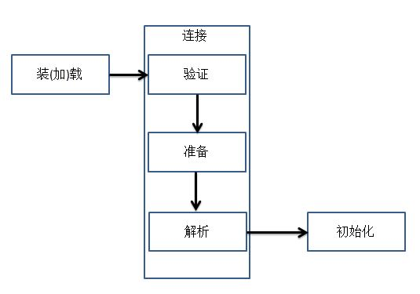
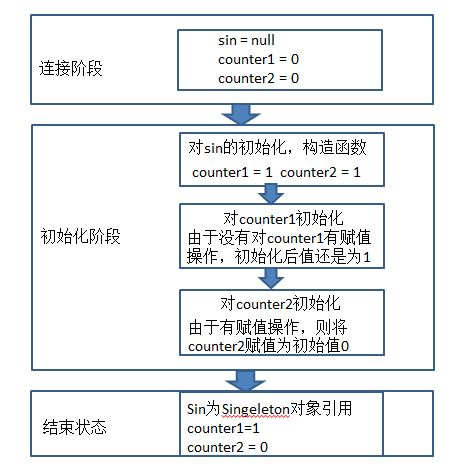

##【JVM】JVM之类加载器

##
##一、前言

##
##　　首先，小小测试，看是否已经掌握了JVM类加载的过程

##
##　　1.1、测试一

class Singleton {
	private static Singleton sin = new Singleton();
	public static int counter1;
	public static int counter2 = 0;
	
	private Singleton() {
		counter1++;
		counter2++;
		}
	
	public static Singleton getInstance() {
		return sin;
		}
	}

public class Test {
	public static void main(String[] args) {
		Singleton sin = Singleton.getInstance();
		System.out.println(sin.counter1);
		System.out.println(sin.counter2);
		}
	}	



##
##　　输出结果为：

##
##　　1 3 ？

##
##　　1 0 ？　　

##
##　　0 1？

##
##　　1.2、测试二：

class Singleton {	
	public static int counter1;
	public static int counter2 = 2;
	private static Singleton sin = new Singleton();

	private Singleton() {
		counter1++;
		counter2++;
		}
	
	public static Singleton getInstance() {
		return sin;
		}
	}

public class Test {
	public static void main(String[] args) {
		Singleton sin = Singleton.getInstance();
		System.out.println(sin.counter1);
		System.out.println(sin.counter2);
		}
	}	



##
##　　

##
##输出结果为：

##
##　　1 3 ？

##
##　　1 2 ？　　

##
##　　0 1？

##
##正确的输出结果如下：

##
##测试一的结果为：1 0

##
##测试二的结果为：1 3

##
##如果对结果有疑惑或者不知道原因的园友需要了解类加载器的具体细节，相信看了本篇文章，一定会解开您的疑惑。废话不多说，直奔主题。

##
##二、背景知识

##
##　　2.1、Java虚拟机通过装(加)载、连接、初始化一个Java类型，使该类型可以被正在运行的Java程序所使用。　　

##
##　　①装(加)载类的加载指的是将类的.class文件中的二进制数据读入到内存中，将其放在运行时数据区的方法区中，然后在堆区创建一个java.lang.Class对象，用来封装类在方法区内的数据结构，之后可以用Class对象进行相关的反射操作。

##
##　　②连接分为三个子步骤　　　　

##
##　　　　验证：确保被加载的类的正确性

##
##　　　　准备：为类的静态变量分配内存，并将其初始化为默认值

##
##　　　　解析： 把类中的符号引用转换为直接引用

##
##　　③初始化为为类的静态变量赋予正确的初始值

##
##　　如下为流程图： 

##
##　　2.2、关于初始化的细节　　

##
##　　所有的Java虚拟机实现必须在每个类或接口被Java程序“首次主动使用”时才初始化他们，下面六种情况符合首次主动使用要求。　　　　

##
##　　　　① 创建类的实例　　　　

##
##　　　　②访问某个类或接口的非常量静态域，或者对该非常量静态域赋值

##
##　　　　③调用类的静态方法

##
##　　　　④反射（如Class.forName(“com.test.Test”)(其中Test为一个类)，而Test.class就不是首次使用)

##
##　　　　⑤初始化一个类的子类

##
##　　　　⑥Java虚拟机启动时被标明为启动类的类（Test）(Test为包含了程序入口main方法的类)

##
##　　2.3、如论如何，如果一个类型在其首次主动使用之前还没有被装(加)载和连接的话，那它必须在此时进行加载和连接，这样它才能够被初始化。

##
##三、问题分析

##
##　　3.1、读到这里应该可以分析出为什么之前的程序会输出那样的结果，下面我们来一起分析一下整个过程。

##
##　　①对于测试一的结果分析

##
##　　首先在main中调用了Singleton的getInstance类静态方法，符合第③条，需要初始化类，即初始化Singleton，首先需要装(加)载和连接，从硬盘中加载进内存，然后进入连接的验证，没有问题，OK，进入准备阶段，此时，将类变量sin、counter1、counter2分配内存，并初始化默认值null、0、0。紧接着，将符号引用转化为直接引用（暂　　时不不要太了解，程序中就是将Singleton符号转化为在内存里直接对地址的引用，这样就可以通过地址直接访问Singleton类型了）。接下来是初始化过程，首先调用sin的构造方法，然后将counter1、counter2分别+1，即counter1 = 1，counter2 = 1，完成了sin静态变量的初始化，然后初始化静态变量counter1，但是由于没有对counter1赋初值，所以counter1还是为1，然而，程序中对counter2进行了赋初值操作，即将counter2赋值为0。这样便完成了类型的初始化，得到的counter1和counter2的结果为1和0，分析完毕。

##
##　　结果分析流程图如下：

##
##　　　　 

##
##　　　　

##
##

##
##

##
##

##
##

##
##

##
##

##
##

##
##

##
##

##
##

##
##

##
##

##
##

##
##

##
##②同理也可以对测试二进行结果分析

##
##四、总结

##
##　　整个类的初始化三个阶段细节过程远比这个复杂得多，但是我们仍可以通过类的整个宏观流程来分析出正确的结果，对过程的分析也有助于我们写出正确的程序。真正做到知其然知其所以然。也感谢各位园友的观看，谢谢。