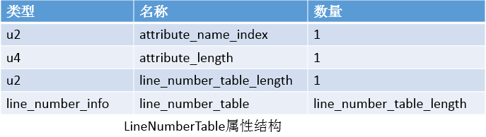

##【JVM】JVM系列之Class文件（三）

##
##一、前言

##
##　　随着我们学习的不断深入，我相信读者对class文件很感兴趣，class文件是用户编写程序与虚拟机之前的桥梁，程序通过编译形成class文件，class文件之后会载入虚拟机，被虚拟机执行，下面我么来一起揭开class文件的神秘面纱。

##
##二、什么是class文件

##
##　　class文件是二进制文件，通常是以.class文件结尾的文件，它是以8位字节为基础单位的二进制流，各个数据项紧密排列在class文件中，数据项的基本类型为u1,u2,u4,u8，分别表示一个字节，两个字节，四个字节,八个字节的无符号数。

##
##三、class文件数据结构

##
##　　其实对于class文件而言，总体的数据结构看上去很规整，具体的结构如下图所示

##
## 

##
##　　下面我们将用一个例子详细讲解class文件的各个部分。

##
##四、示例
  

	public class Test implements Cloneable {
    private String name;
    public Test() {
    
    	}
    
    public Test(String name) {
        this.name = name;
    	}
    
    public void setName(String name) {
        this.name = name;
    	}
    
    public String getName() {
        return name;
    	}
	}

View Code

##
##　　说明：以上是一个很简单和通用的类，下面我们的分析都将基于这个类。

##
##　　经过编译后，得到class文件，使用WinHex打开，class文件内容如下

##
## 

##
##　　下面我们将从这个文件的内容入手，慢慢分析class文件各个部分。

##
##五、class内容详解

##
##　　5.1 magic

##
##　　class文件的最开始4个字节为magic（魔数），用来确定该class文件能够被虚拟机接受。而在我们的class文件中，我们可以看到最开始4个字节是CAFEBABE。所有的class文件的开始4个字节都是CAFEBABE。

##
##　　5.2 minor_version &amp;&amp; major_version

##
##　　主次版本号，会随着Java技术的发展而变化，表示虚拟机能够处理的版本号。在magic之后的minor_version和major_version分别是0和52（52 = 3 * 16 + 4）。

##
##　　5.3 constant_pool_count &amp;&amp; constant_pool

##
##　　常量池中常量表的数量和常量表，常量池中的每一项是常量表，具体的常量表包含类和接口相关的常量，存了很多字面量和符号引用。字面量主要包括了文本字符串和final常量。符号引用包括：1. 类和接口的全限定名 2. 字段的名称和描述符 3. 方法的名称和描述符。

##
##　　常量池中的项目包含如下类型：

##
## 

##
##　　从上面的图中我们可以知道，常量池中常量项（常量项都对应一个表）为23（23 = 1 * 16 + 7），值得注意的是常量项的索引值从1开始，到22，总共22项，索引值为0的项预留出来，暂时还未使用。紧接着就是常量项，每个常量项的第一个字节u1表示标志(tag)，标志(tag)表示是什么类型的项目，标志的值为上表给出的值，如标志为1(tag = 1)，表示CONSTANT_Utf8_info项目。上图中的第一个常量项为的标志tag的值为10（10 = 0 * 16 + A），为CONSTANT_Methodreef_info表，表示类中方法的符号引用。其中CONSTANT_Methodref_info表的结构如下

##
## 

##
##　　接着，在tag后面是u2类型的index项目，为4（4 = 0 * 16 + 4），表示指向常量池的第四项，由描述可知，第四项应该是CONSTANT_Class_info项，接着，又是u2类型的index项目，为18（18 = 1 * 16 + 2），表示指向常量池的第18项，由表的描述可知，第十八项应该是CONSTANT_NameAndType_info项，正确性我们之后进行验证。第一个常量项CONSTANT_Methodref_info就完了。

##
##　　紧接着第一个常量项是第二个常量项，tag为9（0 * 16 + 9），表示CONSTANT_Fieldref_info表，表示字段的符号引用。CONSTANT_Field_info的表结构如下

##
## 

##
##　　接着，在tag后面的是u2类型的index项目，为3（0 * 16 + 3），表示指向常量池的第三项，应该为CONSTANT_Class_info项，紧接着是index项目，为19（1 * 16 + 3），表示指向常量池的第19项，应该是CONSTANT_NameAndType_info项。

##
##　　接着，是第三项常量，tag为7（0 * 16 + 7），表示CONSTANT_Class_info表，其中，其表结构如下

##
##　　 

##
##　　接着tag的为类型为u2的index，为20（1 * 16 + 4），表示指向常量池的第二十项，表示全限定名。

##
##　　接着第四项常量，tag为7(0 * 16 + 7)，表示CONSTANT_Class_info表，表结构已经介绍了，接着是u2的index，为21（1 * 16 + 5），表示指向全限定名。

##
##　　接着第五项常量，tag为7，u2的类型的index为22（1 * 16 + 6），表示指向全限定名。

##
##　　同理，按照这样的方法进行分析，最后给出一个总的常量池表如下。

##
## 

##
##

##
##　　说明：#表示常量项的索引，Utf8表中存放的是具体的字符串。如#6中存放的就是字符串name，#10中存放的就是字符串Code，关于表示的具体含义，我们稍后会进行解释。

##
##　　除去我们之前介绍的常量表结构，常量池中其他常量表的结构分别如下：

##
##　　 

##
## 

##
## 

##
##　　 

##
## 

##
##　　说明：描述符分为字段描述符和方法描述符，字段描述符用来描述字段的数据类型，方法的描述符用来描述方法的参数列表（包括数量、类型、顺序）和返回值。基本类型和对象的描述符如下：

##
## 

##
##　　说明：上表中并没有指出出现数组了如何描述，每一个维度使用一个前置的"["来描述，如int[]描述为[I，String[]描述为[Ljava/lang/String；long类型是使用字符J进行标识，对象类型是使用L字符进行标识。如String类型描述为Ljava/lang/String;short类型描述为S,对于方法描述符而言，按照先参数列表，后返回值进行描述，参数列表按照参数顺序放在小括号"()"内部，如void inc(int i)描述为(I)V；int getName()描述为()I；void setName(String name)描述为(Ljava/lang/String)V；方法的描述符与方法名称是分开进行的，方法描述中并没有包含方法名。

##
##　　5.4 access_flags

##
##　　常量池后的两个字节，用于识别类或接口层次的访问信息，如，这个class是类或者是接口，是否为public，abstract,final等等。具体的标志含义如下：

##
##　　 

##
##　　说明：其中ACC_INTERFACE与ACC_FINAL不能同时存在。

##
##　　从之前的字节码中可以知道，access_flags为0x0021（0x0021 = 0x0020|0x0001），即为public，并且允许使用invokespecial字节码。

##
##　　5.5 this_class

##
##　　接着access_flags后面的u2类型的this_class，表示对常量池的索引，该索引项为CONSTANT_Class_info类型，从前面我们知道this_class为0x0003，表示对常量池第三项的索引，第三项我们知道确实是CONSTANT_Class_info类型，而第三项所表示的内容为Test，即表示当前类。

##
##　　5.6 super_class

##
##　　接着this_class后面的是u2类型的super_class，表示对常量池的索引，从前面我们知道super_class为0x0004，表示对常量池第四项的索引，第四项我们知道是CONSTANT_Class_info类型，而第四项所表示的内容为java/lang/Object，表示Test的父类为Object类。

##
##　　5.7 interfaces_count &amp;&amp; interfaces

##
##　　接着super_class后面的u2类型表示接口数量，此接口数量为该类直接实现或者由接口所扩展接口的数量。从前面我们可以知道，interfaces_count为0x0001，表示接口数量为1，从程序中我们也可以知道确实是只实现了Cloneable接口。

##
##　　接着就是类型为u2的interfaces,表示对常量池的索引，值为0x0005，表示对第五项的索引，第五项为CONSTANT_Class_info类型，所表示的内容为java/lang/Cloneable，从源程序我们可以进行验证。

##
##　　5.8 fields_count &amp;&amp; fields

##
##　　接着interfaces后面的是类型为u2的fields_count（包括类变量和实例变量，不包括局部变量），值为0x0001，为1，从源程序我们知道只声明了一个实例变量name，所以为1。接着fields_count的是类型为fields_info表，field_info表的具体结构如下

##
## 

##
##　　接着fields_count后的是field_info表，首先是u2类型的access_flags，access_flags的具体含义如下表所示

##
## 　　说明：public、private、protected只能会有一个有效。final、volatile只能有一个有效。

##
##　　我们可以知道access_flags为0x0002，表示为private，紧接着是类型为u2的name_index，值为0x0006，表示对常量池第六项的索引，常量池第六项为Class_Utf8_info类型，内容为name，则表示了字段的名称。接着是类型为u2的descriptor_index，值为0x0007，表示对常量池第七项的索引，常量池第七项为Class_Utf8_info类型，内容为Ljava/lang/String，紧接着是类型为u2的attributes_count，为0x0000，表示field_info表没有嵌套attribute_info表。

##
##　　最后的field_info表结构如下：

##
## 

##
##　　5.9 methods_count &amp;&amp; methods

##
##　　fields后面的是类型为u2的methods_count，methods_count的计数只包括在该类或接口中显示定义的方法，不包括从超类或父接口继承来的方法，我们可以知道methods_count的值为0x0004，表示有四个方法，从源程序我们也可以进行验证。紧接着methods_count的是method_info表，method_info表的具体结构如下（与field_info完全相同）

##
## 

##
##　　而对于access_flags标志种类如下

##
## 

##
##　　method_count为4表示接下来有4个method_info表。

##
##　　首先是第一个method_info表，u2类型的access_flags，为0x0001，表示public，接着是类型为u2的name_index，为0x0008，表示对常量池第八项的索引，第八项为Class_Utf8_info类型，内容为<init>，表示实例初始化方法，由编译器产生；接着是类型为u2的descriptor_index，为0x0009，表示对常量池第九项的索引，第九项为Class_Utf8_info类型，内容为()V，表示参数为空，返回值为void，接着是类型为u2的attributes_count，为0x0001，表示有一个属性表；接着是attribute_info表，attribute_info表的结构如下：

##
## 

##
##　　接着attributes_count的是类型为u2的attribute_name_index，为0x000A，指向常量池第十项索引，第十项类型为Class_Utf8_info类型，内容为Code，Code属性表示属性的具体类别；接着是类型为u4的attribute_length，为0x00000021，表示属性长度为33（2 * 16 + 1），接着就是具体每个属性的info信息，对于Code属性而言，其结构如下

##
## 

##
##　　接着attribute_length的是类型为u2的max_stack，为0x0001，表示操作数栈的最大深度，接着max_stack的是类型为u2的max_locals，为0x0001，表示局部变量所需的存储空间大小为1，局部变量表的单位为slot，(byte、char、float、int、short、boolean等不超过32为的数据类型只占据一个slot，double、long64为数据类型需要两个slot)，局部变量表可以存放方法参数（实例方法的this引用）、显式处理器的参数catch中所定义的异常、方法体中定义的局部变量。接着max_locals的是类型为u4的code_length，为0x00000005，为5，表示code代码的长度为5，接着code的是类型为u2的exception_table_length，为0x0000，表示不存在异常表，接着是类型为u2的attributes_count(exception_table_length为0)，为0x0001，为1，表示属性数量为1，表示有一个属性表，接着就是attribute_info表，类型为u2的attribute_name_index，为0x000B，表示对常量池第11项索引，第11项类型为Class_Utf8_info，内容为LineNumberTable，表示具体的属性，LineNumberTable的具体结构如下图所示

##
## 

##
##　　接着attribute_name_index的是类型为u4的attribute_length，为0x0000000A，长度为10，表示属性长度为10，接着attribute_length的是类型为u2的line_number_table_length，为0x0002，为2，表示有两个line_number_info表，line_number_info表的具体结构如下：

##
## 

##
##　　首先是第一个line_number_info表，类型为u2的start_pc，为0x0000，为0；接着是类型为u2的line_number，为0x0003，为3。第二个line_number_info表，类型为u2的start_pc，为0x0004，为4，接着是line_number，为0x0005，为5；

##
##　　至此，第一个method_info表就已经分析完了，第一个method_info表的包含结构如下图所示。

##
##　　 

##
##　　第二个、第三个、第四个Method_info都可以按照第一个Method_info表的方法进行类推。最后的4个表的说明如下

##
## 

##
##　　 

##
##　　 

##
## 

##
##　　除了上面介绍的属性表之外，还有其他的属性表，下面进行介绍。

##
##　　5.10 attributes_count &amp;&amp; attributes

##
##　　接在methods后面的是attributes_count，attributes_count为0x0001，表示有一个attribute_info表，接着attribute_count后面的是attribute_name_index，为0x0010，表示指向常量池第16项的索引，第16项类型为Class_Utf8_info类型，内容为SourceFile，表示属性为SourceFile，SourceFile属性的具体结构如下

##
## 

##
##　　可以看到attributes_count为0x0001，为1，表示有一个属性表，紧接着，attribute_name_index为0x0010，为16，对应常量池第十六项，类型为Class_Utf8_info，内容为SourceFile，类型为u4的attribute_length，为0x00000002，值为2，紧接着是类型为u2的sourcefile_index，为0x0011，为17。

##
##　　至此，整个class文件都已经解析完成了，其实经过分析，我们发现其实分析class文件并不困难，都有固定的格式。

##
##六、特殊字符串

##
##　　常量池容纳的符号引用包括三种特殊的字符串：全限定名、简单名称、描述符。全限定名为类或接口的全限定名，如java.lang.Object对象的全限定名为java/lang/Object，用/代替.即可。简单名称为字段名或方法名的简单名称，如Object对象的toString()方法的简单名称为toString，描述符我们在之前已经介绍过了。

##
##七、指令介绍

##
##　　7.1 方法调用指令：

##
##　　1. invokevirtual，用于调用对象的实例方法，根据对象的实际类型进行分派。

##
##　　2. invokeinterface，用于调用接口方法，在运行时搜索一个实现了该接口方法的对象，找出合适的方法进行调用。

##
##　　3. invokespecial，用于调用需要特殊处理的实例方法，包括实例初始化方法、私有方法、父类方法。

##
##　　4. invokestatic，用于调用类方法，static方法。

##
##　　5. invokedynamic，用于在运行时动态解析出调用点限定符所引用的方法，并执行该方法。

##
##　　7.2 返回指令

##
##　　ireturn(boolean、byte、char、short、int)、lreturn、freturn、dreturn、areturn(返回为对象引用类型)、return(返回为void)

##
##　　7.3 同步指令

##
##　　虚拟机支持方法级的同步和方法内部一段指令序列的同步，都使用管程(Monitor)来支持。方法级(synchronized修饰)同步时隐式的，无需通过字节码指令来控制，方法调用时检查ACC_SYNCHRONIZED标志。方法内部的synchronized语句块使用monitorenter，monitorexit指令来确保同步。

##
##七、总结

##
##　　class文件看似很复杂，其实经过分析我们发现class文件并不难，通过分析class文件，我们知道了源程序经过编译器编译之后如何组织在class文件中，进而为虚拟机执行程序提供搭起了桥梁。也相信经过分析，读者也能够分析class文件了，那么我们的目的也就达到了，谢谢各位园友的观看~

##
##　　

##
##

##
##　　

##
##　　

##
##　　