**一、前言**

经过前面的学习，我们终于进入了虚拟机最后一部分的学习，内存模型。理解内存模型对我们理解虚拟机、正确使用多线程编程提供很大帮助。下面开始正式学习。

**二、Java并发基础**

在并发编程中存在两个关键问题①线程之间如何通信 ②线程之间如何同步。

2.1 通信

通信是指线程之间以何种机制来交换信息。在命令式编程中，线程之间的通信机制有两种：共享内存和消息传递。

在共享内存的并发模型里，线程之间共享程序的公共状态，线程之间通过写-读内存中的公共状态来隐式进行通信。

在消息传递的并发模型里，线程之间没有公共状态，线程之间必须通过明确的发送消息来显式进行通信。

2.2 同步

同步是指程序用于控制不同线程之间操作发生相对顺序的机制。

在共享内存并发模型里，同步是显式进行的。程序员必须显式指定某个方法或某段代码需要在线程之间互斥访问。

在消息传递的并发模型里，由于消息的发送必须在消息的接收之前， 因此同步是隐式进行的。

Java并发采用的是共享内存模型，通信隐式进行；同步显示指定。

**三、Java内存模型**

Java内存模型JMM（Java Memory
Model）主要目标是定义程序中各个变量(非线程私有)的访问规则，即在虚拟机中将变量存储到内存和从内存取出变量这样的底层细节。Java中每个线程都有自己私有的工作内存。工作内存保存了被该线程使用的变量的主内存副本拷贝，线程对变量的读写操作都必须在工作内存进行，无法直接读写主内存中的变量。两个线程无法直接访问对方的工作内存。

3.1 线程、工作内存、内存关系

理解线程、主内存、工作内存之间的关系时，我们可以类比物理机中CPU、高速缓存、内存之间关系，学过计算机组成原理，我们知道CPU、高速缓存、内存之间的关系如下

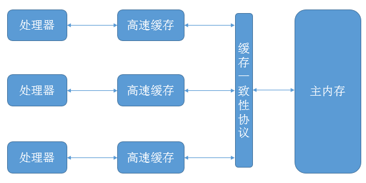

线程、主内存、工作内存的关系图如下

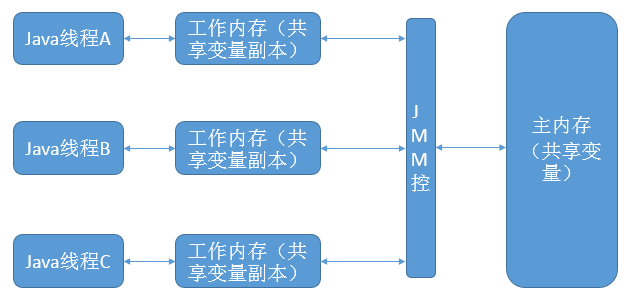

说明：线程的工作内存可以类比高速缓存，JMM控可以类比缓存一致性协议，是工作内存与主内存进行信息交换的具体协议。若线程A要与线程B通信(访问变量)。首先，线程A把工作线程中的共享变量刷新到主内存中。然后，线程B从主内存读取更新过的变量。

3.2 内存间通信的指令

内存见通信，主要指线程私有的工作内存与主内存之间的通信，如线程间共享变量的传递。主要有如下操作。

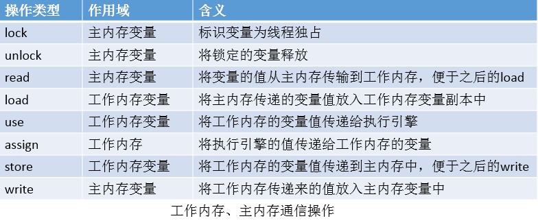

说明：①变量从主内存放入工作内存变量副本中实际是分为两步的，第一步是先把主内存的值放在工作内存中，此时还没有放入变量副本中；第二部把已经放在工作内存的值放入变量副本中。相反，变量副本从工作内存到主内存也是分为两步，与前面类似，不再累赘。总之，两个内存空间的变量值的传递需要两个操作才能完成，这样做是为了提高cpu的效率，不等待主内存写入完成。②read、load操作；store、write操作必须按顺序执行（并非连续执行）。

上述的8个操作需要满足如下规则

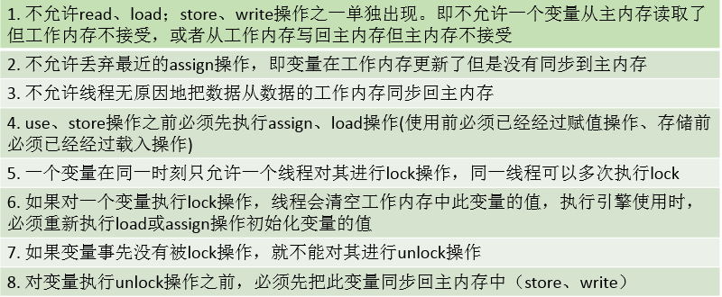 3.3 重排序

在执行程序时为了提高性能，编译器和处理器常常会对指令做重排序。重排序会遵守数据的依赖性，编译器和处理器不会改变存在数据依赖关系的两个操作的执行顺序。重排序分为如下三种类型。

1\. 编译器优化的重排序。编译器在不改变单线程程序语义的前提下，可以重新安排语句的执行顺序。

2\. 指令级并行的重排序。现代处理器采用了指令级并行技术（Instruction-Level Parallelism，
ILP）来将多条指令重叠执行。如果不存在数据依赖性，处理器可以改变语句对应机器指令的执行顺序。

3\. 内存系统的重排序。由于处理器使用缓存和读/写缓冲区，这使得加载和存储操 作看上去可能是在乱序执行。

而我们编写的Java源程序中的语句顺序并不对应指令中的相应顺序，如（int a = 0; int b = 0；翻译成机器指令后并不能保证a = 0操作在b
= 0操作之前）。因为编译器、处理器会对指令进行重排序，通常而言，Java源程序变成最后的机器执行指令会经过如下的重排序。

说明：①编译器优化重排序属于编译器重排序，指令级并行重排序、内存系统重排序属于处理器重排序。②这些重排序可能会导致多线程程序出现内存可见性问题。③JMM编译器重排序规则会禁止特定类型的编译器重排序。④JMM的处理器重排序会要求Java编译器在生成指令序列时，插入特定类型的内存屏障指令，通过内存屏障指令来禁止特定类型的处理器重排序。

下面一个例子说明了重排序

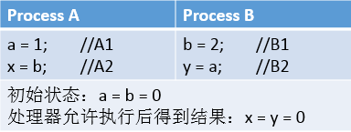

下面是Process A与Process B与内存之间的交互图

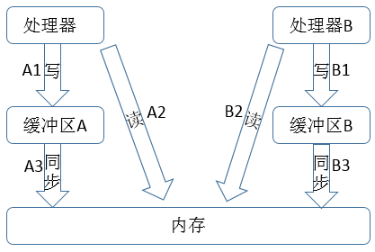

对于最后的结果x = y = 0而言，从内存的角度看，整个指令序列可能如下，A2 -> B2 -> A1 -> B2 -> A3 ->
B3。按照这样的指令排序，最后得到的结果就时x = y = 0。

说明：①从内存角度看，A1与A3操作一起才算是完成了a变量的写，A1操作是在处理器A的缓冲区中完成写，之后A3操作将缓冲区的变量值同步到内存中。②在程序中，A1发生在A2之前，然而实际的指令序列中，A2发生在A1之前，这就是发生了重排序，处理器操作内存的顺序发生了变化。同理，B1与B2指令也发生了重排序。

3.4 内存屏障指令

为了保证内存可见性，Java编译器在生成指令序列的适当位置会插入内存屏障指令来禁止特定类型的处理器重排序。内存屏障指令分为如下四种

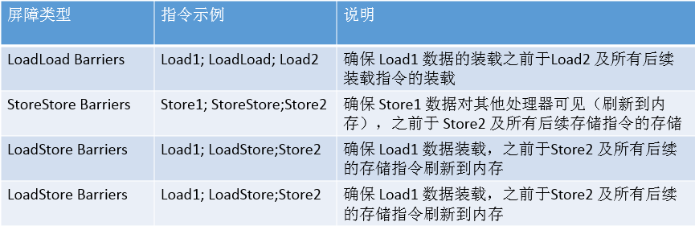

3.5 先行发生原则（happens before）

先行发生原则是判断数据是否存在竞争、线程是否安全的主要依据。如果一个操作执行的结果需要对另一个操作可见，那么这两个操作之间必须要存在 happens-
before 关系，如如果操作A先行发生与操作B，即A操作产生的结果能够被操作B观察到。

如下图示例

线程A 线程B

i = 3; j = i;

结果：j = 3;

说明：线程A中的i = 3先行发生于j = i;则结果一定是j = 3。

具体的happens-before原则如下

1\. 程序顺序规则：一个线程中的每个操作，happens- before 于该线程中的任意后续操作（控制流操作而不是程序代码顺序）。

2\. 监视器锁规则：对一个监视器的解锁，happens- before 于随后对这个监视器的加锁。

3\. volatile变量规则：对一个 volatile域的写，happens- before于任意后续对这个volatile域的读。

4\. 线程启动规则：Thread对象的start()方法happens - before 于此线程的每一个动作。

5\. 线程终止规则：线程中所有操作都happens - before 于对此线程的终止检测。

6\. 线程中断规则：对线程interrupt()方法的调用happens - before 于被中断线程的代码检测到中断事件的发生。

7\. 对象终结规则：一个对象的初始化完成（构造函数执行结束）happens - before 于它的finalize()方法的开始。

8\. 传递性：如果 A happens- before B，且 B happens- before C，那么 A happens- before C。

说明：happens-before
仅仅要求前一个操作（执行的结果）对后一个操作可见，且前一个操作按顺序排在第二个操作之前（可能会发生指令重排）。时间先后顺序与happens -
before原则之间没有太大的关系。

3.6 as-if-serial语义

as-if-serial的语义是：不管怎么重排序（编译器和处理器为了提高并行度），（单线程）程序的执行结果不能被改变。编译器，runtime
和处理器都必须遵守 as-if-serial 语义。为了遵守 as-if-serial
语义，编译器和处理器不会对存在数据依赖关系的操作做重排序，因为这种重排序会改变执行结果。但是，如果操作之间不存在数据依赖关系，这些操作就可能被编译器和处理器重排序。如如下代码片段

    
    
    double pi = 3.14; //A
    double r  = 1.0;   //B
    double area = pi * r * r; //C

其中，操作A、B、C之间的依赖性如下

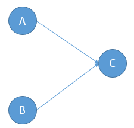

说明：A和C之间存在数据依赖关系，同时B和C之间也存在数据依赖关系。因此在最终执行的指令序列中，C不能被重排序到A和B的前面（C排到A和B的前面，程序的结果将会被改变）。但A和B之间没有数据依赖关系，编译器和
处理器可以重排序A和B之间的执行顺序。因此，最后的指令序列可能是:

A -> B -> C；

B -> A -> C； // 重排序了

套用happens - before规则我们可以知道：

A happens - before B； // 程序顺序规则

B happens - before C； // 程序顺序规则

A happens - before C； // 传递性

说明：A happens- before B，但实际执行时 B 却可以排在 A 之前执行（第二种指令执行顺序）。在前面我们讲到，如果 A happens-
before B，JMM 并不要求 A 一定要在 B 之前执行。JMM
仅仅要求前一个操作（执行的结果）对后一个操作可见，且前一个操作按顺序排在第二个操作之前。这里操作 A 的执行结果不需要对操作 B 可见；而且重排序操作 A
和操作 B 后的执行结果，与操作 A 和操作 B 按 happens- before 顺序执行的结果一致。在这种情况下，JMM
会认为这种重排序并不非法，JMM 允许这种重排序。

对于单线程，JMM可以进行指令重排序，但是一定要遵守as-if-serial语义，这样才能保证单线程的正确性。

对于多线程而言，JMM的指令重排序可能会影响多线程程序的正确性。下面为多线程示例。

    
    
    class ReorderExample { 
        int a = 0;
        boolean flag = false;
    
        public void writer() {
            a = 1;    //操作A
            flag = true;    //操作B
        }
    
    
        public void reader() {
            if (flag) {    //操作C
                int i =    a * a;    //操作D
            }
        }
    }

说明：变量flag用于标识变量a是否已经写入。若线程A先执行writer函数，然后线程B执行reader函数。由happens - before
规则（程序顺序规则）我们知道，操作A happens - before
B，但是由于操作A与操作B之间没有数据依赖，所以可以进行重排序。同理，操作C与操作D之间也无数据依赖关系（但存在控制依赖关系，JMM允许对存在数据依赖的指令进行重排序），也可进行重排序。

下图展示了重排序操作A、操作B所可能产生的结果。

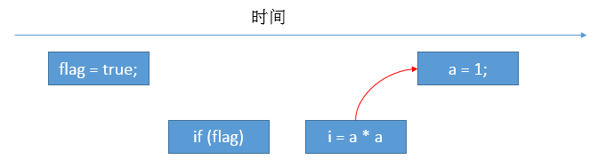

说明：假设重排序操作A、操作B，且操作C、操作D在操作A、操作B的中间，那么最后线程B的变量i的结果为0；flag为true，则对i进行写入。然而，此时的a还未写入，此时，重排序破坏了多线程的语义，最后写入的i值是不正确的。

下图展示了重排序操作C、操作D可能产生的执行结果。

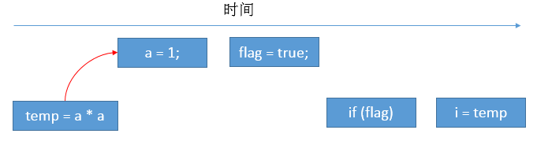

说明：存在控制依赖的指令也会被重排序，控制依赖会影响并行度。temp变量的出现是因为编译器和处理器会采用猜测执行来克服控制相关性对并行度的影响，从图中我们可以知道重排序破坏了多线程的语义，最后写入i的值是不正确的。

在单线程程序中，对存在控制依赖的操作重排序，不会改变执行结果（这也是 as- if-serial
语义允许对存在控制依赖的操作做重排序的原因）；但在多线程程序中，对存在控制依赖的操作重排序，可能会改变程序的执行结果。

在多线程中为了保证程序的正确性，我们需要进行适当的同步，以保证正确的结果。

**四、顺序一致性内存模型**

顺序一致性内存模型时JMM的参考模型，它提供了很强的内存一致性与可见性，是一个被计算机科学家理想化了的理论参考模型，它为程序员提供了极强的内存可见性保证。JMM对正确同步的多线程程序的内存一致性做了如下保证

如果程序是正确同步的，程序的执行将具有顺序一致性（sequentially consistent）--
即程序的执行结果与该程序在顺序一致性内存模型中的执行结果相同。马上我们将会看到，这对于程序员来说是一个极强的保证。这里的同步是指广义上的同步，包括对常用同步原语（synchronized，volatile
和 final）的正确使用。

顺序一致性内存模型包括如下两个特性：

1\. 一个线程中的所有操作必须按照程序的顺序来执行。  

2\.
（不管程序是否同步）所有线程都只能看到一个单一的操作执行顺序。在顺序一致性内存模型中，每个操作都必须原子执行且立刻对所有线程可见（JMM中并不保证）。  

顺序一致性内存模型为程序员提供的视图如下：

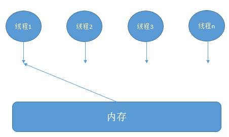

说明：每一时刻只有一个线程可以访问内存，当多个线程并发执行时，图中的开关装置能把所有线程的所有内存读/写操作串行化（即在顺序一致性模型中，所有操作之间具有全序关系）。下面这个例子更进一步阐明了在顺序一致性内存模型中各线程操作之间的关系。

假设线程A有A1、A2、A3三个操作，线程B有B1、B2、B3三个操作。

① 若使用监视器锁来进行同步，在A的三个操作完成后，释放监视器锁，之后B获得监视器锁，那么整个操作序列为：A1 -> A2 -> A3 -> B1 ->
B2 -> B3。

② 若不使用监视器锁来进行同步，那么整个序列可能为：A1 -> B1 -> A2 -> B2 -> B3 ->
A3。其中线程A、B的三个操作是有序的，并且线程A、B看到的操作序列都是同一操作序列，每个操作都必须原子执行且立刻对所有线程可见，但是整体的操作无序。

未同步程序在 JMM
中不但整体的执行顺序是无序的，而且所有线程看到的操作执行顺序也可能不一致。比如，在当前线程把写过的数据缓存在本地内存中，在还没有刷新到主内存之前，这个写操作仅对当前线程可见；从其他线程的角度来观察，会认为这个写操作根本还没有被当前线程执行。只有当前线程把本地内存中写过的数据刷新到主内存之后，这个写操作才能对其他线程可见。在这种情况下，当前线程和其它线程看到的操作执行顺序将不一致，当前线程认为写数据到缓冲区就完成了写操作，其他线程认为只有数据刷新到主内存才算完成了写操作，所以就导致了线程之间看到的操作序列不相同。

顺序一致性内存模型是通过内存规则保证顺序一致性，顺序一致性是JMM追求的目标，但是JMM模型本身并不进行保证，必须通过适当的同步保证。

4.1 同步程序的执行特性  

下面例子展示一个正确同步的程序在JMM和顺序一致性内存模型的操作序列。

    
    
    class SynchronizedExample { 
        int a = 0;
        boolean flag = false;
    
        public synchronized void writer() { // 获取锁
            a = 1;    //操作A
            flag = true;    //操作B
        } // 释放锁
    
        public synchronized void reader() { // 获取锁
            if (flag) {    //操作C
                int i = a;    //操作D
            }
        } // 释放锁
    }

说明：线程A先执行writer方法，线程B执行reader方法。这是一个正确同步的程序，在JMM的操作序列与在顺序一致性模型的操作序列是相同的。

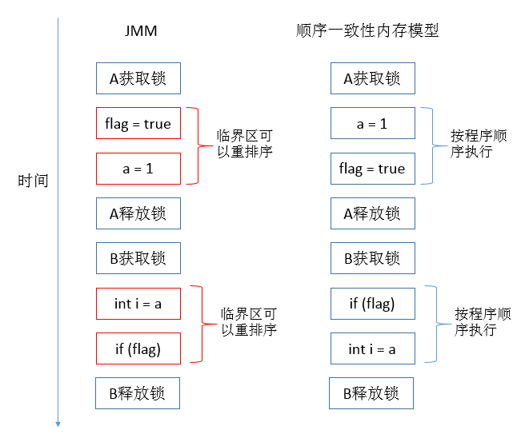

说明：JMM模型中允许临界区的操作重排序（即使有控制依赖），而顺序一致性内存模型中则按照程序顺序执行。线程 A
在临界区内做了重排序，但由于监视器的互斥执行的特性，这里的线程 B 根本无法“观察”到线程 A
在临界区内的重排序。这种重排序既提高了执行效率，又没有改变程序的执行结果。同时，JMM
会在退出临界区和进入临界区这两个关键时间点做一些特别处理，使得线程在这两个时间点具有与顺序一致性模型相同的内存视图。

从这里我们可以看到 JMM 在具体实现上的基本方针：在不改变（正确同步的）程序执行结果的前提下，尽可能的为编译器和处理器的优化打开方便之门。

4.2 未同步程序的执行特性

对于未同步或未正确同步的多线程程序，JMM只提供最小安全性：线程执行时读取到的值，要么是之前某个线程写入的值，要么是默认值（0，null，false），JMM保证线程读操作读取到的值不会无中生有的冒出来。为了
实现最小安全性，JVM在堆上分配对象时，首先会清零内存空间，然后才会在上面分配对象（JVM内部会同步这两个操作）。因此，在已清零的内存空间分配对象时，域的默认初始化已经完成了。

JMM
不保证未同步程序的执行结果与该程序在顺序一致性模型中的执行结果一致。因为如果想要保证执行结果一致，JMM需要禁止大量的处理器和编译器的优化，这对程序的执行性能会产生很大的影响。而且未同步程序在顺序一致性模型中执行时，整体是无序的，其执行结果往往无法预知。保证未同步程序在这两个模型中的执行结果一致没什么意义。

未同步程序在 JMM 中的执行时，整体上是无序的，其执行结果无法预知。未同步程序在两个模型中的执行特性有下面几个差异：

① 顺序一致性模型保证单线程内的操作会按程序的顺序执行，而 JMM 不保证单线程内的操作会按程序的顺序执行（会进行重排序）。

② 顺序一致性模型保证所有线程只能看到一致的操作执行顺序，而 JMM 不保证所有线程能看到一致的操作执行顺序。

③ JMM不保证对 64 位的 long 型和 double
型变量的读/写操作具有原子性（JDK5之后的读具有原子性，写不具有），而顺序一致性模型保证对所有的内存读/写操作都具有原子性。

**五、volatile型变量说明**

关键字volatile是Java虚拟机提供的最轻量级的同步机制，当一个变量定义为volatile时，它将具备两种特性，可见性与禁止指令重排序优化。volatile通常会与synchronize关键字做对比。

①
可见性。当一条线程修改了这个变量的值，新值对于其他线程来说是可以立即获得的，但是基于volatile变量的操作并不是安全的（如自增操作），下面两种情况就不太适合使用volatile，而需要使用加锁（synchronize、原子类）来保证原子性。

1\. 运算结果并不依赖变量的当前值，或者能够确保只有单一的线程修改变量的值。

2\. 变量不需要与其他的状态变量共同参与不变约束。

② 禁止指令重排序优化。不允许对volatile操作指令进行重排序。

下面是是一个volatile的例子。

    
    
     class VolatileFeaturesExample {
        volatile long vl = 0L; //使用 volatile 声明 64 位的 long 型变量
    
        public void set(long l) {
            vl = l;    //单个 volatile 变量的写
        }
    
        public void getAndIncrement () {
            vl++; //复合（多个）volatile 变量的读/写
        }
    
        public long get() {
            return vl; //单个 volatile 变量的读
        }
    }

说明：上述使用volatile关键字的程序与下面使用synchronize关键字的程序效果等效。

    
    
    class VolatileFeaturesExample {
        long vl = 0L; // 64 位的 long 型普通变量
    
        public synchronized void set(long l) { //对单个的普通变量的写用同一个
            vl = l;
        }
     
        public void getAndIncrement () { //普通方法调用
            long temp = get(); //调用已同步的读方法 
            temp += 1L; //普通写操作
            set(temp); //调用已同步的写方法
        }
        
        public synchronized long get() { // 对单个的普通变量的读用同一个锁同步
            return vl;
        }
    }

volatile变量的读写与锁的释放与获取相对应。读对应着锁的释放，写对应锁的获取。

5.1 volatile的happens - before关系

前面我们知道happens - before 关系是保证内存可见性的重要依据。那么在volatile变量与happens - before
之间是什么关系呢，我们通过一个示例说明

    
    
    class VolatileExample {
        int    a = 0;
        volatile boolean flag = false;
    
        public void writer() {
            a = 1; //1
            flag = true; //2
        }
    
        public void reader() {
            if (flag) { //3
                int i =    a; //4
            }
        }
    }

说明：假定线程A先执行writer方法，线程B后执行reader方法，那么根据happens - before关系，我们可以知道：

1\. 根据程序顺序规则，1 happens before 2; 3 happens before 4。

2\. 根据 volatile变量规则，2 happens before 3。

3\. 根据 happens before 的传递性，1 happens before 4。

具体的happens - before图形化如下

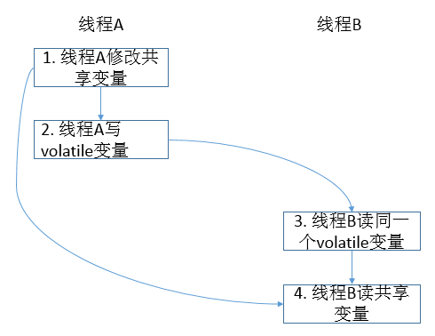

说明：上述图中存在箭头表示两者之间存在happens - before关系。

5.2 volatile读写内存语义

1\. 读内存语义。当读一个 volatile 变量时，JMM 会把该线程对应的本地内存置为无效。线程之后将从主内存中读取共享变量。

2\. 写内存语义。当写一个 volatile 变量时，JMM
会把该线程对应的本地内存中的共享变量值刷新到主内存。这样就保证了volatile的内存可见性。

volatile读写内存语义总结为如下三条：

1\. 线程 A 写一个 volatile 变量，实质上是线程 A 向接下来将要读这个 volatile
变量的某个线程发出了（其对共享变量所在修改的）消息。

2\. 线程 B 读一个 volatile 变量，实质上是线程 B 接收了之前某个线程发出的（在写这个 volatile
变量之前对共享变量所做修改的）消息。

3\. 线程 A 写一个 volatile 变量，随后线程 B 读这个 volatile 变量，这个过程实质上是线程 A 通过主内存向线程 B 发送消息。

5.3 volatile内存语义的实现

前面讲到，volatile变量会禁止编译器、处理器重排序。下面是volatile具体的排序规则表

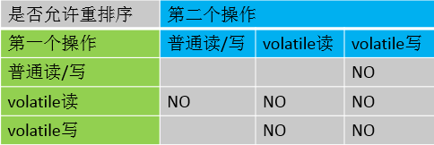

说明：从图中可以知道当第一个操作为volatile读时，无论第二个操作为何种操作，都不允许重排序；当第二个操作为volatile写时，无论第一个操作为何种操作，都不允许重排序；当第一个操作为volatile写时，第二个操作为volatile读时，不允许重排序。

为了实现 volatile
的内存语义，编译器在生成字节码时，会在指令序列中插入内存屏障来禁止特定类型的处理器重排序。对于编译器来说，发现一个最优布置来最小化插入屏障的总数几乎不可能，为此，JMM
采取保守策略。下面是基于保守策略的 JMM 内存屏障插入策略：

1\. 在每个 volatile 写操作的前面插入一个 StoreStore 屏障。

2\. 在每个 volatile 写操作的后面插入一个 StoreLoad 屏障（对volatile写、普通读写实现为不允许重排序，可能会影响性能）。

3\. 在每个 volatile 读操作的后面插入一个 LoadLoad 屏障。

4\. 在每个 volatile 读操作的后面插入一个 LoadStore 屏障（普通读写、volatile读实现为不允许重排序，可能会影响性能）。

下面通过一个示例展示volatile的内存语义。

    
    
    class VolatileBarrierExample { 
        int a;
        volatile int v1 = 1;
        volatile int v2 = 2;
    
        void readAndWrite() {
            int i = v1;    // 第一个 volatile 读
            int j = v2; // 第二个 volatile 读
            a = i + j; // 普通写
            v1 = i + 1; // 第一个 volatile 写
            v2 = j * 2; // 第二个 volatile 写
        }
    }

根据程序，最后的指令序列如下图所示

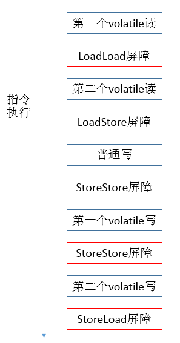

说明：编译器、处理器会根据上下文进行优化，并不是完全按照保守策略进行插入相应的屏障指令。

**六、锁**

锁是Java并发编程中最重要的同步机制。锁除了让临界区互斥执行外，还可以让释放锁的线程向获取同一个锁的线程发送消息。

6.1 锁的happens - before 关系

下面一个示例展示了锁的使用

    
    
    class MonitorExample {
        int a = 0;
    
        public synchronized void writer() {    // 1 
            a++; // 2
        } // 3
    
        public synchronized void reader() { // 4 
            int i = a; // 5
        } // 6
    }

说明：假设线程 A 执行 writer()方法，随后线程 B 执行 reader()方法。该程序的happens - before关系如下：

1\. 根据程序顺序规则，1 happens before 2, 2 happens before 3; 4 happens before 5, 5
happens before 6。

2\. 根据监视器锁规则，3 happens before 4。

3\. 根据传递性，2 happens before 5。

图形化表示如下：

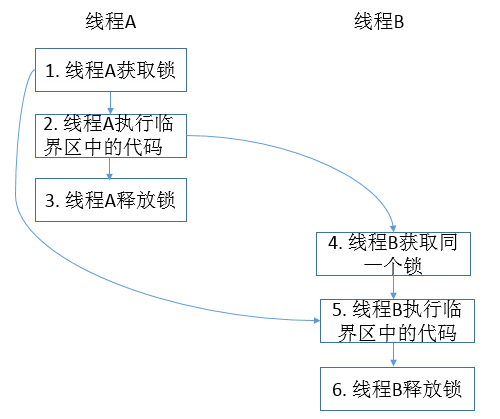

6.2 锁释放获取的内存语义

1\. 当线程释放锁时，JMM会把该线程对应的工作内存中的共享变量刷新到主内存中，以确保之后的线程可以获取到最新的值。

2\. 当线程获取锁时，JMM会把该线程对应的本地内存置为无效。从而使得被监视器保护的临界区代码必须要从主内存中去读取共享变量。

锁释放与获取总结为如下三条

1\. 线程 A 释放一个锁，实质上是线程 A 向接下来将要获取这个锁的某个线程发出 了（线程 A 对共享变量所做修改的）消息。

2\. 线程 B 获取一个锁，实质上是线程 B 接收了之前某个线程发出的（在释放这个 锁之前对共享变量所做修改的）消息。

3\. 线程 A 释放锁，随后线程 B 获取这个锁，这个过程实质上是线程 A 通过主内存 向线程 B 发送消息。

6.3 锁内存语义的实现

锁的内存语义的具体实现借助了volatile变量的内存语义的实现。

**七、final**

对于 final 域，编译器和处理器要遵守两个重排序规则：

1\. 在构造函数内对一个 final 域的写入，与随后把这个被构造对象的引用赋值给一个引用变量，这两个操作之间不能重排序。

2\. 初次读一个包含 final 域的对象的引用，与随后初次读这个 final 域，这两个操作之间不能重排序。

如下面示例展示了final两种重排序规则。

    
    
     public final class FinalExample {
        final int i;
        public FinalExample() {
            i = 3; // 1
        }
        
        public static void main(String[] args) {
            FinalExample fe = new FinalExample(); // 2
            int ele = fe.i; // 3
        }
    }

说明： 操作1与操作2符合重排序规则1，不能重排，操作2与操作3符合重排序规则2，不能重排。

由下面的示例我们来具体理解final域的重排序规则。

    
    
    public class FinalExample {
        int i; // 普通变量
        final int j; // final变量
        static FinalExample obj; // 静态变量
    
        public void FinalExample () { // 构造函数 
            i = 1; // 写普通域
            j = 2; // 写final域
        }
    
        public static void writer () { // 写线程A执行 
            obj = new FinalExample();
        }
    
        public static void reader () { // 读线程B执行
            FinalExample object = obj; // 读对象引用
            int a = object.i; // 读普通域
            int b = object.j; // 读final域
        }
    }

说明：假设线程A先执行writer()方法，随后另一个线程B执行reader()方法。下面我们通过这两个线程的交互来说明这两个规则。

7.1 写final域重排序规则

写 final 域的重排序规则禁止把 final 域的写重排序到构造函数之外。这个规则的实 现包含下面两个方面：

1\. JMM 禁止编译器把 final 域的写重排序到构造函数之外。

2\. 编译器会在 final 域的写之后，构造函数 return 之前，插入一个 StoreStore 屏障。这个屏障禁止处理器把 final
域的写重排序到构造函数之外。

writer方法的obj = new
FinalExample();其实包括两步，首先是在堆上分配一块内存空间简历FinalExample对象，然后将这个对象的地址赋值给obj引用。假设线程 B
读对象引用与读对象的成员域之间没有重排序，则可能的时序图如下

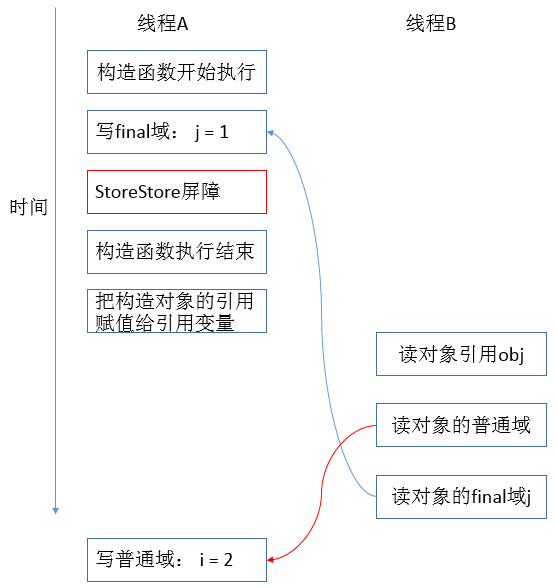

说明：写普通域的操作被编译器重排序到了构造函数之外，读线程 B 错误的读取了普通变量 i 初始化之前的值。而写 final 域的操作，被写 final
域的重排序规则 “限定”在了构造函数之内，读线程 B 正确的读取了 final 变量初始化之后的值。写 final
域的重排序规则可以确保：在对象引用为任意线程可见之前，对象的 final 域已经被正确初始化过了，而普通域不具有这个保障。以上图为例，在读线程 B
“看到”对象引用 obj 时，很可能 obj 对象还没有构造完成（对普通域 i 的写操作被重排序到构造函数外，此时初始值 2 还没有写入普通域 i）。

7.2 读final域重排序规则

读 final 域的重排序规则如下：

在一个线程中，初次读对象引用与初次读该对象包含的 final 域，JMM 禁止处理器重排序这两个操作（注意，这个规则仅仅针对处理器）。编译器会在读
final 域操作的前面插入一个 LoadLoad 屏障。初次读对象引用与初次读该对象包含的 final
域，这两个操作之间存在间接依赖关系。由于编译器遵守间接依赖关系，因此编译器不会重排序这两个操作。大多数处理器也会遵守间接依赖，大多数处理器也不会重排序这两个操作。但有少数处理器允许对存在间接依赖关系的操作做重排序（比如
alpha 处理器），这个规则就是专门用来针对这种处理器。

reader方法包含三个操作：① 初次读引用变量 obj。② 初次读引用变量 obj 指向对象的普通域 i。③ 初次读引用变量 obj 指向对象的
final 域 j。假设写线程 A 没有发生任何重排序，同时程序在不遵守间接依赖的处理器上执行，下面是一种可能的执行时序：

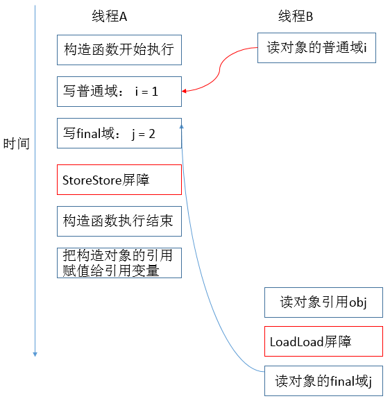

说明：reader操作中1、2操作重排了，即读对象的普通域的操作被处理器重排序到读对象引用之前。读普通域时，该域还没有被写线程 A
写入，这是一个错误的读取操作。而读 final 域的重排序规则会把读对象 final 域的操作“限定”在读对象引用之后，此时该 final 域已经被 A
线程初始化过了，这是一个正确的读取操作。读 final 域的重排序规则可以确保：在读一个对象的 final 域之前，一定会先读包含这个 final
域的对象的引用。在这个示例程序中，如果该引用不为 null，那么引用对象的 final 域一定已经被 A 线程初始化过了。

7.3 final域是引用类型

上面我们的例子中，final域是基本数据类型，如果final与为引用类型的话情况会稍微不同。对于引用类型，写 final
域的重排序规则对编译器和处理器增加了如下约束

1\. 在构造函数内对一个 final 引用的对象的成员域的写入，与随后在构造函数外把这个被构造对象的引用赋值给一个引用变量，这两个操作之间不能重排序。  

    
    
    public class FinalReferenceExample {
        final int[] intArray; // final 是引用类型 
        static FinalReferenceExample obj;
    
        public FinalReferenceExample () { // 构造函数 
            int Array = new int[1]; // 1
            int    Array[0] = 1; // 2
        }
    
        public static void writerOne () { // 写线程 A 执行 
            obj = new FinalReferenceExample (); // 3
        }
    
        public static void writerTwo () { // 写线程 B 执行 
            obj.intArray[0] = 2; // 4
        }
    
        public static void reader () { // 读线程 C 执行 
            if (obj != null) {    //5
                int temp1 = obj.intArray[0]; // 6
            }
        }
    }

说明：假设首先线程 A 执行 writerOne()方法，执行完后线程 B 执行 writerTwo()方法，执行完后线程 C 执行 reader
()方法。下面是一种可能的线程执行时序：

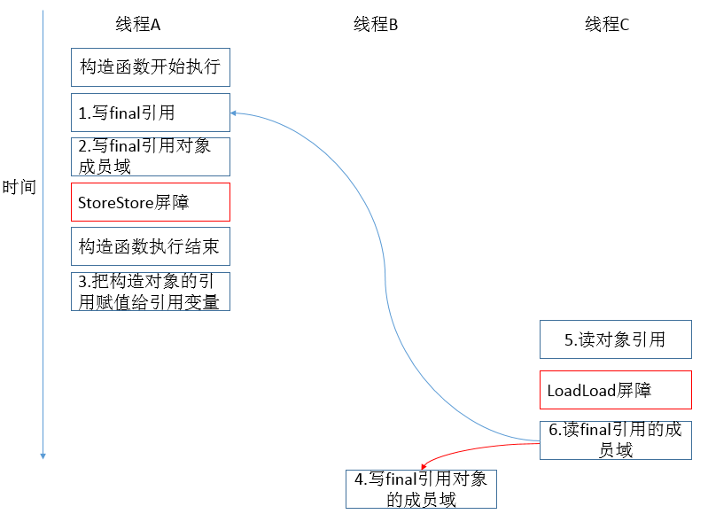  

说明：1 是对 final 域的写入，2 是对这个 final 域引用的对象的成员域的写入，3 是把被构造的对象的引用赋值给某个引用变量。这里除了前面提到的
1 不能 和 3 重排序外，2 和 3 也不能重排序。JMM 可以确保读线程 C 至少能看到写线程 A 在构造函数中对 final
引用对象的成员域的写入。即 C 至少能看到数组下标 0 的值为 1。而写线程 B 对数组元素的写入，读线程 C 可能看的到，也可能看不到。JMM 不保证线程
B 的写入对读线程 C 可见，因为写线程 B 和读线程 C 之间存在数据竞争，此时的执行结果不可预知。

如果想要确保读线程 C 看到写线程 B 对数组元素的写入，写线程 B 和读线程 C 之间需要使用同步原语（lock 或 volatile）来确保内存可见性。

7.4 final逸出

写 final 域的重排序规则可以确保：在引用变量为任意线程可见 之前，该引用变量指向的对象的 final 域已经在构造函数中被正确初始化过了。其
实要得到这个效果，还需要一个保证：在构造函数内部，不能让这个被构造对象的 引用为其他线程可见，也就是对象引用不能在构造函数中“逸出”。我们来看下面示例代码：

    
    
    public class FinalReferenceEscapeExample { 
        final int i;
        static FinalReferenceEscapeExample obj;
    
        public FinalReferenceEscapeExample () {
            i = 1;    //1 写 final 域
            obj = this;    //2 this 引用在此“逸出”
        }
    
        public static void writer() {
            new FinalReferenceEscapeExample ();
        }
    
        public static void reader {
            if (obj != null) {    //3
            int temp = obj.i;    //4
            }
        }
    }

说明：假设一个线程 A 执行 writer()方法，另一个线程 B 执行 reader()方法。这里的操作 2 使得对象还未完成构造前就为线程 B
可见。即使这里的操作 2 是构造函数的最后一步，且即使在程序中操作 2 排在操作 1 后面，执行 read()方法的线程仍然可能无 法看到 final
域被初始化后的值，因为这里的操作 1 和操作 2 之间可能被重排序。实际的执行时序可能如下图所示：

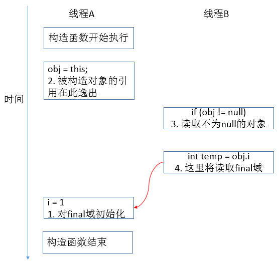

说明：在构造函数返回前，被构造对象的引用不能为其他线程可见，因为此时的 final 域可能还没有被初始化。在构造函数返回后，任意线程都将保证能看到
final 域正确初始化之后的值。

**八、JMM总结**

顺序一致性内存模型是一个理论参考模型，JMM 和处理器内存模型在设计时通常 会把顺序一致性内存模型作为参照。JMM和处理器内存模型在设计时会对顺序一
致性模型做一些放松，因为如果完全按照顺序一致性模型来实现处理器和 JMM， 那么很多的处理器和编译器优化都要被禁止，这对执行性能将会有很大的影响。

8.1 JMM的happens- before规则

JMM 的happens - before规则要求禁止的重排序分为了下面两类：

1\. 会改变程序执行结果的重排序。

2\. 不会改变程序执行结果的重排序。

JMM 对这两种不同性质的重排序，采取了不同的策略：

1\. 对于会改变程序执行结果的重排序，JMM 要求编译器和处理器必须禁止这种重排序。

2\. 对于不会改变程序执行结果的重排序，JMM 对编译器和处理器不作要求（JMM 允许这种重排序）

JMM的happens - before设计示意图如下

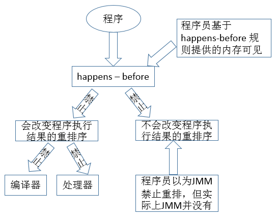

说明：从上图可知

1\. JMM 向程序员提供的 happens- before 规则能满足程序员的需求。JMM 的 happens- before
规则不但简单易懂，而且也向程序员提供了足够强的内存可 见性保证（有些内存可见性保证其实并不一定真实存在，比如上面的 A happens- before
B）。

2\. JMM 对编译器和处理器的束缚已经尽可能的少。从上面的分析我们可以看出， JMM 其实是在遵循一个基本原则：只要不改变程序的执行结果（指的是单线程
程序和正确同步的多线程程序），编译器和处理器怎么优化都行。比如，如果编译器经过细致的分析后，认定一个锁只会被单个线程访问，那么这个锁可以被消除。再比如，如果编译器经过细致的分析后，认定一个
volatile 变量仅仅只会被单个线程访问，那么编译器可以把这个 volatile
变量当作一个普通变量来对待。这些优化既不会改变程序的执行结果，又能提高程序的执行效率。

8.2 JMM的内存可见性

Java 程序的内存可见性保证按程序类型可以分为下列三类：

1\. 单线程程序。单线程程序不会出现内存可见性问题。编译器，runtime
和处理器会共同确保单线程程序的执行结果与该程序在顺序一致性模型中的执行结果相同。

2\. 正确同步的多线程程序。正确同步的多线程程序的执行将具有顺序一致性（程序的执行结果与该程序在顺序一致性内存模型中的执行结果相同）。这是 JMM
关注的重点，JMM 通过限制编译器和处理器的重排序来为程序员提供内存可见性保证。

3\. 未同步/未正确同步的多线程程序。JMM 为它们提供了最小安全性保障：线程执行时读取到的值，要么是之前某个线程写入的值，要么是默认值（0，null，
false）。

这三类程序在 JMM 中与在顺序一致性内存模型中的执行结果的异同如下

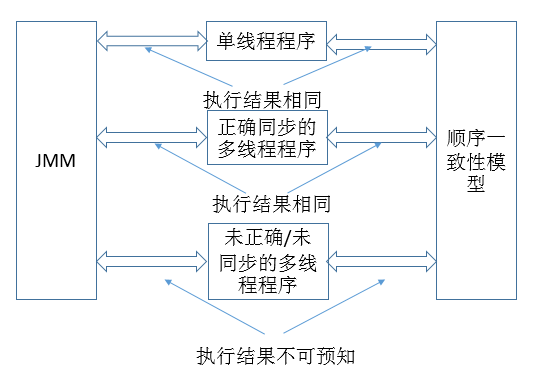

**九、总结**

这一篇的完结也意味着看完了整个JVM，明白了很多JVM底层的知识，读完后感觉受益匪浅，整个学习笔记有点厚，方便自己以后再精读。还有一个很深的感触就是，只有记下来的知识才是自己的，养成记录的好习惯，一步步变成高手。谢谢各位园友的观看~

