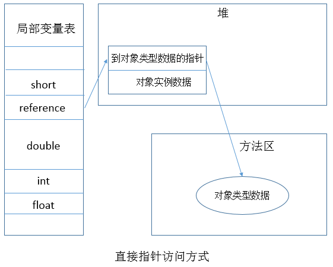
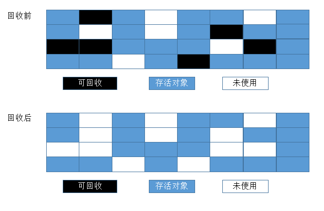
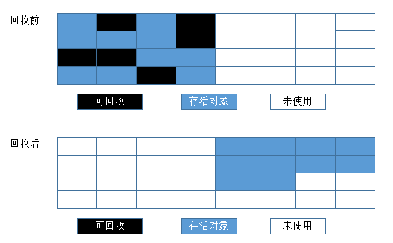

##【JVM】JVM系列之垃圾回收（二）

##
##一、为什么需要垃圾回收

##
##　　如果不进行垃圾回收，内存迟早都会被消耗空，因为我们在不断的分配内存空间而不进行回收。除非内存无限大，我们可以任性的分配而不回收，但是事实并非如此。所以，垃圾回收是必须的。

##
##二、哪些内存需要进行垃圾回收

##
##　　对于虚拟机中线程私有的区域，如程序计数器、虚拟机栈、本地方法栈都不需要进行垃圾回收，因为它们是自动进行的，随着线程的消亡而消亡，不需要我们去回收，比如栈的栈帧结构，当进入一个方法时，就会产生一个栈帧，栈帧大小也可以借助类信息确定，然后栈帧入栈，执行方法体，退出方法时，栈帧出栈，于是其所占据的内存空间也就被自动回收了。而对于虚拟机中线程共享的区域，则需要进行垃圾回收，如堆和方法区，线程都会在这两个区域产生自身的数据，占据一定的内存大小，并且这些数据又可能会存在相互关联的关系，所以，这部分的区域不像线程私有的区域那样可以简单自动的进行垃圾回收，此部分区域的垃圾回收非常复杂，而垃圾回收也主要是针对这部分区域。

##
##三、垃圾收集算法

##
##　　任何垃圾收集算法都必须做两件事情。首先，它必须检测出垃圾对象。其次，它必须回收垃圾对象所使用的堆空间并还给程序。那么问题来了，如何检测出一个对象是否为垃圾对象呢？一般有两种算法解决这个问题。1. 引用计数算法 2. 可达性分析算法。

##
##　　1.引用计数算法

##
##　　堆中的每一个对象有一个引用计数，当一个对象被创建，并把指向该对象的引用赋值给一个变量时，引用计数置为1，当再把这个引用赋值给其他变量时，引用计数加1，当一个对象的引用超过了生命周期或者被设置为新值时，对象的引用计数减1，任何引用计数为0的对象都可以被当成垃圾回收。当一个对象被回收时，它所引用的任何对象计数减1，这样，可能会导致其他对象也被当垃圾回收。

##
##　　问题：很难检测出对象之间的额相互引用（引用循环问题）

##
##　　如下代码段可以从反面验证虚拟机的垃圾回收不是采用的引用计数。
  

	package com.leesf.chapter3;

public class ReferenceCountingGC {
    public Object instance = null;
    private static final int _1MB = 1024 * 1024;
    /**
     * 这个成员属性的唯一意义就是占点内存,以便能在GC日志中看清楚是否被回收过
     */
    private byte[] bigSize = new byte[2 * _1MB];
    
    public static void testGC() {
        // 定义两个对象
        ReferenceCountingGC objA = new ReferenceCountingGC();
        ReferenceCountingGC objB = new ReferenceCountingGC();
        
        // 给对象的成员赋值，即存在相互引用情况
        objA.instance = objB;
        objB.instance = objA;
        
        // 将引用设为空，即没有到堆对象的引用了
        objA = null;
        objB = null;
        
        // 进行垃圾回收
        System.gc();    
    	}
    
    public static void main(String[] args) {
        testGC();    
    	}
	}

View Code

##
##　　代码的运行参数设置为： -Xms20M -Xmx20M -Xmn10M -XX:+PrintGCDetails -XX:SurvivorRatio=8
 

##
##　　在代码objA = null 和 objB = null 之前，内存结构示意图如下

##
##　　 

##
##　　注意：局部变量区的第一项并没有this引用，因为testGC方法是类方法。

##
##　　在代码objA = null 和 objB = null 之后，内存结构示意图如下

##
##　　 

##
##　　objA和objB到堆对象的引用已经没有了，但是ReferenceCountingGC对象内部还存在着循环引用，我们在图中也可以看到。即便如此，JVM还是把这两个对象当成垃圾进行了回收。具体的GC日志如下：

##
##　 

##
##　　由GC日志可知发生了两次GC，由11390K -> 514K，即对两个对象都进行了回收，也从侧面说明JVM的垃圾收集器不是采用的引用计数的算法来进行垃圾回收的。

##
##　　2.可达性分析算法

##
##　　此算法的基本思想就是选取一系列GCRoots对象作为起点，开始向下遍历搜索其他相关的对象，搜索所走过的路径成为引用链，遍历完成后，如果一个对象到GCRoots对象没有任何引用链，则证明此对象是不可用的，可以被当做垃圾进行回收。

##
##　　那么问题又来了，如何选取GCRoots对象呢？在Java语言中，可以作为GCRoots的对象包括下面几种：

##
##　　　　1. 虚拟机栈（栈帧中的局部变量区，也叫做局部变量表）中引用的对象。

##
##　　　　2. 方法区中的类静态属性引用的对象。

##
##　　　　3. 方法区中常量引用的对象。

##
##　　　　4. 本地方法栈中JNI(Native方法)引用的对象。

##
##　　下面给出一个GCRoots的例子，如下图，为GCRoots的引用链。

##
## 

##
##　　由图可知，obj8、obj9、obj10都没有到GCRoots对象的引用链，即便obj9和obj10之间有引用链，他们还是会被当成垃圾处理，可以进行回收。

##
##四、对象的内存布局

##
##　　Java中我们提到最多的应该就是对象，但是我们真的了解对象吗，对象在内存中的存储布局如何？对象的内存布局如下图所示

##
##　　 

##
##　　几点说明：1.Mark Word部分数据的长度在32位和64位虚拟机（未开启压缩指针）中分别为32bit和64bit。然后对象需要存储的运行时数据其实已经超过了32位、64位Bitmap结构所能记录的限度，但是对象头信息是与对象自身定义的数据无关的外存储成本，Mark Word一般被设计为非固定的数据结构，以便存储更多的数据信息和复用自己的存储空间。2.类型指针，即指向它的类元数据的指针，用于判断对象属于哪个类的实例。3.实例数据存储的是真正有效数据，如各种字段内容，各字段的分配策略为longs/doubles、ints、shorts/chars、bytes/boolean、oops(ordinary object pointers)，相同宽度的字段总是被分配到一起，便于之后取数据。父类定义的变量会出现在子类前面。3.对齐填充部分仅仅起到占位符的作用，并非必须。

##
##　　说完对象的内存布局，现在来说说对象的引用，当我们在堆上创建一个对象实例后，如何对该对象进行操作呢？好比一个电视机，我如何操作电视机来收看不同的电视节目，显然我们需要使用到遥控，而虚拟机中就是使用到引用，即虚拟机栈中的reference类型数据来操作堆上的对象。现在主流的访问方式有两种：

##
##　　1. 使用句柄访问对象。即reference中存储的是对象句柄的地址，而句柄中包含了对象示例数据与类型数据的具体地址信息，相当于二级指针。

##
##　　2. 直接指针访问对象。即reference中存储的就是对象地址，相当于一级指针。

##
##　　两种方式有各自的优缺点。当垃圾回收移动对象时，对于方式一而言，reference中存储的地址是稳定的地址，不需要修改，仅需要修改对象句柄的地址；而对于方式二，则需要修改reference中存储的地址。从访问效率上看，方式二优于方式一，因为方式二只进行了一次指针定位，节省了时间开销，而这也是HotSpot采用的实现方式。下图是句柄访问与指针访问的示意图。

##
## 

##
## 

##
##五、对象的引用

##
##　　前面所谈到的检测垃圾对象的两种算法都是基于对象引用。在Java语言中，将引用分为强引用、软引用、弱引用、虚引用四种类型。引用强度依次减弱。具体如下图所示

##
##　　 

##
##

##
##　　对于可达性分析算法而言，未到达的对象并非是“非死不可”的，若要宣判一个对象死亡，至少需要经历两次标记阶段。1. 如果对象在进行可达性分析后发现没有与GCRoots相连的引用链，则该对象被第一次标记并进行一次筛选，筛选条件为是否有必要执行该对象的finalize方法，若对象没有覆盖finalize方法或者该finalize方法是否已经被虚拟机执行过了，则均视作不必要执行该对象的finalize方法，即该对象将会被回收。反之，若对象覆盖了finalize方法并且该finalize方法并没有被执行过，那么，这个对象会被放置在一个叫F-Queue的队列中，之后会由虚拟机自动建立的、优先级低的Finalizer线程去执行，而虚拟机不必要等待该线程执行结束，即虚拟机只负责建立线程，其他的事情交给此线程去处理。2.对F-Queue中对象进行第二次标记，如果对象在finalize方法中拯救了自己，即关联上了GCRoots引用链，如把this关键字赋值给其他变量，那么在第二次标记的时候该对象将从“即将回收”的集合中移除，如果对象还是没有拯救自己，那就会被回收。如下代码演示了一个对象如何在finalize方法中拯救了自己，然而，它只能拯救自己一次，第二次就被回收了。具体代码如下
  

	/*
 * 此代码演示了两点：
 * 1.对象可以再被GC时自我拯救
 * 2.这种自救的机会只有一次，因为一个对象的finalize()方法最多只会被系统自动调用一次
 * */

public class FinalizeEscapeGC {
    public String name;
    public static FinalizeEscapeGC SAVE_HOOK = null;

    public FinalizeEscapeGC(String name) {
        this.name = name;
    	}

    public void isAlive() {
        System.out.println("yes, i am still alive :)");
    	}
    
    @Override
    protected void finalize() throws Throwable {
        super.finalize();
        System.out.println("finalize method executed!");
        System.out.println(this);
        FinalizeEscapeGC.SAVE_HOOK = this;
    	}

    @Override
    public String toString() {
        return name;
    	}

    public static void main(String[] args) throws InterruptedException {
        SAVE_HOOK = new FinalizeEscapeGC("leesf");
        System.out.println(SAVE_HOOK);
        // 对象第一次拯救自己
        SAVE_HOOK = null;
        System.out.println(SAVE_HOOK);
        System.gc();
        // 因为finalize方法优先级很低，所以暂停0.5秒以等待它
        Thread.sleep(500);
        if (SAVE_HOOK != null) {
            SAVE_HOOK.isAlive();
        	} else {
            System.out.println("no, i am dead : (");
        	}

        // 下面这段代码与上面的完全相同,但是这一次自救却失败了
        // 一个对象的finalize方法只会被调用一次
        SAVE_HOOK = null;
        System.gc();
        // 因为finalize方法优先级很低，所以暂停0.5秒以等待它
        Thread.sleep(500);
        if (SAVE_HOOK != null) {
            SAVE_HOOK.isAlive();
        	} else {
            System.out.println("no, i am dead : (");
        	}
    	}

	}

View Code

##
##　　运行结果如下：

##
##　　leesf　　null　　finalize method executed!　　leesf　　yes, i am still alive :)　　no, i am dead : (

##
##　　由结果可知，该对象拯救了自己一次，第二次没有拯救成功，因为对象的finalize方法最多被虚拟机调用一次。此外，从结果我们可以得知，一个堆对象的this（放在局部变量表中的第一项）引用会永远存在，在方法体内可以将this引用赋值给其他变量，这样堆中对象就可以被其他变量所引用，即不会被回收。

##
##六、方法区的垃圾回收

##
##　　方法区的垃圾回收主要回收两部分内容：1. 废弃常量。2. 无用的类。既然进行垃圾回收，就需要判断哪些是废弃常量，哪些是无用的类。

##
##　　如何判断废弃常量呢？以字面量回收为例，如果一个字符串“abc”已经进入常量池，但是当前系统没有任何一个String对象引用了叫做“abc”的字面量，那么，如果发生垃圾回收并且有必要时，“abc”就会被系统移出常量池。常量池中的其他类（接口）、方法、字段的符号引用也与此类似。

##
##　　如何判断无用的类呢？需要满足以下三个条件

##
##　　　　1. 该类的所有实例都已经被回收，即Java堆中不存在该类的任何实例。

##
##　　　　2. 加载该类的ClassLoader已经被回收。

##
##　　　　3. 该类对应的java.lang.Class对象没有在任何地方被引用，无法在任何地方通过反射访问该类的方法。

##
##　　满足以上三个条件的类可以进行垃圾回收，但是并不是无用就被回收，虚拟机提供了一些参数供我们配置。

##
##七、垃圾收集算法

##
##　　垃圾收集的主要算法有如下几种：

##
##　　　　1. 标记 - 清除算法

##
##　　　　2. 复制算法

##
##　　　　3. 标记 - 整理算法

##
##　　　　4. 分代收集算法

##
##　　7.1 标记 - 清除算法

##
##　　首先标记出所有需要回收的对象，使用可达性分析算法判断一个对象是否为可回收，在标记完成后统一回收所有被标记的对象。下图是算法具体的一次执行过程后的结果对比。

##
##　　 

##
##　　说明：1.效率问题，标记和清除两个阶段的效率都不高。2.空间问题，标记清除后会产生大量不连续的内存碎片，以后需要给大对象分配内存时，会提前触发一次垃圾回收动作。

##
##　　7.2 复制算法

##
##　　将内存分为两等块，每次使用其中一块。当这一块内存用完后，就将还存活的对象复制到另外一个块上面，然后再把已经使用过的内存空间一次清理掉。图是算法具体的一次执行过程后的结果对比。

##
## 

##
##　　说明：1.无内存碎片问题。2.可用内存缩小为原来的一半。 3.当存活的对象数量很多时，复制的效率很慢。

##
##　　7.3 标记 - 整理算法

##
##　　标记过程还是和标记 - 清除算法一样，之后让所有存活的对象都向一端移动，然后直接清理掉边界以外的内存，标记 - 整理算法示意图如下

##
##　　 

##
##　　说明：1.无需考虑内存碎片问题。

##
##　　7.4 分代收集算法

##
##　　把堆分为新生代和老年代，然后根据各年代的特点选择最合适的回收算法。在新生代基本上都是朝生暮死的，生存时间很短暂，因此可以采拥标记 - 复制算法，只需要复制少量的对象就可以完成收集。而老年代中的对象存活率高，也没有额外的空间进行分配担保，因此必须使用标记 - 整理或者标记 - 清除算法进行回收。

##
##八、HotSpot的算法实现

##
##　　对于可达性分析而言，我们知道，首先需要选取GCRoots结点，而GCRoots结点主要在全局性的引用（如常量或类静态属性）与执行上下文（如栈帧中的局部变量表）中。方法区可以很大，这对于寻找GCRoots结点来说会非常耗时。当选取了GCRoots结点之后，进行可达性分析时必须要保证一致性，即在进行分析的过程中整个执行系统看起来就好像被冻结在某个时间点上，不可以在分析的时候，对象的关系还在动态变化，这样的话分析的准确性就得不到保证，所以可达性分析是时间非常敏感的。

##
##　　为了保证分析结果的准确性，就会导致GC进行时必须停顿所有Java执行线程（Stop the world），为了尽可能的减少Stop the world的时间，Java虚拟机使用了一组称为OopMap的数据结构，该数据结构用于存放对象引用的地址，这样，进行可达性分析的时候就可以直接访问OopMap就可以获得对象的引用，从而加快分析过程，减少Stop the world时间。

##
##　　OopMap数据结构有利于进行GC，是不是虚拟机无论何时想要进行GC都可以进行GC，即无论虚拟机在执行什么指令都可以进行GC？答案是否定的，因为要想让虚拟机无论在执行什么指令的时候都可以进行GC的话，需要为每条指令都生成OopMap，显然，这样太浪费空间了。为了节约宝贵的空间，虚拟机只在”特定的位置“存放了OopMap数据结构，这个特定的位置我们称之为安全点。程序执行时并非在所有地方都能够停顿下来开始GC（可达性分析），只有到达安全点的时候才能暂停。安全点可以由方法调用、循环跳转、异常跳转等指令产生，因为这些指令会让程序长时间执行。

##
##　　现在我们已经知道了安全点的概念，即进行GC必须要到达安全点，那么在发生GC时如何让所有线程到达安全点再暂停呢？有两种方法1. 抢先式中断，在发生GC时，首先把所有线程全部中断，如果发现线程中断的地方不在安全点上，就恢复线程，让它跑到安全点上。2. 主动式中断，在发生GC时，不中断线程，而是设置一个标志，所有线程执行时主动轮询这个标志，发生标志位真就自己中断挂起，轮询标志的地方和安全点是重合的，也有可能是创建对象需要分配内存的地方。 

##
##　　现在问题又来了，当程序不执行的时候，如何让所有线程达到安全点呢？典型的就是线程处于Sleep状态或者Blocked状态，这时候线程是无法跑到安全点再中断自己的，虚拟机也肯定不可能等待该线程被唤醒并重新分配CPU时间后，跑到安全点再暂停。为了解决这个问题，引入安全区域的概念。安全区域是对安全点的扩展，可以看成由很多安全点组成，安全区域是指一段代码片段之中，引用关系不会发生变化。在这个区域的任何地方开始GC都是安全的。当线程执行到安全区域的代码时，首先标示自己已经进入了安全区域，那么，在这段时间里JVM发起GC时，就不用管标示自己为安全区域状态的线程了。在线程奥离开安全区域时，它要检查系统是否已经完成了根节点枚举（或者整个GC过程），若完成，线程继续执行；否则，它必须等待直到收到可以安全离开安全区域的信号。

##
##九、垃圾收集器

##
##　　垃圾收集器是内存回收的具体实现，HotSpot虚拟机包含的所有收集器如下：

##
## 　　

##
##　　说明：图中存在连线表示可以搭配使用，总共有7种不同分代的收集器。

##
##　　9.1 Serial收集器

##
##　　Serial收集器为单线程收集器，在进行垃圾收集时，必须要暂停其他所有的工作线程，直到它收集结束。运行过程如下图所示

##
## 　　

##
##　　说明：1. 需要STW（Stop The World），停顿时间长。2. 简单高效，对于单个CPU环境而言，Serial收集器由于没有线程交互开销，可以获取最高的单线程收集效率。

##
##　　9.2 ParNew收集器

##
##　　ParNew是Serial的多线程版本，除了使用多线程进行垃圾收集外，其他行为与Serial完全一样，运行过程如下图所示

##
##　　 

##
##　　说明：1.Server模式下虚拟机的首选新生收集器，与CMS进行搭配使用。

##
##　　9.3 Parallel Scavenge收集器

##
##　　Parallel Scavenge收集器的目标是达到一个可控制的吞吐量，吞吐量 = 运行用户代码时间 / (运行用户代码时间 + 垃圾收集时间)，高吞吐量可以高效率地利用CPU时间，尽快完成程序的运算任务，主要适合在后台运算而不需要太多交互的任务，并且虚拟机会根据当前系统的运行情况收集性能监控信息，动态调整这些参数以提供最合适的停顿时间或者最大的吞吐量，这种调节方式称为GC自适应调节策略。

##
##　　9.4 Serial Old收集器

##
##　　老年代的单线程收集器，使用标记 - 整理算法，运行过程在之前的Serial收集器已经给出。不再累赘。

##
##　　9.5 Parallel Old收集器

##
##　　老年代的多线程收集器，使用标记 - 整理算法，吞吐量优先，适合于Parallel Scavenge搭配使用，运行过程如下图所示

##
##　　 

##
##　　9.6 CMS收集器

##
##　　CMS（Conrrurent Mark Sweep）收集器是以获取最短回收停顿时间为目标的收集器。使用标记 - 清除算法，收集过程分为如下四步：

##
##　　　　1. 初始标记，标记GCRoots能直接关联到的对象，时间很短。

##
##　　　　2. 并发标记，进行GCRoots Tracing（可达性分析）过程，时间很长。

##
##　　　　3. 重新标记，修正并发标记期间因用户程序继续运作而导致标记产生变动的那一部分对象的标记记录，时间较长。

##
##　　　　4. 并发清除，回收内存空间，时间很长。

##
##　　其中，并发标记与并发清除两个阶段耗时最长，但是可以与用户线程并发执行。运行过程如下图所示

##
##　　 

##
##　　说明：1. 对CPU资源非常敏感，可能会导致应用程序变慢，吞吐率下降。2. 无法处理浮动垃圾，因为在并发清理阶段用户线程还在运行，自然就会产生新的垃圾，而在此次收集中无法收集他们，只能留到下次收集，这部分垃圾为浮动垃圾，同时，由于用户线程并发执行，所以需要预留一部分老年代空间提供并发收集时程序运行使用。3. 由于采用的标记 - 清除算法，会产生大量的内存碎片，不利于大对象的分配，可能会提前触发一次Full GC。虚拟机提供了-XX:+UseCMSCompactAtFullCollection参数来进行碎片的合并整理过程，这样会使得停顿时间变长，虚拟机还提供了一个参数配置，-XX:+CMSFullGCsBeforeCompaction，用于设置执行多少次不压缩的Full GC后，接着来一次带压缩的GC。

##
##　　9.7 G1收集器

##
##　　可以在新生代和老年代中只使用G1收集器。具有如下特点。

##
##　　　　1. 并行和并发。使用多个CPU来缩短Stop The World停顿时间，与用户线程并发执行。

##
##　　　　2. 分代收集。独立管理整个堆，但是能够采用不同的方式去处理新创建对象和已经存活了一段时间、熬过多次GC的旧对象，以获取更好的收集效果。

##
##　　　　3. 空间整合。基于标记 - 整理算法，无内存碎片产生。

##
##　　　　4. 可预测的停顿。能简历可预测的停顿时间模型，能让使用者明确指定在一个长度为M毫秒的时间片段内，消耗在垃圾收集上的时间不得超过N毫秒。

##
##　　使用G1收集器时，Java堆会被划分为多个大小相等的独立区域（Region）,虽然还保留新生代和老年代的概念，但两者已经不是物理隔离了，都是一部分Region（不需要连续）的集合。G1收集器中，Region之间的对象引用以及其他收集器的新生代和老年代之间的对象引用，虚拟机都使用Remembered Set来避免全堆扫描的。每个Region对应一个Remembered Set,虚拟机发现程序在对Reference类型的数据进行写操作时，会产生一个Write Barrier暂时中断写操作，检查Reference引用的对象是否处于不同的Region之中（在分代的例子中就是检查老年代的对象是否引用了新生代的对象），如果是，则通过CardTable把相关引用信息记录到被引用对象所属的Region的Remembered Set之中，当进行内存回收时，在GC根节点的枚举范围中加入Remembered Set即可保证不对全堆扫描也不会遗漏。

##
##　　对于上述过程我们可以看如下代码加深理解
  

	public class G1 {
    private Object obj;
    
    public init() {
        obj = new Object();
    	}
    
    public static void main(String[] args) {
        G1 g1 = new G1();
        g1.init();
    	}
	}

View Code

##
##　　说明：程序中执行init函数的时候，会产生一个Write Barrier暂停中断写操作，此时，假定程序中G1对象与Object对象被分配在不同的Region当中，则会把obj的引用信息记录在Object所属的Remembered Set当中。具体的内存分布图如下

##
##　　 

##
##　　如果不计算维护Remembered Set的操作，G1收集器的运作可以分为如下几步

##
##　　　　1. 初始并发，标记GCRoots能直接关联到的对象；修改TAMS（Next Top At Mark Start）,使得下一阶段程序并发时，能够在可用的Region中创建新对象，需停顿线程，耗时很短。

##
##　　　　2. 并发标记，从GCRoots开始进行可达性分析，与用户程序并发执行，耗时很长。

##
##　　　　3. 最终标记，修正并发标记期间因用户程序继续运作而导致标记产生变动的那一部分标记记录，变动的记录将被记录在Remembered Set Logs中，此阶段会把其整合到Remembered Set中，需要停顿线程，与用户程序并行执行，耗时较短。

##
##　　　　4. 筛选回收，对各个Region的回收价值和成本进行排序，根据用户期望的GC时间进行回收，与用户程序并发执行，时间用户可控。

##
##　　G1收集器具体的运行示意图如下

##
## 

##
##　　各个垃圾回收器的介绍就到这里，有兴趣的读者可以去阅读源码。

##
##　　看到这里，相信有些读者对之前的GC日志可能会有些疑惑，下面我们来理解一下GC日志

##
##　　[GC (System.gc()) [PSYoungGen: 6270K->584K(9216K)] 11390K->5712K(19456K), 0.0011969 secs] [Times: user=0.00 sys=0.00, real=0.00 secs] [Full GC (System.gc()) [PSYoungGen: 584K->0K(9216K)] [ParOldGen: 5128K->514K(10240K)] 5712K->514K(19456K), [Metaspace: 2560K->2560K(1056768K)], 0.0059342 secs] [Times: user=0.03 sys=0.00, real=0.01 secs] HeapPSYoungGen total 9216K, used 82K [0x00000000ff600000, 0x0000000100000000, 0x0000000100000000) eden space 8192K, 1% used [0x00000000ff600000,0x00000000ff614920,0x00000000ffe00000) from space 1024K, 0% used [0x00000000ffe00000,0x00000000ffe00000,0x00000000fff00000) to space 1024K, 0% used [0x00000000fff00000,0x00000000fff00000,0x0000000100000000)ParOldGen total 10240K, used 514K [0x00000000fec00000, 0x00000000ff600000, 0x00000000ff600000) object space 10240K, 5% used [0x00000000fec00000,0x00000000fec80928,0x00000000ff600000)Metaspace used 2567K, capacity 4486K, committed 4864K, reserved 1056768K class space used 275K, capacity 386K, committed 512K, reserved 1048576K

##
##　　这是之前出现过的GC日志，可以知道笔者虚拟机的垃圾收集器的组合为Parallel Scavenge(新生代) + Parallel Old(老年代)，是根据PSYoungGen和ParOldGen得知，不同的垃圾回收器的不同组成的新生代和老年代的名字也有所不同。虚拟机也提供了参数供我们选择不同的垃圾收集器。

##
##　　1. [GC (System.gc())]与[Full GC (System.gc())]，说明垃圾收集的停顿类型，不是区分新生代GC和老年代GC的，如果有Full，则表示此次GC发生了Stop The World。

##
##　　2. PSYoungGen: 6270K->584K(9216K)，表示，新生代：该内存区域GC前已使用容量 -> 该内存区域GC后已使用容量（该内存区域总容量）

##
##　　3. 11390K->5712K(19456K)，表示，GC前Java堆已使用的容量 -> GC后Java堆已使用的容量（Java堆总容量）

##
##　　4. 0.0011969 secs，表示GC所占用的时间，单位为秒。

##
##　　5. [Times: user=0.00 sys=0.00, real=0.00 secs]，表示GC的更具体的时间，user代表用户态消耗的CPU时间，sys代表内核态消耗的CPU时间，real代表操作从开始到结束所经过的墙钟时间。CPU时间与墙钟时间的区别是，墙钟时间包括各种非运算的等待耗时，如等待磁盘IO，等待线程阻塞，CPU时间则不包含这些耗时。当系统有多CPU或者多核时，多线程操作会叠加这些CPU时间，所以读者看到user或者sys时间超过real时间也是很正常的。

##
##十、内存分配与回收策略

##
##　　前面我们已经详细讨论了内存回收，但是，我们程序中生成的对象是如何进行分配的呢？对象的内存分配，绝大部分都是在堆上分配，少数经过JIT编译后被拆散为标量类型并间接在栈上分配。在堆上的分配又可以有如下分配，主要在新生代的Eden区分配，如果启动了本地线程分配缓冲，将按照线程优先在TLAB上分配，少数直接在老年代分配，虚拟机也提供了一些参数供我们来控制对象内存空间的分配。

##
##　　堆的结构图如下图所示

##
##　　 

##
##　　下面我们将从应用程序的角度理解对象的分配。

##
##　　10.1 对象优先在Eden区分配

##
##　　对象通常在新生代的Eden区进行分配，当Eden区没有足够空间进行分配时，虚拟机将发起一次Minor GC，与Minor GC对应的是Major GC、Full GC。

##
##　　Minor GC:指发生在新生代的垃圾收集动作，非常频繁，速度较快。

##
##　　Major GC:指发生在老年代的GC，出现Major GC，经常会伴随一次Minor GC，同时Minor GC也会引起Major GC，一般在GC日志中统称为GC，不频繁。

##
##　　Full GC:指发生在老年代和新生代的GC，速度很慢，需要Stop The World。

##
##　　如下代码片段展示了GC的过程　
  

	public class AllocationTest {
    private static final int _1MB = 1024 * 1024;
    
    /*
     *     -Xms20M -Xmx20M -Xmn10M 
        -XX:SurvivorRatio=8 
        -XX:+PrintGCDetails
        -XX:+UseSerialGC
     * */
    public static void testAllocation() {
        byte[] allocation1, allocation2, allocation3, allocation4;
        allocation1 = new byte[2 * _1MB];
        allocation2 = new byte[2 * _1MB];
        allocation3 = new byte[2 * _1MB];
        allocation4 = new byte[4 * _1MB];
    	}
    public static void main(String[] args) {
        testAllocation();
    	}
	}

View Code

##
##　　运行结果：

##
##　　[GC (Allocation Failure) [DefNew: 7130K->515K(9216K), 0.0048317 secs] 7130K->6659K(19456K), 0.0048809 secs] [Times: user=0.00 sys=0.00, real=0.01 secs] Heapdef new generation total 9216K, used 4694K [0x00000000fec00000, 0x00000000ff600000, 0x00000000ff600000) eden space 8192K, 51% used [0x00000000fec00000, 0x00000000ff014930, 0x00000000ff400000) from space 1024K, 50% used [0x00000000ff500000, 0x00000000ff580fa0, 0x00000000ff600000) to space 1024K, 0% used [0x00000000ff400000, 0x00000000ff400000, 0x00000000ff500000)tenured generation total 10240K, used 6144K [0x00000000ff600000, 0x0000000100000000, 0x0000000100000000) the space 10240K, 60% used [0x00000000ff600000, 0x00000000ffc00030, 0x00000000ffc00200, 0x0000000100000000)Metaspace used 2568K, capacity 4486K, committed 4864K, reserved 1056768K class space used 275K, capacity 386K, committed 512K, reserved 1048576K　　说明：新生代可用的空间为9M = 8M（Eden容量） + 1M（一个survivor容量），分配完allocation1、allocation2、allocation3之后，无法再分配allocation4，会发生分配失败，则需要进行一次Minor GC，survivor to区域的容量为1M，无法容纳总量为6M的三个对象，则会通过担保机制将allocation1、allocation2、allocation3转移到老年代，然后再将allocation4分配在Eden区。

##
##　　10.2 大对象直接进入老年代

##
##　　需要大量连续内存空间的Java对象称为大对象，大对象的出现会导致提前触发垃圾收集以获取更大的连续的空间来进行大对象的分配。虚拟机提供了-XX:PretenureSizeThreadshold参数来设置大对象的阈值，超过阈值的对象直接分配到老年代。

##
##　　具体代码如下
  

	public class AllocationTest {
    private static final int _1MB = 1024 * 1024;
    
    /*
     *     -Xms20M -Xmx20M -Xmn10M 
        -XX:SurvivorRatio=8 
        -XX:+PrintGCDetails
        -XX:+UseSerialGC
        -XX:PretenureSizeThreshold=3145728(3M)
     * */
    
    public static void testPretenureSizeThreshold() {
        byte[] allocation4 = new byte[5 * _1MB];
    	}
    
    public static void main(String[] args) {
        testPretenureSizeThreshold();
    	}
	}

View Code

##
##　　运行结果：

##
##　　Heapdef new generation total 9216K, used 1314K [0x00000000fec00000, 0x00000000ff600000, 0x00000000ff600000) eden space 8192K, 16% used [0x00000000fec00000, 0x00000000fed489d0, 0x00000000ff400000) from space 1024K, 0% used [0x00000000ff400000, 0x00000000ff400000, 0x00000000ff500000) to space 1024K, 0% used [0x00000000ff500000, 0x00000000ff500000, 0x00000000ff600000)tenured generation total 10240K, used 5120K [0x00000000ff600000, 0x0000000100000000, 0x0000000100000000) the space 10240K, 50% used [0x00000000ff600000, 0x00000000ffb00010, 0x00000000ffb00200, 0x0000000100000000)Metaspace used 2567K, capacity 4486K, committed 4864K, reserved 1056768K class space used 275K, capacity 386K, committed 512K, reserved 1048576K　　说明：可以看到5MB的对象直接分配在了老年代。

##
##　　10.3 长期存活的对象进入老年代

##
##　　每个对象有一个对象年龄计数器，与前面的对象的存储布局中的GC分代年龄对应。对象出生在Eden区、经过一次Minor GC后仍然存活，并能够被Survivor容纳，设置年龄为1，对象在Survivor区每次经过一次Minor GC，年龄就加1，当年龄达到一定程度（默认15），就晋升到老年代，虚拟机提供了-XX:MaxTenuringThreshold来进行设置。

##
##　　具体代码如下
  

	public class AllocationTest {
    private static final int _1MB = 1024 * 1024;
    
    /*
     *     -Xms20M -Xmx20M -Xmn10M 
        -XX:SurvivorRatio=8 
        -XX:+PrintGCDetails
        -XX:+UseSerialGC
        -XX:MaxTenuringThreshold=1
        -XX:+PrintTenuringDistribution
     * */
    public static void testTenuringThreshold() {
        byte[] allocation1, allocation2, allocation3;
        allocation1 = new byte[_1MB / 4];
        allocation2 = new byte[4 * _1MB];
        allocation3 = new byte[4 * _1MB];
        allocation3 = null;
        allocation3 = new byte[4 * _1MB];
    	}
    
    public static void main(String[] args) {
        testPretenureSizeThreshold();
    	}
	}

View Code

##
##　　运行结果：

##
##　　[GC (Allocation Failure) [DefNewDesired survivor size 524288 bytes, new threshold 1 (max 1)- age 1: 790400 bytes, 790400 total: 5174K->771K(9216K), 0.0050541 secs] 5174K->4867K(19456K), 0.0051088 secs] [Times: user=0.00 sys=0.00, real=0.00 secs] [GC (Allocation Failure) [DefNewDesired survivor size 524288 bytes, new threshold 1 (max 1): 4867K->0K(9216K), 0.0015279 secs] 8963K->4867K(19456K), 0.0016327 secs] [Times: user=0.00 sys=0.00, real=0.00 secs] Heapdef new generation total 9216K, used 4260K [0x00000000fec00000, 0x00000000ff600000, 0x00000000ff600000) eden space 8192K, 52% used [0x00000000fec00000, 0x00000000ff0290e0, 0x00000000ff400000) from space 1024K, 0% used [0x00000000ff400000, 0x00000000ff400000, 0x00000000ff500000) to space 1024K, 0% used [0x00000000ff500000, 0x00000000ff500000, 0x00000000ff600000)tenured generation total 10240K, used 4867K [0x00000000ff600000, 0x0000000100000000, 0x0000000100000000) the space 10240K, 47% used [0x00000000ff600000, 0x00000000ffac0d30, 0x00000000ffac0e00, 0x0000000100000000)Metaspace used 2562K, capacity 4486K, committed 4864K, reserved 1056768K class space used 275K, capacity 386K, committed 512K, reserved 1048576K　　说明：发生了两次Minor GC，第一次是在给allocation3进行分配的时候会出现一次Minor GC，此时survivor区域不能容纳allocation2，但是可以容纳allocation1，所以allocation1将会进入survivor区域并且年龄为1，达到了阈值，将在下一次GC时晋升到老年代，而allocation2则会通过担保机制进入老年代。第二次发生GC是在第二次给allocation3分配空间时，这时，allocation1的年龄加1，晋升到老年代，此次GC也可以清理出原来allocation3占据的4MB空间，将allocation3分配在Eden区。所以，最后的结果是allocation1、allocation2在老年代，allocation3在Eden区。

##
##　　10.4 动态对象年龄判断

##
##　　对象的年龄到达了MaxTenuringThreshold可以进入老年代，同时，如果在survivor区中相同年龄所有对象大小的总和大于survivor区的一半，年龄大于等于该年龄的对象就可以直接进入老年代。无需等到MaxTenuringThreshold中要求的年龄。

##
##　　具体代码如下：
  

	public class AllocationTest {
    private static final int _1MB = 1024 * 1024;
    
    /*
     *     -Xms20M -Xmx20M -Xmn10M 
        -XX:SurvivorRatio=8 
        -XX:+PrintGCDetails
        -XX:+UseSerialGC
        -XX:MaxTenuringThreshold=15
        -XX:+PrintTenuringDistribution
     * */
    
    public static void testTenuringThreshold2() {
        byte[] allocation1, allocation2, allocation3, allocation4;
        allocation1 = new byte[_1MB / 4];
        allocation2 = new byte[_1MB / 4];
        allocation3 = new byte[4 * _1MB];
        allocation4 = new byte[4 * _1MB];
        allocation4 = null;
        allocation4 = new byte[4 * _1MB];
    	}
    
    public static void main(String[] args) {
        testPretenureSizeThreshold2();
    	}
	}

View Code

##
##　　运行结果：

##
##　　[GC (Allocation Failure) [DefNewDesired survivor size 524288 bytes, new threshold 1 (max 15)- age 1: 1048576 bytes, 1048576 total: 5758K->1024K(9216K), 0.0049451 secs] 5758K->5123K(19456K), 0.0049968 secs] [Times: user=0.01 sys=0.00, real=0.00 secs] [GC (Allocation Failure) [DefNewDesired survivor size 524288 bytes, new threshold 15 (max 15): 5120K->0K(9216K), 0.0016442 secs] 9219K->5123K(19456K), 0.0016746 secs] [Times: user=0.00 sys=0.00, real=0.00 secs] Heapdef new generation total 9216K, used 4178K [0x00000000fec00000, 0x00000000ff600000, 0x00000000ff600000) eden space 8192K, 51% used [0x00000000fec00000, 0x00000000ff014930, 0x00000000ff400000) from space 1024K, 0% used [0x00000000ff400000, 0x00000000ff400000, 0x00000000ff500000) to space 1024K, 0% used [0x00000000ff500000, 0x00000000ff500000, 0x00000000ff600000)tenured generation total 10240K, used 5123K [0x00000000ff600000, 0x0000000100000000, 0x0000000100000000) the space 10240K, 50% used [0x00000000ff600000, 0x00000000ffb00f80, 0x00000000ffb01000, 0x0000000100000000)Metaspace used 2568K, capacity 4486K, committed 4864K, reserved 1056768K class space used 275K, capacity 386K, committed 512K, reserved 1048576K

##
##　　结果说明：发生了两次Minor GC，第一次发生在给allocation4分配内存时，此时allocation1、allocation2将会进入survivor区，而allocation3通过担保机制将会进入老年代。第二次发生在给allocation4分配内存时，此时，survivor区的allocation1、allocation2达到了survivor区容量的一半，将会进入老年代，此次GC可以清理出allocation4原来的4MB空间，并将allocation4分配在Eden区。最终，allocation1、allocation2、allocation3在老年代，allocation4在Eden区。

##
##　　10.5 空间分配担保

##
##　　在发生Minor GC时，虚拟机会检查老年代连续的空闲区域是否大于新生代所有对象的总和，若成立，则说明Minor GC是安全的，否则，虚拟机需要查看HandlePromotionFailure的值，看是否运行担保失败，若允许，则虚拟机继续检查老年代最大可用的连续空间是否大于历次晋升到老年代对象的平均大小，若大于，将尝试进行一次Minor GC；若小于或者HandlePromotionFailure设置不运行冒险，那么此时将改成一次Full GC，以上是JDK Update 24之前的策略，之后的策略改变了，只要老年代的连续空间大于新生代对象总大小或者历次晋升的平均大小就会进行Minor GC，否则将进行Full GC。

##
##　　冒险是指经过一次Minor GC后有大量对象存活，而新生代的survivor区很小，放不下这些大量存活的对象，所以需要老年代进行分配担保，把survivor区无法容纳的对象直接进入老年代。

##
##　　具体的流程图如下：

##
##　　         

##
##

##
##　　具体代码如下：
  

	public class AllocationTest {
    private static final int _1MB = 1024 * 1024;
    
    /*
     *     -Xms20M -Xmx20M -Xmn10M 
        -XX:SurvivorRatio=8 
        -XX:+PrintGCDetails
        -XX:+UseSerialGC
        -XX:+HandlePromotionFailure
     * */
    
    public static void testHandlePromotion() {
        byte[] allocation1, allocation2, allocation3, allocation4, allocation5, allocation6, allocation7,
        allocation8;
        allocation1 = new byte[2 * _1MB];
        allocation2 = new byte[2 * _1MB];
        allocation3 = new byte[2 * _1MB];
        allocation1 = null;
        allocation4 = new byte[2 * _1MB];
        allocation5 = new byte[2 * _1MB];
        allocation6 = new byte[2 * _1MB];
        allocation4 = null;
        allocation5 = null;
        allocation6 = null;
        allocation7 = new byte[2 * _1MB];
    	}
    
    public static void main(String[] args) {
        testHandlePromotion();
    	}
	}

View Code

##
##　　运行结果：

##
##　　[GC (Allocation Failure) [DefNewDesired survivor size 524288 bytes, new threshold 1 (max 15)- age 1: 528280 bytes, 528280 total: 7294K->515K(9216K), 0.0040766 secs] 7294K->4611K(19456K), 0.0041309 secs] [Times: user=0.00 sys=0.00, real=0.01 secs] [GC (Allocation Failure) [DefNewDesired survivor size 524288 bytes, new threshold 15 (max 15): 6818K->0K(9216K), 0.0012444 secs] 10914K->4611K(19456K), 0.0012760 secs] [Times: user=0.00 sys=0.00, real=0.00 secs] Heapdef new generation total 9216K, used 2130K [0x00000000fec00000, 0x00000000ff600000, 0x00000000ff600000) eden space 8192K, 26% used [0x00000000fec00000, 0x00000000fee14930, 0x00000000ff400000) from space 1024K, 0% used [0x00000000ff400000, 0x00000000ff400000, 0x00000000ff500000) to space 1024K, 0% used [0x00000000ff500000, 0x00000000ff500000, 0x00000000ff600000)tenured generation total 10240K, used 4611K [0x00000000ff600000, 0x0000000100000000, 0x0000000100000000) the space 10240K, 45% used [0x00000000ff600000, 0x00000000ffa80d58, 0x00000000ffa80e00, 0x0000000100000000)Metaspace used 2568K, capacity 4486K, committed 4864K, reserved 1056768K class space used 275K, capacity 386K, committed 512K, reserved 1048576K

##
##　　说明：发生了两次GC，第一次发生在给allocation4分配内存空间时，由于老年代的连续可用空间大于存活的对象总和，所以allocation2、allocation3将会进入老年代，allocation1的空间将被回收，allocation4分配在新生代；第二次发生在给allocation7分配内存空间时，此次GC将allocation4、allocation5、allocation6所占的内存全部回收。最后，allocation2、allocation3在老年代，allocation7在新生代。

##
##十一、总结

##
##　　至此，JVM垃圾收集部分就已经介绍完了，看完这部分我们应该知道JVM是怎样进行垃圾回收的，并且对JVM的理解更加加深。

##
##　　花了很长时间，终于写完了这一部分，还是收获很多，在看的同时不断记录，更进一步加深了印象，感觉还不错，谢谢各位园友的观看~

##
##

##
##参考链接：http://www.open-open.com/lib/view/open1429883238291.html

##
##参考文献：深入Java虚拟（原书第2版）、深入理解Java虚拟机-JVM高级特性与最佳实践