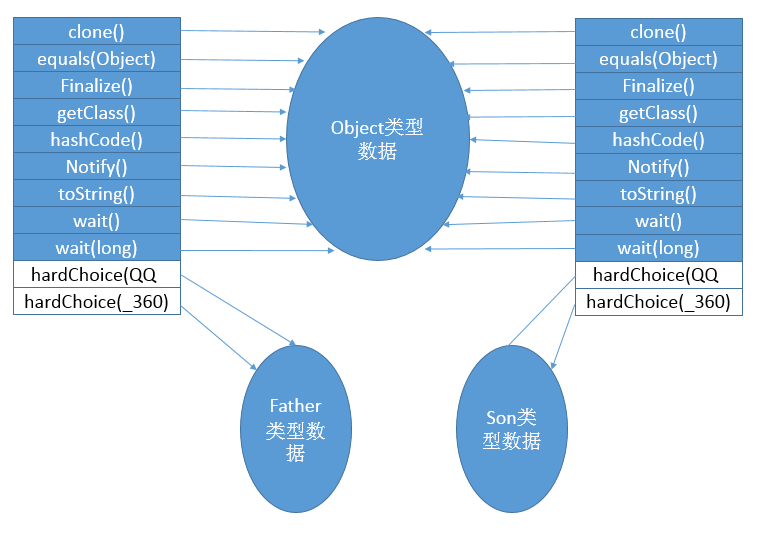
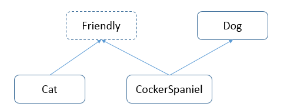
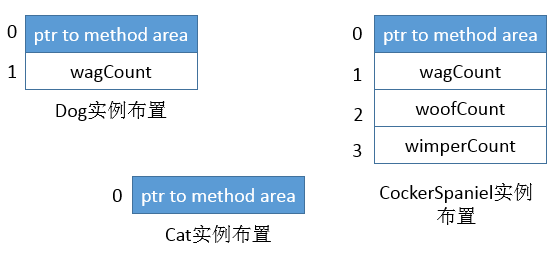
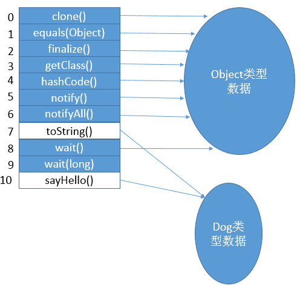
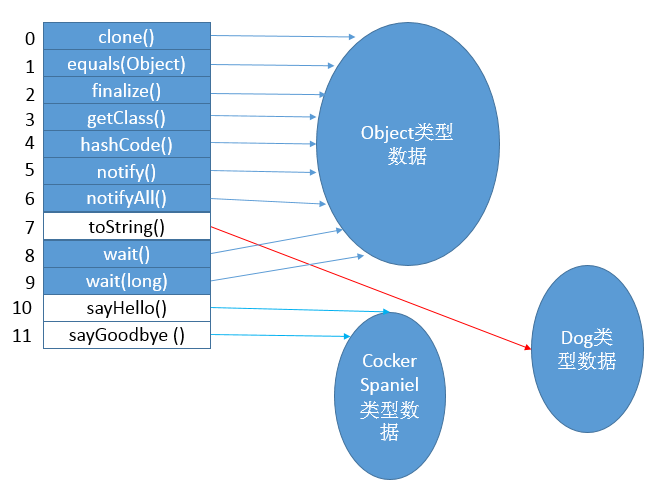
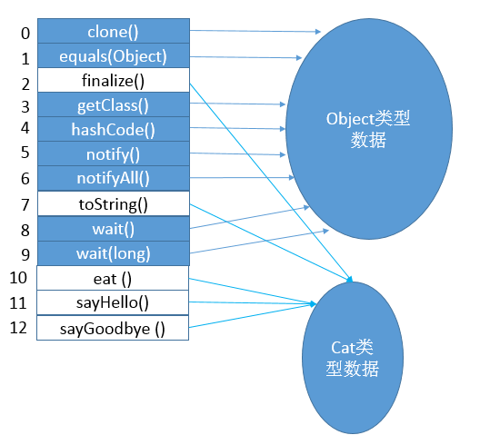

##【JVM】JVM系列之执行引擎（五）

##
##一、前言

##
##　　在了解了类加载的相关信息后，有必要进行更深入的学习，了解执行引擎的细节，如字节码是如何被虚拟机执行从而完成指定功能的呢。下面，我们将进行深入的分析。

##
##二、栈帧

##
##　　我们知道，在虚拟机中与执行方法最相关的是栈帧，程序的执行对应着栈帧的入栈和出栈，所以栈帧对于执行引擎而言，是很重要的基础。栈帧的基本结构之前已经有所介绍，这里只是再简单的过一遍。

##
##　　栈帧主要包括了局部变量表、操作数栈、动态连接、方法返回地址等信息。

##
##　　2.1 局部变量表

##
##　　用于存放方法参数和方法内部的局部变量。局部变量表的大小在方法的Code属性中就已经定义好了，为max_locals的值，局部变量表的单位为slot，32位以内的类型只占用一个slot（包括returnAddress类型），64位的类型占用两个slot。注意，对于实例方法而言，索引为0的slot存放的是this引用，之后再依次存放方法参数，定义的局部变量；slot可以被重用，当局部变量已经超出了作用域时，在作用域外在定义局部变量时，可以重用之前的slot空间。同时，局部变量没有赋值是不能够使用的，这和类变量和实例变量是有不同的，如下面代码：

	public void test() {
    int i;
    System.out.println(i);
	}


##
##　　这样的代码是错误的，没有赋值不能够使用。

##
##　　2.2 操作数栈

##
##　　执行方法时，存放操作数的栈，栈的深度在方法的Code属性中已经定义好了，为max_stack的值，32位以内的类型占用一个栈单位，64为的类型占用两个栈单位。操作数栈可以与其他栈的局部变量表共享区域，这样可以共用一部分数据。

##
##　　2.3 动态连接

##
##　　动态连接是为了支持在运行期间将符号引用转化为直接引用的操作。我们知道，每一个方法对应一个栈帧，而每一个栈帧，都包含指向对应方法的引用，这个引用就是为了支持动态连接，如invokedynamic指令。动态连接与静态解析对应，静态解析是在类加载（解析阶段）或者第一次使用时将符号引用转化为直接引用，动态连接则是每一次运行的时候都需要进行转化(invokedynamic指令)。

##
##　　2.4 方法返回地址

##
##　　正常方法返回，返回地址为到调用该方法的指令的下一条指令的地址；异常返回，返回地址由异常表确定。方法返回时，需要恢复上层方法的局部变量表、操作数栈、将返回值压入调用者栈帧的操作数栈、设置PC值。

##
##三、方法调用

##
##　　在分析了栈帧后，我们接着分析方法调用，方法调用会导致栈帧入栈，而方法调用会确定调用哪一个方法，还不会涉及到具体的方法体执行。

##
##　　3.1 解析

##
##　　在程序执行前就已经确定了方法调用的版本，即编译期就确定了调用方法版本，这个版本在运行时是不可变的。静态方法、私有方法、final方法在编译时就可以确定具体的调用版本，静态方法直接与类型相关、私有方法在外部不可访问、final不可被继承，也可唯一确定,这些方法称为非虚方法，其他方法称为虚方法。在类加载的解析阶段就可以进行解析，如下方法调用在编译期就可以确定方法调用的版本。　　
  

	class Father {
    public static void print(String str) {
        System.out.println("father " + str);
    	}
    
    private void show(String str) {
        System.out.println("father " + str);
    	}
	}

class Son extends Father {

	}

public class Test {
    public static void main(String[] args) {
        Son.print("coder");
        //Father fa = new Father();
        //fa.show("cooooder");
    	}
	}

View Code

##
##　　运行结果：

##
##　　fatcher coder

##
##　　说明：Son.print实际上调用的是Father的print方法，print方法与Father类型是相关的，而show方法时私有的方法，在Main中无法调用，只能在Father的内部调用，也是确定的。

##
##　　invokestatic(调用静态方法)、invokespecial(调用实例构造器<init>方法、私有方法、父类方法)都是在编译期就可以确定版本的。

##
##　　3.2 分派

##
##　　分派调用与多态密切相关，分为静态分派、动态分派、单分派、多分派。

##
##　　1. 静态分派

##
##　　与静态分派相关的就是方法的重载，重载时根据参数的静态类型引用类型而非实际类型决定调用哪个版本。　
  

	package com.leesf.chapter8;
/*
 * 重载方法在编译器就可以进行确定，不需要等到运行期间
 * */
public class StaticDispatch {
    static class Human {
        //
    	}
    
    static class Women extends Human {
        //
    	}
    
    static class Men extends Human {
        //
    	}
    
    public void sayHello(Human human) {
        System.out.println("say human");
    	}
    
    public void sayHello(Women women) {
        System.out.println("say women");
    	}
    
    public void sayHello(Men men) {
        System.out.println("say men");
    	}
    
    public static void main(String[] args) {
        StaticDispatch ds = new StaticDispatch();
        Human women = new Women();
        Human men = new Men();
        
        ds.sayHello(women);
        ds.sayHello(men);
    	}
	}

View Code

##
##　　运行结果：

##
##　　say human　　say human

##
##　　说明：由于静态类型（引用类型）为Human，在编译期就可以确定方法的调用版本是以Human参数的方法，和实际类型无关。

##
##　　2. 动态分派

##
##　　与动态分派相关的就是方法的重写，在子类中我们会重写父类的方法，而在调用的时候根据实际类型来宣和适合的调用版本。　
  

	package com.leesf.chapter8;

public class DynamicDispatch {
    abstract static class Human {
        abstract public void sayHello();
    	}
    
    static class Women extends Human {
        @Override
        public void sayHello() {
            System.out.println("say women");
        	}
    	}
    
    static class Men extends Human {
        @Override
        public void sayHello() {
            System.out.println("say men");
        	}
    	} 
    
    public static void main(String[] args) {
        Human women = new Women();
        Human men = new Men();
        women.sayHello();
        men.sayHello();
            
    	}
	}

View Code

##
##　　运行结果：

##
##　　say women　　say men

##
##　　说明：此时根据实际类型选择合适的方法调用，分别调用了women和men的sayHello()方法。

##
##　　方法的接收者(方法的所有者)与方法的参数统称为方法的宗量，根据分派基于多少种宗量，可以将分派划分为单分派和多分派。

##
##　　3. 单分派与多分派

##
##　　单分派根据一个宗量确定调用方法的版本；多分派根据多个宗量确定调用方法的版本。　　
  

	package com.leesf.chapter8;

import com.leesf.chapter8.Test.Son;

public class Dispatch {
    static class QQ {	};
    static class _360{	};
    
    public static class Father {
        public void hardChoice(QQ arg) {
            System.out.println("father choose qq");
        	}
        
        public void hardChoice(_360 arg) {
            System.out.println("father choose 360");
        	}
    	}
    
    public static class Son extends Father {
        public void hardChoice(QQ arg) {
            System.out.println("son choose qq");
        	}
        
        public void hardChoice(_360 arg) {
            System.out.println("son choose 360");
        	}
    	}
    
    public static void main(String[] args) {
        Father father = new Father();
        Father son = new Son();
        father.hardChoice(new _360());
        son.hardChoice(new QQ());
    	}
	}

View Code

##
##　　运行结果：

##
##　　father choose 360　　son choose qq

##
##　　说明：静态分派过程如下，在编译期阶段，会根据静态类型与参数类型确定调用版本，产生两条分别指向Father.hardChoice(QQ)和Father.hardChoice(_360)的指令，可以知道，在编译期，是由多个宗量确定调用版本，是静态多分派。动态分派过程如下，在运行期，在执行hardChoice(QQ)或者hardChoice(_360)时，已经确定了参数必须为QQ、_360，方法签名确定，静态类型和实际类型此时都不会对方法本身产生任何影响，而虚拟机会根据实际类型来确定调用版本，只根据一个宗量进行确定，因此，在运行时，是动态单分派。

##
##　　3.3 动态分派的实现

##
##　　在面向对象的编程中，会很频繁的使用到动态分派，如何实现动态分派呢？虚拟机采用在类的方法区建立一个虚方法表(非虚方法不会出现在表中)来实现。上面程序的虚方法表如下图所示。

##
## 　　说明：从Object类继承的方法都会指向Object类型数据中各方法的实际入口地址。类自身的方法会指向类的数据类型中方法的实际入口地址。父类的没有被重写的方法在虚方法表中的索引与子类方法表中的索引相同，这样，当类型变化时，只需要改变方法表就行，索引还是相同。方法表一般在类加载的连接阶段进行初始化，准备了类变量的初始值后，方法表也初始化完毕。

##
##　　下面我们再通过一个例子更加深入了解方法表。

##
##　　下面几个类的继承关系如下

##
## 

##
##　　1. Friendly　　
  

	package com.leesf.chapter8;

public interface Friendly {
    void sayHello();
    void sayGoodbye();
	}

View Code

##
##　　2. Dog　　
  

	package com.leesf.chapter8;

public class Dog {
    private int wagCount = ((int) (Math.random() * 5.0)) + 1;
    
    public void sayHello() {
        System.out.println("Wag");
        for (int i = 0; i < wagCount; i++)
            System.out.println(", wag");
    	}
    
    public String toString() {
        return "Woof";
    	}
	}

View Code

##
##　　3. Cat　　
  

	package com.leesf.chapter8;

public class Cat implements Friendly {
    public void eat() {
        System.out.println("Chomp, chomp, chomp");
    	}
    
    public void sayHello() {
        System.out.println("Rub, rub, rub");
    	}
    
    public void sayGoodbye() {
        System.out.println("Samper");
    	}
    
    protected void finalze() {
        System.out.println("Meow");
    	}
	}

View Code

##
##　　4. CockerSpaniel　　
  

	package com.leesf.chapter8;

public class CockerSpaniel extends Dog implements Friendly {
    private int woofCount = ((int) (Math.random() * 4.0)) + 1;
    
    private int wimperCount = ((int) (Math.random() * 3.0)) + 1;
    
    public void sayHello() {
        super.sayHello();
        
        System.out.println("Woof");
        for (int i = 0; i < woofCount; i++) {
            System.out.println(", woof");
        	}
    	}
    
    public void sayGoodbye() {
        System.out.println("Wimper");
        for (int i = 0; i < wimperCount; i++) {
            System.out.println(", wimper");
        	}
    	}
	}

View Code

##
##　　对象映像如下图所示

##
## 

##
##　　说明：忽略了Object的实例变量。来自超类的实例变量出现在子类实例变量之前，可以看到，Dog的实例变量wagCount的索引为1，与CockerSpaniel的索引相同，之后按照变量出现的顺序依次存放。

##
##　　Dog虚方法表

##
## 

##
##　　说明：强调，非虚方法不会出现在此表中，没有重写的Object的方法指向Object类型数据中的方法的实际入口地址。

##
##　　CockerSpaniel方法表　　 　　说明：可以看到被覆盖的sayHello方法指向了CockerSpaniel类型数据，sayHello方法的索引在Dog与CockerSpaniel中是相同的。

##
##　　Cat方法表

##
## 　　说明：由CockerSpaniel和Cat的方法表我们可以知道，sayHello方法与sayGoodbye方法在两者的方法表中的索引是不相同的，CockerSpaniel与Cat两个类之间没有关系，所以接口的方法的索引可以不相同。

##
##　　示例：
  

	package com.leesf.chapter8;

public class Tester {
    public static void main(String[] args) {
        Dog dog = new CockerSpaniel();
        dog.sayHello();
        Friendly fr = (Friendly) dog;
        fr.sayGoodbye();
        fr = new Cat();
        fr.sayGoodbye();
    	}
	}

View Code

##
##　　说明：fr首先指向CockerDaniel，然后调用了方法sayGoodbye，方法的索引为11。然后fr又指向了Cat，调用了方法sayGoodbye，方法索引为12，索引值不同，不能仅仅切换方法表，还要重新搜索（Cat的）方法表。虚拟机从接口引用调用一个方法时，它必须搜索类的方法表来找到合适的方法，并不能像之前那样根据父类方法的索引直接可以确定子类方法的索引（因为父类的方法与子类的方法的索引相同），而是需要扫描整个方法表才能确定。这种调用接口引用的实例方法比类引用调用实例方法慢得多。

##
##四、总结

##
##　　通过执行引擎的学习，明白了方法在虚拟机内部如何被执行的。只有写下来的知识理解才会更深刻，谢谢各位园友的观看~