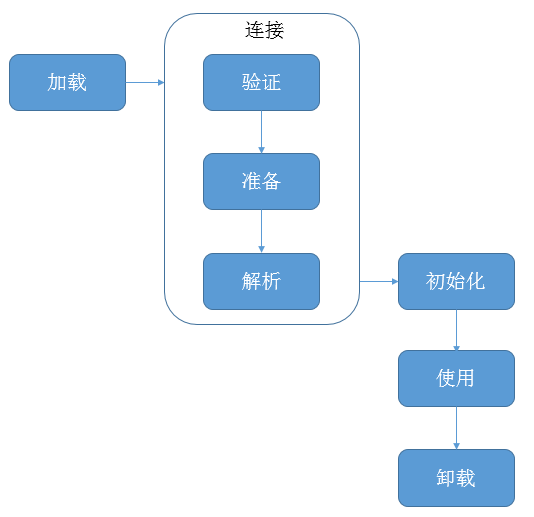

##【JVM】JVM系列之类加载机制（四）

##
##一、前言

##
##　　前面分析了class文件具体含义，接着需要将class文件加载到虚拟机中，这个过程是怎样的呢，下面，我们来仔细分析。

##
##二、什么是类加载机制

##
##　　把class文件加载到内存，并对数据进行校验、转换解析和初始化，最终形成可以被虚拟机直接使用的Java类型，这就是类加载机制。

##
##三、类加载总体流程图

##
##　　 

##
##　　说明：类的整个生命周期分为以上七个阶段，验证、准备、解析统称为连接阶段。关于加载流程笔者之前也写过一篇文章JVM之类加载器，从代码层面了解类加载机制。下面我们将更加详细的讲解各个阶段，加载阶段只是类加载的一个步骤，类加载包括以上的七个步骤。

##
##四、何时进行类加载

##
##　　加虚拟机规范规定了如下几种情况就必须要进行初始化（开始类加载）。

##
##　　1. 遇到new、getstatic、putstatic、invokestatic指令时，对应到程序中就是使用到new实例化对象时、读取或设置类静态字段时（非final）、调用静态方法时。需要进行初始化。

##
##　　2. 使用java.lang.reflect包的方法对类进行反射调用时，需要进行初始化。

##
##　　3. 使用一个类时，若其父类还未初始化，则需先初始化其父类。

##
##　　4. 虚拟机启动时，包含main方法的类，虚拟机会将其初始化。

##
##　　5. java.lang.invoke.MethodHandle实例最后的解析结果REF_getStatic、REF_putStatic、REF_invokeStatic方法句柄，并且这个方法句柄对应的类没有进行初始化，则需要先进行初始化。

##
##　　以上五种情况称为主动使用，其他的情况均称为被动使用，被动使用不会导致初始化。

##
##五、初始化示例说明

##
##　　1. 对于类而言，使用父类的静态字段（非final）不会导致子类的初始化。　　
  

	class SuperClass {
    static {
        System.out.println("super");
    	}
    
    public static final int value = 123;
	}

class SubClass extends SuperClass {
    static {
        System.out.println("sub");
    	}
	}

public class TestInit {
    public static void main(String[] args) {
        System.out.println(SubClass.value);
    	}
	}

View Code

##
##　　结果：

##
##　　super　　123

##
##　　说明：并没有初始化子类，虽然使用SubClass.value，但实际使用的是子类继承父类的静态字段，不会初始化SubClass。即只有直接定义了这个字段的类才会被初始化。

##
##　　2. 对于类或接口而言，使用其常量字段(final、static)不会导致其初始化。　
  

	class SuperClass {
    static {
        System.out.println("super");
    	}
    
    public final static int value = 123;
	}

public class TestInit {
    public static void main(String[] args) {
        System.out.println(SuperClass.value);
    	}
	}

View Code

##
##　　结果：

##
##　　123

##
##　　说明：使用常量并不会导致类或接口的常量并不会导致类或接口的初始化。因为常量在编译时进行优化，直接嵌入在TestInit.class文件的字节码中。

##
##　　3. 对于类而言，初始化子类会导致父类(不包括接口)的初始化。　　
  

	class SuperClass {
    static {
        System.out.println("super");
    	}
    
    public final static int value = 123;
	}

class SubClass extends SuperClass {
    public static int i = 3;
    static {
        System.out.println("sub");
    	}
	}
public class TestInit {
    public static void main(String[] args) {
        System.out.println(SubClass.i);
    	}
	}

View Code

##
##　　结果：

##
##　　super　　sub　　3

##
##　　说明：初始化子类会导致父类的初始化，并且父类的初始化在子类初始化的前面。

##
##　　4. 对于接口而言，初始化子接口不会导致父接口的初始化，只有在真正使用到父接口的时候(如使用父接口中定义的常量)，才会初始化。

##
##六、加载

##
##　　加载阶段虚拟机需要完成如下事情。

##
##　　1. 通过类的全限定名来获取此类的二进制字节流。

##
##　　2. 将二进制字节流所代表的静态存储结构转化为方法区的运行时数据结构。

##
##　　3. 创建一个代表带该的java.lang.Class对象，作为方法区这个类的各种数据的访问入口。

##
##　　用户可以自定义类加载器(重写loadClass方法)获取二进制字节流。对于数组类而言，数组类由java虚拟机直接创建，不通过类加载器创建。数组类的创建过程如下：

##
##　　①如果数组元素类型是引用类型，就采用双亲委派模型进行加载(之后会介绍)，数组类将在加载该元素类型的类名称空间上被标识。

##
##　　②如果数组元素类型为基本类型，数组类被标记为与引导类加载器关联。

##
##　　③数组类的可见性与其元素类型可见性一致，如果元素类型不是引用类型，那数组类的可见性默认为public。

##
##　　创建的Class对象在方法区中。对象绝大多数放在堆中，Class对象是一个例外。

##
##七、连接

##
##　　7.1 验证

##
##　　此阶段是确保class文件的字节流包含的信息符合虚拟机的要求。主要会进行如下的验证。

##
##　　1. 文件格式验证

##
##　　验证字节流是否符合Class文件格式规范。如是否以魔数开头、主次版本号是否能被虚拟机处理、常量池的常量中是否有不被支持的常量类型等等。

##
##　　2. 元数据验证

##
##　　对字节码描述的信息进行语义分析。如这个类是否有父类、这个类是否继承了不允许被继承的类、非抽象类是否实现了父类或接口中要求实现的所有方法等等。

##
##　　3. 字节码验证

##
##　　分析数据流和控制流，确定程序语义是否合法，符合逻辑。如任意时刻操作数栈的数据类型与指令代码序列都能配合工作、保证跳转指令不会跳转到方法体以外的字节码指令上等等。

##
##　　4. 符号引用验证

##
##　　符号引用转化为直接引用的时候进行验证。如符号引用中通过字符串描述的全限定名是否能够找到对应的类、指定类中是否存在符合方法的字段描述符以及简单名称所描述的方法和字段等等。

##
##　　7.2 准备

##
##　　为类变量分配内存并为类变量设置系统初始值的阶段，这些变量所使用的内存都将在方法区进行分配。静态字段(非final)会被赋予系统默认值，而对于常量字段（final、static），在准备阶段直接赋予用户设定的值。

##
##　　7.3 解析

##
##　　将常量池中的符号引用（包括类或接口的全限定名、字段名和描述符、方法名和描述符）替换为直接引用（内存地址）。符号引用与最终class文件载入内存的布局无关，直接引用与内存的布局有关。为了加快解析效率，可以对解析结果进行缓存，之后再解析符号引用时直接返回即可，但是对于invokedynamic则不能进行缓存。解析主要是针对CONSTANT_Class_info、CONSTANT_Fieldref_info、CONSTANT_Methodref_info、CONSTANT_InterfaceMethodref_info、CONSTANT_MethodType_info、CONSTANT_MethodHandle_info、CONSTANT_InvokeDynamic_info七种常量类型。

##
##　　指向类型、类变量、类方法的直接引用可能是指向方法区的本地指针。类型的直接引用可能简单地指向保存类型数据的方法区中的与实现相关的数据结构。类变量的直接引用可以指向方法区中保存的类变量的值。类方法的直接引用可以指向方法区中的一段数据结构方法区中包含调用方法的必要数据。

##
##　　指向实例变量和实例方法的直接引用都是偏移量。实例变量的直接引用可能是从对象的映像开始算起到这个实例变量位置的偏移量。实例方法的直接引用可能是到方法表的偏移量。

##
##　　1. 类或接口的解析

##
##　　将符号引用替换为直接引用包括如下几步。假设符号引用记为S，当前类记为C，S对应的类或接口记为I。

##
##　　① 若S不是数组类型，则把S传递给当前类C的类加载器进行加载，这个过程可能会触发其他的加载，这个过程一旦出现异常，则解析失败。

##
##　　② 若S是数组类型，并且数组元素类型为对象，则S的描述符会形如[java/lang/String，按照第一条去加载该类型，如果S的描述符符合，则需要加载的类型就是java.lang.String，接着有虚拟机生成一个代表此数组唯独和元素的数组对象。

##
##　　③ 若以上两个步骤没有出现异常，即I已经存在于内存中了，但是解析完成时还需要进行符号引用验证，确认C是否具备对I的访问权限。若不具备，则抛出java.lang.IllegalAccessError异常。

##
##　　2. 字段解析

##
##　　首先将CONSTANT_Fieldref_info中的class_index索引的CONSTANT_Class_info符号引用进行解析，即解析字段所在类或接口，若解析出现异常，则字段解析失败。如解析成功，则进行下面的解析步骤。假设该字段所属的类或接口标记为C。

##
##　　① 如果C包含了字段的简单名和描述符与目标相匹配的字段，则返回这个字段的直接引用，查找结束。

##
##　　② 否则，如果C实现了接口，按照继承关系从下往上递归搜索各个接口和它的父接口，看是否存在相匹配的字段。存在，则返回直接引用，查找结束。

##
##　　③ 否则，如果C不是Object对象，按照继承关系从下往上递归搜索父类，看是否存在相匹配的字段。存在，则返回直接引用，查找结束。

##
##　　④ 否则，查找失败，抛出java.lang.NoSuchFieldError异常。

##
##　　说明：字段解析对接口优先搜索。

##
##　　3. 类方法解析 

##
##　　首先将CONSTANT_Methodref_info中的class_index索引的CONSTANT_Class_info符号引用进行解析，即解析方法所在的类或接口，若解析出现异常，则方法解析失败；如解析成功，则进行下面解析步骤。假设该方法所属的类标记为C。

##
##　　① 如果在方法表中发现CONSTANT_Class_info中索引的C是一个接口而不是一个类，则抛出java.lang.IncompatibleClassChangeError异常。

##
##　　② 否则，如果C中包含了方法的简单名和描述符与目标相匹配的字段，则返回这个方法的直接引用，查找结束。

##
##　　③ 否则，在C的父类中递归搜索，看是否存在相匹配的方法，存在，则返回直接引用，查找结束。

##
##　　④ 否则，在C实现的接口列表及父接口中递归搜索，看是否存在相匹配的方法，存在，说明C是一个抽象类（没有实现该方法，否则，在第一步就查找成功），抛出java.lang.AbstractMethodError异常。

##
##　　⑤ 否则，查找失败，抛出java.lang.NoSuchMethodError异常。

##
##　　⑥ 若查找过程成功，则对方法进行权限验证，如果发现不具备对此方法的访问权限，则抛出java.lang.lllegalAccessError异常。

##
##　　说明：方法解析对父类优先搜索。

##
##　　4. 接口方法解析

##
##　　首先将CONSTANT_InterfaceMethodref_info中的class_index索引的CONSTANT_Class_info符号引用进行解析，即解析方法所在的类或接口，若解析出现异常，则方法解析失败；如解析成功，则进行下面解析步骤。假设该方法所属的类标记为C。

##
##　　① 如果在方法表中发现CONSTANT_Class_info中索引的C是一个类而不是接口，则抛出java.lang.IncompatibleClassChangeError异常。

##
##　　② 否则，如果C中包含了方法的简单名和描述符与目标相匹配的字段，则返回这个方法的直接引用，查找结束。

##
##　　③ 否则，在C的父接口中递归搜索，直到Object类，看是否存在相匹配的方法，存在，则返回直接引用，查找结束。

##
##　　④ 否则，查找失败，抛出java.lang.NoSuchMethodError异常。

##
##　　⑤ 若查找过程成功，不需要进行权限验证，因为接口方法为public，不会抛出java.lang.IllegalAccessError异常。

##
##八、初始化

##
##　　在此阶段，才开始真正执行用户自定的java代码。在准备阶段，类变量已经被赋予了系统默认值，而在初始化阶段，会赋予用户自定义的值。而初始化阶段是在<clinit>()方法中执行的。

##
##　　8.1 <clinit>()方法

##
##　　① 由编译器收集类中的所有类变量的赋值动作（如果仅仅只是声明，不会被收集）和静态语句块中的语句合并产生的，收集顺序按照语句在源文件中出现的顺序所决定；在静态语句块中只能访问定义在静态语句之前的变量；而对于定义在静态语句块之后的变量，可以进行赋值，但是不能够访问。

##
##　　② 不需要显示调用父类构造器，虚拟机会保证在子类的<clinit>()方法执行之前，父类的<clinit>()方法已经执行完毕，所以，第一个被执行的<clinit>()方法的类肯定是java.lang.Object。

##
##　　③ 父类中定义的静态语句块优先于子类的静态语句。

##
##　　④ 此方法对类和接口都不是必须的，若类中没有静态语句块和静态变量赋值操作，则不会生成<clinit>()方法。

##
##　　⑤ 接口会生成此方法，因为对接口的字段可以进行赋值操作。执行接口的<clinit>()方法不需要先执行父接口的<clinit>()方法，只有在使用父接口的变量时，才会进行初始化；接口的实现类在初始化时也不会执行接口的<clinit>()方法。

##
##　　⑥ 此方法在多线程环境中会被正确的加锁、同步。

##
##九、类加载器

##
##　　类加载器用于加载类，任何类都需要由加载它的类加载器和这个类一同确立其在Java虚拟机中的唯一性，每一个类加载器，都有一个独立的类名称空间，由不同类加载的类不可能相等。

##
##　　9.1. 双亲委派模型

##
##　　从虚拟机角度看，只存在两种类加载器：1. 启动类加载器。2. 其他类加载器。从开发人员角度看，包括如下类加载器：1. 启动类加载器。2. 扩展类加载器。3. 应用程序类加载器。4. 自定义类加载器。

##
##　　① 启动类加载器，用于加载Java API，加载<JAVA_HOME>\lib目录下的类库。

##
##　　② 扩展类加载类，由sun.misc.Launcher$ExtClassLoader实现，用于加载<JAVA_HOME>\lib\ext目录下或者被java.ext.dirs系统变量指定路径下的类库。

##
##　　③ 应用程序类加载器，也成为系统类加载器，由sun.misc.Launcher$AppClassLoader实现，用于加载用户类路径(ClassPath)上所指定的类库。

##
##　　④ 自定义类加载器，继承系统类加载器，实现用户自定义加载逻辑。

##
##　　各个类加载器之间是组合关系，并非继承关系。

##
##　　当一个类加载器收到类加载的请求，它将这个加载请求委派给父类加载器进行加载，每一层加载器都是如此，最终，所有的请求都会传送到启动类加载器中。只有当父类加载器自己无法完成加载请求时，子类加载器才会尝试自己加载。

##
##　　双亲委派模型可以确保安全性，可以保证所有的Java类库都是由启动类加载器加载。如用户编写的java.lang.Object，加载请求传递到启动类加载器，启动类加载的是系统中的Object对象，而用户编写的java.lang.Object不会被加载。如用户编写的java.lang.virus类，加载请求传递到启动类加载器，启动类加载器发现virus类并不是核心Java类，无法进行加载，将会由具体的子类加载器进行加载，而经过不同加载器进行加载的类是无法访问彼此的。由不同加载器加载的类处于不同的运行时包。所有的访问权限都是基于同一个运行时包而言的。　

##
##十、使用

##
##　　完成了初始化阶段后，我们就可以使用对象了，在程序中可以随意进行访问，只要类还没有被卸载。

##
##十一、卸载

##
##　　对类型进行卸载，在之前的垃圾回收中我们已经讲解了如何才能对类型进行卸载，即回收操作。启动类加载的类型永远是可触及的，回收的是由用户自定义加加载器加载的类。

##
##十二、总结

##
##　　对于类加载机制的讲解就到这里了，相信经过本篇学习对于类加载机制有了更深刻的理解。谢谢各位园友观看~

##
##　　

##
##

##
##　　

##
##　　