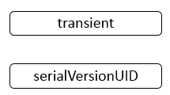

**一、前言**

复习Java基础知识点的序列化与反序列化过程，整理了如下学习笔记。

**二、为什么需要序列化与反序列化**

程序运行时，只要需要，对象可以一直存在，并且我们可以随时访问对象的一些状态信息，如果程序终止，那么对象是肯定不会存在的，但是有时候，我们需要再程序终止时保存对象的状态信息，之后程序再次运行时可以重新恢复到之前的状态，如，玩家玩游戏退出时，需要保存玩家的状态信息（如等级、装备等等），之后玩家再此登入时，必须要恢复这些状态信息。我们可以通过数据库手段来达到这个保存状态的目的，在Java中，我们有更简便的方法进行处理，那就是序列化与反序列化。序列化是一种对象持久化的手段，反序列化与序列化相反，其是通过序列化后的信息重新组装成对象。序列化与反序列化普遍应用在网络传输、RMI等场景中。

**三、序列化概述**

3.1 序列化类结构图

下面展示了与序列化相关的类的结构图

说明：虚线框的表示接口类型，实线框表示具体的类。

3.2 序列化关键字说明

与序列化相关的关键字如下

说明：

1\. 关键字transient，用来修饰字段，表示此字段在默认序列化过程中不会被处理，但是可以采用另外的手段进行处理。

2\. 关键字serialVersionUID，表示序列化版本号，当两个类的序列化ID一致时允许反序列化，默认可以采用编译器提供的值1L。

3.3 序列化方法说明

与序列化相关的方法如下

说明：writeObject与readObject方法分别在ObjectOutput接口与ObjectInput接口中声明，在ObjectOutputStream与ObjectInputStream中实现。

**四、Serializable**

4.1 Serializable定义

Serializable定义如下

    
    
    public interface Serializable {
    }

说明：Serializable为一个接口，并且没有任何字段和方法，仅仅作为一个标识。

4.2 使用说明

当序列化对象时，只需要将对象标记为可序列化，即实现接口Serializable即可。下面的Person类实现了Serializable接口。

    
    
    package com.hust.grid.leesf.serializable;
    
    import java.io.Serializable;
    
    public class Person implements Serializable {
        /**
         * 
         */
        private static final long serialVersionUID = 1L;
        private String name;
        private String gender;
        private int age;
        private transient Person friend;
    
    
        public Person() {
            
        }
    
        public String getName() {
            return name;
        }
    
        public void setName(String name) {
            this.name = name;
        }
    
        public String getGender() {
            return gender;
        }
    
        public void setGender(String gender) {
            this.gender = gender;
        }
    
        public int getAge() {
            return age;
        }
    
        public void setAge(int age) {
            this.age = age;
        }
        
        public Person getFriend() {
            return friend;
        }
        
        public void setFriend(Person friend) {
            this.friend = friend;
        }
    
        @Override
        public String toString() {
            return "name = " + name + ", gender = " + gender + ", age = " + age
                    + ", friend info is [" + friend + "]";
        }
    }

View Code

Person类的friend字段设置为transient，表明不会被序列化，定义完Person类之后，我们即可以对Person类进行序列化与反序列化操作了，具体代码如下

    
    
    package com.hust.grid.leesf.serializable;
    
    import java.io.File;
    import java.io.FileInputStream;
    import java.io.FileOutputStream;
    import java.io.ObjectInputStream;
    import java.io.ObjectOutputStream;
    
    public class SerializableDemo {
        public static void main(String[] args) throws Exception {
            Person leesf = new Person();
            Person dyd = new Person();
            leesf.setAge(24);
            leesf.setGender("man");
            leesf.setName("leesf");
            
            dyd.setAge(24);
            dyd.setGender("woman");
            dyd.setName("dyd");    
            
            leesf.setFriend(dyd);
            dyd.setFriend(null);
            
            File file = new File("test");
            ObjectOutputStream oos = new ObjectOutputStream(new FileOutputStream(file));
            oos.writeObject(leesf);
            oos.flush();
            oos.close();
            System.out.println(leesf);
                
            ObjectInputStream ois = new ObjectInputStream(new FileInputStream(file));
            leesf = (Person) ois.readObject();
            ois.close();    
            System.out.println(leesf);    
        }
    }

View Code

运行结果如下

    
    
    name = leesf, gender = man, age = 24, friend info is [name = dyd, gender = woman, age = 24, friend info is [null]]
    name = leesf, gender = man, age = 24, friend info is [null]

说明：由于friend字段标记为transient，则默认序列化操作时不会进行序列化，反序列化后其值为null。

4.3 问题说明

1\. Person类不实现Serializable接口

若Person类不实现Serializable接口，进行序列化时，会发生什么，会出现如下异常。

    
    
    Exception in thread "main" java.io.NotSerializableException:****

表示Person没有实现Serializable接口，具体原因如下

在调用writeObject方法后，会经过一系列的调用，具体的调用栈如下

说明：截取了writeObject0函数中的一段代码，可以看到会检查该对象是否是Serializable类型，不是，则会抛出异常。

2\. 处理transient对象

当字段被transient修饰时，采用默认的序列化机制将不会对其进行处理，但是，如果要序列化transient字段时，如何做呢，可以在要进行序列化的类中添加writeObject和readObject方法，其方法签名如下

    
    
    private void writeObject(ObjectOutputStream stream) throws IOException
    private void readObject(ObjectInputStream stream) throws IOException, ClassNotFoundException

说明：注意，writeObject与readObject是采用private修饰符修饰的，说明，此方法只能在该类的其他方法中被调用，其他类中不能调用此方法，那么当调用ObjectOutputStream的writeObject方法时，如何调用到此方法来执行用户自定义处理逻辑的呢，答案是反射。利用反射可以在别的类中调用到此类中私有的方法，反射很强大。

利用这个方法，我们修改Person类如下

    
    
    package com.hust.grid.leesf.serializable;
    
    import java.io.IOException;
    import java.io.ObjectInputStream;
    import java.io.ObjectOutputStream;
    import java.io.Serializable;
    
    public class Person implements Serializable {
        /**
         * 
         */
        private static final long serialVersionUID = 1L;
        private String name;
        private String gender;
        private int age;
        private transient Person friend;
    
    
        public Person() {
            
        }
    
        public String getName() {
            return name;
        }
    
        public void setName(String name) {
            this.name = name;
        }
    
        public String getGender() {
            return gender;
        }
    
        public void setGender(String gender) {
            this.gender = gender;
        }
    
        public int getAge() {
            return age;
        }
    
        public void setAge(int age) {
            this.age = age;
        }
        
        public Person getFriend() {
            return friend;
        }
        
        public void setFriend(Person friend) {
            this.friend = friend;
        }
    
        @Override
        public String toString() {
            return "name = " + name + ", gender = " + gender + ", age = " + age
                    + ", friend info is [" + friend + "]";
        }
    
        private void writeObject(ObjectOutputStream stream) 
                throws IOException {
            stream.defaultWriteObject();
            stream.writeObject(friend);
        }
        
        private void readObject(ObjectInputStream stream) 
                throws IOException, ClassNotFoundException {
            stream.defaultReadObject();
            friend = (Person) stream.readObject();
        }
    }

View Code

测试类的代码不做修改，运行结果如下

    
    
    name = leesf, gender = man, age = 24, friend info is [name = dyd, gender = woman, age = 24, friend info is [null]]
    name = leesf, gender = man, age = 24, friend info is [name = dyd, gender = woman, age = 24, friend info is [null]]

说明：在实现自定义的逻辑时，在writeObject方法中可以调用defaultWriteObject()方法实现默认序列化(序列化非transient字段)，可以单独处理transient关键字；在readObject方法中可以调用defaultReadObject()方法实现默认反序列化，可以单独处理transient关键字（需要赋值）。值得注意的是，writeObject方法中defaultWriteObject和处理transient关键字的逻辑必须与readObject中defaultReadObject和处理transient关键字的逻辑顺序一致，否则会抛出异常。

在调用writeObject方法后，会经过一系列的调用，具体的调用栈如下

说明：经过反射，最终会调用到在Person类中定义的writeObject方法。readObject方法的调用可以以此类比，不再累赘。

**五、Externalizable**

除了使用Serializable接口进行序列化以外，还可以使用Externalizable接口来进行序列化。

5.1 Externalizable定义

Externalizable的定义如下

    
    
    public interface Externalizable extends java.io.Serializable {
        void writeExternal(ObjectOutput out) throws IOException;
        void readExternal(ObjectInput in) throws IOException, ClassNotFoundException;
    }

说明：Externalizable实现了Serializable接口，并且添加了两个方法writeExternal与readExternal，需要序列化的类需要实现Externalizable接口，并且重写接口中定义的两个方法。

5.2 使用说明

首先将序列化的类实现Externalizable接口并且重写writeExternal与readExternal方法，并在这两个方法中实现处理逻辑。我们定义Person类如下

    
    
    package com.hust.grid.leesf.serializable;
    
    import java.io.Externalizable;
    import java.io.IOException;
    import java.io.ObjectInput;
    import java.io.ObjectOutput;
    
    public class Person implements Externalizable {
        /**
         * 
         */
        private static final long serialVersionUID = 1L;
        private String name;
        private String gender;
        private int age;
        private transient Person friend;
        
        public Person() {
            
        }
    
        public String getName() {
            return name;
        }
    
        public void setName(String name) {
            this.name = name;
        }
    
        public String getGender() {
            return gender;
        }
    
        public void setGender(String gender) {
            this.gender = gender;
        }
    
        public int getAge() {
            return age;
        }
    
        public void setAge(int age) {
            this.age = age;
        }
        
        public Person getFriend() {
            return friend;
        }
        
        public void setFriend(Person friend) {
            this.friend = friend;
        }
    
        @Override
        public String toString() {
            return "name = " + name + ", gender = " + gender + ", age = " + age
                    + ", friend info is [" + friend + "]";
        }
    
        @Override
        public void writeExternal(ObjectOutput out) throws IOException {
            out.writeUTF(name);
            out.writeUTF(gender);
            out.writeInt(age);
            out.writeObject(friend);
        }
    
        @Override
        public void readExternal(ObjectInput in) throws IOException,
                ClassNotFoundException {
            name = in.readUTF();
            gender = in.readUTF();
            age = in.readInt();
            friend = (Person) in.readObject();        
        }    
    }

View Code

说明：Person类实现了Externalizable接口，重写了writeExternal与readExternal方法，并且实现了用户自定义序列化与反序列化逻辑。测试类代码不变，运行结果如下：

    
    
    name = leesf, gender = man, age = 24, friend info is [name = dyd, gender = woman, age = 24, friend info is [null]]
    name = leesf, gender = man, age = 24, friend info is [name = dyd, gender = woman, age = 24, friend info is [null]]

说明：从结果可知，成功进行了序列化与反序列化过程。值得注意的是，我们必须要给Person类提供一个无参构造器，才能正确完成序列化与反序列化过程。否则会抛出如下异常

修改Person类如下

    
    
    package com.hust.grid.leesf.serializable;
    
    import java.io.Externalizable;
    import java.io.IOException;
    import java.io.ObjectInput;
    import java.io.ObjectOutput;
    
    public class Person implements Externalizable {
        /**
         * 
         */
        private static final long serialVersionUID = 1L;
        private String name;
        private String gender;
        private int age;
        private transient Person friend;
        
        public Person(String name) {
            this.name = name;
        }
    
        public String getName() {
            return name;
        }
    
        public void setName(String name) {
            this.name = name;
        }
    
        public String getGender() {
            return gender;
        }
    
        public void setGender(String gender) {
            this.gender = gender;
        }
    
        public int getAge() {
            return age;
        }
    
        public void setAge(int age) {
            this.age = age;
        }
        
        public Person getFriend() {
            return friend;
        }
        
        public void setFriend(Person friend) {
            this.friend = friend;
        }
    
        @Override
        public String toString() {
            return "name = " + name + ", gender = " + gender + ", age = " + age
                    + ", friend info is [" + friend + "]";
        }
    
        @Override
        public void writeExternal(ObjectOutput out) throws IOException {
            out.writeUTF(name);
            out.writeUTF(gender);
            out.writeInt(age);
            out.writeObject(friend);
        }
    
        @Override
        public void readExternal(ObjectInput in) throws IOException,
                ClassNotFoundException {
            name = in.readUTF();
            gender = in.readUTF();
            age = in.readInt();
            friend = (Person) in.readObject();        
        }    
    }

View Code

说明：提供一个参数的构造函数，没有无参构造函数，修改测试类代码如下

    
    
    package com.hust.grid.leesf.serializable;
    
    import java.io.File;
    import java.io.FileInputStream;
    import java.io.FileOutputStream;
    import java.io.ObjectInputStream;
    import java.io.ObjectOutputStream;
    
    public class SerializableDemo {
        public static void main(String[] args) throws Exception {
            Person leesf = new Person("leesf");
            Person dyd = new Person("dyd");
            leesf.setAge(24);
            leesf.setGender("man");
            leesf.setName("leesf");
            
            dyd.setAge(24);
            dyd.setGender("woman");
            dyd.setName("dyd");    
            
            leesf.setFriend(dyd);
            dyd.setFriend(null);
            
            File file = new File("test");
            ObjectOutputStream oos = new ObjectOutputStream(new FileOutputStream(file));
            oos.writeObject(leesf);
            oos.flush();
            oos.close();
            System.out.println(leesf);
                
            ObjectInputStream ois = new ObjectInputStream(new FileInputStream(file));
            leesf = (Person) ois.readObject();
            ois.close();    
            System.out.println(leesf);    
        }
    }

View Code

运行结果如下

    
    
    name = leesf, gender = man, age = 24, friend info is [name = dyd, gender = woman, age = 24, friend info is [null]]
    Exception in thread "main" java.io.InvalidClassException: com.hust.grid.leesf.serializable.Person; no valid constructor
        at java.io.ObjectStreamClass$ExceptionInfo.newInvalidClassException(ObjectStreamClass.java:150)
        at java.io.ObjectStreamClass.checkDeserialize(ObjectStreamClass.java:768)
        at java.io.ObjectInputStream.readOrdinaryObject(ObjectInputStream.java:1775)
        at java.io.ObjectInputStream.readObject0(ObjectInputStream.java:1351)
        at java.io.ObjectInputStream.readObject(ObjectInputStream.java:371)
        at com.hust.grid.leesf.serializable.SerializableDemo.main(SerializableDemo.java:32)

说明：在反序列化的过程抛出了异常，可以看出是Person类没有合法的构造器，合法的构造器就是指无参构造器。当提供了无参构造器之后，就可以正确运行。

5.3 问题说明

1\. Externalizable，writeObject与readObject方法

如果Person类实现了Externalizable接口，并且在Person类中添加了writeObject与readObject方法，那么在进行序列化与反序列化时，是以哪种方法为准呢，修改Person类如下

    
    
    package com.hust.grid.leesf.serializable;
    
    import java.io.Externalizable;
    import java.io.IOException;
    import java.io.ObjectInput;
    import java.io.ObjectInputStream;
    import java.io.ObjectOutput;
    import java.io.ObjectOutputStream;
    
    public class Person implements Externalizable {
        /**
         * 
         */
        private static final long serialVersionUID = 1L;
        private String name;
        private String gender;
        private int age;
        private transient Person friend;
        
        public Person() {
            
        }
    
        public String getName() {
            return name;
        }
    
        public void setName(String name) {
            this.name = name;
        }
    
        public String getGender() {
            return gender;
        }
    
        public void setGender(String gender) {
            this.gender = gender;
        }
    
        public int getAge() {
            return age;
        }
    
        public void setAge(int age) {
            this.age = age;
        }
        
        public Person getFriend() {
            return friend;
        }
        
        public void setFriend(Person friend) {
            this.friend = friend;
        }
    
        @Override
        public String toString() {
            return "name = " + name + ", gender = " + gender + ", age = " + age
                    + ", friend info is [" + friend + "]";
        }
    
        @Override
        public void writeExternal(ObjectOutput out) throws IOException {
            System.out.println("use writeExternal method");
            out.writeUTF(name);
            out.writeUTF(gender);
            out.writeInt(age);
            out.writeObject(friend);
        }
    
        @Override
        public void readExternal(ObjectInput in) throws IOException,
                ClassNotFoundException {
            System.out.println("use readExternal method");
            name = in.readUTF();
            gender = in.readUTF();
            age = in.readInt();
            friend = (Person) in.readObject();        
        }    
        
        private void writeObject(ObjectOutputStream stream) 
                throws IOException {
            System.out.println("use writeObject method");
            stream.defaultWriteObject();
            stream.writeObject(friend);
        }
        
        private void readObject(ObjectInputStream stream) 
                throws IOException, ClassNotFoundException {
            System.out.println("use readObject method");
            stream.defaultReadObject();
            friend = (Person) stream.readObject();
        }
    }

View Code

说明：在方法中添加了打印语句，这样就可以轻易判别采用的何种方式。测试类代码如下

    
    
    package com.hust.grid.leesf.serializable;
    
    import java.io.File;
    import java.io.FileInputStream;
    import java.io.FileOutputStream;
    import java.io.ObjectInputStream;
    import java.io.ObjectOutputStream;
    
    public class SerializableDemo {
        public static void main(String[] args) throws Exception {
            Person leesf = new Person();
            Person dyd = new Person();
            leesf.setAge(24);
            leesf.setGender("man");
            leesf.setName("leesf");
            
            dyd.setAge(24);
            dyd.setGender("woman");
            dyd.setName("dyd");    
            
            leesf.setFriend(dyd);
            dyd.setFriend(null);
            
            File file = new File("test");
            ObjectOutputStream oos = new ObjectOutputStream(new FileOutputStream(file));
            oos.writeObject(leesf);
            oos.flush();
            oos.close();
            System.out.println(leesf);
                
            ObjectInputStream ois = new ObjectInputStream(new FileInputStream(file));
            leesf = (Person) ois.readObject();
            ois.close();    
            System.out.println(leesf);    
        }
    }

View Code

运行结果

    
    
    use writeExternal method
    use writeExternal method
    name = leesf, gender = man, age = 24, friend info is [name = dyd, gender = woman, age = 24, friend info is [null]]
    use readExternal method
    use readExternal method
    name = leesf, gender = man, age = 24, friend info is [name = dyd, gender = woman, age = 24, friend info is [null]]

说明：从结果可以看出，是以Externalizable接口中定义的两个方法进行序列化与反序列化的，这时，读者可能又会有另外一个疑问，那就是为什么会打印两次呢？答案是因为该方法被调用了两次，因为Person类有一个Person域，会导致调用两次。

2\. 处理transient字段

可以在writeExternal与readExternal方法中实现自定义逻辑，对transient字段进行序列化与反序列化。

**六、序列化问题**

6.1 采用默认序列化机制，类的静态字段会被序列化吗？

采用默认序列化机制进行序列化时，类的静态字段会被序列化吗，此时类的静态字段不会被序列化，当然，我们可以采用自定义序列化逻辑对静态变量进行序列化。

6.2 父类序列化问题

采用默认序列化机制序列化子类时，其父类的字段会被序列化吗？可以分为如下情形

1\. 父类没有实现Serializable接口，没有提供默认构造函数

这时，反序列化会出错，提示没有提供正确的构造函数。修改Person类，代码如下

    
    
    package com.hust.grid.leesf.serializable;
    
    import java.io.Serializable;
    
    class Human {
        private int number;
        
        public Human(int number) {
            this.number = number;
        }
        
        public int getNumber() {
            return number;
        }
        
        public void setNumber(int number) {
            this.number = number;
        }
        
        public String toString() {
            return "number = " + number;
        }
    }
    
    public class Person extends Human implements Serializable {
        /**
         * 
         */
        private static final long serialVersionUID = 1L;
        private String name;
        private String gender;
        private int age;
        private transient Person friend;
        
        
        
        
        public Person(int number, String name) {
            super(number);
            this.name = name;
        }
    
        public String getName() {
            return name;
        }
    
        public void setName(String name) {
            this.name = name;
        }
    
        public String getGender() {
            return gender;
        }
    
        public void setGender(String gender) {
            this.gender = gender;
        }
    
        public int getAge() {
            return age;
        }
    
        public void setAge(int age) {
            this.age = age;
        }
        
        public Person getFriend() {
            return friend;
        }
        
        public void setFriend(Person friend) {
            this.friend = friend;
        }
    
        @Override
        public String toString() {
            return super.toString() + ", name = " + name + ", gender = " + gender + ", age = " + age
                    + ", friend info is [" + friend + "]";
        }    
    }

View Code

测试类的的代码如下

    
    
    package com.hust.grid.leesf.serializable;
    
    import java.io.File;
    import java.io.FileInputStream;
    import java.io.FileOutputStream;
    import java.io.ObjectInputStream;
    import java.io.ObjectOutputStream;
    
    public class SerializableDemo {
        public static void main(String[] args) throws Exception {
            Person leesf = new Person(1, "leesf");
            Person dyd = new Person(2, "dyd");
            leesf.setAge(24);
            leesf.setGender("man");
            leesf.setName("leesf");
            
            dyd.setAge(24);
            dyd.setGender("woman");
            dyd.setName("dyd");    
            
            leesf.setFriend(dyd);
            dyd.setFriend(null);
            
            File file = new File("test");
            ObjectOutputStream oos = new ObjectOutputStream(new FileOutputStream(file));
            oos.writeObject(leesf);
            oos.flush();
            oos.close();
            System.out.println(leesf);
                        
            ObjectInputStream ois = new ObjectInputStream(new FileInputStream(file));
            leesf = (Person) ois.readObject();
            ois.close();    
            System.out.println(leesf);    
        }
    }

View Code

运行结果

    
    
    number = 1, name = leesf, gender = man, age = 24, friend info is [number = 2, name = dyd, gender = woman, age = 24, friend info is [null]]
    Exception in thread "main" java.io.InvalidClassException: com.hust.grid.leesf.serializable.Person; no valid constructor
        at java.io.ObjectStreamClass$ExceptionInfo.newInvalidClassException(ObjectStreamClass.java:150)
        at java.io.ObjectStreamClass.checkDeserialize(ObjectStreamClass.java:768)
        at java.io.ObjectInputStream.readOrdinaryObject(ObjectInputStream.java:1775)
        at java.io.ObjectInputStream.readObject0(ObjectInputStream.java:1351)
        at java.io.ObjectInputStream.readObject(ObjectInputStream.java:371)
        at com.hust.grid.leesf.serializable.SerializableDemo.main(SerializableDemo.java:32)

说明：可以看出是没有提供合法的构造函数。

2. 父类没有实现Serializable接口，提供默认构造函数

第一步中出现了错误，此时，我们修改Person类，代码如下

    
    
    package com.hust.grid.leesf.serializable;
    
    import java.io.Serializable;
    
    class Human {
        private int number;
        public Human() {
            
        }
        public Human(int number) {
            this.number = number;
        }
        
        public int getNumber() {
            return number;
        }
        
        public void setNumber(int number) {
            this.number = number;
        }
        
        public String toString() {
            return "number = " + number;
        }
    }
    public class Person extends Human implements Serializable {
        /**
         * 
         */
        private static final long serialVersionUID = 1L;
        private String name;
        private String gender;
        private int age;
        private transient Person friend;
        
        public Person() {
            super();
        }
        
        public Person(int number, String name) {
            super(number);
            this.name = name;
        }
    
        public String getName() {
            return name;
        }
    
        public void setName(String name) {
            this.name = name;
        }
    
        public String getGender() {
            return gender;
        }
    
        public void setGender(String gender) {
            this.gender = gender;
        }
    
        public int getAge() {
            return age;
        }
    
        public void setAge(int age) {
            this.age = age;
        }
        
        public Person getFriend() {
            return friend;
        }
        
        public void setFriend(Person friend) {
            this.friend = friend;
        }
    
        @Override
        public String toString() {
            return super.toString() + ", name = " + name + ", gender = " + gender + ", age = " + age
                    + ", friend info is [" + friend + "]";
        }    
    }

View Code

说明：给Human类提供了无参构造函数。测试类代码不变，运行结果如下

    
    
    number = 1, name = leesf, gender = man, age = 24, friend info is [number = 2, name = dyd, gender = woman, age = 24, friend info is [null]]
    number = 0, name = leesf, gender = man, age = 24, friend info is [null]

说明：此时，我们可以看到，可以进行反序列化了，但是父类的number字段被赋值为int的默认值0，Person类的transient字段没有被序列化。

3\. 父类实现Serializable接口

当父类实现Serializable接口时，修改Person类代码如下

    
    
    package com.hust.grid.leesf.serializable;
    
    import java.io.Serializable;
    
    class Human implements Serializable {
        /**
         * 
         */
        private static final long serialVersionUID = 1L;
        private int number;
        public Human() {
            
        }
        public Human(int number) {
            this.number = number;
        }
        
        public int getNumber() {
            return number;
        }
        
        public void setNumber(int number) {
            this.number = number;
        }
        
        public String toString() {
            return "number = " + number;
        }
    }
    public class Person extends Human implements Serializable {
        /**
         * 
         */
        private static final long serialVersionUID = 1L;
        private String name;
        private String gender;
        private int age;
        private transient Person friend;
        
        public Person() {
            super();
        }
        
        public Person(int number, String name) {
            super(number);
            this.name = name;
        }
    
        public String getName() {
            return name;
        }
    
        public void setName(String name) {
            this.name = name;
        }
    
        public String getGender() {
            return gender;
        }
    
        public void setGender(String gender) {
            this.gender = gender;
        }
    
        public int getAge() {
            return age;
        }
    
        public void setAge(int age) {
            this.age = age;
        }
        
        public Person getFriend() {
            return friend;
        }
        
        public void setFriend(Person friend) {
            this.friend = friend;
        }
    
        @Override
        public String toString() {
            return super.toString() + ", name = " + name + ", gender = " + gender + ", age = " + age
                    + ", friend info is [" + friend + "]";
        }    
    }

View Code

测试类的代码不变，运行结果如下

    
    
    number = 1, name = leesf, gender = man, age = 24, friend info is [number = 2, name = dyd, gender = woman, age = 24, friend info is [null]]
    number = 1, name = leesf, gender = man, age = 24, friend info is [null]

说明：从结果可知，已经可以进行正确的序列化与反序列化了，子类的transient字段没有被序列化。

6.3 共享对象序列化问题

当序列化的两个对象都包含另外一个对象的引用时，在反序列化时，另外一个对象只会出现一次吗？修改Person类代码如下

    
    
    package com.hust.grid.leesf.serializable;
    
    import java.io.Serializable;
    
    public class Person implements Serializable {
        /**
         * 
         */
        private static final long serialVersionUID = 1L;
        private String name;
        private String gender;
        private int age;
        private transient Person friend;
        
        public Person() {
            
        }
        
        public Person(String name) {
            this.name = name;
        }
    
        public String getName() {
            return name;
        }
    
        public void setName(String name) {
            this.name = name;
        }
    
        public String getGender() {
            return gender;
        }
    
        public void setGender(String gender) {
            this.gender = gender;
        }
    
        public int getAge() {
            return age;
        }
    
        public void setAge(int age) {
            this.age = age;
        }
        
        public Person getFriend() {
            return friend;
        }
        
        public void setFriend(Person friend) {
            this.friend = friend;
        }
    }

View Code

测试类代码如下

    
    
    package com.hust.grid.leesf.serializable;
    
    import java.io.ByteArrayInputStream;
    import java.io.ByteArrayOutputStream;
    import java.io.ObjectInputStream;
    import java.io.ObjectOutputStream;
    import java.util.ArrayList;
    import java.util.List;
    
    public class SerializableDemo {
        @SuppressWarnings("unchecked")
        public static void main(String[] args) throws Exception {
            Person leesf = new Person("leesf");    
            Person dyd = new Person("dyd");
            Person lr = new Person("lr");
            leesf.setAge(24);
            leesf.setGender("man");
            
            dyd.setAge(24);
            dyd.setGender("woman");
            
            lr.setAge(25);
            lr.setGender("man");
            
            leesf.setFriend(dyd);
            lr.setFriend(dyd);
            dyd.setFriend(null);
            
            List<Person> persons = new ArrayList<Person>();
            persons.add(leesf);
            persons.add(dyd);
            persons.add(lr);
            
            ByteArrayOutputStream bos1 = new ByteArrayOutputStream();
            ByteArrayOutputStream bos2 = new ByteArrayOutputStream();
            
            ObjectOutputStream oos1 = new ObjectOutputStream(bos1);
            oos1.writeObject(persons);
            oos1.writeObject(persons);
            
            ObjectOutputStream oos2 = new ObjectOutputStream(bos2);
            oos2.writeObject(persons);
            
            ByteArrayInputStream bis1 = new ByteArrayInputStream(bos1.toByteArray());
            ByteArrayInputStream bis2 = new ByteArrayInputStream(bos2.toByteArray());
            
            ObjectInputStream ois1 = new ObjectInputStream(bis1);
            ObjectInputStream ois2 = new ObjectInputStream(bis2);
            
            List<Person> persons1 = (List<Person>) ois1.readObject();
            List<Person> persons2 = (List<Person>) ois1.readObject();
            List<Person> persons3 = (List<Person>) ois2.readObject();
            
            System.out.println(persons1);
            System.out.println(persons2);
            System.out.println(persons3);    
        }
    }

View Code

运行结果如下

    
    
    [com.hust.grid.leesf.serializable.Person@7f31245a, com.hust.grid.leesf.serializable.Person@6d6f6e28, com.hust.grid.leesf.serializable.Person@135fbaa4]
    [com.hust.grid.leesf.serializable.Person@7f31245a, com.hust.grid.leesf.serializable.Person@6d6f6e28, com.hust.grid.leesf.serializable.Person@135fbaa4]
    [com.hust.grid.leesf.serializable.Person@45ee12a7, com.hust.grid.leesf.serializable.Person@330bedb4, com.hust.grid.leesf.serializable.Person@2503dbd3]

说明：从结果可知，oos1执行的writeObject是向同一个内存空间写了两次，从结果可看出，两次写入的对象的地址空间都是一样的，即进行了浅拷贝。而oos2执行的writeObject是向另外一个内存空间写了一次，从结果可看出，因为对象的地址不同于之前的对象地址，即采用了深拷贝。

**七、总结**

写到这里，关于Java中的序列化与反序列化机制就已经分析完了，经过此次分析，对序列化机制的认识更加深刻。学习一个知识点，就要认认真真，踏踏实实的弄懂一个知识点，写博客就是一个特别好的方式。谢谢各位园友的观看~

参考链接

http://blog.csdn.net/jiangwei0910410003/article/details/18989711/

http://www.hollischuang.com/archives/1140

