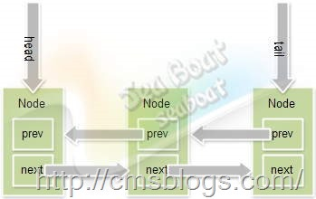

##【Java并发编程实战】----- AQS(四)：CLH同步队列

##
##在【Java并发编程实战】—–“J.U.C”：CLH队列锁提过，AQS里面的CLH队列是CLH同步锁的一种变形。其主要从两方面进行了改造：节点的结构与节点等待机制。在结构上引入了头结点和尾节点，他们分别指向队列的头和尾，尝试获取锁、入队列、释放锁等实现都与头尾节点相关，并且每个节点都引入前驱节点和后后续节点的引用；在等待机制上由原来的自旋改成阻塞唤醒。其结构如下：  

##
##   

##
##知道其结构了，我们再看看他的实现。在线程获取锁时会调用AQS的acquire()方法，该方法第一次尝试获取锁如果失败，会将该线程加入到CLH队列中：     	public final void acquire(int arg) {
        if (!tryAcquire(arg) &amp;&amp;
            acquireQueued(addWaiter(Node.EXCLUSIVE), arg))
            selfInterrupt();
    	}



##
##addWaiter：


  	private Node addWaiter(Node mode) {
        Node node = new Node(Thread.currentThread(), mode);
        Node pred = tail;
        if (pred != null) {
            node.prev = pred;
            if (compareAndSetTail(pred, node)) {
                pred.next = node;
                return node;
            	}
        	}
        enq(node);
        return node;
    	}



##
##这是addWaiter()的实现，在厘清这段代码之前我们要先看一个更重要的东东，Node,CLH队列的节点。其源码如下：


  	static final class Node {
            /** 线程已被取消 */
            static final int CANCELLED =  1;
            
            /** 当前线程的后继线程需要被unpark(唤醒) */
            static final int SIGNAL    = -1;
            
            /** 线程(处在Condition休眠状态)在等待Condition唤醒 */
            static final int CONDITION = -2;
            
            /** 共享锁 */
            static final Node SHARED = new Node();
            /** 独占锁  */
            static final Node EXCLUSIVE = null;

            volatile int waitStatus;

            /** 前继节点 */
            volatile Node prev;

            /** 后继节点 */
            volatile Node next;
            
            volatile Thread thread;

            Node nextWaiter;

            final boolean isShared() {
                return nextWaiter == SHARED;
            	}

           /** 获取前继节点 */
            final Node predecessor() throws NullPointerException {
                Node p = prev;
                if (p == null)
                    throw new NullPointerException();
                else
                    return p;
            	}

            /**
             * 三个构造函数
             */
            Node() { 
            	}

            Node(Thread thread, Node mode) {   
                this.nextWaiter = mode;
                this.thread = thread;
            	}

            Node(Thread thread, int waitStatus) { 
                this.waitStatus = waitStatus;
                this.thread = thread;
            	}
        	}



##
##在这个源代码中有三个值（CANCELLED、SIGNAL、CONDITION）要特别注意，前面提到过CLH队列的节点都有一个状态位，该状态位与线程状态密切相关：


##
##CANCELLED = 1：因为超时或者中断，节点会被设置为取消状态，被取消的节点时不会参与到竞争中的，他会一直保持取消状态不会转变为其他状态；


##
##SIGNAL = -1：其后继节点已经被阻塞了，到时需要进行唤醒操作；


##
##CONDITION = -2：表示这个结点在条件队列中，因为等待某个条件而被阻塞；


##
##0：新建节点一般都为0。

入列


##
##在线程尝试获取锁的时候，如果失败了需要将该线程加入到CLH队列，入列中的主要流程是：tail执行新建node，然后将node的后继节点指向旧tail值。注意在这个过程中有一个CAS操作，采用自旋方式直到成功为止。其代码如下：


  	for(;;){
            Node t = tail;
            node.prev = t;
            if (compareAndSetTail(t, node)) {
                t.next = node;
                return t;
            	}
        	}

其实这段代码在enq()方法中存在。 

出列


##
##当线程是否锁时，需要进行“出列”，出列的主要工作则是唤醒其后继节点（一般来说就是head节点），让所有线程有序地进行下去：


  	Node h = head;
            if (h != null &amp;&amp; h.waitStatus != 0)
                unparkSuccessor(h);
            return true;



##
##

取消


##
##线程因为超时或者中断涉及到取消的操作，如果某个节点被取消了，那个该节点就不会参与到锁竞争当中，它会等待GC回收。取消的主要过程是将取消状态的节点移除掉，移除的过程还是比较简单的。先将其状态设置为CANCELLED,然后将其前驱节点的pred执行其后继节点，当然这个过程仍然会是一个CAS操作：


  	node.waitStatus = Node.CANCELLED;
Node pred = node.prev;
Node predNext = pred.next;
Node next = node.next;



##
##

挂起


##
##我们了解了AQS的CLH队列相比原始的CLH队列锁，它采用了一种变形操作，将自旋机制改为阻塞机制。当前线程将首先检测是否为头结点且尝试获取锁，如果当前节点为头结点并成功获取锁则直接返回，当前线程不进入阻塞，否则将当前线程阻塞：


  	for (;;) {
    if (node.prev == head)
if(尝试获取锁成功){
         head=node;
         node.next=null;
         return;
     	}
   阻塞线程
	}



##
##


##
##参考


##
##1、Java并发框架——AQS阻塞队列管理（二）


##
##2、Java并发框架——AQS阻塞队列管理（三）