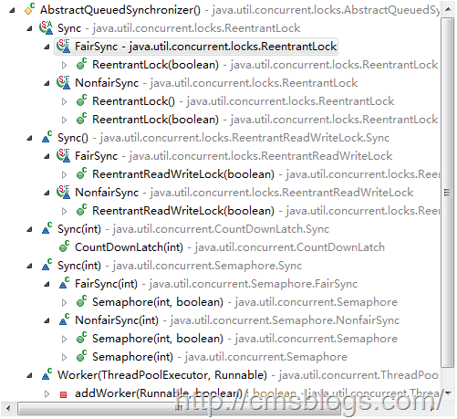
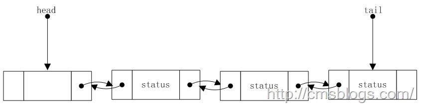

在前面博客中，LZ讲到了ReentrantLock、ReentrantReadWriteLock、Semaphore、CountDownLatch，他们都有各自获取锁的方法，同时相对于Java的内置锁，他们具有明显的优势：花最小的空间开销创建锁、最少的时间开销获得锁、使用更加方便灵活。

参考Java的内置锁，对于JUC同步器而言，他应该具备两个最基本的功能：获取锁，释放锁。其中获取锁应该是先判断当前状态是否可以获取，如果不可以获取则处于阻塞状态，释放应该是释放后修改状态，让其他线程能够得到该锁（唤醒其他线程），如下：

    
    
    lock:
            while(state){                //
                getLock();            //获取锁
                return currentThread;        //返回当前线程
            }
            
            release:
            updateState();                //修改状态    
            notify other thread;            //唤醒其他线程

我们知道，在JUC中，各个同步器获取锁和释放锁的方法都不相同，比如：lock.lock()、Semaphore.acquire()、
CountDownLatch.await()等等，假如他们都各自实现各自的方法，那么这个JUC框架顶多只能算一个中下等的框架设计了。这是AQS腾空出世，AQS作为一个核心的处理框架，他提供了大量的同步操作，同时用户还可以在此类的基础上进行自定义，实现自己的同步器。其主要框架如下：

从上图可以看出AQS是JUC同步器的基石。下面就AQS涉及的技术原理简单阐述下，以后会对其做详细的说明。

### 1、状态位state

AQS用的是一个32位的整型来表示同步状态的，它是用volatile修饰的：

    
    
    private volatile int state;

在互斥锁中它表示着线程是否已经获取了锁，0未获取，1已经获取了，大于1表示重入数。同时AQS提供了getState()、setState()、compareAndSetState()方法来获取和修改该值：

    
    
    protected final int getState() {
                return state;
            }
            
            protected final void setState(int newState) {
                state = newState;
            }
            
            protected final boolean compareAndSetState(int expect, int update) {
                return unsafe.compareAndSwapInt(this, stateOffset, expect, update);
            }

这些方法需要java.util.concurrent.atomic包的支持，采用CAS操作，保证其原则性和可见性。

### 2、CLH同步队列

在前面就提到过AQS内部维护着一个FIFO的CLH队列，所以AQS并不支持基于优先级的同步策略。至于为何要选择CLH队列，主要在于CLH锁相对于MSC锁，他更加容易处理cancel和timeout，同时他具备进出队列快、无所、畅通无阻、检查是否有线程在等待也非常容易（head
!= tail,头尾指针不同）。当然相对于原始的CLH队列锁，ASQ采用的是一种变种的CLH队列锁：

1、原始CLH使用的locked自旋，而AQS的CLH则是在每个node里面使用一个状态字段来控制阻塞，而不是自旋。

2、为了可以处理timeout和cancel操作，每个node维护一个指向前驱的指针。如果一个node的前驱被cancel，这个node可以前向移动使用前驱的状态字段。

3、head结点使用的是傀儡结点。

### 3、共享锁、互斥锁

在AQS维护的CLH队列锁中，每个节点（Node）代表着一个需要获取锁的线程。该Node中有两个常量SHARE、EXCLUSIVE。其中SHARE代表着共享模式，EXCLUSIVE代表着独占模式。

    
    
    static final class Node {
                /** Marker to indicate a node is waiting in shared mode */
                static final Node SHARED = new Node();
                /** Marker to indicate a node is waiting in exclusive mode */
                static final Node EXCLUSIVE = null;
                /////////
    
            }

其中共享模式是允许多个线程可以获取同一个锁，而独占模式则一个锁只能被一个线程持有，其他线程必须要等待。

### 4、阻塞、唤醒

我们知道在使用Java内置锁时，可以使用wait、notify方法来阻塞、唤醒线程，但是AQS并没有采用该模式，而是通过LockSupport.park()
和 LockSupport.unpark() 的本地方法来实现线程的阻塞和唤醒。

