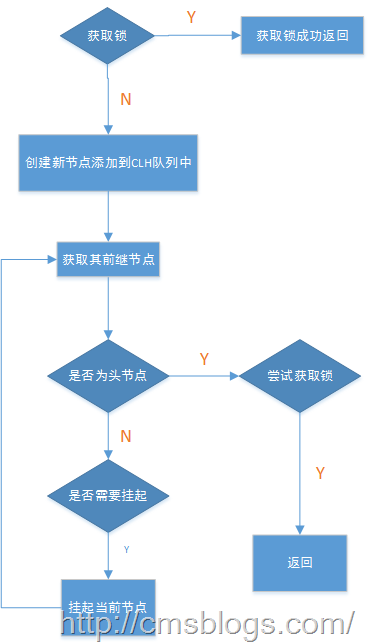
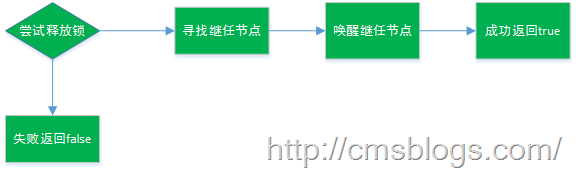

上篇博客稍微介绍了一下AQS，下面我们来关注下AQS的所获取和锁释放。

## AQS锁获取

AQS包含如下几个方法：

acquire(int arg)：以独占模式获取对象，忽略中断。

acquireInterruptibly(int arg)： 以独占模式获取对象，如果被中断则中止。

acquireShared(int arg)： 以共享模式获取对象，忽略中断。

acquireSharedInterruptibly(int arg)以共享模式获取对象，如果被中断则中止。

tryAcquire(int arg)：试图在独占模式下获取对象状态。

tryAcquireNanos(int arg, long
nanosTimeout)：试图以独占模式获取对象，如果被中断则中止，如果到了给定超时时间，则会失败。

tryAcquireShared(int arg)：试图在共享模式下获取对象状态。

tryAcquireSharedNanos(int arg, long
nanosTimeout)：试图以共享模式获取对象，如果被中断则中止，如果到了给定超时时间，则会失败。

对于lock.lock()最终都会调用AQS的acquire()方法，Semaphore.acquire()最终会调用AQS的acquireSharedInterruptibly()方法，其中acquire()源代码如下：

    
    
    public final void acquire(int arg) {
            if (!tryAcquire(arg) &&
                acquireQueued(addWaiter(Node.EXCLUSIVE), arg))
                selfInterrupt();
        }

tryAcquire：去尝试获取锁，获取成功则设置锁状态并返回true，否则返回false。

addWaiter：将当前线程加入到CLH队列队尾。

acquireQueued：当前线程会根据公平性原则来进行阻塞等待,直到获取锁为止；并且返回当前线程在等待过程中有没有中断过。

selfInterrupt：产生一个中断。

其主要流程如下：

1、首先线程尝试获取锁，如果成功则直接返回，不成功则新建一个Node节点并添加到CLH队列中。tryAcquire尝试获取锁，addWaiter则新建节点并添加到CLH队列中。其中tryAcquire，AQS并没有提供实现，它仅仅只是抛出一个异常，具体的实现需要各个锁自己实现。

    
    
    protected boolean tryAcquire(int arg) {
            throw new UnsupportedOperationException();
        }

addWaiter后面讲述。

2、acquireQueued主要功能是根据该节点寻找CLH队列的头结点，并且尝试获取锁，判断是否需要挂起，并且返回挂起标识。如下：

    
    
    final boolean acquireQueued(final Node node, int arg) {
            try {
                boolean interrupted = false;
                for (;;) {
                    final Node p = node.predecessor();
                    if (p == head && tryAcquire(arg)) {
                        setHead(node);
                        p.next = null; // help GC
                        return interrupted;
                    }
                    if (shouldParkAfterFailedAcquire(p, node) &&
                        parkAndCheckInterrupt())
                        interrupted = true;
                }
            } catch (RuntimeException ex) {
                cancelAcquire(node);
                throw ex;
            }
        }

在acquireQueued()内部仍然调用tryAcquire()来获取锁。更多详情请参考：[【Java并发编程实战】—–“J.U.C”：ReentrantLock之二lock方法分析](http://cmsblogs.com/?p=1662)

selfInterrupt：产生一个中断。如果在acquireQueued()中当前线程被中断过，则需要产生一个中断。

    
    
    private static void selfInterrupt() {
        Thread.currentThread().interrupt();
    }

## AQS锁释放

AQS释放锁的方法主要有：

release(int arg)：以独占模式释放对象。

releaseShared(int arg)： 以共享模式释放对象

tryRelease(int arg)：试图设置状态来反映独占模式下的一个释放。

tryReleaseShared(int arg)：试图设置状态来反映共享模式下的一个释放。

释放锁相对于获取锁来说还是比较简单的，其主要流程如下：

其代码如下（release()）:

    
    
    public final boolean release(int arg) {
            if (tryRelease(arg)) {
                Node h = head;
                if (h != null && h.waitStatus != 0)
                    unparkSuccessor(h);
                return true;
            }
            return false;
        }

tryeRelease()：尝试释放锁，AQS也同样没有提供实现，具体实现方法要其子类自己内部实现，AQS仅仅只是抛出一个异常。

    
    
    protected boolean tryRelease(int arg) {
            throw new UnsupportedOperationException();
        }

unparkSuccessor：用于唤醒节点。更多，请参考：[【Java并发编程实战】—–“J.U.C”：ReentrantLock之三unlock方法分析](http://cmsblogs.com/?p=1665)

参考文献：

[1、JAVA并发编程学习笔记之AQS源码分析（获取与释放）](http://blog.csdn.net/aesop_wubo/article/details/7555956)

