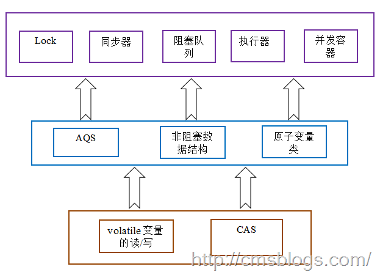
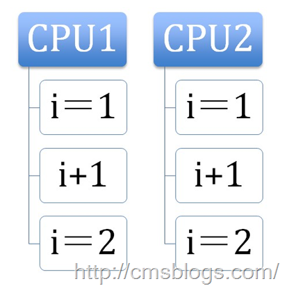

##【Java并发编程实战】-----“J.U.C”：CAS操作

##
##CAS，即Compare and Swap，中文翻译为“比较并交换”。  

##
##对于JUC包中，CAS理论是实现整个java并发包的基石。从整体来看，concurrent包的实现示意图如下：  

##
##   

##
##i++是一个非常经典的操作，它几乎充斥着我们每个人编写的代码中。我们知道i++是可以分解的，它分解为getI()、i + 1 、setI三个步骤，所以它并不是原子操作。如果i==1，执行两次i++操作，我们期望的结果是3，但是结果有可能也是2：  

##
##   

##
##那么有什么办法解决这个问题呢？肯定有！使用锁即可：     	synchronized(this){
            i++;
        	}



##
##诚然，在java中存在乐观锁、悲观锁两种锁。其中synchronized就是悲观锁，在前面我们了解synchronized也是独占锁，加入关键字synchronized的代码一般都是以单线程的形式在运行着，它会导致其他需要该资源的线程挂起直到前面的线程执行完毕释放资源，所以它的效率较为低下。而乐观锁则采用了一种较为高效的方式，它的操作与synchronized不同，synchronized采用加锁，而它则不采用加锁去执行某些操作，如果发生了冲突则失败并一直重试直到成功为止。而CAS就是一种乐观锁，它所采用的策略是当且仅当预期值A和存中的值V相同，则将内存V值修改为B，否则返回V。实现如下：


  	for(;;){
            if(A==V){
                V = B;
            	}
        	}



##
##当然在J.U.C中实现CAS没有这么简单。

##CAS


##
##CAS，即一种对内存中的共享数据进行操作的指令，而且该操作是原子的读写操作。其过程如下：首先CPU将内存中的将要被修改的数据与预期的值进行比较，如果这两个值相等，CPU则会将内存中数值替换为新值，否则不做操作。最后，CPU会将旧值返回。在java中，CAS的含义就是“我认为的原本的值是什么，如果你是，则更换为新值，否则不做修改同时麻烦告诉我该值时多少”。


##
##在CAS中，总共存在三个操作数：预期值A、内存中的V、修改的值B。当且仅当预期值A和内存中的值V相同，则将内存V值修改为B，否则返回V。使用这种机制编写的算法也叫作非阻塞算法，标准定义了一个线程的失败或者挂起是不会影响其他线程的失败或者挂起。


##
##下面我们来已AtomicIneger的源码为例来看看CAS操作：


  	public final int getAndAdd(int delta) {
        for (;;) {
            int current = get();
            int next = current + delta;
            if (compareAndSet(current, next))
                return current;
        	}
    	}



##
##这里很显然使用CAS操作（for(;;)里面），他每次都从内存中读取数据，+1操作，然后两个值进行CAS操作。如果成功则返回，否则失败重试，直到修改成功为止。


##
##上面源码最关键的地方有两个，一个for循环，它代表着一种宁死不屈的精神，不成功誓不罢休。还有就是compareAndSet：


  	public final boolean compareAndSet(int expect, int update) {
    return unsafe.compareAndSwapInt(this, valueOffset, expect, update);
    	}


##CAS的缺陷


##
##尽管CAS机制可以使我们不依赖与同步，不影响和挂起其他线程，它大大提升了运行的效率，但是它会导致一个ABA的问题，如下：加入有两个线程A、B，他们都读取内存中的数据V，假如这个时候线程A，先将V修改为V1，然后又修改为V，这个时候线程B的compareAndSet仍然能成功，对于线程B而言该值V并没有发生任何变化，而实际上它已经变化了，只不过最后又还原了而已。


##
##


##
##参考文献


##
##1、Java的多线程编程模型5--Java中的CAS理论


##
##2、JAVA CAS原理深度分析