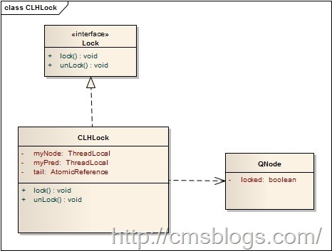
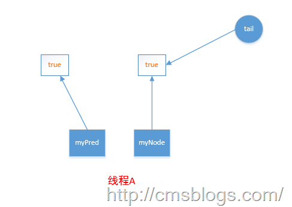
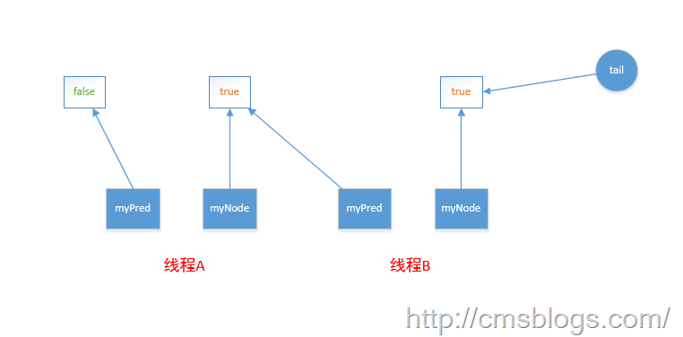

##【Java并发编程实战】-----“J.U.C”：CLH队列锁

##
##在前面介绍的几篇博客中总是提到CLH队列，在AQS中CLH队列是维护一组线程的严格按照FIFO的队列。他能够确保无饥饿，严格的先来先服务的公平性。下图是CLH队列节点的示意图：

##
## 

##
##在CLH队列的节点QNode中包含有一个locked的字段，该字段表示该节点是否需要获取锁，为true表示需要获取，为false表示不需要获取。在CLH队列中，节点与节点之间并不是通过next指针来连接的而是通过myPred所指向节点的变化情况来影响的myNode的行为。

##
##假设有两个线程（线程A、线程B）。开始线程A需要获得锁，那么他会创建一个QNode节点，并将locked设置为true（表示需要获取锁），同时获取一个指向前驱的myPred并在前驱节点的的locked上面旋转直到前驱节点是否锁为止（locked为false，这个动作我们一般称之为自旋），当然这里会将tail指向自身来表示它是CLH队列的最后一个节点，如下：

##
## 

##
##然后线程B添加到CLH队列中，这时tail域应该指向线程B。

##
## 

##
##CLH队列锁的优点在于空间复杂度低（如果有n个线程，L个锁，每个线程每次只获取一个锁，那么需要的存储空间是O（L+n），n个线程有n个myNode，L个锁有L个tail）。CLH的变种体被运用到了AQS中。

##
##参考文献

##
##JAVA并发编程学习笔记之CLH队列锁：http://blog.csdn.net/aesop_wubo/article/details/7533186