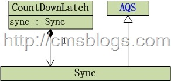

上篇博文（【Java并发编程实战】-----“J.U.C”：CyclicBarrier）LZ介绍了CyclicBarrier。CyclicBarrier所描述的是“允许一组线程互相等待，直到到达某个公共屏障点，才会进行后续任务”。而CountDownlatch和它也有一点点相似之处：CountDownlatch所描述的是“在完成一组正在其他线程中执行的操作之前，它允许一个或多个线程一直等待”。在JDK
API中是这样阐述的：

用给定的计数 初始化 CountDownLatch。由于调用了 countDown() 方法，所以在当前计数到达零之前，await
方法会一直受阻塞。之后，会释放所有等待的线程，await 的所有后续调用都将立即返回。这种现象只出现一次——计数无法被重置。如果需要重置计数，请考虑使用
CyclicBarrier。

CountDownLatch 是一个通用同步工具，它有很多用途。将计数 1 初始化的 CountDownLatch
用作一个简单的开/关锁存器，或入口：在通过调用 countDown() 的线程打开入口前，所有调用 await 的线程都一直在入口处等待。用 N 初始化的
CountDownLatch 可以使一个线程在 N 个线程完成某项操作之前一直等待，或者使其在某项操作完成 N 次之前一直等待。

CountDownLatch 的一个有用特性是，它不要求调用 countDown
方法的线程等到计数到达零时才继续，而在所有线程都能通过之前，它只是阻止任何线程继续通过一个 await。

虽然，CountDownlatch与CyclicBarrier有那么点相似，但是他们还是存在一些区别的：

1、CountDownLatch的作用是允许1或N个线程等待其他线程完成执行；而CyclicBarrier则是允许N个线程相互等待。

2、 CountDownLatch的计数器无法被重置；CyclicBarrier的计数器可以被重置后使用，因此它被称为是循环的barrier。

## CountDownLatch分析

CountDownLatch结构如下：

从上图中可以看出CountDownLatch依赖Sync，其实CountDownLatch内部采用的是共享锁来实现的（内部Sync的实现可以看出）。它的构造函数如下：

CountDownLatch(int count)：构造一个用给定计数初始化的 CountDownLatch。

    
    
    public CountDownLatch(int count) {
            if (count < 0) throw new IllegalArgumentException("count < 0");
            this.sync = new Sync(count);
        }

以下源代码可以证明，CountDownLatch内部是采用共享锁来实现的：

    
    
    private static final class Sync extends AbstractQueuedSynchronizer {
            private static final long serialVersionUID = 4982264981922014374L;
    
            protected int tryAcquireShared(int acquires) {
                /** 省略源代码 **/
            }
    
            protected boolean tryReleaseShared(int releases) {
               /** 省略源代码 **/
            }
        }

CountDownLatch提供了await方法来实现：

await()：使当前线程在锁存器倒计数至零之前一直等待，除非线程被中断。

await(long timeout, TimeUnit unit)： 使当前线程在锁存器倒计数至零之前一直等待，除非线程被中断或超出了指定的等待时间。

    
    
    public void await() throws InterruptedException {
            sync.acquireSharedInterruptibly(1);
        }

await内部调用sync的acquireSharedInterruptibly方法：

    
    
    public final void acquireSharedInterruptibly(int arg)
                throws InterruptedException {
            //线程中断，抛出InterruptedException异常
            if (Thread.interrupted())
                throw new InterruptedException();
            if (tryAcquireShared(arg) < 0)
                doAcquireSharedInterruptibly(arg);
        }

acquireSharedInterruptibly()的作用是获取共享锁。如果在获取共享锁过程中线程中断则抛出InterruptedException异常。否则通过tryAcquireShared方法来尝试获取共享锁。如果成功直接返回，否则调用doAcquireSharedInterruptibly方法。

tryAcquireShared源码：

    
    
    protected int tryAcquireShared(int acquires) {
                return (getState() == 0) ? 1 : -1;
            }

tryAcquireShared方法被CountDownLatch重写，他的主要作用是尝试着获取锁。getState == 0
表示锁处于可获取状态返回1否则返回-1；当tryAcquireShared返回-1获取锁失败，调用doAcquireSharedInterruptibly获取锁：

    
    
    private void doAcquireSharedInterruptibly(int arg)
                throws InterruptedException {
                //创建当前线程（共享锁）Node节点
                final Node node = addWaiter(Node.SHARED);
                boolean failed = true;
                try {
                    for (;;) {
                        //获取当前节点的前继节点
                        final Node p = node.predecessor();
                        //如果当前节点为CLH列头，则尝试获取锁
                        if (p == head) {
                            //获取锁
                            int r = tryAcquireShared(arg);
                            if (r >= 0) {
                                setHeadAndPropagate(node, r);
                                p.next = null; // help GC
                                failed = false;
                                return;
                            }
                        }
                        //如果当前节点不是CLH列头，当前线程一直等待，直到获取锁为止
                        if (shouldParkAfterFailedAcquire(p, node) &&
                            parkAndCheckInterrupt())
                            throw new InterruptedException();
                    }
                } finally {
                    if (failed)
                        cancelAcquire(node);
                }
            }

该方法当中的方法，前面博客都讲述过，请参考：[【Java并发编程实战】-----“J.U.C”：ReentrantLock之二lock方法分析](http://cmsblogs.com/?p=1662)、【Java并发编程实战】-----“J.U.C”：Semaphore。

CountDownLatch，除了提供await方法外，还提供了countDown()，countDown所描述的是“递减锁存器的计数，如果计数到达零，则释放所有等待的线程。”，源码如下：

    
    
    public void countDown() {
            sync.releaseShared(1);
        }

countDown内部调用releaseShared方法来释放线程：

    
    
    public final boolean releaseShared(int arg) {
            //尝试释放线程，如果释放释放则调用doReleaseShared()
            if (tryReleaseShared(arg)) {
                doReleaseShared();
                return true;
            }
            return false;
        }

tryReleaseShared，同时被CountDownLatch重写了：

    
    
    protected boolean tryReleaseShared(int releases) {
            for (;;) {
                //获取锁状态
                int c = getState();
                //c == 0 直接返回，释放锁成功
                if (c == 0)
                    return false;
                //计算新“锁计数器”
                int nextc = c-1;
                //更新锁状态（计数器）
                if (compareAndSetState(c, nextc))
                    return nextc == 0;
            }
        }

**总结：**

CountDownLatch内部通过“共享锁”实现。在创建CountDownLatch时，需要传递一个int类型的count参数，该count参数为“锁状态”的初始值，该值表示着该“共享锁”可以同时被多少线程获取。当某个线程调用await方法时，首先判断锁的状态是否处于可获取状态（其条件就是count==0?），如果共享锁可获取则获取共享锁，否则一直处于等待直到获取为止。当线程调用countDown方法时，计数器count
–
1。当在创建CountDownLatch时初始化的count参数，必须要有count线程调用countDown方法才会使计数器count等于0，锁才会释放，前面等待的线程才会继续运行。

## 实例

员工开会只有当所有人到期之后才会开户。我们初始化与会人员为3个，那么CountDownLatch的count应为3：

    
    
    public class Conference implements Runnable{
        private final CountDownLatch countDown;
        
        public Conference(int count){
            countDown = new CountDownLatch(count);
        }
        
        /**
         * 与会人员到达，调用arrive方法，到达一个CountDownLatch调用countDown方法，锁计数器-1
         * @author:chenssy
         * @data:2015年9月6日
         *
         * @param name
         */
        public void arrive(String name){
            System.out.println(name + "到达.....");
            //调用countDown()锁计数器 - 1
            countDown.countDown();
            System.out.println("还有 " + countDown.getCount() + "没有到达...");
        }
        
        @Override
        public void run() {
            System.out.println("准备开会，参加会议人员总数为：" + countDown.getCount());
            //调用await()等待所有的与会人员到达
            try {
                countDown.await();
            } catch (InterruptedException e) {
            }
            System.out.println("所有人员已经到达，会议开始.....");
        }
    }

参加与会人员Participater：

    
    
    public class Participater implements Runnable{
        private String name;
        private Conference conference;
        
        public Participater(String name,Conference conference){
            this.name = name;
            this.conference = conference;
        }
    
        @Override
        public void run() {
            conference.arrive(name);
        }
    }

Test：

    
    
    public class Test {
        public static void main(String[] args) {
            //启动会议室线程，等待与会人员参加会议
            Conference conference = new Conference(3);
            new Thread(conference).start();
            
            for(int i = 0 ; i < 3 ; i++){
                Participater participater = new Participater("chenssy-0" + i , conference);
                Thread thread = new Thread(participater);
                thread.start();
            }
        }
    }

运行结果：

    
    
    准备开会，参加会议人员总数为：3
    chenssy-01到达.....
    还有 2没有到达...
    chenssy-00到达.....
    还有 1没有到达...
    chenssy-02到达.....
    还有 0没有到达...
    所有人员已经到达，会议开始.....

