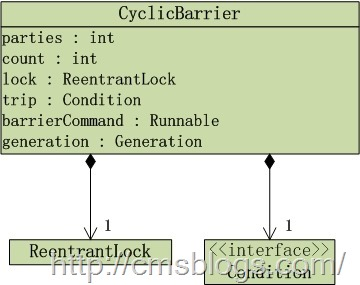

在上篇博客（[【Java并发编程实战】-----“J.U.C”：Semaphore](http://cmsblogs.com/?p=1675)）中，LZ介绍了Semaphore，下面LZ介绍CyclicBarrier。在JDK
API中是这么介绍的：

一个同步辅助类，它允许一组线程互相等待，直到到达某个公共屏障点 (common barrier
point)。在涉及一组固定大小的线程的程序中，这些线程必须不时地互相等待，此时 CyclicBarrier 很有用。因为该 barrier
在释放等待线程后可以重用，所以称它为循环 的 barrier。

CyclicBarrier 支持一个可选的 Runnable
命令，在一组线程中的最后一个线程到达之后（但在释放所有线程之前），该命令只在每个屏障点运行一次。若在继续所有参与线程之前更新共享状态，此屏障操作 很有用。

对于失败的同步尝试，CyclicBarrier 使用了一种要么全部要么全不 (all-or-none)
的破坏模式：如果因为中断、失败或者超时等原因，导致线程过早地离开了屏障点，那么在该屏障点等待的其他所有线程也将通过
BrokenBarrierException（如果它们几乎同时被中断，则用 InterruptedException）以反常的方式离开。

## CyclicBarrier分析

CyclicBarrier结构如下：

从上图可以看到CyclicBarrier内部使用ReentrantLock独占锁实现的。其构造函数如下：

CyclicBarrier(int parties)：创建一个新的
CyclicBarrier，它将在给定数量的参与者（线程）处于等待状态时启动，但它不会在启动 barrier 时执行预定义的操作。

CyclicBarrier(int parties, Runnable barrierAction)：创建一个新的
CyclicBarrier，它将在给定数量的参与者（线程）处于等待状态时启动，并在启动 barrier 时执行给定的屏障操作，该操作由最后一个进入
barrier 的线程执行。

    
    
    public CyclicBarrier(int parties) {
            this(parties, null);
        }
        
        public CyclicBarrier(int parties, Runnable barrierAction) {
            if (parties <= 0) throw new IllegalArgumentException();
            this.parties = parties;
            this.count = parties;
            this.barrierCommand = barrierAction;
        }

在CyclicBarrier中，最重要的方法就是await()，在所有参与者都已经在此 barrier 上调用 await
方法之前，将一直等待。其源代码如下：

    
    
    public int await() throws InterruptedException, BrokenBarrierException {
            try {
                return dowait(false, 0L);
            } catch (TimeoutException toe) {
                throw new Error(toe); // cannot happen;
            }
        }

await内部调用dowait():

    
    
    private int dowait(boolean timed, long nanos)
                throws InterruptedException, BrokenBarrierException,
                       TimeoutException {
                //独占锁
                final ReentrantLock lock = this.lock;
                //获取独占锁
                lock.lock();
                try {
                    //保存当前"Generation"
                    final Generation g = generation;
                    //当前generation“已损坏”，抛出BrokenBarrierException异常
                    //抛出该异常一般都是某个线程在等待某个处于“断开”状态的CyclicBarrier
                    if (g.broken)
                        throw new BrokenBarrierException();
    
                    //当前线程中断，通过breakBarrier终止终止CyclicBarrier
                    if (Thread.interrupted()) {
                        breakBarrier();
                        throw new InterruptedException();
                    }
                   
                   //计数器-1
                   int index = --count;
                   //如果计数器 == 0
                   //表示所有线程都已经到位，触发动作（是否执行某项任务）
                   if (index == 0) {  // tripped
                       boolean ranAction = false;
                       try {
                           //barrierCommand线程要执行的任务
                           final Runnable command = barrierCommand;
                           //执行的任务!=null，执行任务
                           if (command != null)
                               command.run();
                           ranAction = true;
                           //唤醒所有等待线程，并更新generation。
                           nextGeneration();
                           return 0;
                       } finally {
                           if (!ranAction)
                               breakBarrier();
                       }
                   }
    
                   //循环一直执行，直到下面三个if一个条件满足才会退出循环
                   for (;;) {
                        try {
                            //如果不是超时等待，则调用await等待
                            if (!timed)
                                trip.await();
                            //调用awaitNanos等待
                            else if (nanos > 0L)
                                nanos = trip.awaitNanos(nanos);
                        } catch (InterruptedException ie) {
                            //
                            if (g == generation && ! g.broken) {
                                breakBarrier();
                                throw ie;
                            } else {
                                Thread.currentThread().interrupt();
                            }
                        }
    
                        //当前generation“已损坏”，抛出BrokenBarrierException异常
                        //抛出该异常一般都是某个线程在等待某个处于“断开”状态的CyclicBarrier
                        if (g.broken)
                            throw new BrokenBarrierException();
    
                        //generation已经更新，返回index
                        if (g != generation)
                            return index;
    
                        //“超时等待”，并且时间已到，则通过breakBarrier()终止CyclicBarrier
                        if (timed && nanos <= 0L) {
                            breakBarrier();
                            throw new TimeoutException();
                        }
                    }
                } finally {
                    //释放独占锁
                    lock.unlock();
                }
            }

在dowait方法中其实处理逻辑还是比较简单的：

1、首先判断该barrier是否已经断开了，如果断开则抛出BrokenBarrierException异常；

2、判断计算器index是否等于0，如果等于0，则表示所有的线程准备就绪，已经到达某个公共屏障点了，barrier可以进行后续工作了（是否执行某项任务（构造函数决定））；然后调用nextGeneration方法进行更新换代工作（其中会唤醒所有等待的线程）；

3、通过for循环（for(;;)）使线程一直处于等待状态。直到“有parties个线程到达barrier” 或 “当前线程被中断” 或
“超时”这3者之一发生。

在dowait中有Generation这样一个对象。该对象是CyclicBarrier的一个成员变量：

    
    
    private static class Generation {
            boolean broken = false;
        }

Generation描述着CyclicBarrier的更显换代。在CyclicBarrier中，同一批线程属于同一代。当有parties个线程到达barrier，generation就会被更新换代。其中broken标识该当前CyclicBarrier是否已经处于中断状态。

对于中断，CyclicBarrier是通过breakBarrier()实现的：

    
    
    private void breakBarrier() {
            generation.broken = true;
            count = parties;
            trip.signalAll();
        }

在breakBarrier()中除了将broken设置为true，还会调用signalAll将在CyclicBarrier处于等待状态的线程全部唤醒。

在超时的判断中，CyclicBarrier根据timed的值来执行不同的wait。await、awaitNanos都是Condition中的方法。

当index =
--count等于0时，标识“有parties个线程到达barrier”，临界条件到达，则执行相应的动作。执行完动作后，则调用nextGeneration进行更新换代：

    
    
    private void nextGeneration() {
            //唤醒所有处于等待状态的线程
            trip.signalAll();
            //初始化计数器
            count = parties;
            //产生新的Generation对象
            generation = new Generation();
        }

## 示例

1、线程等待到一定条件后才会继续进行。

    
    
    public class CyclicBarrierTest_1 {
        private static CyclicBarrier barrier;
        
        static class threadTest1 extends Thread{
            public void run() {
                System.out.println(Thread.currentThread().getName() + "达到...");
                try {
                    barrier.await();
                } catch (Exception e) {
                    e.printStackTrace();
                }
                System.out.println(Thread.currentThread().getName() + "执行完成...");
            }
        }
        
        public static void main(String[] args) {
            barrier = new CyclicBarrier(5);
            for(int i = 1 ; i <= 5 ; i++){
                new threadTest1().start();
            }
        }
    }

\------执行结果：

    
    
    Thread-0达到...
    Thread-1达到...
    Thread-3达到...
    Thread-2达到...
    Thread-4达到...
    Thread-4执行完成...
    Thread-0执行完成...
    Thread-1执行完成...
    Thread-2执行完成...
    Thread-3执行完成...

2、线程等待到一定条件后，执行某项任务。比如说我们等车，只有当车坐满后，汽车才会发动。

这个只需要对上面的代码进行小动作的改动即可：

    
    
    public class CyclicBarrierTest_2 {
        private static CyclicBarrier barrier;
        
        static class threadTest1 extends Thread{
            public void run() {
                System.out.println(Thread.currentThread().getName() + "达到...");
                try {
                    barrier.await();
                } catch (Exception e) {
                    e.printStackTrace();
                }
                System.out.println(Thread.currentThread().getName() + "执行完成...");
            }
        }
        
        public static void main(String[] args) {
            barrier = new CyclicBarrier(5,new Runnable() {
                
                @Override
                public void run() {
                    System.out.println("执行CyclicBarrier中的任务.....");
                }
            });
            for(int i = 1 ; i <= 5 ; i++){
                new threadTest1().start();
            }
        }
    }

\-------执行结果：

    
    
    Thread-0达到...
    Thread-1达到...
    Thread-3达到...
    Thread-4达到...
    Thread-2达到...
    执行CyclicBarrier中的任务.....
    Thread-2执行完成...
    Thread-0执行完成...
    Thread-3执行完成...
    Thread-1执行完成...
    Thread-4执行完成...

参考文献：

1、[Java多线程系列--“JUC锁”10之
CyclicBarrier原理和示例](http://www.cnblogs.com/skywang12345/p/3533995.html)

