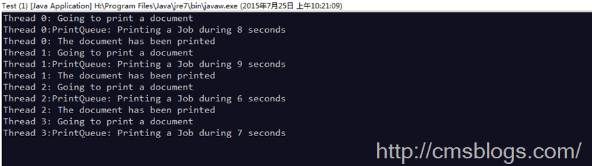

**注：**
由于要介绍ReentrantLock的东西太多了，免得各位客官看累，所以分三篇博客来阐述。本篇博客介绍ReentrantLock基本内容，后两篇博客从源码级别分别阐述ReentrantLock的lock、unlock实现机制。

ReentrantLock，可重入的互斥锁，是一种递归无阻塞的同步机制。它可以等同于synchronized的使用，但是ReentrantLock提供了比synchronized更强大、灵活的锁机制，可以减少死锁发生的概率。

对于ReentrantLock,官方有详细的说明：一个可重入的互斥锁定 Lock，它具有与使用 synchronized
方法和语句所访问的隐式监视器锁定相同的一些基本行为和语义，但功能更强大。ReentrantLock
将由最近成功获得锁定，并且还没有释放该锁定的线程所拥有。当锁定没有被另一个线程所拥有时，调用 lock
的线程将成功获取该锁定并返回。如果当前线程已经拥有该锁定，此方法将立即返回。可以使用 isHeldByCurrentThread() 和
getHoldCount() 方法来检查此情况是否发生。

ReentrantLock提供公平锁机制，构造方法接收一个可选的公平参数。当设置为true时，它是公平锁，这些所将访问权授予等待时间最长的线程。否则该锁将无法保证线程获取锁的访问顺序。但是公平锁与非公平锁相比，公平锁的程序在许多线程访问时表现为很低的总体吞吐量。

    
    
    /**
         * 默认构造方法，非公平锁
         */
        public ReentrantLock() {
            sync = new NonfairSync();
        }
    
        /**
         * true公平锁，false非公平锁
         * @param fair
         */
        public ReentrantLock(boolean fair) {
            sync = fair ? new FairSync() : new NonfairSync();
        }

以下是一个简单的使用实例（【java7并发编程实战手册】）：

    
    
    public class PrintQueue {
        private final Lock queueLock = new ReentrantLock();
        
        public void printJob(Object document){
            try {
                queueLock.lock();
                System.out.println(Thread.currentThread().getName() + ": Going to print a document");
                Long duration = (long) (Math.random() * 10000);
                System.out.println(Thread.currentThread().getName() + ":PrintQueue: Printing a Job during " + (duration / 1000) + " seconds");
                Thread.sleep(duration);
                System.out.printf(Thread.currentThread().getName() + ": The document has been printed\n");
            } catch (InterruptedException e) {
                e.printStackTrace();
            }finally{
                queueLock.unlock();
            }
        }
    }
    public class Job implements Runnable{
        
        private PrintQueue printQueue;
        
        public Job(PrintQueue printQueue){
            this.printQueue = printQueue;
        }
        
        @Override
        public void run() {
            printQueue.printJob(new Object());
        }
    }
    public class Test {
        public static void main(String[] args) {
            PrintQueue printQueue = new PrintQueue();
            
            Thread thread[]=new Thread[10];
            for (int i = 0; i < 10; i++) {
                thread[i] = new Thread(new Job(printQueue), "Thread " + i);
            }
            
            for(int i = 0 ; i < 10 ; i++){
                thread[i].start();
            }
        }
    }

运行结果（部分）：

## ReentrantLock与synchronized的区别

前面提到ReentrantLock提供了比synchronized更加灵活和强大的锁机制，那么它的灵活和强大之处在哪里呢？他们之间又有什么相异之处呢？

首先他们肯定具有相同的功能和内存语义。

1、与synchronized相比，ReentrantLock提供了更多，更加全面的功能，具备更强的扩展性。例如：时间锁等候，可中断锁等候，锁投票。

2、ReentrantLock还提供了条件Condition，对线程的等待、唤醒操作更加详细和灵活，所以在多个条件变量和高度竞争锁的地方，ReentrantLock更加适合（以后会阐述Condition）。

3、ReentrantLock提供了可轮询的锁请求。它会尝试着去获取锁，如果成功则继续，否则可以等到下次运行时处理，而synchronized则一旦进入锁请求要么成功要么阻塞，所以相比synchronized而言，ReentrantLock会不容易产生死锁些。

4、ReentrantLock支持更加灵活的同步代码块，但是使用synchronized时，只能在同一个synchronized块结构中获取和释放。注：ReentrantLock的锁释放一定要在finally中处理，否则可能会产生严重的后果。

5、ReentrantLock支持中断处理，且性能较synchronized会好些。

敬请关注下篇：【Java并发编程实战】-----“J.U.C”：ReentrantLock之二lock()分析

**参考文献：**

1、[可重入的互斥锁—ReentrantLock](http://hujin.iteye.com/blog/479689)

2、[再谈重入锁—ReentrantLock](http://tenyears.iteye.com/blog/48750)

3、[ReentrantLock与synchronized](http://uule.iteye.com/blog/1488356)

