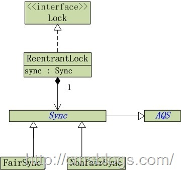
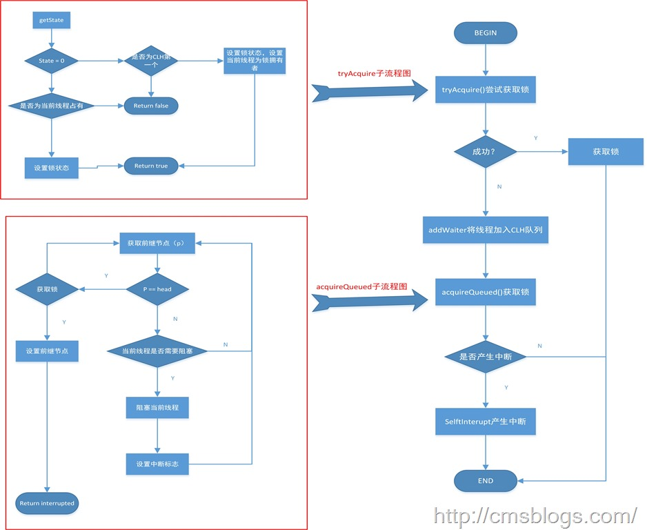

##【Java并发编程实战】-----“J.U.C”：ReentrantLock之二lock方法分析

##
##前一篇博客简单介绍了ReentrantLock的定义和与synchronized的区别，下面跟随LZ的笔记来扒扒ReentrantLock的lock方法。我们知道ReentrantLock有公平锁、非公平锁之分，所以lock()我也已公平锁、非公平锁来进行阐述。首先我们来看ReentrantLock的结构【图来自Java多线程系列--“JUC锁”03之 公平锁(一)】：  

##
##   

##
##从上图我们可以看到，ReentrantLock实现Lock接口，Sync与ReentrantLock是组合关系，且FairSync（公平锁）、NonfairySync（非公平锁）是Sync的子类。Sync继承AQS（AbstractQueuedSynchronizer）。在具体分析lock时，我们需要了解几个概念：  

##
##AQS（AbstractQueuedSynchronizer）：为java中管理锁的抽象类。该类为实现依赖于先进先出 (FIFO) 等待队列的阻塞锁和相关同步器（信号量、事件，等等）提供一个框架。该类提供了一个非常重要的机制，在JDK API中是这样描述的：为实现依赖于先进先出 (FIFO) 等待队列的阻塞锁和相关同步器（信号量、事件，等等）提供一个框架。此类的设计目标是成为依靠单个原子 int 值来表示状态的大多数同步器的一个有用基础。子类必须定义更改此状态的受保护方法，并定义哪种状态对于此对象意味着被获取或被释放。假定这些条件之后，此类中的其他方法就可以实现所有排队和阻塞机制。子类可以维护其他状态字段，但只是为了获得同步而只追踪使用 getState()、setState(int) 和 compareAndSetState(int, int) 方法来操作以原子方式更新的 int 值。 这么长的话用一句话概括就是：维护锁的当前状态和线程等待列表。  

##
##CLH：AQS中“等待锁”的线程队列。我们知道在多线程环境中我们为了保护资源的安全性常使用锁将其保护起来，同一时刻只能有一个线程能够访问，其余线程则需要等待，CLH就是管理这些等待锁的队列。  

##
##CAS（compare and swap）：比较并交换函数，它是原子操作函数，也就是说所有通过CAS操作的数据都是以原子方式进行的。  
##公平锁（FairSync）:lock  

##
##lock()定义如下：     	final void lock() {
            acquire(1);
        	}



##
##lock()内部调用acquire(1),为何是”1”呢？首先我们知道ReentrantLock是独占锁，1表示的是锁的状态state。对于独占锁而言，如果所处于可获取状态，其状态为0，当锁初次被线程获取时状态变成1。


##
##acquire()是AbstractQueuedSynchronizer中的方法，其源码如下：


  	public final void acquire(int arg) {
        if (!tryAcquire(arg) &amp;&amp;
            acquireQueued(addWaiter(Node.EXCLUSIVE), arg))
            selfInterrupt();
    	}



##
##从该方法的实现中我们可以看出，它做了非常多的工作，具体工作我们先晾着，先看这些方法的实现：

tryAcquire


##
##tryAcquire方法是在FairySync中实现的，其源代码如下：


  	protected final boolean tryAcquire(int acquires) {
        //当前线程
        final Thread current = Thread.currentThread();
        //获取锁状态state
        int c = getState();
        /*
         * 当c==0表示锁没有被任何线程占用，在该代码块中主要做如下几个动作：
         * 则判断“当前线程”是不是CLH队列中的第一个线程线程（hasQueuedPredecessors），
         * 若是的话，则获取该锁，设置锁的状态（compareAndSetState），
         * 并切设置锁的拥有者为“当前线程”（setExclusiveOwnerThread）。
         */
        if (c == 0) {
            if (!hasQueuedPredecessors() &amp;&amp;
                compareAndSetState(0, acquires)) {
                setExclusiveOwnerThread(current);
                return true;
            	}
        	}
        /*
         * 如果c != 0，表示该锁已经被线程占有，则判断该锁是否是当前线程占有，若是设置state，否则直接返回false
         */
        else if (current == getExclusiveOwnerThread()) {
            int nextc = c + acquires;
            if (nextc < 0)
                throw new Error("Maximum lock count exceeded");
            setState(nextc);
            return true;
        	}
        return false;
    	}



##
##在这里我们可以肯定tryAcquire主要是去尝试获取锁，获取成功则设置锁状态并返回true，否则返回false。


##
##hasQueuedPredecessors："当前线程"是不是在CLH队列的队首，来返回AQS中是不是有比“当前线程”等待更久的线程（公平锁）。


  	public final boolean hasQueuedPredecessors() {
        Node t = tail; 
        Node h = head;    
        Node s;
        return h != t &amp;&amp;
            ((s = h.next) == null || s.thread != Thread.currentThread());
    	}



##
##Node是AbstractQueuedSynchronizer的内部类，它代表着CLH列表的一个线程节点。对于Node以后LZ会详细阐述的。


##
##compareAndSetState：设置锁状态


  	protected final boolean compareAndSetState(int expect, int update) {
            return unsafe.compareAndSwapInt(this, stateOffset, expect, update);
        	}



##
##compareAndSwapInt() 是sun.misc.Unsafe类中的一个本地方法。对此，我们需要了解的是 compareAndSetState(expect, update) 是以原子的方式操作当前线程；若当前线程的状态为expect，则设置它的状态为update。


##
##setExclusiveOwnerThread：设置当前线程为锁的拥有者


  	protected final void setExclusiveOwnerThread(Thread t) {
        exclusiveOwnerThread = t;
    	}


addWaiter(Node.EXCLUSIVE)


  	private Node addWaiter(Node mode) {
        //new 一个Node节点
        Node node = new Node(Thread.currentThread(), mode);
        
        //CLH队列尾节点
        Node pred = tail;
        
        //CLH尾节点！= null，表示CLH队列 != null,则将线程加入到CLH队列队尾
        if (pred != null) {
            node.prev = pred;
            if (compareAndSetTail(pred, node)) {
                pred.next = node;
                return node;
            	}
        	}
        //若CLH队列为空，则调用enq()新建CLH队列，然后再将“当前线程”添加到CLH队列中。
        enq(node);
        return node;
    	}



##
##addWaiter()主要是将当前线程加入到CLH队列队尾。其中compareAndSetTail和enq的源代码如下：


  	/**
     * 判断CLH队列的队尾是不是为expect，是的话，就将队尾设为update
     * @param expect
     * @param update
     * @return
     */
    private final boolean compareAndSetTail(Node expect, Node update) {
        return unsafe.compareAndSwapObject(this, tailOffset, expect, update);
    	}
    
    /**
     * 如果CLH队列为空，则新建一个CLH表头；然后将node添加到CLH末尾。否则，直接将node添加到CLH末尾
     * @param node
     * @return
     */
    private Node enq(final Node node) {
        for (;;) {
            Node t = tail;
            if (t == null) {     
                if (compareAndSetHead(new Node()))
                    tail = head;
            	} else {
                node.prev = t;
                if (compareAndSetTail(t, node)) {
                    t.next = node;
                    return t;
                	}
            	}
        	}
    	}



##
##addWaiter的实现比较简单且实现功能明了：当前线程加入到CLH队列队尾。

acquireQueued


  	final boolean acquireQueued(final Node node, int arg) {
        boolean failed = true;
        try {
            //线程中断标志位
            boolean interrupted = false;
            for (;;) {
                //上一个节点，因为node相当于当前线程，所以上一个节点表示“上一个等待锁的线程”
                final Node p = node.predecessor();
                /*
                 * 如果当前线程是head的直接后继则尝试获取锁
                 * 这里不会和等待队列中其它线程发生竞争，但会和尝试获取锁且尚未进入等待队列的线程发生竞争。这是非公平锁和公平锁的一个重要区别。
                 */
                if (p == head &amp;&amp; tryAcquire(arg)) {
                    setHead(node);     //将当前节点设置设置为头结点
                    p.next = null; 
                    failed = false;
                    return interrupted;
                	}
                /* 如果不是head直接后继或获取锁失败，则检查是否要阻塞当前线程,是则阻塞当前线程
                 * shouldParkAfterFailedAcquire:判断“当前线程”是否需要阻塞
                 * parkAndCheckInterrupt:阻塞当前线程
                 */
                if (shouldParkAfterFailedAcquire(p, node) &amp;&amp;
                    parkAndCheckInterrupt())
                    interrupted = true;
            	}
        	} finally {
            if (failed)
                cancelAcquire(node);     
        	}
    	}



##
##在这个for循环中，LZ不是很明白为什么要加p==head,Java多线程系列--“JUC锁”03之 公平锁(一)这篇博客有一个较好的解释如下：


##
##p == head &amp;&amp; tryAcquire(arg) 
  首先，判断“前继节点”是不是CHL表头。如果是的话，则通过tryAcquire()尝试获取锁。 

  其实，这样做的目的是为了“让当前线程获取锁”，但是为什么需要先判断p==head呢？理解这个对理解“公平锁”的机制很重要，因为这么做的原因就是为了保证公平性！ 

   (a) 前面，我们在shouldParkAfterFailedAcquire()我们判断“当前线程”是否需要阻塞； 

   (b) 接着，“当前线程”阻塞的话，会调用parkAndCheckInterrupt()来阻塞线程。当线程被解除阻塞的时候，我们会返回线程的中断状态。而线程被解决阻塞，可能是由于“线程被中断”，也可能是由于“其它线程调用了该线程的unpark()函数”。 

   (c) 再回到p==head这里。如果当前线程是因为其它线程调用了unpark()函数而被唤醒，那么唤醒它的线程，应该是它的前继节点所对应的线程(关于这一点，后面在“释放锁”的过程中会看到)。 OK，是前继节点调用unpark()唤醒了当前线程！ 

  此时，再来理解p==head就很简单了：当前继节点是CLH队列的头节点，并且它释放锁之后；就轮到当前节点获取锁了。然后，当前节点通过tryAcquire()获取锁；获取成功的话，通过setHead(node)设置当前节点为头节点，并返回。 

   总之，如果“前继节点调用unpark()唤醒了当前线程”并且“前继节点是CLH表头”，此时就是满足p==head，也就是符合公平性原则的。否则，如果当前线程是因为“线程被中断”而唤醒，那么显然就不是公平了。这就是为什么说p==head就是保证公平性！


##
##在该方法中有两个方法比较重要，shouldParkAfterFailedAcquire和parkAndCheckInterrupt，其中


##
##shouldParkAfterFailedAcquire：判断“当前线程”是否需要阻塞，源码如下：


  	private static boolean shouldParkAfterFailedAcquire(Node pred, Node node) {
           //当前节点的状态
            int ws = pred.waitStatus;
            if (ws == Node.SIGNAL)
                return true;
            if (ws > 0) {
                do {
                    node.prev = pred = pred.prev;
                	} while (pred.waitStatus > 0);
                pred.next = node;
            	} else {
                compareAndSetWaitStatus(pred, ws, Node.SIGNAL);
            	}
            return false;
        	}



##
##waitStatus是节点Node定义的，她是标识线程的等待状态，他主要有如下四个值：


##
##CANCELLED = 1：线程已被取消;


##
##SIGNAL = -1：当前线程的后继线程需要被unpark(唤醒);


##
##CONDITION = -2 :线程(处在Condition休眠状态)在等待Condition唤醒;


##
##PROPAGATE = –3:(共享锁)其它线程获取到“共享锁”.


##
##有了这四个状态，我们再来分析上面代码，当ws == SIGNAL时表明当前节点需要unpark（唤醒），直接返回true，当ws > 0 (CANCELLED)，表明当前节点已经被取消了，则通过回溯的方法（do{	}while()）向前找到一个非CANCELLED的节点并返回false。其他情况则设置该节点为SIGNAL状态。我们再回到if (shouldParkAfterFailedAcquire(p, node) &amp;&amp; parkAndCheckInterrupt())，p是当前节点的前继节点，当该前继节点状态为SIGNAL时返回true，表示当前线程需要阻塞，则调用parkAndCheckInterrupt()阻塞当前线程。


##
##parkAndCheckInterrupt：阻塞当前线程，并且返回“线程被唤醒之后”的中断状态，源码如下：


  	private final boolean parkAndCheckInterrupt() {
    //通过LockSupport的park()阻塞“当前线程”。
        LockSupport.park(this);
        return Thread.interrupted();
    	}



##
##从上面我们可以总结,acquireQueued()是当前线程会根据公平性原则来进行阻塞等待,直到获取锁为止；并且返回当前线程在等待过程中有没有并中断过。

selfInterrupt


  	private static void selfInterrupt() {
        Thread.currentThread().interrupt();
    	}

selfInterrupt()产生一个中断。如果在acquireQueued()中当前线程被中断过，则需要产生一个中断。 

Fairy lock()总结


##
##我们再看acquire()源码：


  	public final void acquire(int arg) {
        if (!tryAcquire(arg) &amp;&amp;
            acquireQueued(addWaiter(Node.EXCLUSIVE), arg))
            selfInterrupt();
    	}



##
##首先通过tryAcquire方法尝试获取锁，如果成功直接返回，否则通过acquireQueued()再次获取。在acquireQueued()中会先通过addWaiter将当前线程加入到CLH队列的队尾，在CLH队列中等待。在等待过程中线程处于休眠状态，直到成功获取锁才会返回。如下：


##
## 

##非公平锁（NonfairSync）：lock


##
##非公平锁NonfairSync的lock()与公平锁的lock()在获取锁的流程上是一直的，但是由于它是非公平的，所以获取锁机制还是有点不同。通过前面我们了解到公平锁在获取锁时采用的是公平策略（CLH队列），而非公平锁则采用非公平策略它无视等待队列，直接尝试获取。如下：


  	final void lock() {
            if (compareAndSetState(0, 1))
                setExclusiveOwnerThread(Thread.currentThread());
            else
                acquire(1);
        	}



##
##lock()通过compareAndSetState尝试设置所状态，若成功直接将锁的拥有者设置为当前线程(简单粗暴)，否则调用acquire()尝试获取锁;

acquire


  	public final void acquire(int arg) {
        if (!tryAcquire(arg) &amp;&amp;
            acquireQueued(addWaiter(Node.EXCLUSIVE), arg))
            selfInterrupt();
    	}



##
##在非公平锁中acquire()的实现和公平锁一模一样，但是他们尝试获取锁的机制不同（也就是tryAcquire()的实现不同）。


  	protected final boolean tryAcquire(int acquires) {
            return nonfairTryAcquire(acquires);
        	}



##
##tryAcquire内部调用nonfairyTryAcquire:


  	final boolean nonfairTryAcquire(int acquires) {
            final Thread current = Thread.currentThread();
            int c = getState();
            if (c == 0) {
                if (compareAndSetState(0, acquires)) {
                    setExclusiveOwnerThread(current);
                    return true;
                	}
            	}
            else if (current == getExclusiveOwnerThread()) {
                int nextc = c + acquires;
                if (nextc < 0) // overflow
                    throw new Error("Maximum lock count exceeded");
                setState(nextc);
                return true;
            	}
            return false;
        	}



##
##与公平锁相比，非公平锁的不同之处就体现在if(c==0)的条件代码块中：


  	//----------------非公平锁-----  
  if (c == 0) {
                if (compareAndSetState(0, acquires)) {
                    setExclusiveOwnerThread(current);
                    return true;
                	}
            	}
  //----------------公平锁-----  
 if (c == 0) {
                if (!hasQueuedPredecessors() &amp;&amp;
                    compareAndSetState(0, acquires)) {
                    setExclusiveOwnerThread(current);
                    return true;
                	}
            	}

是否已经发现了不同之处。公平锁中要通过hasQueuedPredecessors()来判断该线程是否位于CLH队列中头部，是则获取锁；而非公平锁则不管你在哪个位置都直接获取锁。 


##
##参考文献：


##
##1、Java多线程系列--“JUC锁”03之 公平锁(一)


##
##2、ReentrantLock源码之一lock方法解析(锁的获取)