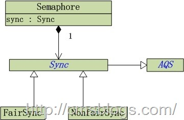

##【Java并发编程实战】-----“J.U.C”：Semaphore

##
##信号量Semaphore是一个控制访问多个共享资源的计数器，它本质上是一个“共享锁”。  

##
##Java并发提供了两种加锁模式：共享锁和独占锁。前面LZ介绍的ReentrantLock就是独占锁。对于独占锁而言，它每次只能有一个线程持有，而共享锁则不同，它允许多个线程并行持有锁，并发访问共享资源。  

##
##独占锁它所采用的是一种悲观的加锁策略， 对于写而言为了避免冲突独占是必须的，但是对于读就没有必要了，因为它不会影响数据的一致性。如果某个只读线程获取独占锁，则其他读线程都只能等待了，这种情况下就限制了不必要的并发性，降低了吞吐量。而共享锁则不同，它放宽了加锁的条件，采用了乐观锁机制，它是允许多个读线程同时访问同一个共享资源的。  
##Semaphore简介  

##
##Semaphore，在API中是这样介绍的，一个计数信号量。从概念上讲，信号量维护了一个许可集。如有必要，在许可可用前会阻塞每一个 acquire()，然后再获取该许可。每个 release() 添加一个许可，从而可能释放一个正在阻塞的获取者。但是，不使用实际的许可对象，Semaphore 只对可用许可的号码进行计数，并采取相应的行动。   

##
##Semaphore 通常用于限制可以访问某些资源（物理或逻辑的）的线程数目。下面LZ以理发为例来简述Semaphore。  

##
##为了简单起见，我们假设只有三个理发师、一个接待人。一开始来了五个客人，接待人则安排三个客人进行理发，其余两个人必须在那里等着，此后每个来理发店的人都必须等待。一段时间后，一个理发师完成理发后，接待人则安排另一个人（公平还是非公平机制呢？？）来理发。在这里理发师则相当于公共资源，接待人则相当于信号量（Semaphore），客户相当于线程。  

##
##进一步讲，我们确定信号量Semaphore是一个非负整数（>=1）。当一个线程想要访问某个共享资源时，它必须要先获取Semaphore，当Semaphore >0时，获取该资源并使Semaphore – 1。如果Semaphore值 = 0，则表示全部的共享资源已经被其他线程全部占用，线程必须要等待其他线程释放资源。当线程释放资源时，Semaphore则+1；  

##
##当信号量Semaphore = 1 时，它可以当作互斥锁使用。其中0、1就相当于它的状态，当=1时表示其他线程可以获取，当=0时，排他，即其他线程必须要等待。  
##Semaphore源码分析  

##
##Semaphore的结构如下：  

##
##   

##
##从上面可以看出，Semaphore和ReentrantLock一样，都是包含公平锁（FairySync）和非公平锁（NonfairSync），两个锁都是继承Sync，而Sync也是继承自AQS。其构造函数如下：     	/**
     * 创建具有给定的许可数和非公平的公平设置的 Semaphore。
     */
    public Semaphore(int permits) {
        sync = new NonfairSync(permits);
    	}
    
    /**
     * 创建具有给定的许可数和给定的公平设置的 Semaphore。
     */
    public Semaphore(int permits, boolean fair) {
        sync = fair ? new FairSync(permits) : new NonfairSync(permits);
    	}



##
##

信号量的获取：acquire()


##
##在ReentrantLock中已经阐述过，公平锁和非公平锁获取锁机制的差别：对于公平锁而言，如果当前线程不在CLH队列的头部，则需要排队等候，而非公平锁则不同，它无论当前线程处于CLH队列的何处都会直接获取锁。所以公平信号量和非公平信号量的区别也一样。


  	public void acquire() throws InterruptedException {
        sync.acquireSharedInterruptibly(1);
    	}
    
    public final void acquireSharedInterruptibly(int arg)
            throws InterruptedException {
        if (Thread.interrupted())
            throw new InterruptedException();
        if (tryAcquireShared(arg) < 0)
            doAcquireSharedInterruptibly(arg);
    	}



##
##对于公平信号量和非公平信号量，他们机制的差异就体现在traAcquireShared()方法中：


##
##公平锁


  	protected int tryAcquireShared(int acquires) {
        for (;;) {
            //判断该线程是否位于CLH队列的列头，如果是的话返回 -1,调用doAcquireSharedInterruptibly()
            if (hasQueuedPredecessors())
                return -1;
            //获取当前的信号量许可
            int available = getState();
            //设置“获得acquires个信号量许可之后，剩余的信号量许可数”
            int remaining = available - acquires;
            
            //如果剩余信号量 > 0 ,则设置“可获取的信号量”为remaining
            if (remaining < 0 || compareAndSetState(available, remaining))
                return remaining;
        	}
    	}



##
##tryAcquireShared是尝试获取 信号量，remaining表示下次可获取的信号量。


##
##对于hasQueuedPredecessors、compareAndSetState在ReentrantLock中已经阐述了，hasQueuedPredecessors用于判断该线程是否位于CLH队列列头，compareAndSetState用于设置state的，它是进行原子操作的。代码如下：


  	public final boolean hasQueuedPredecessors() {
        Node t = tail; // Read fields in reverse initialization order
        Node h = head;
        Node s;
        return h != t &amp;&amp;
            ((s = h.next) == null || s.thread != Thread.currentThread());
    	}

    protected final boolean compareAndSetState(int expect, int update) {
        return unsafe.compareAndSwapInt(this, stateOffset, expect, update);
    	}



##
##doAcquireSharedInterruptibly源代码如下：


  	private void doAcquireSharedInterruptibly(int arg)
            throws InterruptedException {
            /*
             * 创建CLH队列的node节点，Node.SHARED表示该节点为共享锁
             */
            final Node node = addWaiter(Node.SHARED);
            boolean failed = true;
            try {
                for (;;) {
                    //获取该节点的前继节点
                    final Node p = node.predecessor();
                    //当p为头节点时，基于公平锁机制，线程尝试获取锁
                    if (p == head) {
                        //尝试获取锁
                        int r = tryAcquireShared(arg);    
                        if (r >= 0) {
                            setHeadAndPropagate(node, r);  
                            p.next = null; // help GC
                            failed = false;
                            return;
                        	}
                    	}
                    //判断当前线程是否需要阻塞，如果阻塞的话，则一直处于阻塞状态知道获取共享锁为止
                    if (shouldParkAfterFailedAcquire(p, node) &amp;&amp;
                        parkAndCheckInterrupt())
                        throw new InterruptedException();
                	}
            	} finally {
                if (failed)
                    cancelAcquire(node);
            	}
        	}



##
##doAcquireSharedInterruptibly主要是做两个工作；1、尝试获取共享锁，2、阻塞线程直到线程获取共享锁。


##
##addWaiter(Node.SHARED)：创建”当前线程“的Node节点，且Node中记录的锁的类型是”共享锁“(Node.SHARED)；并将该节点添加到CLH队列末尾。


##
##shouldParkAfterFailedAcquire：如果在尝试获取锁失败之后，线程应该等待，返回true；否则返回false。


##
##parkAndCheckInterrupt：当前线程会进入等待状态，直到获取到共享锁才继续运行。


##
##对于addWaiter、shouldParkAfterFailedAcquire、parkAndCheckInterruptLZ在“【Java并发编程实战】-----“J.U.C”：ReentrantLock之二lock方法分析”中详细介绍了。


##
##非公平锁


##
##对于非公平锁就简单多了，她没有那些所谓的要判断是不是CLH队列的列头，如下：


  	final int nonfairTryAcquireShared(int acquires) {
            for (;;) {
                int available = getState();
                int remaining = available - acquires;
                if (remaining < 0 ||
                    compareAndSetState(available, remaining))
                    return remaining;
            	}
        	}



##
##在非公平锁中，tryAcquireShared直接调用AQS的nonfairTryAcquireShared()。通过上面的代码我可看到非公平锁并没有通过if (hasQueuedPredecessors())这样的条件来判断该节点是否为CLH队列的头节点，而是直接判断信号量。

信号量的释放：release()


##
##信号量Semaphore的释放和获取不同，它没有分公平锁和非公平锁。如下：


  	public void release() {
        sync.releaseShared(1);
    	}
    public final boolean releaseShared(int arg) {
        //尝试释放共享锁
        if (tryReleaseShared(arg)) {
            doReleaseShared();
            return true;
        	}
        return false;
    	}



##
##release()释放线索所占有的共享锁，它首先通过tryReleaseShared尝试释放共享锁，如果成功直接返回，如果失败则调用doReleaseShared来释放共享锁。


##
##tryReleaseShared：


  	protected final boolean tryReleaseShared(int releases) {
        for (;;) {
            int current = getState();
            //信号量的许可数 = 当前信号许可数 + 待释放的信号许可数
            int next = current + releases;
            if (next < current) // overflow
                throw new Error("Maximum permit count exceeded");
            //设置可获取的信号许可数为next
            if (compareAndSetState(current, next))
                return true;
        	}
    	}



##
##doReleaseShared：


  	private void doReleaseShared() {
            for (;;) {
                //node 头节点
                Node h = head;
                //h != null,且h　!= 尾节点
                if (h != null &amp;&amp; h != tail) {
                    //获取h节点对应线程的状态
                    int ws = h.waitStatus;
                    //若h节点状态为SIGNAL，表示h节点的下一个节点需要被唤醒
                    if (ws == Node.SIGNAL) {
                        //设置h节点状态
                        if (!compareAndSetWaitStatus(h, Node.SIGNAL, 0))
                            continue;
                        //唤醒h节点对应的下一个节点
                        unparkSuccessor(h);
                    	}
                    //若h节点对应的状态== 0 ，则设置“文件点对应的线程所拥有的共享锁”为其它线程获取锁的空状态
                    else if (ws == 0 &amp;&amp;
                             !compareAndSetWaitStatus(h, 0, Node.PROPAGATE))
                        continue;                
                	}
                //h == head时，则退出循环，若h节点发生改变时则循环继续
                if (h == head)                  
                    break;
            	}
        	}



##
##在这里有关的方法，请参考：【Java并发编程实战】-----“J.U.C”：ReentrantLock之三unlock方法分析。


##
##


##
##


##
##

##实例


##
##


##
##


##
##


##
##


##
##


##
##


##
##


##
##该实例来源于《java7并发编程实战手册》


##
##打印任务：


  	public class PrintQueue {
    private final Semaphore semaphore;   //声明信号量
    
    public PrintQueue(){
        semaphore = new Semaphore(1);
    	}
    
    public void printJob(Object document){
        try {
            semaphore.acquire();//调用acquire获取信号量
            long duration = (long) (Math.random() * 10);
            System.out.println( Thread.currentThread().getName() + 
                    "PrintQueue : Printing a job during " + duration);
            Thread.sleep(duration);
        	} catch (InterruptedException e) {
            e.printStackTrace();
        	}  finally{
            semaphore.release();  //释放信号量
        	}
    	}
	}



##
##Job:


  	public class Job implements Runnable{
    private PrintQueue printQueue;
    
    public Job(PrintQueue printQueue){
        this.printQueue = printQueue;
    	}
    
    @Override
    public void run() {
        System.out.println(Thread.currentThread().getName() + " Going to print a job");
        printQueue.printJob(new Object());
        System.out.println(Thread.currentThread().getName() + " the document has bean printed");
    	}

	}



##
##Test：


  	public class Test {
    public static void main(String[] args) {
        Thread[] threads = new Thread[10];
        
        PrintQueue printQueue = new PrintQueue();
        
        for(int i = 0 ; i < 10 ; i++){
            threads[i] = new Thread(new Job(printQueue),"Thread_" + i);
        	}
        
        for(int i = 0 ; i < 10 ; i++){
            threads[i].start();
        	}
    	}
	}



##
##运行结果：


  	Thread_0 Going to print a job
Thread_0PrintQueue : Printing a job during 1
Thread_4 Going to print a job
Thread_1 Going to print a job
Thread_2 Going to print a job
Thread_3 Going to print a job
Thread_0 the document has bean printed
Thread_4PrintQueue : Printing a job during 7
Thread_4 the document has bean printed
Thread_1PrintQueue : Printing a job during 1
Thread_2PrintQueue : Printing a job during 3
Thread_1 the document has bean printed
Thread_2 the document has bean printed
Thread_3PrintQueue : Printing a job during 1
Thread_3 the document has bean printed



##
##


##
##参考资料


##
##1、Java多线程系列--“JUC锁”11之 Semaphore信号量的原理和示例


##
##2、java信号量控制线程打印顺序的示例分享


##
##3、JAVA多线程--信号量(Semaphore)