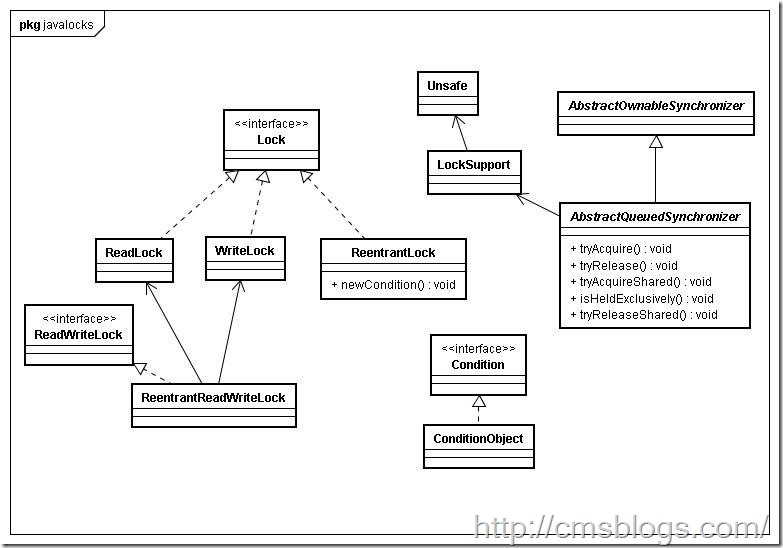

##【Java并发编程实战】-----“J.U.C”：锁，lock

##
##在java中有两种方法实现锁机制，一种是在前一篇博客中（【java7并发编程实战】-----线程同步机制：synchronized）介绍的synchronized，而另一种是比synchronized更加强大和领过的Lock。Lock确保当一个线程位于代码的临界区时，另一个线程不进入临界区，相对于synchronized，Lock接口及其实现类提供了更加强大、灵活的锁机制。  
##一个简单的锁  

##
##在使用synchronized时，我们是这样使用锁的：     	public class ThreadTest {
    public void test(){
        synchronized(this){
            //do something
        	}
    	}
	}



##
##synchronized可以确保在同一时间内只有一个线程在执行dosomething。下面是使用lock替代synchronized：


  	public class ThreadTest {
    Lock lock = new Lock();
    public void test(){
        lock.lock();
        //do something
        lock.unlock();
    	}
	}



##
##lock()方法会对Lock实例对象进行加锁，因此所有对该对象调用lock()方法的线程都会被阻塞，直到该Lock对象的unlock()方法被调用。


##
##【以下引自：Java中的锁】


  	public class Lock{
    private boolean isLocked = false;

    public synchronized void lock() throws InterruptedException{
        while(isLocked){
            wait();
        	}
        isLocked = true;
    	}

    public synchronized void unlock(){
        isLocked = false;
        notify();
    	}
	}



##
##当isLocked为true时，调用lock()的线程在wait()调用上阻塞等待。为防止该线程没有收到notify()调用也从wait()中返回，这个线程会重新去检查isLocked条件以决定当前是否可以安全地继续执行还是需要重新保持等待，而不是认为线程被唤醒了就可以安全地继续执行了。如果isLocked为false，当前线程会退出while(isLocked)循环，并将isLocked设回true，让其它正在调用lock()方法的线程能够在Lock实例上加锁。

##锁的公平性


##
##公平性的对立面是饥饿。那么什么是“饥饿”呢？如果一个线程因为其他线程在一直抢占着CPU而得不到CPU运行时间，那么我们就称该线程被“饥饿致死”。而解决饥饿的方案则被称之为“公平性”——所有线程均可以公平地获得CPU运行机会。


##
##导致线程饥饿主要有如下几个原因：


##
##高优先级线程吞噬所有的低优先级线程的CPU时间。我们可以为每个线程单独设置其优先级，从1到10。优先级越高的线程获得CPU的时间越多。对大多数应用来说，我们最好是不要改变其优先级值。


##
##线程被永久堵塞在一个等待进入同步块的状态。java的同步代码区是导致线程饥饿的重要因素。java的同步代码块并不会保证进入它的线程的先后顺序。这就意味着理论上存在一个或者多个线程在试图进入同步代码区时永远被堵塞着，因为其他线程总是不断优于他获得访问权，导致它一直得到不到CPU运行机会被“饥饿致死”。


##
##线程在等待一个本身也处于永久等待完成的对象。如果多个线程处在wait()方法执行上，而对其调用notify()不会保证哪一个线程会获得唤醒，任何线程都有可能处于继续等待的状态。因此存在这样一个风险：一个等待线程从来得不到唤醒，因为其他等待线程总是能被获得唤醒。


##
##为了解决线程“饥饿”的问题，我们可以使用锁实现公平性。

##锁的可重入性


##
##我们知道当线程请求一个由其它线程持有锁的对象时，该线程会阻塞，但是当线程请求由自己持有锁的对象时，是否可以成功呢？答案是可以成功的，成功的保障就是线程锁的“可重入性”。


##
##“可重入”意味着自己可以再次获得自己的内部锁，而不需要阻塞。如下：


  	public class Father {
    public synchronized void method(){
        //do something
    	}
	}
public class Child extends Father{
    public synchronized void method(){
        //do something 
        super.method();
    	}
	}



##
##如果所是不可重入的，上面的代码就会死锁，因为调用child的method(),首先会获取父类Father的内置锁然后获取Child的内置锁，当调用父类的方法时，需要再次后去父类的内置锁，如果不可重入，可能会陷入死锁。


##
##java多线程的可重入性的实现是通过每个锁关联一个请求计算和一个占有它的线程，当计数为0时，认为该锁是没有被占有的，那么任何线程都可以获得该锁的占有权。当某一个线程请求成功后，JVM会记录该锁的持有线程 并且将计数设置为1，如果这时其他线程请求该锁时则必须等待。当该线程再次请求请求获得锁时，计数会+1；当占有线程退出同步代码块时，计数就会-1，直到为0时，释放该锁。这时其他线程才有机会获得该锁的占有权。

##lock及其实现类


##
##java.util.concurrent.locks提供了非常灵活锁机制，为锁定和等待条件提供一个框架的接口和类，它不同于内置同步和监视器,该框架允许更灵活地使用锁定和条件。它的类结构图如下：


##
## 


##
##ReentrantLock：一个可重入的互斥锁，为lock接口的主要实现。


##
##ReentrantReadWriteLock：


##
##ReadWriteLock：ReadWriteLock 维护了一对相关的锁，一个用于只读操作，另一个用于写入操作。


##
##Semaphore：一个计数信号量。


##
##Condition:锁的关联条件，目的是允许线程获取锁并且查看等待的某一个条件是否满足。


##
##CyclicBarrier：一个同步辅助类，它允许一组线程互相等待，直到到达某个公共屏障点。


##
##后面将会对这些类进行详细说明。


##
##


##
##参考资料：


##
##1、Java中的锁


##
##2、【Java并发性和多线程】饥饿和公平