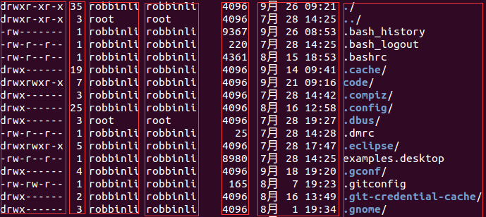

##【Linux】Linux学习笔记（完结）前言

##
##在工作中发现Linux系统的重要性，于是计划重温下Linux，顺便记录笔记方便之后查阅。磁盘分区在Linux系统中，每个设备都被当成一个文件来对待；如IDE接口的硬盘文件名为/dev/hd[a-d]。磁盘的第一个扇区记录了主引导分区(MBR)和分区表；主引导分区可以安装引导加载程序的地方，有446bytes，系统开机时会主动读取MBR区块的内容；分区表记录硬盘分区状态，有64bytes。磁盘分区是对分区表进行设置，默认分区表仅能写入四组分区信息，四组分区信息称为主或扩展分区。使用扩展分区划分出来的为逻辑分区，其编号从5开始，如/dev/hda5/、/dev/hda6...。前四个分区号均保留。主与扩展分区最多有4个``扩展分区最多只有1个，逻辑分区是由扩展分区分割出来的分区，只有主分区和逻辑分区能够被格式化，扩展分区不能。若扩展分区被破坏，所有逻辑分区将会被删除。BIOS是写入到硬件上的程序，其会根据用户设置取得能够开机的硬盘，并且到该硬盘下读取第一个扇区的MBR位置，MBR中存放了最基本的引导加载程序，接下来由引导加载程序(boot loader)加载内核文件，然后内核文件开始操作系统的功能。引导加载程序主要提供三个服务：提供菜单：可选择不同开机选项，是多重引导的重要功能。载入内核文件：指向可开机的程序区段来开始操作系统。转交其他loader：将引导加载功能转交给其他loader负责。引导加载程序除了可以安装在MBR外，还可以安装在每个分区的引导扇区。每个分区拥有自己的启动扇区，实际可开机的内核文件放置在各分区内，loader只认识自己系统分区内的可开机内核文件以及其他loader，loader可直接指向或间接将管理权转交给另一个管理程序。系统登录Linux默认提供6个Terminal供用于登录，切换方式为Ctrl+Alt+[F1-F6]，名称分别为tty1-tty6，使用Ctrl+Alt+F7可切换至图形界面。若以纯文本环境启动Linux，若想启动图形界面，可使用startx命令启动图形界面。使用man + 命令可查看帮助，如man date。使用shutdown命令关机，如shutdown -h now表示现在关机，shutdown -h 20:25表示20:25关机。文件权限和目录配置

##
## 

##
##分为七列，分别代表文件权限、连接数、文件所有者、文件所属用户组、文件大小、文件最后被修改的时间、文件名。第一列做如下划分：第一个字符若为d，则表示目录，若为-，则表示文件，若为|，则表示为连接文件(linkfile)、若为b，表示设备文件里的可供存储的接口设备、若为c，表示设备文件里的串行端口设备，如键盘鼠标等。接下来三个字符为一组，可分为三组，且均为rwx组合，r代表可读，w代表可写，x代表可执行，其位置不会变化，若无权限，则为-；第一组为文件所有者的权限、第二组为同用户组的权限、第三组为其他非本用户组的权限。chgrp改变文件所属用户组；chown改变文件所有者；chmod改变文件权限。在改变时发现无权限可以使用sudo ch***试试。改变所有者可使用chown user:group ***的格式，如chown root:root log.log将log.log改为root组下的root帐号。r:4;w:2;x:1，可使用数字更改权限属性，权限分为三组，分别对应owner、group、others，如chmod 777 .bashrc表示owner、group、others都具有读写执行权限。可使用chmod u=rwx,go=rx .bashrc更改权限，owner具有读写执行权限；group和others具有读写权限。能否进入某个目录，只与该目录的x权限有关，若具有权限，则可进入，否则不可进入。单一文件或目录的最大容许文件名为255个字符，包含完整路径名称及目录/的完整文件名为4096个字符。可使用mkdir -p test/test/test/test一次性创建所有的目录。文件与目录管理使用cp -r dir1 dir2/将dir1目录复制到dir2目录下。使用mv test1 test2将test1更名为test2。cat、more、less、head、tail可查看文件。tail -f filename，可查看filename不断新增的内容。磁盘与文件系统管理扇区是最小的物理存储单位，大小为512bytes，扇区组成柱面，柱面是分区的最小单位。挂载点一定是目录，该目录为进入该文件系统的入口。可使用df命令查看磁盘的使用情况。文件与文件系统压缩和打包使用tar -zcvf git.tar.gz git/命令压缩git目录至git.tar.gz。使用tar -zxvf git.tar.gz命令解压缩git.tar.gz至本目录下。Vim编辑器G(Shift+g)移动到最后一行，gg移动到第一行。dd删除光标所在的一整行。x向后删除一个字符(Del)，X向前删除一个字符(Backspace)。认识学习Bash对于变量赋值而言，等号两边不能接空格，如myname = leesf会报错。使用bash可以进入子进程，但进程的自定义变量无法在子进程内使用，exit退出子进程，通过export将变量变成环境变量后，就能够在子进程中使用。使用set可查看所有变量（含环境变量和自定义变量）使用set | grep HISTFILE可查看历史命令记录的放置文件和历史命令记录大小。使用echo $?查看上个命令执行的回传码（若执行成功，返回0，否则为非0）。使用echo $$可以查看本PID。使用alias cls="clear"设置清屏的别名。使用history可以显示所有历史命令。使用!!或者向上箭头+Enter执行上一条命令。使用!al执行最近以al为开头的命令。可修改~/.bashrc或~/.bash_profile文件进行个人设置，并使用source ~/.bashrc或source ~/.bash_profile使其生效，有时可能需要重新登出登入操作，登出使用exit即可。标准输入代码为0，使用<或<<；标准输出代码为1，使用>或>>；标准错误输出代码为2，使用2>或2>>。其中>>表示累加，>表示覆盖。使用/dev/null将stderr信息丢弃，如find /home -name .bashrc 2> /dev/null，表示将stderr丢弃。若想将错误信息和正确信息都写进同一文件中，需使用特殊用法，如find /home -name .bashrc > list 2>&amp;1或者find /home -name .bashrc &amp;> list。cat > catfile < ~/.bashrc将~/.bashrc的内容输出至catfile中。cat > catfile << "eof"使用eof作为结束输入控制符。可将多个命令组合一次性执行，如ll;ll;shutdown -h now，先执行两次ll，然后执行关机操作。可根据上个命令执行状态确定下个命令是否执行，上个命令回传码为0表示成功，非0表示失败。cmd1 &amp;&amp; cmd2表示若cmd1执行完毕且正确执行，则执行cmd2，否则不执行cmd2；cmd1 || cmd2表示cmd1执行完毕且正确执行，则不执行cmd2，否则执行cmd2。管道命令仅会处理standard output，对于standard error output予以忽略。常见的管道命令如下，cut、grep、sort、wc、uniq、tee等。使用tar -cvf - /home | tar -xvf -，可将/home打包后再解压到当前目录。使用sed -i "s/This is/That is/g" test将test文件中所有This is替换成That is。使用sed -i "$a the end" test可以在test文件末尾添加the end，其中$表示最后一行，a表示新增。使用awk命令处理每行的数据。如awk "{FS=":"	} $1 "\t" $3"表示自定义分隔符为:，并将第一列与第三列输出。使用diff test1 test查看test和test1之间的异同。学习Shell Scriptshell.sh文件必须要具备可读可执行(rx)权限。script脚本第一行#!/bin/bash声明了这个script使用的shell名称。使用source test.sh和sh test.sh执行时，前者是直接在父进程中运行，变量再父进程中有效，后者在子进程中运行，父进程中无效。可在sh test.sh后面接参数，并使用$#、$1、$2...等进行获取，其中$0表示执行的shell脚本名。;对于某些机器而言，需要使用bash test.sh执行脚本。由于shell是由上往下执行，需要在最前面定义函数。取计算所得变量值时，建议使用$((运算内容))。帐号管理与ACL权限设置登录时会取得用户ID，即UID和用户组ID，即GID。可使用su或sudo命令切换身份。磁盘配额与高级文件系统管理RAID-0为等量模式，性能最佳；RAID-1为映像模式，完整备份，整个RAID容量几乎减少一半；RAID-5对性能和数据备份进行了均衡考虑，当损坏的磁盘数量大于等于两块时，整组RAID-5的数据就毁了，其默认只支持一块磁盘损坏的情况。例行性工作at可以处理仅执行一次就结束调度的命令；crontab所设置的命令将会循环一直进行下去。命令at now + 1 minutes表示一分钟后执行命令。使用命令atq可以查询有哪些任务，使用atrm [jobnumber]可删除指定job number的任务。还可使用batch命令创建任务，表示当系统有空时才运行。0 3,6 * * * command表示3点和6点都执行指定命令；20 8-12 * * * command表示8点到12点(包括)的之间的每个小时的20分都进行执行命令；*/5 * * * * command表示每隔5分钟就执行命令，也可以写成0-59/5 * * * * command。使用crontab执行sh文件时，建议使用绝对路径。程序管理触发任何一个事件时，系统都会将它定义为一个进程，并且给予这个进程一个ID，称为PID，同时触发这个进程的用户和相关属性关系，给予这个PID一组有效的权限设置。父进程可通过复制(fork)方式产生一模一样的子进程，然后被复制出来的子进程再以exec方式执行实际要进行的进程，最终就成为一个子进程。系统先以fork方式复制一个与父进程相同的暂存进程，这个进程与父进程唯一的区别就是PID不同，这个暂存进程还会多一个PPID的参数，其为父进程的标识符。可使用&amp;将任务丢到后台进行。(避免使用ctrl + c中断，若注销时，还是会中断执行)可使用jobs -l命令查看目前的后台工作状态。使用fg %jobnumber命令将后台工作拿到前台执行，如先使用vim kill.sh &amp;，然后使用jobs -l，最后使用fg 1命令。使用bg %jobnumber命令运行后台命令。使用kill -9 %jobnumber删除指定后台任务。nohup [命令与参数]在终端机前台中工作，nohup [命令与参数] &amp;在终端机后台中工作。即便注销，也依旧执行。ps aux可查看所有的进程数据。top命令监控进程运行状态，如top -d 2表示两秒更新一次各进程状态。uname命令可查看系统与内核相关信息，如uname -s查看系统内核名称。uptime命令可查看系统启动时间与工作负载。fuser命令通过文件找出正在使用该文件的程序。lsof命令列出被进程所打开的文件名。pidof命令找出某个正在执行的进程的PID。总结

##
##对于一般的编程作业中，只需了解Linux主要命令即可，Linux私房菜中后面的部分由于在编程中接触较少，因此不再学习，有兴趣的读者可自行阅读。