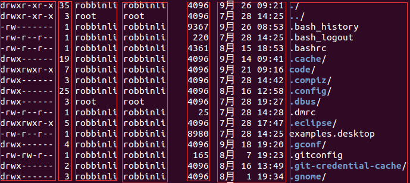

## 前言

> 在工作中发现`Linux`系统的重要性，于是计划重温下`Linux`，顺便记录笔记方便之后查阅。

## 磁盘分区

  * 在`Linux`系统中，每个设备都被当成一个文件来对待；如`IDE`接口的硬盘文件名为`/dev/hd[a-d]`。
  * 磁盘的第一个扇区记录了`主引导分区(MBR)`和`分区表`；`主引导分区`可以安装引导加载程序的地方，有`446bytes`，系统开机时会主动读取`MBR`区块的内容；`分区表`记录硬盘分区状态，有`64bytes`。
  * 磁盘分区是对`分区表`进行设置，默认分区表仅能写入四组分区信息，四组分区信息称为`主或扩展分区`。
  * 使用扩展分区划分出来的为`逻辑分区`，其编号从`5`开始，如`/dev/hda5/`、`/dev/hda6`...。前四个分区号均保留。
  * `主与扩展分区最多有4个``扩展分区`最多只有1个，`逻辑分区`是由扩展分区分割出来的分区，只有`主分区`和`逻辑分区`能够被格式化，`扩展分区`不能。
  * 若`扩展分区`被破坏，所有`逻辑分区`将会被删除。
  * `BIOS`是写入到硬件上的程序，其会根据用户设置取得能够开机的硬盘，并且到该硬盘下读取第一个扇区的`MBR`位置，`MBR`中存放了最基本的引导加载程序，接下来由`引导加载程序(boot loader)`加载内核文件，然后内核文件开始操作系统的功能。
  * `引导加载程序`主要提供三个服务： 
    * 提供菜单：可选择不同开机选项，是多重引导的重要功能。
    * 载入内核文件：指向可开机的程序区段来开始操作系统。
    * 转交其他loader：将引导加载功能转交给其他loader负责。
  * `引导加载程序`除了可以安装在`MBR`外，还可以安装在每个分区的`引导扇区`。
  * 每个分区拥有自己的`启动扇区`，实际可开机的内核文件放置在各分区内，loader只认识自己系统分区内的可开机内核文件以及其他loader，loader可直接指向或间接将管理权转交给另一个管理程序。

## 系统登录

  * `Linux`默认提供`6`个`Terminal`供用于登录，切换方式为`Ctrl+Alt+[F1-F6]`，名称分别为`tty1-tty6`，使用`Ctrl+Alt+F7`可切换至图形界面。
  * 若以纯文本环境启动`Linux`，若想启动图形界面，可使用`startx`命令启动图形界面。
  * 使用`man + 命令`可查看帮助，如`man date`。
  * 使用`shutdown`命令关机，如`shutdown -h now`表示现在关机，`shutdown -h 20:25`表示`20:25`关机。

## 文件权限和目录配置

> 分为七列，分别代表`文件权限`、`连接数`、`文件所有者`、`文件所属用户组`、`文件大小`、`文件最后被修改的时间`、`文件名`。

  * 第一列做如下划分： 
    * 第一个字符若为`d`，则表示目录，若为`-`，则表示文件，若为`|`，则表示为连接文件(linkfile)、若为`b`，表示设备文件里的可供存储的接口设备、若为`c`，表示设备文件里的串行端口设备，如键盘鼠标等。
    * 接下来三个字符为一组，可分为三组，且均为`rwx`组合，`r`代表可读，`w`代表可写，`x`代表可执行，其位置不会变化，若无权限，则为`-`；第一组为`文件所有者的权限`、第二组为`同用户组的权限`、第三组为`其他非本用户组的权限`。
  * `chgrp`改变文件所属用户组；`chown`改变文件所有者；`chmod`改变文件权限。在改变时发现无权限可以使用`sudo ch***`试试。
  * 改变所有者可使用`chown user:group ***`的格式，如`chown root:root log.log`将`log.log`改为`root`组下的`root`帐号。
  * `r:4;w:2;x:1`，可使用数字更改权限属性，权限分为三组，分别对应`owner`、`group`、`others`，如`chmod 777 .bashrc`表示`owner、group、others`都具有读写执行权限。
  * 可使用`chmod u=rwx,go=rx .bashrc`更改权限，`owner`具有读写执行权限；`group`和`others`具有读写权限。
  * 能否进入某个目录，只与该目录的`x`权限有关，若具有权限，则可进入，否则不可进入。
  * 单一文件或目录的最大容许文件名为`255`个字符，包含完整路径名称及目录/的完整文件名为`4096`个字符。
  * 可使用`mkdir -p test/test/test/test`一次性创建所有的目录。

## 文件与目录管理

  * 使用`cp -r dir1 dir2/`将`dir1`目录复制到`dir2`目录下。
  * 使用`mv test1 test2`将`test1`更名为`test2`。
  * `cat`、`more`、`less`、`head`、`tail`可查看文件。
  * `tail -f filename`，可查看`filename`不断新增的内容。

## 磁盘与文件系统管理

  * `扇区`是最小的物理存储单位，大小为`512bytes`，`扇区`组成`柱面`，`柱面`是`分区`的最小单位。
  * `挂载点`一定是目录，该目录为进入该文件系统的入口。
  * 可使用`df`命令查看磁盘的使用情况。

## 文件与文件系统压缩和打包

  * 使用`tar -zcvf git.tar.gz git/`命令压缩`git`目录至`git.tar.gz`。
  * 使用`tar -zxvf git.tar.gz`命令解压缩`git.tar.gz`至本目录下。

## Vim编辑器

  * `G(Shift+g)`移动到最后一行，`gg`移动到第一行。
  * `dd`删除光标所在的一整行。
  * `x`向后删除一个字符(`Del`)，`X`向前删除一个字符(`Backspace`)。

## 认识学习Bash

  * 对于变量赋值而言，等号两边不能接空格，如`myname = leesf`会报错。
  * 使用`bash`可以进入子进程，但进程的自定义变量无法在子进程内使用，`exit`退出子进程，通过`export`将变量变成环境变量后，就能够在子进程中使用。
  * 使用`set`可查看所有变量（含环境变量和自定义变量）
  * 使用`set | grep HISTFILE`可查看历史命令记录的放置文件和历史命令记录大小。
  * 使用`echo $?`查看上个命令执行的回传码（若执行成功，返回0，否则为非0）。
  * 使用`echo $$`可以查看本`PID`。
  * 使用`alias cls="clear"`设置清屏的别名。
  * 使用`history`可以显示所有历史命令。
  * 使用`!!`或者`向上箭头+Enter`执行上一条命令。
  * 使用`!al`执行最近以al为开头的命令。
  * 可修改`~/.bashrc`或`~/.bash_profile`文件进行个人设置，并使用`source ~/.bashrc`或`source ~/.bash_profile`使其生效，有时可能需要重新登出登入操作，登出使用`exit`即可。
  * 标准输入代码为`0`，使用`<或<<`；标准输出代码为`1`，使用`>或>>`；标准错误输出代码为`2`，使用`2>或2>>`。其中`>>`表示累加，`>`表示覆盖。
  * 使用`/dev/null`将`stderr`信息丢弃，如`find /home -name .bashrc 2> /dev/null`，表示将`stderr`丢弃。
  * 若想将错误信息和正确信息都写进同一文件中，需使用特殊用法，如`find /home -name .bashrc > list 2>&1`或者`find /home -name .bashrc &> list`。
  * `cat > catfile < ~/.bashrc`将`~/.bashrc`的内容输出至`catfile`中。
  * `cat > catfile << "eof"`使用`eof`作为结束输入控制符。
  * 可将多个命令组合一次性执行，如`ll;ll;shutdown -h now`，先执行两次`ll`，然后执行关机操作。
  * 可根据上个命令执行状态确定下个命令是否执行，上个命令回传码为`0`表示成功，非`0`表示失败。
  * `cmd1 && cmd2`表示若`cmd1`执行完毕且正确执行，则执行`cmd2`，否则不执行`cmd2`；`cmd1 || cmd2`表示`cmd1`执行完毕且正确执行，则不执行`cmd2`，否则执行`cmd2`。
  * 管道命令仅会处理`standard output`，对于`standard error output`予以忽略。
  * 常见的管道命令如下，`cut`、`grep`、`sort`、`wc`、`uniq`、`tee`等。
  * 使用`tar -cvf - /home | tar -xvf -`，可将`/home`打包后再解压到当前目录。
  * 使用`sed -i "s/This is/That is/g" test`将`test`文件中所有`This is`替换成`That is`。
  * 使用`sed -i "$a the end" test`可以在`test`文件末尾添加`the end`，其中`$`表示最后一行，`a`表示`新增`。
  * 使用`awk`命令处理每行的数据。如`awk "{FS=":"} $1 "\t" $3"`表示自定义分隔符为`:`，并将第一列与第三列输出。
  * 使用`diff test1 test`查看`test`和`test1`之间的异同。

## 学习Shell Script

  * `shell.sh`文件必须要具备可读可执行(`rx`)权限。
  * `script`脚本第一行`#!/bin/bash`声明了这个`script`使用的`shell`名称。
  * 使用`source test.sh`和`sh test.sh`执行时，前者是直接在父进程中运行，变量再父进程中有效，后者在子进程中运行，父进程中无效。
  * 可在`sh test.sh`后面接参数，并使用`$#、$1、$2...`等进行获取，其中`$0`表示执行的`shell`脚本名。;
  * 对于某些机器而言，需要使用`bash test.sh`执行脚本。
  * 由于`shell`是由上往下执行，需要在最前面定义函数。
  * 取计算所得变量值时，建议使用`$((运算内容))`。

## 帐号管理与ACL权限设置

  * 登录时会取得用户ID，即`UID`和用户组ID，即`GID`。
  * 可使用`su`或`sudo`命令切换身份。

## 磁盘配额与高级文件系统管理

  * `RAID-0`为等量模式，性能最佳；`RAID-1`为映像模式，完整备份，整个`RAID`容量几乎减少一半；`RAID-5`对性能和数据备份进行了均衡考虑，当损坏的磁盘数量大于等于两块时，整组`RAID-5`的数据就毁了，其默认只支持一块磁盘损坏的情况。

## 例行性工作

  * `at`可以处理仅执行一次就结束调度的命令；`crontab`所设置的命令将会循环一直进行下去。
  * 命令`at now + 1 minutes`表示一分钟后执行命令。
  * 使用命令`atq`可以查询有哪些任务，使用`atrm [jobnumber]`可删除指定`job number`的任务。
  * 还可使用`batch`命令创建任务，表示当系统有空时才运行。
  * `0 3,6 * * * command`表示3点和6点都执行指定命令；`20 8-12 * * * command`表示8点到12点(包括)的之间的每个小时的`20`分都进行执行命令；`*/5 * * * * command`表示每隔5分钟就执行命令，也可以写成`0-59/5 * * * * command`。
  * 使用`crontab`执行`sh`文件时，建议使用绝对路径。

## 程序管理

  * 触发任何一个事件时，系统都会将它定义为一个进程，并且给予这个进程一个`ID`，称为`PID`，同时触发这个进程的用户和相关属性关系，给予这个`PID`一组有效的权限设置。
  * 父进程可通过复制(`fork`)方式产生一模一样的子进程，然后被复制出来的子进程再以`exec`方式执行实际要进行的进程，最终就成为一个子进程。
  * 系统先以`fork`方式复制一个与父进程相同的暂存进程，这个进程与父进程唯一的区别就是`PID`不同，这个暂存进程还会多一个`PPID`的参数，其为父进程的标识符。
  * 可使用`&`将任务丢到后台进行。( **避免使用`ctrl + c`中断，若注销时，还是会中断执行** )
  * 可使用`jobs -l`命令查看目前的后台工作状态。
  * 使用`fg %jobnumber`命令将后台工作拿到前台执行，如先使用`vim kill.sh &`，然后使用`jobs -l`，最后使用`fg 1`命令。
  * 使用`bg %jobnumber`命令运行后台命令。
  * 使用`kill -9 %jobnumber`删除指定后台任务。
  * `nohup [命令与参数]`在终端机前台中工作，`nohup [命令与参数] &`在终端机后台中工作。 **即便注销，也依旧执行。**
  * `ps aux`可查看所有的进程数据。  

  * `top`命令监控进程运行状态，如`top -d 2`表示两秒更新一次各进程状态。
  * `uname`命令可查看系统与内核相关信息，如`uname -s`查看系统内核名称。
  * `uptime`命令可查看系统启动时间与工作负载。
  * `fuser`命令通过文件找出正在使用该文件的程序。
  * `lsof`命令列出被进程所打开的文件名。
  * `pidof`命令找出某个正在执行的进程的`PID`。

## 总结

> 对于一般的编程作业中，只需了解`Linux`主要命令即可，`Linux私房菜`中后面的部分由于在编程中接触较少，因此不再学习，有兴趣的读者可自行阅读。

