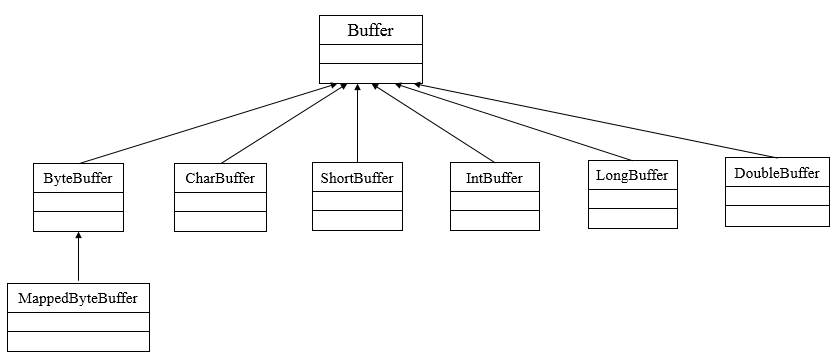
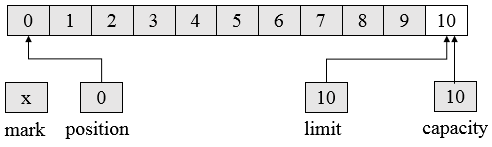
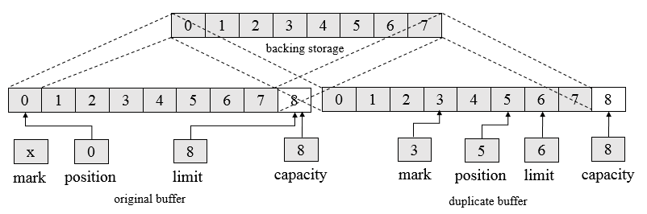
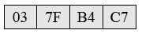
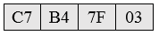

##【NIO】Java NIO之缓冲

##
##一、前言

##
##　　在笔者打算学习Netty框架时，发现很有必要先学习NIO，因此便有了本博文，首先介绍的是NIO中的缓冲。

##
##二、缓冲

##
##　　2.1 层次结构图

##
##　　除了布尔类型外，其他基本类型都有相对应的缓冲区类，其继承关系层次图如下。

##
## 

##
##　　其中，Buffer是所有类的父类，Buffer中也规定了所有缓冲区的共同行为。

##
##　　2.2 缓冲区基础

##
##　　缓冲区是包在一个对象内的基本数据元素数组，其有四个重要属性

##
##　　　　容量（ Capacity）：缓冲区能够容纳的数据元素的最大数量，容量在缓冲区创建时被设定，并且永远不能被改变。

##
##　　　　上界（Limit）：缓冲区的第一个不能被读或写的元素。或者说，缓冲区中现存元素的计数。 

##
##　　　　位置（Position）：下一个要被读或写的元素的索引。位置会自动由相应的 get( )和 put( )函数更新。　　　　

##
##　　　　标记（Mark）：一个备忘位置。调用 mark( )来设定 mark = postion。调用 reset( )设定 position = mark。标记在设定前是未定义的(undefined)。

##
##　　四个属性之间的关系如下

##
##　　　　0 <= mark <= position <= limit <= capacity 

##
##　　如下图展示了一个容量为10的ByteBuffer逻辑视图。

##
##　　 

##
##　　其中，mark未被设定，position初始为0，capacity为10，limit为10，第一个元素存放至position为0的位置，capacity不变，其他三个属性会变化。position在调用 put()时，会自动指出了下一个数据元素应该被插入的位置，或者当 get()被调用时指出下一个元素应从何处取出。

##
##　　当put完数据后需要读取时，需要调用flip函数，其将limit设置为position，然后将position设置为0，之后开始读取。

##
##　　当对缓冲区调用两次flip函数时，缓冲区的大小变为0。因为第二次的limit也设置为0，position为0，因此缓冲区大小为0。

##
##　　缓冲区并不是多线程安全的。如果想以多线程同时存取特定的缓冲区，则需要在存取缓冲区之前进行同步。

##
##　　下面是一个简单的缓冲区读写的示例　

	import java.nio.CharBuffer;


/**
 * Created by LEESF on 2017/4/15.
 */
public class BufferDemo {
    public static void main(String[] args) {
        CharBuffer buffer = CharBuffer.allocate(5);
        buffer.put("H");
        buffer.put("E");
        buffer.put("L");
        buffer.put("L");
        buffer.put("O");

        buffer.flip();
        while (buffer.hasRemaining()) {
            System.out.print(buffer.get());
        	}
    	}
	}


##
##　　运行结果如下　　

	HELLO


##
##　　当对缓冲区进行比较时，判定两个缓冲区相同充要条件如下

##
##　　　　· 两个对象类型相同。包含不同数据类型的 buffer 永远不会相等，而且 buffer绝不会等于非 buffer 对象。

##
##　　　　· 两个对象都剩余同样数量的元素。Buffer 的容量不需要相同，而且缓冲区中剩余数据的索引也不必相同。但每个缓冲区中剩余元素的数目（从位置到上界）必须相同。

##
##　　　　· 在每个缓冲区中应被 get()函数返回的剩余数据元素序列必须一致。

##
##　　如果不满足以上任意条件， 两个缓冲区的比较就会返回 false。

##
##　　当两个缓冲区不一样长，进行比较时，如果一个缓冲区在不相等元素发现前已经被耗尽，较短的缓冲区被认为是小于较长的缓冲区。

##
##　　当缓冲区与数组进行交互时，如果缓冲区中的数据不够完全填满数组，就会得到一个异常。这意味着如果想将一个小型缓冲区传入一个大型数组，就必须明确地指定缓冲区中剩余的数据长度。如果缓冲区有足够的空间接受数组中的数据（ buffer.remaining()>myArray.length)，数据将会被复制到从当前位置开始的缓冲区，并且缓冲区位置会被提前所增加数据元素的数量。如果缓冲区中没有足够的空间，那么不会有数据被传递，同时抛出BufferOverflowException 异常。

##
##　　2.3 创建缓冲区

##
##　　新的缓冲区由分配（allocate）或包装（wrap）操作创建的。分配操作创建一个缓冲区对象并分配一个私有的空间来储存指定容量大小的数据。包装操作创建一个缓冲区对象但是不分配任何空间来储存数据元素，使用所提供的数组作为存储空间来储存缓冲区中的数据。

##
##　　使用分配方式创建缓冲区如下 ，如创建容量大小为100的CharBuffer。　　

	CharBuffer charBuffer = CharBuffer.allocate (100);


##
##　　使用包装方式创建缓冲区如下　

	char [] myArray = new char [100];
CharBuffer charbuffer = CharBuffer.wrap (myArray);


##
##　　上述代码构造了一个新的缓冲区对象，但数据元素会存在于数组中。这意味着通过调用put()函数造成的对缓冲区的改动会直接影响这个数组，而且对这个数组的任何改动也会对这个缓冲区对象可见。　

##
##　　带有 offset 和 length 作为参数的 wrap()函数版本则会构造一个按照指定的 offset 和 length 参数值初始化位置和上界的缓冲区。

	CharBuffer charbuffer = CharBuffer.wrap (myArray, 12, 42);


##
##　　上述代码创建了一个 position 值为 12， limit 值为 54（12 + 42），容量为 myArray.length 的缓冲区。

##
##　　2.4 复制缓冲区

##
##　　当一个管理其他缓冲器所包含的数据元素的缓冲器被创建时，这个缓冲器被称为视图缓冲器，而视图缓冲器总是通过调用已存在的存储器实例中的函数来创建。　　

##
##　　如Duplicate()函数创建了一个与原始缓冲区相似的新的缓冲区，两个缓冲区共享数据元素，拥有同样的容量，但每个缓冲区拥有各自的位置，上界和标记属性。对一个缓冲区内的数据元素所做的改变会反映在另外一个缓冲区上。这一副本缓冲区具有与原始缓冲区同样的数据视图。如果原始的缓冲区为只读，或者为直接缓冲区，新的缓冲区将继承这些属性。即复制一个缓冲区会创建一个新的 Buffer 对象，但并不复制数据，原始缓冲区和副本都会操作同样的数据元素。

##
##　　如下面代码片段　　

	CharBuffer buffer = CharBuffer.allocate (8);
buffer.position (3).limit (6).mark( ).position (5);
CharBuffer dupeBuffer = buffer.duplicate( );
buffer.clear( );


##
##　　会创建一个如下图所示的缓冲视图

##
##　　 

##
##　　可以看到，复制的缓冲继承了四个属性值，操作的底层都是同一份数据，每个视图对数据的操作都会反映到另外一个视图上，如下述代码可验证。

	import java.nio.CharBuffer;

/**
 * Created by LEESF on 2017/4/13.
 */
public class AllocateDemo {
    public static void main(String[] args) {
        CharBuffer buffer = CharBuffer.allocate (8);
        buffer.put("L");
        buffer.put("E");
        buffer.put("E");
        buffer.put("S");
        buffer.put("F");
        buffer.position (3).limit (6).mark( ).position (5);
        CharBuffer dupeBuffer = buffer.duplicate( );
        buffer.clear( );
        dupeBuffer.flip();
        System.out.println(dupeBuffer.position());
        System.out.println(dupeBuffer.limit());
        System.out.println(dupeBuffer.get());

        buffer.put("Y");
        buffer.put("D");
        buffer.flip();
        System.out.println(buffer.position());
        System.out.println(buffer.limit());
        System.out.println(buffer.get());

        System.out.println(dupeBuffer.get());
    	}
	}


##
##　　运行结果如下　

	0
5
L
0
2
Y
D


##
##　　可以看到buffer视图对数据的写入影响了dupeBuffer的数据获取。

##
##　　2.5 字节缓冲区

##
##　　字节是操作系统及其 I/O 设备使用的基本数据类型。当在 JVM 和操作系统间传递数据时，也是使用字段进行传递。

##
##　　每个基本数据类型都是以连续字节序列的形式存储在内存中，如32 位的 int 值0x037fb4c7（十进制的 58,700,999）可能会如下图所示的被存储内存字节中（内存地址从左往右增加）。

##
##　　 

##
##　　多字节数值被存储在内存中的方式一般被称为 endian-ness（字节顺序），如果数字数值的最高字节——big end（大端），位于低位地址，那么系统就是大端字节顺序，如果最低字节最先保存在内存中，那么小端字节顺序，如下图所示。

##
##　　 

##
##　　默认字节顺序总是 ByteBuffer.BIG_ENDIAN，无论系统的固有字节顺序是什么。Java 的默认字节顺序是大端字节顺序。

##
##　　为了解决非直接缓冲区（如通过wrap()函数所创建的被包装的缓冲区）的效率问题，引入了直接缓冲区，直接缓冲区使用的内存是通过调用本地操作系统方面的代码分配的，绕过了标准 JVM 堆栈，因此效率更高。ByteBuffer中存在isDirect方法判断缓冲区是否是直接缓冲区。

##
##　　字节缓冲区可以转化为其他不同类型的缓冲区，如CharBuffer、ShortBuffer等，转化后的缓冲区都只是原来缓冲区的视图，即有独立的四个属性值，但是共享数据元素。

##
##　　字节缓冲区可以直接存放或者取出不同类型的数据元素，如直接put(Char char)、put(int value)等。当put时，其会将不同类型数据转化为字节类型从position位置开始依次存放，而当get时，其会根据不同的get类型，从position位置开始依次取出对应的字节数转化后返回。

##
##三、总结

##
##　　本篇博文讲解了NIO中的缓冲区，最核心的就是四个属性，所有针对缓冲区的操作都是基于四个属性的操作，读者想要更具体的了解缓冲区的内容，可以查阅源码，谢谢各位园友的观看~