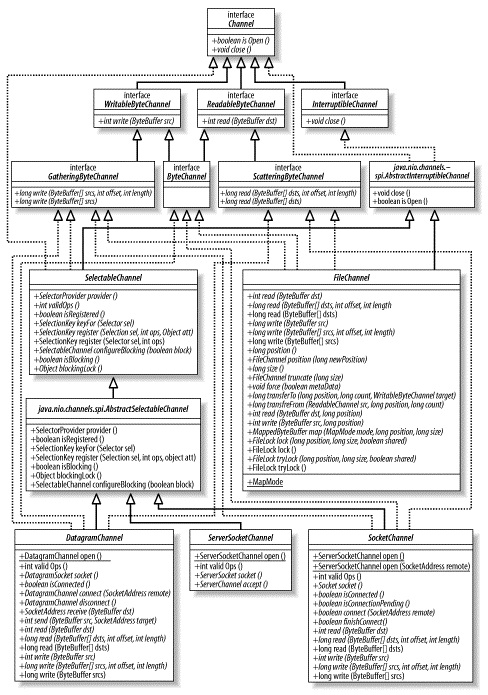

**一、前言**

前面学习了缓冲区的相关知识点，接下来学习通道。

**二、通道**

2.1 层次结构图

对于通道的类层次结构如下图所示。

其中，Channel是所有类的父类，其定义了通道的基本操作。从 Channel 接口引申出的其他接口都是面向字节的子接口，包括
WritableByteChannel和ReadableByteChannel。这也意味着 **通道只能在字节缓冲区上操作** 。

2.2 通道基础

Channel接口类只定义了两个方法（isOpen和close），分别表示通道是否打开和关闭通道，具体细节需要子类实现。

IO操作可分为File IO和Stream IO，对应通道也有它们是文件（ file）通道和套接字（ socket）通道
。通道可以有多种方式创建。Socket 通道有可以直接创建新 socket
通道的工厂方法。但File通道不能直接创建，只能通过在一个打开的RandomAccessFile、FileInputStream或FileOutputStream的对象上调用getChannel(
)方法来获取。

通道将数据传输给 ByteBuffer 对象或者从 ByteBuffer 对象获取数据进行传输，通道可以是单向（ unidirectional）或者双向的（
bidirectional）。一个 channel 类可能实现定义read( )方法的 ReadableByteChannel 接口，而另一个
channel 类也许实现 WritableByteChannel 接口以提供 write(
)方法。实现这两种接口其中之一的类都是单向的，只能在一个方向上传输数据。如果一个类同时实现这两个接口，那么它是双向的，可以双向传输数据。如ByteChannel
接口，该接口继承 ReadableByteChannel 和WritableByteChannel 两个接口，可双向传输数据。  

值得注意的是，从 FileInputStream 对象的getChannel( )方法获取的 FileChannel
对象是只读的，不过从接口声明的角度来看却是双向的，因为FileChannel 实现 ByteChannel 接口。在这样一个通道上调用 write(
)方法将抛出未经检查的NonWritableChannelException 异常，因为 FileInputStream 对象总是以 read-only
的权限打开文件。

**通道会连接一个特定 I/O 服务且通道实例（ channel instance）的性能受它所连接的 I/O 服务的特征限制。** 如一个连接到只读文件的
Channel 实例不能进行写操作，即使该实例所属的类可能有 write( )方法。 **  
**

通道可以以阻塞（ blocking）或非阻塞（ nonblocking）模式运行， **非阻塞模式的通道永远不会让调用的线程休眠**
。请求的操作要么立即完成，要么返回一个结果表明未进行任何操作。只有面向流的（ stream-oriented）的通道，如 sockets 和 pipes
才能使用非阻塞模式。

**通道不能被重复使用，一个打开的通道即代表与一个特定 I/O 服务的特定连接并封装该连接的状态。当通道关闭时，连接会丢失，通道将不再连接任何东西** 。

2.3 Scatter/Gather

Scatter/Gather是指在多个缓冲区上实现一个简单的 I/O 操作。

对于write操作而言，数据是从几个缓冲区按顺序抽取（称为 gather）并沿着通道发送的，该 gather
过程的效果好比将全部缓冲区的内容连结起来，并在发送数据前存放到一个大的缓冲区中。

对于read操作而言，从通道读取的数据会按顺序被散布（称为 scatter）到多个缓冲区，将每个缓冲区填满直至通道中的数据或者缓冲区的最大空间被消耗完。  

如下代码片段，假定 channel 连接到一个有 48 字节数据等待读取的 socket 上

    
    
    ByteBuffer header = ByteBuffer.allocateDirect (10);
    ByteBuffer body = ByteBuffer.allocateDirect (80);
    ByteBuffer [] buffers = { header, body };
    int bytesRead = channel.read (buffers);

此时，bytesRead为48，header 缓冲区将包含前 10 个从通道读取的字节而 body 缓冲区则包含接下来的 38 个字节，紧接着，下面代码片段

    
    
    body.clear( );
    body.put("FOO".getBytes()).flip( ); // "FOO" as bytes
    header.clear( );
    header.putShort (TYPE_FILE).putLong (body.limit()).flip( );
    long bytesWritten = channel.write (buffers);

则将不同buffer（header、body）中的数据gather起来写入通道，总共发送13个字节（3 + 2 + 8）。

**Scatter和Gather** **将读取到的数据分开存放到多个存储桶（** **bucket** **）或者将不同的数据区块合并成一个整体** 。  

2.4 文件通道

FileChannel 类可以实现常用的 read， write 以及 scatter/gather
操作，同时它也提供了很多专用于文件的新方法。并且文件通道总是阻塞式的，因此不能被置于非阻塞模式。对于文件 I/O，最强大之处在于异步 I/O（
asynchronous I/O），它允许一个进程可以从操作系统请求一个或多个 I/O 操作而不必等待这些操作的完成，发起请求的进程之后会收到它请求的
I/O 操作已完成的通知。  

FileChannel不能直接创建，需要使用getChannel方法获取，并且其是线程安全（ thread-
safe）的。多个进程可以在同一个实例上并发调用方法而不会引起任何问题，不过并非所有的操作都是多线程的，如影响通道位置或者影响文件大小的操作都是单线程的，如果一个线程在执行会影响通道位置或文件大小时，那么其他尝试进行此类操作的线程必须等待。

每个 FileChannel 对象与文件描述符是一对一关系，同底层的文件描述符一样，每个 FileChannel 都有一个叫"file
position"的概念，这个position值决定文件中哪一处的数据接下来将被读或者写，这与缓冲非常相似。

FileChannel 位置（ position）是从底层的文件描述符获得的，该 position 同时被作为通道引用获取来源的文件对象共享。这也就意味着
**一个对象对该 position 的更新可以被另一个对象看到** ，如下代码片段

    
    
    RandomAccessFile randomAccessFile = new RandomAccessFile ("filename", "r");
    // Set the file position
    randomAccessFile.seek (1000);
    // Create a channel from the file
    FileChannel fileChannel = randomAccessFile.getChannel( );
    // This will print "1000"
    System.out.println ("file pos: " + fileChannel.position( ));
    // Change the position using the RandomAccessFile object
    randomAccessFile.seek (500);
    // This will print "500"
    System.out.println ("file pos: " + fileChannel.position( ));
    // Change the position using the FileChannel object
    fileChannel.position (200);
    // This will print "200"
    System.out.println ("file pos: " + randomAccessFile.getFilePointer( ));

可以看到，随着randomAccessFile设置不同的position，fileChannel的position也会相应的跟着改变。

类似于缓冲区的 get( ) 和 put( )方法，当字节被 read( )或 write( )方法传输时，文件 position 会自动更新。如果
position 值达到了文件大小的值（文件大小的值可以通过 size( )方法返回）， read( )方法会返回一个文件尾条件值（
-1）。可是，不同于缓冲区的是，如果实现 write( )方法时 position前进到超过文件大小的值， **该文件会扩展以容纳新写入的字节** 。

同样类似于缓冲区，也有带 position 参数的绝对形式的 read( )和 write( )方法。 **这种绝对形式的方法在返回值时不会改变当前的文件
position**
。由于通道的状态无需更新，因此绝对的读和写可能会更加有效率，操作请求可以直接传到本地代码。更妙的是，多个线程可以并发访问同一个文件而不会相互产生干扰。这是因为每次调用都是原子性的（
atomic），并不依靠调用之间系统所记住的状态。

对于FileChannel实现的文件锁定模型而言， **锁的对象是文件而不是通道或线程，这意味着文件锁不适用于判优同一台 Java
虚拟机上的多个线程发起的访问**
。如果一个线程在某个文件上获得了一个独占锁，然后第二个线程利用一个单独打开的通道来请求该文件的独占锁，那么第二个线程的请求会抛出OverlappingFileLockException异常。但如果这两个线程运行在不同的
Java 虚拟机上，那么第二个线程会阻塞，因为锁 **最终是由操作系统或文件系统来判优的并且几乎总是在进程级而非线程级（同一JVM上的线程）上判优**
。锁都是与一个文件关联的，而不是与单个的文件句柄或通道关联。如下示例展示了同一JVM上的两个线程使用同一文件锁。

    
    
    import java.io.FileOutputStream;
    import java.nio.channels.FileChannel;
    import java.nio.channels.FileLock;
    
    /**
     * Created by LEESF on 2017/4/16.
     */
    public class FileLockDemo {
        public static void main(String[] args) throws Exception {
            FileOutputStream fileOutputStream = new FileOutputStream("F://test.txt");
            FileChannel fileChannel = fileOutputStream.getChannel();
    
            Thread thread1 = new Thread(new MyRunnalbe(fileChannel));
            Thread thread2 = new Thread(new MyRunnalbe(fileChannel));
    
            thread1.start();
            thread2.start();
        }
    
        static class MyRunnalbe implements Runnable {
            private FileChannel fileChannel;
    
            public MyRunnalbe(FileChannel fileChannel) {
                this.fileChannel = fileChannel;
            }
    
            @Override
            public void run() {
                try {
                    FileLock fileLock= fileChannel.lock();
                    System.out.println(fileLock.isValid());
                    Thread.sleep(1000);
                } catch (Exception ex) {
                    System.out.println(Thread.currentThread().getName() + " " + ex);
                }
            }
        }
    }

输出结果

    
    
    true
    Thread-1 java.nio.channels.OverlappingFileLockException

可以看到，当thread2获取锁后，thread1再获取锁时，发出现异常。

**锁与文件关联，而不是与通道关联。我们使用锁来判优外部进程，而不是判优同一个 Java 虚拟机上的线程** 。

2.5 内存映射文件

新的 FileChannel 类提供了一个名为 map( )的方法，该方法可以在一个打开的文件和一个特殊类型的 ByteBuffer
之间建立一个虚拟内存映射，由 map( )方法返回的 MappedByteBuffer
对象的行为类似与基于内存的缓冲区，只不过该对象的数据元素存储在磁盘上的文件中。通过内存映射机制来访问一个文件会比使用常规方法读写高效得多，甚至比使用通道的效率都高。  

当需要映射整个文件时，可使用如下代码片段

    
    
    buffer = fileChannel.map(FileChannel.MapMode.READ_ONLY, 0, fileChannel.size());

与文件锁的范围机制不一样，映射文件的范围不应超过文件的实际大小。如果您请求一个超出文件大小的映射，文件会被增大以匹配映射的大小。

同常规的文件句柄类似， **文件映射可以是可写的或只读的** 。前两种映射模式MapMode.READ_ONLY 和 MapMode.READ_WRITE
意义是很明显的，它们表示你希望获取的映射只读还是允许修改映射的文件。 **请求的映射模式将受被调用 map( )方法的 FileChannel
对象的访问权限所限制，** 如果通道是以只读的权限打开的而您却请求 MapMode.READ_WRITE 模式，那么map( )方法会抛出一个
NonWritableChannelException 异常；如果您在一个没有读权限的通道上请求MapMode.READ_ONLY 映射模式，那么将产生
NonReadableChannelException 异常。不过在以read/write 权限打开的通道上请求一个 MapMode.READ_ONLY
映射却是允许的。而MapMode.PRIVATE 模式表示一个写时拷贝（ copy-on-write）的映射，这意味着通过 put(
)方法所做的任何修改都会导致产生一个私有的数据拷贝并且该拷贝中的数据只有MappedByteBuffer
实例可以看到。该过程不会对底层文件做任何修改，而且一旦缓冲区被施以垃圾收集动作（ garbage collected），那些修改都会丢失。

FileChannel的transferTo( )和 transferFrom(
)方法允许将一个通道交叉连接到另一个通道，而不需要通过一个中间缓冲区来传递数据。

2.6 Socket通道

Socket 通道有与文件通道不同的特征， 一个或几个线程就可以管理成百上千的活动 socket 连接了并且只有很少甚至可能没有性能损失。

DatagramChannel 和 SocketChannel 实现定义读和写功能的接口而 ServerSocketChannel不实现。
ServerSocketChannel 负责监听传入的连接和创建新的 SocketChannel 对象，它本身从不传输数据。socket 通道类（
DatagramChannel、SocketChannel和ServerSocketChannel）在被实例化时都会创建一个对等socket对象。

所有通道可以在非阻塞情况下运行，这依托于SelectableChannel，使用其configureBlocking方法即可配置是否阻塞。  

ServerSocketChannel 是一个基于通道的 socket 监听器，能够在非阻塞模式下运行。  

当需要对一个端口进行监听时，需要获取通道对应的 socket，然后使用socket绑定到指定端口进行监听，常用代码如下

    
    
    ServerSocketChannel ssc = ServerSocketChannel.open( );
    ServerSocket serverSocket = ssc.socket( );
    // Listen on port 1234
    serverSocket.bind (new InetSocketAddress (1234));

在完成绑定后，可以使用ServerSocketChannel或者ServerSocket的accept方法来接受到达通道的连接，当使用ServerSocketChannel的accept时，会返回
SocketChannel 类型的对象，返回的对象能够在非阻塞模式下运行。 而当使用ServerSocket时的accept时，总是阻塞并返回一个
java.net.Socket 对象。因此较优的做法是使用ServerSocketChannel的accept方法，下面是监听1234端口的示例。

    
    
    import java.nio.ByteBuffer;
    import java.nio.channels.ServerSocketChannel;
    import java.nio.channels.SocketChannel;
    import java.net.InetSocketAddress;
    
    /**
     * Created by LEESF on 2017/4/16.
     */
    
    public class ChannelAccept {
        public static final String GREETING = "Hello I must be going.\r\n";
    
        public static void main (String [] argv) throws Exception {
            int port = 1234; // default
            if (argv.length > 0) {
                port = Integer.parseInt (argv [0]);
            }
            ByteBuffer buffer = ByteBuffer.wrap (GREETING.getBytes( ));
            ServerSocketChannel ssc = ServerSocketChannel.open( );
            ssc.socket( ).bind (new InetSocketAddress (port));
            ssc.configureBlocking (false);
            while (true) {
                System.out.println ("Waiting for connections");
                SocketChannel sc = ssc.accept( );
                if (sc == null) {
                    // no connections, snooze a while
                    Thread.sleep (2000);
                } else {
                    System.out.println ("Incoming connection from: "
                            + sc.socket().getRemoteSocketAddress( ));
                    buffer.rewind( );
                    sc.write (buffer);
                    sc.close( );
                }
            }
        }
    }

SocketChannel是使用最多的 socket 通道类，Socket 和 SocketChannel 类封装点对点、有序的网络连接，类似于
TCP/IP网络连接，SocketChannel 扮演客户端，会发起和一个监听服务器的连接。每个 SocketChannel 对象创建时都会同一个对等的
java.net.Socket 对象对应。  

下面代码片段会连接指定主机的指定端口。

    
    
    SocketChannel socketChannel = SocketChannel.open( );
    socketChannel.connect (new InetSocketAddress ("somehost", somePort));

如果通过Socket的connect方法进行连接，那么线程在连接建立好或超时过期之前都将保持阻塞；而若通过SocketServer的connect方法进行连接，那么会对发起对请求地址的连接并且立即返回值。如果返回值是
true，说明连接立即建立了（这可能是本地环回连接）；如果连接不能立即建立， connect( )方法会返回 false 且并发地继续连接建立过程。

Socket 通道是线程安全的。并发访问时无需特别措施来保护发起访问的多个线程，不过任何时候都只有一个读操作和一个写操作在进行中。

如下示例完成了客户端向服务端之间的数据传送，使用ServerSocketChannel充当服务端，SocketChannel充当客户端，客户端向服务端发送数据，服务端接收后响应客户端，然后服务端关闭，客户端接收到响应数据后，关闭，代码如下

服务端

    
    
    import java.net.InetSocketAddress;
    import java.net.ServerSocket;
    import java.nio.ByteBuffer;
    import java.nio.CharBuffer;
    import java.nio.channels.ServerSocketChannel;
    import java.nio.channels.SocketChannel;
    import java.nio.charset.Charset;
    import java.nio.charset.CharsetDecoder;
    
    /**
     * Created by LEESF on 2017/4/16.
     */
    public class ServerSocketChannelDemo {
        public static void main(String[] args) throws Exception {
            ServerSocketChannel serverSocketChannel = ServerSocketChannel.open();
            ServerSocket serverSocket = serverSocketChannel.socket();
            serverSocketChannel.configureBlocking(false);
            serverSocket.bind(new InetSocketAddress("localhost", 1234));
    
            while (true) {
                SocketChannel socketChannel = serverSocketChannel.accept();
                if (socketChannel != null) {
                    ByteBuffer byteBuffer = ByteBuffer.allocate(512);
                    socketChannel.read(byteBuffer);
                    byteBuffer.flip();
                    System.out.println("server received message: " + getString(byteBuffer));
                    byteBuffer.clear();
                    String message = "server sending message " + System.currentTimeMillis();
                    System.out.println("server sends message: " + message);
                    byteBuffer.put(message.getBytes());
                    byteBuffer.flip();
                    socketChannel.write(byteBuffer);
                    break;
                }
            }
            try {
                serverSocketChannel.close();
            } catch (Exception e) {
                e.printStackTrace();
            }
        }
    
        public static String getString(ByteBuffer buffer) {
            Charset charset;
            CharsetDecoder decoder;
            CharBuffer charBuffer;
            try {
                charset = Charset.forName("UTF-8");
                decoder = charset.newDecoder();
                charBuffer = decoder.decode(buffer.asReadOnlyBuffer());
                return charBuffer.toString();
            } catch (Exception ex) {
                ex.printStackTrace();
                return "";
            }
        }
    }

客户端

    
    
    import java.net.InetSocketAddress;
    import java.nio.ByteBuffer;
    import java.nio.CharBuffer;
    import java.nio.channels.SocketChannel;
    import java.nio.charset.Charset;
    import java.nio.charset.CharsetDecoder;
    
    /**
     * Created by LEESF on 2017/4/16.
     */
    public class SocketChannelDemo {
        public static void main(String[] args) throws Exception {
            SocketChannel socketChannel = SocketChannel.open();
            socketChannel.connect(new InetSocketAddress("localhost", 1234));
            String message = "client sending message " + System.currentTimeMillis();
            ByteBuffer byteBuffer = ByteBuffer.allocate(512);
            byteBuffer.clear();
            System.out.println("client sends message: " + message);
            byteBuffer.put(message.getBytes());
            byteBuffer.flip();
            socketChannel.write(byteBuffer);
    
            while (true) {
                byteBuffer.clear();
                int readBytes = socketChannel.read(byteBuffer);
                if (readBytes > 0) {
                    byteBuffer.flip();
                    System.out.println("client receive message: " + getString(byteBuffer));
    
                    break;
                }
            }
    
            try {
                socketChannel.close();
            } catch (Exception e) {
                e.printStackTrace();
            }
        }
    
        public static String getString(ByteBuffer buffer) {
            Charset charset;
            CharsetDecoder decoder;
            CharBuffer charBuffer;
            try {
                charset = Charset.forName("UTF-8");
                decoder = charset.newDecoder();
                charBuffer = decoder.decode(buffer.asReadOnlyBuffer());
                return charBuffer.toString();
            } catch (Exception ex) {
                ex.printStackTrace();
                return "";
            }
        }
    }

服务端结果如下

    
    
    server received message: client sending message 1492334785236
    server sends message: server sending message 1492334785276

客户端结果如下

    
    
    client sends message: client sending message 1492334785236
    client receive message: server sending message 1492334785276

每个DatagramChannel 对象关联一个DatagramSocket 对象， **DatagramChannel 是模拟无连接协议（如
UDP/IP）** 。DatagramChannel
对象既可以充当服务器（监听者）也可以充当客户端（发送者）。如果新创建的通道负责监听，那么通道必须首先被绑定到一个端口或地址/端口组合上。

    
    
    DatagramChannel channel = DatagramChannel.open( );
    DatagramSocket socket = channel.socket( );
    socket.bind (new InetSocketAddress (portNumber))

2.7 管道

管道就是一个用来在两个实体之间单向传输数据的导管，Pipe 类实现一个管道范例，不过它所创建的管道是进程内（在 Java
虚拟机进程内部）而非进程间使用的。Pipe 类创建一对提供环回机制的 Channel 对象。这两个通道的远端是连接起来的，以便任何写在
SinkChannel 对象上的数据都能出现在 SourceChannel 对象上。管道可以被用来仅在同一个 Java 虚拟机内部传输数据。

当向管道中写入数据时，需要访问Pipe的sink通道，当从管道中读取数据时，需要访问Pipe的source通道，下面示例展示了通道的读写操作

    
    
    import java.nio.ByteBuffer;
    import java.nio.CharBuffer;
    import java.nio.channels.Pipe;
    import java.nio.charset.Charset;
    import java.nio.charset.CharsetDecoder;
    
    /**
     * Created by LEESF on 2017/4/16.
     */
    
    public class PipeDemo {
        public static void main (String [] argv) throws Exception {
            Pipe pipe = Pipe.open();
            Pipe.SinkChannel sinkChannel = pipe.sink();
            String newData = "New String to write to file..." + System.currentTimeMillis();
            ByteBuffer buf = ByteBuffer.allocate(48);
            buf.clear();
            System.out.println("writing data: " + newData);
            buf.put(newData.getBytes());
            buf.flip();
            while (buf.hasRemaining()) {
                sinkChannel.write(buf);
            }
    
            Pipe.SourceChannel sourceChannel = pipe.source();
            ByteBuffer byteBuffer = ByteBuffer.allocate(48);
            sourceChannel.read(byteBuffer);
            byteBuffer.flip();
            String strs = getString(byteBuffer);
            System.out.println("reading data: " + strs);
        }
    
        public static String getString(ByteBuffer buffer) {
            Charset charset;
            CharsetDecoder decoder;
            CharBuffer charBuffer;
            try {
                charset = Charset.forName("UTF-8");
                decoder = charset.newDecoder();
                charBuffer = decoder.decode(buffer.asReadOnlyBuffer());
                return charBuffer.toString();
            } catch (Exception ex) {
                ex.printStackTrace();
                return "";
            }
        }
    }

运行结果

    
    
    writing data: New String to write to file...1492332436279
    reading data: New String to write to file...1492332436279

NIO还提供了通道工具类共使用，即可以通过java.nio.channels.Channels类创建通道等操作。

**三、总结**

本篇博文讲解了通道，包括文件通道和套接字通道，以及通道与缓冲之间gather和scatter的操作，更多具体内容，有兴趣的读者可以查阅源代码进一步学习，也谢谢各位园友的观看~

