##【Netty】ChannelHandler和ChannelPipeline

##
##一、前言

##
##　　前面学习了Netty的ByteBuf，接着学习ChannelHandler和ChannelPipeline。

##
##二、ChannelHandler和ChannelPipeline

##
##　　2.1 ChannelHandler

##
##　　在ChannelPipeline中，ChannelHandler可以被链在一起处理用户逻辑。

##
##　　1. Channel生命周期

##
##　　Channel接口定义了一个简单但是强大的状态模型，该模型与ChannelInboundHandler API紧密联系，Channel有如下四种状态。

##
##　　 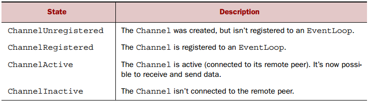

##
##　　Channel的生命周期如下图所示。

##
##　　 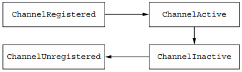

##
##　　当状态发生变化时，就会产生相应的事件。

##
##　　2. ChannelHandler的生命周期

##
##　　ChannelHandler定义的生命周期如下图所示。

##
##　　 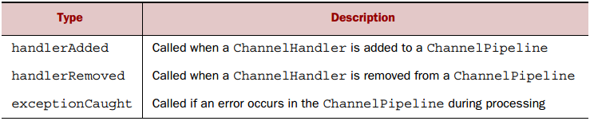

##
##　　Netty定义了ChannelHandler的两个重要的子类

##
##　　　　· ChannelInboundHandler，处理各种入站的数据和状态的变化。

##
##　　　　· ChannelOutboundHandler，处理出站数据并允许拦截的所有操作。

##
##　　3. ChannelInboundHandler接口

##
##　　下图展示了ChannelInboundHandler接口生命周期中的方法，当接受到数据或者其对应的Channel的状态发生变化则会调用方法

##
##　　 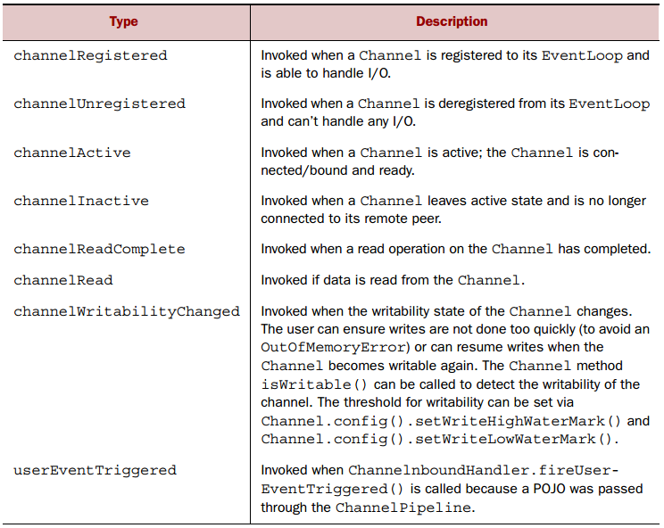

##
##　　当ChannelInboundHandler的实现覆盖channelRead()方法时，它负责显式释放与池的ByteBuf实例相关联的内存，可以使用ReferenceCountUtil.release() 方法进行释放。如下代码展示了该方法的使用。

	public class DiscardHandler extends ChannelInboundHandlerAdapter {
    @Override
    public void channelRead(ChannelHandlerContext ctx, Object msg) {
        ReferenceCountUtil.release(msg);
    	}
	}


##
##　　上述显式的释放内存空间会显得比较麻烦，而如下代码则无需显式释放内存空间。　　

	@Sharable
public class SimpleDiscardHandler
    extends SimpleChannelInboundHandler<Object> {
    @Override
    public void channelRead0(ChannelHandlerContext ctx,
        Object msg) {
            // No need to do anything special
    	}
	}


##
##　　上述代码中，SimpleChannelInboundHandler会自动释放资源，因此无需显式释放。

##
##　　4. ChannelOutboundHandler接口

##
##　　ChannelOutboundHandler处理出站操作和数据，它的方法会被Channel、ChannelPipeline、ChannelHandlerContext触发。ChannelOutboundHandler可按需推迟操作或事件。例如对远程主机的写入被暂停，你可以延迟刷新操作并在稍后重启。

##
##　　5. ChannelHandler适配器

##
##　　可以使用ChannelInboundHandlerAdapter和ChannelOutboundHandlerAdapter类作为自己的ChannelHandler程序的起点，这些适配器提供了ChannelInboundHandler和ChannelOutboundHandler的简单实现，它们继承了共同父类接口ChannelHandler的方法，其继承结构如下图所示

##
##　　 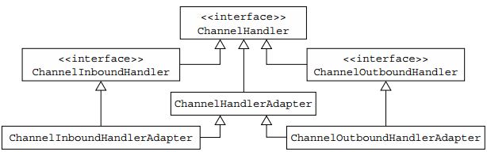

##
##　　ChannelHandlerAdapter还提供了isSharable方法，如果有Sharable注释则会返回true，这也表明它可以被添加至多个ChannelPipiline中。ChannelInboundHandlerAdapter and ChannelOutboundHandlerAdapter的方法体中会调用ChannelHandlerContext对应的方法，因此可以将事件传递到管道的下个ChannelHandler中。

##
##　　6. 资源管理

##
##　　无论何时调用ChannelInboundHandler.channelRead()和ChannelOutboundHandler.write()方法，都需要保证没有资源泄露，由于Netty使用引用计数来管理ByteBuf，因此当使用完ByteBuf后需要调整引用计数。

##
##　　为了诊断可能出现的问题，Netty提供了ResourceLeakDetector，它将抽取应用程序大约1％的缓冲区分配来检查内存泄漏，其额外的开销很小，内存检测有如下四种级别

##
##　　 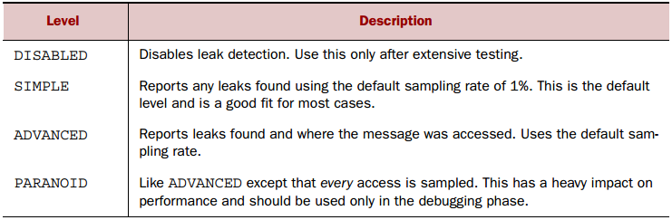

##
##　　可以通过java -Dio.netty.leakDetectionLevel=ADVANCED 设置内存检测级别。

##
##　　当读取数据时，可以在readChannel方法中调用ReferenceCountUtil.release(msg)方法释放资源，或者实现SimpleChannelInboundHandler（会自动释放资源）；而当写入数据时，可以在write方法中调用ReferenceCountUtil.release(msg)释放资源，具体代码如下　

	@Sharable
public class DiscardOutboundHandler
    extends ChannelOutboundHandlerAdapter {
        @Override
        public void write(ChannelHandlerContext ctx,
            Object msg, ChannelPromise promise) {
            ReferenceCountUtil.release(msg);
            promise.setSuccess();
        	}
	}


##
##　　不仅需要释放资源，并且需要通知ChannelPromise，否则ChannelFutureListener可能收不到事件已经被处理的通知。如果消息到达实际的传输层，就可以在写操作完成或者关闭通道时会自动释放资源。

##
##　　2.2ChannelPipeline接口

##
##　　如果将ChannelPipeline视为ChannelHandler实例链，可拦截流经通道的入站和出站事件，即可明白ChannelHandler之间的交互是如何构成应用程序数据和事件处理逻辑的核心的。当创建一个新的Channel时，都会分配了一个新的ChannelPipeline，该关联是永久的，该通道既不能附加另一个ChannelPipeline也不能分离当前的ChannelPipeline。

##
##　　一个事件要么被ChannelInboundHander处理，要么被ChannelOutboundHandler处理，随后，它将通过调用ChannelHandlerContext的实现来将事件转发至同一超类型的下一个处理器。ChannelHandlerContext允许ChannelHandler与其ChannelPipeline和其他ChannelHandler进行交互，一个处理器可以通知ChannelPipeline中的下一个处理器，甚至可以修改器隶属于的ChannelPipeline。

##
##　　下图展示了ChannelHandlerPipeline、ChannelInboundHandler和ChannelOutboundHandler之间的关系

##
##　　 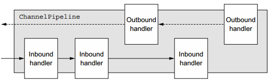

##
##　　可以看到ChannelPipeline是由一系列ChannelHandlers组成，其还提供了通过自身传播事件的方法，当进站事件触发时，其从ChannelPipeline的头部传递到尾部，而出站事件会从右边传递到左边。

##
##　　当管道传播事件时，其会确定下一个ChannelHandler的类型是否与移动方向匹配，若不匹配，则会跳过并寻找下一个，直至找到相匹配的ChannelHandler（一个处理器可以会同时实现ChannelInboundHandler和ChannelOutboundHandler）。

##
##　　1. 修改ChannelPipeline

##
##　　ChannelHandler可实时修改ChannelPipeline的布局，如添加、删除、替换其他ChannelHandler（其可从ChannelPipeline中移除自身），如如下图所示的方法。

##
##　　 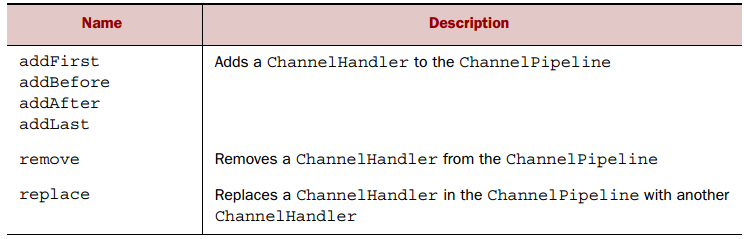

##
##　　通常，ChannelPipeline中的每个ChannelHandler通过其EventLoop（I / O线程）处理传递给它的事件，不要阻塞该线程，因为它会对I/O的整体处理产生负面影响。

##
##　　2.3ChannelHandlerContext接口

##
##　　ChannelHandlerContext代表了ChannelHandler与ChannelPipeline之间的关联，当ChannelHandler被添加至ChannelPipeline中时其被创建，ChannelHandlerContext的主要功能是管理相关ChannelHandler与同一ChannelPipeline中的其他ChannelHandler的交互。

##
##　　ChannelHandlerContext中存在很多方法，其中一些也存在于ChannelHandler和ChannelPipeline中，但是差别很大。如果在ChannelHandler或者ChannelPipeline中调用该方法，它们将在整个管道中传播，而如果在ChannelHandlerContext中调用方法，那么会仅仅传递至下个能处理该事件的ChannelHandler。

##
##　　1. 使用ChannelHandlerContext

##
##　　ChannelHandlerContext、ChannelHandler、ChannelHandlerContext、Channel之间的关系如下图所示

##
##　　 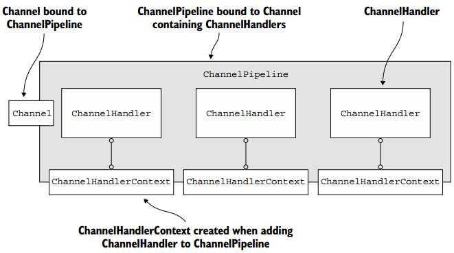

##
##　　可以通过ChannelHandlerContext来访问Channel，并且当调用Channel的write方法时，写事件会在管道中传递，代码如下　

	ChannelHandlerContext ctx = ..;
Channel channel = ctx.channel();
channel.write(Unpooled.copiedBuffer("Netty in Action",
CharsetUtil.UTF_8));


##
##　　除了使用Channel的write方法写入数据外，还可以使用ChannelPipeline的write方法写入数据，代码如下　

	ChannelHandlerContext ctx = ..;
ChannelPipeline pipeline = ctx.pipeline();
pipeline.write(Unpooled.copiedBuffer("Netty in Action",
CharsetUtil.UTF_8));


##
##　　上述两段代码在管道中产生的效果相同，如下图所示。

##
##　　 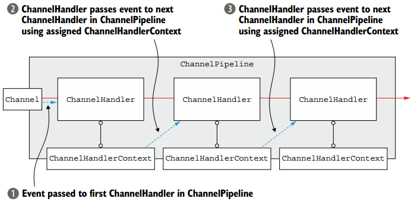

##
##　　其中两种方法的写事件都会通过ChannelHandlerContext在管道中传播。

##
##　　若想从指定的ChannelHandler开始传递事件，那么需要引用到指定ChannelHandler之前的一个ChannelHandlerContext，该ChannelHandlerContext将调用其关联的ChannelHandler。

##
##　　如下图所示，展示了从指定ChannelHandler开始处理事件。

##
##　　 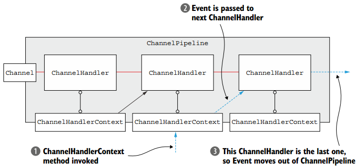

##
##　　2.ChannelHandler和ChannelHandlerContext的高级用法

##
##　　可以通过调用ChannelHandlerContext的pipeline方法获得其对应的ChannelPipeline引用，这可以在运行中管理ChannelHandler，如添加一个ChannelHandler。

##
##　　另一种高级用法是缓存ChannelHandlerContext的引用，以供之后使用。如下代码展示了用法　

	public class WriteHandler extends ChannelHandlerAdapter {
    private ChannelHandlerContext ctx;
    @Override
    public void handlerAdded(ChannelHandlerContext ctx) {
        this.ctx = ctx;
    	}

    public void send(String msg) {
        ctx.writeAndFlush(msg);
    	}
	}        


##
##　　因为ChannelHandler可以属于多个ChannelPipeline，所以它可以绑定到多个ChannelHandlerContext实例，当使用时必须使用@Sharable注释，否则，当将其添加至多个ChannelPipeline时会抛出异常。如下代码所示　　

	@Sharable
public class SharableHandler extends ChannelInboundHandlerAdapter {
    @Override
    public void channelRead(ChannelHandlerContext ctx, Object msg) {
        System.out.println("Channel read message: " + msg);
        ctx.fireChannelRead(msg);
    	}
	}


##
##　　@Sharable注释没有任何状态，而如下代码会出现错误。　　

	@Sharable
public class UnsharableHandler extends           
    ChannelInboundHandlerAdapter {
    private int count;
    @Override
    public void channelRead(ChannelHandlerContext ctx, Object msg) {
        count++;
        System.out.println("channelRead(...) called the "
            + count + " time");
        ctx.fireChannelRead(msg();
    	}
	}


##
##　　由于上述代码包含了状态，即count计数，将此类的实例添加到ChannelPipeline时，在并发访问通道时很可能会产生错误。可通过在channelRead方法中进行同步来避免错误。

##
##　　2.4 异常处理

##
##　　在出站和进站时，可能会发生异常，Netty提供了多种方法处理异常。

##
##　　1. 处理进站异常

##
##　　当处理进站事件时发生异常，它将从ChannelInboundHandler中被触发的位置开始流过ChannelPipeline，为处理异常，需要在实现ChannelInboundHandler接口是重写exceptionCaught方法。如下示例所示。　　

	public class InboundExceptionHandler extends ChannelInboundHandlerAdapter {
    @Override
    public void exceptionCaught(ChannelHandlerContext ctx,
        Throwable cause) {
        cause.printStackTrace();
        ctx.close();
    	}
	}


##
##　　由于异常会随着进站事件在管道中传递，包含异常处理的ChannelHandler通常放在了管道的尾部，因此可以保证无论异常发生在哪个ChannelHandler中，其最终都会被处理。

##
##　　2. 处理出站异常

##
##　　在出站操作中处理的正常完成和处理异常都基于以下通知机制。

##
##　　　　· 每个出站操作返回一个ChannelFuture，在ChannelFuture注册的ChannelFutureListeners在操作完成时通知成功或错误。

##
##　　　　· ChannelOutboundHandler的几乎所有方法都会传递ChannelPromise实例，ChannelPromise是ChannelFuture的子类，其也可以为异步通知分配监听器，并ChannelPromise还提供可写的方法来提供即时通知。可通过调用ChannelFuture实例的addListener(ChannelFutureListener)方法添加一个ChannelFutureListener，最常用的是调用出站操作所返回的ChannelFuture的addListener方法，如write方法，具体代码如下所示。　　

	ChannelFuture future = channel.write(someMessage);
future.addListener(new ChannelFutureListener() {
    @Override
    public void operationComplete(ChannelFuture f) {
        if (!f.isSuccess()) {
            f.cause().printStackTrace();
            f.channel().close();
        	}
    	}
	});


##
##　　第二种方法是将ChannelFutureListener添加到ChannelPromise中，并将其作为参数传递给ChannelOutboundHandler的方法，具体代码如下所示　　

	public class OutboundExceptionHandler extends ChannelOutboundHandlerAdapter {
    @Override
    public void write(ChannelHandlerContext ctx, Object msg,
        ChannelPromise promise) {
        promise.addListener(new ChannelFutureListener() {
            @Override
            public void operationComplete(ChannelFuture f) {
                if (!f.isSuccess()) {
                    f.cause().printStackTrace();
                    f.channel().close();
                	}
            	}
        	});
    	}
	}


##
##三、总结

##
##　　本篇博文讲解了ChannelHandler，以及其与ChannelPipeline、ChannelHandlerContext之间的关系，及其之间的交互，同时还了解了如何处理进站与出站时所抛出的异常。谢谢各位园友的观看~