**一、前言**

前面学习了Netty的codec框架，下面接着学习ChannelHandler与codec之间的关联。

**二、ChannelHandler和codec**

Netty为不同的协议提供了处理器和编解码器，可以开箱即用，这些工具支持SSL / TLS和WebSocket，以及通过数据压缩使得HTTP有更好的性能。

2.1 使用SSL/TLS保护Netty应用程序

由于数据隐私非常重要，而SSL和TLS等加密协议用于处理数据隐私，这些协议在其他协议之上以实现数据安全性。安全网站会使用这种协议，同时，不基于HTTP的应用程序，如安全SMTP（SMTPS）邮件服务甚至关系数据库系统也会用到这些协议。  

为支持SSL/TLS协议，Java提供了javax.net.ssl包，其SSLContext和SSLEngine类使得实现解密和加密变得相当直接容易。而Netty使用SslHandler的ChannelHandler实现，其内部是使用SSLEngine来进行实际工作。

下图展示了通过SslHandler的数据流。  

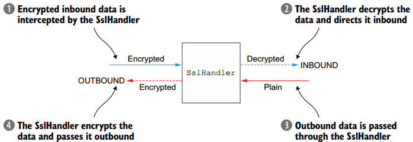

下面代码展示如何通过ChannelInitializer将SslHandler添加至ChannelPipeline中。

    
    
    public class SslChannelInitializer extends ChannelInitializer<Channel>{
        private final SslContext context;
        private final boolean startTls;
        
        public SslChannelInitializer(SslContext context,
            boolean startTls) {
            this.context = context;
            this.startTls = startTls;
        }
        @Override
        protected void initChannel(Channel ch) throws Exception {
            SSLEngine engine = context.newEngine(ch.alloc());
            ch.pipeline().addFirst("ssl",
            　　new SslHandler(engine, startTls));
        }
    }

在大多数情况下，SslHandler都是ChannelPipeline中的第一个ChannelHandler，只有当所有其他ChannelHandler将其逻辑应用于数据之后，才能进行加密操作。

2.2 构建Netty的HTTP/HTTPS应用程序

HTTP/HTTPS是最常见的协议套件之一，许多Web Service API都是基于HTTP/HTTPS的。

1\. HTTP的decoder、encoder、codec

HTTP基于请求/响应模式：客户端发送HTTP请求至服务端，服务端响应HTTP请求至客户端。Netty提供各种编码器和解码器以简化使用此协议。

下图展示了HTTP请求的组成部分。

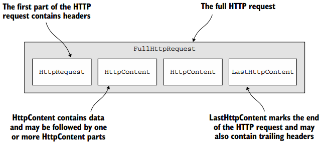

而下图展示了HTTP响应的组成部分。

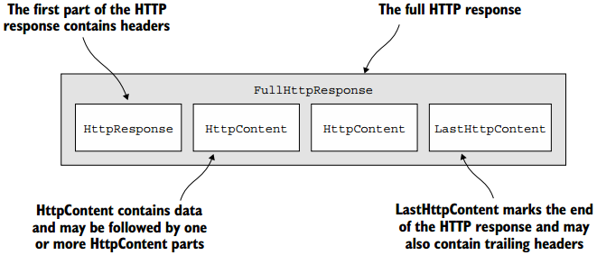

下面代码的HttpPipelineInitializer可以为应用提供HTTP支持，仅仅只需要往ChannelPipeline中添加正确的ChannelHandler即可。

    
    
    public class HttpPipelineInitializer extends ChannelInitializer<Channel> {
        private final boolean client;
        public HttpPipelineInitializer(boolean client) {
            this.client = client;
        }
        @Override
        protected void initChannel(Channel ch) throws Exception {
            ChannelPipeline pipeline = ch.pipeline();
            if (client) {
                pipeline.addLast("decoder", new HttpResponseDecoder());
                pipeline.addLast("encoder", new HttpRequestEncoder());
            } else {
                pipeline.addLast("decoder", new HttpRequestDecoder());
                pipeline.addLast("encoder", new HttpResponseEncoder());
            }
        }
    }

2\. HTTP消息聚合

当管道中的处理器被初始化后，就可以处理不同的消息，但由于HTTP请求和响应由多部分组成，需要将这些部分汇聚成完整的结果，Netty提供了一个合成器，其可以消息的不同部分组合成FullHttpRequest和FullHttpResponse。由于消息在完整之前需要被缓存，因此其会带来小小的开销，但是不用担心消息的碎片化处理。

下面代码展示了如何自动化装配消息。

    
    
    public class HttpAggregatorInitializer extends ChannelInitializer<Channel> {
        private final boolean isClient;
        public HttpAggregatorInitializer(boolean isClient) {
            this.isClient = isClient;
        }
        @Override
        protected void initChannel(Channel ch) throws Exception {
            ChannelPipeline pipeline = ch.pipeline();
            if (isClient) {
                pipeline.addLast("codec", new HttpClientCodec());
            } else {
                pipeline.addLast("codec", new HttpServerCodec());
            }
            pipeline.addLast("aggregator",
                new HttpObjectAggregator(512 * 1024));
        }
    }

3\. HTTP压缩

使用HTTP时，建议采用压缩来尽可能减少传输数据的大小。Netty为压缩和解压缩提供了ChannelHandler的实现，其支持gzip和deflate编码。

如下代码展示了如何自动压缩HTTP消息。

    
    
    public class HttpCompressionInitializer extends ChannelInitializer<Channel> {
        private final boolean isClient;
        public HttpCompressionInitializer(boolean isClient) {
            this.isClient = isClient;
        }
        @Override
        protected void initChannel(Channel ch) throws Exception {
            ChannelPipeline pipeline = ch.pipeline();
            if (isClient) {
                pipeline.addLast("codec", new HttpClientCodec());
                pipeline.addLast("decompressor",
                new HttpContentDecompressor());
            } else {
                pipeline.addLast("codec", new HttpServerCodec());
                pipeline.addLast("compressor",
                    new HttpContentCompressor());
            }
        }
    }

4\. 使用HTTPS

当混合了SslHandler时就可以使用HTTPS，代码如下。

    
    
    public class HttpsCodecInitializer extends ChannelInitializer<Channel> {
        private final SslContext context;
        private final boolean isClient;
        public HttpsCodecInitializer(SslContext context, boolean isClient) {
            this.context = context;
            this.isClient = isClient;
        }
        @Override
        protected void initChannel(Channel ch) throws Exception {
            ChannelPipeline pipeline = ch.pipeline();
            SSLEngine engine = context.newEngine(ch.alloc());
            pipeline.addFirst("ssl", new SslHandler(engine));
            if (isClient) {
                pipeline.addLast("codec", new HttpClientCodec());
            } else {
                pipeline.addLast("codec", new HttpServerCodec());
            }
        }
    }

5\. WebSocket  

Netty为基于HTTP的应用程序提供了支持，WebSocket解决了长期存在的问题：如果底层使用HTTP协议，是一系列请求-
响应交互，那么如何实时发布信息。AJAX提供了一些改进，但是数据流的驱动仍然来自客户端的请求。而WebSocket规范及其实现代表了一种更有效的解决方案，其为双向流量提供了一个单一的TCP连接，其在客户端和服务器之间提供真正的双向数据交换，并且可以处理任何类型的数据。

下图展示了WebSocket协议，开始数据通信为纯HTTP，之后升级到双向WebSocket。

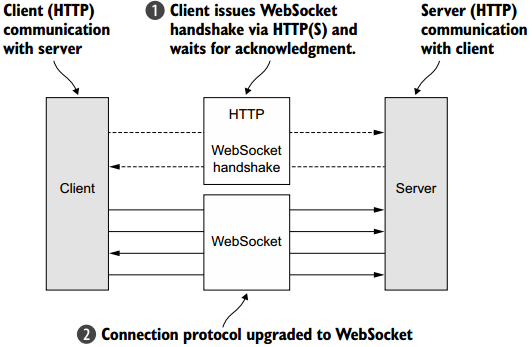

为了应用中添加WebSocket支持，可以在管道中添加WebSocketFrames，其包含如下类型。  

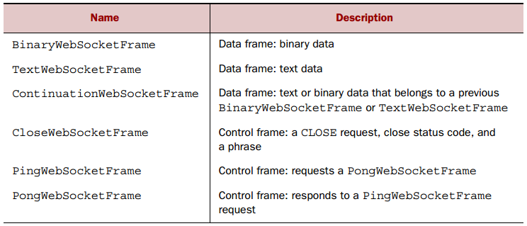

下面代码展示了如何使用WebSocketServerProtocolHandler。

    
    
    public class WebSocketServerInitializer extends ChannelInitializer<Channel>{
        @Override
        protected void initChannel(Channel ch) throws Exception {
            ch.pipeline().addLast(
                new HttpServerCodec(),
                new HttpObjectAggregator(65536),
                new WebSocketServerProtocolHandler("/websocket"),
                new TextFrameHandler(),
                new BinaryFrameHandler(),
                new ContinuationFrameHandler());
        }
        public static final class TextFrameHandler extends
            SimpleChannelInboundHandler<TextWebSocketFrame> {
            @Override
            public void channelRead0(ChannelHandlerContext ctx,
                TextWebSocketFrame msg) throws Exception {
                // Handle text frame
            }
    }
    
    public static final class BinaryFrameHandler extends
        SimpleChannelInboundHandler<BinaryWebSocketFrame> {
        @Override
        public void channelRead0(ChannelHandlerContext ctx,
            BinaryWebSocketFrame msg) throws Exception {
            // Handle binary frame
        }
    }
    
    public static final class ContinuationFrameHandler extends
        SimpleChannelInboundHandler<ContinuationWebSocketFrame> {
        @Override
        public void channelRead0(ChannelHandlerContext ctx,
            ContinuationWebSocketFrame msg) throws Exception {
                // Handle continuation frame
            }
        }
    }

而为了保证WebSocket的安全性，可以将SslHandler作为管道中的第一个处理器。

2.3 空闲连接和超时

检测空闲连接和超时对于及时释放资源至关重要，Netty提供了几个处理器进行处理，如IdleStateHandler、ReadTimeoutHandler、WriteTimeoutHandler等。

首先看看IdleStateHandler的原因，如果60S内没有接受或发送数据，如何接收通知，可以使用向远程对等体发送心跳消息来获取通知;
如果没有响应，则连接被关闭。

    
    
    public class IdleStateHandlerInitializer extends ChannelInitializer<Channel> {
        @Override
        protected void initChannel(Channel ch) throws Exception {
            ChannelPipeline pipeline = ch.pipeline();
            pipeline.addLast(
                new IdleStateHandler(0, 0, 60, TimeUnit.SECONDS));
            pipeline.addLast(new HeartbeatHandler());
        }
        public static final class HeartbeatHandler
            extends ChannelStateHandlerAdapter {
            private static final ByteBuf HEARTBEAT_SEQUENCE =
                Unpooled.unreleasableBuffer(Unpooled.copiedBuffer(
                    "HEARTBEAT", CharsetUtil.ISO_8859_1));
            @Override
            public void userEventTriggered(ChannelHandlerContext ctx,
                Object evt) throws Exception {
                if (evt instanceof IdleStateEvent) {
                    ctx.writeAndFlush(HEARTBEAT_SEQUENCE.duplicate())
                    .addListener(
                        ChannelFutureListener.CLOSE_ON_FAILURE);
                } else {
                    super.userEventTriggered(ctx, evt);
                }
            }
        }
    }

2.4 解码限定的和基于长度的协议

1\. 限定的协议

限定消息协议使用指定的字符来标记称为帧的消息或消息段的开始或结束位置，如如SMTP，POP3，IMAP和Telnet均使用该协议。如下的两个解码器用于处理限定的和基于长度的协议。

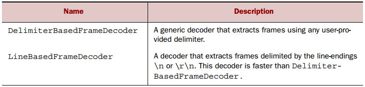

下图显示了如何以行尾序列\ r \ n（回车+换行）分隔符来处理帧。

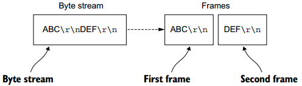

如下代码展示了如何使用LineBasedFrameDecoder。

    
    
    public class LineBasedHandlerInitializer extends ChannelInitializer<Channel> {
        @Override
        protected void initChannel(Channel ch) throws Exception {
            ChannelPipeline pipeline = ch.pipeline();
            pipeline.addLast(new LineBasedFrameDecoder(64 * 1024));
            pipeline.addLast(new FrameHandler());
        }
        public static final class FrameHandler
            extends SimpleChannelInboundHandler<ByteBuf> {
            @Override
            public void channelRead0(ChannelHandlerContext ctx,
                ByteBuf msg) throws Exception {
                // Do something with the data extracted from the frame
            }
        }
    }

DelimiterBasedFrameDecoder类可以自定义字符来处理数据。  

2\. 基于长度的协议

基于长度的协议通过在帧的头部对其长度进行编码来定义帧，而不是通过用特殊的分隔符标记其结尾，如下两个类用于处理该协议。

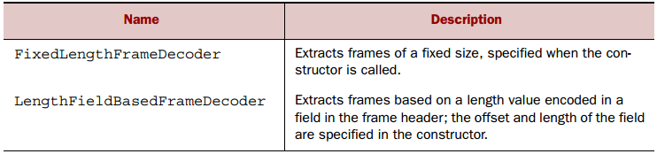

下图展示了FixedLengthFrameDecoder的操作，每帧由8个字节构成。  

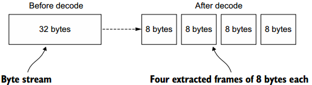

对于可变长度的帧，可以使用LengthFieldBasedFrameDecoder进行处理，其从头部字段确定帧长度，并从数据流中提取指定的字节数。

下图展示了长度字段在头部的偏移量0并且具有2字节。

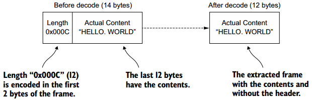

2.5 写大数据

由于网络原因，异步框架中的写入大量数据将存在问题，因为写入操作是非阻塞的，在写入完成时或者所有的数据都没有被写出就会通知ChannelFuture，此时，若不停止写入数据，可能会造成内存溢出，因此，在写入大量数据时，需要处理与远程对等体连接缓慢可能导致内存释放延迟的情况。FileRegion支持零拷贝文件传输的通道。

下面是FileRegion的使用示例。

    
    
    FileInputStream in = new FileInputStream(file);
    FileRegion region = new DefaultFileRegion(
        in.getChannel(), 0, file.length());
    channel.writeAndFlush(region).addListener(
        new ChannelFutureListener() {
        @Override
        public void operationComplete(ChannelFuture future)
            throws Exception {
            if (!future.isSuccess()) {
                Throwable cause = future.cause();
                // Do something
            }
        }
    });

此示例仅适用于文件内容的直接传输，不包括应用程序对数据的任何处理，若需要将数据从文件系统复制到用户内存，可以使用ChunkedWriteHandler，它支持异步编写大型数据流，而不会导致高内存消耗。

其核心是ChunkedInput<B>接口，B代码readChunk的返回类型，对于ChunkedInput<B>，有如下的四种实现。  

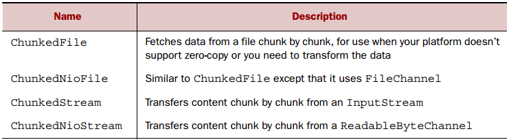

如下是ChunkedStream的使用示例。

    
    
    public class ChunkedWriteHandlerInitializer
        extends ChannelInitializer<Channel> {
        private final File file;
        private final SslContext sslCtx;
        
        public ChunkedWriteHandlerInitializer(File file, SslContext sslCtx) {
            this.file = file;
            this.sslCtx = sslCtx;
        }
        @Override
        protected void initChannel(Channel ch) throws Exception {
            ChannelPipeline pipeline = ch.pipeline();
            pipeline.addLast(new SslHandler(sslCtx.createEngine());
            pipeline.addLast(new ChunkedWriteHandler());
            pipeline.addLast(new WriteStreamHandler());
        }
        
        public final class WriteStreamHandler
            extends ChannelInboundHandlerAdapter {
            @Override
            public void channelActive(ChannelHandlerContext ctx)
                throws Exception {
                super.channelActive(ctx);
                ctx.writeAndFlush(
                new ChunkedStream(new FileInputStream(file)));
            }
        }
    }

2.6 序列化数据

JDK提供了ObjectOutputStream和ObjectInputStream对POJO的原始数据类型和图形进行序列化和反序列化，但其并不高效。

1\. JDK序列化

当应用程序必须与使用ObjectOutputStream和ObjectInputStream与对等体进行交互时，首先应该考虑兼容性，此时JDK的序列化是正确的选择。下图展示了Netty与JDK进行互操作的序列化类。

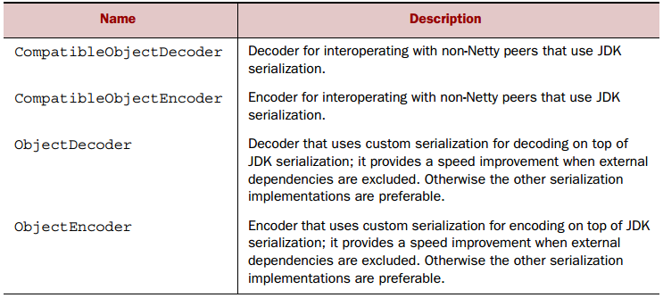

2\. JBOSS序列化

JBOSS比JDK序列化快三倍，并且更为紧凑，Netty使用如下两个编解码器来支持JBOSS。

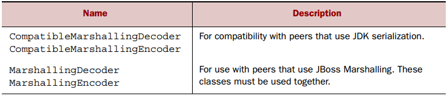

如下代码展示了如何使用JBOSS进行序列化操作。

    
    
    public class MarshallingInitializer extends ChannelInitializer<Channel> {
        private final MarshallerProvider marshallerProvider;
        private final UnmarshallerProvider unmarshallerProvider;
        public MarshallingInitializer(
            UnmarshallerProvider unmarshallerProvider,
            MarshallerProvider marshallerProvider) {
            this.marshallerProvider = marshallerProvider;
            this.unmarshallerProvider = unmarshallerProvider;
        }
        @Override
        protected void initChannel(Channel channel) throws Exception {
            ChannelPipeline pipeline = channel.pipeline();
            pipeline.addLast(new MarshallingDecoder(unmarshallerProvider));
            pipeline.addLast(new MarshallingEncoder(marshallerProvider));
            pipeline.addLast(new ObjectHandler());
        }
        public static final class ObjectHandler
            extends SimpleChannelInboundHandler<Serializable> {
            @Override
            public void channelRead0(
                ChannelHandlerContext channelHandlerContext,
                Serializable serializable) throws Exception {
                // Do something
            }
        }
    }

3\. Protobuf序列化

Netty还可使用协议缓冲区进行序列化操作，其由谷歌开发，协议缓冲区以紧凑和高效的方式对结构化数据进行编码和解码，下图显示了Netty为支持protobuf而实现的ChannelHandler。

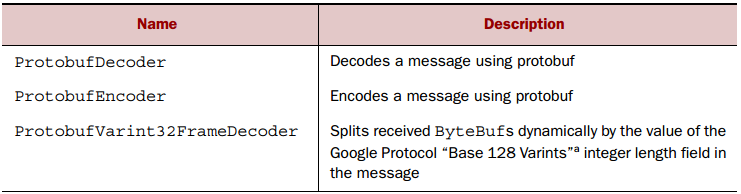

下面示例展示了如何使用protobuf。

    
    
    public class ProtoBufInitializer extends ChannelInitializer<Channel> {
        private final MessageLite lite;
        public ProtoBufInitializer(MessageLite lite) {
            this.lite = lite;
        }
        @Override
        protected void initChannel(Channel ch) throws Exception {
            ChannelPipeline pipeline = ch.pipeline();
            pipeline.addLast(new ProtobufVarint32FrameDecoder());
            pipeline.addLast(new ProtobufEncoder());
            pipeline.addLast(new ProtobufDecoder(lite));
            pipeline.addLast(new ObjectHandler());
        }
        public static final class ObjectHandler
            extends SimpleChannelInboundHandler<Object> {
            @Override
            public void channelRead0(ChannelHandlerContext ctx, Object msg)
                throws Exception {
                // Do something with the object
            }
        }
    }

**三、总结**

本篇博文讲解了如何保证Netty应用程序的安全性，以及如何处理不同协议的数据，以及编解码器和ChannelHandler之间的关系，以及如何把编解码器添加至管道中进行处理。也谢谢各位园友的观看~

