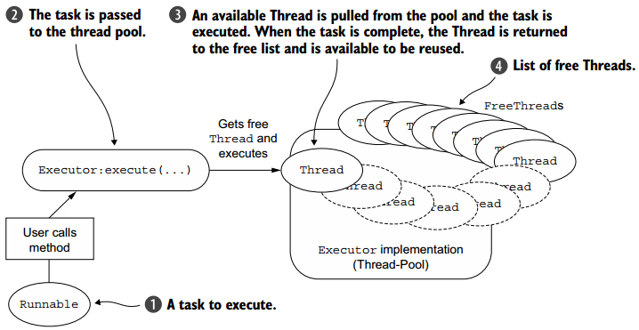
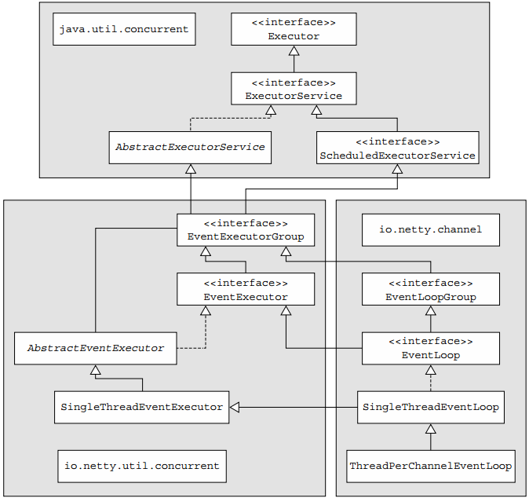
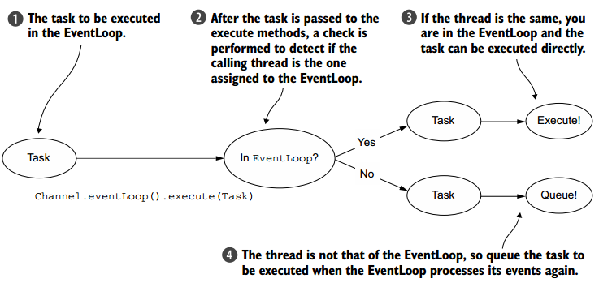
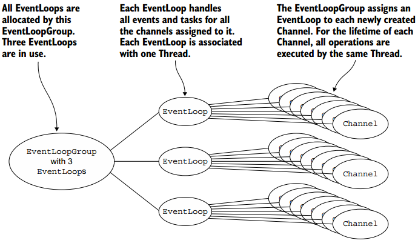
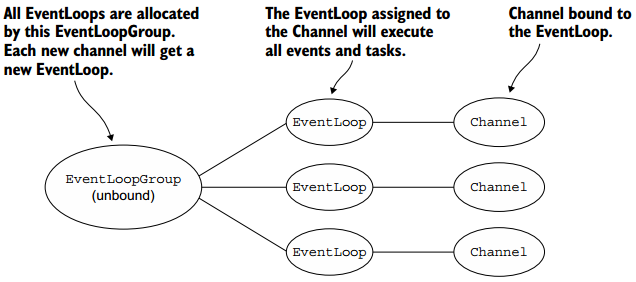

##【Netty】EventLoop和线程模型

##
##一、前言

##
##　　在学习了ChannelHandler和ChannelPipeline的有关细节后，接着学习Netty的EventLoop和线程模型。

##
##二、EventLoop和线程模型

##
##　　2.1. 线程模型

##
##　　线程池可通过缓存和复用已有线程来提高系统性能，基本的缓冲池模式可描述如下：

##
##　　　　· 从池中空闲链表中选取线程，然后将其分配赋予给已提交的任务。

##
##　　　　· 当线程完成工作时，该线程又返回至空闲链表，可再进行复用。

##
##　　该模式如下图所示。

##
##　　 

##
##　　池化和复用线程是针对每个任务都需要创建和销毁线程的改进，但还是需要进行上下文切换，并且随着线程数量的增加，其负担也会增加。同时，在高并发下也会出现很多线程问题。

##
##　　2.2.EventLoop接口

##
##　　任何网络框架的基本功能都是运行任务来处理在连接声明周期中所发生的事件，相应的编程结构通常被称为事件循环。事件循环的基本思想如下代码所示，每个任务都是一个Runnable实例。　　

	while (!terminated) {
    List<Runnable> readyEvents = blockUntilEventsReady();
    for (Runnable ev: readyEvents) {
        ev.run();
    	}
	}


##
##　　Netty的EventLoop是使用concurrency和networking两个基本API的协作设计的一部分，Netty中的io.netty.util.concurrent 包基于JDK的java.util.concurrent包进行设计。另外，io.netty.channel包中的类也继承它们，以便与其事件相关联，具体继承关系如下图所示。

##
##　　 

##
##　　在这个模型中，EventLoop由一个永不改变的线程驱动，任务（Runnable或Callable）可以直接提交给EventLoop的实现，以便立即执行或有计划地执行。根据配置和可用内核，可以创建多个EventLoops以优化资源使用，并且可以为单个EventLoop分配服务多个通道。

##
##　　事件和任务以FIFO的方式被执行，这通过保证以正确的顺序处理字节内容来消除数据损坏的可能性。

##
##　　1. Netty 4中的I/O和事件处理

##
##　　由I/O操作触发的事件流过具有一个或多个ChannelHandler的ChannelPipeline时，传播这些事件的方法调用可以由ChannelHandler拦截，并根据需要进行处理，根据事件的不同，需要进行不同的处理，但事件处理逻辑必须具有通用性和灵活性，以处理所有可能的用例，因此，在Netty 4中，所有的I/O操作和事件都由已分配给EventLoop的线程处理。

##
##　　2. Netty 3中的I/O处理

##
##　　以前版本中使用的线程模型仅保证入站（上游）事件将在所谓的I/O线程中执行，所有出站（下游）事件由调用线程处理，其需要在ChannelHandlers中仔细同步出站事件，因为不可能保证多个线程不会同时尝试访问出站事件。

##
##　　2.3任务调度

##
##　　有时需要让一个任务稍后（延迟）或定期执行，一个常见的用例是向远程对等体发送心跳消息，以检查连接是否仍然存在。

##
##　　1. JDK调度API

##
##　　在Java 5之前，任务调度基于java.util.Timer构建，其使用后台线程，与标准线程具有相同的限制，随后，Java提供了ScheduledExecutorService接口，如下代码在60S后执行任务。　　

	ScheduledExecutorService executor = Executors.newScheduledThreadPool(10);
ScheduledFuture<?> future = executor.schedule(
    new Runnable() {
        @Override
        public void run() {
            System.out.println("60 seconds later");
        	}
    	}, 60, TimeUnit.SECONDS);
    
executor.shutdown();


##
##　　2. 使用EventLoop调度任务

##
##　　ScheduledExecutorService实现有限制，如为管理池需要创建额外的线程，如果许多任务被调度，这可能会成为系统性能瓶颈。Netty通过使用Channel的EventLoop调度来解决这个问题，如下代码所示。　　

	Channel ch = ...
ScheduledFuture<?> future = ch.eventLoop().schedule(
    new Runnable() {
    @Override
    public void run() {
        System.out.println("60 seconds later");
    	}
	}, 60, TimeUnit.SECONDS);


##
##　　60秒后，Runnable实例将由分配给该Channel的EventLoop执行。若想每隔60S执行任务，则需要做如下处理。　　

	Channel ch = ...
ScheduledFuture<?> future = ch.eventLoop().scheduleAtFixedRate(
    new Runnable() {
    @Override
    public void run() {
        System.out.println("Run every 60 seconds");
    	}
	}, 60, 60, TimeUnit.Seconds);


##
##　　因为EventLoop继承ScheduledExecutorService，因此可以调用ScheduledExecutorService的所有方法。

##
##　　2.4 实现细节

##
##　　1. 线程管理

##
##　　Netty的线程模型的优越性能取决于确定当前正在执行的线程的身份，即是否为分配给当前Channel及其EventLoop的线程。如果调用的是EventLoop的线程，那么直接执行该代码块，否则，EventLoop调度一个任务以供稍后执行，并将其放入内部队列中，当处理下个事件时，会处理队列中的事件，这解释了任何线程为何可以直接与Channel交互，而不需要在ChannelHandler中同步。

##
##　　每个EventLoop都有自己的任务队列，与其他EventLoop独立，下图显示了EventLoop的执行逻辑。

##
##　　 

##
##　　不要把长时间的任务放在执行队列中，因为它将阻止任何其他任务在同一个线程上执行。如果必须进行阻塞调用或执行长时间运行的任务，建议使用专用的EventExecutor。

##
##　　2. EventLoop/线程的分配

##
##　　为通道的I/O和事件提供服务的EventLoops包含在EventLoopGroup，EventLoops创建和分配的方式根据传输实现（异步和阻塞）而有所不同。

##
##　　· 异步传输。只使用少量的EventLoopGroup，在当前的模型中其在通道中共享。这允许通道由最小数量的线程提供服务，而不是为每个通道分配一个线程。下图展示了包含三个EventLoop（每个EventLoop由一个线程驱动）的EventLoopGroup，EventLoopGroup创建时会直接分配EventLoops（及其线程），以确保它们在需要时可用，EventLoopGroup负责将EventLoop分配给每个新创建的通道，当前的实现是使用循环方法实现均衡分配，相同的EventLoop可被分配给多个通道。

##
##　　 

##
##　　一旦一个Channel被分配了一个EventLoop，它将在其生命周期中一直使用这个EventLoop（和相关联的线程）。同时请注意EventLoop的分配对ThreadLocal影响，因为一个EventLoop通常驱动多个通道，多个通道的ThreadLocal也相同。

##
##　　· 阻塞传输。OIO的实现与异步传输的实现大不相同，其如下图所示。

##
##　　 

##
##　　每个通道将会分配一个EventLoop（以及相关线程），Channel的IO事件将由独立的线程处理。

##
##三、总结

##
##　　本篇博文讲解了EventLoop及其线程模型，以及其与通道之间的关系，EventLoopGroup可对应多个EventLoop，一个EventLoop对应一个线程，一个EventLoop可对应多个通道。也谢谢各位园友的观看~